# Une session extraordinaire le samedi renforce la capacité de l'État : doublement des peines pour les gangs et expulsions basées sur le comportement approuvés

**Classification**: PUBLIC  
**Cykel**: realtime-monitor · **Riksmöte**: 2025/26  
**Priorité**: ÉLEVÉE

---

## 🎯 Résumé

La séance du samedi 13 juin 2026 marque un tournant administratif et pénal en Suède, illustrant un durcissement inédit de l'autorité étatique (« capacité de l'État »). Si la réforme du recrutement de **HD01JuU44 ("En betald polisutbildning")** (allègement de dette et protection accrue des policiers) reste un pilier, elle s'inscrit désormais dans une campagne synchronisée plus vaste pour restaurer l'autorité de l'État.

En combinant les peines doublées contre les gangs (**HD01JuU42**), le durcissement de la responsabilité publique (**HD01JuU40**) et un volet migratoire agressif — expulsions pour « mauvaise conduite » (**HD01SfU36**), bracelet électronique (**HD01SfU31**), biométrie (**HD01SkU30**) et accès réduit aux aides sociales (**HD01SfU29**) — le gouvernement passe de la rhétorique sécuritaire à une restructuration de la capacité de l'État.

---

## Lecture en 60 secondes

- **La session du samedi** : La séance 2025/26:139 est une rare assemblée de week-end convoquée pour résorber le retard de réformes structurelles clés (ordre public, immigration et centralisation).
- **Ordre public et fermeté** : `HD01JuU42` supprime le plafond de cumul des peines, double celles liées aux gangs et crée la perpétuité pour récidive violente. En parallèle, `HD01JuU40` crée le délit d'« abus de pouvoir public », renforçant la responsabilité pénale interne.
- **Immigration & frontières** : `HD01SfU36` facilite l'expulsion pour « mauvaise conduite » (révocation de séjour), tandis que `HD01SfU31` légalise le bracelet électronique pour les demandeurs d'asile sous surveillance et sans-papiers.
- **Aides & limites administratives** : `HD01SfU29` prive d'aides sociales les détenus sous surveillance électronique ou préventive, facturant leur entretien. `HD01SoU35` encadre la vente libre de médicaments en pharmacie avec conseil obligatoire.
- **Centralisation** : `HD01MJU24` contourne les préfectures régionales au profit d'une agence nationale centralisée des permis environnementaux (`Miljöprövningsmyndigheten`) afin d'accélérer la transition industrielle.
- **Opposition** : Alerte sur le surpeuplement carcéral (`HD10557`), le sous-financement social municipal (`HD10558`) et les failles de l'adaptation climatique de l'armée (`HD10555`).

**Principal signal prospectif** : Votes finaux le 17 juin 2026 sur JuU44, JuU42, SfU36 et SfU31.  
**Niveau de confiance** : ÉLEVÉ sur les textes ; ÉLEVÉ sur la thèse de renforcement de la capacité de l'État.

---

## Décisions

1. **Capacité de l'État** : Intégrer les 13 textes dans un cadre unifié de « capacité de l'État » et d'appareil coercitif.
2. **Focus séance** : Centrer l'analyse sur la session extraordinaire du samedi 13 juin 2026, vue comme une offensive législative unifiée.
3. **Pression systémique** : Analyser les interpellations (social, prisons, armée) comme des conséquences directes de cette expansion étatique.

---

## Aperçu des preuves

| doc | signal | key provisions |
|---|---|---|
| `HD01JuU44` | Formation policière rémunérée | Annulation de la dette CSN au fil du temps, avantage exonéré d'impôt, secret plus srtict autour des étudiants |
| `HD01JuU42` | Doublement des peines pour les gangs | Pas de plafond de 10 ans pour le cumul des peines, doublement du maximum cumulé, prison à perpétuité pour récidive de crime violent, détention provisoire élargie |
| `HD01JuU40` | Tjenestemannsansvar | Nouvelle infraction pénale pour "abus de pouvoir public", le minimum pour manquement grave aux devoirs professionnels est porté à 1,5 ans |
| `HD01SfU36` | Expulsions basées sur le comportement | Permis refusés/révoqués pour "bristande vandel" (dettes, malhonnêteté, non-conformité) |
| `HD01SfU31` | Surveillance électronique | Suivi électronique et limites géographiques comme alternatives à la détention physique |
| `HD01SfU29` | Restrictions sociales pour les détenus | Pas de sécurité sociale pour les prisonniers sous surveillance électronique, paiement pour leur propre entretien |
| `HD01SkU30` | Biométrie à l'état civil | Fraude à l'état civil criminalisée, biométrie partagée entre le fisc et la police |
| `HD01SfU32` | Opérations de retour | Pouvoirs de perquisition coercitifs, inspection de téléphones, prise d'empreintes digitales élargie |
| `HD01MJU24` | Miljöprövningsmyndigheten | Agence nationale centralisée des permis environnementaux, contournant les conseils régionaux |
| `HD01SoU35` | Gamme pharmaceutique | Crée un "farmaceutsortiment" pour les médicaments en vente libre nécessitant des conseils de pharmaciens obligatoires |
| `HD10558` | Pression des coupes budgétaires sociales | Interpellation S sur le sous-financement municipal et régional et la taille des classes |
| `HD10557` | Abus sexuels en prison | Interpellation V sur la surpopulation de Kriminalvården, les pénuries de personnel et les abus |
| `HD10555` | Adaptation climatique militaire | Interpellation MP sur l'adaptation militaire au stress climatique et le paysage général des menaces |

```mermaid
flowchart TD
  subgraph Saturday Plenary Session 2025/26:139
    A1["HD01SfU36<br/>Vandel Deportation"]
    A2["HD01SfU31<br/>Migrant Tracking"]
    A3["HD01SfU29<br/>Prisoner Welfare Limits"]
    A4["HD01JuU42<br/>Double Gang Sentences"]
    A5["HD01JuU40<br/>Civil Service Liability"]
  end

  subgraph Adjacent Hardening Package
    B1["HD01JuU44<br/>Paid Police Training"]
    B2["HD01SkU30<br/>Skatteverket Biometrics"]
    B3["HD01SfU32<br/>Return Operations"]
    B4["HD01MJU24<br/>Environmental Permitting"]
    B5["HD01SoU35<br/>OTC Pharmacy Delegation"]
  end

  subgraph Systemic Strain / Opposition Backlash
    C1["HD10558<br/>Welfare & Local Cuts"]
    C2["HD10557<br/>Kriminalvården Overcrowding"]
    C3["HD10555<br/>Defence Climate Adapt"]
  end

  A1 & A2 & A3 & A4 & A5 --> STATE["HARDENED STATE CAPACITY"]
  B1 & B2 & B3 & B4 & B5 --> STATE
  STATE --> STRAIN["Systemic Strain & Bottlenecks"]
  C1 & C2 & C3 -.-> STRAIN

  style STATE fill:#ff006e,stroke:#0a0e27,color:#ffffff,stroke-width:2px
  style STRAIN fill:#ffbe0b,stroke:#0a0e27,color:#0a0e27
  style A1 fill:#00d9ff,stroke:#0a0e27,color:#0a0e27
  style A2 fill:#00d9ff,stroke:#0a0e27,color:#0a0e27
  style A4 fill:#00d9ff,stroke:#0a0e27,color:#0a0e27
  style B1 fill:#00d9ff,stroke:#0a0e27,color:#0a0e27
  style C1 fill:#ffbe0b,stroke:#0a0e27,color:#0a0e27
  style C2 fill:#ffbe0b,stroke:#0a0e27,color:#0a0e27
```

<!-- source-sha: 3cbc48e33ff1ee4ebcade24170fd1d1a9b887ae7 -->
