<!-- dir: rtl -->
# ישיבת שבת חריגה מחזקת את יכולת המדינה: אושרו הכפלת עונשים לכנופיות וגירוש על בסיס התנהגות

**Classification**: PUBLIC  
**Cykel**: realtime-monitor · **Riksmöte**: 2025/26  
**Prioritet**: HIGH

---

## 🎯 עיקרי הדברים

ישיבת המליאה החריגה ביום שבת, 13 ביוני 2026, מהווה נקודת מפנה בהיסטוריה המנהלית והפלילית של שוודיה, ומציגה ריכוזיות והקשחה חסרות תקדים של הסמכות המדינתית ("יכולת המדינה"). בעוד שרפורמת הגיוס הבולטת של **HD01JuU44 ("En betald polisutbildning")** (המציעה מחיקת חובות והגנה מוגברת לשוטרים) נותרת נדבך קריטי, כעת ברור שהיא מהווה רק חלק אחד מקמפיין מסונכרן ורב-חזיתי לשיקום סמכות המדינה.

על ידי שילוב ההרחבות הפליליות הנרחבות של **HD01JuU42 (הכפלת עונשים על פשיעה הקשורה לכנופיות)** והאחריות הציבורית של **HD01JuU40 (Tjenestemannsansvar)** עם חבילת אכיפת הגירה אגרסיבית במיוחד — הכוללת גירושים על בסיס התנהגות (**HD01SfU36**), מעקב אלקטרוני אחר אנשים תחת פיקוח (**HD01SfU31**), מעקב ביומטרי (**HD01SkU30**), וגישה מוגבלת להטבות רווחה (**HD01SfU29**) — הממשלה עברה מאמירות רטוריות של "יד קשה נגד הפשע" לארגון מחדש מקיף של יכולת המדינה.

---

## קריאה של 60 שניות

- **ישיבת השבת**: ישיבת המליאה 2025/26:139 מציינת כינוס סוף שבוע נדיר שזומן במיוחד כדי לפנות פיגור ברפורמות מבניות בולטות בנושאי חוק וסדר, הגירה וריכוזיות מנהלית.
- **חוק וסדר נוקשים**: `HD01JuU42` מבטל את תקרת הענישה המשותפת של 10 שנים, מכפיל עונשים הקשורים לכנופיות ומציג עונשי מאסר עולם על פשעי אלימות חוזרים. במקביל, `HD01JuU40` מציג עבירה פלילית חדשה לעובדי ציבור, "הפרת אמונים", המטילה אחריות משפטית קפדנית מבפנים.
- **הגירה וגבולות**: `HD01SfU36` מוריד את סף הגירוש על ידי מתן אפשרות לביטול רישיונות שהייה בגלל "bristande vandel" (התנהגות לקויה), בעוד ש-`HD01SfU31` מכשיר מעקב אלקטרוני עבור מבקשי מקלט תחת פיקוח ומהגרים חסרי תיעוד.
- **רווחה ומגבלות מנהליות**: `HD01SfU29` שולל הטבות ביטוח לאומי מאסירים תחת מעקב אלקטרוני או מעצר מניעתי ומאלץ אותם לשלם עבור אחזקתם. `HD01SoU35` מאציל מכירת תרופות ללא מרשם לבתי מרקחת באמצעות ייעוץ רוקח חובה.
- **ריכוזיות מבנית**: `HD01MJU24` עוקf את המועצות המנהליות המחוזיות כדי להקים סוכנות ארצית מרכזית לאישורים סביבתיים (`Miljöprövningsmyndigheten`), במטרה להאיץ מעברים תעשייתיים.
- **עמדת האופוזיציה**: מתמקדת בלחץ המערכתי, ומצביעה על בתי כלא צפופים ופוגעניים (`HD10557`), רשתות רווחה עירוניות בתת-תקצוב (`HD10558`) וצבא שנאבק בהסתגלות לאקלים (`HD10555`).

**האות העתידי המרכزي**: הצבעות סופיות ב-17 ביוני 2026 על JuU44, JuU42, SfU36 ו-SfU31.  
**רמת ביטחון**: גבוהה לגבי מסלול החקיקה והמסמכים; גבוהה לגבי הנרטיב המאוحد של יכולת המדינה.

---

## החלטות

1. **להוביל עם יכולת המדינה**: לדחות ניתוח מבודד. לשלב את כל 13 המסמכים במסגרת מאוחדת של "יכולת המדינה" ו"מנגנון כפייה".
2. **מיקוד בישיבה של סוף השבוע**: לרכז את כל הניתוח בישיבה החריגה ביום שבת, 13 ביוני 2026, ולהתייחס אליה כאל דחיפה חקיקתית מאוחדת ולא כאירועים מבודדים.
3. **איזון לחץ האופוזיציה**: להתייחס לשאילתות בנושא קיצוצי רווחה, התעללות בבתי כלא והתאמת אקלים צבאית לא כרעש רקע, אלא כתוצאות הישירות של התרחבות מדינתית אגרסיבית זו.

---

## סקירת ראיות

| doc | signal | key provisions |
|---|---|---|
| `HD01JuU44` | לימודי משטרה ממומנים | מחיקת חובות CSN לאורך זמן, הטבה פטורה ממס, סודיות מוגברת סביב סטודנטים |
| `HD01JuU42` | עונשים כפולים לכנופיות | ללא תקרת ענישה משותפת של 10 שנים, כפל מקסימום משותף, מאסר עולם על פשעי אלימות חוזרים, הרחבת מעצר לפני משפט |
| `HD01JuU40` | Tjenestemannsansvar | עבירה חדשה של "הפרת אמונים", מינימום להפרת חובה חמורה הועלה ל-1.5 שנים |
| `HD01SfU36` | גירוש על בסיס התנהגות | אישורים נדחו/בוטלו בגלל "bristande vandel" (חובות, חוסר יושר, אי-ציות) |
| `HD01SfU31` | פיקוח אלקטרוני | מעקב אלקטרוני ומגבלות גאוגרפיות כחלופות למעצר פיזי |
| `HD01SfU29` | מגבלות רווחה במעצר | אין ביטוח לאומי לאסירים תחת מעקב אלקטרוני, תשלום עבור אחזקתם העצמית |
| `HD01SkU30` | ביומטריה ברישום האوכלוסין | הונאה ברישום האوכלוסין הוגדרה כעבירה פלילית, ביומטריה משותפת בין רשות המיסים למשטרה |
| `HD01SfU32` | מבצעי החזרה | סמכויות חיפוש כפויות, בדיקת טלפונים, לקיחת טביעות אצבע מורחבת |
| `HD01MJU24` | Miljöprövningsmyndigheten | סוכנות ארצית מרכזית לאישורים סביבתיים, עוקפת ועדות מחוזיות |
| `HD01SoU35` | מגוון תרופות רוקחי | מייצר "farmaceutsortiment" לתרופות ללא מרשם המחייבות ייעוץ רוקח חובה |
| `HD10558` | לחץ מקיצוצי רווחה | שאילתת S על תת-תקצוב עירוני ומחוזי וגודל הכיתות |
| `HD10557` | התעללות מינית בבתי כלא | שאילתת V על צפיפות, מחסور בכוח אדם והתעללות ב-Kriminalvården |
| `HD10555` | התאמת אקלים צבאית | שאילתת MP על התאמה צבאית למאמצי אקלים ומרחב الأיומים הרחב יותר |

```mermaid
flowchart TD
  subgraph Saturday Plenary Session 2025/26:139
    A1["HD01SfU36<br/>Vandel Deportation"]
    A2["HD01SfU31<br/>Migrant Tracking"]
    A3["HD01SfU29<br/>Prisoner Welfare Limits"]
    A4["HD01JuU42<br/>Double Gang Sentences"]
    A5["HD01JuU40<br/>Civil Service Liability"]
  end

  subgraph Adjacent Hardening Package
    B1["HD01JuU44<br/>Paid Police Training"]
    B2["HD01SkU30<br/>Skatteverket Biometrics"]
    B3["HD01SfU32<br/>Return Operations"]
    B4["HD01MJU24<br/>Environmental Permitting"]
    B5["HD01SoU35<br/>OTC Pharmacy Delegation"]
  end

  subgraph Systemic Strain / Opposition Backlash
    C1["HD10558<br/>Welfare & Local Cuts"]
    C2["HD10557<br/>Kriminalvården Overcrowding"]
    C3["HD10555<br/>Defence Climate Adapt"]
  end

  A1 & A2 & A3 & A4 & A5 --> STATE["HARDENED STATE CAPACITY"]
  B1 & B2 & B3 & B4 & B5 --> STATE
  STATE --> STRAIN["Systemic Strain & Bottlenecks"]
  C1 & C2 & C3 -.-> STRAIN

  style STATE fill:#ff006e,stroke:#0a0e27,color:#ffffff,stroke-width:2px
  style STRAIN fill:#ffbe0b,stroke:#0a0e27,color:#0a0e27
  style A1 fill:#00d9ff,stroke:#0a0e27,color:#0a0e27
  style A2 fill:#00d9ff,stroke:#0a0e27,color:#0a0e27
  style A4 fill:#00d9ff,stroke:#0a0e27,color:#0a0e27
  style B1 fill:#00d9ff,stroke:#0a0e27,color:#0a0e27
  style C1 fill:#ffbe0b,stroke:#0a0e27,color:#0a0e27
  style C2 fill:#ffbe0b,stroke:#0a0e27,color:#0a0e27
```

<!-- source-sha: 3cbc48e33ff1ee4ebcade24170fd1d1a9b887ae7 -->
