# 特別土曜会合が国家能力を強化：ギャングの刑期倍増と素行に基づく強制送還を承認

**Classification**: PUBLIC  
**Cykel**: realtime-monitor · **Riksmöte**: 2025/26  
**Prioritet**: HIGH

---

## 🎯 要約

2026年6月13日土曜日の臨時本会議は、スウェーデンの行政および刑事の歴史における重大な転換点であり、国家権力（「国家能力」）の前例のない集中と強化を示しています。大きな注目を集めた**HD01JuU44（「En betald polisutbildning」）**の採用改革（奨学金の免除や警察官の保護強化を提示）は重要な柱であり続けていますが、今では国家権力を再構築するための同調した複数フロントに及ぶキャンペーンの単なる一過性にすぎないと明確に理解されています。

**HD01JuU42（ギャング関連犯罪に対する刑期の倍増）**の抜本的な刑法拡張と、**HD01JuU40（Tjenestemannsansvar）**の公務員説明責任を、非常に積極的な移民法的強制執行スイート — 素行に基づく強制送還（**HD01SfU36**）、監視対象者の電子監視（**HD01SfU31**）、バイオメトリック追跡（**HD01SkU30**）、および制限された福祉アクセス（**HD01SfU29**） — と統合することにより、政府はレトリック的な「犯罪に対する強硬姿勢」シグナリングから、国家能力の包括的な再構築へと大きく舵を切りました。

---

## 60秒のクイックリード

- **土曜会合**：2025/26:139本会議は、治安、移民、および行政集中に関する重要かつ構造的な改革の遅れを解消するために特別に招集された、稀な週末の集会です。
- **厳格な法と秩序**：`HD01JuU42`は10年の合算刑期上限を撤廃し、ギャング関連の刑期を倍増させ、再犯の暴力的犯罪に無期懲役を導入します。同時に、`HD01JuU40`は公務員に対して「職権濫用」という新しい刑事犯罪を導入し、内部に厳格な法的説明責任を課します。
- **移民と国境**：`HD01SfU36`は「bristande vandel（不適切な素行）」による居住許可の取り消しを可能にすることで強制送還の閾値を下げ、一方で`HD01SfU31`は監視対象の難民申請者や不法移民に対する電子タグ（GPS追跡）を合法化します。
- **福祉と行政の制限**：`HD01SfU29`は、電子監視または予防拘禁下にある受刑者から社会保障給付を剥奪し、自身の維持費を支払わせます。`HD01SoU35`は、薬剤師による義務的なカウンセリングを通じて、一般用医薬品（OTC）の販売を薬局に委託します。
- **構造的集中**：`HD01MJU24`は、地方の県行政委員会を迂回して中央集権的な国家環境認可機関（`Miljöprövningsmyndigheten`）を設立し、産業の移行を加速させることを目指しています。
- **野党の立場**：システム上の緊張に焦点を当て、過密で虐待的な刑務所（`HD10557`）、資金不足の自治体福祉ネットワーク（`HD10558`）、および気候変動への適応に苦しむ軍（`HD10555`）を指摘しています。

**主要な今後の予測トリガー**：6月17日の本会議におけるJuU44、JuU42、SfU36、SfU31の最終投票。  
**確信度**：立法および文書の追跡に関して「高」、統合された国家能力のナラティブに関して「高」。

---

## 決定事項

1. **国家能力を中心に据える**：サイロ化された分析を拒否します。13すべての文書を、統合された「国家能力」および「強制装置」の枠組みに強制的に位置づけます。
2. **週末の会合への焦点化**：分析全体の焦点を2026年6月13日土曜日の例外的な会合に当て、これを個別の出来事ではなく、統合された立法的攻勢として扱います。
3. **野党の反発の相殺**：福祉削減、刑務所内での虐待、および軍の気候変動適応に関する質問を、背景のノイズではなく、このアグレッシブな国家拡張の直接的な外部不経済として扱います。

---

## エビデンスのスナップショット

| doc | signal | key provisions |
|---|---|---|
| `HD01JuU44` | 有給の警察教育 | 時間の経過に伴うCSN返済免除、非課税給付、学生周辺の秘密保持の強化 |
| `HD01JuU42` | ギャングの刑期倍増 | 10年の合算刑期上限の撤廃、合算最大刑期の倍増、暴力的犯罪再犯への無期懲役、起訴前勾留の拡大 |
| `HD01JuU40` | Tjenestemannsansvar | 新しい「職権濫用」犯罪、重大な職務怠慢の最低刑期を1.5年に引き上げ |
| `HD01SfU36` | 素行に基づく強制送還 | 「bristande vandel（不適切な素行）」（債務、不誠実、不遵守）による許可の拒否/取り消し |
| `HD01SfU31` | 監視対象へのタグ装着 | 物理的な拘禁の代替としての電子追跡と地理的制限 |
| `HD01SfU29` | 拘禁時の福祉制限 | 電子監視下の囚人に対する社会保障の廃止、自己維持費の支払い |
| `HD01SkU30` | 住民登録のバイオメトリクス | 住民登録詐欺の犯罪化、税務署と警察の間でのバイオメトリクスの共有 |
| `HD01SfU32` | 送還作戦 | 強制的な捜索権限、電話検査、指紋採取の拡大 |
| `HD01MJU24` | Miljöprövningsmyndigheten | 地方委員会を迂回する中央集権的な国家環境認可機関 |
| `HD01SoU35` | 薬剤師専売品目 | 薬剤師による義務的なカウンセリングを必要とする一般用医薬品の「farmaceutsortiment」の創設 |
| `HD10558` | 福祉削減の圧力 | 地方自治体および地域社会の資金不足とクラス規模に関するS（社会民主労働党）の質問 |
| `HD10557` | 刑務所内での性的虐待 | Kriminalvården（刑務保護局）の過密、職員不足、および虐待に関するV（左翼党）の質問 |
| `HD10555` | 軍の気候変動適応 | 気候ストレスへの軍の適応とより広範な脅威の状況に関するMP（緑の党）の質問 |

```mermaid
flowchart TD
  subgraph Saturday Plenary Session 2025/26:139
    A1["HD01SfU36<br/>Vandel Deportation"]
    A2["HD01SfU31<br/>Migrant Tracking"]
    A3["HD01SfU29<br/>Prisoner Welfare Limits"]
    A4["HD01JuU42<br/>Double Gang Sentences"]
    A5["HD01JuU40<br/>Civil Service Liability"]
  end

  subgraph Adjacent Hardening Package
    B1["HD01JuU44<br/>Paid Police Training"]
    B2["HD01SkU30<br/>Skatteverket Biometrics"]
    B3["HD01SfU32<br/>Return Operations"]
    B4["HD01MJU24<br/>Environmental Permitting"]
    B5["HD01SoU35<br/>OTC Pharmacy Delegation"]
  end

  subgraph Systemic Strain / Opposition Backlash
    C1["HD10558<br/>Welfare & Local Cuts"]
    C2["HD10557<br/>Kriminalvården Overcrowding"]
    C3["HD10555<br/>Defence Climate Adapt"]
  end

  A1 & A2 & A3 & A4 & A5 --> STATE["HARDENED STATE CAPACITY"]
  B1 & B2 & B3 & B4 & B5 --> STATE
  STATE --> STRAIN["Systemic Strain & Bottlenecks"]
  C1 & C2 & C3 -.-> STRAIN

  style STATE fill:#ff006e,stroke:#0a0e27,color:#ffffff,stroke-width:2px
  style STRAIN fill:#ffbe0b,stroke:#0a0e27,color:#0a0e27
  style A1 fill:#00d9ff,stroke:#0a0e27,color:#0a0e27
  style A2 fill:#00d9ff,stroke:#0a0e27,color:#0a0e27
  style A4 fill:#00d9ff,stroke:#0a0e27,color:#0a0e27
  style B1 fill:#00d9ff,stroke:#0a0e27,color:#0a0e27
  style C1 fill:#ffbe0b,stroke:#0a0e27,color:#0a0e27
  style C2 fill:#ffbe0b,stroke:#0a0e27,color:#0a0e27
```

<!-- source-sha: 3cbc48e33ff1ee4ebcade24170fd1d1a9b887ae7 -->
