# 특별 토요일 회의로 국가 역량 강화: 갱단 형량 배가 및 품행 기준 강제 출국 승인

**Classification**: PUBLIC  
**Cykel**: realtime-monitor · **Riksmöte**: 2025/26  
**Prioritet**: HIGH

---

## 🎯 요약

2026년 6월 13일 토요일에 소집된 임시 본회의는 스웨덴 행정 및 형사 역사상 중요한 전환점이며, 전례 없는 국가 권력("국가 역량")의 집중과 강화를 보여줍니다. 큰 화제를 모은 **HD01JuU44("En betald polisutbildning")** 경찰 채용 개혁(학자금 대출 탕감 및 경찰관 보호 강화 제공)은 핵심적 기둥으로 남아 있지만, 이는 국가 권력을 재건하기 위한 여러 전선에 걸친 동기화된 캠페인의 일환에 불과한 것으로 명확히 이해됩니다.

**HD01JuU42(갱단 관련 범죄 형량 배가)**의 전면적인 형법 확장과 **HD01JuU40(Tjenestemannsansvar)**의 공직 책무성을 매우 공격적인 이민 법적 집행 세트 — 품행 기준 강제 출국 (**HD01SfU36**), 감시 대상자 전자 감시 (**HD01SfU31**), 바이오메트릭 추적 (**HD01SkU30**), 복지 혜택 제한 (**HD01SfU29**) — 와 통합함으로써, 정부는 수사적인 "범죄에 대한 강경 대응" 신호에서 국가 역량의 종합적인 재구조화로 크게 선회했습니다.

---

## 60초 요약

- **토요일 회의**: 본회의 2025/26:139는 치안, 이민, 행정 집중화에 관한 세간의 이목을 끄는 구조적 개혁 과제들의 정체를 해소하기 위해 특별히 소집된 이례적인 주말 회의입니다.
- **엄격한 법과 질서**: `HD01JuU42`는 10년의 누적 형량 한도를 폐지하고, 갱단 관련 형량을 배가하며, 강력 범죄 재범에 무기징역을 도입합니다. 이와 동시에, `HD01JuU40`은 공무원에게 "직권남용"이라는 새로운 형사 범죄를 도입하여 내부적으로 엄격한 법적 책무성을 부과합니다.
- **이민과 국경**: `HD01SfU36`은 "bristande vandel(부적절한 품행)"에 따른 거주 허가 취소를 허용함으로써 강제 출국의 기준을 낮추는 한편, `HD01SfU31`은 감시 대상 난민 신청자 및 불법 이민자에 대한 전자식 추적을 합법화합니다.
- **복지 및 행정적 제한**: `HD01SfU29`는 전자 감시 또는 예방적 구금 상태인 수감자에게서 사회 보장 혜택을 박탈하고 자체 유지비를 지불하도록 강제합니다. `HD01SoU35`는 약사의 의무 상담을 통해 일반 의약품(OTC) 판매를 약국에 위임합니다.
- **구조적 집중화**: `HD01MJU24`는 지역 현 행정위원회를 우회하여 중앙집권적인 국립환경허가청(`Miljöprövningsmyndigheten`)을 설립함으로써 산업 전환을 가속화하고자 합니다.
- **야당의 입장**: 시스템적 긴장에 초점을 맞추며, 과밀하고 가혹 행위가 발생하는 교도소(`HD10557`), 재원이 부족한 지방 자치단체 복지망(`HD10558`), 기후 변화 적응에 어려움을 겪는 군대(`HD10555`)를 지적하고 있습니다.

**가장 중요한 미래 지향적 신호**: 6월 17일 본회의에서 예정된 JuU44, JuU42, SfU36 및 SfU31에 대한 최종 표결.  
**신뢰도**: 입법 및 문서 추적의 확실성 "높음"; 통합된 국가 역량 나러티브의 확실성 "높음".

---

## 결정 사항

1. **국가 역량 중심 분석**: 파편화된 개별 분석을 거부합니다. 13개 문서 모두를 하나의 통합된 "국가 역량" 및 "강제 기구" 체계 내에 강제로 매핑합니다.
2. **주말 회의 초점화**: 분석 전체의 초점을 2026년 6월 13일 토요일의 임시 본회의에 맞추고, 이를 개별적 사건이 아닌 통합된 법적 공세로 다룹니다.
3. **야당의 시스템적 우려 상쇄**: 복지 삭감, 교도소 내 가혹 행위, 군 기후 변화 적응 관련 질문을 소음이 아닌, 적극적인 국가 확장 정책에 따른 직접적인 외부적 결과물로 다룹니다.

---

## 증거 요약

| doc | signal | key provisions |
|---|---|---|
| `HD01JuU44` | 유급 경찰 교육 | 시간 경과에 따른 CSN 채무 탕감, 비과세 혜택, 학생 주변의 보안 강화 |
| `HD01JuU42` | 갱단 관련 형량 배가 | 10년의 누적 형량 한도 폐지, 공동 최대 형량의 배가, 폭력 범죄 재범에 무기징역, 기소 전 구금 확대 |
| `HD01JuU40` | Tjenestemannsansvar | 새로운 "직권남용" 범죄, 중대한 직무유기의 최소 형량을 1.5년으로 인상 |
| `HD01SfU36` | 품행 기준 강제 출국 | 「bristande vandel(부적절한 품행)」(채무, 부당 행위, 불이행)에 따른 허가 거부/취소 |
| `HD01SfU31` | 감시 대상 위치 추적 | 전자식 추적 및 지리적 제한을 신체적 구금의 대안으로 활용 |
| `HD01SfU29` | 수감 상태 시 복지 제한 | 전자 감시를 받는 수감자에 대한 사회 보장 폐지, 수감 비용 본인 부담 |
| `HD01SkU30` | 주민등록상의 바이오메트릭스 | 주민등록 사기의 범죄화, 국세청과 경찰 간에 생체 정보 공유 |
| `HD01SfU32` | 송환 작전 | 강제적 수색 권한, 전화기 검사, 지문 채취 확대 |
| `HD01MJU24` | Miljöprövningsmyndigheten | 지역 행정위원회를 우회하는 국립 중앙 환경 허가 기관 |
| `HD01SoU35` | 약사 전담 품목 | 약사의 의무적인 상담이 필요한 일반 의약품의 'farmaceutsortiment' 규정 신설 |
| `HD10558` | 복지 삭감에 따른 압박 | 지방 정부 및 지역 자금 부족과 학급 규모에 관한 S(사회민주당)의 질문 |
| `HD10557` | 교도소 내 성적 학대 | Kriminalvården(교도관리국)의 과밀, 직원 부족 및 가혹 행위에 대한 V(좌파당)의 질문 |
| `HD10555` | 군대의 기후 변화 적응 | 기후 변화 스트레스 적응 및 더 광범위한 위협 국면에 직면한 군대에 대한 MP(녹색당)의 질문 |

```mermaid
flowchart TD
  subgraph Saturday Plenary Session 2025/26:139
    A1["HD01SfU36<br/>Vandel Deportation"]
    A2["HD01SfU31<br/>Migrant Tracking"]
    A3["HD01SfU29<br/>Prisoner Welfare Limits"]
    A4["HD01JuU42<br/>Double Gang Sentences"]
    A5["HD01JuU40<br/>Civil Service Liability"]
  end

  subgraph Adjacent Hardening Package
    B1["HD01JuU44<br/>Paid Police Training"]
    B2["HD01SkU30<br/>Skatteverket Biometrics"]
    B3["HD01SfU32<br/>Return Operations"]
    B4["HD01MJU24<br/>Environmental Permitting"]
    B5["HD01SoU35<br/>OTC Pharmacy Delegation"]
  end

  subgraph Systemic Strain / Opposition Backlash
    C1["HD10558<br/>Welfare & Local Cuts"]
    C2["HD10557<br/>Kriminalvården Overcrowding"]
    C3["HD10555<br/>Defence Climate Adapt"]
  end

  A1 & A2 & A3 & A4 & A5 --> STATE["HARDENED STATE CAPACITY"]
  B1 & B2 & B3 & B4 & B5 --> STATE
  STATE --> STRAIN["Systemic Strain & Bottlenecks"]
  C1 & C2 & C3 -.-> STRAIN

  style STATE fill:#ff006e,stroke:#0a0e27,color:#ffffff,stroke-width:2px
  style STRAIN fill:#ffbe0b,stroke:#0a0e27,color:#0a0e27
  style A1 fill:#00d9ff,stroke:#0a0e27,color:#0a0e27
  style A2 fill:#00d9ff,stroke:#0a0e27,color:#0a0e27
  style A4 fill:#00d9ff,stroke:#0a0e27,color:#0a0e27
  style B1 fill:#00d9ff,stroke:#0a0e27,color:#0a0e27
  style C1 fill:#ffbe0b,stroke:#0a0e27,color:#0a0e27
  style C2 fill:#ffbe0b,stroke:#0a0e27,color:#0a0e27
```

<!-- source-sha: 3cbc48e33ff1ee4ebcade24170fd1d1a9b887ae7 -->
