# Speciale zaterdagsessie versterkt staatscapaciteit: dubbele straffen voor bendeleden en uitzettingen op basis van gedrag goedgekeurd

**Classificatie**: OPENBAAR  
**Cykel**: realtime-monitor · **Riksmöte**: 2025/26  
**Prioriteit**: HOOG

---

## 🎯 Samenvatting

De buitengewone plenaire vergadering van zaterdag 13 juni 2026 vertegenwoordigt een keerpunt in de Zweedse administratieve en strafrechtelijke geschiedenis, wat getuigt van een ongekende centralisatie en verharding van het staatsgezag ("staatscapaciteit"). Hoewel de veelbesproken wervingshervorming van **HD01JuU44 ("En betald polisutbildning")** (die kwijtschelding van schulden en betere bescherming van agenten biedt) een cruciale pijler blijft, wordt deze nu duidelijk begrepen als slechts één onderdeel van een gesynchroniseerde campagne op meerdere fronten om het staatsgezag te herstellen.

Door de ingrijpende strafrechtelijke uitbreidingen van **HD01JuU42 (dubbele straffen voor bendegerelateerde misdrijven)** en de verantwoording van ambtenaren van **HD01JuU40 (Tjenestemannsansvar)** te integreren met een zeer agressief migratiehandhavingspakket — bestaande uit deportaties op basis van gedrag (**HD01SfU36**), elektronisch toezicht voor personen onder toezicht (**HD01SfU31**), biometrische registratie (**HD01SkU30**) en beperkte toegang tot sociale voorzieningen (**HD01SfU29**) — is de regering overgestapt van retorische signalen van "hard tegen criminaliteit" naar een alomvattende herstructurering van de staatscapaciteit.

---

## 60-seconden-lezing

- **De zaterdagsessie**: Plenaire vergadering 2025/26:139 markeert een zeldzame weekendbijeenkomst die specifiek is bijeengeroepen om een achterstand in te halen van zeer relevante, structurele hervormingen op het gebied van wet en orde, migratie en administratieve centralisatie.
- **Harde wet en orde**: `HD01JuU42` schrapt het 10-jarige plafond voor gezamenlijke strafoplegging, verdubbelt bendegerelateerde straffen en introduceert levenslang voor herhaalde geweldsdelicten. Tegelijkertijd introduceert `HD01JuU40` een nieuw strafbaar feit voor ambtenaren, "ambtsmisdraging", wat intern een strikte wettelijke aansprakelijkheid oplegt.
- **Migratie en grenzen**: `HD01SfU36` verlaagt de deportatiedrempel door intrekking van verblijfsvergunningen wegens "bristande vandel" (slecht gedrag) toe te staan, terwijl `HD01SfU31` elektronisch toezicht legaliseert voor asielzoekers onder toezicht en ongedocumenteerde migranten.
- **Sociale zekerheid en administratieve beperkingen**: `HD01SfU29` ontneemt socialezekerheidsuitkeringen aan gevangenen onder elektronisch toezicht of preventieve detentie en verplicht hen te betalen voor hun onderhoud. `HD01SoU35` delegeert de verkoop van zelfzorgmedicijnen aan apotheken via verplichte voorlichting door apothekers.
- **Structurele centralisatie**: `HD01MJU24` omzeilt de regionale provinciale besturen om een gecentraliseerd nationaal Milieuvergunningsagentschap (`Miljöprövningsmyndigheten`) op te richten, met als doel industriële transities te versnellen.
- **Standpunt van de oppositie**: Richt zich op systemische druk, wijzend op overvolle f prisons met misstanden (`HD10557`), ondergefinancierde gemeentelijke welzijnsnetwerken (`HD10558`) en een krijgsmacht die worstelt met klimaatadaptatie (`HD10555`).

**Belangrijkste vooruitblikkende signaal**: Eindstemmingen op 17 juni 2026 over JuU44, JuU42, SfU36 en SfU31 in de kamer.  
**Betrouwbaarheid**: HOOG op de wetgevende en documentenlijn; HOOG op het geconsolideerde staatscapaciteitsnarratief.

---

## Besluiten

1. **Focus op staatscapaciteit**: Wijs silo-analyse af. Plaats alle 13 documenten in een verenigd kader van "staatscapaciteit" en "dwangapparaat".
2. **Focus op de weekendsessie**: Richt alle aandacht op de buitengewone sessie van zaterdag 13 juni 2026 en behandel deze als een geconsolideerd wetgevend offensief in plaats van geïsoleerde gebeurtenissen.
3. **Compensatie voor oppositiedruk**: Behandel interpellaties over bezuinigingen op welzijn, misstanden in de gevangenis en militaire klimaatadaptatie niet als ruis, maar as de directe gevolgen van deze agressieve staatsexpansie.

---

## Overzicht van bewijsmateriaal

| doc | signal | key provisions |
|---|---|---|
| `HD01JuU44` | Betaalde politieopleiding | Kwijtschelding van CSN-schuld in de loop van de tijd, belastingvrij voordeel, strengere geheimhouding rond studenten |
| `HD01JuU42` | Dubbele straffen voor bendeleden | Geen 10-jarig plafond voor gezamenlijke strafoplegging, dubbel gezamenlijk maximum, levenslang voor herhaalde geweldsdelicten, uitgebreide voorlopige hechtenis |
| `HD01JuU40` | Tjenestemannsansvar | Nieuw strafbaar feit voor "ambtsmisdraging", minimum voor ernstig plichtsverzuim verhoogd naar 1,5 jaar |
| `HD01SfU36` | Gedragsgebaseerde deportaties | Vergunningen geweigerd/ingetrokken wegens "bristande vandel" (schulden, oneerlijkheid, niet-naleving) |
| `HD01SfU31` | Elektronische voetketen | Elektronische tracking en geografische beperkingen als alternatieven voor fysieke detentie |
| `HD01SfU29` | Beperking van welzijn tijdens hechtenis | Geen sociale zekerheid voor gevangenen onder elektronisch toezicht, betaling voor eigen onderhoud |
| `HD01SkU30` | Biometrie in bevolkingsregister | Fraude met bevolkingsregistratie gecriminaliseerd, biometrie gedeeld tussen Belastingdienst en Politie |
| `HD01SfU32` | Terugkeeroperaties | Dwingende bevoegdheden tot huiszoeking, telefooninspectie, uitgebreide vingerafdrukregistratie |
| `HD01MJU24` | Miljöprövningsmyndigheten | Gecentraliseerd nationaal milieuvergunningsagentschap, omzeilt regionale besturen |
| `HD01SoU35` | Apothekersassortiment | Creëert een "farmaceutsortiment" voor zelfzorgmedicijnen met verplichte voorlichting door apothekers |
| `HD10558` | Druk van bezuinigingen op welzijn | S-interpellatie over gemeentelijke en regionale onderfinanciering en klasgrootte |
| `HD10557` | Seksueel misbruik in gevangenissen | V-interpellatie over overbevolking, personeelstekorten en misbruik bij Kriminalvården |
| `HD10555` | Militaire klimaatadaptatie | MP-interpellatie over militaire adaptatie aan klimaatstress en een breder dreigingslandschap |

```mermaid
flowchart TD
  subgraph Saturday Plenary Session 2025/26:139
    A1["HD01SfU36<br/>Vandel Deportation"]
    A2["HD01SfU31<br/>Migrant Tracking"]
    A3["HD01SfU29<br/>Prisoner Welfare Limits"]
    A4["HD01JuU42<br/>Double Gang Sentences"]
    A5["HD01JuU40<br/>Civil Service Liability"]
  end

  subgraph Adjacent Hardening Package
    B1["HD01JuU44<br/>Paid Police Training"]
    B2["HD01SkU30<br/>Skatteverket Biometrics"]
    B3["HD01SfU32<br/>Return Operations"]
    B4["HD01MJU24<br/>Environmental Permitting"]
    B5["HD01SoU35<br/>OTC Pharmacy Delegation"]
  end

  subgraph Systemic Strain / Opposition Backlash
    C1["HD10558<br/>Welfare & Local Cuts"]
    C2["HD10557<br/>Kriminalvården Overcrowding"]
    C3["HD10555<br/>Defence Climate Adapt"]
  end

  A1 & A2 & A3 & A4 & A5 --> STATE["HARDENED STATE CAPACITY"]
  B1 & B2 & B3 & B4 & B5 --> STATE
  STATE --> STRAIN["Systemic Strain & Bottlenecks"]
  C1 & C2 & C3 -.-> STRAIN

  style STATE fill:#ff006e,stroke:#0a0e27,color:#ffffff,stroke-width:2px
  style STRAIN fill:#ffbe0b,stroke:#0a0e27,color:#0a0e27
  style A1 fill:#00d9ff,stroke:#0a0e27,color:#0a0e27
  style A2 fill:#00d9ff,stroke:#0a0e27,color:#0a0e27
  style A4 fill:#00d9ff,stroke:#0a0e27,color:#0a0e27
  style B1 fill:#00d9ff,stroke:#0a0e27,color:#0a0e27
  style C1 fill:#ffbe0b,stroke:#0a0e27,color:#0a0e27
  style C2 fill:#ffbe0b,stroke:#0a0e27,color:#0a0e27
```

<!-- source-sha: 3cbc48e33ff1ee4ebcade24170fd1d1a9b887ae7 -->
