# Ekstraordinær lørdagssesjon styrker statskapasiteten: Dobbeltstraff for bandekriminalitet og utvisninger på grunn av dårlig vandel godkjent

**Klassificering**: OFFENTLIG  
**Cykel**: realtime-monitor · **Riksmöte**: 2025/26  
**Prioritet**: HÖG

---

## 🎯 Resymé

Den ekstraordinære plenumssesjonen lørdag 13. juni 2026 representerer et vendepunkt i svensk administrativ og strafferettslig historie, noe som demonstrerer en uovertruffen sentralisering og skjerping av statlig autoritet ("statskapasitet"). Selv om den oppsiktsvekkende rekrutteringsreformen i **HD01JuU44 ("En betald polisutbildning")** (som tilbyr sletting av gjeld og forbedret beskyttelse av tjenestemenn) forblir en kritisk pilar, forstås den nå tydelig som bare én brikke i en synkronisert kampanje på flere fronter for å gjenreise statlig autoritet.

Ved å integrere de omfattende strafferettslige utvidelsene i **HD01JuU42 (Dobbeltstraff for bandekriminalitet)** og det skjerpede tjenestemannsansvaret i **HD01JuU40 (Tjenestemannsansvar)** med en svært aggressiv pakke for migrasjonshåndhevelse — bestående av utvisninger på grunn av dårlig vandel (**HD01SfU36**), elektronisk overvåking av personer under tilsyn (**HD01SfU31**), biometrisk sporing (**HD01SkU30**) og begrenset velferdsadgang (**HD01SfU29**) — har regeringen beveget seg fra retoriske signaler om å være "tøff mot kriminalitet" till en omfattende omstrukturering av statskapasiteten.

---

## 60 sekunders lesing

- **Lørdagssesjonen**: Plenumssession 2025/26:139 markerer en sjelden helgesamling innkalt spesifikt for å fjerne et etterslep av høyt profilerte, strukturelle reformer om lov og orden, migrasjon og administrativ sentralisering.
- **Streng lov og orden**: `HD01JuU42` fjerner det 10-årige taket for felles straffutmåling, fordobler gjengrelaterte straffer og innfører livstid for gjentatt voldskriminalitet. Samtidig innfører `HD01JuU40` en ny straffbar handling for offentlig ansatte, "misbruk av offentlig embete", som pålegger strengt juridisk ansvar internt.
- **Migrasjon og grenser**: `HD01SfU36` senker utvisningsterskelen ved å tillate tilbakekalling av oppholdstillatelse for "bristande vandel" (dårlig vandel), mens `HD01SfU31` legaliserer elektronisk sporing for asylsøkere under tilsyn og uidentifiserte migranter.
- **Velferd og administrative begrensninger**: `HD01SfU29` fratar sosiale ytelser fra fanger under elektronisk overvåking eller forebyggende varetekt og tvinger dem til å betale for eget underhold. `HD01SoU35` utdelegerer salg av reseptfrie medisiner til apotek med krav om obligatorisk rådgivning fra farmasøyt.
- **Strukturell sentralisering**: `HD01MJU24` går utenom de regionale fylkesadministrative styrene (länsstyrelserna) for å etablere en sentralisert nasjonal miljøgodkjenningsmyndighet (`Miljöprövningsmyndigheten`), med mål om å fremskynde den industrielle omstillingen.
- **Opposisjonens holdning**: Fokuserer på systemisk overbelastning og peker på overfylte fængsler med misbruk (`HD10557`), underfinansierte kommunale velferdsnettverk (`HD10558`) og et militær som kjemper med klimatilpasning (`HD10555`).

**Viktigste framoversignal**: Endelige avstemninger 17. juni 2026 om JuU44, JuU42, SfU36 og SfU31 i salen.  
**Konfidensgrad**: HØY på lovgivnings- og dokumentstien; HØY på den konsoliderete fortellingen om statskapasitet.

---

## Beslutninger

1. **Fokus på statskapasitet**: Avvis fragmentert analyse. Samle alle 13 dokumenter under en felles ramme for "statskapasitet" og "statens tvangsapparat".
2. **Fokus på helgesesjonen**: Sentrer hele overvåkingen om den ekstraordinære lørdagssesjonen 13. juni 2026, og behandle den som en samlet lovgivningsmessig offensiv snarere enn isolerte hendelser.
3. **Avbalansering av systemisk press**: Behandle interpellasjonene om velferdskutt, misbruk i fængsler og militær klimatilpasning ikke som bakgrunnsstøy, men som direkte eksternaliteter av denne aggressive statlige ekspansjonen.

---

## Evidensöversikt

| doc | signal | key provisions |
|---|---|---|
| `HD01JuU44` | Betalt politiutdanning | Sletting av CSN-gjeld over tid, skattefri fordel, strengere konfidensialitet rundt studenter |
| `HD01JuU42` | Dobbeltstraff for bandekriminalitet | Intet 10-årig tak for felles straffutmåling, dobbelt felles maksimum, livstid for gjentatt voldskriminalitet, utvidet varetægtsfængsling |
| `HD01JuU40` | Tjenestemannsansvar | Nytt lovbrudd for tjenesteforhold, grovt tjenestefeil-minimum hevet til 1,5 år |
| `HD01SfU36` | Utvisning på grunn av dårlig vandel | Tillatelser nektet/tilbakekalt for "bristande vandel" (gjeld, uærlighet, manglende overholdelse) |
| `HD01SfU31` | Elektronisk fotlenke | Elektronisk sporing og geografiske begrensninger som alternativer til fysisk tilbakeholdelse |
| `HD01SfU29` | Velferdsbegrensninger under varetekt | Ingen trygd for fanger under elektronisk overvåking, betaling for eget underhold |
| `HD01SkU30` | Biometri i folkeregisteret | Folkeregistersvindel kriminalisert, biometri deles på tvers av skatt og politi |
| `HD01SfU32` | Returoperasjoner | Tvangsmessige ransakingsbeføyelser, telefoninspeksjon, utvitet fingeravtrykkstaking |
| `HD01MJU24` | Miljöprövningsmyndigheten | Sentralisert nasjonal miljøgodkjenningsmyndighet, går utenom regionale styrer |
| `HD01SoU35` | Farmasøytutvalg | Oppretter "farmaceutsortiment" for reseptfrie medisiner med krav om obligatorisk rådgivning |
| `HD10558` | Press fra velferdskutt | S-interpellasjon om underfinansiering av kommuner og regioner samt klassestørrelse |
| `HD10557` | Sexuelt misbruk i fængsler | V-interpellasjon om overfylling av Kriminalvården, personalemangel og misbruk |
| `HD10555` | Militær klimatilpasning | MP-interpellasjon om militær tilpasning til klimastress og et bredere trusselbilde |

```mermaid
flowchart TD
  subgraph Saturday Plenary Session 2025/26:139
    A1["HD01SfU36<br/>Vandel Deportation"]
    A2["HD01SfU31<br/>Migrant Tracking"]
    A3["HD01SfU29<br/>Prisoner Welfare Limits"]
    A4["HD01JuU42<br/>Double Gang Sentences"]
    A5["HD01JuU40<br/>Civil Service Liability"]
  end

  subgraph Adjacent Hardening Package
    B1["HD01JuU44<br/>Paid Police Training"]
    B2["HD01SkU30<br/>Skatteverket Biometrics"]
    B3["HD01SfU32<br/>Return Operations"]
    B4["HD01MJU24<br/>Environmental Permitting"]
    B5["HD01SoU35<br/>OTC Pharmacy Delegation"]
  end

  subgraph Systemic Strain / Opposition Backlash
    C1["HD10558<br/>Welfare & Local Cuts"]
    C2["HD10557<br/>Kriminalvården Overcrowding"]
    C3["HD10555<br/>Defence Climate Adapt"]
  end

  A1 & A2 & A3 & A4 & A5 --> STATE["HARDENED STATE CAPACITY"]
  B1 & B2 & B3 & B4 & B5 --> STATE
  STATE --> STRAIN["Systemic Strain & Bottlenecks"]
  C1 & C2 & C3 -.-> STRAIN

  style STATE fill:#ff006e,stroke:#0a0e27,color:#ffffff,stroke-width:2px
  style STRAIN fill:#ffbe0b,stroke:#0a0e27,color:#0a0e27
  style A1 fill:#00d9ff,stroke:#0a0e27,color:#0a0e27
  style A2 fill:#00d9ff,stroke:#0a0e27,color:#0a0e27
  style A4 fill:#00d9ff,stroke:#0a0e27,color:#0a0e27
  style B1 fill:#00d9ff,stroke:#0a0e27,color:#0a0e27
  style C1 fill:#ffbe0b,stroke:#0a0e27,color:#0a0e27
  style C2 fill:#ffbe0b,stroke:#0a0e27,color:#0a0e27
```

<!-- source-sha: 3cbc48e33ff1ee4ebcade24170fd1d1a9b887ae7 -->
