# Extra lördagssammanträde stärker statsförmågan: Gängstraff fördubblas och utvisningar på grund av bristande vandel godkänd

**Klassificering**: OFFENTLIG  
**Cykel**: realtime-monitor · **Riksmöte**: 2025/26  
**Prioritet**: HÖG

---

## 🎯 Sammanfattning

Det extraordinära lördagssammanträdet den 13 juni 2026 utgör en vattendelare i svensk förvaltnings- och straffrättslig historia och visar på en oöverträffad centralisering och skärpning av statens auktoritet ("statsförmåga"). Även om den mycket uppmärksammade rekryteringsreformen i **HD01JuU44 ("En betald polisutbildning")** (som erbjuder avskrivning av studieskulder och stärkt skydd för polisaspiranter) förblir en viktig pelare, framstår den nu tydligt som en del av en samordnad kampanj på flera fronter för att återupprätta statens auktoritet.

Genom att integrera de omfattande straffrättsliga skärpningarna i **HD01JuU42 (Dubbla straff för gängkriminella)** och det skärpta tjänstemannaansvaret i **HD01JuU40 (Straffansvar för tjänstefel)** med ett mycket offensivt migrationspaket — bestående av utvisningar på grund av bristande vandel (**HD01SfU36**), elektronisk övervakning av personer under uppsikt (**HD01SfU31**), biometrisk spårning (**HD01SkU30**) och begränsade välfärdsförmåner (**HD01SfU29**) — har regeringen gått från retoriska utspel om hårdare tag till en genomgripande omstrukturering av statsförmågan.

---

## 60 sekunders läsning

- **Lördagssammanträdet**: Kammarens sammanträde 2025/26:139 markerar ett sällsynt helgmöte som sammankallats specifikt för att beta av en hög med högprioriterade, strukturella reformer rörande lag och ordning, migration samt administrativ centralisering.
- **Hårdare tag och ordning**: `HD01JuU42` tar bort det 10-åriga taket för gemensam straffmätning, fördubblar gängkopplade straff och inför livstidsstraff för upprepad våldsbrottslighet. Samtidigt införs genom `HD01JuU40` ett nytt brott för offentliga tjänstemän, "tjänstefel", vilket innebär ett strikt rättsligt ansvar internt.
- **Migration & gränser**: `HD01SfU36` sänker tröskeln för utvisning genom att tillåta återkallelse av uppehållstillstånd för "bristande vandel" (skulder, ohederlighet, bristande efterlevnad), medan `HD01SfU31` legaliserar elektronisk övervakning för asylsökande under uppsikt och papperslösa migranter.
- **Välfärd och administrativa begränsningar**: `HD01SfU29` drar in socialförsäkringsförmåner för fångar under elektronisk övervakning eller förebyggande detention och tvingar dem att betala för sitt eget uppehälle. `HD01SoU35` delegerar försäljning av receptfria läkemedel till apotek med krav på obligatorisk rådgivning från farmaceut.
- **Strukturell centralisering**: `HD01MJU24` rundar de regionala länsstyrelserna för att inrätta en centraliserad nationell Miljöprövningsmyndighet, med syftet att påskynda den industriella omställningen.
- **Oppositionens ställningstagande**: Fokuserar på systembelastning och pekar på överfulla fängelser med missförhållanden (`HD10557`), underfinansierade kommunala välfärdsnätverk (`HD10558`) och ett försvar som kämpar med klimatanpassning (`HD10555`).

**Viktigaste framåtblickande signal**: Slutomröstningar den 17 juni 2026 om JuU44, JuU42, SfU36 och SfU31 i kammaren.  
**Konfidensgrad**: HÖG gällande lagstiftnings- och dokumentkedjan; HÖG gällande den samlade berättelsen om statsförmågan.

---

## Beslut

1. **Fokusera på statsförmågan**: Avvisa fragmenterad analys. Samla alla 13 dokument under ett enhetligt ramverk för "statsförmåga" och "statligt tvångsmedel".
2. **Fokus på helgsessionen**: Centrera hela bevakningen kring det extraordinära lördagssammanträdet den 13 juni 2026, och behandla det som en samlad lagstiftningsoffensiv snarare än isolerade händelser.
3. **Balansera med systembelastningen**: Behandla interpellationerna om välfärdsnedskärningar, missförhållanden i fängelser och militär klimatanpassning inte som bakgrundsbrus, utan som direkta följder av denna aggressiva statliga expansion.

---

## Evidensöversikt

| doc | signal | key provisions |
|---|---|---|
| `HD01JuU44` | Betald polisutbildning | Avskrivning av CSN-lån över tid, skattefri förmån, stärkt sekretess för studenter |
| `HD01JuU42` | Fördubblade straff för gängkriminella | Inget 10-årigt tak för gemensam straffmätning, fördubblat gemensamt maxstraff, livstid för upprepad våldsbrottslighet, utökad häktning |
| `HD01JuU40` | Tjänstemannaansvar | Nytt brott för tjänstefel, minimistraffet för grovt tjänstefel höjs till 1,5 år |
| `HD01SfU36` | Utvisning på grund av bristande vandel | Tillstånd nekas/återkallas för "bristande vandel" (skulder, ohederlighet, bristande efterlevnad) |
| `HD01SfU31` | Elektronisk fotboja | Elektronisk spårning och geografiska begränsningar som alternativ till fysiskt förvar |
| `HD01SfU29` | Begränsad välfärd under häktning/straff | Ingen socialförsäkring för fångar under elektronisk övervakning, betala för eget uppehälle |
| `HD01SkU30` | Biometri i folkbokföringen | Folkbokföringsbrott kriminaliseras, biometri delas mellan Skatteverket och Polisen |
| `HD01SfU32` | Verkställighetsåtgärder | Tvångsbefogenheter för husrannsakan, mobilinspektion, utökad fingeravtryckstagning |
| `HD01MJU24` | Miljöprövningsmyndigheten | Centraliserad nationell miljöprövningsmyndighet, rundar länsstyrelserna |
| `HD01SoU35` | Farmaceutsortiment | Skapar "farmaceutsortiment" för receptfria läkemedel med krav på obligatorisk rådgivning |
| `HD10558` | Tryck från välfärdsnedskärningar | S-interpellation om underfinansiering av kommuner och regioner samt klassstorlekar |
| `HD10557` | Sexuella övergrepp i fängelser | V-interpellation om överbelastning, personalbrist och övergrepp inom Kriminalvården |
| `HD10555` | Militär klimatanpassning | MP-interpellation om militär anpassning till klimatpåverkan och en bredare hotbild |

```mermaid
flowchart TD
  subgraph Saturday Plenary Session 2025/26:139
    A1["HD01SfU36<br/>Vandel Deportation"]
    A2["HD01SfU31<br/>Migrant Tracking"]
    A3["HD01SfU29<br/>Prisoner Welfare Limits"]
    A4["HD01JuU42<br/>Double Gang Sentences"]
    A5["HD01JuU40<br/>Civil Service Liability"]
  end

  subgraph Adjacent Hardening Package
    B1["HD01JuU44<br/>Paid Police Training"]
    B2["HD01SkU30<br/>Skatteverket Biometrics"]
    B3["HD01SfU32<br/>Return Operations"]
    B4["HD01MJU24<br/>Environmental Permitting"]
    B5["HD01SoU35<br/>OTC Pharmacy Delegation"]
  end

  subgraph Systemic Strain / Opposition Backlash
    C1["HD10558<br/>Welfare & Local Cuts"]
    C2["HD10557<br/>Kriminalvården Overcrowding"]
    C3["HD10555<br/>Defence Climate Adapt"]
  end

  A1 & A2 & A3 & A4 & A5 --> STATE["HARDENED STATE CAPACITY"]
  B1 & B2 & B3 & B4 & B5 --> STATE
  STATE --> STRAIN["Systemic Strain & Bottlenecks"]
  C1 & C2 & C3 -.-> STRAIN

  style STATE fill:#ff006e,stroke:#0a0e27,color:#ffffff,stroke-width:2px
  style STRAIN fill:#ffbe0b,stroke:#0a0e27,color:#0a0e27
  style A1 fill:#00d9ff,stroke:#0a0e27,color:#0a0e27
  style A2 fill:#00d9ff,stroke:#0a0e27,color:#0a0e27
  style A4 fill:#00d9ff,stroke:#0a0e27,color:#0a0e27
  style B1 fill:#00d9ff,stroke:#0a0e27,color:#0a0e27
  style C1 fill:#ffbe0b,stroke:#0a0e27,color:#0a0e27
  style C2 fill:#ffbe0b,stroke:#0a0e27,color:#0a0e27
```

<!-- source-sha: 3cbc48e33ff1ee4ebcade24170fd1d1a9b887ae7 -->
