# 特別周六会议强化国家能力：批准帮派刑期翻倍与基于操守的驱逐出境

**Classification**: PUBLIC  
**Cykel**: realtime-monitor · **Riksmöte**: 2025/26  
**Prioritet**: HIGH

---

## 🎯 摘要

2026年6月13日星期六召开的临时全体会议代表了瑞典行政和刑法历史上的分水岭，展示了国家权力（“国家能力”）前所未有的集中和强化。虽然备受瞩目的**HD01JuU44（“En betald polisutbildning”）**警察招募改革（提供学贷减免和加强对警员的保护）仍然是一个关键支柱，但现在人们清楚地认识到，这仅仅是重建国家权力、在多个战线同步展开的更大行动中的一环。

通过将**HD01JuU42（帮派相关犯罪刑期翻倍）**的彻底刑法扩张以及**HD01JuU40（Tjenestemannsansvar）**的公职问责制，与极具攻击性的移民执法套件相融合 — 包括基于操守的驱逐出境（**HD01SfU36**）、针对受监视人员的电子监视（**HD01SfU31**）、生物识别跟踪（**HD01SkU30**）以及限制福利获取（**HD01SfU29**） — 政府已从口头上的“严厉打击犯罪”转向对国家能力的全面重构。

---

## 60秒速读

- **周六会议**：全体会议2025/26:139标志着一次罕见的周末集会，专门为了解决在法律与秩序、移民以及行政集中化等备受关注的结构性改革方面的积压问题。
- **严格的法律与秩序**：`HD01JuU42`取消了10年的合并刑期上限，将与帮派相关的刑期翻倍，并对重复暴力犯罪引入终身监禁。与此同时，`HD01JuU40`为公职人员引入了一项新的刑事罪名，即“滥用公职罪”，在内部施加了严格的法律问责制。
- **移民与国境**：`HD01SfU36`降低了驱逐出境的门槛，允许以“bristande vandel（品行不端）”为由撤销居留许可，而`HD01SfU31`则使针对受监视的寻求庇护者和无证移民的电子追踪（GPS定位）合法化。
- **福利与行政限制**：`HD01SfU29`剥夺了处于电子监视或预防性拘留下的囚犯的社会保障福利，并强迫他们自付生活费。`HD01SoU35`通过强制性的药剂师咨询，将非处方药（OTC）销售委托给药房。
- **结构性集中化**：`HD01MJU24`绕过地方县行政委员会，建立了一个集中的国家环境许可局（`Miljöprövningsmyndigheten`），旨在加速工业转型。
- **反对党立场**：聚焦于系统性压力，指出过度拥挤且存在虐待行为的监狱（`HD10557`）、资金不足的地方福利网络（`HD10558`）以及在气候适应方面挣扎的军队（`HD10555`）。

**首要前瞻性触发信号**：6月17日议会中对JuU44、JuU42、SfU36和SfU31的最终表决。  
**置信度**：立法和文件追踪“高”；对统一的国家能力叙事置信度“高”。

---

## 决策

1. **国家能力为先**：拒绝孤立分析。将所有13份文件强制纳入一个统一的“国家能力”和“强制机器”框架。
2. **聚焦周末会议**：将整个分析重点放在2026年6月13日星期六的特殊会议上，将其视为一次统一的立法攻势，而非孤立事件。
3. **平衡反对党压力**：将有关福利削减、监狱虐待和军事气候适应的质询不视为背景杂音，而是视为这种积极的国家扩张的直接负外部效应。

---

## 证据速览

| doc | signal | key provisions |
|---|---|---|
| `HD01JuU44` | 有薪警察教育 | 学贷（CSN）随时间免除、免税福利、对学生更严格的保密措施 |
| `HD01JuU42` | 帮派刑期翻倍 | 取消10年的合并刑期上限、合并最大刑期翻倍、对重复暴力犯罪判处无期徒刑、扩大审前拘留 |
| `HD01JuU40` | Tjenestemannsansvar | 新增“滥用公职”罪，重大渎职罪最低刑期提高至1.5年 |
| `HD01SfU36` | 基于操守的驱逐出境 | 因“bristande vandel（品行不端）”（债务、不诚实、不遵守规定）而拒绝/撤销许可 |
| `HD01SfU31` | 受监视人员佩戴电子标签 | 将电子追踪和地理限制作为人身拘留的替代方案 |
| `HD01SfU29` | 拘留期间的福利限制 | 取消对电子监视下囚犯的社会保障福利，自付生活费用 |
| `HD01SkU30` | 户籍登记中的生物识别 | 户籍登记欺诈定罪，税务局和警察局之间共享生物识别数据 |
| `HD01SfU32` | 遣返行动 | 强制性搜查权、电话检查、扩大指纹采集 |
| `HD01MJU24` | Miljöprövningsmyndigheten | 绕过地方县委员会建立中央集权的全国环境许可机构 |
| `HD01SoU35` | 药剂师专售品类 | 为非处方药建立“farmaceutsortiment”类别，且必须有药剂师咨询 |
| `HD10558` | 福利削减的压力 | 社会民主党（S）关于地方自治体及区域资金不足以及班级规模的质询 |
| `HD10557` | 监狱中的性虐待 | 左翼党（V）关于监狱管理局（Kriminalvården）过度拥挤、人员短缺和虐待行为的质询 |
| `HD10555` | 军事气候适应 | 绿党（MP）关于军事适应气候压力和更广泛威胁态势的质询 |

```mermaid
flowchart TD
  subgraph Saturday Plenary Session 2025/26:139
    A1["HD01SfU36<br/>Vandel Deportation"]
    A2["HD01SfU31<br/>Migrant Tracking"]
    A3["HD01SfU29<br/>Prisoner Welfare Limits"]
    A4["HD01JuU42<br/>Double Gang Sentences"]
    A5["HD01JuU40<br/>Civil Service Liability"]
  end

  subgraph Adjacent Hardening Package
    B1["HD01JuU44<br/>Paid Police Training"]
    B2["HD01SkU30<br/>Skatteverket Biometrics"]
    B3["HD01SfU32<br/>Return Operations"]
    B4["HD01MJU24<br/>Environmental Permitting"]
    B5["HD01SoU35<br/>OTC Pharmacy Delegation"]
  end

  subgraph Systemic Strain / Opposition Backlash
    C1["HD10558<br/>Welfare & Local Cuts"]
    C2["HD10557<br/>Kriminalvården Overcrowding"]
    C3["HD10555<br/>Defence Climate Adapt"]
  end

  A1 & A2 & A3 & A4 & A5 --> STATE["HARDENED STATE CAPACITY"]
  B1 & B2 & B3 & B4 & B5 --> STATE
  STATE --> STRAIN["Systemic Strain & Bottlenecks"]
  C1 & C2 & C3 -.-> STRAIN

  style STATE fill:#ff006e,stroke:#0a0e27,color:#ffffff,stroke-width:2px
  style STRAIN fill:#ffbe0b,stroke:#0a0e27,color:#0a0e27
  style A1 fill:#00d9ff,stroke:#0a0e27,color:#0a0e27
  style A2 fill:#00d9ff,stroke:#0a0e27,color:#0a0e27
  style A4 fill:#00d9ff,stroke:#0a0e27,color:#0a0e27
  style B1 fill:#00d9ff,stroke:#0a0e27,color:#0a0e27
  style C1 fill:#ffbe0b,stroke:#0a0e27,color:#0a0e27
  style C2 fill:#ffbe0b,stroke:#0a0e27,color:#0a0e27
```

<!-- source-sha: 3cbc48e33ff1ee4ebcade24170fd1d1a9b887ae7 -->
