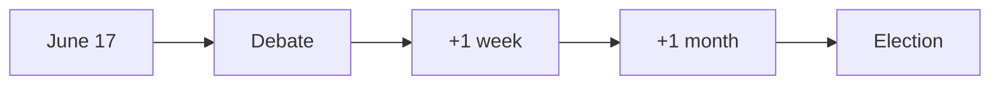

# Forward Indicators — Realtime Monitor 2026-06-13

1. 2026-06-17: JuU44 debate in plenary.
2. 2026-06-17: JuU45 and JuU47 debate alongside JuU44.
3. 2026-06-18: media framing of the police-training bill.
4. 2026-06-18: opposition follow-up on welfare cuts.
5. 2026-06-19: whether SkU30 becomes a privacy story.
6. 2026-06-20: whether SfU32 becomes an asylum/return story.
7. +1 week: any new police recruitment framing from the Government.
8. +1 week: any prison-conditions follow-up from the opposition.
9. +1 month: whether the capacity frame persists after recess.
10. +1 month: whether defence climate adaptation gets linked to budget strain.
11. +1 election cycle: whether this pulse becomes part of a broader "delivery vs strain" campaign.

