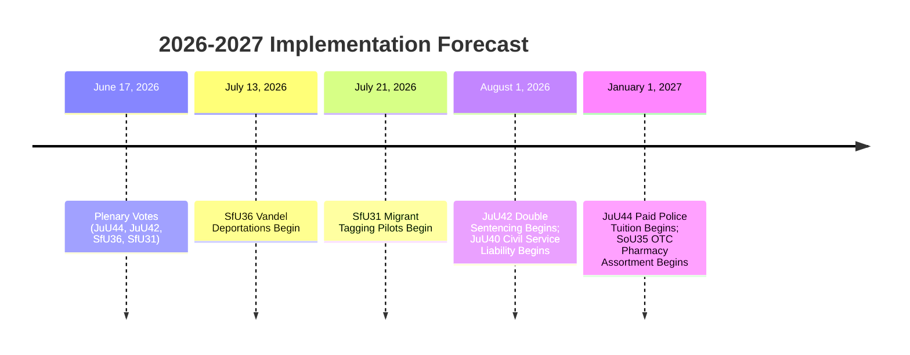

# Forward Indicators — Realtime Monitor 2026-06-13

## Dated Watch Items & Verifiable Milestones

To allow readers to verify or falsify our political-intelligence assessments over time, this matrix outlines specific, dated, and verifiable milestones for the implementation of the Saturday session's state capacity package.

| Target Date | Milestone Event | Verifiable Action / Indicator | Analytical Relevance |
|---|---|---|---|
| **June 17, 2026** | Riksdag Plenary Votes | Division lists and votes on `JuU44`, `JuU42`, `SfU36`, and `SfU31`. | Verifies voting discipline and the L defection risk (`coalition-mathematics.md`). |
| **July 13, 2026** | Entry into Force: `SfU36` | First "vandel" deportation orders issued by Migrationsverket. | Verifies the legal and administrative friction of conduct deportations (`risk-assessment.md`). |
| **July 21, 2026** | Entry into Force: `SfU31` | First electronic tagging systems deployed on supervised migrants. | Verifies the technical and procurement feasibility of migrant tracking (`implementation-feasibility.md`). |
| **August 1, 2026** | Entry into Force: `JuU42` | Removal of joint-sentencing cap; double network sentences applied in courts. | Marks the official start of the sentencing surge and its pressure on prisons (`HD10557`). |
| **August 1, 2026** | Entry into Force: `JuU40` | First "abuse of public office" indictments filed against civil servants. | Measures the rise of "defensive bureaucracy" and administrative paralysis. |
| **October 15, 2026** | Q3 Budget Review | Regional and municipal funding allocation adjustments. | Verifies the fiscal strain on local schools and healthcare (`HD10558`). |
| **January 1, 2027** | Entry into Force: `JuU44` | Police academy tuition/CSN write-off programs fully operational. | Verifies the recruitment and pipeline scaling speed of the police force. |
| **January 1, 2027** | Entry into Force: `SoU35` | "Farmaceutsortiment" OTC counseling program begins in pharmacies. | Measures the success of regulatory delegation in relieving primary care services. |

---

## Forecasting Verification Diagram

