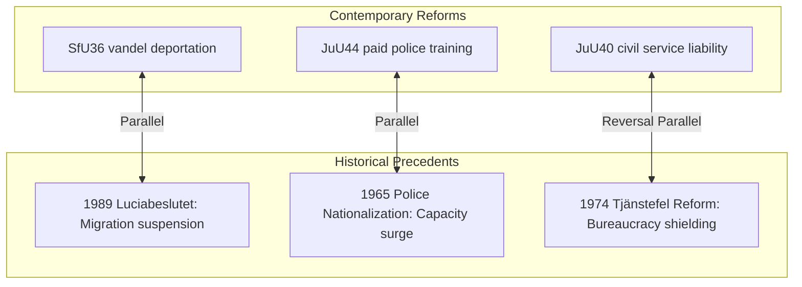

# Historical Parallels — Realtime Monitor 2026-06-13

## Historical Precedents in Swedish Governance

The rapid, coercive expansion of state authority cleared during the Saturday plenary session is not unprecedented. It echoes several landmark structural shifts in modern Swedish administrative and political history, providing critical lessons for contemporary execution.

---

## Detailed Historical Case Studies

### 1. The 1989 "Luciabeslutet" and the Redefinition of Refugee Rights
* **Swedish Parallel**: `HD01SfU36` (Conduct-Based Deportations) and `HD01SfU31` (Supervision and Tracking)
* **Historical Analysis**: On December 13, 1989, the Social Democratic government under Ingvar Carlsson passed the "Luciabeslutet," a historic, emergency decision that suspended asylum rights for non-UN convention refugees, citing an "unmanageable" influx of asylum seekers. It remains the most dramatic, unilateral administrative restriction of migration rights in modern Sweden. `SfU36` represents a similar landmark shift: by legalizing deportation on subjective "vandel" (bad conduct) grounds, the state is once again asserting absolute sovereign control over migration, using administrative criteria to bypass standard judicial processes.

### 2. The 1965 Nationalization of the Swedish Police Force
* **Swedish Parallel**: `HD01JuU44` (Paid Police Education)
* **Historical Analysis**: Before January 1, 1965, the Swedish police were municipal entities, leading to extreme inconsistencies in training, funding, and operational coordination. The 1965 nationalization (`Polisens förstatligande`) consolidated all municipal police departments into a single national agency, representing the largest capacity-building surge in Swedish security history. `JuU44`’s paid police-training model is the most significant structural and financial intervention in the police pipeline since 1965, showing a state willing to spend massive fiscal resources to scale its national security machinery.

### 3. The 1974 "Tjänstefel" Reform and the Shielding of Bureaucracy
* **Swedish Parallel**: `HD01JuU40` (Civil Service Liability)
* **Historical Analysis**: In 1974, Sweden implemented a sweeping reform of "tjänstefel" (misconduct in office), decriminalizing simple negligence and shielding public servants from criminal prosecution to encourage independent, non-defensive administrative decision-making. The reform was criticized for decades as creating an "irresponsible bureaucracy." `JuU40` represents a direct, historic roll-back of the 1974 reform. By raising the minimum sentence for gross misconduct and introducing the "abuse of public office" offense, the state is re-imposing strict criminal accountability on its own agents, reversing a 50-year-old administrative tradition.
