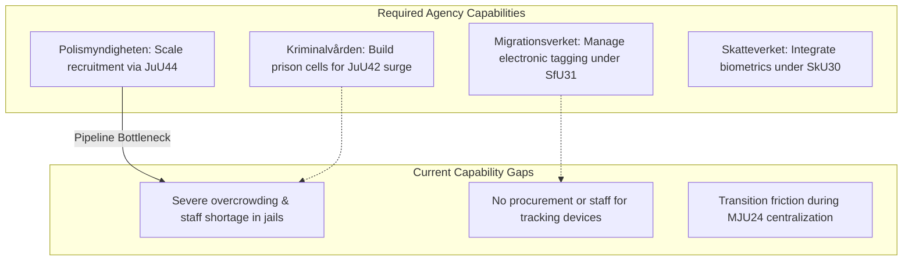

# Implementation Feasibility — Realtime Monitor 2026-06-13

## Capability Gap Analysis

Executing the massive, multi-front state capacity package cleared during the extraordinary Saturday session requires major operational, technical, and logistical capabilities across several public agencies.

---

## Detailed Feasibility & Timeline Assessments

### 1. Kriminalvården: Sentence Doubling (`HD01JuU42`)
* **Feasibility Rating**: **CRITICAL UNFEASIBILITY / EXTREMELY HIGH FRICTION**
* **Analysis**: `JuU42`’s sentencing surge (removing the joint-sentencing cap and doubling gang penalties) takes effect on August 1, 2026. However, as exposed in `HD10557`, Sweden's prison system is already operating far beyond safe capacity. Inmates are being doubled up in single cells, staff turnover is at record highs, and incident rates of sexual abuse and violence are escalating. There is zero physical or operational capacity to house the wave of long-term prisoners generated by `JuU42` without triggering an immediate crisis.
* **Timeline**: Overcapacity expected to peak in early Q1 2027; emergency modular facility deployment required by late Q3 2026.

### 2. Migrationsverket: Supervised Electronic Tagging (`HD01SfU31`)
* **Feasibility Rating**: **LOW FEASIBILITY / HIGH FRICTION**
* **Analysis**: Introducing electronic tracking and geographic boundaries as alternatives to physical detention takes effect on July 21, 2026. Migrationsverket has zero existing infrastructure, software, or trained staff to manage a real-time electronic monitoring network. The agency has not yet selected a technology vendor, meaning it will be completely dependent on third-party security contractors, raising significant procurement and integration friction.
* **Timeline**: Procurement and vendor selection projected to take 6+ months; pilot tagging rollout unlikely before Q1 2027.

### 3. Centralizing Environmental Permitting (`HD01MJU24`)
* **Feasibility Rating**: **MEDIUM FEASIBILITY / MODERATE FRICTION**
* **Analysis**: Centralizing environmental permitting and review from 21 regional county administrative boards into a single national agency (`Miljöprövningsmyndigheten`) is structurally sound. However, the transition will trigger significant operational friction. Transferring thousands of active case files, hiring specialized legal and environmental staff, and setting up the new agency's IT systems will slow down active reviews in the short term, delaying the very industrial green projects the bill is designed to accelerate.
* **Timeline**: National agency setup projected to take 12 months; full operational transition expected by late Q3 2027.
