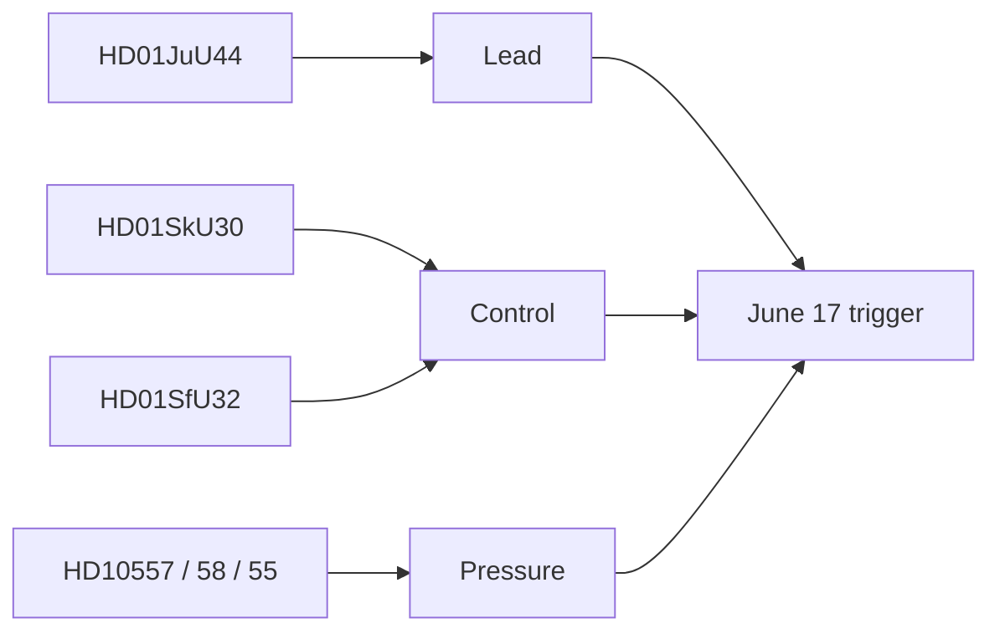

# Intelligence Assessment — Realtime Monitor 2026-06-13

## Key Judgments

1. **HD01JuU44 is the lead instrument.** The paid police-training reform is the most concrete and most politically legible item in the live feed. **Confidence: HIGH**
2. **The broader pulse is about state capacity.** Skatteverket powers, return operations and the welfare/prison/defence interpellations all point to a shared delivery-and-pressure frame. **Confidence: MEDIUM-HIGH**
3. **The June 17 chamber date is the next forward trigger.** It will test whether JuU44 becomes a broader law-and-order headline or stays a recruitment/retention reform. **Confidence: HIGH**

## PIRs

- Will the June 17 debate amplify the paid police-training frame?
- Does SkU30 become a privacy debate or stay an administrative reform?
- Do welfare and prison pressure signals converge into one governance critique?

## Assumptions

- No hidden coalition break is visible in the current feed.
- Opposition questions are pressure signals, not legislative blockers.

