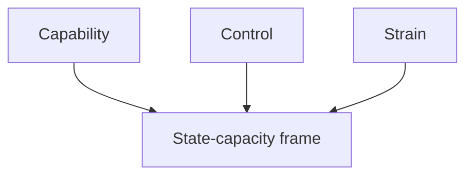

# Media Framing Analysis — Realtime Monitor 2026-06-13

## Frame A: Capability

- Police training, Skatteverket powers and return operations are all competence signals.

## Frame B: Control

- Biometrics, secrecy and enforcement tools can be framed as state control.

## Frame C: Strain

- Welfare cuts, prison abuse and defence adaptation are pressure narratives.

## Bias Audit

- No outlet is neutral.
- Public broadcasters, tabloids and ministerial press releases will all choose different emphasis.
- The article should therefore avoid inheriting any one outlet's frame.

## Cognitive Vulnerability

- Availability bias: crime and prison stories crowd out administrative detail.
- Loss aversion: welfare cuts and prison abuse trigger faster attention than recruitment policy.

