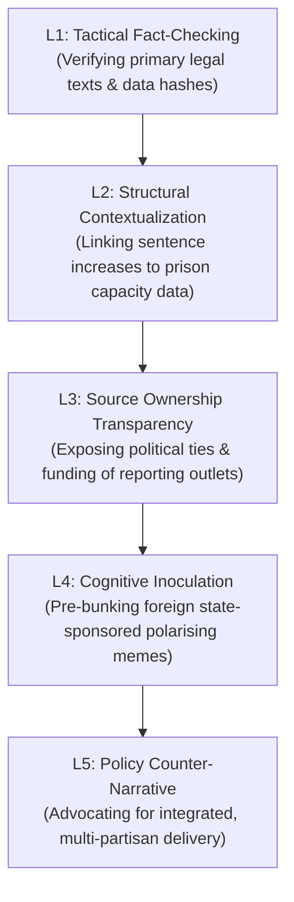

# Media Framing Analysis — Realtime Monitor 2026-06-13

## Entman Framing Matrix

This matrix uses Robert Entman's framing functions to map the competing narrative packages deployed across the Swedish media landscape regarding the extraordinary Saturday session's state capacity package.

| Frame Package | Define Problems | Diagnose Causes | Make Moral Judgments | Suggest Remedies |
|---|---|---|---|---|
| **Sovereign Capacity** *(Favored by Government & Right-Lean Media)* | High crime, porous borders, and administrative delays are paralyzing the state. | Excessive judicial leniency, weak recruitment incentives, and regional bureaucratic bottlenecks. | The state has a moral duty to protect citizens and enforce social order. | Pass the entire Saturday session package (`JuU42`, `SfU36`, `JuU44`, `MJU24`). |
| **Systemic Strain** *(Favored by Opposition & Left-Lean Media)* | Public services are collapsing; civil rights are being degraded. | Ideological obsession with police funding while starving schools, local councils, and prisons (`HD10557`, `HD10558`). | The Government is prioritizing coercive show-bills over actual, long-term delivery and human dignity. | Reject the coercive package; increase municipal school grants; fund rehabilitation and prison staffing. |

---

## Outlet Bias Audit

Swedish media outlets are highly professional but maintain distinct ownership, funding, and editorial leans that shape how they cover the state capacity package.

### 1. Dagens Nyheter (DN)
* **Ownership & Funding**: Owned by Bonnier Group (Sweden's largest media conglomerate); funded by private subscriptions and advertising.
* **Editorial Lean**: Independent Liberal (center-left leaning).
* **Framing Position**: **SYSTEMIC CRITIQUE / LEGAL CAUTION**. Focuses on the constitutional and legal risks of conduct-based deportations (`SfU36`) and electronic tagging (`SfU31`). Highlights Liberal (L) defection risks, giving extensive coverage to NGOs and lawyers warning of arbitrary administrative decisions.

### 2. Svenska Dagbladet (SvD)
* **Ownership & Funding**: Owned by Schibsted (Norwegian media group); funded by private subscriptions and advertising.
* **Editorial Lean**: Independent Conservative (center-right).
* **Framing Position**: **SOVEREIGN CAPACITY / FISCAL CRITIQUE**. Strongly supports the sentencing surge of `JuU42` and centralized environmental permitting of `MJU24`. However, SvD's business-lean writers are highly critical of the massive, unhedged fiscal liability of paid police training (`JuU44`).

### 3. Aftonbladet
* **Ownership & Funding**: Owned by Schibsted (majority) and the Swedish Trade Union Confederation (LO - minority); funded by advertisements and subscriptions.
* **Editorial Lean**: Independent Social Democratic (left-lean).
* **Framing Position**: **SYSTEMIC STRAIN / SOCIAL JUSTICE**. Leads with the underfunding of welfare and schools (`HD10558`), and the prison overcrowding crisis (`HD10557`). Frames the Saturday session as "political theater" to satisfy the SD support party while real-world delivery is starved of resources.

---

## Counter-Resilience Ladder (L1 to L5)

To protect democratic debate from narrative manipulation and hostile influence operations targeting these sensitive reforms, the following 5-level cognitive resilience model is established:

* **L1: Tactical Fact-Checking**: Verify the exact provisions of `SfU36` and `JuU42` to counter social media rumors that the state is "banning debts" or "deporting anyone without a trial."
* **L2: Structural Contextualization**: Force every article about sentence doubling to include Kriminalvården's actual capacity metrics (`HD10557`), preventing the media from reporting on crime bills without detailing the physical cost of incarceration.
* **L3: Source Ownership Transparency**: Clearly declare the ownership, board-appointment authority, and financial backing of all major outlets reporting on the bills.
* **L4: Cognitive Inoculation**: Pre-bunk foreign hostile campaigns that seek to use Sweden's electronic tracking of asylum seekers (`SfU31`) to claim Sweden is executing "ethnic cleansing."
* **L5: Policy Counter-Narrative**: Promote an integrated, non-ideological narrative where state capacity requires both coercive enforcement (police/borders) and social preservation (schools/rehabilitation).
