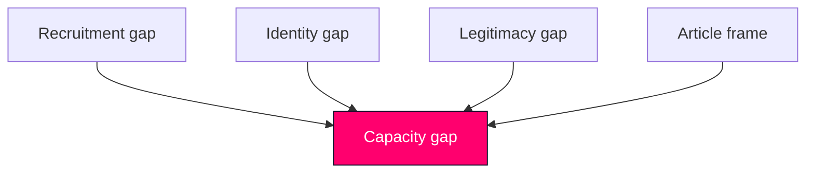

# Risk Assessment — Realtime Monitor 2026-06-13

| risk | likelihood | impact | level | mitigation |
|---|---:|---:|---|---|
| Paid police training becomes a headline-only story | medium | medium | medium | tie it to retention and secrecy controls |
| Biometrics/privacy debate swamps the state-capacity frame | medium | medium | medium | keep Skatteverket in the enforcement cluster |
| Return operations are read as migration-only, not administration | medium | medium | medium | emphasize cross-agency information sharing |
| Prison abuse becomes a scandal story detached from capacity | medium | medium | medium | link it to overcrowding and operational strain |
| Welfare cuts become a party-political clash with no policy depth | high | medium | medium-high | anchor the finance-minister question and public service pressure |

## Chains

- Recruitment weakness -> police shortage -> capacity gap.
- Registration gaps -> identity abuse -> enforcement gap.
- Prison crowding -> abuse risk -> legitimacy gap.

