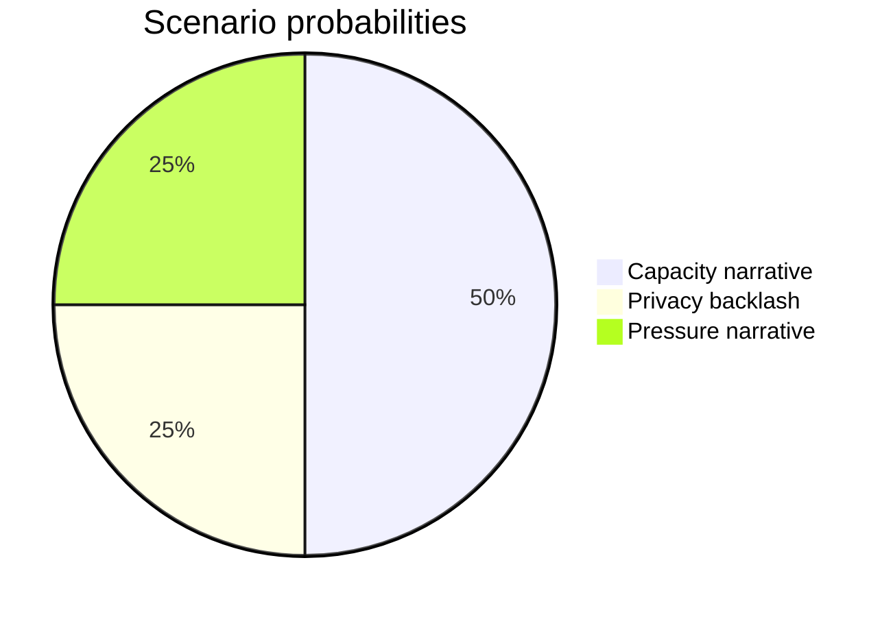

# Scenario Analysis — Realtime Monitor 2026-06-13

## Scenario 1: Capacity narrative sticks

- Probability: 50%
- The June pulse is read as a coherent push to strengthen recruitment and enforcement.
- Indicator: June 17 debate keeps JuU44 and JuU47 at the center.

## Scenario 2: Privacy backlash grows

- Probability: 25%
- Biometrics, secrecy and data-sharing dominate the debate.
- Indicator: SkU30 becomes the sharper controversy.

## Scenario 3: Pressure narrative wins

- Probability: 25%
- Opposition questions on welfare, prisons and defence define the day.
- Indicator: HD10558 and HD10557 get picked up as broader governance criticism.

