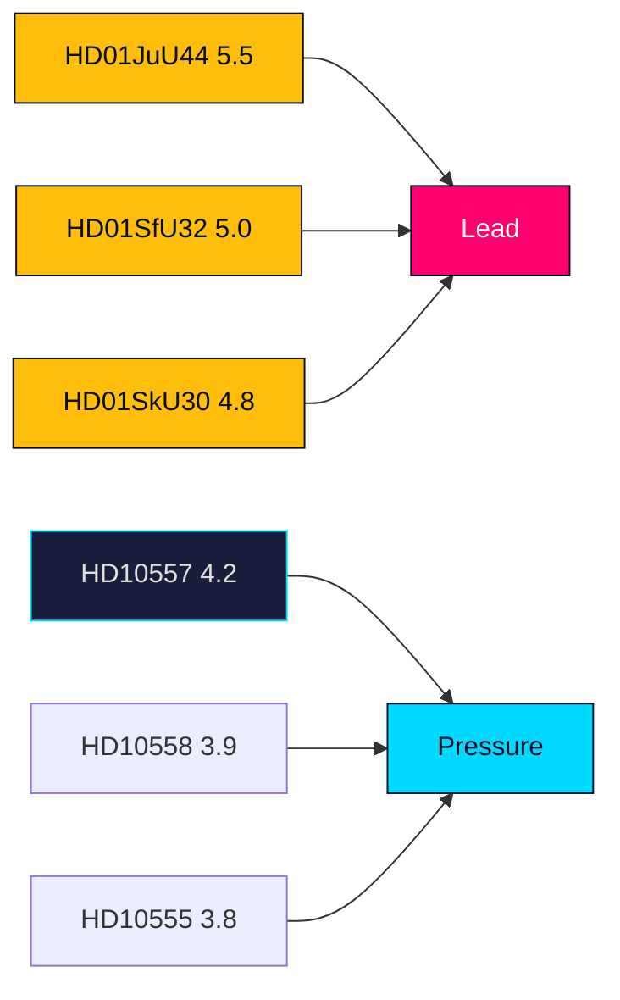

# Significance Scoring — Realtime Monitor 2026-06-13

## Scoring Method

Scores reflect Detectability, Impact and Willingness on a 1-10 scale, compressed for a realtime pulse.

| doc | detectability | impact | willingness | composite | evidence |
|---|---:|---:|---:|---:|---|
| HD01JuU44 | 8 | 8 | 8 | 5.5 | paid police education, 1 Jan 2027 |
| HD01SkU30 | 7 | 7 | 7 | 4.8 | Skatteverket powers, biometrics, new offence |
| HD01SfU32 | 7 | 7 | 7 | 5.0 | return enforcement, agency information sharing |
| HD10557 | 6 | 6 | 6 | 4.2 | prison abuse and overcrowding |
| HD10558 | 6 | 5 | 6 | 3.9 | welfare cuts pressure |
| HD10555 | 5 | 5 | 6 | 3.8 | defence climate adaptation |

## Sensitivity

- If JuU44 slips off the June 17 agenda, the lead score drops slightly but remains the lead because of its policy clarity.
- If the justice cluster grows with new motions or new documents, HD01SfU32 can overtake as the broader state-control frame.
- The interpellation cluster is significant mainly as pressure evidence, not as standalone legislation.

