# Significance Scoring — Realtime Monitor 2026-06-13

## DIW Significance Framework

To ensure analytical objectivity, every document in the extraordinary Saturday session is scored across three dimensions of the **Dynamic Intelligence Weighting (DIW)** framework, each on a scale of 1.0 to 10.0:

1. **Structural Impact (S)**: The degree to which the policy alters the constitutional, legal, or administrative framework of the Swedish state (weight: 40%).
2. **Societal Salience (P)**: The level of public interest, political debate, media attention, and electoral polarization (weight: 30%).
3. **Execution Feasibility / Frictions (E)**: The operational, logistical, and budget friction introduced by the policy's implementation (weight: 30%).

The Composite Score is calculated as:
$$\text{Composite} = (S \times 0.4) + (P \times 0.3) + (E \times 0.3)$$

---

## Ranked Document Portfolio

| Rank | Document ID | Title / Signal | Structural (S) | Salience (P) | Friction (E) | Composite | Tier |
|:---:|---|---|:---:|:---:|:---:|:---:|---|
| **1** | `HD01JuU42` | Double Gang Sentences | 9.5 | 9.0 | 9.0 | **9.20** | **CRITICAL** |
| **2** | `HD01SfU36` | Conduct-Based Deportations | 9.0 | 9.5 | 8.0 | **8.85** | **HIGH** |
| **3** | `HD01JuU44` | Paid Police Education | 8.0 | 8.5 | 8.0 | **8.15** | **HIGH** |
| **4** | `HD01SfU31` | Supervised Tagging | 7.5 | 8.0 | 7.5 | **7.65** | **MEDIUM-HIGH** |
| **5** | `HD01SkU30` | Folkbokföring Biometrics | 7.8 | 7.0 | 7.0 | **7.32** | **MEDIUM-HIGH** |
| **6** | `HD01SfU32` | Return Operations | 7.2 | 7.5 | 6.5 | **7.08** | **MEDIUM** |
| **7** | `HD01JuU40` | Civil Service Liability | 7.5 | 6.5 | 6.0 | **6.75** | **MEDIUM** |
| **8** | `HD01MJU24` | Environmental Permitting Agency | 7.0 | 6.0 | 6.5 | **6.55** | **MEDIUM** |
| **9** | `HD01SfU29` | Welfare Limits for Custody | 6.0 | 6.5 | 6.0 | **6.15** | **MEDIUM** |
| **10** | `HD10557` | Prison Overcrowding / Sexual Abuse | 5.5 | 7.0 | 5.5 | **5.95** | **MEDIUM** |
| **11** | `HD10558` | Welfare Cuts Pressure | 5.0 | 7.5 | 5.0 | **5.75** | **MEDIUM** |
| **12** | `HD01SoU35` | Pharmacist Assortment | 5.8 | 5.0 | 5.5 | **5.47** | **MEDIUM-LOW** |
| **13** | `HD10555` | Defence Climate Adaptation | 5.0 | 5.0 | 5.0 | **5.00** | **LOW** |

---

## Detailed Scoring Justifications

### 1. `HD01JuU42` — Doubled Gang Sentences (Score: 9.20/10)
* **S (9.5)**: Re-writes the rules of joint sentencing and raises individual sentencing scales across 50 categories; represents a historic departure from rehabilitation-first principles.
* **P (9.0)**: Represents the crown jewel of the Tidö security agenda; highly polarized, with opposition warning of system collapse.
* **E (9.0)**: Massive operational friction; will trigger an immediate housing crisis inside the prison system (`Kriminalvården`).

### 2. `HD01SfU36` — Conduct-Based Deportations (Score: 8.85/10)
* **S (9.0)**: Lowers the administrative threshold to deny/revoke residence permits based on non-criminal behavioral criteria ("vandel").
* **P (9.5)**: Extremely polarizing; centers on the cultural definition of Swedish values and social integration.
* **E (8.0)**: Heavy administrative friction; Migrationsverket lacks clear guidelines or staff to process subjective lifestyle reviews.

### 3. `HD01JuU44` — Paid Police Education (Score: 8.15/10)
* **S (8.0)**: Aligns education incentives with security needs, using debt write-offs to bypass recruitment limits.
* **P (8.5)**: Highly visible reform; popular among swing voters but criticized by left-wing academics for altering academic standards.
* **E (8.0)**: High budget friction; requires significant, long-term funding commitments to write off CSN loans.

### 4. `HD01SfU31` — Supervised Tagging (Score: 7.65/10)
* **S (7.5)**: Legalizes electronic surveillance and tracking for non-convicted migrants in the community.
* **P (8.0)**: Raises major civil liberty and ethical debates; Liberals are highly exposed to internal dissent.
* **E (7.5)**: Requires significant procurement, software integration, and police response infrastructure for monitoring violations.

```mermaid
gantt
  title Significance Portfolio — Composite Scores
  dateFormat X
  axisFormat %s
  section Critical
  HD01JuU42 (9.20) : active, 0, 92
  section High
  HD01SfU36 (8.85) : active, 0, 88
  HD01JuU44 (8.15) : active, 0, 81
  section Medium-High
  HD01SfU31 (7.65) : active, 0, 76
  HD01SkU30 (7.32) : active, 0, 73
  section Medium
  HD01SfU32 (7.08) : active, 0, 70
  HD01JuU40 (6.75) : active, 0, 67
```

