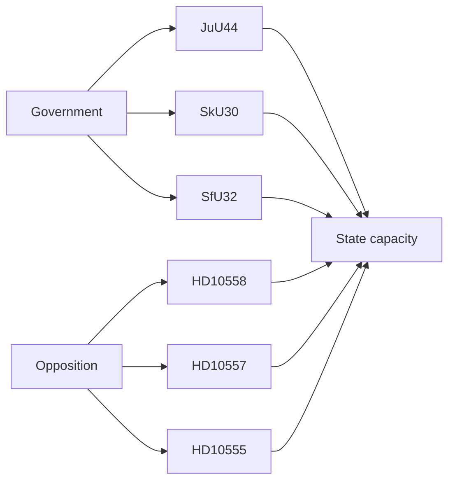

# Stakeholder Perspectives — Realtime Monitor 2026-06-13

| stakeholder | view | likely reaction |
|---|---|---|
| Government | wants to show it can recruit, control and enforce | positive on JuU44 / SkU30 / SfU32 |
| Opposition | wants to show public services are under strain | positive on HD10558 / HD10557 / HD10555 |
| Police students | respond to pay/debt relief | likely positive |
| Polismyndigheten | gains recruitment leverage but also secrecy burden | cautious positive |
| Skatteverket / Migrationsverket | gain tools but inherit implementation risk | cautious |
| Prison staff / Kriminalvården | exposed to legitimacy pressure from abuse claims | concern |

## Influence Network

- JuU44 is the mobilising signal.
- SkU30 and SfU32 are the control signals.
- The interpellations are the pressure signals.

