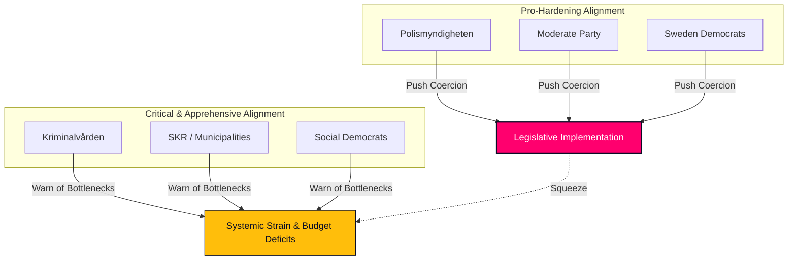

# Stakeholder Perspectives — Realtime Monitor 2026-06-13

## Political Parties Matrix

This matrix outlines the political alignments, positions, and core arguments of the 8 parliamentary parties regarding the extraordinary Saturday session's state capacity package.

| Party / Bloc | Position | Key Arguments | Pressure Points | Core Actions / Speeches |
|---|---|---|---|---|
| **Moderate Party (M)** *(Government Lead)* | **SUPPORT** (Strong) | The state must have the authority to recruit, control, and enforce. Reforms like `JuU44` (paid police) and `JuU42` (gang sentences) are necessary to restore security and order. | Managing the severe fiscal and prison overcrowding bottlenecks (`HD10557`). | PM Ulf Kristersson and Justice Minister Gunnar Strömmer defending the legislative surge as "necessary state hardening." |
| **Sweden Democrats (SD)** *(Support Party)* | **SUPPORT** (Strong) | Coercive migration control and administrative deportations (`SfU36`, `SfU31`) are long-overdue measures to preserve cultural cohesion and social trust. | Demanding even lower administrative deportation thresholds and higher detention limits. | Jimmie Åkesson pushing the coalition to maintain absolute commitment to the "vandel" and return operations suite. |
| **Christian Democrats (KD)** / **Liberals (L)** *(Govt Coalition)* | **SUPPORT** (Moderate) | The state must expand its protective and permitting machinery (`MJU24`, `SoU35`), but must balance it with strict public office accountability (`JuU40`). | Liberals are highly exposed on the human-rights and surveillance aspects of electronic tagging for migrants (`SfU31`). | Johan Pehrson (L) emphasizing the safeguards of `JuU40` to soothe civil-liberty concerns. |
| **Social Democrats (S)** *(Lead Opposition)* | **OPPOSE** (Moderate-Strong) | The Government is hyper-focusing on coercive policing and migration controls while starving public services (`HD10558`), schools, and healthcare. | Supporting police expansion (`JuU44`) but strongly rejecting "vandel" deportations (`SfU36`) and prison sentence inflation without capacity (`JuU42`). | Magdalena Andersson and Lawen Redar pressing the Finance Minister on local government cuts and class sizes. |
| **Left Party (V)** / **Green Party (MP)** / **Centre Party (C)** | **OPPOSE** (Strong) | The state capacity package is an authoritarian, discriminatory shift that erodes civil liberties, targets migrants (`SfU36`, `SfU31`), and neglects climate adaptation (`HD10555`). | Complete opposition to electronic tagging, conduct-based deportation, and sentence doubling. | Samuel Gonzalez Westling (V) attacking the Government over Kriminalvården overcrowding and abuse; Emma Berginger (MP) on military climate neglect. |

---

## Public Agencies & Institutional Stakeholders

### 1. Polismyndigheten (Swedish Police Authority)
* **Perspective**: **STRONGLY FAVORABLE**
* **Analysis**: The Authority welcomes the paid training model of `JuU44` as a vital booster for its recruitment target (expanding the force to 34,000 officers). Additionally, the expanded search powers under `SfU32` and the doubled gang sentences of `JuU42` give operational units powerful, coercive tools. However, leadership is privately concerned about the administrative workload required to enforce the geographic tracking and electronic tagging of migrants under `SfU31`.

### 2. Kriminalvården (Swedish Prison and Probation Service)
* **Perspective**: **SEVERELY APPREHENSIVE**
* **Analysis**: While the service supports the welfare limitations and upkeep fees for monitored prisoners under `SfU29`, it is terrified of the consequences of `JuU42`. Removing the joint-sentencing cap and doubling gang-related sentences will result in an immediate, compounding surge of long-term inmates. As exposed in `HD10557`, the agency is already operating far beyond safe capacity, suffering from severe understaffing and systemic security breakdowns.

### 3. Migrationsverket (Swedish Migration Agency)
* **Perspective**: **APPREHENSIVE ON EXECUTION**
* **Analysis**: The Agency faces a massive implementation bottleneck. Enforcing the conduct-based deportations of `SfU36` requires the agency to evaluate thousands of subjective "bristande vandel" cases annually. Combined with managing the new electronic tagging systems under `SfU31` and the biometric data sharing of `SkU30`, Migrationsverket is severely under-resourced to execute these complex administrative tasks without massive backlogs.

### 4. Municipalities & Regions (SKR)
* **Perspective**: **STRONGLY CRITICAL**
* **Analysis**: As represented in `HD10558`, local authorities are facing a critical fiscal squeeze. They argue that the Tidö coalition is funneling all state resources into national security and coercive machinery, leaving local schools, social services, and municipal integration programs starved of funds, which directly compromises the state's long-term ability to prevent youth gang recruitment.

