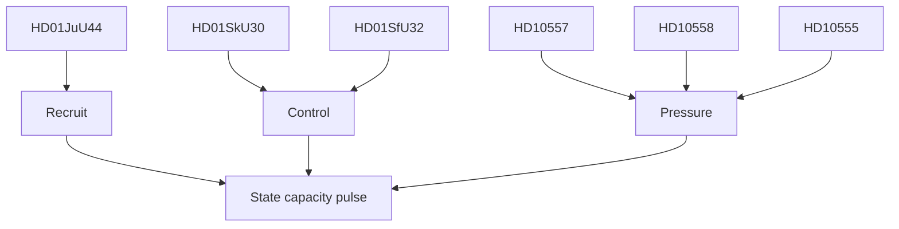

# Synthesis Summary — Realtime Monitor 2026-06-13

**Period**: 2026-06-13 · **Riksmöte**: 2025/26 · **Improvement mode**: false

---

## Lead-Story Decision

The lead story is **HD01JuU44 "En betald polisutbildning"**. It is the clearest concrete policy move in the live feed and it has the highest political compression: recruitment, retention, secrecy and law-and-order messaging all sit inside one instrument.

## Integrated Intelligence Picture

1. **Recruitment**: the state wants more police candidates and wants them to stay.
2. **Control**: Skatteverket powers and return operations both point to tighter administrative enforcement.
3. **Pressure**: welfare cuts, prison abuse and defence climate adaptation are being used by opposition MPs to argue that the state is under strain.

The combined picture is not ideological noise; it is a capacity race. Government-side documents show delivery hardening. Opposition-side interpellations show the cost of not delivering.

## DIW-Weighted Ranking

| rank | doc | composite | tier | why |
|---|---|---:|---|---|
| 1 | HD01JuU44 | 5.5/10 | MEDIUM-HIGH | paid police training is the cleanest lead instrument |
| 2 | HD01SfU32 | 5.0/10 | MEDIUM | return operations hit state control and migration enforcement |
| 3 | HD01SkU30 | 4.8/10 | MEDIUM | biometrics and population registration are high-salience state tools |
| 4 | HD10557 | 4.2/10 | MEDIUM | prison abuse adds a credibility and capacity pressure signal |
| 5 | HD10558 | 3.9/10 | MEDIUM | welfare cuts are politically salient but less policy-specific |
| 6 | HD10555 | 3.8/10 | MEDIUM | defence climate adaptation is strategic but less immediate |

## Confidence

- HD01JuU44: HIGH
- HD01SkU30 / HD01SfU32: HIGH
- HD10555 / HD10557 / HD10558: MEDIUM

## Cross-Cutting Themes

- Recruitment incentives are back in the security agenda.
- Administrative enforcement is getting more coercive.
- Opposition pressure is coming from welfare, prisons and defence, not just crime.

## Pass 2 Refinement

Pass 2 tightened the story away from a generic "law and order" frame and toward a more precise **state-capacity** frame. That kept the article coherent while preserving the distinct signals in the welfare, prison and defence interpellations.
