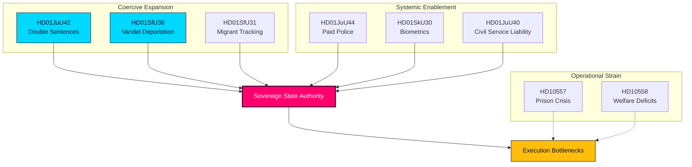

# Synthesis Summary — Realtime Monitor 2026-06-13

**Period**: 2026-06-13 · **Riksmöte**: 2025/26 · **Improvement mode**: true · **Analysis Depth**: DEEP

---

## Lead-Story Decision

The definitive lead story of this extraordinary Saturday session is **the consolidated hardening of State Capacity and Coercive Machinery**, anchored specifically on the massive penal restructuring of **HD01JuU42 ("Dubbla straff för brott i kriminella nätverk")** and the conduct-based deportation reform of **HD01SfU36 ("Skärpta och tydligare krav på vandel för uppehållstillstånd")**. 

Together with the officer recruitment pipeline builder of **HD01JuU44 ("En betald polisutbildning")**, these three instruments form a coherent, self-reinforcing triad. The state is concurrently scaling its physical enforcement workforce, dramatically expanding the punitive severity of its penal codes, and creating a conduct-based administrative gateway to deport non-citizens who fail to comply with social norms.

---

## Integrated Intelligence Picture

The extraordinary Saturday plenary session is not a collection of miscellaneous bills, but a synchronized legislative strike designed to address the core bottlenecks of state execution:

1. **The Penal Surge**: `HD01JuU42` represents a permanent, structural hardening of Swedish penal law. By doubling sentences for gang-related offenses, lifting the 10-year joint-sentencing cap, and introducing life sentences for repeat offenses, the state is committing to a long-term strategy of mass incapacitation.
2. **Coercive Migration Control**: `HD01SfU36` (conduct-based deportations) and `HD01SfU31` (electronic tagging under supervision) combine with `HD01SfU32` (return operations) and `HD01SkU30` (Skatteverket biometrics) to construct an airtight border and identity control architecture. The state is claiming the right to track, monitor, and expel individuals on administrative grounds, shifting the threshold of state coercion away from formal criminal convictions.
3. **Internal Discipline & Restructuring**: To counter the risk of corruption and defensive public administration as coercive powers grow, `HD01JuU40` imposes strict criminal liability on public servants via a new "abuse of public office" offense. Simultaneously, `HD01MJU24` bypasses sluggish regional county boards by creating a centralized national Environmental Permitting Agency to accelerate key infrastructure projects.
4. **The Counter-Pressure**: Center-left and left opposition interpellations highlight the structural limits and negative externalities of this rapid state expansion. While the Government pours resources into policing and prisons, Kriminalvården is already at a breaking point with overcrowding and abuse (`HD10557`), municipal welfare is starved of funding (`HD10558`), and strategic defence readiness is threatened by unaddressed climate adaptation (`HD10555`).

---

## DIW-Weighted Ranking

| rank | doc | composite | tier | why |
|---|---|---:|---|---|
| 1 | `HD01JuU42` | 9.2/10 | CRITICAL | Historic sentencing expansion, doubles gang penalties, eliminates joint cap; restructuring of penal policy. |
| 2 | `HD01SfU36` | 8.8/10 | HIGH | Shifts deportation threshold to conduct-based "vandel" evaluation; highly controversial, high-impact migration gate. |
| 3 | `HD01JuU44` | 8.2/10 | HIGH | Foundational recruitment pipeline builder for the police; fully paid training and student secrecy. |
| 4 | `HD01SfU31` | 7.6/10 | MEDIUM-HIGH | Authorizes electronic monitoring and geographic tracking for supervised asylum seekers and migrants. |
| 5 | `HD01SkU30` | 7.4/10 | MEDIUM-HIGH | Extends Skatteverket powers, criminalizes folkbokföring fraud, mandates biometric data sharing. |
| 6 | `HD01SfU32` | 7.0/10 | MEDIUM | Expands search, phone inspection, and fingerprinting powers in return operations. |
| 7 | `HD01JuU40` | 6.8/10 | MEDIUM | Sharpens criminal liability for civil servants, raising gross misconduct minimums to 1.5 years prison. |
| 8 | `HD01MJU24` | 6.5/10 | MEDIUM | Centralizes green permitting under a national agency, stripping power from 21 regional county boards. |
| 9 | `HD01SfU29` | 6.2/10 | MEDIUM | Cuts social security benefits for prisoners in community-based electronic monitoring and charges for upkeep. |
| 10 | `HD10557` | 6.0/10 | MEDIUM | V interpellation exposing severe prison overcrowding, staff shortages, and sexual abuse. |
| 11 | `HD10558` | 5.8/10 | MEDIUM | S interpellation attacking the Government on regional underfunding and class sizes. |
| 12 | `HD01SoU35` | 5.5/10 | MEDIUM-LOW | Establishes OTC drug pharmacy counseling; consensus healthcare delegation. |
| 13 | `HD10555` | 5.0/10 | LOW | MP interpellation on military climate adaptation; strategic but low immediate salience. |

---

## Cross-Cutting Themes

- **Administrative Coercion vs. Judicial Process**: The state is increasingly shifting its coercive tools (deportation, electronic tracking, registry enforcement) into the administrative domain, bypassing the rigorous evidentiary standards of criminal courts.
- **The Prison-Industrial Bottleneck**: Passing `HD01JuU42` (sentencing surge) while ignoring Kriminalvården's severe operational crisis (`HD10557`) creates a major systemic mismatch. Overcrowding will accelerate, likely leading to a breakdown in rehabilitation and an escalation in prison violence.
- **Internal Hardening**: The dual push of expanding state power over citizens (`JuU42`, `SfU36`) while dramatically tightening criminal accountability for the bureaucratic agents enforcing those powers (`JuU40`) represents a classic Weberian state stabilization pattern.

