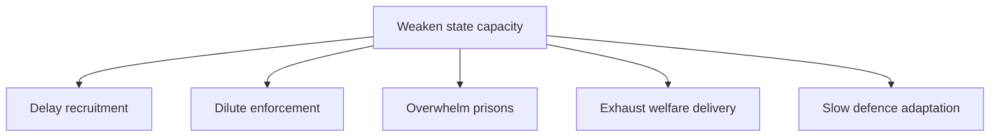

# Threat Analysis — Realtime Monitor 2026-06-13

## Threat Taxonomy

1. **Recruitment failure**: police staffing does not improve even after incentives.
2. **Administrative evasion**: identity fraud and return evasion outpace Skatteverket / Migrationsverket tools.
3. **Institutional legitimacy loss**: prison abuse and welfare strain reduce public trust.
4. **Defence readiness gap**: climate and broad-threat adaptation lags behind the stated urgency.

## Attack Tree

- Goal: weaken state capacity
  - branch: delay recruitment
  - branch: dilute enforcement
  - branch: overwhelm prisons
  - branch: exhaust welfare delivery
  - branch: slow defence adaptation

## TTP View

- The documents suggest pressure by overload, not by a single hostile actor.
- That makes the threat cumulative: small misses compound into a capacity shortfall.

