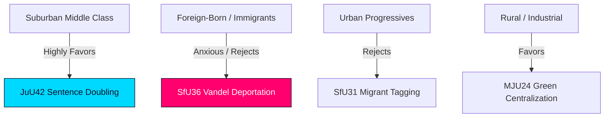

# Voter Segmentation — Realtime Monitor 2026-06-13

## Voter Bloc Exposure and Reactions

The comprehensive state-capacity package cleared during the Saturday plenary session triggers sharp, asymmetric reactions across key Swedish voter segments, directly shifting party loyalties ahead of the 2026 cycle.

---

## Key Voter Segments

### 1. The Suburban Middle-Class (The "Security Voters")
* **Profile**: Working- and middle-class families residing in suburban rings around Stockholm, Gothenburg, and Malmö. Highly sensitive to gang violence and local security.
* **Reaction to Package**: **STRONGLY FAVORABLE**. This segment is the primary target for `HD01JuU42` (gang double sentences) and `HD01JuU44` (paid police). They view these reforms as essential to restore neighborhood safety. Svantesson’s focus on order and security strongly appeals to this bloc, making them the critical swing segment of the 2026 cycle.

### 2. Foreign-Born and Immigrant Populations
* **Profile**: Naturalized citizens, permanent residents, and temporary visa holders residing in municipal suburbs and segregated neighborhoods.
* **Reaction to Package**: **STRONGLY ANXIOUS / REJECTS**. Introducing subjective "vandel" criteria for deportations (`HD01SfU36`) and electronic tagging under supervision (`HD01SfU31`) triggers massive anxiety. They view these administrative tools as discriminatory, leading to increased support for S and V, who actively oppose these measures.

### 3. Urban Progressives (The "Civil Liberties Voters")
* **Profile**: High-education, high-income voters residing in central metropolitan areas. Strongly aligned with civil rights, environmentalism, and international law.
* **Reaction to Package**: **REJECTS / HIGHLY CRITICAL**. This segment strongly objects to the coercive tracking of non-convicted migrants (`SfU31`), conduct-based deportations (`SfU36`), and sentence inflation (`JuU42`). Liberals (L) risk losing their remaining urban progressive supporters to C, MP, or S over these reforms.

### 4. Rural and Industrial Voters
* **Profile**: Working-class and business-oriented voters residing in rural areas, smaller municipalities, and industrial towns.
* **Reaction to Package**: **FAVORABLE**. They strongly support the centralization of green environmental permitting under a national agency (`HD01MJU24`) to bypass regional county board delays, viewing it as essential for local industrial jobs and economic survival.
