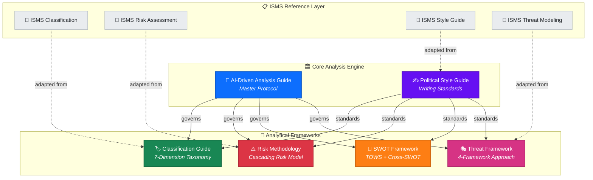
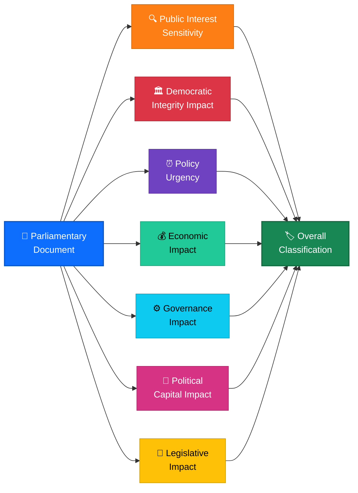
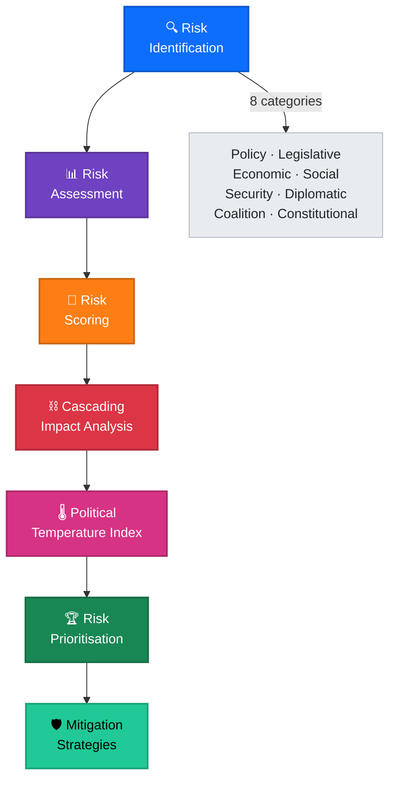
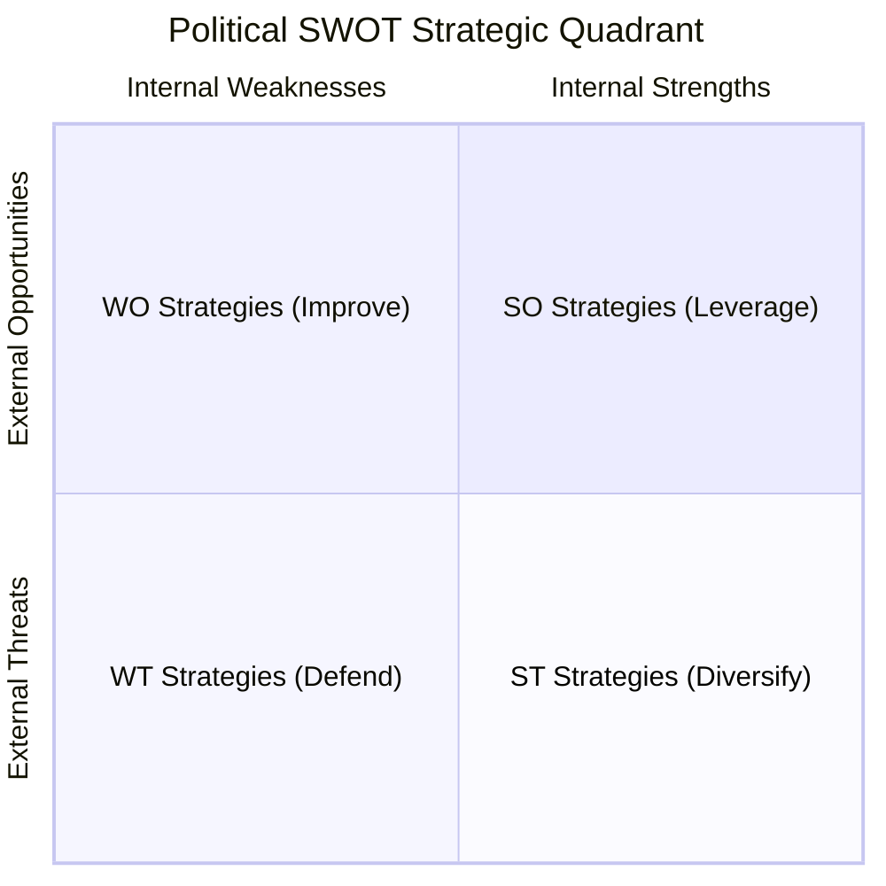
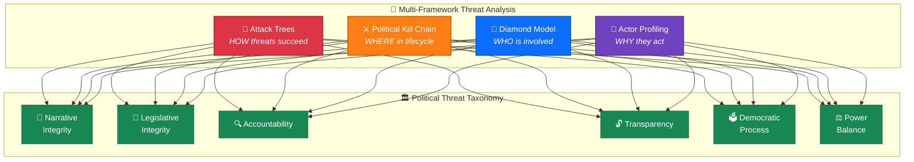
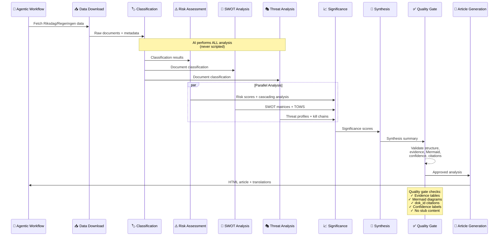

  

<h1 align="center">📚 Analysis Methodologies — Political Intelligence Framework</h1>

  <strong>📊 Comprehensive Methodology Library for Riksdagsmonitor Political Analysis</strong> 
  <em>🎯 Evidence-Based · Multi-Framework · ISMS-Compliant · AI-Driven</em>

  
  
  
  

**📋 Document Owner:** CEO | **📄 Version:** 3.0 | **📅 Last Updated:** 2026-03-30 (UTC)  
**🔄 Review Cycle:** Quarterly | **⏰ Next Review:** 2026-06-30  
**🏢 Owner:** Hack23 AB (Org.nr 5595347807) | **🏷️ Classification:** Public

---

## 🎯 Purpose

This directory contains the **authoritative methodology library** for all political intelligence analysis performed by Riksdagsmonitor's AI-driven agentic workflows. Each methodology document defines the analytical framework, evaluation criteria, evidence standards, and quality requirements that AI agents MUST follow when producing political intelligence.

> **Key Principle:** Scripts download data ONLY. AI performs ALL analytical content generation. These methodologies guide AI agents — they are never executed by scripts.

---

## 📐 Methodology Architecture

---

## 📖 Methodology Catalog

### 🤖 AI-Driven Analysis Guide — `ai-driven-analysis-guide.md`

| Attribute | Value |
|-----------|-------|
| **Purpose** | Master protocol governing all AI-driven political intelligence analysis |
| **Scope** | All agentic workflows, all analysis types, all output artifacts |
| **Key Rules** | Folder isolation · AI-only content · Multi-framework depth · Quality gates |
| **Version** | 2.0 |

**Core Principles:**
- **Folder Isolation**: Every workflow writes ONLY to its own `analysis/daily/YYYY-MM-DD/{articleType}/` subfolder
- **AI-Only Content**: Scripts must NEVER generate analysis prose, SWOT entries, risk scores, or template content
- **15-Minute Minimum**: Every deep analysis cycle must invest ≥15 minutes of AI reasoning time
- **Quality Gates**: Automated bash checks validate every analysis artifact before commit

---

### 🏷️ Political Classification Guide — `political-classification-guide.md`

| Attribute | Value |
|-----------|-------|
| **Purpose** | Multi-dimensional taxonomy for political document and event classification |
| **Dimensions** | 7: Public Interest · Democratic Integrity · Policy Urgency · Economic Impact · Governance · Political Capital · Legislative Impact |
| **Confidence Levels** | HIGH (≥80%) · MEDIUM (60–79%) · LOW (<60%) |
| **Version** | 2.0 |

---

### ⚠️ Political Risk Assessment Methodology — `political-risk-methodology.md`

| Attribute | Value |
|-----------|-------|
| **Purpose** | Systematic risk identification, scoring, and cascading impact analysis |
| **Risk Categories** | 8: Policy · Legislative · Economic · Social · Security · Diplomatic · Coalition · Constitutional |
| **Scoring Model** | Likelihood (1–5) × Impact (1–5) = Risk Score (1–25) |
| **Advanced Features** | Cascading risk chains · Political Temperature Index · Risk velocity tracking |
| **Version** | 2.0 |

---

### 💼 Political SWOT Analysis Framework — `political-swot-framework.md`

| Attribute | Value |
|-----------|-------|
| **Purpose** | Multi-stakeholder strategic analysis for political events and policy decisions |
| **Stakeholder Lenses** | Government Coalition · Opposition Bloc · Citizens/Civil Society · Economic Actors · International Observers |
| **Advanced Features** | TOWS Matrix · Cross-SWOT Interference · Scenario Generation · Temporal Dynamics |
| **Version** | 2.0 |

---

### 🎭 Political Threat Analysis Framework — `political-threat-framework.md`

| Attribute | Value |
|-----------|-------|
| **Purpose** | Multi-framework threat modeling for democratic process threats |
| **Frameworks** | 4: Attack Trees + Political Kill Chain + Diamond Model + Actor Profiling |
| **Threat Taxonomy** | 6 Categories: Narrative Integrity · Legislative Integrity · Accountability · Transparency · Democratic Process · Power Balance |
| **Threat Agents** | 6: Ruling Coalition · Opposition · External Actors · Special Interests · Media · Institutional |
| **Version** | 3.0 |

> ⚠️ **STRIDE is NOT used.** The Political Threat Taxonomy replaces STRIDE with politically-native categories designed for democratic function analysis.

---

### ✍️ Political Intelligence Style Guide — `political-style-guide.md`

| Attribute | Value |
|-----------|-------|
| **Purpose** | Establishes writing standards for all political intelligence output |
| **Scope** | Article tone, evidence citation standards, Mermaid diagram requirements, confidence labeling |
| **Key Standards** | Evidence tables (not prose) · dok_id citations · Color-coded diagrams · Swedish political terminology |
| **Version** | 2.0 |

---

## 🔗 ISMS Reference Adaptations

The analysis methodologies are adapted from Hack23's ISO 27001/NIST CSF/CIS Controls ISMS framework. The `reference/` directory contains mapping documents showing how cybersecurity risk concepts translate to political intelligence:

| Reference Document | ISMS Source | Political Adaptation |
|---|---|---|
| [`isms-classification-adaptation.md`](../reference/isms-classification-adaptation.md) | ISO 27001 A.5.12–A.5.13 | Multi-dimensional political event classification |
| [`isms-risk-assessment-adaptation.md`](../reference/isms-risk-assessment-adaptation.md) | ISO 27001 A.8.8, NIST CSF ID.RA | Cascading political risk assessment |
| [`isms-style-guide-adaptation.md`](../reference/isms-style-guide-adaptation.md) | ISO 27001 A.5.37 | Evidence-based political writing standards |
| [`isms-threat-modeling-adaptation.md`](../reference/isms-threat-modeling-adaptation.md) | ISO 27001 A.5.7, NIST CSF ID.RA-3 | Multi-framework political threat modeling |

---

## 🔄 Methodology Integration Flow

---

## 📏 Quality Standards

Every analysis artifact produced using these methodologies MUST contain:

| Requirement | Description | Enforcement |
|-------------|-------------|-------------|
| **Evidence Tables** | Structured tables with dok_id citations, not free-form prose | Quality gate Check 1 |
| **Mermaid Diagrams** | ≥1 color-coded diagram with `style` directives per analysis file | Quality gate Check 2 |
| **Confidence Labels** | HIGH/MEDIUM/LOW confidence on every assessment | Quality gate Check 3 |
| **dok_id Citations** | Every claim linked to specific parliamentary document IDs | Quality gate Check 4 |
| **Template Compliance** | Must follow the corresponding template in `analysis/templates/` | Quality gate Check 5 |
| **No Stub Content** | No boilerplate phrases like "_No strengths identified_" | Quality gate Check 6 |

---

## 📚 Related Documentation

| Document | Focus | Link |
|----------|-------|------|
| **Analysis README** | Directory overview and critical rules | [analysis/README.md](../README.md) |
| **Templates README** | Template catalog and usage guide | [analysis/templates/README.md](../templates/README.md) |
| **Prompts v2** | AI prompt library for analysis generation | [scripts/prompts/v2/](../../scripts/prompts/v2/) |
| **WORKFLOWS.md** | CI/CD and agentic workflow documentation | [WORKFLOWS.md](../../WORKFLOWS.md) |
| **ISMS-PUBLIC** | Hack23 Information Security Management System | [Hack23/ISMS-PUBLIC](https://github.com/Hack23/ISMS-PUBLIC) |

---

  <em>📊 Hack23 AB — Political Intelligence Through Rigorous Methodology</em>

