

  

<h1 align="center">📚 Analysis Methodologies — Political Intelligence Framework</h1>

  <strong>📊 Comprehensive Methodology Library for Riksdagsmonitor Political Analysis</strong> 
  <em>🎯 Evidence-Based · Multi-Framework · ISMS-Compliant · AI-Driven</em>

  
  
  
  

**📋 Document Owner:** CEO | **📄 Version:** 4.1 | **📅 Last Updated:** 2026-06-01 (UTC)  
**🔄 Review Cycle:** Quarterly | **⏰ Next Review:** 2026-06-30  
**🏢 Owner:** Hack23 AB (Org.nr 5595347807) | **🏷️ Classification:** Public

---

## 📚 Architecture Documentation Map

<table class="documentation-map">
  <thead>
    <tr>
      <th>Document</th>
      <th>Focus</th>
      <th>Description</th>
      <th>Documentation Link</th>
    </tr>
  </thead>
  <tbody>
    <tr>
      <td><strong><a href="../../ARCHITECTURE.md">Architecture</a></strong></td>
      <td>🏛️ Architecture</td>
      <td>C4 model showing current system structure</td>
      <td><a href="https://github.com/Hack23/riksdagsmonitor/blob/main/ARCHITECTURE.md">View Source</a></td>
    </tr>
    <tr>
      <td><strong><a href="../../FUTURE_ARCHITECTURE.md">Future Architecture</a></strong></td>
      <td>🏛️ Architecture</td>
      <td>C4 model showing future system structure</td>
      <td><a href="https://github.com/Hack23/riksdagsmonitor/blob/main/FUTURE_ARCHITECTURE.md">View Source</a></td>
    </tr>
    <tr>
      <td><strong><a href="../../SECURITY_ARCHITECTURE.md">Security Architecture</a></strong></td>
      <td>🛡️ Security</td>
      <td>Current security implementation</td>
      <td><a href="https://github.com/Hack23/riksdagsmonitor/blob/main/SECURITY_ARCHITECTURE.md">View Source</a></td>
    </tr>
    <tr>
      <td><strong><a href="../../THREAT_MODEL.md">Threat Model</a></strong></td>
      <td>🎯 Security</td>
      <td>Threat analysis</td>
      <td><a href="https://github.com/Hack23/riksdagsmonitor/blob/main/THREAT_MODEL.md">View Source</a></td>
    </tr>
    <tr>
      <td><strong><a href="../../DATA_MODEL.md">Data Model</a></strong></td>
      <td>📊 Data</td>
      <td>Current data structures and relationships</td>
      <td><a href="https://github.com/Hack23/riksdagsmonitor/blob/main/DATA_MODEL.md">View Source</a></td>
    </tr>
    <tr>
      <td><strong><a href="../../FLOWCHART.md">Flowcharts</a></strong></td>
      <td>🔄 Process</td>
      <td>Current data processing workflows</td>
      <td><a href="https://github.com/Hack23/riksdagsmonitor/blob/main/FLOWCHART.md">View Source</a></td>
    </tr>
    <tr>
      <td><strong><a href="../../SWOT.md">SWOT Analysis</a></strong></td>
      <td>💼 Business</td>
      <td>Current strategic assessment</td>
      <td><a href="https://github.com/Hack23/riksdagsmonitor/blob/main/SWOT.md">View Source</a></td>
    </tr>
    <tr>
      <td><strong><a href="../../WORKFLOWS.md">Workflows</a></strong></td>
      <td>⚙️ DevOps</td>
      <td>CI/CD documentation</td>
      <td><a href="https://github.com/Hack23/riksdagsmonitor/blob/main/WORKFLOWS.md">View Source</a></td>
    </tr>
    <tr>
      <td><strong><a href="../README.md">Analysis Directory</a></strong></td>
      <td>🔬 Analysis</td>
      <td>Analysis directory overview and structure</td>
      <td><a href="https://github.com/Hack23/riksdagsmonitor/blob/main/analysis/README.md">View Source</a></td>
    </tr>
    <tr>
      <td><strong><a href="../templates/README.md">Analysis Templates</a></strong></td>
      <td>📋 Templates</td>
      <td>8 structured analysis output templates</td>
      <td><a href="https://github.com/Hack23/riksdagsmonitor/blob/main/analysis/templates/README.md">View Source</a></td>
    </tr>
  </tbody>
</table>

---

## 🛡️ ISMS Policy Alignment

| Policy | Description | Relevance to Analysis Methodologies |
|--------|-------------|-------------------------------------|
| **[Information Security Policy](https://github.com/Hack23/ISMS-PUBLIC/blob/main/Information_Security_Policy.md)** | Organization-wide security governance and risk management | Defines risk assessment methodology adapted for political risk scoring |
| **[AI Policy](https://github.com/Hack23/ISMS-PUBLIC/blob/main/AI_Policy.md)** | Responsible AI usage, transparency, and human oversight | Governs LLM-driven analysis: quality gates, bias mitigation, evidence requirements |
| **[Classification Policy](https://github.com/Hack23/ISMS-PUBLIC/blob/main/Classification_Policy.md)** | Data classification scheme and handling requirements | Classification guide aligns sensitivity levels with ISMS classification tiers |
| **[Secure Development Policy](https://github.com/Hack23/ISMS-PUBLIC/blob/main/Secure_Development_Policy.md)** | Secure coding standards and SDLC security gates | Style guide and quality gates enforce structured, reviewable analytical output |
| **[Open Source Policy](https://github.com/Hack23/ISMS-PUBLIC/blob/main/Open_Source_Policy.md)** | Open source contribution and licensing governance | All methodology documents published under project license for transparency |

---

## 🎯 Purpose

This directory contains the **authoritative methodology library** for all political intelligence analysis performed by Riksdagsmonitor's AI-driven agentic workflows. Each methodology document defines the analytical framework, evaluation criteria, evidence standards, and quality requirements that AI agents MUST follow when producing political intelligence.

> **Key Principle:** Scripts download data ONLY. AI performs ALL analytical content generation. These methodologies guide AI agents — they are never executed by scripts.

**Core Principle:** Every analytical claim requires verifiable evidence sourced from Swedish parliamentary open data. Opinion-based analysis, boilerplate summaries, and software-centric threat models (such as STRIDE, DREAD, or PASTA) are explicitly rejected.

**Design Philosophy:** The six methodologies form a layered analytical pipeline — classification provides the foundation, risk and threat assessments build the analytical core, SWOT synthesizes strategic implications, style standards enforce writing quality, and the AI guide orchestrates the entire pipeline with quality gates.

---

## 🔄 Methodology Pipeline — How AI Agents Apply Frameworks

The following diagram illustrates the sequential pipeline that an AI agent follows when processing an incoming Riksdag data file:

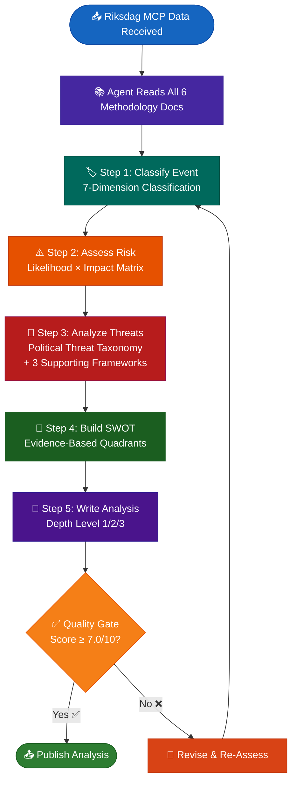

---

## 📊 Methodology Relationship Map

This diagram shows how the six methodology documents relate to each other and feed into the final analysis output:

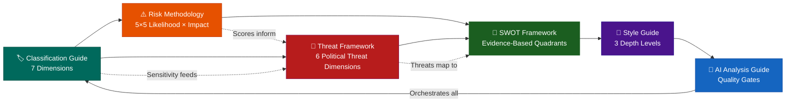

---

## 📋 Methodology Summary Table

| Priority | Document | Key Content | Dimensions / Frameworks | When to Apply |
|----------|----------|-------------|-------------------------|---------------|
| **1** | **[Political Classification Guide](political-classification-guide.md)** | 7-dimension event classification, sensitivity levels, policy domain taxonomy, urgency matrix | Sensitivity (4 levels), Democratic Integrity, Policy Urgency, Economic Impact, Governance Impact, Political Capital, Legislative Impact | **First** — every incoming Riksdag document must be classified before any analysis begins |
| **2** | **[Political Risk Methodology](political-risk-methodology.md)** | Likelihood × Impact scoring, 8 risk categories, 5×5 matrix, cascading risk analysis | Policy, Legislative, Economic, Social, Security, Diplomatic, Coalition, Constitutional | **Second** — after classification, assess political risk using calibrated scoring |
| **3** | **[Political Threat Framework](political-threat-framework.md)** | Multi-framework threat analysis: Political Threat Taxonomy + 3 supporting frameworks | Narrative Integrity, Legislative Integrity, Accountability, Transparency, Democratic Process, Power Balance | **Third** — apply threat analysis using political frameworks (never STRIDE/DREAD/PASTA) |
| **4** | **[Political SWOT Framework](political-swot-framework.md)** | Evidence-based SWOT, confidence levels, 180-day decay, group-to-landscape aggregation | Strengths, Weaknesses, Opportunities, Threats — each with confidence (HIGH/MEDIUM/LOW) | **Fourth** — synthesize classification + risk + threat into strategic SWOT assessment |
| **5** | **[Political Style Guide](political-style-guide.md)** | Writing standards, 3 depth levels, evidence density requirements, anti-patterns | Level 1 Surface (200–500 words), Level 2 Strategic (800–2,000 words), Level 3 Intelligence (2,000–5,000 words) | **Fifth** — apply writing standards when drafting the analysis document |
| **6** | **[AI-Driven Analysis Guide](ai-driven-analysis-guide.md)** | Per-file AI protocol, quality gates, weighted scoring (7.0/10 minimum), conflict resolution | Evidence (25%), Depth (25%), Structural (20%), Actionable (15%), Neutrality (15%) | **Always** — orchestrates the entire pipeline; AI agents must read this first |

---

## 📐 Methodology Architecture

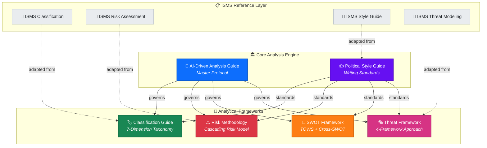

---

## 📖 Methodology Catalog

### 🤖 AI-Driven Analysis Guide — `ai-driven-analysis-guide.md`

| Attribute | Value |
|-----------|-------|
| **Purpose** | Master protocol governing all AI-driven political intelligence analysis |
| **Scope** | All agentic workflows, all analysis types, all output artifacts |
| **Key Rules** | Folder isolation · AI-only content · Multi-framework depth · Quality gates |
| **Version** | 2.0 |

**Core Principles:**
- **Folder Isolation**: Every workflow writes ONLY to its own `analysis/daily/YYYY-MM-DD/{articleType}/` subfolder
- **AI-Only Content**: Scripts must NEVER generate analysis prose, SWOT entries, risk scores, or template content
- **15-Minute Minimum**: Every deep analysis cycle must invest ≥15 minutes of AI reasoning time
- **Quality Gates**: Automated bash checks validate every analysis artifact before commit

---

### 🏷️ Political Classification Guide — `political-classification-guide.md`

| Attribute | Value |
|-----------|-------|
| **Purpose** | Multi-dimensional taxonomy for political document and event classification |
| **Dimensions** | 7: Public Interest · Democratic Integrity · Policy Urgency · Economic Impact · Governance · Political Capital · Legislative Impact |
| **Confidence Levels** | HIGH (≥80%) · MEDIUM (60–79%) · LOW (<60%) |
| **Version** | 2.0 |

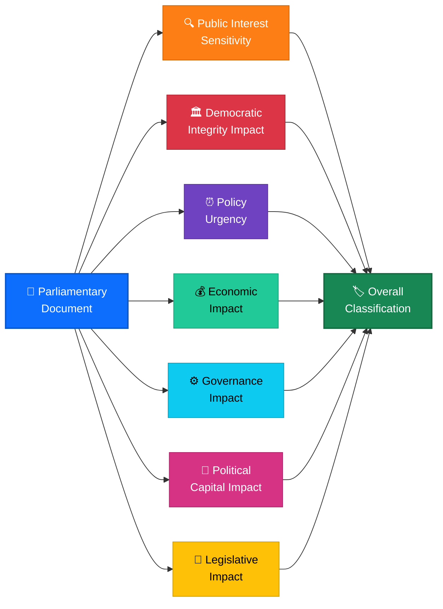

---

### ⚠️ Political Risk Assessment Methodology — `political-risk-methodology.md`

| Attribute | Value |
|-----------|-------|
| **Purpose** | Systematic risk identification, scoring, and cascading impact analysis |
| **Risk Categories** | 8: Policy · Legislative · Economic · Social · Security · Diplomatic · Coalition · Constitutional |
| **Scoring Model** | Likelihood (1–5) × Impact (1–5) = Risk Score (1–25) |
| **Advanced Features** | Cascading risk chains · Political Temperature Index · Risk velocity tracking |
| **Version** | 2.0 |

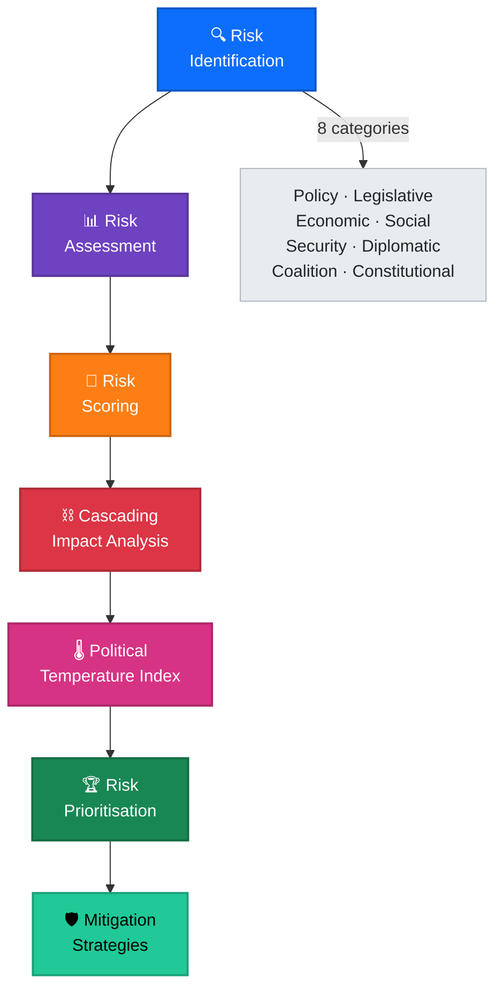

---

### 💼 Political SWOT Analysis Framework — `political-swot-framework.md`

| Attribute | Value |
|-----------|-------|
| **Purpose** | Multi-stakeholder strategic analysis for political events and policy decisions |
| **Stakeholder Lenses** | Government Coalition · Opposition Bloc · Citizens/Civil Society · Economic Actors · International Observers |
| **Advanced Features** | TOWS Matrix · Cross-SWOT Interference · Scenario Generation · Temporal Dynamics |
| **Version** | 2.0 |

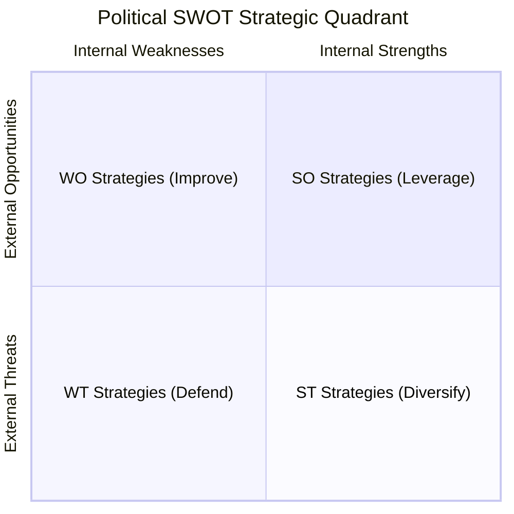

---

### 🎭 Political Threat Analysis Framework — `political-threat-framework.md`

| Attribute | Value |
|-----------|-------|
| **Purpose** | Multi-framework threat modeling for democratic process threats |
| **Frameworks** | 4: Attack Trees + Political Kill Chain + Diamond Model + Actor Profiling |
| **Threat Taxonomy** | 6 Categories: Narrative Integrity · Legislative Integrity · Accountability · Transparency · Democratic Process · Power Balance |
| **Threat Agents** | 6: Ruling Coalition · Opposition · External Actors · Special Interests · Media · Institutional |
| **Version** | 3.0 |

> ⚠️ **STRIDE is NOT used.** The Political Threat Taxonomy replaces STRIDE with politically-native categories designed for democratic function analysis.

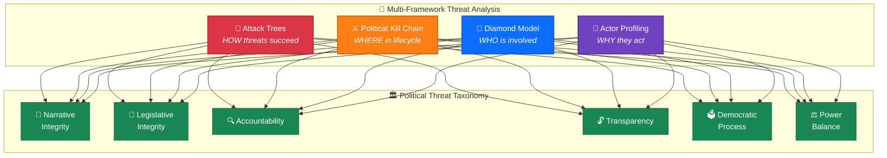

---

### ✍️ Political Intelligence Style Guide — `political-style-guide.md`

| Attribute | Value |
|-----------|-------|
| **Purpose** | Establishes writing standards for all political intelligence output |
| **Scope** | Article tone, evidence citation standards, Mermaid diagram requirements, confidence labeling |
| **Key Standards** | Evidence tables (not prose) · dok_id citations · Color-coded diagrams · Swedish political terminology |
| **Version** | 2.0 |

---

## 🔗 ISMS Reference Adaptations

The analysis methodologies are adapted from Hack23's ISO 27001/NIST CSF/CIS Controls ISMS framework. The `reference/` directory contains mapping documents showing how cybersecurity risk concepts translate to political intelligence:

| Reference Document | ISMS Source | Political Adaptation |
|---|---|---|
| [`isms-classification-adaptation.md`](../reference/isms-classification-adaptation.md) | ISO 27001 A.5.12–A.5.13 | Multi-dimensional political event classification |
| [`isms-risk-assessment-adaptation.md`](../reference/isms-risk-assessment-adaptation.md) | ISO 27001 A.8.8, NIST CSF ID.RA | Cascading political risk assessment |
| [`isms-style-guide-adaptation.md`](../reference/isms-style-guide-adaptation.md) | ISO 27001 A.5.37 | Evidence-based political writing standards |
| [`isms-threat-modeling-adaptation.md`](../reference/isms-threat-modeling-adaptation.md) | ISO 27001 A.5.7, NIST CSF ID.RA-3 | Multi-framework political threat modeling |

---

## 🔄 Methodology Integration Flow

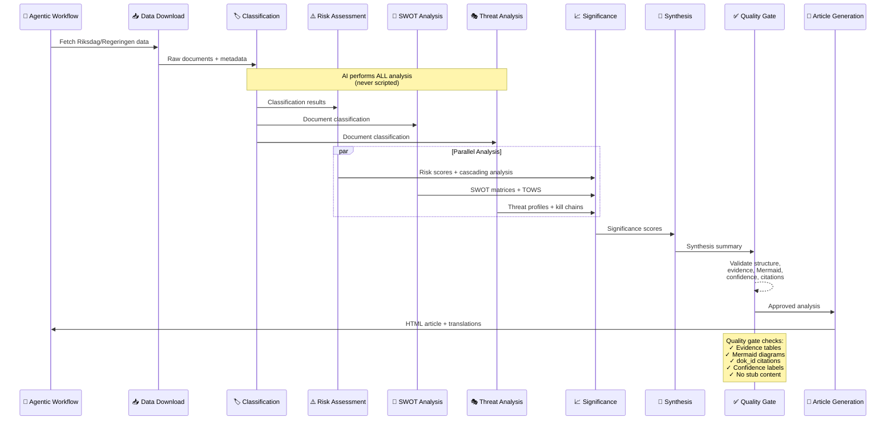

---

## 🎯 Article-Type-Specific Methodology Selection

Different parliamentary document types require **different analytical emphasis**. This matrix maps which methodologies are PRIMARY vs SUPPORTING for each workflow type:

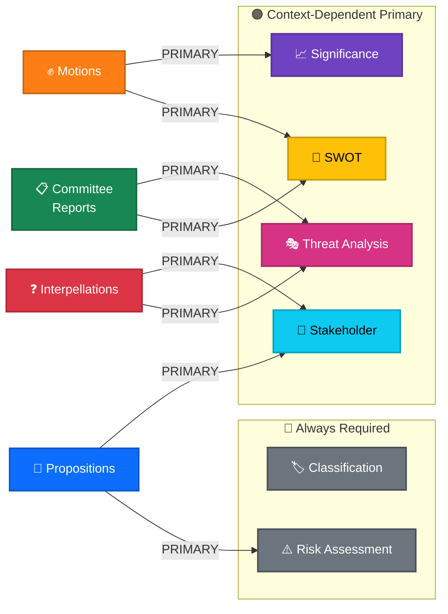

| Article Type | Classification | Risk | SWOT | Threat | Significance | Stakeholder | Unique Focus |
|---|:---:|:---:|:---:|:---:|:---:|:---:|---|
| **Committee Reports** | ✅ | ✅ | 🔴 PRIMARY | 🔴 PRIMARY | ✅ | ✅ | Voting splits, reservation analysis, committee composition effects |
| **Propositions** | ✅ | 🔴 PRIMARY | ✅ | ✅ | ✅ | 🔴 PRIMARY | Legislative pipeline stage, budget impact, policy domain cascading effects |
| **Motions** | ✅ | ✅ | 🔴 PRIMARY | ✅ | 🔴 PRIMARY | ✅ | Opposition strategy patterns, signalverdi, cross-party co-sponsorship |
| **Interpellations** | ✅ | ✅ | ✅ | 🔴 PRIMARY | ✅ | 🔴 PRIMARY | Minister accountability scoring, response quality, evasion detection |
| **Evening Analysis** | ✅ | ✅ | 🔴 PRIMARY | ✅ | ✅ | ✅ | Daily political pulse, vote results, debate intensity metrics |
| **Realtime Monitor** | ✅ | 🔴 PRIMARY | ✅ | ✅ | 🔴 PRIMARY | ✅ | Breaking event urgency, political temperature spike detection |
| **Weekly Review** | ✅ | ✅ | 🔴 PRIMARY | ✅ | ✅ | ✅ | Cross-type trend detection, week-over-week pattern shifts |
| **Week Ahead** | ✅ | 🔴 PRIMARY | ✅ | 🔴 PRIMARY | ✅ | ✅ | Prospective risk landscape, scheduled debates, expected vote outcomes |
| **Monthly Review** | ✅ | ✅ | 🔴 PRIMARY | ✅ | ✅ | 🔴 PRIMARY | Legislative throughput, party productivity, government scorecard |
| **Month Ahead** | ✅ | 🔴 PRIMARY | ✅ | 🔴 PRIMARY | ✅ | ✅ | Strategic political calendar, major policy decision forecast |

> **Reading the matrix:** ✅ = always required for all types. 🔴 PRIMARY = the methodology that should receive the most analytical depth and word count for this article type. Each workflow must apply ALL methodologies but allocate **more time and depth** to PRIMARY ones.

---

## 📏 Quality Standards

Every analysis artifact produced using these methodologies MUST contain:

| Requirement | Description | Enforcement |
|-------------|-------------|-------------|
| **Evidence Tables** | Structured tables with dok_id citations, not free-form prose | Quality gate Check 1 |
| **Mermaid Diagrams** | ≥1 color-coded diagram with `style` directives per analysis file | Quality gate Check 2 |
| **Confidence Labels** | HIGH/MEDIUM/LOW confidence on every assessment | Quality gate Check 3 |
| **dok_id Citations** | Every claim linked to specific parliamentary document IDs | Quality gate Check 4 |
| **Template Compliance** | Must follow the corresponding template in `analysis/templates/` | Quality gate Check 5 |
| **No Stub Content** | No boilerplate phrases like "_No strengths identified_" | Quality gate Check 6 |

---

## ✅ Quality Gate Requirements

All analysis produced under these methodologies must meet the following minimum quality requirements before publication:

### Weighted Quality Score (Minimum 7.0/10)

| Dimension | Weight | Criteria | Fail Indicators |
|-----------|--------|----------|-----------------|
| **Evidence** | 25% | Every claim cites Riksdag MCP data; confidence levels stated; no opinion-only entries | Uncited claims, missing confidence, assertions without data |
| **Depth** | 25% | Appropriate depth level (L1/L2/L3) applied; word count within range; citation count met | Wrong depth level, under minimum citations, superficial coverage |
| **Structural** | 20% | Hack23 header present; metadata complete; Mermaid diagram included; structured tables used | Missing header, no diagram, placeholder content, broken formatting |
| **Actionable** | 15% | Analysis includes concrete implications; stakeholder impact identified; forward-looking recommendations | Purely descriptive without implications, no stakeholder analysis |
| **Neutrality** | 15% | Balanced perspective; no partisan framing; multiple viewpoints acknowledged; factual tone | One-sided framing, loaded language, missing counter-perspectives |

### Structural Checklist

- [ ] Hack23 header with metadata (Owner, Version, Date, Classification)
- [ ] At least one color-coded Mermaid diagram
- [ ] Classification completed across all 7 dimensions
- [ ] SWOT with ≥2 evidence-based entries per quadrant
- [ ] Risk score calculated using 5×5 Likelihood × Impact matrix
- [ ] Threat analysis using Political Threat Taxonomy (not STRIDE/DREAD/PASTA)
- [ ] Appropriate depth level selected and word/citation counts met
- [ ] Significance score (1–10) with justification

---

## 🌳 Methodology Selection Decision Tree

Use this flowchart to determine which methodology to apply for a given analytical task:

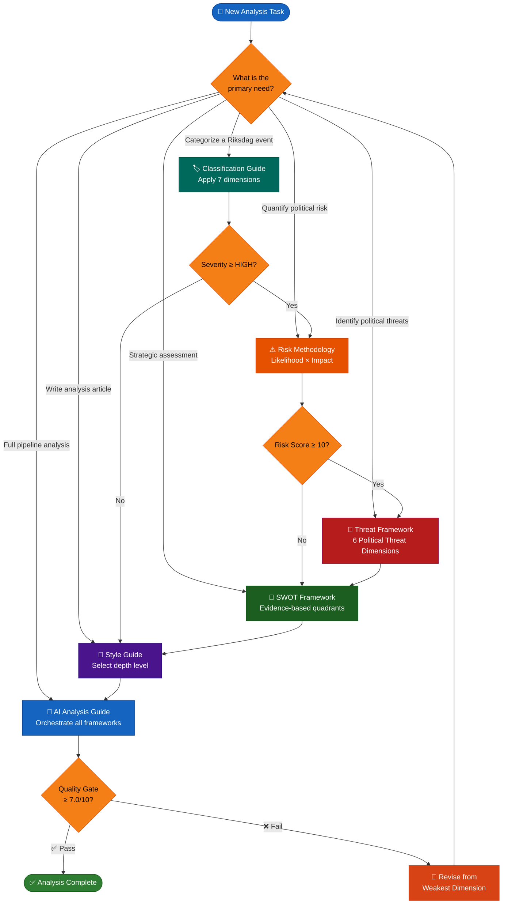

---

## 🚫 Anti-Patterns — What NOT To Do

The following practices are **explicitly prohibited** across all methodologies:

| Anti-Pattern | Why It Fails | Correct Approach |
|-------------|-------------|------------------|
| **Using STRIDE, DREAD, or PASTA** | These are software security threat models, not political intelligence frameworks | Use Political Threat Taxonomy (6 dimensions), Attack Trees, Kill Chain, Diamond Model, Actor Profiling |
| **Boilerplate summaries** | Generic text adds no analytical value; wastes reader attention | Every paragraph must contain at least one Riksdag data citation or concrete analytical insight |
| **Claims without confidence levels** | Ungraded assertions cannot be evaluated for reliability | Assign HIGH / MEDIUM / LOW confidence with source justification |
| **Tables-only analysis** | Data without narrative interpretation is not analysis | Tables must be accompanied by explanatory prose interpreting the data |
| **Opinion without evidence** | Subjective assertions undermine analytical credibility | All opinions must cite verifiable Riksdag/Regeringen MCP data sources |
| **Hardcoded Mermaid values** | Static diagrams become stale and misleading | Use data-driven values sourced from MCP tool results |
| **Shallow classification** | Single-dimension classification misses complexity | Apply all 7 classification dimensions; score each independently |
| **Stale SWOT entries** | Entries older than 180 days without re-verification are unreliable | Enforce 180-day decay rule; re-verify or remove expired entries |
| **Missing stakeholder analysis** | Analysis without impact assessment has no actionable value | Identify affected parties, opposition blocs, committees, and citizens |
| **Ignoring multi-language requirements** | Analysis must serve 14-language platform | Structure content for translation; avoid idioms and culture-specific references |

---

## 🔒 ISMS Compliance Framework Mapping

### ISO 27001:2022 Controls

| Control | Title | Methodology Relevance |
|---------|-------|----------------------|
| **A.5.1** | Policies for information security | All methodologies align with Hack23 ISMS policy framework |
| **A.5.10** | Acceptable use of information | Classification guide defines sensitivity-based data handling |
| **A.5.33** | Protection of records | Style guide enforces evidence citation and audit trail |
| **A.8.3** | Information access restriction | Sensitivity levels (PUBLIC/SENSITIVE/RESTRICTED) gate access |
| **A.8.10** | Information deletion | 180-day SWOT decay rule ensures stale data is removed |
| **A.8.28** | Secure coding | AI analysis guide enforces structured, reviewable output with quality gates |

### NIST CSF 2.0 Functions

| Function | Relevance to Methodologies |
|----------|---------------------------|
| **Identify (ID)** | Classification guide identifies and categorizes Riksdag events by sensitivity and impact |
| **Protect (PR)** | Style guide protects analytical quality through evidence requirements and anti-patterns |
| **Detect (DE)** | Threat framework detects political threats across 6 dimensions using multiple analytical models |
| **Respond (RS)** | Risk methodology provides quantified risk scores enabling proportionate response |
| **Recover (RC)** | SWOT framework supports strategic recovery planning through forward-looking opportunity analysis |

### CIS Controls v8.1

| Control | Title | Methodology Relevance |
|---------|-------|----------------------|
| **Control 1** | Inventory and Control of Enterprise Assets | Classification guide inventories and categorizes all Riksdag data assets |
| **Control 3** | Data Protection | Sensitivity levels enforce appropriate handling for each data classification |
| **Control 8** | Audit Log Management | AI analysis guide requires documented quality gate assessments (audit trail) |
| **Control 14** | Security Awareness and Skills Training | Methodology documents serve as training material for AI agents and analysts |
| **Control 16** | Application Software Security | Quality gates enforce structured, validated analytical output |

---

## 📰 Workflow-Specific Analytical Approach

Each agentic workflow applies the 6 methodologies with **unique emphasis** tailored to its article type:

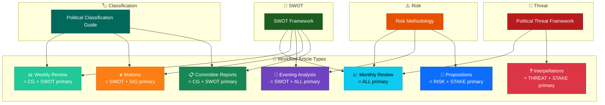

### Unique Analytics Per Article Type

| Workflow | Primary Methodology Focus | Unique Analytical Requirements |
|----------|--------------------------|-------------------------------|
| **Committee Reports** | Classification (document type) + SWOT (coalition dynamics) | 🏛️ Per-committee voting splits, reservation analysis, committee-to-policy-domain mapping |
| **Propositions** | Risk (legislative pipeline risk) + Stakeholder (affected populations) | 📜 Procedure stage tracking; budget impact analysis; policy domain cascading effects |
| **Motions** | SWOT (opposition strategy) + Significance (signalverdi) | ✊ Opposition strategy patterns, cross-party co-sponsorship, signal value assessment |
| **Interpellations** | Threat (accountability gaps) + Stakeholder (minister responses) | ❓ Minister accountability scoring, response quality analysis, evasion detection |
| **Evening Analysis** | ALL methodologies at equal weight | 🌙 Daily parliamentary pulse, vote results + debate intensity, party discipline metrics |
| **Weekly Review** | Classification (outcome categorization) + SWOT (trend assessment) | 📊 Cross-type trend detection, week-over-week pattern shifts, political narrative arc |
| **Monthly Review** | ALL methodologies at equal weight | 📈 Comprehensive legislative throughput, party productivity, government scorecard |

> **Key principle:** Every article type must produce analysis that is **unique and specific** to its focus area. A committee report analysis looks fundamentally different from a monthly review — different data sources, different methodology emphasis, different analytical depth.

---

## 📚 Related Documentation

| Document | Focus | Link |
|----------|-------|------|
| **Analysis README** | Directory overview and critical rules | [analysis/README.md](../README.md) |
| **Templates README** | Template catalog and usage guide | [analysis/templates/README.md](../templates/README.md) |
| **Prompts v2** | AI prompt library for analysis generation | [scripts/prompts/v2/](../../scripts/prompts/v2/) |
| **WORKFLOWS.md** | CI/CD and agentic workflow documentation | [WORKFLOWS.md](../../WORKFLOWS.md) |
| **ISMS-PUBLIC** | Hack23 Information Security Management System | [Hack23/ISMS-PUBLIC](https://github.com/Hack23/ISMS-PUBLIC) |

---

## 🆕 v4.1 Methodology Upgrades (2026-06-01)

All methodology guides were updated in v4.1 with the following cross-cutting improvements:

### 🗳️ Election 2026 Coverage
- `ai-driven-analysis-guide.md` v5.0: Mandatory Election 2026 lens with 5-dimension electoral assessment for ALL analyses
- `political-classification-guide.md` v2.3: Election 2026 urgency boost rules for pre-election period
- `political-swot-framework.md` v2.3: Election 2026 as mandatory SWOT dimension with electoral quadrant requirements
- `political-style-guide.md` v2.2: Election 2026 framing requirements with approved vocabulary and confidence standards

### 🎯 5-Level Confidence Scale
All methodology guides now use a unified **5-level confidence scale**:
- ⬛ VERY LOW → 🟥 LOW → 🟧 MEDIUM → 🟩 HIGH → 🟦 VERY HIGH
- `political-swot-framework.md`: Updated decay table from 3-level to 5-level
- `political-risk-methodology.md`: Added confidence scale mapping + election proximity factor

### 📊 Mermaid Diagram Mandates
- `ai-driven-analysis-guide.md` v5.0: Specifies required diagram type per analysis context (flowchart/timeline/quadrantChart/mindmap for each scenario)

### 📋 Historical Comparison
- `ai-driven-analysis-guide.md` v5.0: Mandatory historical comparison with 3 time periods + precedents table for all synthesis analyses

---

  <em>📊 Hack23 AB — Political Intelligence Through Rigorous Methodology</em>

