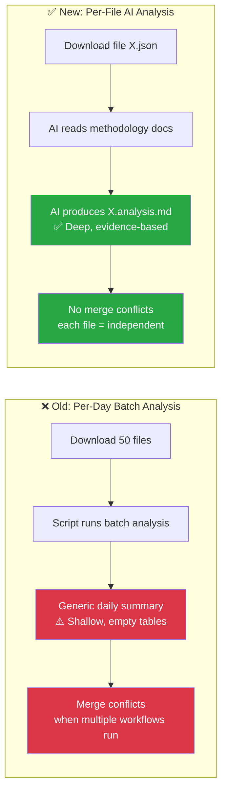
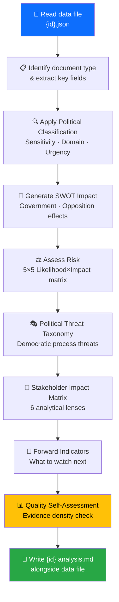
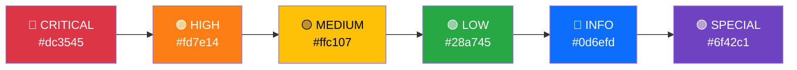
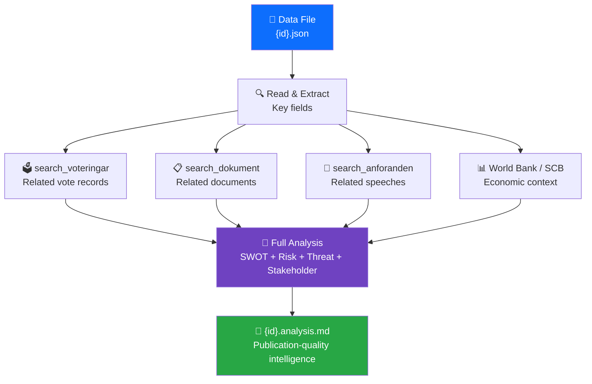
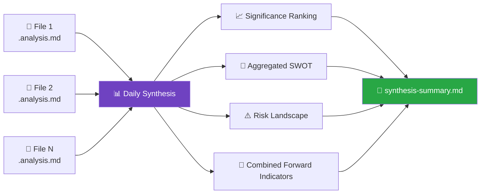
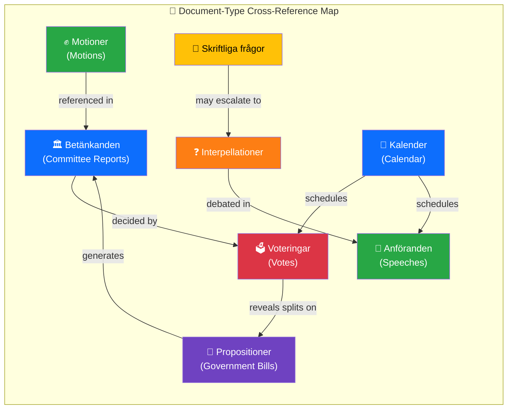
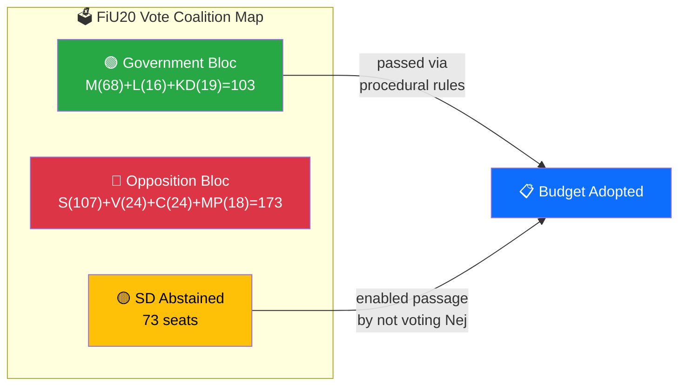

<p align="center">
  
</p>

<h1 align="center">🤖 AI-Driven Per-File Analysis Guide</h1>

<p align="center">
  <strong>📊 Master Protocol for Agentic Political Intelligence Analysis</strong><br>
  <em>🎯 Folder Isolation · AI-Only Content · Multi-Framework Depth · Quality Gates</em>
</p>

<p align="center">
  <a href="#"></a>
  <a href="#"></a>
  <a href="#"></a>
  <a href="#"></a>
</p>

**📋 Document Owner:** CEO | **📄 Version:** 2.1 | **📅 Last Updated:** 2026-03-30 (UTC)  
**🔄 Review Cycle:** Quarterly | **⏰ Next Review:** 2026-06-30  
**🏢 Owner:** Hack23 AB (Org.nr 5595347807) | **🏷️ Classification:** Public

---

## 🎯 Purpose

This methodology guide defines how AI agents perform **per-file political intelligence analysis** in Riksdagsmonitor's agentic workflows. Instead of batch daily analysis that produces shallow, generic results, this approach ensures **every downloaded MCP data file** receives deep, evidence-based analysis producing publication-quality markdown with color-coded Mermaid diagrams.

> *"The quality standard for every analysis file is [SWOT.md](../../SWOT.md) and [THREAT_MODEL.md](../../THREAT_MODEL.md) — rich formatting, evidence-based claims, actionable intelligence, and visual clarity through Mermaid diagrams."*

---

## 🔴 ABSOLUTE RULES (Violations = Rejected Output)

### Rule 1: Folder Isolation — NEVER Overwrite Another Workflow's Analysis

Each agentic workflow writes ONLY to its own isolated folder:

```
analysis/daily/YYYY-MM-DD/{articleType}/
```

**Enforcement checklist:**
- [ ] My workflow writes ONLY to `analysis/daily/$ARTICLE_DATE/$DOC_TYPE/`
- [ ] My `git add` is scoped: `git add "analysis/daily/${ARTICLE_DATE}/${DOC_TYPE}/"`
- [ ] I do NOT touch files in any other workflow's folder
- [ ] Realtime workflows use timestamped folders: `analysis/daily/$ARTICLE_DATE/realtime-HHMM/`

### Rule 2: AI Performs ALL Analysis — Scripts ONLY Download Data

| ✅ Scripts MAY | 🚫 Scripts MUST NEVER |
|---------------|----------------------|
| Download MCP data files | Generate analysis prose, SWOT entries, risk scores |
| Catalog pending files | Fill template sections with content |
| Run quality gate validation | Create "placeholder" text that looks like real analysis |
| Create directory structure | Produce significance scores or classifications |

**Test:** If you can replace the "analysis" content with Lorem Ipsum and nobody notices, it's scripted crap — not genuine analysis.

### Rule 3: Read ALL Methodologies Before Analyzing

Before analyzing ANY document, the AI MUST read:
1. `analysis/methodologies/political-swot-framework.md` — Cross-SWOT interference, TOWS matrix, scenario generation
2. `analysis/methodologies/political-risk-methodology.md` — Cascading risk, Bayesian updating, risk interconnection
3. `analysis/methodologies/political-threat-framework.md` — Attack Trees, Kill Chain, Diamond Model, Political Threat Taxonomy
4. `analysis/methodologies/political-classification-guide.md` — Political Temperature, strategic significance
5. `analysis/methodologies/political-style-guide.md` — Evidence density, attribution, intelligence writing
6. ALL 8 templates in `analysis/templates/`

### Rule 4: Multi-Framework Depth Required

Every analysis file MUST demonstrate:
- **≥ 3 evidence-backed claims** per analytical section (with dok_id citations)
- **≥ 1 color-coded Mermaid diagram** with real data (not placeholders)
- **Multi-perspective analysis** (government, opposition, citizen, media, international)
- **Cross-document pattern identification** (how this relates to other recent activity)
- **Forward-looking indicators** (what to watch next, with specific triggers)
- **At least 2 analytical frameworks** applied (e.g., SWOT + Risk, or Attack Tree + Kill Chain)

---

## 🚨 Mandatory Quality Requirements (Non-Negotiable)

> **Context**: PR #1452 (2026-03-30) demonstrated that rushing analysis produces unacceptable results — plain prose without tables, no Mermaid diagrams, no dok_id evidence citations, and no template structure compliance. These requirements exist to prevent that.

### ⏱️ Minimum Analysis Time: 15 Minutes

Every agentic workflow MUST spend **at least 15 minutes** on analysis. This includes:
- Reading ALL 6 methodology guides fully (not skimming)
- Reading ALL 8 analysis templates fully (not skimming)
- Creating analysis for every document following templates EXACTLY
- Including color-coded Mermaid diagrams with REAL data
- Filling ALL evidence tables with dok_id, confidence, impact columns

### 📊 Output Format Requirements (ALL are mandatory)

| Requirement | Description | Anti-pattern |
|-------------|-------------|-------------|
| **Structured tables** | Every analysis file uses markdown tables with headers | Plain prose paragraphs |
| **Evidence citations** | Every claim cites dok_id, vote counts, or named sources | Generic statements without evidence |
| **Color-coded Mermaid** | ≥1 diagram per file with `style` directives | No diagrams, or grey/unstyled diagrams |
| **Confidence labels** | `[HIGH]`/`[MEDIUM]`/`[LOW]` on every analytical claim | Missing confidence labels |
| **Template structure** | Files follow their template's sections and metadata | Custom structure or missing sections |
| **No placeholders** | Zero `[REQUIRED]` or `[OPTIONAL]` placeholders remain | Unfilled template placeholders |

### 🔍 Quality Gate (Blocking)

Before committing, run the quality gate bash check from `SHARED_PROMPT_PATTERNS.md` Step 5b. If the check fails, go back and improve analysis files until it passes. Do NOT commit failing analysis.

---

## 🏗️ Architecture: Per-File vs. Per-Day Analysis

### Why Per-File?



| Dimension | Per-Day (Old) | Per-File (New) |
|-----------|:------------:|:--------------:|
| **Analysis depth** | Shallow (script-generated) | Deep (AI-driven, methodology-guided) |
| **Output quality** | Empty tables, generic text | SWOT.md-quality with Mermaid diagrams |
| **Merge conflicts** | Frequent (shared daily files) | None (each file independent) |
| **Coverage** | Session-based (misses files) | 100% (every downloaded file) |
| **Reusability** | Daily snapshot only | Persistent per-document intelligence |
| **Incremental** | Must re-run entire day | Only analyze new/changed files |

---

## 📋 Analysis Protocol

### Step 1: Catalog Downloaded Data

Run the catalog script to identify files needing analysis:

```bash
npx tsx scripts/catalog-downloaded-data.ts --pending-only
```

This produces a JSON catalog listing every data file in `analysis/data/` that does NOT yet have an `.analysis.md` companion.

### Step 2: Read Methodology Documents

Before analyzing any file, the AI agent **MUST** read and internalize these methodology guides:

| Priority | Document | Key Content |
|:--------:|----------|-------------|
| 🔴 1 | [political-swot-framework.md](political-swot-framework.md) | Evidence hierarchy, confidence levels, temporal decay, aggregation |
| 🔴 2 | [political-risk-methodology.md](political-risk-methodology.md) | 5×5 Likelihood×Impact matrix, coalition risk index, anomaly detection |
| 🔴 3 | [political-threat-framework.md](political-threat-framework.md) | Political Threat Taxonomy, Attack Trees, Kill Chain, threat actor matrix, severity |
| 🟠 4 | [political-classification-guide.md](political-classification-guide.md) | Sensitivity levels, domain taxonomy, urgency matrix |
| 🟠 5 | [political-style-guide.md](political-style-guide.md) | Writing standards, evidence density, attribution, icons |
| 🟡 6 | [SWOT.md](../../SWOT.md) | **Formatting exemplar** — badges, Mermaid charts, section structure |
| 🟡 7 | [THREAT_MODEL.md](../../THREAT_MODEL.md) | **Formatting exemplar** — threat tables, risk scoring, executive summary |

### Step 3: Analyze Each File

For each pending file in the catalog:



### Step 4: Apply Template

Use the [per-file-political-intelligence.md](../templates/per-file-political-intelligence.md) template. **Every field marked `[REQUIRED]` must be filled.**

### Step 5: Quality Gate

Before writing the analysis file, verify:

| Check | Requirement | Pass? |
|-------|-------------|:-----:|
| Evidence density | ≥ 3 evidence points cited | ☐ |
| Confidence labels | Every analytical claim tagged [HIGH/MEDIUM/LOW] | ☐ |
| SWOT entries | At least 2 quadrants with evidence | ☐ |
| Mermaid diagrams | At least 1 diagram with document-specific data | ☐ |
| Forward indicators | At least 1 specific watch item | ☐ |
| No boilerplate | All `[REQUIRED]` placeholders replaced | ☐ |
| Attribution | All politicians named with party (e.g. "Ulf Kristersson (M)") | ☐ |
| Risk-SWOT integration | Risk scores ≥15 appear as SWOT Threat entries | ☐ |
| Threat severity calibrated | Severity scores match calibration table in threat framework | ☐ |

---

## ⏱️ Time Budget & Prioritization Protocol

### Time Budget Per File

Not all documents need the same analysis depth. Prioritize by document type:

| Document Type | Analysis Time Budget | Analysis Depth | Sections Required |
|--------------|:--------------------:|:--------------:|------------------|
| **Propositions** | 3–5 minutes | Full (all sections) | Classification + SWOT + Risk + Threat + Stakeholder + Forward |
| **Votes** | 2–4 minutes | Full (all sections) | Classification + SWOT + Risk + Stakeholder + Forward |
| **Committee Reports** | 2–3 minutes | Standard | Classification + SWOT + Risk + Forward |
| **Speeches** | 1–2 minutes | Quick | Classification + Stakeholder + Forward |
| **Motions** | 1–2 minutes | Quick | Classification + SWOT (opposition focus) + Forward |
| **Questions/Interpellations** | 1–2 minutes | Quick | Classification + Stakeholder + Forward |
| **Government Documents** | 2–3 minutes | Standard | Classification + Risk + Stakeholder + Forward |
| **World Bank/SCB Data** | 1–2 minutes | Context | Classification + Economic context note |

### Prioritization When Time-Constrained

When the workflow time budget is limited (e.g., 12 minutes for AI analysis in evening workflow):

1. **Sort pending files by expected significance** — Propositions and votes first, then committee reports, then everything else
2. **Analyze highest-priority files first** — Complete full analysis for top-priority documents
3. **Quick-classify remaining files** — At minimum, assign classification level and significance score
4. **Stop at time limit** — Whatever is analyzed is committed; remaining files are flagged as "pending" for next run

> **How per-file budgets interact with workflow time limits:**
> - Per-file budgets (1–5 min) are **maximums** for a single file; most files take less
> - When a workflow has 12 minutes and 30 pending files:
>   - Analyze 2 high-priority files at full depth (5 min each = 10 min)
>   - Quick-classify remaining 28 files (5 sec each = ~2 min total)
>   - Total: ~12 min — within budget
> - Prioritization order (Step 1) ensures the most significant files always get full analysis
> - **Example:** 12 min budget, 30 files → 2 propositions at full depth (10 min) + 28 quick-classified (2 min) = 12 min. If only 5 files exist, analyze all at full depth (≤15 min).

### Maximum Files Per Workflow Run

| Workflow | Typical Download | Analysis Target | Time Budget |
|----------|:----------------:|:---------------:|:-----------:|
| Evening analysis | 20–50 files | 10–15 full + rest quick-classified | 12 minutes |
| Morning per-type | 5–20 files | All files (single type) | 8 minutes |
| Realtime monitor | 1–5 files | All files (full depth) | 5 minutes |
| Weekly review | 50–200 files | Top 20 full + rest aggregated | 15 minutes |

---

## 📄 Document Type-Specific Analysis

### Propositions (prop)

Focus areas:
- **Coalition dynamics**: Which parties co-sponsor? Any defections expected?
- **Policy impact**: What changes for citizens, businesses, international commitments?
- **Budget implications**: Fiscal impact assessment using World Bank/SCB context
- **Legislative pipeline**: Committee referral, expected timeline, amendment risk

### Motions (mot)

Focus areas:
- **Opposition signaling**: What policy alternatives are being proposed?
- **Cross-party alignment**: Do multiple opposition parties file similar motions?
- **Government vulnerability**: Does the motion target a known coalition weakness?
- **Trend detection**: Is this part of a broader pattern of opposition activity?

### Committee Reports (bet)

Focus areas:
- **Decision quality**: Unanimous or divided? Reservations filed?
- **Policy coherence**: Does the committee recommendation align with government intent?
- **Democratic process**: Were public hearings held? Expert testimony considered?
- **Implementation readiness**: Is the recommended action feasible?

### Votes (voteringar)

Focus areas:
- **Coalition discipline**: Did all coalition parties vote together?
- **SD behavior**: Support or abstention? What does this signal?
- **Cross-party voting**: Unexpected alliances or defections?
- **Margin analysis**: Close vote = instability indicator

### Speeches (anföranden)

Focus areas:
- **Rhetorical signals**: New policy positions announced? Tone shifts?
- **Accountability probes**: Ministers challenged on record?
- **Consensus building**: Cross-party appeals or partisan rhetoric?
- **Media potential**: Quotable statements for news coverage?

### Questions & Interpellations (frågor, interpellationer)

Focus areas:
- **Accountability pressure**: What is the opposition demanding answers on?
- **Minister responsiveness**: Timely and substantive responses?
- **Policy gaps**: Issues the government hasn't addressed?
- **Pattern detection**: Coordinated questioning campaigns?

### Government Documents (regeringen)

Focus areas:
- **SOU recommendations**: What expert panels suggest
- **Press releases**: Government messaging and priorities
- **Remisser**: Stakeholder consultation outcomes

### World Bank / SCB Data

Focus areas:
- **Economic context**: GDP growth, unemployment, inflation trends
- **Policy validation**: Do statistics support government claims?
- **International comparison**: Sweden vs. Nordic peers, EU averages
- **Risk indicators**: Economic headwinds affecting political stability

---

## 🎨 Formatting Standards (SWOT.md / THREAT_MODEL.md Quality)

### Required Formatting Elements

1. **Hack23 Header Block** — Logo, title, badges (Owner, Version, Effective Date, Classification)
2. **Executive Summary** — 3–5 sentence intelligence-level summary
3. **Mermaid Diagrams** — At least 1, using color-coded styles:
   ```
   style NodeName fill:#dc3545,color:#fff   /* Red — critical/threat */
   style NodeName fill:#fd7e14,color:#fff   /* Orange — high risk */
   style NodeName fill:#ffc107,color:#000   /* Yellow — medium */
   style NodeName fill:#28a745,color:#fff   /* Green — strength/low risk */
   style NodeName fill:#0d6efd,color:#fff   /* Blue — informational */
   style NodeName fill:#6f42c1,color:#fff   /* Purple — special category */
   ```
4. **Evidence Tables** — Structured tables with Confidence and Impact columns
5. **Emoji Section Headers** — Consistent with existing templates (💪 ⚠️ 🚀 🔴 🎭 👥 🔮)
6. **Confidence Labels** — `[HIGH]` `[MEDIUM]` `[LOW]` on every analytical claim
7. **Document Control Footer** — Template path, classification, next review date

### Color Coding Convention for Mermaid



---

## 🔄 Integration with Agentic Workflows

### Workflow Step: Per-File Analysis

Every agentic news workflow should include this analysis step **after** data download and **before** article generation:

```markdown
## Step N: Per-File AI Analysis

1. Run catalog: `npx tsx scripts/catalog-downloaded-data.ts --pending-only`
2. Read ALL methodology documents (this file + 5 frameworks + 1 template)
3. For each pending file in the catalog:
   a. Read the data JSON file with `view` or `cat` — understand what data it contains
   b. Use MCP tools to gather additional context (related votes, speeches, committee reports)
   c. Apply the per-file-political-intelligence template
   d. Fill ALL required fields with evidence-based analysis from the actual data
   e. Include at least 1 color-coded Mermaid diagram with REAL data from the file
   f. Write {id}.analysis.md alongside the data file
4. Compose daily/weekly synthesis from per-file analyses
```

### MCP Data Enrichment

When analyzing a parliamentary document, use MCP tools to gather context:



### Synthesis Composition

After all per-file analyses are complete, compose the daily synthesis:



Steps:
1. Read all `.analysis.md` files for the analysis period
2. Rank documents by significance score
3. Aggregate SWOT entries using the [political-swot-framework.md](political-swot-framework.md) intersection rules (Gov S + Opp T = contested terrain, Gov W + Opp O = opposition opportunity)
4. Compute overall risk landscape from individual risk assessments
5. Write to `analysis/daily/YYYY-MM-DD/synthesis-summary.md`

---

## ✅ Concrete Example: What Good Analysis Looks Like

Below is a **mini example** showing the difference between bad and good analysis output:

### ❌ BAD — Generic boilerplate (FAILS quality gate)

> **Real-world example**: PR #1452 (2026-03-30) produced this style of output — plain prose, no tables, no Mermaid diagrams. This is NEVER acceptable.

```markdown
## 🎯 Executive Summary
This document is significant because it relates to fiscal policy. 
The government's position is strengthened. [MEDIUM confidence]

## 💪 SWOT Impact
| Quadrant | Statement | Evidence | Confidence |
|----------|-----------|----------|:----------:|
| ✅ Strength | Government position strengthened | [REQUIRED] | M |
| 🔴 Threat | Opposition may criticize | [REQUIRED] | L |
```

**Problems:** No dok_id references, generic text, `[REQUIRED]` still present, no specific data, no Mermaid diagram.

### ❌ ALSO BAD — Plain prose without template structure (FAILS quality gate)

> **Real-world example**: PR #1452 SWOT analysis was plain prose paragraphs with bullet points but NO structured tables, NO Mermaid diagrams, NO dok_id columns, and NO template metadata header. This is equally unacceptable.

```markdown
## Detailed Analysis

### Government Coalition (M+KD+L with SD support)

**Strengths**:
- Strong legislative output: 20+ propositions in March
- Voting discipline remains strong

**Weaknesses**:
- MP leaving M party group signals internal dissent
- Minister under KU scrutiny

**Opportunities**:
- Criminal justice propositions could strengthen messaging
```

**Problems:** No template structure (missing SWOT ID, SWOT Context table, metadata header). No evidence tables with `#`, `Statement`, `Evidence (dok_id)`, `Confidence`, `Impact` columns. No Mermaid SWOT Quadrant Mapping diagram. No color coding. No document control footer. Plain prose instead of structured intelligence.

### ✅ GOOD — Evidence-based intelligence with template structure (PASSES quality gate)

> **Reference exemplar**: [SWOT.md](../../SWOT.md) — this is the formatting quality standard.

```markdown
## 📋 SWOT Context

| Field | Value |
|-------|-------|
| **SWOT ID** | SWT-2026-03-30-001 |
| **Analysis Date** | 2026-03-30 00:40 UTC |
| **Analysis Scope** | Government coalition (M+KD+L with SD support) |
| **Reference Period** | 2025/26 |
| **Produced By** | news-realtime-monitor |
| **Primary MCP Sources** | search_dokument, get_propositioner, search_voteringar |
| **Validity Window** | Valid until 2026-04-06 |

## 🏛️ Section 1: Government Coalition SWOT

### ✅ Strengths — Government Coalition

| # | Strength Statement | Evidence (dok_id) | Confidence | Impact | Entry Date |
|---|-------------------|-------------------|:----------:|:------:|:----------:|
| S1 | Coalition maintains working majority — AU10 vote showed standard party alignment with SD support | AU10 vote record (dok_id: H901AU10) | H | H | 2026-03-30 |
| S2 | Strong legislative output — 20+ propositions in March covering criminal justice and defense | Prop 2025/26:227, 213, 210 (criminal justice), Prop 2025/26:205 (food stockpile) | H | M | 2026-03-30 |

### ⚠️ Weaknesses — Government Coalition

| # | Weakness Statement | Evidence (dok_id) | Confidence | Impact | Entry Date |
|---|-------------------|-------------------|:----------:|:------:|:----------:|
| W1 | MP Marléne Lund Kopparklint leaving M party group signals internal dissent — narrows parliamentary arithmetic | Riksdag MP registry, party group change notice | H | M | 2026-03-30 |
| W2 | Minister Andreas Carlson (KD) under KU scrutiny for Lantmäteriet security failures — G7-8 complaint dockets | KU hearing agenda, dockets G7, G8 | H | H | 2026-03-30 |

## 📊 SWOT Quadrant Mapping

​```mermaid
graph TD
    subgraph "📊 Political SWOT Landscape — 2026-03-30"
        direction TB
        subgraph "✅ Strengths (Internal Positive)"
            S1N["💪 S1: Coalition majority holds (AU10)"]
            S2N["💪 S2: 20+ propositions in March"]
        end
        subgraph "⚠️ Weaknesses (Internal Negative)"
            W1N["⚡ W1: MP defection from M"]
            W2N["⚡ W2: KU scrutiny of Carlson (KD)"]
        end
        subgraph "🚀 Opportunities (External Positive)"
            O1N["🌟 O1: Criminal justice messaging"]
        end
        subgraph "🔴 Threats (External Negative)"
            T1N["☁️ T1: KU exposes security failures"]
            T2N["☁️ T2: Northvolt fiscal scrutiny"]
        end
    end

    S1N -.->|"exploits"| O1N
    W2N -.->|"amplifies"| T1N
    T2N -.->|"targets"| W2N

    style S1N fill:#28a745,color:#fff
    style S2N fill:#28a745,color:#fff
    style W1N fill:#fd7e14,color:#fff
    style W2N fill:#fd7e14,color:#fff
    style O1N fill:#0d6efd,color:#fff
    style T1N fill:#dc3545,color:#fff
    style T2N fill:#dc3545,color:#fff
​```
```

**Why this passes:** Template structure with SWOT Context metadata table. Evidence tables with `#`, `Statement`, `Evidence (dok_id)`, `Confidence`, `Impact`, `Entry Date` columns. Color-coded Mermaid SWOT Quadrant Mapping with `style` directives. Specific dok_id citations. All claims labeled with confidence. Human-readable markdown.

---

## 📑 Document-Type Analysis Focus

Every Riksdag document type maps to specific analysis templates and MCP data tools. Use this table to select the correct analytical approach for each incoming data file:

| Document Type | MCP Data Category | Primary Templates | Key MCP Cross-Reference Tools |
|---------------|-------------------|-------------------|-------------------------------|
| 🏛️ **Betänkanden** (committee reports) | `bet` — committee deliberation outcomes from FiU, JuU, SoU, UU, etc. | Classification + Risk + SWOT | `get_betankanden`, `search_voteringar`, `search_dokument_fulltext` |
| 📜 **Propositioner** (government propositions) | `prop` — government bills (e.g., Prop. 2025/26:227) | Risk + Stakeholder | `get_propositioner`, `search_dokument_fulltext`, `search_dokument` |
| ✊ **Motioner** (parliamentary motions) | `mot` — MP-authored proposals from S, M, SD, V, MP, C, L, KD | Classification + SWOT + Significance | `get_motioner`, `search_dokument_fulltext`, `search_ledamoter` |
| ❓ **Interpellationer** (interpellations) | `ip` — minister-directed debates | Threat + Stakeholder | `get_interpellationer`, `search_anforanden`, `get_ledamot` |
| 📝 **Skriftliga frågor** (written questions) | `fr` — written questions to ministers | Classification + Significance | `get_fragor`, `search_dokument` |
| 🗳️ **Voteringar** (votes) | `votering` — roll-call votes with party splits | Classification + SWOT + Threat | `search_voteringar`, `get_voting_group`, `get_betankanden` |
| 🎤 **Anföranden** (speeches) | `anf` — chamber debate speeches | Stakeholder + Significance | `search_anforanden`, `fetch_paginated_anforanden`, `get_ledamot` |
| 📅 **Kalender** (calendar events) | `kal` — scheduled debates, hearings, votes | Significance + Risk | `get_calendar_events`, `search_dokument` |

### 🔗 Cross-Reference Strategy

When analyzing any document, always cross-reference with related data to build richer intelligence:



> **Example:** When analyzing a betänkande from JuU (Justitieutskottet), cross-reference `search_voteringar` for the vote outcome, `search_anforanden` for committee debate speeches, and `get_propositioner` for the originating government bill.

---

## 📐 Document-Specific Analysis Depth

Not every document warrants the same analysis depth. Use the following tiered model to allocate analytical effort proportional to political significance:

```mermaid
graph TD
    subgraph "📐 Analysis Depth Levels"
        direction TB
        L3["🔴 Level 3 — Intelligence<br/>2000–5000 words · ≥10 citations<br/>Full multi-framework analysis"]
        L2["🟠 Level 2 — Strategic<br/>800–2000 words · ≥5 citations<br/>Focused framework application"]
        L1["🟢 Level 1 — Surface<br/>200–500 words · ≥3 citations<br/>Classification + key findings"]
    end

    subgraph "🏛️ Level 3 Documents"
        L3A["Betänkanden with voting splits<br/>(e.g., JuU10 with SD dissent)"]
        L3B["Propositioner with budget impact<br/>(e.g., Prop. 2025/26:100 vårbudget)"]
        L3C["Voteringar with coalition fractures<br/>(e.g., M+KD vs L on migration)"]
    end

    subgraph "🔶 Level 2 Documents"
        L2A["Motioner from party leaders<br/>(e.g., S shadow budget motion)"]
        L2B["Interpellationer on policy crises<br/>(e.g., minister accountability)"]
        L2C["Evening / weekly synthesis<br/>(cross-document analysis)"]
    end

    subgraph "🟢 Level 1 Documents"
        L1A["Skriftliga frågor<br/>(routine written questions)"]
        L1B["Kalender events<br/>(scheduled debates, hearings)"]
        L1C["Routine anföranden<br/>(standard debate speeches)"]
    end

    L3 --> L3A
    L3 --> L3B
    L3 --> L3C
    L2 --> L2A
    L2 --> L2B
    L2 --> L2C
    L1 --> L1A
    L1 --> L1B
    L1 --> L1C

    style L3 fill:#dc3545,color:#fff
    style L2 fill:#fd7e14,color:#fff
    style L1 fill:#28a745,color:#fff
    style L3A fill:#dc3545,color:#fff
    style L3B fill:#dc3545,color:#fff
    style L3C fill:#dc3545,color:#fff
    style L2A fill:#fd7e14,color:#fff
    style L2B fill:#fd7e14,color:#fff
    style L2C fill:#fd7e14,color:#fff
    style L1A fill:#28a745,color:#fff
    style L1B fill:#28a745,color:#fff
    style L1C fill:#28a745,color:#fff
```



### 📏 Depth Level Requirements

| Criteria | 🟢 Level 1 — Surface | 🟠 Level 2 — Strategic | 🔴 Level 3 — Intelligence |
|----------|:---------------------:|:----------------------:|:-------------------------:|
| **Word count** | 200–500 | 800–2,000 | 2,000–5,000 |
| **Minimum citations** | ≥ 3 (dok_id) | ≥ 5 (dok_id + vote counts) | ≥ 10 (dok_id + cross-ref) |
| **Mermaid diagrams** | 0–1 (optional) | ≥ 1 (required) | ≥ 2 (required, color-coded) |
| **Frameworks applied** | Classification only | 1–2 (e.g., SWOT or Risk) | ≥ 2 (e.g., SWOT + Threat + Risk) |
| **Confidence labels** | Optional | Required on key claims | Required on ALL claims |
| **Forward indicators** | 1 "watch next" item | 2–3 triggers with dates | ≥ 5 triggers with thresholds |
| **Cross-references** | Link to parent document | Link to 2–3 related docs | Network of ≥ 5 related docs |
| **Typical turnaround** | 5–10 min | 15–25 min | 30–60 min |

### 🔀 Escalation Rules

A document may be **escalated** from a lower level to a higher level when:

- **L1 → L2:** Written question reveals a pattern across multiple ministers, or calendar event precedes a high-stakes vote
- **L2 → L3:** Motion gathers cross-party support (≥ 3 parties), or interpellation triggers minister resignation speculation
- **L3 (automatic):** Any document involving a vote of confidence, budget bill, or constitutional amendment (grundlagsändring)

---

## ⚠️ Anti-Pattern Gallery

These examples show common failures and their corrections. Use them as calibration references during quality gate review.

### Anti-Pattern 1: Scripted Boilerplate

> ❌ **BAD — Generic "this is important" text without evidence**

```markdown
## Analysis

This proposition is important for Swedish politics. It will have significant
implications for the government coalition. The opposition has expressed concerns.
This development should be monitored closely as it may affect future policy.
```

**Why it fails:** No dok_id citations, no confidence labels, no specific actors or committees named, no quantified impact, could describe literally any document.

> ✅ **GOOD — Evidence-based analysis with dok_id citations**

```markdown
## 📊 Analysis — Prop. 2025/26:227 (Skärpta straff vid brott mot journalister)

| # | Finding | Evidence (dok_id) | Confidence | Impact |
|---|---------|-------------------|:----------:|:------:|
| F1 | JuU unanimously backed the proposition — rare cross-party consensus on press freedom | H901JuU15, vote record 2026-03-28 | HIGH | HIGH |
| F2 | SD filed a reservation on penalty ranges (§4–6) — signals opposition to sentencing reform scope | H901JuU15 reservation (SD), dok_id H901JuU15r1 | HIGH | MEDIUM |
| F3 | Prop references EU Directive 2024/1083 — external compliance driver limits parliamentary discretion | Prop. 2025/26:227, section 3.2 | MEDIUM | MEDIUM |
```

**Why it passes:** Every claim has a dok_id, confidence level, and impact rating. Specific committee (JuU), party (SD), and document references. Structured table format.

---

### Anti-Pattern 2: Summary Without Structure

> ❌ **BAD — Prose-only narrative with no analytical framework**

```markdown
The budget debate continued today with several speeches from government and
opposition MPs. The Finance Committee presented its report and voting followed
party lines mostly. Some interesting points were raised about healthcare funding
and defense spending. The coalition appears stable for now but there are some
tensions beneath the surface.
```

**Why it fails:** No tables, no Mermaid diagrams, no confidence labels, no SWOT/Risk/Threat framework applied, reads like a newspaper summary rather than intelligence analysis.

> ✅ **GOOD — Tables + Mermaid + confidence labels**

```markdown
## 🗳️ Voting Analysis — FiU20 (Vårbudget 2026)

| Party | Ja | Nej | Avstår | Frånvarande | Alignment |
|:-----:|:--:|:---:|:------:|:-----------:|:---------:|
| S | 0 | 107 | 0 | 0 | Opposition bloc |
| M | 68 | 0 | 0 | 2 | Government bloc |
| SD | 0 | 0 | 73 | 0 | ⚠️ Abstained |
| V | 0 | 24 | 0 | 0 | Opposition bloc |
| C | 0 | 24 | 0 | 0 | Opposition bloc |
| MP | 0 | 18 | 0 | 0 | Opposition bloc |
| L | 16 | 0 | 0 | 0 | Government bloc |
| KD | 19 | 0 | 0 | 0 | Government bloc |

**Key finding [HIGH]:** SD abstention on vårbudget signals negotiation leverage — government passed with 103 Ja vs 173 Nej + 73 Avstår, relying on procedural rules.
```



**Why it passes:** Vote table with party-level granularity, confidence-labeled key finding, Mermaid diagram showing coalition dynamics with color coding, specific seat counts.

---

### Anti-Pattern 3: Overwriting Previous Analysis

> ❌ **BAD — Writing to a shared file that another workflow owns**

```bash
# Workflow A writes its analysis to the daily summary
echo "$ANALYSIS" >> analysis/daily/2026-03-30/daily-summary.md

# Workflow B ALSO writes to the same file — OVERWRITES Workflow A
echo "$ANALYSIS" >> analysis/daily/2026-03-30/daily-summary.md
```

**Why it fails:** Both workflows compete for the same file path. Git merge conflicts are guaranteed. Workflow A's analysis may be lost entirely.

> ✅ **GOOD — Folder isolation with workflow-specific paths**

```bash
# Workflow A: proposition analysis → isolated folder
mkdir -p analysis/daily/2026-03-30/propositioner/
cat > analysis/daily/2026-03-30/propositioner/prop-2025-26-227.analysis.md

# Workflow B: vote analysis → separate isolated folder
mkdir -p analysis/daily/2026-03-30/voteringar/
cat > analysis/daily/2026-03-30/voteringar/fiu20-varbudget.analysis.md

# Synthesis workflow: reads BOTH, writes to its OWN folder
mkdir -p analysis/daily/2026-03-30/synthesis/
cat > analysis/daily/2026-03-30/synthesis/evening-intelligence-summary.md
```

**Why it passes:** Each workflow writes exclusively to its own subfolder. No file path collisions. Synthesis workflow reads from all folders but writes only to `synthesis/`. Follows Rule 1 (Folder Isolation).

---

## ✅ Quality Gate Checklist

Before committing any analysis file, verify it passes ALL four quality dimensions. A file that fails any single blocking check (marked 🔴) MUST be revised before commit.

### 📋 Structural Quality

| # | Check | Blocking | Details |
|---|-------|:--------:|---------|
| SQ-1 | Hack23 header block present | 🔴 | Logo, title, badges (Owner, Version, Date, Classification) |
| SQ-2 | ≥ 1 Mermaid diagram with `style` directives | 🔴 | Color-coded per convention (#dc3545, #fd7e14, #ffc107, #28a745, #0d6efd, #6f42c1) |
| SQ-3 | ≥ 1 structured evidence table | 🔴 | Must include `Evidence (dok_id)`, `Confidence`, `Impact` columns |
| SQ-4 | No placeholder text remaining | 🔴 | Zero instances of `[REQUIRED]`, `[OPTIONAL]`, `TODO`, `TBD`, `placeholder` |
| SQ-5 | Template section structure followed | 🟡 | Sections match the applicable template from `analysis/templates/` |
| SQ-6 | Document control footer present | 🟡 | Path, version, classification, next review date |

### 🔍 Analytical Quality

| # | Check | Blocking | Details |
|---|-------|:--------:|---------|
| AQ-1 | Political classification assigned | 🔴 | Using taxonomy from `political-classification-guide.md` |
| AQ-2 | SWOT analysis with ≥ 2 entries per quadrant | 🔴 | S, W, O, T each have at least 2 evidence-backed entries |
| AQ-3 | Risk assessment uses 5×5 matrix | 🟡 | Likelihood (1–5) × Impact (1–5), color-coded in Mermaid |
| AQ-4 | Threat analysis applies ≥ 1 framework | 🟡 | Attack Tree, Kill Chain, Diamond Model, or Political Threat Taxonomy |
| AQ-5 | Significance score assigned (1–10 scale) | 🔴 | With justification referencing methodology criteria |
| AQ-6 | Forward-looking indicators included | 🟡 | ≥ 1 "what to watch" trigger with specific conditions |

### 📎 Evidence Quality

| # | Check | Blocking | Details |
|---|-------|:--------:|---------|
| EQ-1 | Every analytical claim has a citation | 🔴 | dok_id, vote record, MP name, committee reference, or named source |
| EQ-2 | Confidence levels on all key claims | 🔴 | `[HIGH]`, `[MEDIUM]`, or `[LOW]` — no unlabeled assertions |
| EQ-3 | No opinion-only statements | 🔴 | Every evaluative sentence backed by evidence or labeled `[ASSESSMENT]` |
| EQ-4 | Cross-references to related documents | 🟡 | Links to related betänkanden, propositioner, or voteringar |
| EQ-5 | MCP data source attribution | 🟡 | State which `riksdag-regering-mcp` tools provided the source data |

### ✍️ Writing Quality

| # | Check | Blocking | Details |
|---|-------|:--------:|---------|
| WQ-1 | Depth level met (L1/L2/L3) | 🔴 | Word count and citation count meet the tier requirements |
| WQ-2 | Active voice predominates | 🟡 | "FiU recommended…" not "It was recommended by FiU…" |
| WQ-3 | Swedish political terminology used correctly | 🔴 | Riksdag, utskott, betänkande, votering, reservation — not anglicized equivalents |
| WQ-4 | Multi-language friendly phrasing | 🟡 | Avoid idioms; define acronyms on first use (e.g., "KU (Konstitutionsutskottet)") |
| WQ-5 | No subjective language without `[ASSESSMENT]` tag | 🟡 | "controversial" → `[ASSESSMENT: controversial given 60/40 vote split]` |

### 📊 Quality Scoring Rubric

Each analysis file receives a composite score across five dimensions:

| Dimension | Weight | Score Range | Minimum Pass |
|-----------|:------:|:-----------:|:------------:|
| 📎 **Evidence** — citation density, dok_id specificity, cross-references | 25% | 0–10 | 7.0 |
| 📐 **Depth** — word count, framework coverage, forward indicators | 25% | 0–10 | 7.0 |
| 📋 **Structural** — templates, Mermaid, tables, headers, no placeholders | 20% | 0–10 | 7.0 |
| 🎯 **Actionable** — triggers, thresholds, "watch next" items, decision support | 15% | 0–10 | 6.0 |
| ⚖️ **Neutrality** — balanced perspectives, confidence labels, no opinion-only | 15% | 0–10 | 6.0 |

**Composite score = Σ (dimension score × weight)**

| Composite Score | Verdict | Action |
|:---------------:|---------|--------|
| **≥ 8.5** | 🟢 **Excellent** — publish immediately | No revision needed |
| **7.0 – 8.4** | 🟡 **Acceptable** — publish with minor notes | Flag areas below 7.0 for next iteration |
| **5.0 – 6.9** | 🟠 **Below threshold** — revise before commit | Improve weakest dimensions, re-run quality gate |
| **< 5.0** | 🔴 **Rejected** — do not commit | Restart analysis following methodology guides |

> **Minimum passing score: 7.0/10 composite.** Any individual dimension scoring below its minimum pass threshold triggers automatic revision regardless of composite score.

---

## 📚 Related Documents

| Document | Purpose |
|----------|---------|
| [per-file-political-intelligence.md](../templates/per-file-political-intelligence.md) | Per-file analysis output template |
| [per-file-intelligence-analysis.md](../../scripts/prompts/v2/per-file-intelligence-analysis.md) | AI prompt with full protocol and filled example |
| [political-swot-framework.md](political-swot-framework.md) | SWOT methodology with evidence hierarchy |
| [political-risk-methodology.md](political-risk-methodology.md) | Risk assessment methodology |
| [political-threat-framework.md](political-threat-framework.md) | Multi-framework threat analysis (Attack Trees, Kill Chain, Diamond Model) |
| [political-classification-guide.md](political-classification-guide.md) | Classification taxonomy |
| [political-style-guide.md](political-style-guide.md) | Writing and formatting standards |
| [SWOT.md](../../SWOT.md) | **Formatting exemplar** (platform SWOT) |
| [THREAT_MODEL.md](../../THREAT_MODEL.md) | **Formatting exemplar** (platform threat model) |

---

**Document Control:**  
- **Path:** `/analysis/methodologies/ai-driven-analysis-guide.md`  
- **Version:** 2.1  
- **Key Changes v2.1:** Document-type analysis focus table, analysis depth levels (L1/L2/L3), anti-pattern gallery, quality gate checklist with scoring rubric  
- **Key Changes v2.0:** Folder isolation rules, AI-only content mandate, multi-framework depth requirements, advanced anti-pattern detection  
- **Classification:** Public  
- **Next Review:** 2026-06-30
