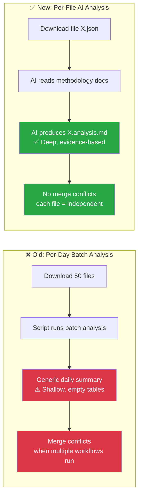
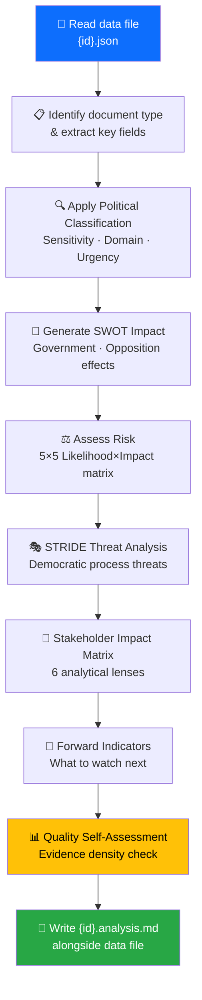

<p align="center">
  
</p>

<h1 align="center">🤖 AI-Driven Per-File Analysis Guide</h1>

<p align="center">
  <strong>📊 Comprehensive Methodology for Agentic Political Intelligence Analysis</strong><br>
  <em>🎯 Per-File · Evidence-Based · Mermaid Diagrams · SWOT.md Quality</em>
</p>

<p align="center">
  <a href="#"></a>
  <a href="#"></a>
  <a href="#"></a>
  <a href="#"></a>
</p>

**📋 Document Owner:** CEO | **📄 Version:** 1.0 | **📅 Last Updated:** 2026-03-28 (UTC)  
**🔄 Review Cycle:** Quarterly | **⏰ Next Review:** 2026-06-28  
**🏢 Owner:** Hack23 AB (Org.nr 5595347807) | **🏷️ Classification:** Public

---

## 🎯 Purpose

This methodology guide defines how AI agents perform **per-file political intelligence analysis** in Riksdagsmonitor's agentic workflows. Instead of batch daily analysis that produces shallow, generic results, this approach ensures **every downloaded MCP data file** receives deep, evidence-based analysis producing publication-quality markdown with color-coded Mermaid diagrams.

> *"The quality standard for every analysis file is [SWOT.md](../../SWOT.md) and [THREAT_MODEL.md](../../THREAT_MODEL.md) — rich formatting, evidence-based claims, actionable intelligence, and visual clarity through Mermaid diagrams."*

---

## 🏗️ Architecture: Per-File vs. Per-Day Analysis

### Why Per-File?



| Dimension | Per-Day (Old) | Per-File (New) |
|-----------|:------------:|:--------------:|
| **Analysis depth** | Shallow (script-generated) | Deep (AI-driven, methodology-guided) |
| **Output quality** | Empty tables, generic text | SWOT.md-quality with Mermaid diagrams |
| **Merge conflicts** | Frequent (shared daily files) | None (each file independent) |
| **Coverage** | Session-based (misses files) | 100% (every downloaded file) |
| **Reusability** | Daily snapshot only | Persistent per-document intelligence |
| **Incremental** | Must re-run entire day | Only analyze new/changed files |

---

## 📋 Analysis Protocol

### Step 1: Catalog Downloaded Data

Run the catalog script to identify files needing analysis:

```bash
npx tsx scripts/catalog-downloaded-data.ts --pending-only
```

This produces a JSON catalog listing every data file in `analysis/data/` that does NOT yet have an `.analysis.md` companion.

### Step 2: Read Methodology Documents

Before analyzing any file, the AI agent **MUST** read and internalize these methodology guides:

| Priority | Document | Key Content |
|:--------:|----------|-------------|
| 🔴 1 | [political-swot-framework.md](political-swot-framework.md) | Evidence hierarchy, confidence levels, temporal decay, aggregation |
| 🔴 2 | [political-risk-methodology.md](political-risk-methodology.md) | 5×5 Likelihood×Impact matrix, coalition risk index, anomaly detection |
| 🔴 3 | [political-threat-framework.md](political-threat-framework.md) | STRIDE-to-political mapping, threat actor matrix, severity |
| 🟠 4 | [political-classification-guide.md](political-classification-guide.md) | Sensitivity levels, domain taxonomy, urgency matrix |
| 🟠 5 | [political-style-guide.md](political-style-guide.md) | Writing standards, evidence density, attribution, icons |
| 🟡 6 | [SWOT.md](../../SWOT.md) | **Formatting exemplar** — badges, Mermaid charts, section structure |
| 🟡 7 | [THREAT_MODEL.md](../../THREAT_MODEL.md) | **Formatting exemplar** — STRIDE tables, risk scoring, executive summary |

### Step 3: Analyze Each File

For each pending file in the catalog:



### Step 4: Apply Template

Use the [per-file-political-intelligence.md](../templates/per-file-political-intelligence.md) template. **Every field marked `[REQUIRED]` must be filled.**

### Step 5: Quality Gate

Before writing the analysis file, verify:

| Check | Requirement | Pass? |
|-------|-------------|:-----:|
| Evidence density | ≥ 3 evidence points cited | ☐ |
| Confidence labels | Every analytical claim tagged [HIGH/MEDIUM/LOW] | ☐ |
| SWOT entries | At least 2 quadrants with evidence | ☐ |
| Mermaid diagrams | At least 1 diagram with document-specific data | ☐ |
| Forward indicators | At least 1 specific watch item | ☐ |
| No boilerplate | All `[REQUIRED]` placeholders replaced | ☐ |
| Attribution | All politicians named with party (e.g. "Ulf Kristersson (M)") | ☐ |
| Risk-SWOT integration | Risk scores ≥15 appear as SWOT Threat entries | ☐ |
| Threat severity calibrated | Severity scores match calibration table in threat framework | ☐ |

---

## ⏱️ Time Budget & Prioritization Protocol

### Time Budget Per File

Not all documents need the same analysis depth. Prioritize by document type:

| Document Type | Analysis Time Budget | Analysis Depth | Sections Required |
|--------------|:--------------------:|:--------------:|------------------|
| **Propositions** | 3–5 minutes | Full (all sections) | Classification + SWOT + Risk + Threat + Stakeholder + Forward |
| **Votes** | 2–4 minutes | Full (all sections) | Classification + SWOT + Risk + Stakeholder + Forward |
| **Committee Reports** | 2–3 minutes | Standard | Classification + SWOT + Risk + Forward |
| **Speeches** | 1–2 minutes | Quick | Classification + Stakeholder + Forward |
| **Motions** | 1–2 minutes | Quick | Classification + SWOT (opposition focus) + Forward |
| **Questions/Interpellations** | 1–2 minutes | Quick | Classification + Stakeholder + Forward |
| **Government Documents** | 2–3 minutes | Standard | Classification + Risk + Stakeholder + Forward |
| **World Bank/SCB Data** | 1–2 minutes | Context | Classification + Economic context note |

### Prioritization When Time-Constrained

When the workflow time budget is limited (e.g., 12 minutes for AI analysis in evening workflow):

1. **Sort pending files by expected significance** — Propositions and votes first, then committee reports, then everything else
2. **Analyze highest-priority files first** — Complete full analysis for top-priority documents
3. **Quick-classify remaining files** — At minimum, assign classification level and significance score
4. **Stop at time limit** — Whatever is analyzed is committed; remaining files are flagged as "pending" for next run

> **Interaction between per-file and workflow budgets:** The per-file time budgets (1–5 min) are maximums for a single file; in practice, most files will take less. When a workflow has 12 minutes and 30 pending files, analyze the top ~5 propositions/votes at full depth (3-5 min each = ~20 min) — which exceeds the budget. So in practice: analyze 3–4 high-priority files at full depth, quick-classify the rest (10 sec each). The prioritization order (Step 1) ensures the most significant files always get full analysis.

### Maximum Files Per Workflow Run

| Workflow | Typical Download | Analysis Target | Time Budget |
|----------|:----------------:|:---------------:|:-----------:|
| Evening analysis | 20–50 files | 10–15 full + rest quick-classified | 12 minutes |
| Morning per-type | 5–20 files | All files (single type) | 8 minutes |
| Realtime monitor | 1–5 files | All files (full depth) | 5 minutes |
| Weekly review | 50–200 files | Top 20 full + rest aggregated | 15 minutes |

---

## 📄 Document Type-Specific Analysis

### Propositions (prop)

Focus areas:
- **Coalition dynamics**: Which parties co-sponsor? Any defections expected?
- **Policy impact**: What changes for citizens, businesses, international commitments?
- **Budget implications**: Fiscal impact assessment using World Bank/SCB context
- **Legislative pipeline**: Committee referral, expected timeline, amendment risk

### Motions (mot)

Focus areas:
- **Opposition signaling**: What policy alternatives are being proposed?
- **Cross-party alignment**: Do multiple opposition parties file similar motions?
- **Government vulnerability**: Does the motion target a known coalition weakness?
- **Trend detection**: Is this part of a broader pattern of opposition activity?

### Committee Reports (bet)

Focus areas:
- **Decision quality**: Unanimous or divided? Reservations filed?
- **Policy coherence**: Does the committee recommendation align with government intent?
- **Democratic process**: Were public hearings held? Expert testimony considered?
- **Implementation readiness**: Is the recommended action feasible?

### Votes (voteringar)

Focus areas:
- **Coalition discipline**: Did all coalition parties vote together?
- **SD behavior**: Support or abstention? What does this signal?
- **Cross-party voting**: Unexpected alliances or defections?
- **Margin analysis**: Close vote = instability indicator

### Speeches (anföranden)

Focus areas:
- **Rhetorical signals**: New policy positions announced? Tone shifts?
- **Accountability probes**: Ministers challenged on record?
- **Consensus building**: Cross-party appeals or partisan rhetoric?
- **Media potential**: Quotable statements for news coverage?

### Questions & Interpellations (frågor, interpellationer)

Focus areas:
- **Accountability pressure**: What is the opposition demanding answers on?
- **Minister responsiveness**: Timely and substantive responses?
- **Policy gaps**: Issues the government hasn't addressed?
- **Pattern detection**: Coordinated questioning campaigns?

### Government Documents (regeringen)

Focus areas:
- **SOU recommendations**: What expert panels suggest
- **Press releases**: Government messaging and priorities
- **Remisser**: Stakeholder consultation outcomes

### World Bank / SCB Data

Focus areas:
- **Economic context**: GDP growth, unemployment, inflation trends
- **Policy validation**: Do statistics support government claims?
- **International comparison**: Sweden vs. Nordic peers, EU averages
- **Risk indicators**: Economic headwinds affecting political stability

---

## 🎨 Formatting Standards (SWOT.md / THREAT_MODEL.md Quality)

### Required Formatting Elements

1. **Hack23 Header Block** — Logo, title, badges (Owner, Version, Effective Date, Classification)
2. **Executive Summary** — 3–5 sentence intelligence-level summary
3. **Mermaid Diagrams** — At least 1, using color-coded styles:
   ```
   style NodeName fill:#dc3545,color:#fff   /* Red — critical/threat */
   style NodeName fill:#fd7e14,color:#fff   /* Orange — high risk */
   style NodeName fill:#ffc107,color:#000   /* Yellow — medium */
   style NodeName fill:#28a745,color:#fff   /* Green — strength/low risk */
   style NodeName fill:#0d6efd,color:#fff   /* Blue — informational */
   style NodeName fill:#6f42c1,color:#fff   /* Purple — special category */
   ```
4. **Evidence Tables** — Structured tables with Confidence and Impact columns
5. **Emoji Section Headers** — Consistent with existing templates (💪 ⚠️ 🚀 🔴 🎭 👥 🔮)
6. **Confidence Labels** — `[HIGH]` `[MEDIUM]` `[LOW]` on every analytical claim
7. **Document Control Footer** — Template path, classification, next review date

### Color Coding Convention for Mermaid


---

## 🔄 Integration with Agentic Workflows

### Workflow Step: Per-File Analysis

Every agentic news workflow should include this analysis step **after** data download and **before** article generation:

```markdown
## Step N: Per-File AI Analysis

1. Run catalog: `npx tsx scripts/catalog-downloaded-data.ts --pending-only`
2. Read methodology documents (see AI-Driven Analysis Guide)
3. For each pending file in the catalog:
   a. Read the data JSON file
   b. Apply the per-file-political-intelligence template
   c. Fill ALL required fields with evidence-based analysis
   d. Include at least 1 color-coded Mermaid diagram
   e. Write {id}.analysis.md alongside the data file
4. Compose daily/weekly synthesis from per-file analyses
```

### Synthesis Composition

After all per-file analyses are complete, the AI agent composes the daily synthesis by:

1. Reading all `.analysis.md` files for the analysis period
2. Identifying highest-significance documents
3. Aggregating SWOT entries using the [political-swot-framework.md](political-swot-framework.md) aggregation rules
4. Computing overall risk landscape from individual risk assessments
5. Writing the synthesis to `analysis/daily/YYYY-MM-DD/synthesis-summary.md`

---

## 📚 Related Documents

| Document | Purpose |
|----------|---------|
| [per-file-political-intelligence.md](../templates/per-file-political-intelligence.md) | Per-file analysis output template |
| [political-swot-framework.md](political-swot-framework.md) | SWOT methodology with evidence hierarchy |
| [political-risk-methodology.md](political-risk-methodology.md) | Risk assessment methodology |
| [political-threat-framework.md](political-threat-framework.md) | STRIDE-adapted threat framework |
| [political-classification-guide.md](political-classification-guide.md) | Classification taxonomy |
| [political-style-guide.md](political-style-guide.md) | Writing and formatting standards |
| [SWOT.md](../../SWOT.md) | **Formatting exemplar** (platform SWOT) |
| [THREAT_MODEL.md](../../THREAT_MODEL.md) | **Formatting exemplar** (platform threat model) |

---

**Document Control:**  
- **Path:** `/analysis/methodologies/ai-driven-analysis-guide.md`  
- **Classification:** Public  
- **Next Review:** 2026-06-28
