<p align="center">
  
</p>

<h1 align="center">🤖 AI-Driven Per-File Analysis Guide</h1>

<p align="center">
  <strong>📊 Master Protocol for Agentic Political Intelligence Analysis</strong><br>
  <em>🎯 Folder Isolation · AI-Only Content · Multi-Framework Depth · Quality Gates</em>
</p>

<p align="center">
  <a href="#"></a>
  <a href="#"></a>
  <a href="#"></a>
  <a href="#"></a>
</p>

**📋 Document Owner:** CEO | **📄 Version:** 5.1 | **📅 Last Updated:** 2026-04-18 (UTC)  
**🔄 Review Cycle:** Quarterly | **⏰ Next Review:** 2026-07-18  
**🏢 Owner:** Hack23 AB (Org.nr 5595347807) | **🏷️ Classification:** Public

> **v5.1 changes (2026-04-18)**: Added Rules 6 (Reference-Grade Depth Tiers L1/L2/L2+/L3), 7 (Reference-Exemplar Self-Audit), 8 (International Comparative Benchmarking). Canonical reference exemplar: `analysis/daily/2026-04-17/realtime-1434/` (18 markdown files total: 14 top-level files plus 4 per-document analyses; covers all tradecraft dimensions).

---

## 🎯 Purpose

This methodology guide defines how AI agents perform **per-file political intelligence analysis** in Riksdagsmonitor's agentic workflows. Instead of batch daily analysis that produces shallow, generic results, this approach ensures **every downloaded MCP data file** receives deep, evidence-based analysis producing publication-quality markdown with color-coded Mermaid diagrams.

> *"The quality standard for every analysis file is [SWOT.md](../../SWOT.md) and [THREAT_MODEL.md](../../THREAT_MODEL.md) — rich formatting, evidence-based claims, actionable intelligence, and visual clarity through Mermaid diagrams."*

### Hack23 Ecosystem Integration

Riksdagsmonitor is part of the **Hack23** democratic transparency platform. Analysis should reference and link to these resources when contextually relevant:

| Resource | URL | Use in Analysis |
|----------|-----|-----------------|
| **Hack23** | https://hack23.com | Company & ISMS documentation |
| **Riksdagsmonitor** | https://riksdagsmonitor.com | Live political intelligence platform |
| **CIA Platform** | https://hack23.github.io/cia/ | Historical politician data, voting records |
| **GitHub Pages** | https://hack23.github.io | Open-source project documentation |
| **Source Repo** | https://github.com/Hack23/riksdagsmonitor | Analysis methodology, raw data |

---

## 🔴 ABSOLUTE RULES (Violations = Rejected Output)

### Rule 0: Iterative Improvement — NEVER Accept First-Pass Quality

> 🔴 **NON-NEGOTIABLE**: Every analysis file and every article MUST go through at least 2 complete iterations. The first pass creates the initial content. The second pass reads ALL output back completely and improves it. A single pass is NEVER sufficient.

**The Iterative Improvement Cycle (applies to ALL work):**

| Phase | What Happens | Minimum Time | Hard Rule |
|-------|-------------|-------------|-----------|
| **Pass 1: Create** | Generate initial analysis/article content following templates | 15 min (analysis), 10 min (articles) | Must cover ALL documents/files |
| **Pass 2: Read & Improve** | `cat` and read EVERY file completely, systematically improve each | 7 min (analysis), 8 min (articles) | Must produce measurable improvements |
| **Quality Gate** | Run validation checks, verify all requirements met | 2 min | Must pass before commit |

**Why this matters**: Recent workflow runs have been completing in 13-22 minutes of their 60-minute allocation, producing shallow, list-style output that lacks genuine political intelligence depth. The iterative improvement cycle forces the AI to critically review its own work and address gaps in evidence, specificity, and analytical depth.

**Time enforcement**: Workflows MUST use at least 45 of their 60 allocated minutes. Completing early with shallow content is NEVER acceptable. If you finish a phase ahead of schedule, use the remaining time to iterate further.

### Rule 1: Folder Isolation — NEVER Overwrite Another Workflow's Analysis

Each agentic workflow writes ONLY to its own isolated folder:

```
analysis/daily/YYYY-MM-DD/{articleType}/
```

**Enforcement checklist:**
- [ ] My workflow writes ONLY to `analysis/daily/$ARTICLE_DATE/$DOC_TYPE/`
- [ ] My `git add` is scoped: `git add "analysis/daily/${ARTICLE_DATE}/${DOC_TYPE}/"`
- [ ] I do NOT touch files in any other workflow's folder
- [ ] Realtime workflows use timestamped folders: `analysis/daily/$ARTICLE_DATE/realtime-HHMM/`

### Rule 2: AI Performs ALL Analysis — Scripts ONLY Download Data and Render HTML

| ✅ Scripts MAY | 🚫 Scripts MUST NEVER |
|---------------|----------------------|
| Download MCP data files | Generate analysis prose, SWOT entries, risk scores |
| Catalog pending files | Fill template sections with analytical content |
| Run quality gate validation | Create "placeholder" text that looks like real analysis |
| Create directory structure | Produce significance scores or classifications |
| Render HTML structure and layout | Generate titles, descriptions, or editorial judgments |
| Format charts and CSS components | Write "Why It Matters", "Key Takeaways", or strategic implications |

**Test:** If you can replace the "analysis" content with Lorem Ipsum and nobody notices, it's scripted crap — not genuine analysis.

> **v3.0 Addition**: Functions like `buildDynamicSwot()`, `buildStrategicImplications()`, `buildKeyTakeaways()`, `generateDeepAnalysisSection()`, `scoreNewsworthiness()`, and all `*Text()` template functions in `scripts/` are **DEPRECATED** for analysis generation. Their output is treated as fallback stubs. AI agents in workflow `.md` files MUST overwrite ALL template-generated analysis text with genuine, evidence-based political intelligence.

> **v4.0 Addition — AI-Only Article Content**: The following content in news articles MUST be fully AI-generated. Scripts may ONLY provide the HTML skeleton and data payload. All prose, analysis, and editorial content must come from AI prompts:
>
> | Content Type | AI MUST Generate | Script MAY Provide |
> |-------------|------------------|-------------------|
> | **Article title** | Newsworthy title naming actors, policy actions, political significance — from analysis | Generic article type label only (e.g., "Government Propositions") |
> | **Meta description** | 150-160 char intelligence summary from synthesis findings | Generic stub only |
> | **Subtitle / alternativeHeadline** | Content-specific subtitle from synthesis key highlights | Generic stub with AI attribution |
> | **Article lede** | Context-rich opening paragraph naming actors, policy significance, and political stakes | Empty `<p class="lede">` container |
> | **"Why It Matters"** | Per-document differentiated analysis citing specific policy impact and stakeholder effects | Nothing — this section must be 100% AI |
> | **Winners & Losers** | Named parties/actors with specific evidence from voting records or committee outcomes | Nothing — this section must be 100% AI |
> | **Key Takeaways** | 3-5 unique insights with confidence labels and dok_id evidence | Empty `<ul>` container |
> | **Strategic Context** | Coalition dynamics, opposition strategy, electoral implications from actual data | Nothing — this section must be 100% AI |
> | **SWOT/Risk inline summaries** | Key findings from pre-computed analysis files, with links to full analysis on GitHub | Empty chart containers using the standard `<canvas data-chart-config="...">`/container convention (no inline scripts) |
> | **Policy domain labels** | Correct classification using committee→domain mapping (see §Policy Domain Inference below) | Raw committee code only |
>
> **v5.0 — ABSOLUTE BAN on Code-Generated Titles and Descriptions**:
> - ❌ `generateDynamicTitle()` — now a deprecated stub. Do NOT rely on its output.
> - ❌ `extractHighlights()` — REMOVED. Regex-scanning HTML for `<strong>` tags is NOT analysis.
> - ❌ `extractDominantTheme()` — REMOVED. Keyword matching is NOT political intelligence.
> - ❌ Any subtitle containing `"${count} documents"` or `"${count} parliamentary"` — interpolated document counts are NOT descriptions.
> - ❌ Any title produced by string concatenation of `baseTitle + ": " + theme` — this is template output, not AI analysis.
> - ✅ The AI agent (Copilot opus 4.7) MUST read the completed synthesis-summary.md and generate titles/descriptions based on the actual political intelligence findings.
> - ✅ Titles must follow the formula: `[Active Verb] + [Specific Actor/Institution] + [Concrete Policy Action]`
> - ✅ Descriptions must summarize the #1 ranked finding from the significance scoring.
>
> **v4.0 Banned Script Patterns**: The following code-generated content patterns are REJECTED in articles:
> - `"Analysis of N documents covering {Field}:, {Field}:"` — template placeholder lede
> - `"The political landscape remains fluid, with both government and opposition positioning for advantage."` — generic filler
> - `"Touches on {policy} policy. {Category} reports on {policy} set the framework..."` — repeated boilerplate "Why It Matters"
> - `"No chamber debate data is available for these items, limiting our ability..."` — excuse masquerading as analysis
> - Any `"Why It Matters"` text that appears identically for ≥2 documents in the same article

### Rule 3: Read ALL Methodologies Before Analyzing

Before analyzing ANY document, the AI MUST read:
1. `analysis/methodologies/political-swot-framework.md` — Cross-SWOT interference, TOWS matrix, scenario generation
2. `analysis/methodologies/political-risk-methodology.md` — Cascading risk, Bayesian updating, risk interconnection
3. `analysis/methodologies/political-threat-framework.md` — Attack Trees, Kill Chain, Diamond Model, Political Threat Taxonomy
4. `analysis/methodologies/political-classification-guide.md` — Political Temperature, strategic significance
5. `analysis/methodologies/political-style-guide.md` — Evidence density, attribution, intelligence writing
6. ALL 8 templates in `analysis/templates/`

### Rule 4: Multi-Framework Depth Required

Every analysis file MUST demonstrate:
- **≥ 3 evidence-backed claims** per analytical section (with dok_id citations)
- **≥ 1 color-coded Mermaid diagram** with real data (not placeholders)
- **Multi-perspective analysis** (government, opposition, citizen, media, international)
- **Cross-document pattern identification** (how this relates to other recent activity)
- **Forward-looking indicators** (what to watch next, with specific triggers)
- **At least 2 analytical frameworks** applied (e.g., SWOT + Risk, or Attack Tree + Kill Chain)

### Rule 5: Democratic-Impact Weighting (DIW) — Lead-Story & Coverage Discipline

> **Doctrine added 2026-04-18 after realtime-1434 post-mortem.** The lead-story selection is the single highest-leverage editorial decision in every article. Two failure modes were observed and are now formally prohibited:
>
> **Anti-pattern A (Ukraine omission)**: Two propositions (HD03231 Special Tribunal for Aggression and HD03232 International Compensation Commission) scored above 7.0 on the weighted DIW ranking but were entirely absent from the first-draft English and Swedish articles. Result: readers missed the largest Swedish foreign-policy norm-entrepreneurship moment since NATO accession.
>
> **Anti-pattern B (news-value vs. democratic-impact confusion)**: The Ukraine propositions have higher *news value* (Nuremberg framing) while the KU33 grundlag amendment has higher *democratic-infrastructure impact* (decadal reversal window, offentlighetsprincip narrowing). The article must lead with the democratic-impact winner and co-prominently cover the news-value winner. Silent omission of either is rejected.

**DIW weighting (required in every `significance-scoring.md`):**

| Dimension | Weight | Rationale |
|-----------|--------|-----------|
| **Democratic-Infrastructure Impact** | **30%** | Grundlag, electoral rules, press-freedom law, rule-of-law institutions. Reversal window measured in decades ⇒ highest weight. |
| Parliamentary Significance | 15% | Grundlag > proposition > betänkande > motion > skriftlig fråga. |
| Policy Impact | 15% | Substantive effect on citizens, economy, rights. |
| Public Interest | 15% | Media salience, civic attention. |
| Urgency / Time-Sensitivity | 15% | Decision horizon, irreversibility. |
| Cross-Party / International Dimension | 10% | Consensus breadth + foreign-policy weight. |

**Lead-Story Rule**: The article's `<title>`, `<meta description>`, OG/Twitter tags, Schema.org `headline`, and H1 MUST reference the #1 DIW-ranked finding. The lede MUST name the principal human actor and cite the primary dok_id within the first two sentences.

**Coverage-Completeness Rule**: Every document with DIW-weighted score ≥ 7.0 MUST appear as a dedicated H3 section in the article body. Omission is a coverage failure — it cannot be justified by word-count pressure.

**Rhetorical-Tension Rule**: When the top-ranked findings carry opposing political valences, the article MUST surface the tension in a dedicated subsection. Silence on the tension is itself a coverage failure.

**Enforcement**: `.github/prompts/` (see the README for the module catalogue) → "Lead-Story & Coverage-Completeness Gate" is a blocking check. Articles failing the gate cannot be committed.

---

### Rule 6: Reference-Grade Depth Tiers (L1 / L2 / L2+ / L3)

> **Doctrine added 2026-04-18 after realtime-1434 reference-grade upgrade.** Every per-document analysis file has a *depth tier* that MUST match the document's classification priority. Failure to meet the depth floor is a rejected output.

| Tier | Content Floor (Minimum Required Elements) | Applies to |
|:---:|-------------------------------------------|-----------|
| **L1** | Identity table · 2-paragraph significance · short SWOT table · 3-5 stakeholder rows · evidence table · cross-references | P3 (routine) |
| **L2** | L1 + color-coded SWOT Mermaid · named-actor stakeholder table (≥ 10 actors) · indicator library with triggers/owners/dates · implementation-risk table | P2 (sector) |
| **L2+** | L2 + TOWS interference highlights · 6-lens analysis grid · 20+ named actors · forward scenarios with priors · precedent/international benchmark · STRIDE or Kill Chain adaptation | P1 (critical) |
| **L3** | L2+ + interpretive-frontier analysis · Lagrådet-scenario tree · international-comparison table (≥ 6 jurisdictions) · coalition cross-party matrix · full indicator library (≥ 8) · Red-Team critique | P0 (constitutional) |

**Canonical exemplar**: `analysis/daily/2026-04-17/realtime-1434/documents/HD01KU32-KU33-analysis.md` (L3) · `HD03231-analysis.md` (L2+) · `HD01CU27-CU28-analysis.md` (L2).

---

### Rule 7: Reference-Exemplar Self-Audit

> **Doctrine added 2026-04-18.** Runs designated as reference exemplars by the CEO MUST produce the full reference-grade file set. Runs not so designated MAY produce the subset appropriate to their classification tier.

| File | Required When |
|------|---------------|
| `README.md` (folder index) | Always |
| `executive-brief.md` | Always |
| `synthesis-summary.md` | Always |
| `significance-scoring.md` | Always |
| `classification-results.md` | Always |
| `swot-analysis.md` | Any P0/P1 document present |
| `risk-assessment.md` | Always |
| `threat-analysis.md` | Any external-threat dimension present |
| `stakeholder-perspectives.md` | Always |
| `cross-reference-map.md` | Always |
| `data-download-manifest.md` | Always |
| `scenario-analysis.md` | Any P0 or multi-path uncertainty present |
| **`comparative-international.md`** | **Any P0/P1 document present** |
| **`methodology-reflection.md`** | **Reference-exemplar runs only** |

**Canonical reference-exemplar file set**: realtime-1434 has **18 markdown files** — 14 top-level files (9 core analysis + 5 reference-grade extensions) plus 4 per-document analyses.

---

### Rule 8: International Comparative Benchmarking

> **Doctrine added 2026-04-18.** P0/P1 documents concerning constitutional change, foreign policy, or major institutional reform MUST situate the Swedish reform in international context. Sweden does not legislate in isolation — reforms are assessed against the practice of comparable democracies.

**Minimum comparators per domain**:

| Domain | Minimum Jurisdictions | Example Indices |
|--------|:----:|-----------------|
| Press freedom / transparency law | 6 (Nordic 5 + 1 major non-Nordic) | RSF, Freedom House, V-Dem |
| Foreign-policy / tribunals | 6 (incl. historical precedents) | Nuremberg, SCSL, STL, ICC, ICJ, UNCC |
| Economic / fiscal reform | 5 (EU peers) | Eurostat, OECD |
| Security / cyber / intelligence | 5 (NATO + Nordic + EU) | SÄPO comparators |
| Justice / criminal law | 6 (EU + Anglosphere) | Venice Commission, CoE |

**Canonical exemplar**: `analysis/daily/2026-04-17/realtime-1434/comparative-international.md` — 12 jurisdictions across press-freedom, tribunal-precedent, compensation-commission, EAA-implementation, and response-pattern dimensions.

---

## 🚨 Mandatory Quality Requirements (Non-Negotiable)

> **Context**: PR #1452 (2026-03-30) demonstrated that rushing analysis produces unacceptable results — plain prose without tables, no Mermaid diagrams, no dok_id evidence citations, and no template structure compliance. These requirements exist to prevent that.

### ⏱️ Minimum Analysis Time: 15 Minutes

Every agentic workflow MUST spend **at least 15 minutes** on analysis. This includes:
- Reading ALL 6 methodology guides fully (not skimming)
- Reading ALL 8 analysis templates fully (not skimming)
- Creating analysis for every document following templates EXACTLY
- Including color-coded Mermaid diagrams with REAL data
- Filling ALL evidence tables with dok_id, confidence, impact columns

### 📊 Output Format Requirements (ALL are mandatory)

| Requirement | Description | Anti-pattern |
|-------------|-------------|-------------|
| **Structured tables** | Every analysis file uses markdown tables with headers | Plain prose paragraphs |
| **Evidence citations** | Every claim cites dok_id, vote counts, or named sources | Generic statements without evidence |
| **Color-coded Mermaid** | ≥1 diagram per file with `style` directives | No diagrams, or grey/unstyled diagrams |
| **Confidence labels** | `[HIGH]`/`[MEDIUM]`/`[LOW]` on every analytical claim | Missing confidence labels |
| **Template structure** | Files follow their template's sections and metadata | Custom structure or missing sections |
| **No placeholders** | Zero `[REQUIRED]` or `[OPTIONAL]` placeholders remain | Unfilled template placeholders |

### 🔍 Quality Gate (Blocking)

Before committing, run the quality gate bash check from `.github/prompts/` (see the README for the module catalogue) Step 5b. If the check fails, go back and improve analysis files until it passes. Do NOT commit failing analysis.

---

## 📋 Data Availability Prerequisites (v5.0 Addition)

> **Root Cause Context**: On 2026-04-15, a deep-inspection article about cybersecurity was generated from migration/healthcare metadata — a complete fabrication. This section ensures analysis quality matches actual data depth.

### Data Depth Classification

Before writing ANY analysis, classify every document's data depth:

| Depth Level | Definition | Analysis Permitted | Max Confidence |
|---|---|---|---|
| **FULL-TEXT** | Actual document body present in `fullText` or `fullContent` (for example, substantial fetched text from `get_dokument_innehall`); do **not** infer FULL-TEXT from `contentFetched: true` or JSON size alone | All frameworks: SWOT, Risk, Threat, Stakeholder, Significance | **VERY HIGH** |
| **SUMMARY** | Title + summary/abstract from MCP listing (100-500 chars), or notis field present, but no populated `fullText`/`fullContent` | Classification, basic SWOT (with caveats), Significance scoring | **MEDIUM** |
| **METADATA-ONLY** | Title, date, committee code only; no summary and no populated `fullText`/`fullContent` | Classification and Significance scoring ONLY | **LOW** |
| **NO DATA** | Document referenced by topic but NOT in pipeline | **ANALYSIS PROHIBITED** | **N/A — ABORT** |

### Mandatory Data Depth Label

Every per-file analysis MUST include a `Data Depth` field in the Document Identity table:

```markdown
| **Data Depth** | `[FULL-TEXT / SUMMARY / METADATA-ONLY]` |
```

### Confidence Ceiling Enforcement

- If document is METADATA-ONLY → ALL claims capped at `[LOW]` confidence
- If document is SUMMARY → ALL claims capped at `[MEDIUM]` confidence
- SWOT quadrants for METADATA-ONLY documents MUST include warning: `⚠️ Based on metadata only — not verified from full document text`
- Risk scoring for METADATA-ONLY documents: maximum 3/10

### Title-Only Classification Warning

Domain classification from document titles alone has a ~40% error rate (observed 2026-04-15: housing motions classified as labour, asylum motions classified as insurance). Title-only classification MUST:
- Be labeled `[LOW confidence]`
- Include disclaimer: "Classification based on title only — may be inaccurate"
- Score max 3/10 on significance

---

## 🏗️ Architecture: Per-File vs. Per-Day Analysis

### Why Per-File?

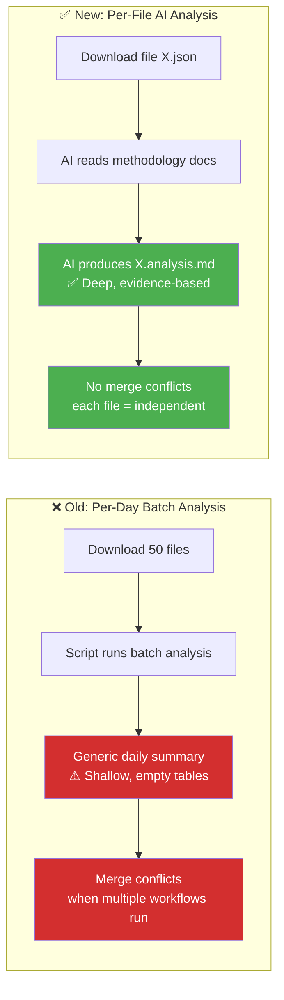

| Dimension | Per-Day (Old) | Per-File (New) |
|-----------|:------------:|:--------------:|
| **Analysis depth** | Shallow (script-generated) | Deep (AI-driven, methodology-guided) |
| **Output quality** | Empty tables, generic text | SWOT.md-quality with Mermaid diagrams |
| **Merge conflicts** | Frequent (shared daily files) | None (each file independent) |
| **Coverage** | Session-based (misses files) | 100% (every downloaded file) |
| **Reusability** | Daily snapshot only | Persistent per-document intelligence |
| **Incremental** | Must re-run entire day | Only analyze new/changed files |

---

## 📋 Analysis Protocol

### Step 1: Catalog Downloaded Data

Run the catalog script to identify files needing analysis:

```bash
npx tsx scripts/catalog-downloaded-data.ts --pending-only
```

This produces a JSON catalog listing every data file in `analysis/data/` that does NOT yet have an `.analysis.md` companion.

### Step 2: Read Methodology Documents

Before analyzing any file, the AI agent **MUST** read and internalize these methodology guides:

| Priority | Document | Key Content |
|:--------:|----------|-------------|
| 🔴 1 | [political-swot-framework.md](political-swot-framework.md) | Evidence hierarchy, confidence levels, temporal decay, aggregation |
| 🔴 2 | [political-risk-methodology.md](political-risk-methodology.md) | 5×5 Likelihood×Impact matrix, coalition risk index, anomaly detection |
| 🔴 3 | [political-threat-framework.md](political-threat-framework.md) | Political Threat Taxonomy, Attack Trees, Kill Chain, threat actor matrix, severity |
| 🟠 4 | [political-classification-guide.md](political-classification-guide.md) | Sensitivity levels, domain taxonomy, urgency matrix |
| 🟠 5 | [political-style-guide.md](political-style-guide.md) | Writing standards, evidence density, attribution, icons |
| 🟡 6 | [SWOT.md](../../SWOT.md) | **Formatting exemplar** — badges, Mermaid charts, section structure |
| 🟡 7 | [THREAT_MODEL.md](../../THREAT_MODEL.md) | **Formatting exemplar** — threat tables, risk scoring, executive summary |

### Step 3: Analyze Each File

For each pending file in the catalog:

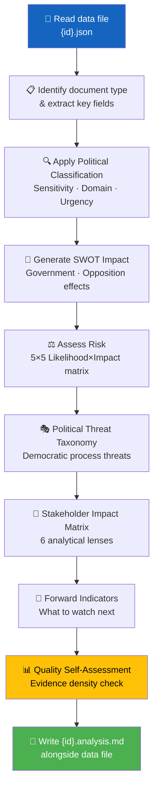

### Step 4: Apply Template

Use the [per-file-political-intelligence.md](../templates/per-file-political-intelligence.md) template. **Every field marked `[REQUIRED]` must be filled.**

### Step 5: Quality Gate

Before writing the analysis file, verify:

| Check | Requirement | Pass? |
|-------|-------------|:-----:|
| Evidence density | ≥ 3 evidence points cited | ☐ |
| Confidence labels | Every analytical claim tagged [HIGH/MEDIUM/LOW] | ☐ |
| SWOT entries | At least 2 quadrants with evidence | ☐ |
| Mermaid diagrams | At least 1 diagram with document-specific data | ☐ |
| Forward indicators | At least 1 specific watch item | ☐ |
| No boilerplate | All `[REQUIRED]` placeholders replaced | ☐ |
| Attribution | All politicians named with party (e.g. "Ulf Kristersson (M)") | ☐ |
| Risk-SWOT integration | Risk scores ≥15 appear as SWOT Threat entries | ☐ |
| Threat severity calibrated | Severity scores match calibration table in threat framework | ☐ |

---

## ⏱️ Time Budget & Prioritization Protocol

### Time Budget Per File

Not all documents need the same analysis depth. Prioritize by document type:

| Document Type | Analysis Time Budget | Analysis Depth | Sections Required |
|--------------|:--------------------:|:--------------:|------------------|
| **Propositions** | 3–5 minutes | Full (all sections) | Classification + SWOT + Risk + Threat + Stakeholder + Forward |
| **Votes** | 2–4 minutes | Full (all sections) | Classification + SWOT + Risk + Stakeholder + Forward |
| **Committee Reports** | 2–3 minutes | Standard | Classification + SWOT + Risk + Forward |
| **Speeches** | 1–2 minutes | Quick | Classification + Stakeholder + Forward |
| **Motions** | 1–2 minutes | Quick | Classification + SWOT (opposition focus) + Forward |
| **Questions/Interpellations** | 1–2 minutes | Quick | Classification + Stakeholder + Forward |
| **Government Documents** | 2–3 minutes | Standard | Classification + Risk + Stakeholder + Forward |
| **World Bank/SCB Data** | 1–2 minutes | Context | Classification + Economic context note |

### Prioritization When Time-Constrained

When the workflow time budget is limited (e.g., 12 minutes for AI analysis in evening workflow):

1. **Sort pending files by expected significance** — Propositions and votes first, then committee reports, then everything else
2. **Analyze highest-priority files first** — Complete full analysis for top-priority documents
3. **Quick-classify remaining files** — At minimum, assign classification level and significance score
4. **Stop at time limit** — Whatever is analyzed is committed; remaining files are flagged as "pending" for next run

> **How per-file budgets interact with workflow time limits:**
> - Per-file budgets (1–5 min) are **maximums** for a single file; most files take less
> - When a workflow has 12 minutes and 30 pending files:
>   - Analyze 2 high-priority files at full depth (5 min each = 10 min)
>   - Quick-classify remaining 28 files (5 sec each = ~2 min total)
>   - Total: ~12 min — within budget
> - Prioritization order (Step 1) ensures the most significant files always get full analysis
> - **Example:** 12 min budget, 30 files → 2 propositions at full depth (10 min) + 28 quick-classified (2 min) = 12 min. If only 5 files exist, analyze all at full depth (≤15 min).

### Maximum Files Per Workflow Run

| Workflow | Typical Download | Analysis Target | Time Budget |
|----------|:----------------:|:---------------:|:-----------:|
| Evening analysis | 20–50 files | 10–15 full + rest quick-classified | 12 minutes |
| Morning per-type | 5–20 files | All files (single type) | 8 minutes |
| Realtime monitor | 1–5 files | All files (full depth) | 5 minutes |
| Weekly review | 50–200 files | Top 20 full + rest aggregated | 15 minutes |

---

## 📄 Document Type-Specific Analysis

### Propositions (prop)

Focus areas:
- **Coalition dynamics**: Which parties co-sponsor? Any defections expected?
- **Policy impact**: What changes for citizens, businesses, international commitments?
- **Budget implications**: Fiscal impact assessment using World Bank/SCB context
- **Legislative pipeline**: Committee referral, expected timeline, amendment risk

### Motions (mot)

Focus areas:
- **Opposition signaling**: What policy alternatives are being proposed?
- **Cross-party alignment**: Do multiple opposition parties file similar motions?
- **Government vulnerability**: Does the motion target a known coalition weakness?
- **Trend detection**: Is this part of a broader pattern of opposition activity?

### Committee Reports (bet)

Focus areas:
- **Decision quality**: Unanimous or divided? Reservations filed?
- **Policy coherence**: Does the committee recommendation align with government intent?
- **Democratic process**: Were public hearings held? Expert testimony considered?
- **Implementation readiness**: Is the recommended action feasible?

### Votes (voteringar)

Focus areas:
- **Coalition discipline**: Did all coalition parties vote together?
- **SD behavior**: Support or abstention? What does this signal?
- **Cross-party voting**: Unexpected alliances or defections?
- **Margin analysis**: Close vote = instability indicator

### Speeches (anföranden)

Focus areas:
- **Rhetorical signals**: New policy positions announced? Tone shifts?
- **Accountability probes**: Ministers challenged on record?
- **Consensus building**: Cross-party appeals or partisan rhetoric?
- **Media potential**: Quotable statements for news coverage?

### Questions & Interpellations (frågor, interpellationer)

Focus areas:
- **Accountability pressure**: What is the opposition demanding answers on?
- **Minister responsiveness**: Timely and substantive responses?
- **Policy gaps**: Issues the government hasn't addressed?
- **Pattern detection**: Coordinated questioning campaigns?

### Government Documents (regeringen)

Focus areas:
- **SOU recommendations**: What expert panels suggest
- **Press releases**: Government messaging and priorities
- **Remisser**: Stakeholder consultation outcomes

### World Bank / SCB Data

Focus areas:
- **Economic context**: GDP growth, unemployment, inflation trends
- **Policy validation**: Do statistics support government claims?
- **International comparison**: Sweden vs. Nordic peers, EU averages
- **Risk indicators**: Economic headwinds affecting political stability

---

## 🎨 Formatting Standards (SWOT.md / THREAT_MODEL.md Quality)

### Required Formatting Elements

1. **Hack23 Header Block** — Logo, title, badges (Owner, Version, Effective Date, Classification)
2. **Executive Summary** — 3–5 sentence intelligence-level summary
3. **Mermaid Diagrams** — At least 1, using color-coded styles:
   ```
   style NodeName fill:#D32F2F,color:#FFFFFF   /* Red — critical/threat */
   style NodeName fill:#FF9800,color:#FFFFFF   /* Orange — high risk */
   style NodeName fill:#FFC107,color:#000000   /* Yellow — medium */
   style NodeName fill:#4CAF50,color:#FFFFFF   /* Green — strength/low risk */
   style NodeName fill:#1565C0,color:#FFFFFF   /* Blue — informational */
   style NodeName fill:#7B1FA2,color:#FFFFFF   /* Purple — special category */
   ```
4. **Evidence Tables** — Structured tables with Confidence and Impact columns
5. **Emoji Section Headers** — Consistent with existing templates (💪 ⚠️ 🚀 🔴 🎭 👥 🔮)
6. **Confidence Labels** — `[HIGH]` `[MEDIUM]` `[LOW]` on every analytical claim
7. **Document Control Footer** — Template path, classification, next review date

### Color Coding Convention for Mermaid

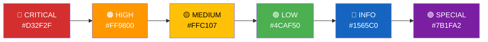

---

## 🔄 Integration with Agentic Workflows

### Workflow Step: Per-File Analysis

Every agentic news workflow should include this analysis step **after** data download and **before** article generation:

```markdown
## Step N: Per-File AI Analysis

1. Run catalog: `npx tsx scripts/catalog-downloaded-data.ts --pending-only`
2. Read ALL methodology documents (this file + 5 frameworks + 1 template)
3. For each pending file in the catalog:
   a. Read the data JSON file with `view` or `cat` — understand what data it contains
   b. Use MCP tools to gather additional context (related votes, speeches, committee reports)
   c. Apply the per-file-political-intelligence template
   d. Fill ALL required fields with evidence-based analysis from the actual data
   e. Include at least 1 color-coded Mermaid diagram with REAL data from the file
   f. Write {id}.analysis.md alongside the data file
4. Compose daily/weekly synthesis from per-file analyses
```

### MCP Data Enrichment

When analyzing a parliamentary document, use MCP tools to gather context:

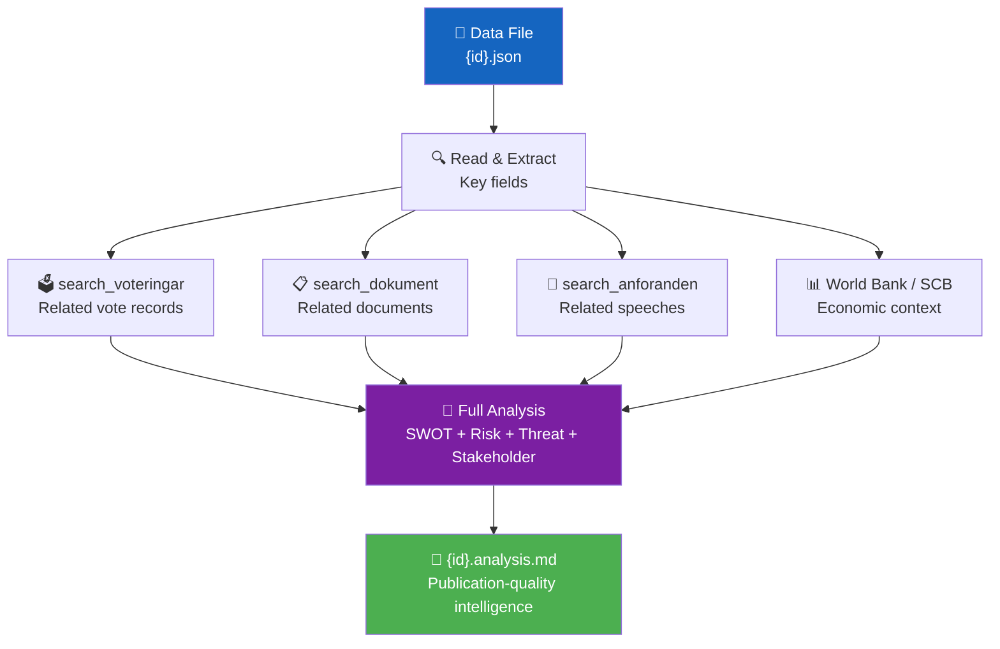

### Synthesis Composition

After all per-file analyses are complete, compose the daily synthesis:

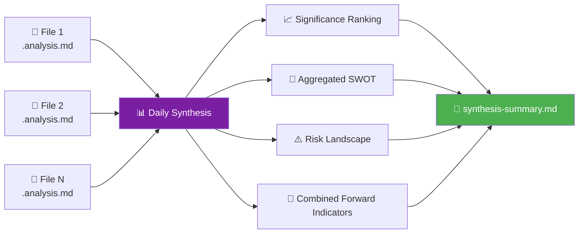

Steps:
1. Read all `.analysis.md` files for the analysis period
2. Rank documents by significance score
3. Aggregate SWOT entries using the [political-swot-framework.md](political-swot-framework.md) intersection rules (Gov S + Opp T = contested terrain, Gov W + Opp O = opposition opportunity)
4. Compute overall risk landscape from individual risk assessments
5. Write to `analysis/daily/YYYY-MM-DD/synthesis-summary.md`

---

## ✅ Concrete Example: What Good Analysis Looks Like

Below is a **mini example** showing the difference between bad and good analysis output:

### ❌ BAD — Generic boilerplate (FAILS quality gate)

> **Real-world example**: PR #1452 (2026-03-30) produced this style of output — plain prose, no tables, no Mermaid diagrams. This is NEVER acceptable.

```markdown
## 🎯 Executive Summary
This document is significant because it relates to fiscal policy. 
The government's position is strengthened. [MEDIUM confidence]

## 💪 SWOT Impact
| Quadrant | Statement | Evidence | Confidence |
|----------|-----------|----------|:----------:|
| ✅ Strength | Government position strengthened | [REQUIRED] | M |
| 🔴 Threat | Opposition may criticize | [REQUIRED] | L |
```

**Problems:** No dok_id references, generic text, `[REQUIRED]` still present, no specific data, no Mermaid diagram.

### ❌ ALSO BAD — Plain prose without template structure (FAILS quality gate)

> **Real-world example**: PR #1452 SWOT analysis was plain prose paragraphs with bullet points but NO structured tables, NO Mermaid diagrams, NO dok_id columns, and NO template metadata header. This is equally unacceptable.

```markdown
## Detailed Analysis

### Government Coalition (M+KD+L with SD support)

**Strengths**:
- Strong legislative output: 20+ propositions in March
- Voting discipline remains strong

**Weaknesses**:
- MP leaving M party group signals internal dissent
- Minister under KU scrutiny

**Opportunities**:
- Criminal justice propositions could strengthen messaging
```

**Problems:** No template structure (missing SWOT ID, SWOT Context table, metadata header). No evidence tables with `#`, `Statement`, `Evidence (dok_id)`, `Confidence`, `Impact` columns. No Mermaid SWOT Quadrant Mapping diagram. No color coding. No document control footer. Plain prose instead of structured intelligence.

### ✅ GOOD — Evidence-based intelligence with template structure (PASSES quality gate)

> **Reference exemplar**: [SWOT.md](../../SWOT.md) — this is the formatting quality standard.

```markdown
## 📋 SWOT Context

| Field | Value |
|-------|-------|
| **SWOT ID** | SWT-2026-03-30-001 |
| **Analysis Date** | 2026-03-30 00:40 UTC |
| **Analysis Scope** | Government coalition (M+KD+L with SD support) |
| **Reference Period** | 2025/26 |
| **Produced By** | news-realtime-monitor |
| **Primary MCP Sources** | search_dokument, get_propositioner, search_voteringar |
| **Validity Window** | Valid until 2026-04-06 |

## 🏛️ Section 1: Government Coalition SWOT

### ✅ Strengths — Government Coalition

| # | Strength Statement | Evidence (dok_id) | Confidence | Impact | Entry Date |
|---|-------------------|-------------------|:----------:|:------:|:----------:|
| S1 | Coalition maintains working majority — AU10 vote showed standard party alignment with SD support | AU10 vote record (dok_id: H901AU10) | H | H | 2026-03-30 |
| S2 | Strong legislative output — 20+ propositions in March covering criminal justice and defense | Prop 2025/26:227, 213, 210 (criminal justice), Prop 2025/26:205 (food stockpile) | H | M | 2026-03-30 |

### ⚠️ Weaknesses — Government Coalition

| # | Weakness Statement | Evidence (dok_id) | Confidence | Impact | Entry Date |
|---|-------------------|-------------------|:----------:|:------:|:----------:|
| W1 | MP Marléne Lund Kopparklint leaving M party group signals internal dissent — narrows parliamentary arithmetic | Riksdag MP registry, party group change notice | H | M | 2026-03-30 |
| W2 | Minister Andreas Carlson (KD) under KU scrutiny for Lantmäteriet security failures — G7-8 complaint dockets | KU hearing agenda, dockets G7, G8 | H | H | 2026-03-30 |

## 📊 SWOT Quadrant Mapping

​```mermaid
%%{init: {
  "theme": "neutral",
  "themeVariables": {
    "quadrant1Fill": "#2E7D32",
    "quadrant2Fill": "#D32F2F",
    "quadrant3Fill": "#1565C0",
    "quadrant4Fill": "#FF9800",
    "quadrantTitleFill": "#FFFFFF",
    "quadrantPointFill": "#FFFFFF",
    "quadrantPointTextFill": "#000000",
    "quadrantXAxisTextFill": "#000000",
    "quadrantYAxisTextFill": "#000000"
  },
  "quadrantChart": {
    "chartWidth": 700,
    "chartHeight": 700,
    "pointLabelFontSize": 12,
    "titleFontSize": 20,
    "quadrantLabelFontSize": 16,
    "xAxisLabelFontSize": 14,
    "yAxisLabelFontSize": 14
  }
}}%%
quadrantChart
    title 🎯 POLITICAL SWOT QUADRANT MAPPING — 2026-03-30
    x-axis Internal Factors --> External Factors
    y-axis Threats --> Opportunities
    quadrant-1 STRENGTHS
    quadrant-2 WEAKNESSES
    quadrant-3 OPPORTUNITIES
    quadrant-4 THREATS
    "💪 S1: Coalition majority holds (AU10)": [0.20, 0.85]
    "💪 S2: 20+ propositions in March": [0.30, 0.75]
    "⚡ W1: MP defection from M": [0.25, 0.20]
    "⚡ W2: KU scrutiny of Carlson (KD)": [0.20, 0.30]
    "🌟 O1: Criminal justice messaging": [0.80, 0.80]
    "☁️ T1: KU exposes security failures": [0.85, 0.20]
    "☁️ T2: Northvolt fiscal scrutiny": [0.75, 0.30]
​```
```

**Why this passes:** Template structure with SWOT Context metadata table. Evidence tables with `#`, `Statement`, `Evidence (dok_id)`, `Confidence`, `Impact`, `Entry Date` columns. Standardised Mermaid `quadrantChart` SWOT visualisation aligned with the [ISMS Style Guide SWOT palette](https://github.com/Hack23/ISMS-PUBLIC/blob/main/STYLE_GUIDE.md#stakeholder-mapping-quadrant-format) (Strengths `#2E7D32` · Weaknesses `#D32F2F` · Opportunities `#1565C0` · Threats `#FF9800`). Specific dok_id citations. All claims labeled with confidence. Human-readable markdown.

---

## 📑 Document-Type Analysis Focus

Every Riksdag document type maps to specific analysis templates and MCP data tools. Use this table to select the correct analytical approach for each incoming data file:

| Document Type | MCP Data Category | Primary Templates | Key MCP Cross-Reference Tools |
|---------------|-------------------|-------------------|-------------------------------|
| 🏛️ **Betänkanden** (committee reports) | `bet` — committee deliberation outcomes from FiU, JuU, SoU, UU, etc. | Classification + Risk + SWOT | `get_betankanden`, `search_voteringar`, `search_dokument_fulltext` |
| 📜 **Propositioner** (government propositions) | `prop` — government bills (e.g., Prop. 2025/26:227) | Risk + Stakeholder | `get_propositioner`, `search_dokument_fulltext`, `search_dokument` |
| ✊ **Motioner** (parliamentary motions) | `mot` — MP-authored proposals from S, M, SD, V, MP, C, L, KD | Classification + SWOT + Significance | `get_motioner`, `search_dokument_fulltext`, `search_ledamoter` |
| ❓ **Interpellationer** (interpellations) | `ip` — minister-directed debates | Threat + Stakeholder | `get_interpellationer`, `search_anforanden`, `get_ledamot` |
| 📝 **Skriftliga frågor** (written questions) | `fr` — written questions to ministers | Classification + Significance | `get_fragor`, `search_dokument` |
| 🗳️ **Voteringar** (votes) | `votering` — roll-call votes with party splits | Classification + SWOT + Threat | `search_voteringar`, `get_voting_group`, `get_betankanden` |
| 🎤 **Anföranden** (speeches) | `anf` — chamber debate speeches | Stakeholder + Significance | `search_anforanden`, `get_ledamot` |
| 📅 **Kalender** (calendar events) | `kal` — scheduled debates, hearings, votes | Significance + Risk | `get_calendar_events`, `search_dokument` |

### 🔗 Cross-Reference Strategy

When analyzing any document, always cross-reference with related data to build richer intelligence:

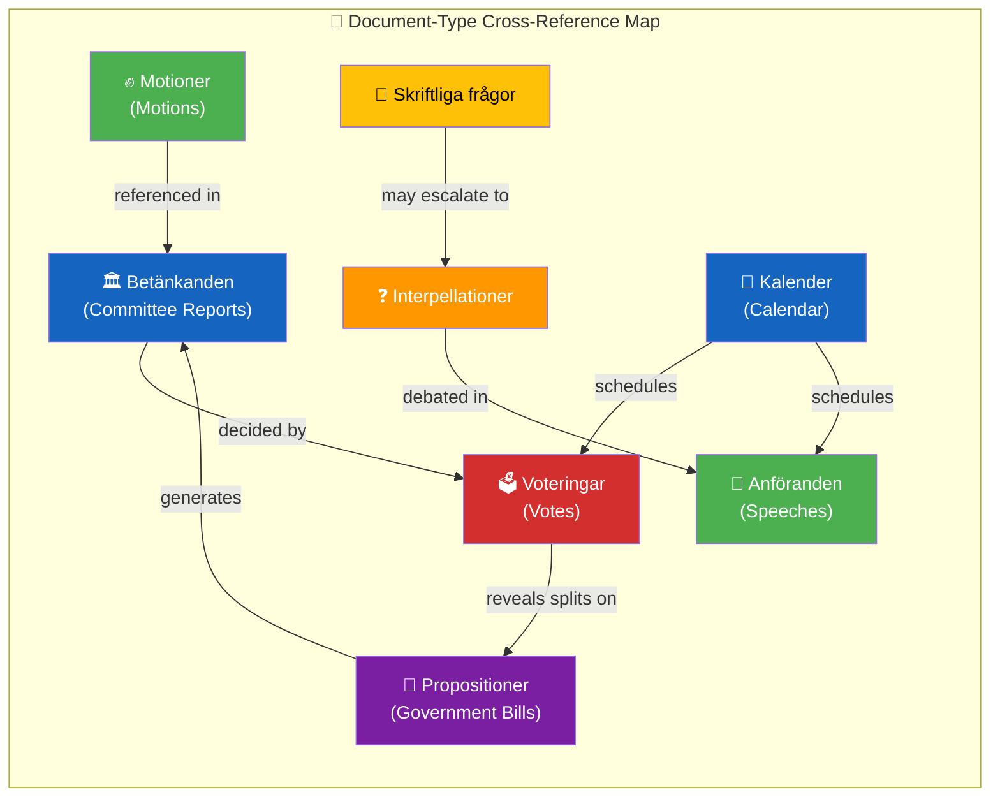

> **Example:** When analyzing a betänkande from JuU (Justitieutskottet), cross-reference `search_voteringar` for the vote outcome, `search_anforanden` for committee debate speeches, and `get_propositioner` for the originating government bill.

---

## 📐 Document-Specific Analysis Depth

Not every document warrants the same analysis depth. Use the following tiered model to allocate analytical effort proportional to political significance:

```mermaid
graph TD
    subgraph "📐 Analysis Depth Levels"
        direction TB
        L3["🔴 Level 3 — Intelligence<br/>2000–5000 words · ≥10 citations<br/>Full multi-framework analysis"]
        L2["🟠 Level 2 — Strategic<br/>800–2000 words · ≥5 citations<br/>Focused framework application"]
        L1["🟢 Level 1 — Surface<br/>200–500 words · ≥3 citations<br/>Classification + key findings"]
    end

    subgraph "🏛️ Level 3 Documents"
        L3A["Betänkanden with voting splits<br/>(e.g., JuU10 with SD dissent)"]
        L3B["Propositioner with budget impact<br/>(e.g., Prop. 2025/26:100 vårbudget)"]
        L3C["Voteringar with coalition fractures<br/>(e.g., M+KD vs L on migration)"]
    end

    subgraph "🔶 Level 2 Documents"
        L2A["Motioner from party leaders<br/>(e.g., S shadow budget motion)"]
        L2B["Interpellationer on policy crises<br/>(e.g., minister accountability)"]
        L2C["Evening / weekly synthesis<br/>(cross-document analysis)"]
    end

    subgraph "🟢 Level 1 Documents"
        L1A["Skriftliga frågor<br/>(routine written questions)"]
        L1B["Kalender events<br/>(scheduled debates, hearings)"]
        L1C["Routine anföranden<br/>(standard debate speeches)"]
    end

    L3 --> L3A
    L3 --> L3B
    L3 --> L3C
    L2 --> L2A
    L2 --> L2B
    L2 --> L2C
    L1 --> L1A
    L1 --> L1B
    L1 --> L1C

    style L3 fill:#D32F2F,color:#FFFFFF
    style L2 fill:#FF9800,color:#FFFFFF
    style L1 fill:#4CAF50,color:#FFFFFF
    style L3A fill:#D32F2F,color:#FFFFFF
    style L3B fill:#D32F2F,color:#FFFFFF
    style L3C fill:#D32F2F,color:#FFFFFF
    style L2A fill:#FF9800,color:#FFFFFF
    style L2B fill:#FF9800,color:#FFFFFF
    style L2C fill:#FF9800,color:#FFFFFF
    style L1A fill:#4CAF50,color:#FFFFFF
    style L1B fill:#4CAF50,color:#FFFFFF
    style L1C fill:#4CAF50,color:#FFFFFF
```

### 📏 Depth Level Requirements

| Criteria | 🟢 Level 1 — Surface | 🟠 Level 2 — Strategic | 🔴 Level 3 — Intelligence |
|----------|:---------------------:|:----------------------:|:-------------------------:|
| **Word count** | 200–500 | 800–2,000 | 2,000–5,000 |
| **Minimum citations** | ≥ 3 (dok_id) | ≥ 5 (dok_id + vote counts) | ≥ 10 (dok_id + cross-ref) |
| **Mermaid diagrams** | ≥ 1 (required; may be simple) | ≥ 1 (required) | ≥ 2 (required, color-coded) |
| **Frameworks applied** | Classification only | 1–2 (e.g., SWOT or Risk) | ≥ 2 (e.g., SWOT + Threat + Risk) |
| **Confidence labels** | Optional | Required on key claims | Required on ALL claims |
| **Forward indicators** | 1 "watch next" item | 2–3 triggers with dates | ≥ 5 triggers with thresholds |
| **Cross-references** | Link to parent document | Link to 2–3 related docs | Network of ≥ 5 related docs |
| **Typical turnaround** | 5–10 min | 15–25 min | 30–60 min |

### 🔀 Escalation Rules

A document may be **escalated** from a lower level to a higher level when:

- **L1 → L2:** Written question reveals a pattern across multiple ministers, or calendar event precedes a high-stakes vote
- **L2 → L3:** Motion gathers cross-party support (≥ 3 parties), or interpellation triggers minister resignation speculation
- **L3 (automatic):** Any document involving a vote of confidence, budget bill, or constitutional amendment (grundlagsändring)

---

## ⚠️ Anti-Pattern Gallery

These examples show common failures and their corrections. Use them as calibration references during quality gate review.

### Anti-Pattern 1: Scripted Boilerplate

> ❌ **BAD — Generic "this is important" text without evidence**

```markdown
## Analysis

This proposition is important for Swedish politics. It will have significant
implications for the government coalition. The opposition has expressed concerns.
This development should be monitored closely as it may affect future policy.
```

**Why it fails:** No dok_id citations, no confidence labels, no specific actors or committees named, no quantified impact, could describe literally any document.

> ✅ **GOOD — Evidence-based analysis with dok_id citations**

```markdown
## 📊 Analysis — Prop. 2025/26:227 (Skärpta straff vid brott mot journalister)

| # | Finding | Evidence (dok_id) | Confidence | Impact |
|---|---------|-------------------|:----------:|:------:|
| F1 | JuU unanimously backed the proposition — rare cross-party consensus on press freedom | H901JuU15, vote record 2026-03-28 | HIGH | HIGH |
| F2 | SD filed a reservation on penalty ranges (§4–6) — signals opposition to sentencing reform scope | H901JuU15 reservation (SD), dok_id H901JuU15r1 | HIGH | MEDIUM |
| F3 | Prop references EU Directive 2024/1083 — external compliance driver limits parliamentary discretion | Prop. 2025/26:227, section 3.2 | MEDIUM | MEDIUM |
```

**Why it passes:** Every claim has a dok_id, confidence level, and impact rating. Specific committee (JuU), party (SD), and document references. Structured table format.

---

### Anti-Pattern 2: Summary Without Structure

> ❌ **BAD — Prose-only narrative with no analytical framework**

```markdown
The budget debate continued today with several speeches from government and
opposition MPs. The Finance Committee presented its report and voting followed
party lines mostly. Some interesting points were raised about healthcare funding
and defense spending. The coalition appears stable for now but there are some
tensions beneath the surface.
```

**Why it fails:** No tables, no Mermaid diagrams, no confidence labels, no SWOT/Risk/Threat framework applied, reads like a newspaper summary rather than intelligence analysis.

> ✅ **GOOD — Tables + Mermaid + confidence labels**

```markdown
## 🗳️ Voting Analysis — FiU20 (Vårbudget 2026)

| Party | Ja | Nej | Avstår | Frånvarande | Alignment |
|:-----:|:--:|:---:|:------:|:-----------:|:---------:|
| S | 0 | 107 | 0 | 0 | Opposition bloc |
| M | 68 | 0 | 0 | 2 | Government bloc |
| SD | 0 | 0 | 73 | 0 | ⚠️ Abstained |
| V | 0 | 24 | 0 | 0 | Opposition bloc |
| C | 0 | 24 | 0 | 0 | Opposition bloc |
| MP | 0 | 18 | 0 | 0 | Opposition bloc |
| L | 16 | 0 | 0 | 0 | Government bloc |
| KD | 19 | 0 | 0 | 0 | Government bloc |

**Key finding [HIGH]:** SD abstention on vårbudget signals negotiation leverage — government passed with 103 Ja vs 173 Nej + 73 Avstår, relying on procedural rules.
```

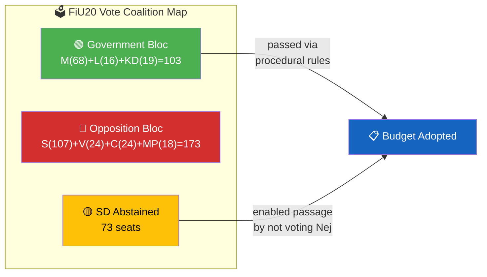

**Why it passes:** Vote table with party-level granularity, confidence-labeled key finding, Mermaid diagram showing coalition dynamics with color coding, specific seat counts.

---

### Anti-Pattern 3: Overwriting Previous Analysis

> ❌ **BAD — Writing to a shared file that another workflow owns**

```bash
# Workflow A writes its analysis to the daily summary
echo "$ANALYSIS" >> analysis/daily/2026-03-30/daily-summary.md

# Workflow B ALSO writes to the same file — OVERWRITES Workflow A
echo "$ANALYSIS" >> analysis/daily/2026-03-30/daily-summary.md
```

**Why it fails:** Both workflows compete for the same file path. Git merge conflicts are guaranteed. Workflow A's analysis may be lost entirely.

> ✅ **GOOD — Folder isolation with workflow-specific paths**

```bash
# Workflow A: proposition analysis → isolated folder
mkdir -p analysis/daily/2026-03-30/propositioner/
cat > analysis/daily/2026-03-30/propositioner/prop-2025-26-227.analysis.md

# Workflow B: vote analysis → separate isolated folder
mkdir -p analysis/daily/2026-03-30/voteringar/
cat > analysis/daily/2026-03-30/voteringar/fiu20-varbudget.analysis.md

# Synthesis workflow: reads BOTH, writes to its OWN folder
mkdir -p analysis/daily/2026-03-30/synthesis/
cat > analysis/daily/2026-03-30/synthesis/evening-intelligence-summary.md
```

**Why it passes:** Each workflow writes exclusively to its own subfolder. No file path collisions. Synthesis workflow reads from all folders but writes only to `synthesis/`. Follows Rule 1 (Folder Isolation).

---

## ✅ Quality Gate Checklist

Before committing any analysis file, verify it passes ALL four quality dimensions. A file that fails any single blocking check (marked 🔴) MUST be revised before commit.

### 📋 Structural Quality

| # | Check | Blocking | Details |
|---|-------|:--------:|---------|
| SQ-1 | Hack23 header block present | 🔴 | Logo, title, badges (Owner, Version, Date, Classification) |
| SQ-2 | ≥ 1 Mermaid diagram with `style` directives | 🔴 | Color-coded per convention (#D32F2F, #FF9800, #FFC107, #4CAF50, #1565C0, #7B1FA2) |
| SQ-3 | ≥ 1 structured evidence table | 🔴 | Must include `Evidence (dok_id)`, `Confidence`, `Impact` columns |
| SQ-4 | No placeholder text remaining | 🔴 | Zero instances of `[REQUIRED]`, `[OPTIONAL]`, `TODO`, `TBD`, `placeholder` |
| SQ-5 | Template section structure followed | 🟡 | Sections match the applicable template from `analysis/templates/` |
| SQ-6 | Document control footer present | 🟡 | Path, version, classification, next review date |

### 🔍 Analytical Quality

| # | Check | Blocking | Details |
|---|-------|:--------:|---------|
| AQ-1 | Political classification assigned | 🔴 | Using taxonomy from `political-classification-guide.md` |
| AQ-2 | SWOT analysis with ≥ 2 entries per quadrant | 🔴 | S, W, O, T each have at least 2 evidence-backed entries |
| AQ-3 | Risk assessment uses 5×5 matrix | 🟡 | Likelihood (1–5) × Impact (1–5), color-coded in Mermaid |
| AQ-4 | Threat analysis applies ≥ 1 framework | 🟡 | Attack Tree, Kill Chain, Diamond Model, or Political Threat Taxonomy |
| AQ-5 | Significance score assigned (1–10 scale) | 🔴 | With justification referencing methodology criteria |
| AQ-6 | Forward-looking indicators included | 🟡 | ≥ 1 "what to watch" trigger with specific conditions |

### 📎 Evidence Quality

| # | Check | Blocking | Details |
|---|-------|:--------:|---------|
| EQ-1 | Every analytical claim has a citation | 🔴 | dok_id, vote record, MP name, committee reference, or named source |
| EQ-2 | Confidence levels on all key claims | 🔴 | `[HIGH]`, `[MEDIUM]`, or `[LOW]` — no unlabeled assertions |
| EQ-3 | No opinion-only statements | 🔴 | Every evaluative sentence backed by evidence or labeled `[ASSESSMENT]` |
| EQ-4 | Cross-references to related documents | 🟡 | Links to related betänkanden, propositioner, or voteringar |
| EQ-5 | MCP data source attribution | 🟡 | State which `riksdag-regering-mcp` tools provided the source data |

### ✍️ Writing Quality

| # | Check | Blocking | Details |
|---|-------|:--------:|---------|
| WQ-1 | Depth level met (L1/L2/L3) | 🔴 | Word count and citation count meet the tier requirements |
| WQ-2 | Active voice predominates | 🟡 | "FiU recommended…" not "It was recommended by FiU…" |
| WQ-3 | Swedish political terminology used correctly | 🔴 | Riksdag, utskott, betänkande, votering, reservation — not anglicized equivalents |
| WQ-4 | Multi-language friendly phrasing | 🟡 | Avoid idioms; define acronyms on first use (e.g., "KU (Konstitutionsutskottet)") |
| WQ-5 | No subjective language without `[ASSESSMENT]` tag | 🟡 | "controversial" → `[ASSESSMENT: controversial given 60/40 vote split]` |

### 📊 Quality Scoring Rubric

Each analysis file receives a composite score across five dimensions:

| Dimension | Weight | Score Range | Minimum Pass |
|-----------|:------:|:-----------:|:------------:|
| 📎 **Evidence** — citation density, dok_id specificity, cross-references | 25% | 0–10 | 7.0 |
| 📐 **Depth** — word count, framework coverage, forward indicators | 25% | 0–10 | 7.0 |
| 📋 **Structural** — templates, Mermaid, tables, headers, no placeholders | 20% | 0–10 | 7.0 |
| 🎯 **Actionable** — triggers, thresholds, "watch next" items, decision support | 15% | 0–10 | 6.0 |
| ⚖️ **Neutrality** — balanced perspectives, confidence labels, no opinion-only | 15% | 0–10 | 6.0 |

**Composite score = Σ (dimension score × weight)**

| Composite Score | Verdict | Action |
|:---------------:|---------|--------|
| **≥ 8.5** | 🟢 **Excellent** — publish immediately | No revision needed |
| **7.0 – 8.4** | 🟡 **Acceptable** — publish with minor notes | Flag areas below 7.0 for next iteration |
| **5.0 – 6.9** | 🟠 **Below threshold** — revise before commit | Improve weakest dimensions, re-run quality gate |
| **< 5.0** | 🔴 **Rejected** — do not commit | Restart analysis following methodology guides |

> **Minimum passing score: 7.0/10 composite.** Any individual dimension scoring below its minimum pass threshold triggers automatic revision regardless of composite score.

---

## 🤖 Claude Opus 4.7 Agentic Workflow Integration (v5.1)

### Engine Configuration

All analysis, news-generation, and translation workflows use **Claude Opus 4.7** via the GitHub Copilot agentic workflow engine:

```yaml
engine:
  id: copilot
  model: claude-opus-4.7
```

> **v5.1 Upgrade Notes**: Opus 4.7 (deployed 2026-04) replaces Opus 4.6 across all 12 agentic workflows, including the translation workflow which previously ran on Sonnet 4.6. Leverage the model's stronger long-context reasoning by reading the full corpus of related documents before forming a thesis, and by doing genuine pass-2 rewrites rather than surface tightening. Opus 4.7's improved instruction-following also raises the bar for compliance with the AI-first content rules below — every `AI_MUST_REPLACE` marker, every generic stub, and every code-generated boilerplate must be replaced with evidence-grounded political analysis.

### AI-First Analysis Principle

> **v3.0 Rule**: ALL political analysis text, editorial judgments, significance assessments, SWOT entries, risk scores, titles, descriptions, and forward indicators MUST be generated by AI prompts — NOT by TypeScript/JavaScript code. Code handles ONLY data download, HTML rendering, and file I/O.

#### What AI Prompts MUST Generate

| Content Type | AI Prompt Responsibility | Anti-Pattern (Code) |
|-------------|--------------------------|---------------------|
| **Article titles** | AI generates newsworthy title from actual document content analysis | Hardcoded template: `"Committee Reports: ${topic}"` |
| **Meta descriptions** | AI writes 150-160 char description highlighting key political intelligence | Template: `"Analysis of ${n} documents covering ${field}:"` |
| **SWOT analysis** | AI produces 8-stakeholder SWOT with dok_id evidence per entry | `buildDynamicSwot()` using label templates |
| **Risk assessment** | AI scores L×I with rationale from actual policy impact | `scoreNewsworthiness()` with weighted heuristics |
| **Significance scoring** | AI rates 5 dimensions with evidence-backed justification | `scoreAnalysisDepth()` counting words/numbers |
| **Editorial judgments** | AI writes "Why It Matters" from multi-perspective analysis | `govAdvantageText()` / `oppPressureText()` templates |
| **Forward indicators** | AI identifies specific triggers, timelines, committee schedules | Generic: `"Monitor developments over 1-2 weeks"` |
| **Cross-references** | AI identifies document relationships and policy clusters | `cross-reference-map.md` reporting "0 relationships" |
| **Key takeaways** | AI distills actionable intelligence from full analysis | `buildKeyTakeaways()` using template categories |
| **Stakeholder impact** | AI assesses impact on all 8 groups with specific evidence | 3-group prose summary without dok_id |

#### Deprecated Code Functions (Replace with AI Prompts)

These functions in `scripts/` contain hardcoded analysis logic that MUST be replaced with AI prompt instructions in workflow `.md` files:

| Deprecated Function | File / Symbol Reference | Replacement |
|---------------------|-------------------------|-------------|
| `buildDynamicSwot()` | `ai-analysis-pipeline.ts` (`buildDynamicSwot`) | AI prompt: "Generate SWOT for all 8 stakeholder groups with dok_id evidence" |
| `buildStrategicImplications()` | `ai-analysis-pipeline.ts` (`buildStrategicImplications`) | AI prompt: "Write strategic implications paragraph citing specific policy signals" |
| `buildKeyTakeaways()` | `ai-analysis-pipeline.ts` (`buildKeyTakeaways`) | AI prompt: "Extract 5 key takeaways with confidence levels and evidence" |
| `buildLegislativeImpact()` | `ai-analysis-pipeline.ts` (`buildLegislativeImpact`) | AI prompt: "Assess legislative impact using committee + vote data" |
| `buildCrossPartyImplications()` | `ai-analysis-pipeline.ts` (`buildCrossPartyImplications`) | AI prompt: "Analyze cross-party dynamics from voting records and motions" |
| `generateDeepAnalysisSection()` | `shared.ts` (`generateDeepAnalysisSection`) | AI prompt: "Write 5W deep analysis (Who/What/When/Why/Winners)" |
| `scoreNewsworthiness()` | `newsworthiness.ts` (`scoreNewsworthiness`) | AI prompt: "Score newsworthiness 0-100 with dimension breakdown" |
| All `*Text()` templates | `shared.ts` (`*Text()` template functions) | AI prompt: "Write editorial analysis based on actual document data" |

> **Migration path**: These functions remain as fallbacks but their output is treated as stubs. AI agents in workflows MUST overwrite all template-generated text with genuine analysis.

### 🚨 Analysis-Driven Article Decision Protocol (v5.0 — MANDATORY)

> **NON-NEGOTIABLE**: Article decisions (whether to publish, what title to use, what description to write) MUST be made AFTER all analysis is complete — NEVER before. The synthesis-summary.md "Narrative Direction & Article Decision" section is the SINGLE SOURCE OF TRUTH for article generation.

#### Protocol: Complete Analysis → Decide Article → Generate Content → AI Title/SEO

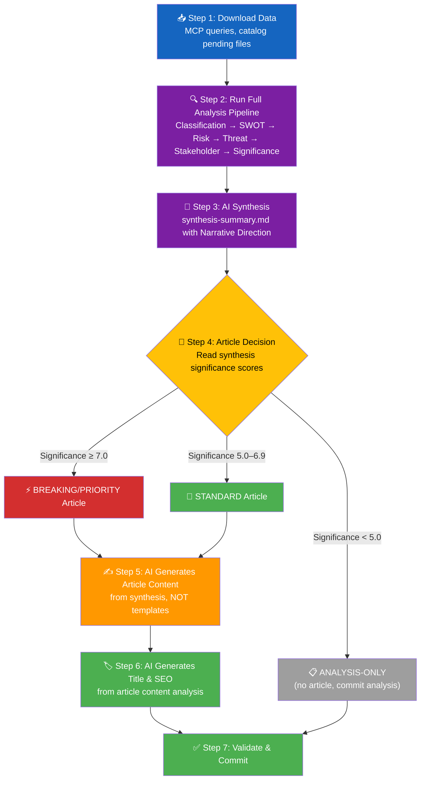

#### What This Means in Practice

1. **Scripts run download-parliamentary-data.ts** — downloads and persists raw data, writes a factual manifest, creates directory structure
2. **AI agent reads ALL methodology guides** — SWOT, Risk, Threat, Classification, Style (as per Rule 3)
3. **AI agent performs deep per-file analysis** — produces `.analysis.md` for each document
4. **AI agent writes synthesis-summary.md** — including the **AI-Recommended Article Metadata** section with:
   - Recommended title (EN + SV) based on top findings
   - Recommended meta description based on key intelligence
   - Key highlights — substantive findings, not metadata labels
   - Article decision (PUBLISH/ANALYSIS-ONLY/SKIP) with justification
5. **ONLY AFTER synthesis is complete**: Article HTML generation begins
6. **AI reads synthesis** to generate article content — lede, Why It Matters, Winners & Losers, etc.
7. **AI reads the article content** to generate final title and SEO metadata
8. **Title MUST reference specific findings** — never generic category labels

#### BANNED: Pre-Analysis Article Decisions

- ❌ Generating article HTML before synthesis-summary.md is complete
- ❌ Using script-generated titles without AI review of actual content
- ❌ Copying subtitle from static template strings (e.g., "Political intelligence analysis of N documents")
- ❌ Making publish/skip decisions based on document count alone
- ❌ Generating titles from regex extraction of `<strong>` tags (scripted heuristic)

#### REQUIRED: Post-Analysis Article Decisions

- ✅ Read completed synthesis-summary.md "Recommended Title" fields
- ✅ Read completed synthesis-summary.md "Article Decision" to determine publication
- ✅ Generate title from actual political intelligence in the synthesis
- ✅ Generate meta description from top-ranked findings in the significance table
- ✅ Apply title/SEO to ALL languages (not just English)

### AI Prompt Templates for Analysis Generation

#### Prompt: AI-Driven Title Generation

```markdown
## Title Generation Protocol

Generate a newsworthy article title (60-80 characters) that:

1. **Leads with the most significant political development** — not a generic category label
2. **Names specific actors or institutions** when they are central to the story
3. **Uses active verbs** — "advances", "challenges", "unveils", "blocks", "fractures"
4. **Conveys political significance** — why this matters, not just what happened
5. **Avoids template patterns** — NEVER use "Policy Priorities This Week" or "Defense in Focus" as suffixes

### Title Quality Examples

| ❌ BAD (Generic Template) | ✅ GOOD (Newsworthy) |
|---------------------------|----------------------|
| "Committee Reports: Parliamentary Priorities This Week: Defense in Focus" | "Sweden Strengthens Civilian Wartime Protection as FöU12 Clears Committee" |
| "Government Propositions: Policy Priorities This Week: Defense in Focus" | "Four Government Bills Target Criminal Justice and Defense Export Reform" |
| "Interpellation Debates: Holding Government to Account: Defense in Focus" | "Opposition Grills Ministers on Airport Safety, Defense Costs, and Migration Policy" |
| "Evening Analysis: Daily Summary" | "Security First: Sweden Advances Deportation Reform and Cybersecurity Legislation" |

### Title Construction Formula

- Formula: `[Active Verb] + [Specific Actor/Institution] + [Concrete Policy Action] + [Political Significance]`

Examples from data:
- "Riksdag Approves Stricter Deportation Rules as Coalition Unites on Justice Reform"
- "Hultqvist Challenges Government on Scandinavian Mountain Airport Emergency Gaps"
- "Four Propositions Signal Government's Spring Security Offensive"
```

#### Prompt: AI-Driven Meta Description Generation

```markdown
## Meta Description Protocol

Generate a meta description (150-160 characters) that:

1. **Summarizes the key political intelligence** — not document counts or field names
2. **Includes specific policy areas and actors** — committee names, party dynamics, minister names
3. **Highlights the newsworthy angle** — why a reader should click
4. **Uses political intelligence language** — analytical, not bureaucratic

### Meta Description Quality Examples

| ❌ BAD (Placeholder) | ✅ GOOD (Intelligence) |
|----------------------|------------------------|
| "Analysis of 10 documents covering Committee:, Published:" | "Sweden's Defense and Justice committees advance wartime protection and criminal deportation reforms in coordinated spring legislative push." |
| "Analysis of 15 documents covering Filed by:, Published:" | "Opposition MPs challenge ministers on airport safety, defense infrastructure costs, and migration policy through 15 targeted interpellations." |
| "Analysis of 10 documents covering Published:, Why It Matters:" | "Government submits four propositions on deportation, cybersecurity, arms exports, and healthcare — signaling spring security agenda priorities." |
```

### Analysis-to-Article Reference Linking

> **v3.0 Rule**: Every news article MUST link to its underlying analysis files on GitHub, enabling readers to verify claims and access deeper intelligence.

#### GitHub Analysis Reference Format

All news articles MUST include a "📊 Analysis & Sources" section linking to analysis files:

```html
<section class="analysis-references" aria-label="Analysis sources">
  <h2>📊 Analysis & Sources</h2>
  <p>This article is based on AI-driven political intelligence analysis. Full analysis files are available on GitHub:</p>
  <ul>
    <li><a href="https://github.com/Hack23/riksdagsmonitor/blob/main/analysis/daily/2026-04-02/committeeReports/synthesis-summary.md">📋 Synthesis Summary</a></li>
    <li><a href="https://github.com/Hack23/riksdagsmonitor/blob/main/analysis/daily/2026-04-02/committeeReports/swot-analysis.md">💪 SWOT Analysis</a></li>
    <li><a href="https://github.com/Hack23/riksdagsmonitor/blob/main/analysis/daily/2026-04-02/committeeReports/risk-assessment.md">⚠️ Risk Assessment</a></li>
    <li><a href="https://github.com/Hack23/riksdagsmonitor/blob/main/analysis/daily/2026-04-02/committeeReports/threat-analysis.md">🎭 Threat Analysis</a></li>
    <li><a href="https://github.com/Hack23/riksdagsmonitor/blob/main/analysis/daily/2026-04-02/committeeReports/stakeholder-perspectives.md">👥 Stakeholder Perspectives</a></li>
    <li><a href="https://github.com/Hack23/riksdagsmonitor/blob/main/analysis/daily/2026-04-02/committeeReports/significance-scoring.md">📈 Significance Scoring</a></li>
    <li><a href="https://github.com/Hack23/riksdagsmonitor/blob/main/analysis/daily/2026-04-02/committeeReports/classification-results.md">🏷️ Classification Results</a></li>
  </ul>
  <p><em>Per-document analysis files are available in the <a href="https://github.com/Hack23/riksdagsmonitor/tree/main/analysis/daily/2026-04-02/committeeReports/documents/">documents/</a> subfolder.</em></p>
</section>
```

#### Reference Linking Rules

| Rule | Requirement |
|------|-------------|
| **Article → Analysis** | Every news article links to all analysis files for its article type |
| **Analysis → Documents** | Every analysis file links to per-document analysis in `documents/` subfolder |
| **Cross-type references** | Evening analysis links to all article-type analysis folders for the date |
| **GitHub URL format** | `https://github.com/Hack23/riksdagsmonitor/blob/main/analysis/daily/${DATE}/${ARTICLE_TYPE}/${FILE}` |
| **Per-document links** | `https://github.com/Hack23/riksdagsmonitor/blob/main/analysis/daily/${DATE}/${ARTICLE_TYPE}/documents/${DOK_ID}-analysis.md` |

### Cross-Reference Map Quality Requirements (v3.0)

> **Critical fix**: The `cross-reference-map.md` file MUST identify actual document relationships — not report "0 relationships detected". This was a critical failure in 2026-04-02 analysis.

#### AI Prompt for Cross-Reference Detection

```markdown
## Cross-Reference Detection Protocol

Analyze ALL documents for the date and identify:

1. **Policy clusters** — documents addressing the same policy area
   - Example: HD03235 (deportation) + HD01JuU15 (criminal justice committee) = Justice reform cluster
   
2. **Legislative chains** — proposition → committee report → vote sequences
   - Example: Prop. 2025/26:228 (arms export) → FöU12 (defense committee) = Defense pipeline

3. **Opposition strategy patterns** — coordinated interpellations/questions on related topics
   - Example: HD11680 (Israel) + HD11683 (Syria) + HD11679 (Stockholm Initiative) = Foreign policy oversight

4. **Coalition dynamics signals** — documents revealing coalition tension or alignment
   - Example: 4 propositions on security + 2 committee reports = Coordinated spring agenda

5. **Temporal relationships** — documents filed on the same day suggesting coordination
   - Example: Written questions HD11678-HD11683 filed same day = Coordinated opposition push

For EACH relationship, provide:
- **Relationship type** (policy cluster, legislative chain, opposition strategy, coalition signal, temporal)
- **Documents involved** (dok_id for each)
- **Significance** (1-10 with justification)
- **Confidence** ([HIGH]/[MEDIUM]/[LOW])
```

---

## 🔍 Quality Issues Audit (2026-04-02 Findings)

### Analysis Quality Issues

| # | Issue | Severity | File(s) | Required Fix |
|---|-------|----------|---------|------------|
| 1 | `cross-reference-map.md` reports "0 relationships" despite clear document clusters | CRITICAL | `analysis/daily/2026-04-02/cross-reference-map.md` | AI must detect policy clusters, legislative chains, opposition patterns |
| 2 | Risk RSK-04 contradicts itself (says "LOW RISK" then cites 88.5% coalition alignment as evidence of "weakening") | HIGH | `risk-assessment.md` | AI must ensure risk label matches evidence direction |
| 3 | Stakeholder perspectives lack per-group confidence scores | MEDIUM | `stakeholder-perspectives.md` | Add [HIGH]/[MEDIUM]/[LOW] per stakeholder assessment |
| 4 | Classification-results significance vs. threat severity inconsistency (HD11680: 7/10 vs 3/5) | MEDIUM | `classification-results.md`, `threat-analysis.md` | AI must cross-validate scores across analysis files |
| 5 | Forward indicators use vague timelines ("1-2 weeks") | MEDIUM | `risk-assessment.md` | AI must cite specific committee schedules and vote dates |
| 6 | Threat actor mapping omits government response/mitigation | MEDIUM | `threat-analysis.md` | AI must include both threat and response for each actor |

### News Article Quality Issues (2026-04-02)

| # | Issue | Severity | Article(s) | Required Fix |
|---|-------|----------|-----------|------------|
| 1 | Three articles have placeholder meta descriptions ("Analysis of N documents covering Field:, Field:") | CRITICAL | committee-reports, propositions, interpellations | AI-generated meta descriptions from actual content |
| 2 | Generic title suffix "Defense in Focus" repeated across 3 unrelated articles | HIGH | committee-reports, propositions, interpellations | AI-generated unique titles per article |
| 3 | Truncated Swedish proposition text in English articles | HIGH | propositions-en.html | AI must translate/summarize, not truncate |
| 4 | Mixed Swedish/English content without clear separation | MEDIUM | committee-reports-en.html, propositions-en.html | AI must ensure language consistency |
| 5 | No links to analysis files in any news article | MEDIUM | ALL | Add "📊 Analysis & Sources" section |
| 6 | Committee reports "What This Means" sections use generic language | MEDIUM | committee-reports-en.html | AI must write specific analytical prose |

---

## 🔍 Quality Issues Audit (2026-04-03 Findings — v4.0)

### Systemic Content Quality Crisis

The 2026-04-03 audit reveals **systemic quality failures** across 500+ generated news articles, driven by deprecated script templates that the AI agent fails to overwrite. Three critical patterns affect 85%+ of all articles:

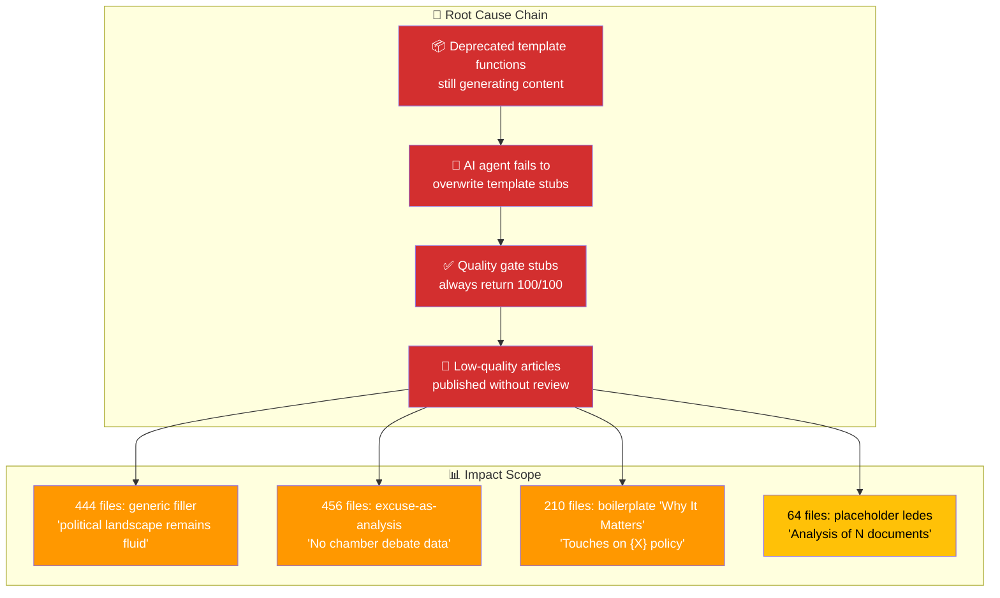

### News Article Quality Issues (2026-04-03)

| # | Issue | Severity | Scope | Required Fix |
|---|-------|----------|-------|------------|
| 1 | **Generic filler**: `"The political landscape remains fluid, with both government and opposition positioning for advantage."` appears in 444+ files | CRITICAL | ALL article types, ALL languages | AI MUST replace with specific winners/losers analysis naming parties, vote margins, and stakeholder impact |
| 2 | **Excuse-as-analysis**: `"No chamber debate data is available for these items, limiting our ability..."` in 456+ files | CRITICAL | ALL article types | AI MUST either (a) fetch debate data via MCP `search_anforanden`, or (b) provide analysis from committee report text, NOT excuse text |
| 3 | **Boilerplate "Why It Matters"**: `"Touches on {X} policy. {Generic category text}..."` in 210+ files — identical text reused across different documents | HIGH | committee-reports, propositions, motions | AI MUST write document-specific analysis explaining the unique policy impact of EACH document |
| 4 | **Contradictory numbers**: Article headlines claim different document counts than body text (e.g., "50 motions" in title, 10 in body) | HIGH | opposition-motions | AI MUST verify document counts match between title, lede, and body before committing |
| 5 | **Policy misclassification**: Food safety motion (HD024020) labeled as "housing policy"; water power exceptions labeled "housing policy" | HIGH | opposition-motions | AI MUST use Riksdag committee assignment (not keyword heuristic) for policy domain classification |
| 6 | **Missing analysis references**: Only 2 of 36 articles on 2026-04-03 include the "📊 Analysis & Sources" section | MEDIUM | ALL except week-ahead | AI MUST add analysis references section to EVERY article (see §Analysis-to-Article Reference Linking) |
| 7 | **Empty analysis files**: `propositions/synthesis-summary.md` and `week-ahead/synthesis-summary.md` report "0 documents analyzed" | CRITICAL | propositions, week-ahead | AI MUST populate analysis from MCP data even when download-parliamentary-data.ts finds 0 documents |
| 8 | **Quality gate disabled**: `assessArticleQuality()` in `helpers.ts` is a stub returning 100/100 for all articles | CRITICAL | ALL articles | AI workflow MUST self-evaluate against quality rubric before committing |

### Analysis File Quality Issues (2026-04-03)

| # | Issue | Severity | File(s) | Required Fix |
|---|-------|----------|---------|------------|
| 1 | Propositions synthesis reports "0 documents analyzed" despite government tabling 4 propositions | CRITICAL | `propositions/synthesis-summary.md` | AI must use MCP `get_propositioner` to find and analyze documents when script reports 0 |
| 2 | Week-ahead synthesis reports "0 documents analyzed" despite 17 committee reports scheduled | CRITICAL | `week-ahead/synthesis-summary.md` | AI must use MCP `get_calendar_events` and `get_betankanden` to populate week-ahead content |
| 3 | Committee reports synthesis says 2 documents but article says 10 — data inconsistency | HIGH | `committeeReports/synthesis-summary.md` | AI must reconcile analysis and article document counts |

---

## 📰 AI Article Content Generation Protocol (v4.0)

### Mandatory AI-Generated Sections

Every news article MUST contain these AI-generated sections. Script templates provide the HTML skeleton ONLY — all prose content must come from AI analysis of actual data.

#### 1. Analytical Lede (MANDATORY — replaces script placeholder)

> **Current anti-pattern (BANNED):**
> ```html
> <p class="lede">Analysis of 10 documents covering Committee:, Published:</p>
> ```

> **Required pattern:**
> ```html
> <p class="lede">Sweden's Defense Committee endorsed sweeping civilian shelter 
> legislation effective June 2026, while the Justice Committee rejected all 76 
> opposition demands on criminal corrections — signaling the governing coalition's 
> pre-election security consolidation strategy. [HIGH confidence]</p>
> ```

**AI Prompt for Lede Generation:**
```
Read ALL documents analyzed for this article. Write a lede paragraph (40-60 words) that:
1. Names the MOST significant political development (not a document count)
2. Identifies the key actor(s) by name and party: e.g., "Defense Minister Pål Jonson (M)"
3. States the concrete political action taken or proposed
4. Explains WHY this matters NOW (election timing, coalition dynamics, policy impact)
5. Includes a confidence label [HIGH/MEDIUM/LOW]
6. NEVER starts with "Analysis of N documents" — this is BANNED
```

#### 2. Per-Document "Why It Matters" (MANDATORY — replaces boilerplate)

> **Current anti-pattern (BANNED — appears 210+ times):**
> ```html
> <p><strong>Why It Matters:</strong> Touches on defence and security policy. 
> Defence proposals engage Sweden's NATO obligations and cross-party consensus-building 
> mechanisms for national security legislation.</p>
> ```

> **Required pattern:**
> ```html
> <p><strong>Why It Matters:</strong> FöU12 establishes Sweden's first comprehensive 
> civilian shelter law since 1944, requiring municipalities to map and upgrade 65,000+ 
> shelters by 2028. With Russia's invasion of Ukraine as backdrop, this bipartisan 
> measure (only V and MP dissented) reflects post-NATO accession defense deepening. 
> Budget: SEK 2.1 billion over 3 years. [HIGH confidence — source: Prop. 2025/26:228]</p>
> ```

**AI Prompt for "Why It Matters":**
```
For EACH document in the article, write a unique "Why It Matters" paragraph (30-50 words) that:
1. Names the SPECIFIC law, committee, or policy measure (not just the policy domain)
2. Cites QUANTIFIED impact: budget amounts (SEK), affected population, timeline, seat counts
3. Places it in POLITICAL CONTEXT: which parties support/oppose, coalition dynamics, electoral timing
4. References the SOURCE document (dok_id, proposition number, committee report code)
5. NEVER reuses the same "Why It Matters" text for multiple documents — each must be unique
6. BANNED pattern: "Touches on {X} policy. {Generic text about the policy domain}..."
```

#### 3. Winners & Losers Analysis (MANDATORY — replaces generic filler)

> **Current anti-pattern (BANNED — appears 444+ times):**
> ```html
> <h3>Winners & Losers</h3>
> <p>The political landscape remains fluid, with both government and opposition 
> positioning for advantage.</p>
> ```

> **Required pattern:**
> ```html
> <h3>Winners & Losers</h3>
> <p><strong>Winners:</strong> Defense Minister Jonson (M) consolidates NATO credibility 
> with SEK 8.7B GUTE II deal; municipalities gain SEK 2.1B shelter upgrade funding; 
> Saab/BAE Systems Bofors secure largest counter-drone contract in Swedish history.</p>
> <p><strong>Losers:</strong> V and MP face isolation after opposing shelter law; 
> criminal justice opposition (76 rejected demands) signals S strategy failure on 
> corrections policy; ECHR compliance concerns on HD03235 deportation bill remain 
> unaddressed by government.</p>
> ```

**AI Prompt for Winners & Losers:**
```
Analyze ALL documents in this article and identify:
1. **Winners** (2-4): Name specific parties, ministers, agencies, or sectors that GAIN from these developments. Cite the specific document and quantified benefit.
2. **Losers** (2-4): Name specific parties, opposition figures, or affected groups that are DISADVANTAGED. Cite the specific document and quantified loss.
3. NEVER use generic filler like "The political landscape remains fluid" — this is BANNED
4. Every winner/loser claim MUST cite a specific document (dok_id) or vote record
5. Include party abbreviations: (M), (S), (SD), (V), (MP), (C), (L), (KD)
```

#### 4. Strategic Context (MANDATORY — replaces missing section)

**AI Prompt for Strategic Context:**
```
Write a "Strategic Context" paragraph (50-80 words) that:
1. Connects this article's documents to the BROADER political landscape
2. Identifies whether this represents government OFFENSIVE (new legislation), 
   DEFENSIVE (responding to opposition), or MAINTENANCE (routine business)
3. Notes electoral timing implications (how far from next election, budget cycle position)
4. Cross-references related documents from OTHER article types on the same date
5. Uses MCP data: search_voteringar for vote records, search_anforanden for debate context
```

#### 5. Key Takeaways (MANDATORY — replaces script-generated bullets)

**AI Prompt for Key Takeaways:**
```
Generate 3-5 key takeaways as bullet points, each with:
1. A bold lead phrase (5-8 words) summarizing the insight
2. One sentence of supporting evidence with dok_id citation
3. A confidence label [HIGH/MEDIUM/LOW]
4. NEVER use generic takeaways like "Monitor developments over 1-2 weeks"
5. Each takeaway must be UNIQUE to this article (not reusable across dates)

Example:
- **Coalition unity on security agenda [HIGH]:** All four government propositions 
  (Prop. 2025/26:214, 228, 235, 216) passed with full coalition + SD support, 
  demonstrating pre-election alignment on law-and-order messaging.
```

---

## 📊 Visualization Integration Protocol (v4.0)

> **Scope rule**: Chart.js / D3.js visualizations are for **HTML news articles only**.
> Markdown analysis files (`.md`) MUST use **Mermaid diagrams** for all visualizations — see §Mermaid Diagram Requirements below.

### Chart.js / D3.js Integration in News Articles

News articles (HTML) SHOULD include interactive visualizations when data supports them. The AI agent generates the data and configuration; scripts render the Chart.js containers via `<canvas data-chart-config="...">`.

#### Supported Visualization Types (HTML news articles only)

| Visualization | Use Case | Library | AI Provides |
|---------------|----------|---------|-------------|
| **SWOT Quadrant Chart** | Stakeholder analysis summary | Chart.js (radar) | SWOT entries with impact scores |
| **Risk Heat Map** | Risk assessment visualization | Chart.js (scatter) | L×I scores for all identified risks |
| **Coalition Vote Chart** | Party voting patterns | Chart.js (bar) | Vote counts per party (Ja/Nej/Avstår) |
| **Policy Domain Radar** | Multi-dimensional policy coverage | Chart.js (radar) | Scores per policy domain (0-10) |
| **Legislative Pipeline Sankey** | Document flow from proposal to vote | D3.js (Sankey) | Source→committee→vote stage data |
| **CSS Mindmap** | Topic relationship overview | Pure CSS | Hierarchical topic structure |
| **Timeline Chart** | Legislative schedule and deadlines | Chart.js (line) | Date-based milestones |

#### AI Prompt for Visualization Data

```
For this article's documents, generate visualization data in JSON format:

1. **SWOT Quadrant** (if SWOT analysis exists, emit a valid Chart.js config in `data-chart-config`):
   {
     "type": "radar",
     "data": {
       "labels": ["Strengths", "Weaknesses", "Opportunities", "Threats"],
       "datasets": [
         {
           "label": "SWOT impact profile",
           "data": [8, 6, 7, 9],
           "backgroundColor": "rgba(0, 217, 255, 0.15)",
           "borderColor": "#00d9ff",
           "borderWidth": 2,
           "pointRadius": 5
         }
       ]
     },
     "options": {
       "responsive": true,
       "plugins": {
         "legend": { "labels": { "color": "#e0e0e0" } }
       },
       "scales": {
         "r": {
           "grid": { "color": "rgba(255,255,255,0.1)" },
           "ticks": { "color": "#b0b0b0", "backdropColor": "transparent" },
           "pointLabels": { "color": "#e0e0e0" }
         }
       }
     }
   }

2. **Vote Chart** (if voting data available via search_voteringar, emit a valid Chart.js config in `data-chart-config`):
   {
     "type": "bar",
     "data": {
       "labels": ["S", "M", "SD", "V", "C", "MP", "L", "KD"],
       "datasets": [
         { "label": "Ja",     "data": [0, 68, 0, 0, 0, 0, 16, 19], "backgroundColor": "#8BC34A" },
         { "label": "Nej",    "data": [107, 0, 0, 24, 24, 18, 0, 0], "backgroundColor": "#ff006e" },
         { "label": "Avstår", "data": [0, 0, 73, 0, 0, 0, 0, 0], "backgroundColor": "#ffbe0b" }
       ]
     },
     "options": {
       "responsive": true,
       "scales": {
         "x": { "stacked": true, "ticks": { "color": "#b0b0b0" }, "grid": { "color": "rgba(255,255,255,0.06)" } },
         "y": { "stacked": true, "ticks": { "color": "#b0b0b0" }, "grid": { "color": "rgba(255,255,255,0.06)" } }
       },
       "plugins": {
         "legend": { "labels": { "color": "#e0e0e0" } }
       }
     }
   }

3. **Risk Heat Map** (if risk assessment exists, emit a valid Chart.js config in `data-chart-config`):
   {
     "type": "scatter",
     "data": {
       "datasets": [
         {
           "label": "Risks",
           "data": [
             { "x": 3, "y": 4 },
             { "x": 2, "y": 5 }
           ],
           "backgroundColor": ["#D32F2F", "#FF9800"],
           "pointRadius": 10
         }
       ]
     },
     "options": {
       "responsive": true,
       "scales": {
         "x": { "title": { "display": true, "text": "Likelihood", "color": "#e0e0e0" }, "min": 0, "max": 5, "ticks": { "color": "#b0b0b0" }, "grid": { "color": "rgba(255,255,255,0.06)" } },
         "y": { "title": { "display": true, "text": "Impact", "color": "#e0e0e0" }, "min": 0, "max": 5, "ticks": { "color": "#b0b0b0" }, "grid": { "color": "rgba(255,255,255,0.06)" } }
       },
       "plugins": {
         "legend": { "labels": { "color": "#e0e0e0" } }
       }
     }
   }

Embed each visualization on the target `<canvas>` element using a
`data-chart-config` attribute as the serialized handoff format
(for generation examples, see `scripts/data-transformers/content-generators/dashboard-section.ts`).
Serialize a **complete, valid Chart.js configuration object** (with `type`, `data`, `options`)
into `data-chart-config`. Do **not** use `<script type="application/json" class="chart-data">`.
**Important:** charts will render only if the target page loads a client-side initializer
that reads `canvas[data-chart-config]` and instantiates Chart.js from that JSON; do not
assume article pages perform this step automatically unless that initializer is explicitly present.

> **Canonical chart type identifiers**: You may add a `chartType` string field at the top level
> of the JSON config for downstream identification. Valid identifiers: `coalition-votes`,
> `swot-quadrant`, `risk-heatmap`, `policy-radar`, `legislative-sankey`, `css-mindmap`, `timeline`.
```

#### Mermaid Diagram Requirements in Analysis Files

Every analysis file MUST include at least 1 Mermaid diagram. For synthesis files, include at least 2:

```
## Required Mermaid Diagrams per Analysis Type (v5.0)

| Analysis File | Required Diagram Type | Diagram Purpose | Minimum Color-Coded Nodes |
|---------------|----------------------|-----------------|:-------------------------:|
| per-file-political-intelligence.md | `flowchart LR` — classification tree + `quadrantChart` — SWOT impact | Classification decision path + political impact mapping | 4 colors |
| synthesis-summary.md | `graph TD` — intelligence dashboard + `graph LR` — SWOT balance | Daily landscape overview + coalition assessment | 4 colors each |
| swot-analysis.md | `graph TD` — SWOT quadrant mapping with cross-links | S↔O exploits and W↔T amplifications | 4 colors |
| risk-assessment.md | `graph TD` — risk heat map + `flowchart TD` — cascading chain | L×I positioning and risk dependencies | 4 tiers (green/yellow/orange/red) |
| threat-analysis.md | `graph LR` — attack tree (threat taxonomy branches) | Threat sources, pathways, and mitigations | 6 threat categories |
| stakeholder-impact.md | `graph TD` — stakeholder impact network | Stakeholder groups affected and direction | 6 stakeholder groups |
| significance-scoring.md | `graph TD` — scoring profile + decision gate | 5-dimension significance breakdown | 5 decision outcomes |
| political-classification.md | `graph LR` — classification decision tree | Sensitivity + urgency + scope paths | 4 paths |

### Diagram Type Mandate by Analysis Context

| Analysis Context | Mandatory Diagram Type | Reason |
|-----------------|----------------------|--------|
| **Legislative process** | `flowchart` (LR or TD) — stages from committee to royal assent | Visualize process status and bottlenecks |
| **Policy evolution over time** | `timeline` or `gantt` — chronological development | Track policy trajectory |
| **Coalition/party dynamics** | `quadrantChart` — party position mapping | Reveal alignment and opposition patterns |
| **Risk landscape** | `graph TD` with color-coded L×I scores | Visualize risk tiers and dependencies |
| **Stakeholder relationships** | `graph LR` with directional influence arrows | Map power dynamics and coalition potential |
| **Threat decomposition** | `flowchart` attack tree structure | Identify threat vectors and mitigations |

---

## 🏷️ Policy Domain Inference Protocol (v4.0)

### Committee-to-Domain Mapping

When classifying documents by policy domain, use the Riksdag committee assignment as the PRIMARY indicator. Title-based keyword heuristics are SECONDARY and must NOT override committee classification.

| Committee Code | Committee Name | Primary Policy Domain | Secondary Domain |
|---|---|---|---|
| FiU | Finansutskottet | 💰 Fiscal & Economic Policy | Budget, Taxation |
| JuU | Justitieutskottet | ⚖️ Justice & Criminal Policy | Courts, Police, Corrections |
| FöU | Försvarsutskottet | 🛡️ Defence & Security Policy | Military, Civil Defence, NATO |
| SoU | Socialutskottet | 🏥 Healthcare & Social Policy | Welfare, Pensions, Elder Care |
| UU | Utrikesutskottet | 🌍 Foreign Affairs | Diplomacy, EU, International Aid |
| AU | Arbetsmarknadsutskottet | 👷 Labour Market | Employment, Integration, Work Permits |
| CU | Civilutskottet | 🏠 Housing & Consumer Policy | Property, Planning, Consumer Protection |
| KU | Konstitutionsutskottet | 📜 Constitutional Affairs | Government Accountability, Elections |
| UbU | Utbildningsutskottet | 📚 Education | Schools, Universities, Research |
| MJU | Miljö- och jordbruksutskottet | 🌱 Environment & Agriculture | Climate, Food Safety, Water |
| NU | Näringsutskottet | 🏭 Industry & Commerce | Business, Energy, Trade |
| SfU | Socialförsäkringsutskottet | 🫂 Social Insurance | Parental Leave, Sickness, Migration |
| TU | Trafikutskottet | 🚂 Transport & Infrastructure | Roads, Rail, Aviation, Digital |
| SkU | Skatteutskottet | 🧾 Taxation | Tax Policy, Revenue |
| KrU | Kulturutskottet | 🎭 Culture & Media | Arts, Press, Public Broadcasting |

**v4.0 Rule — Domain Classification Priority:**
1. **Committee assignment** (from `utskott` field in MCP data) — AUTHORITATIVE
2. **Cross-reference** to parent proposition or committee report — HIGH confidence
3. **Title keyword analysis** — SUPPLEMENTARY only, NEVER overrides committee assignment
4. **BANNED**: Classifying a document based solely on keyword presence (e.g., labeling a food safety motion as "housing policy" because it appears in a list with housing motions)

---

## 🤖 Claude Opus 4.7 Agentic Workflow Enhancements (v4.0)

### Pre-Article Analysis Integration

> **v4.0 Critical Fix**: The AI agent MUST read pre-computed analysis files BEFORE generating article content. Currently, scripts generate stub articles and the AI is expected to enhance them, but analysis data is not explicitly consumed.

**Required Workflow Sequence:**

```mermaid
flowchart LR
    A["📥 Step 1: Data Download<br/>MCP + download-parliamentary-data.ts"] --> B["📊 Step 2: Per-File AI Analysis<br/>Read methodology, analyze each file"]
    B --> C["📋 Step 3a: READ Analysis Files<br/>synthesis, SWOT, risk, stakeholder"]
    C --> D["📰 Step 3b: Generate Article HTML<br/>Using analysis as primary source"]
    D --> E["🏷️ Step 3c: AI Title & Meta<br/>From actual article content"]
    E --> F["📊 Step 3d: Add Analysis References<br/>Link to all analysis files"]
    F --> G["✅ Step 4: Quality Self-Check<br/>Against rubric (min 7.0/10)"]
    G --> H["🌐 Step 5: Translate<br/>All 14 languages"]
    
    style C fill:#4CAF50,color:#FFFFFF
    style D fill:#1565C0,color:#FFFFFF
    style G fill:#FFC107,color:#000000
```

**NEW Step 3a — Read Analysis Before Writing Article:**

```markdown
### Step 3a: Read Pre-Computed Analysis (MANDATORY before article generation)

Use `${ANALYSIS_SUBFOLDER}` for analysis paths, not the public `${ARTICLE_TYPE}` slug. The workflows map article slugs to analysis folders, for example:
- `committee-reports` → `committeeReports`
- `government-propositions` → `propositions`
- `opposition-motions` → `motions`
- `interpellation-debates` → `interpellations`

Before writing ANY article content, the AI MUST read:

1. `analysis/daily/${ARTICLE_DATE}/${ANALYSIS_SUBFOLDER}/synthesis-summary.md` → Extract key findings, risk levels, confidence scores
2. `analysis/daily/${ARTICLE_DATE}/${ANALYSIS_SUBFOLDER}/swot-analysis.md` → Extract top S/W/O/T entries for Winners & Losers
3. `analysis/daily/${ARTICLE_DATE}/${ANALYSIS_SUBFOLDER}/risk-assessment.md` → Extract risk scores for Strategic Context
4. `analysis/daily/${ARTICLE_DATE}/${ANALYSIS_SUBFOLDER}/stakeholder-perspectives.md` → Extract stakeholder impacts
5. `analysis/daily/${ARTICLE_DATE}/${ANALYSIS_SUBFOLDER}/significance-scoring.md` → Extract significance scores for prioritization
6. Per-document analysis files in `analysis/daily/${ARTICLE_DATE}/${ANALYSIS_SUBFOLDER}/documents/` subfolder → Extract per-document "Why It Matters"

If synthesis reports "0 documents analyzed":
- DO NOT skip article generation
- USE MCP tools directly to fetch and analyze documents
- Flag the data gap: "⚠️ Pre-computed analysis unavailable — article generated from live MCP data"
```

### AI Self-Evaluation Quality Gate

> **v4.0 Addition**: Since `assessArticleQuality()` in `helpers.ts` is a disabled stub (always returns 100/100), the AI agent MUST perform its own quality evaluation.

**AI Prompt for Self-Evaluation:**

```markdown
## Article Quality Self-Check (run before committing)

Score this article on 5 dimensions (1-10 each, minimum 7.0 composite):

1. **Evidence Density** (weight: 25%): 
   - Count dok_id citations. ≥5 = score 8+, ≥3 = score 6+, <3 = FAIL
   - Count named politicians with party abbreviation. ≥3 = score 7+

2. **Analytical Depth** (weight: 25%):
   - Does the lede name a specific political development? (not "Analysis of N documents")
   - Does "Why It Matters" differ for each document? (not copy-paste)
   - Does "Winners & Losers" name specific parties and cite evidence?
   - Is "Strategic Context" present with coalition/electoral analysis?

3. **Structural Completeness** (weight: 20%):
   - [ ] Analytical lede present (not placeholder)
   - [ ] Per-document "Why It Matters" sections (all unique)
   - [ ] Winners & Losers with named parties
   - [ ] Key Takeaways with confidence labels
   - [ ] Analysis References section with GitHub links
   - [ ] No untranslated Swedish text in non-Swedish articles

4. **Visualization** (weight: 15%):
   - [ ] At least 1 visualization data block or Mermaid reference
   - [ ] SWOT summary or risk indicator visible in article

5. **Neutrality** (weight: 15%):
   - [ ] Both government and opposition perspectives represented
   - [ ] Confidence labels on analytical claims
   - [ ] No opinion-only statements without [ASSESSMENT] tag

**If composite score < 7.0**: Revise the article before committing. Up to 3 revision passes allowed.
**If any dimension < 5.0**: Article MUST be revised — do not commit.
```

### Handling Empty Analysis (v4.0 Critical Fix)

When `data-download-manifest.md` reports `**Documents Downloaded**: 0` (or `**Documents Selected (date-filtered)**: 0`, as happened for propositions and week-ahead on 2026-04-03), the AI agent MUST NOT generate an empty article. Instead:

```markdown
## Empty Download Fallback Protocol

1. **Attempt MCP data retrieval directly:**
   - Propositions: `get_propositioner(rm="2025/26", limit=20)`
   - Committee reports: `get_betankanden(rm="2025/26", limit=20)`  
   - Motions: `get_motioner(rm="2025/26", limit=50)`
   - Interpellations: `get_interpellationer(rm="2025/26", limit=20)`
   - Calendar: `get_calendar_events(from=ARTICLE_DATE, tom=ARTICLE_DATE+7)`

2. **If MCP returns data**: Analyze documents and generate full article content
3. **If MCP returns no data**: Generate a SHORT analytical article explaining:
   - Why no documents were expected (recess period, parliamentary calendar)
   - What documents are expected NEXT (upcoming committee schedules)
   - Link to the most recent substantive analysis for context
4. **NEVER publish an article with "0 documents downloaded" as the lede**
```

### 🔍 Deep-Inspection Batch Analysis Enrichment Protocol (v4.1)

> **Root Cause (2026-04-03 audit)**: Deep-inspection analysis for HD03214 produced a rich per-document analysis (5.1KB with SWOT, risk, stakeholders, Mermaid diagrams) but all 9 batch analysis files reported "0 documents analyzed" (total: 7.3KB vs 52.4KB for a properly populated folder). This is because `download-parliamentary-data.ts` filters documents by exact date match, and deep-inspection targets documents from previous days.

**The problem**: Deep-inspection targets specific documents by ID (e.g., `HD03214` dated 2026-04-01), but the batch analysis pipeline filters for `datum === ARTICLE_DATE` (2026-04-03). Result: 300 documents downloaded, 0 pass the date filter, all 9 batch files are empty skeletons.

**The fix (two-pronged):**

1. **Script-level**: `download-parliamentary-data.ts` now accepts `--document-ids` flag. When provided, documents matching those IDs bypass the date filter and are included in batch analysis regardless of their publication date.

2. **Agent-level**: After per-file AI analysis, the agent MUST verify batch analysis quality and rewrite any files showing "0 documents analyzed":

```markdown
## Batch Analysis Enrichment Steps

### Step 1: Detect empty batch files
Check each of the 9 batch analysis files for "Documents Analyzed: 0" or "0 documents".
If ANY batch file reports 0 documents but per-document analysis exists in documents/, proceed to Step 2.

### Step 2: Read all per-document analyses
Read every `*-analysis.md` file in the `documents/` subdirectory.
Extract: executive summaries, SWOT entries, risk scores, stakeholder impacts, classification data, significance scores, forward indicators.

### Step 3: Rewrite batch files with aggregated content
Each batch file MUST:
- Report the actual number of documents analyzed (matching per-doc count)
- Include structured markdown tables (not prose)
- Include ≥1 color-coded Mermaid diagram with real data
- Include evidence citations with dok_id
- Include confidence labels [HIGH]/[MEDIUM]/[LOW]
- Be ≥500 bytes (not skeleton output)

### Step 4: Quality gate
- [ ] synthesis-summary.md has Intelligence Dashboard Mermaid + Top Documents table
- [ ] swot-analysis.md has ≥2 quadrants with evidence tables
- [ ] risk-assessment.md has risk matrix with L×I scores
- [ ] threat-analysis.md has threat taxonomy with indicators
- [ ] classification-results.md has document classification table
- [ ] significance-scoring.md has ranked significance table
- [ ] stakeholder-perspectives.md has 6-lens impact table
- [ ] cross-reference-map.md has relationship mapping
- [ ] No file contains "0 documents analyzed" when per-doc analysis exists
```

**Comparison — Before vs After enrichment:**

| Metric | Empty (Bad) | Enriched (Good) |
|--------|:-----------:|:---------------:|
| Total batch file size | ~7KB | ≥30KB |
| Mermaid diagrams | 0 | ≥8 (one per file) |
| Evidence tables | 0 | ≥8 |
| dok_id citations | 0 | ≥3 per file |
| "0 documents analyzed" | 9 files | 0 files |

---

## 📋 Empty Data Handling Protocol (v4.2)

When MCP tools return **zero documents** for the requested date/scope, the AI agent must follow this structured protocol rather than producing empty or placeholder analysis.

### Decision Flowchart

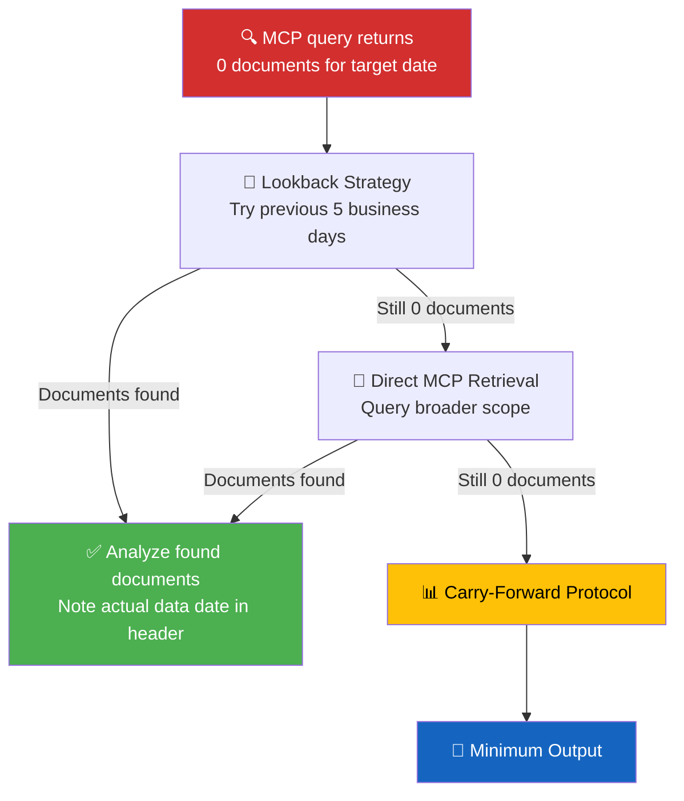

### Step 1: Lookback Strategy (Automated)

The `download-parliamentary-data.ts` pipeline automatically looks back up to **5 business days** (configurable via `MAX_LOOKBACK_BUSINESS_DAYS`). If documents are found via lookback, the `dataFreshness` field records the actual date using the canonical serialized format expected by downstream parsing:

```markdown
**Data Freshness**: Documents sourced from **2026-04-01** via lookback fallback (article date: 2026-04-03).
```

### Step 2: Direct MCP Retrieval (Agent-Level)

If the pipeline lookback found nothing, the AI agent MUST attempt direct MCP queries with progressively broader scope:

| Priority | MCP Query | Expected Yield |
|:---:|:---|:---|
| 1 | `get_propositioner(rm="2025/26", limit=20)` | Recent government propositions |
| 2 | `get_betankanden(rm="2025/26", limit=20)` | Recent committee reports |
| 3 | `get_motioner(rm="2025/26", limit=50)` | Recent motions |
| 4 | `get_interpellationer(rm="2025/26", limit=20)` | Recent interpellations |
| 5 | `get_fragor(rm="2025/26", limit=20)` | Recent written questions |
| 6 | `get_calendar_events(from=DATE, tom=DATE+7)` | Upcoming parliamentary events |
| 7 | `search_anforanden(rm="2025/26", limit=20)` | Recent chamber speeches |

### Step 3: Carry-Forward Protocol

When **no new documents** are available from any source (e.g., parliamentary recess, holiday period), produce a **minimum viable analysis** by carrying forward active items:

#### Mandatory Carry-Forward Items

| Analysis File | Carry-Forward Content | Source |
|:---|:---|:---|
| `synthesis-summary.md` | Most recent risk dashboard with staleness status | Previous day's `risk-assessment.md` |
| `risk-assessment.md` | All active risk scores with `Last evidence: [date]` field and staleness status derived from the aging table | Previous day's risk scores |
| `swot-analysis.md` | Active SWOT entries with confidence decay applied | Previous day's SWOT |
| `threat-analysis.md` | Active threat indicators with forward indicators | Previous day's threat analysis |
| `classification-results.md` | "No new documents — carry-forward active classifications" | Previous day's classifications |

#### Minimum Output Requirements

Even with 0 new documents, every output file MUST contain:

1. **Header** with accurate metadata (date, data source status, lookback result)
2. **Parliamentary calendar context** — explain WHY no documents (recess? weekend? holiday?)
3. **Active risk/SWOT carry-forward** with staleness markers
4. **Forward indicators** — what to watch for in the next analysis cycle
5. **≥1 Mermaid diagram** (risk dashboard or calendar timeline)
6. **NEVER** publish a file that says only "Documents Analyzed: 0" with no further content

#### Example: Minimum Output for Empty Day

```markdown
## 📊 Synthesis Summary — 2026-04-03

**Generated:** 2026-04-03 07:30 UTC
**Documents Analyzed:** 0 (new) | 12 (carry-forward from 2026-04-01)
**Parliamentary Calendar:** Riksdagen in session; no plenary votes scheduled for 2026-04-03
**Data Freshness**: Documents sourced from **2026-04-01**; no new documents for 2 business days

### Active Risk Dashboard (carry-forward)

| Risk | L | I | Score | Last Evidence | Status |
|:---|:---:|:---:|:---:|:---|:---:|
| Coalition stability | 2 | 5 | 10 | 2026-04-01 | ✅ Current |
| L threshold risk | 4 | 5 | 20 | 2026-03-28 | ⚠️ Aging |

### What to Watch Next
- FöU scheduled votering 2026-04-07 (Monday)
- SfU betänkande 2025/26:SfU14 expected week of 2026-04-07
```

---

## 📊 Per-File Analysis Output Example (v4.2)

This section shows the expected structure and depth for a **single MCP document analysis** to serve as a model for AI agents.

### Example: Analysis of Betänkande 2025/26:JuU15

**Input:** Committee report from Justitieutskottet on criminal justice reform

**Expected output structure:**

```markdown
# 📄 Intelligence Analysis: Bet. 2025/26:JuU15 — Criminal Sentencing Reform

**Document:** Betänkande 2025/26:JuU15
**Committee:** Justitieutskottet (JuU)
**Subject:** Skärpta straff för återfallsförbrytare (Harsher sentences for repeat offenders)
**dok_id:** HC01JuU15
**Classification:** 🟡 SENSITIVE | justice | ELEVATED
**Analysis Depth:** L2 (Strategic)

---

## Executive Summary

JuU15 proposes mandatory minimum sentences for repeat violent offenders,
marking the government's third criminal justice tightening this riksmöte.
The committee voted 10-7 along government/opposition lines with L filing
a separate reservation on proportionality grounds. [HIGH confidence]

## SWOT Assessment

| Quadrant | Entry | Confidence | Evidence |
|:---|:---|:---:|:---|
| Strength | Government secured committee majority (10-7) | HIGH | Voteringsresultat JuU 2026-03-15 |
| Weakness | L reservation signals coalition friction on justice policy | HIGH | dok_id: HC01JuU15, reservation §3 |
| Opportunity | Cross-party support from SD on sentencing enhancement | MEDIUM | search_anforanden: SD spokesperson statement |
| Threat | ECHR proportionality challenge if sentences exceed EU norms | MEDIUM | Legal analysis; no formal complaint yet |

## Risk Assessment

| Risk | L | I | Score | Calibration Anchor |
|:---|:---:|:---:|:---:|:---|
| L breaks coalition on proportionality | 2 | 4 | 8 | "L conditionally supports but signals red line" |
| Opposition delays via procedural challenge | 3 | 2 | 6 | "S uses reservations but lacks blocking votes" |

## Forward Indicators

- **Watch:** Plenary vote on JuU15 scheduled 2026-04-02
- **Watch:** L plenary spokesperson — will they maintain reservation or withdraw?
- **Trigger:** If L votes against in plenary → Coalition Risk escalates to L=4
```

> **This example demonstrates:** dok_id citations, named actors (L, SD, S), L×I risk scoring with calibration anchors, confidence labels, forward indicators with specific dates, and classified intelligence assessment.

---

## 🔍 Quality Issues Audit Cumulative Findings

### Persistent Issues Across Audits (2026-04-02 + 2026-04-03)

| Issue Category | 2026-04-02 Status | 2026-04-03 Status | Trend |
|:---|:---:|:---:|:---:|
| Placeholder meta descriptions | 3 articles | Fixed in most, still in some | 🟡 Improving |
| Generic "Defense in Focus" titles | 3 articles | Fixed | 🟢 Resolved |
| Missing analysis-references section | ALL articles | 2/36 have it | 🔴 Still failing |
| Generic "Why It Matters" boilerplate | Present | 210+ files affected | 🔴 Systemic |
| "Political landscape remains fluid" filler | Not tracked | 444+ files affected | 🔴 Systemic |
| "No chamber debate data" excuse text | Not tracked | 456+ files affected | 🔴 Systemic |
| Empty synthesis (0 documents) | Not tracked | 2 of 7 folders + deep-inspection | 🟡 Fix deployed (v4.1 enrichment protocol + --document-ids) |
| Deep-inspection empty batch files | Not tracked | 9 files at 7.3KB total | 🟡 Fix deployed (v4.1 --document-ids + enrichment) |
| Policy domain misclassification | Not tracked | Multiple instances | 🔴 New issue |
| Data count inconsistencies (title vs body) | Not tracked | Multiple instances | 🔴 New issue |

---

| Data count inconsistencies (title vs body) | Not tracked | Multiple instances | 🔴 New issue |

---

## 🗳️ Election 2026 Lens — Mandatory Analysis Requirement (v5.0)

> **Added in v5.0 — ALL analyses MUST include an Election 2026 section.**

With the September 2026 Swedish general election approaching, every political intelligence analysis MUST assess electoral implications. This requirement applies to all analysis templates and workflow outputs.

### Mandatory Election 2026 Assessment Dimensions

Every per-file analysis and synthesis summary MUST assess:

1. **Electoral Impact** — How does this document/event affect September 2026 election positioning?
2. **Coalition Scenarios** — Which coalition configurations benefit/suffer?
3. **Voter Salience** — Which voter segments are most affected, and by how much?
4. **Campaign Vulnerability** — Does this create campaign attack vectors for opposition?
5. **Policy Legacy** — Will this become an electoral asset or liability by September 2026?

### Electoral Significance Classifications

| Classification | Definition | Action |
|---------------|-----------|--------|
| 🔴 **CRITICAL** | Event will directly affect 2026 election outcome | Include in all synthesis summaries; flag for electoral tracking |
| 🟠 **HIGH** | Significant pre-election narrative contribution | Mandatory inclusion in forward indicators |
| 🟡 **MODERATE** | Peripheral electoral relevance | Include if space allows; note in stakeholder analysis |
| 🟢 **LOW** | Minimal electoral impact | Optional brief mention |
| ⚪ **NEGLIGIBLE** | No discernible electoral dimension | Include Election 2026 section and explicitly mark as negligible electoral relevance |

### Pre-Election Analysis Calendar

| Milestone | Date | Analysis Focus |
|-----------|------|---------------|
| Budget proposition deadline | Sep 2026 | Fiscal credibility, welfare promises |
| Last major Riksdag session | Jun 2026 | Legislative legacy assessment |
| Party conference season | Sep–Oct 2025 | Policy positioning, coalition signals |
| EU implications window | Ongoing | Sweden's EU presidency, ECHR compliance |
| **General Election** | **Sep 2026** | **Full electoral analysis required** |

---

## 🎯 5-Level Confidence Scale (v5.0)

> **Replaces binary HIGH/MEDIUM/LOW scale across ALL analysis types.**

| Level | Label | Criteria | Evidence Threshold | Color Code |
|-------|-------|----------|--------------------|:----------:|
| ⬛ 1 | **VERY LOW** | Speculation only, single unverified source | 0–1 sources, no corroboration | `#9E9E9E` |
| 🟥 2 | **LOW** | Circumstantial evidence, indirect indicators | 2 sources, indirect evidence | `#D32F2F` |
| 🟧 3 | **MEDIUM** | Multiple independent sources, moderate corroboration | 3+ sources, moderate agreement | `#FF9800` |
| 🟩 4 | **HIGH** | Official records, documented data, direct evidence | Official docs, voting records, committee reports | `#4CAF50` |
| 🟦 5 | **VERY HIGH** | Verified data + independent corroboration + expert consensus | Multiple official sources, cross-validated | `#1565C0` |

### Confidence Level Application Rules

- **VERY HIGH** — Applies only to claims backed by official voting records, committee decisions, government propositions, or multiple verified news sources with cross-validation.
- **HIGH** — Official documents (riksdag API data, government press releases) consulted but not independently cross-validated.
- **MEDIUM** — Multiple sources available but with some inconsistency or incomplete coverage.
- **LOW** — Limited evidence; claim is inferential or based on pattern recognition without direct confirmation.
- **VERY LOW** — Speculative; only a single indirect indicator with no corroborating evidence.

### Migration from 3-Level to 5-Level Scale

When upgrading existing analyses to use the 5-level scale:
- Previous `HIGH` → `HIGH` (4) or `VERY HIGH` (5) depending on cross-validation status
- Previous `MEDIUM` → `MEDIUM` (3) or `LOW` (2) depending on evidence density
- Previous `LOW` → `LOW` (2) or `VERY LOW` (1) depending on source quality

---

## 📊 Mandatory Mermaid Diagram Requirements (v5.0)

Each analysis type MUST include the specified Mermaid diagram type:

| Analysis Type | Required Mermaid Diagram | Purpose |
|--------------|------------------------|---------|
| **Legislative process analyses** | `flowchart` — showing legislative stages (committee → floor vote → royal assent) | Visualize process status and bottlenecks |
| **Policy evolution analyses** | `timeline` or `gantt` — showing policy development over time | Track policy trajectory |
| **Coalition/party dynamics** | `quadrantChart` or `mindmap` — mapping party positions | Reveal alignment patterns |
| **Risk assessment** | `graph TD` with color-coded risk nodes (L×I scores) | Visualize risk landscape |
| **Stakeholder relationships** | `graph LR` with directional arrows showing influence | Map power dynamics |
| **Threat analysis** | `flowchart` attack tree (LR direction, threat taxonomy) | Decompose threat vectors |

### Mermaid Color Standards

```
🔴 CRITICAL/SEVERE/RESTRICTED: fill:#D32F2F,color:#FFFFFF
🟠 HIGH/URGENT: fill:#FF9800,color:#FFFFFF
🟡 MEDIUM/ELEVATED: fill:#FFC107,color:#000000
🟢 LOW/ROUTINE/PUBLIC: fill:#4CAF50,color:#FFFFFF
🔵 INFORMATION/ELEVATED: fill:#1565C0,color:#FFFFFF
⚪ NEUTRAL/PLACEHOLDER: fill:#9E9E9E,color:#FFFFFF
```

---

## 📋 Historical Comparison Requirements (v5.0)

Every synthesis-level analysis MUST include a historical comparison with:

1. **Same period last riksmöte** — Compare document volumes, risk levels, coalition dynamics
2. **Same period last year** — Year-over-year trend indicators
3. **Pre-election equivalents** — Compare to equivalent pre-election periods in 2021/22

**Historical Comparison Minimum Requirements:**
- At least 3 metric comparisons with trend arrows (↑/→/↓)
- At least 1 precedent from a prior riksmöte with documented outcome
- Context statement of 2–3 sentences explaining whether this is a historically unusual period

---

## 📚 Related Documents

| Document | Purpose |
|----------|---------|
| [per-file-political-intelligence.md](../templates/per-file-political-intelligence.md) | Per-file analysis output template |
| [per-file-intelligence-analysis.md](../../scripts/prompts/v2/per-file-intelligence-analysis.md) | AI prompt with full protocol and filled example |
| [political-swot-framework.md](political-swot-framework.md) | SWOT methodology with evidence hierarchy |
| [political-risk-methodology.md](political-risk-methodology.md) | Risk assessment methodology |
| [political-threat-framework.md](political-threat-framework.md) | Multi-framework threat analysis (Attack Trees, Kill Chain, Diamond Model) |
| [political-classification-guide.md](political-classification-guide.md) | Classification taxonomy |
| [political-style-guide.md](political-style-guide.md) | Writing and formatting standards |
| [SWOT.md](../../SWOT.md) | **Formatting exemplar** (platform SWOT) |
| [THREAT_MODEL.md](../../THREAT_MODEL.md) | **Formatting exemplar** (platform threat model) |
| [.github/prompts/README.md](../../.github/prompts/README.md) | **Shared news workflow prompts** — quality enforcement |

---

**Document Control:**  
- **Path:** `/analysis/methodologies/ai-driven-analysis-guide.md`  
- **Version:** 5.1  
- **Key Changes v5.1:** Engine upgrade to **Claude Opus 4.7** across all 12 agentic workflows (including translation, previously Claude Sonnet 4.6); leverages Opus 4.7's stronger long-context reasoning to deepen SWOT, stakeholder, and risk analyses without script changes; expectation that pass-2 iterations now substantively rewrite (not just tighten) every analysis section; translation quality target raised to native-speaker political-domain fluency  
- **Key Changes v5.0:** Election 2026 Lens (mandatory 5-dimension electoral assessment for ALL analyses), 5-Level Confidence Scale replacing binary HIGH/MEDIUM/LOW, Mermaid diagram mandates per analysis type (flowchart/timeline/quadrantChart/mindmap), Historical Comparison requirements (3 time periods + precedents), pre-election analysis calendar  
- **Key Changes v4.2:** Empty Data Handling Protocol (lookback strategy, direct MCP retrieval, carry-forward protocol, minimum output requirements), Per-File Analysis Output Example (worked example of betänkande analysis with SWOT/risk/forward indicators)  
- **Key Changes v4.0:** AI article content generation protocol (5 mandatory sections with prompts), visualization integration protocol (Chart.js/D3.js), policy domain inference with committee mapping, pre-article analysis integration requirement, AI self-evaluation quality gate, empty analysis fallback protocol, 2026-04-03 systemic quality audit (444+ generic filler, 456+ excuse-as-analysis, 210+ boilerplate), cumulative quality tracking  
- **Key Changes v3.0:** Claude Opus 4.7 agentic integration, AI-first analysis principle, deprecated code function table, AI title/description generation prompts, analysis-to-article reference linking, cross-reference quality requirements, 2026-04-02 quality audit findings  
- **Key Changes v2.1:** Document-type analysis focus table, analysis depth levels (L1/L2/L3), anti-pattern gallery, quality gate checklist with scoring rubric  
- **Key Changes v2.0:** Folder isolation rules, AI-only content mandate, multi-framework depth requirements, advanced anti-pattern detection  
- **Classification:** Public  
- **Next Review:** 2026-09-01
