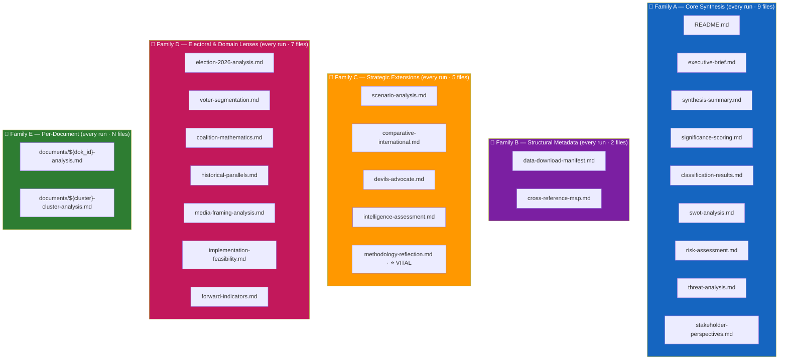
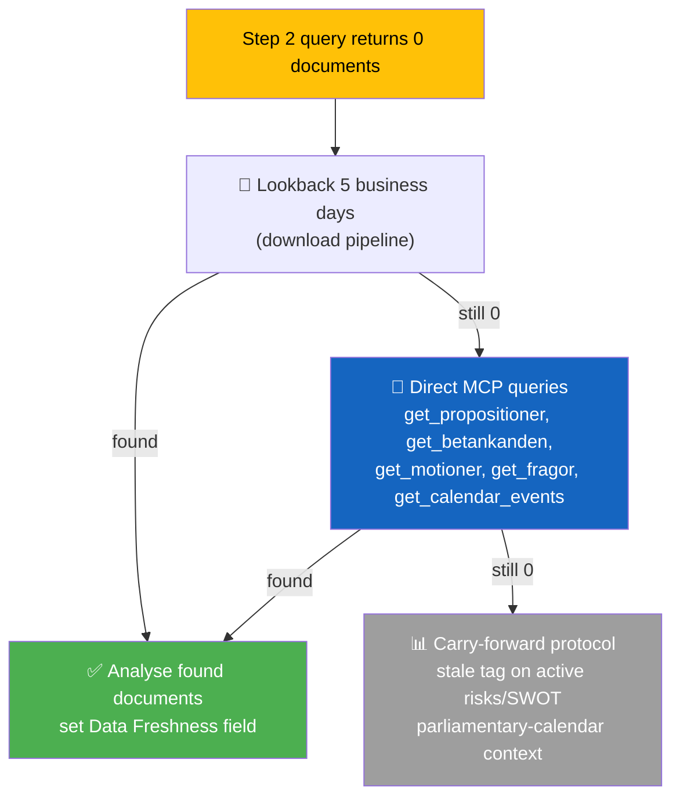

<p align="center">
  
</p>

<h1 align="center">🤖 AI-Driven Analysis Guide — Step-by-Step Protocol</h1>

<p align="center">
  <strong>📊 The Single, Canonical Protocol for Every Riksdagsmonitor Agentic Workflow</strong><br>
  <em>🎯 Clear Steps · Positive Voice · Deep Political Intelligence · Color-Coded Mermaid</em>
</p>

<p align="center">
  <a href="#"></a>
  <a href="#"></a>
  <a href="#"></a>
  <a href="#"></a>
</p>

**📋 Document Owner:** CEO | **📄 Version:** 6.6 | **📅 Last Updated:** 2026-04-25 (UTC)
**🔄 Review Cycle:** Quarterly | **⏰ Next Review:** 2026-07-21
**🏢 Owner:** Hack23 AB (Org.nr 5595347807) | **🏷️ Classification:** Public

> **v6.2 simplification:** Every workflow now produces **every file in every family** (23 core files + per-document set) — no trigger gates, no conditional output. Depth per item adapts by DIW tier, not which files exist. `methodology-reflection.md` is elevated to ⭐ VITAL run-audit status. This guide is the **single entry point** for every agentic workflow, describing **what to produce** with a canonical 7-step protocol. Deep framework theory and extended examples live in the linked Family production methodologies.

---

## 🎯 What This Guide Is For

Every Riksdagsmonitor agentic workflow (morning, midday, evening, realtime, weekly, monthly) runs the same protocol and produces the same output families. This guide defines that protocol once, so every workflow produces **deep, consistent, publication-quality political intelligence** from Swedish Riksdag and Regeringen data.

> **Quality standard**: Every analysis file matches the depth and formatting of [SWOT.md](../../SWOT.md) and [THREAT_MODEL.md](../../THREAT_MODEL.md) — evidence tables, color-coded Mermaid diagrams, confidence-labeled claims, and actionable forward indicators.

---

## 🧭 The 7-Step Analysis Protocol

```mermaid
flowchart LR
    S1["1️⃣ Prepare<br/>Read methodologies<br/>+ templates"] --> S2["2️⃣ Download<br/>MCP data into<br/>workflow folder"]
    S2 --> S3["3️⃣ Per-File Analysis<br/>One .md per document<br/>(Tier L1–L3)"]
    S3 --> S4["4️⃣ Core Synthesis<br/>Family A files<br/>(9 outputs)"]
    S4 --> S5["5️⃣ Extensions<br/>Family C & D<br/>if warranted"]
    S5 --> S6["6️⃣ Quality Gate<br/>Self-audit against<br/>rubric ≥ 7.0/10"]
    S6 --> S7["7️⃣ Pass-2 Rewrite<br/>Read own output,<br/>deepen every section"]

    style S1 fill:#1565C0,color:#FFFFFF
    style S2 fill:#1565C0,color:#FFFFFF
    style S3 fill:#7B1FA2,color:#FFFFFF
    style S4 fill:#7B1FA2,color:#FFFFFF
    style S5 fill:#FF9800,color:#FFFFFF
    style S6 fill:#FFC107,color:#000000
    style S7 fill:#4CAF50,color:#FFFFFF
```



Every step is mandatory. Steps 3–7 run inside a single workflow folder at `analysis/daily/YYYY-MM-DD/{scope}/` (or `analysis/daily/YYYY-MM-DD/realtime-HHMM/` for realtime runs).

---

### Step 1 — Prepare

**Read, in order:**

| Order | File | What it gives you |
|:-----:|------|-------------------|
| 1 | This guide (`ai-driven-analysis-guide.md`) | The 7-step protocol and output matrix |
| 2 | [`political-style-guide.md`](political-style-guide.md) | **Tradecraft anchors**: F3EAD cycle, PIR/EEI catalog, Admiralty Code (+ **Source Diversity Rule**), ICD 203 mapping, WEP + ODNI confidence, SATs, Collection Management Matrix (incl. IMF) |
| 3 | [`per-document-methodology.md`](per-document-methodology.md) | 📒 How to produce every `{dok_id}-analysis.md` and cluster file |
| 4 | [`structural-metadata-methodology.md`](structural-metadata-methodology.md) | 📗 How to produce manifest + cross-reference map |
| 5 | [`synthesis-methodology.md`](synthesis-methodology.md) | 📘 How to produce the 5 Family A synthesis outputs |
| 6 | [`strategic-extensions-methodology.md`](strategic-extensions-methodology.md) | 📙 How to produce Family C depth products (core — every run) |
| 7 | [`electoral-domain-methodology.md`](electoral-domain-methodology.md) | 📕 How to produce Family D lens products (core — every run) |
| 8 | [`political-classification-guide.md`](political-classification-guide.md) | 7-dimension document classification |
| 9 | [`political-swot-framework.md`](political-swot-framework.md) | SWOT, TOWS, cross-SWOT interference |
| 10 | [`political-risk-methodology.md`](political-risk-methodology.md) | 5×5 L×I matrix, cascading risk chains |
| 11 | [`political-threat-framework.md`](political-threat-framework.md) | Attack trees, kill chain, threat taxonomy |
| 12 | All templates in [`../templates/`](../templates/) | Output structure for every `.md` family |
| 13 | [`Article-Generation.md`](../../Article-Generation.md) + [`.github/prompts/seo-metadata-contract.md`](../../.github/prompts/seo-metadata-contract.md) | How the analysis becomes `article.md`, HTML, UI/UX export and SEO title/description surfaces |

**Commit the read list into memory**: cite the methodology section you used whenever you make a call — e.g. *"Classification per political-classification-guide.md §Political Temperature"* or *"DIW tier assigned per synthesis-methodology.md Part 1"* or *"Admiralty [B2] per political-style-guide.md §Admiralty Source Reliability Code"*.

---

### Step 2 — Download MCP Data (F3EAD: FIND → FIX)

Scripts run the download. Example:

```bash
npx tsx scripts/download-parliamentary-data.ts \
  --date ${ARTICLE_DATE} \
  --scope ${DOC_TYPE} \
  --out analysis/daily/${ARTICLE_DATE}/${DOC_TYPE}/data/
```

**Write `data-download-manifest.md`** using the [manifest template](../templates/data-download-manifest.md). It records what arrived, from which MCP tools, with what data-depth distribution (FULL-TEXT / SUMMARY / METADATA-ONLY).

After `download-parliamentary-data.ts` completes for `committeeReports`, also run the voting-records script to capture party-level vote counts and defector detection for each betänkande:

```bash
npx tsx scripts/fetch-voting-records.ts \
  --date ${ARTICLE_DATE} \
  --doc-type committeeReports \
  --persist
```

This writes `data/voteringar/${ARTICLE_DATE}/{bet}.json` and injects voting-record summaries into `analysis/daily/${ARTICLE_DATE}/committeeReports/voting-records/`.  If a vote has not yet been taken, the file will carry `"status": "vote_pending"` and no further action is needed — the coalition-mathematics template section should be annotated with `<!-- vote-pending: {bet} -->`.

To fetch the parliamentary forward calendar for week-ahead or month-ahead forecasting, run:

```bash
npx tsx scripts/fetch-calendar.ts \
  --from ${ARTICLE_DATE} \
  --tom ${TOM_DATE} \
  --persist
```

This writes `analysis/data/calendar/${ARTICLE_DATE}_${TOM_DATE}.json` using the MCP `get_calendar_events` primary path with automatic fallback to HTML parsing of riksdagen.se/sv/kalendarium/.

If the date yields 0 documents, apply the **Empty-Day Protocol** (§ Empty-Day Handling below) — never publish a "0 documents" file.

---

### Step 3 — Per-File Analysis (F3EAD: FINISH)

For every document in the manifest, write one file at:

```
analysis/daily/${ARTICLE_DATE}/${DOC_TYPE}/documents/${DOK_ID}-analysis.md
```

Use the [`per-file-political-intelligence.md`](../templates/per-file-political-intelligence.md) template. Pick the depth tier that matches the document's political weight:

| Tier | Word Range | Frameworks Applied | Mermaid Count | Applies To |
|:----:|:----------:|:------------------:|:-------------:|------------|
| **L1** — Surface | 200–500 | Classification only | ≥ 1 | Routine questions, calendar notes, metadata-only items |
| **L2** — Strategic | 800–2 000 | Classification + SWOT or Risk | ≥ 1 | Sector bills, standard committee reports, interpellations |
| **L2+** — Priority | 1 500–3 000 | Classification + SWOT + Risk + Stakeholder + forward scenarios | ≥ 2 | Major sector reforms, contested votes, coalition-relevant motions |
| **L3** — Constitutional / Intelligence-grade | 2 500–5 000 | Classification + SWOT + Risk + Threat + Stakeholder + Scenario tree + Red-Team | ≥ 2 | Grundlag changes, budget bills, foreign-policy pivots, crisis interpellations |

**Every per-file analysis contains:**

- Document identity table (dok_id, type, committee, sponsor, **Data Depth**, depth tier, **Admiralty Code**)
- Classification results (7 dimensions per `political-classification-guide.md`)
- SWOT table with ≥ 2 entries per quadrant, each evidence-backed with **Admiralty annotation `[A–F][1–6]`**
- Risk table (L×I per `political-risk-methodology.md`) for L2 and above
- Stakeholder-impact rows for L2 and above
- Forward indicators with dated triggers
- ≥ 1 color-coded Mermaid diagram
- Confidence label on every claim using **5-Level Scale** and **WEP language** for probability
- For ≥ L2 documents: a §"Narrative" subsection per [`political-style-guide.md` §"Narrative-Voice Standards"](political-style-guide.md#-narrative-voice-standards-v32--new) (lede + body + counter-narrative); the Family A `synthesis-summary.md` and `executive-brief.md` will pull from this when the document is the day's #1 or #2 ranked finding

> 💡 **Doctype detection (v1.3):** before writing a per-file analysis, run the doctype-variant detector from [`per-document-methodology.md` §"Per-doctype Mermaid taxonomy"](per-document-methodology.md#per-doctype-mermaid-taxonomy). The 5 extended variants (`motion-package`, `fpm` shadow-budget, `utskottsbetänkande-variants` with reservations, `KU-anmälan` constitutional scrutiny, `EU-nämnd` consultations) demand specialised Mermaid shapes and analytic handling — a generic `mot` template applied to a `fpm` misses the entire delta-envelope analysis.

---

### Step 4 — Core Synthesis (F3EAD: EXPLOIT → ANALYZE)

After per-file analysis, produce the nine **core synthesis files** that every workflow folder ships. Each has a dedicated template:

| # | File | Template | Purpose |
|:-:|------|----------|---------|
| 1 | `README.md` | [`README.md`](../templates/README.md) (§ Folder README) | Folder index with links to every other file |
| 2 | `executive-brief.md` | [`executive-brief.md`](../templates/executive-brief.md) | BLUF + 3 decisions + 60-second read |
| 3 | `synthesis-summary.md` | [`synthesis-summary.md`](../templates/synthesis-summary.md) | Integrated intelligence picture + article decision |
| 4 | `significance-scoring.md` | [`significance-scoring.md`](../templates/significance-scoring.md) | DIW-weighted ranking of every document |
| 5 | `classification-results.md` | [`political-classification.md`](../templates/political-classification.md) | Aggregated classification across documents |
| 6 | `swot-analysis.md` | [`swot-analysis.md`](../templates/swot-analysis.md) | Stakeholder SWOT + TOWS + cross-SWOT |
| 7 | `risk-assessment.md` | [`risk-assessment.md`](../templates/risk-assessment.md) | 5-dimension risk register + cascading chains |
| 8 | `threat-analysis.md` | [`threat-analysis.md`](../templates/threat-analysis.md) | Political Threat Taxonomy + attack tree |
| 9 | `stakeholder-perspectives.md` | [`stakeholder-impact.md`](../templates/stakeholder-impact.md) | 6-lens stakeholder impact matrix |

Plus **two structural files** produced every run:

| # | File | Template | Purpose |
|:-:|------|----------|---------|
| 10 | `data-download-manifest.md` | [`data-download-manifest.md`](../templates/data-download-manifest.md) | What was downloaded, from where, with data-depth counts |
| 11 | `cross-reference-map.md` | [`cross-reference-map.md`](../templates/cross-reference-map.md) | Policy clusters, legislative chains, coordinated-activity patterns — every Mermaid edge labelled with one of the 7 atomic edge types per [`structural-metadata-methodology.md` §"Relationship taxonomy"](structural-metadata-methodology.md#relationship-taxonomy-canonical--7-edge-types--use-these-names-exactly) |

---

### Step 5 — Extensions (F3EAD: ANALYZE continued)

Every run produces **all five Family C files and all seven Family D files**. They are not trigger-driven — the output set is stable, and depth adapts per item based on DIW tier (see Step 6). Each file has a dedicated template and a section in the Family methodologies.

| File | Always-produced role | Template | SAT(s) Applied |
|------|----------------------|----------|----------------|
| `scenario-analysis.md` | Pluralistic futures (3 scenarios + probabilities summing to 100%); when uncertainty is low, scenarios converge and the file documents the narrow-band consensus | [`scenario-analysis.md`](../templates/scenario-analysis.md) | What If?, Morphological |
| `comparative-international.md` | Peer-country comparison for every policy area touched (≥5 peers); when no reform is on the table, compares current Swedish baseline to Nordic + EU peers | [`comparative-international.md`](../templates/comparative-international.md) | Outside-In Thinking |
| `devils-advocate.md` | Red-team challenge with ≥3 competing hypotheses via ACH; when evidence is strong, the file documents which hypotheses were rejected and why | [`devils-advocate.md`](../templates/devils-advocate.md) | ACH, Red Team, Devil's Advocacy |
| `intelligence-assessment.md` | 3–7 Key Judgments with confidence + PIRs for next cycle; operates on every run because every day has a priority-intelligence requirement | [`intelligence-assessment.md`](../templates/intelligence-assessment.md) | Key Assumptions Check |
| ⭐ `methodology-reflection.md` | **VITAL run-audit gate.** Evidence sufficiency, confidence distribution, source diversity, party-neutrality arithmetic, **ICD 203 compliance audit**, three concrete methodology improvements for the next cycle. Skipping it breaks the self-correction loop. | [`methodology-reflection.md`](../templates/methodology-reflection.md) | Key Assumptions Check, Quality of Information Check |
| `election-2026-analysis.md` | Seat-projection deltas + coalition viability for every run through 2026-09; after the election it converts to a permanent "post-2026 government-formation context" file | [`election-2026-analysis.md`](../templates/election-2026-analysis.md) | Morphological |
| `voter-segmentation.md` | Demographic / regional / ideological segment impact; when the day's docs are procedural, documents baseline segment positions | [`voter-segmentation.md`](../templates/voter-segmentation.md) | Outside-In Thinking |
| `coalition-mathematics.md` | Current seat map + pivotal votes + Sainte-Laguë scenarios; stable structure regardless of daily contentiousness. **MUST** include a voting-record table sourced from `fetch-voting-records` output (`data/voteringar/{date}/{bet}.json`) for every betänkande cited, or an explicit `<!-- vote-pending: {bet} -->` annotation where the vote has not yet been taken. | [`coalition-mathematics.md`](../templates/coalition-mathematics.md) | Morphological |
| `historical-parallels.md` | Named precedent(s) ≤ 40 years with similarity score; when no obvious parallel exists, documents the "no-precedent" finding with reasoning | [`historical-parallels.md`](../templates/historical-parallels.md) | Outside-In Thinking |
| `media-framing-analysis.md` | How each party, press quadrant, and platform frames the day; runs every cycle to build the longitudinal frame record | [`media-framing-analysis.md`](../templates/media-framing-analysis.md) | Outside-In Thinking |
| `implementation-feasibility.md` | Delivery-risk view (budget / IT / regulatory / workforce); when no new bill lands, audits the backlog of in-flight commitments | [`implementation-feasibility.md`](../templates/implementation-feasibility.md) | Premortem Analysis |
| `forward-indicators.md` | ≥10 indicators across 4 horizons (72h / week / month / election); refreshed every run to maintain the forward-watch list | [`forward-indicators.md`](../templates/forward-indicators.md) | Indicators and Signposts |

---

### Step 6 — Quality Gate (self-audit, blocking)

Score your own output against this rubric before commit:

| Dimension | Weight | Minimum Pass | What to Check |
|-----------|:------:|:------------:|---------------|
| 📎 **Evidence** | 25% | 7.0 | Every claim cites `dok_id`, vote count, named actor, or primary URL; **Admiralty Code** annotation on every evidence row; **Source Diversity Rule** met (P0/P1: ≥3 sources; single-source flagged) |
| 📐 **Depth** | 25% | 7.0 | Depth tier met; frameworks applied; forward indicators present; **WEP language** for probability claims |
| 📋 **Structural** | 20% | 7.0 | Templates followed; Mermaid color-coded; metadata + document-control blocks; **F3EAD stage** declared |
| 🎯 **Actionable** | 15% | 6.0 | Dated triggers, thresholds, explicit "what to watch next"; **PIR/EEI tags** on findings |
| ⚖️ **Neutrality** | 15% | 6.0 | Balanced coverage of government and opposition; every assessment labeled |
| 📐 **ICD 203 Compliance** | — | Pass | All 9 ICD 203 standards met (audit in `methodology-reflection.md`) |

**Composite ≥ 7.0 required to commit.** Any single dimension below its floor triggers revision regardless of composite score. **ICD 203 compliance is a hard pass/fail gate.** Full rubric and examples live in [`political-style-guide.md`](political-style-guide.md).

---

### Step 7 — Pass-2 Rewrite (F3EAD: DISSEMINATE)

#### Article and SEO handoff

Before running `scripts/aggregate-analysis.ts`, ensure `executive-brief.md` has a publishable H1 and BLUF that can become `<title>` and `<meta description>` without repair: actor-first, active verb, no literal date, no admin metadata, 55–70 character title target and 140–200 character one-sentence description target. `synthesis-summary.md §Narrative Direction & Article Decision` should agree with that H1/BLUF so `article.md` reads as one coherent intelligence article.


Read every file you produced in Steps 3–5. For each one, **improve every section**:

- Replace generic verbs with specific ones ("rose" → "rose from 34% to 42% in the April SIFO poll").
- Promote every `[MEDIUM]` finding that now has stronger evidence to `[HIGH]`, and demote any overclaim.
- **Verify every Admiralty annotation** — upgrade any `[C3]` that now has corroboration to `[B2]`.
- **Check Source Diversity Rule** — confirm P0/P1 claims have ≥3 sources; flag any single-source claims with `[unconfirmed]`.
- Add one more named actor (MP, minister, official) to every stakeholder and SWOT entry.
- Add one more dok_id or vote-record citation to every evidence column that has < 2 citations.
- **Tag every key finding to a PIR/EEI** from the catalog in `political-style-guide.md`.
- Add Statskontoret evidence to every implementation-capacity or agency-burden claim where a relevant public report/page exists.
- Verify every macro/fiscal/monetary/external-sector claim is IMF-first, vintage-tagged when projected, and represented in `economic-data.json` when charted.
- Re-rank the significance scoring if the rewrite reveals a stronger lead.
- Rewrite the lede of `synthesis-summary.md` so it leads with the #1 DIW-ranked finding — not the document count.
- **Complete the ICD 203 compliance checklist** in `methodology-reflection.md`.
- **Run the Pass-2 Self-Audit Checklist** present in every template (10 items: tradecraft anchors / source diversity / evidence specificity / named-actor discipline / counter-narrative / Election 2026 lens / no illustrative content as fact / cross-references resolve / Mermaid renders / line-floor check). Any unchecked ❌ at the end of Pass 2 forces a Pass-3 rewrite of the affected section.
- **Score the Narrative subsection** in `executive-brief.md`, `synthesis-summary.md`, and any L2+ per-file artifact against the 6-axis narrative rubric in [`political-style-guide.md` §"Narrative-Voice Standards"](political-style-guide.md#-narrative-voice-standards-v32--new) (lede / scene density / character density / surprise quotient / takeaway sharpness / counter-narrative). **Hard floor: 18 / 30 total to publish; any single axis < 3 fails the gate.**

**Time budget rule**: Pass 1 uses ≤ 60 % of workflow time; Pass 2 uses ≥ 25 %; Quality gate the remainder. Workflows completing in < 45 minutes of a 60-minute allocation indicate the pass-2 rewrite was skipped.

---

## 📂 Output Matrix — Every File, Every Family

Every workflow produces **every file in every family**. No family is trigger-driven. The output set is stable, auditable, and identical across morning, evening, realtime, weekly, and monthly workflows — what varies is depth per item (tier L1 / L2 / L2+ / L3), not which files exist.



### Every workflow produces every file

| Workflow | Family A | Family B | Family C | Family D | Family E |
|----------|:--------:|:--------:|:--------:|:--------:|:--------:|
| Morning per-type (propositions, motions, betänkanden, interpellationer, frågor) | ✅ All 9 | ✅ Both | ✅ All 5 | ✅ All 7 | ✅ Every doc |
| Midday week-ahead / month-ahead forecasts | ✅ All 9 | ✅ Both | ✅ All 5 | ✅ All 7 | ✅ Every forecast item |

> 📅 **Week-ahead / month-ahead calendar enrichment**: For midday forecasting runs, run `fetch-calendar.ts` **before** analysis to pre-populate forward events:
> ```bash
> npx tsx scripts/fetch-calendar.ts --from ${ARTICLE_DATE} --tom ${TOM_DATE} --persist
> ```
> The resulting `analysis/data/calendar/${ARTICLE_DATE}_${TOM_DATE}.json` feeds `forward-indicators.md` (horizon items) and `coalition-mathematics.md` (scheduled votes). Use the `source` field to cite whether events came from MCP (`"mcp"`) or the web fallback (`"web_fallback"`), and apply the appropriate Admiralty reliability code.
| Evening analysis | ✅ All 9 | ✅ Both | ✅ All 5 | ✅ All 7 | ✅ Every doc |
| Realtime monitor | ✅ All 9 | ✅ Both | ✅ All 5 | ✅ All 7 | ✅ Every doc |
| Weekly review | ✅ All 9 | ✅ Both | ✅ All 5 | ✅ All 7 | Top 20 |
| Monthly review | ✅ All 9 | ✅ Both | ✅ All 5 | ✅ All 7 | Top 50 |

**Depth calibration** — the files are always produced; item-level depth is what adapts:

| Tier | Significance (DIW) | What every mandatory file still contains | Added depth |
|:----:|:------------------:|-------------------------------------------|-------------|
| L1 Surface | DIW < 4.0 | Core structure + ≥1 Mermaid + ≥3 evidence citations per section | Short cards |
| L2 Strategic | 4.0 ≤ DIW < 6.0 | Adds: per-party positions, 5-level confidence per claim | Comparison tables |
| L2+ Priority | 6.0 ≤ DIW < 8.0 | Adds: dissenting-view section, coalition math | Scenario branching |
| L3 Intelligence | DIW ≥ 8.0 | Adds: full ACH matrix, red-team hypothesis, historical base rate | Deep dives |

### ⭐ methodology-reflection.md — the vital run-audit file

Of the 23 always-produced files, `methodology-reflection.md` is the **run-audit gate**: it assesses evidence sufficiency, confidence distribution, source diversity, party-neutrality arithmetic, and names three concrete methodology improvements for the next cycle. A workflow that skips this file has no internal self-correction mechanism — treat its absence as a broken run. Quality-gate enforcement details are in [`strategic-extensions-methodology.md`](strategic-extensions-methodology.md) Part 5.

### 📛 Filename variants (all map to one template + one methodology section)

| Canonical filename | Accepted alternate filename(s) | Template | Methodology |
|--------------------|-------------------------------|----------|-------------|
| `comparative-international.md` | `international-comparative.md` | `templates/comparative-international.md` | strategic-extensions §2 |
| `historical-parallels.md` | `historical-baseline.md` | `templates/historical-parallels.md` | electoral-domain §4 |
| `election-2026-analysis.md` | `election-2026-implications.md` | `templates/election-2026-analysis.md` | electoral-domain §1 |
| `stakeholder-perspectives.md` | (canonical filename on disk — template filename is `stakeholder-impact.md`) | `templates/stakeholder-impact.md` | synthesis §3–§4 |
| `classification-results.md` | (canonical filename on disk — template filename is `political-classification.md`) | `templates/political-classification.md` | political-classification-guide |
| `{dok_id}-analysis.md` | any Riksdag `dok_id` (e.g. `HD10432-analysis.md`, `hd03231-analysis.md`) | `templates/per-file-political-intelligence.md` | per-document §1 |
| `{cluster}-cluster-analysis.md` | any theme slug (e.g. `deportation-cluster-analysis.md`, `fuel-tax-cluster-analysis.md`) | `templates/per-file-political-intelligence.md` (cluster section) | per-document §2 |

---

## 🎨 Color-Coded Mermaid — Single Source of Truth

**Every** Mermaid diagram in analysis files uses this palette. No greyscale, no ad-hoc colors.

```mermaid
graph LR
    A["🔴 CRITICAL / RESTRICTED<br/>#D32F2F"] --> B["🟠 HIGH / URGENT<br/>#FF9800"]
    B --> C["🟡 MEDIUM / ELEVATED<br/>#FFC107"]
    C --> D["🟢 LOW / ROUTINE<br/>#4CAF50"]
    D --> E["🔵 INFORMATIONAL<br/>#1565C0"]
    E --> F["🟣 STRATEGIC / SPECIAL<br/>#7B1FA2"]
    F --> G["🩷 THREAT / ATTACK SURFACE<br/>#C2185B"]
    G --> H["⚪ CARRY-FORWARD / STALE<br/>#9E9E9E"]

    style A fill:#D32F2F,color:#FFFFFF
    style B fill:#FF9800,color:#FFFFFF
    style C fill:#FFC107,color:#000000
    style D fill:#4CAF50,color:#FFFFFF
    style E fill:#1565C0,color:#FFFFFF
    style F fill:#7B1FA2,color:#FFFFFF
    style G fill:#C2185B,color:#FFFFFF
    style H fill:#9E9E9E,color:#FFFFFF
```



| Semantic | Hex | Text | Use for |
|----------|-----|:----:|---------|
| Critical / Restricted | `#D32F2F` | `#FFFFFF` | Top-risk nodes, coalition-breaking events, grundlag reversals |
| High / Urgent | `#FF9800` | `#FFFFFF` | High L×I risks, P1 documents, time-sensitive triggers |
| Medium / Elevated | `#FFC107` | `#000000` | P2 documents, elevated scrutiny, abstentions |
| Low / Routine | `#4CAF50` | `#FFFFFF` | P3 documents, coalition strengths, resolved risks |
| Informational | `#1565C0` | `#FFFFFF` | Inputs, data sources, neutral events |
| Strategic / Special | `#7B1FA2` | `#FFFFFF` | Synthesis, cross-links, opportunity nodes |
| Threat / Attack Surface | `#C2185B` | `#FFFFFF` | Threat-analysis nodes, attack-tree branches |
| Carry-forward / Stale | `#9E9E9E` | `#FFFFFF` | Carry-forward items, empty-day placeholders |

**SWOT quadrant charts** additionally use: Strengths `#2E7D32` · Weaknesses `#D32F2F` · Opportunities `#1565C0` · Threats `#FF9800` (aligned with [ISMS Style Guide](https://github.com/Hack23/ISMS-PUBLIC/blob/main/STYLE_GUIDE.md)).

---

## 🎯 5-Level Confidence Scale

Every analytical claim carries one of these labels. Use the **highest** level whose evidence threshold is fully met.

| Level | Label | Evidence Required | Applies To |
|:-----:|-------|-------------------|------------|
| ⬛ 1 | **VERY LOW** | 0–1 source, no corroboration | Speculation, pattern hypotheses |
| 🟥 2 | **LOW** | 2 sources, indirect evidence | Circumstantial claims, emerging patterns |
| 🟧 3 | **MEDIUM** | ≥ 3 sources with moderate agreement | Partial records, reported intent |
| 🟩 4 | **HIGH** | Official records (Riksdag API, voting records, committee reports) | Documented facts from primary sources |
| 🟦 5 | **VERY HIGH** | Multiple official sources + cross-validation + expert consensus | Verified, cross-corroborated statements |

**Confidence ceilings by data depth** (set in Step 2 and enforced through Step 4):

- FULL-TEXT document → up to **VERY HIGH**
- SUMMARY-only document → cap at **MEDIUM**
- METADATA-only document → cap at **LOW**, risk score ≤ 3/10, SWOT entries flagged `⚠️ metadata-only`

---

## 🏛️ Democratic-Impact Weighting (DIW) — Significance Ranking

Every `significance-scoring.md` ranks documents against these six dimensions.

| Dimension | Weight | What it measures |
|-----------|:------:|------------------|
| 🏛️ **Democratic-Infrastructure Impact** | 30% | Grundlag, electoral rules, press-freedom law, rule-of-law institutions — decadal reversal window |
| 📜 **Parliamentary Significance** | 15% | Document tier: grundlag > proposition > betänkande > motion > skriftlig fråga |
| ⚖️ **Policy Impact** | 15% | Substantive effect on citizens, economy, rights |
| 📰 **Public Interest** | 15% | Media salience, civic attention, search demand |
| ⏰ **Urgency / Time-Sensitivity** | 15% | Decision horizon, reversibility, deadline proximity |
| 🌍 **Cross-Party / International Dimension** | 10% | Consensus breadth + foreign-policy weight |

**Lead-story rule**: the article `<title>`, `<meta description>`, OG/Twitter tags, Schema.org `headline`, and H1 reference the document with the **highest DIW-weighted score**. The lede names the principal human actor and cites the primary `dok_id` within the first two sentences.

**Coverage-completeness rule**: every document scoring ≥ 7.0 on DIW appears as a dedicated H3 section in the article body.

**Rhetorical-tension rule**: when the top-ranked findings carry opposing political valences, surface the tension in a dedicated subsection.

> 💡 **Worked example available (v1.3):** for a line-by-line scoring of a hypothetical wealth-tax proposition + the Winner/loser quantification rubric (Identity / Magnitude / Direction / Confidence / Counter-narrative), see [`synthesis-methodology.md` §"DIW formula — canonical"](synthesis-methodology.md#diw-formula--canonical). For the Sainte-Laguë seat-allocation walkthrough used in `coalition-mathematics.md`, see [`electoral-domain-methodology.md` §"Worked example — Sainte-Laguë modified seat allocation"](electoral-domain-methodology.md#worked-example--sainte-laguë-modified-seat-allocation). Always show the divisor table; never assert seat outcomes without the computation visible.

---

## 🗳️ Election 2026 Lens (mandatory during pre-election window)

All workflows running between 2025-10-01 and 2026-09-30 include a **Election 2026** block in `synthesis-summary.md`, and produce `election-2026-analysis.md` when Family D triggers fire. The block assesses five dimensions:

| Dimension | Question |
|-----------|----------|
| 🎯 **Electoral Impact** | How does this shift September 2026 positioning? |
| 🧩 **Coalition Scenarios** | Which coalition configurations benefit or suffer? |
| 🫂 **Voter Salience** | Which voter segments are most affected, and by how much? |
| ⚔️ **Campaign Vulnerability** | Which attack vectors does this open for the opposition? |
| 📜 **Policy Legacy** | Will this become an electoral asset or liability by September 2026? |

Classify electoral significance as 🔴 CRITICAL · 🟠 HIGH · 🟡 MODERATE · 🟢 LOW · ⚪ NEGLIGIBLE.

---

## 📚 Deep Political Intelligence Requirements

Every analysis goes beyond summary to produce **intelligence**. Every file contains at least three of the following:

1. **Named-actor attribution** — minister, MP, spokesperson, rapporteur, with party abbreviation (M/S/SD/V/MP/C/L/KD) on first mention.
2. **Quantified impact** — SEK budget figures, affected population, timeline, vote margins, poll points.
3. **Coalition dynamics** — who gained, who lost, which commitments were traded.
4. **Cross-document linkage** — at least one concrete reference to another dok_id in the same analysis period or prior riksmöte.
5. **Forward-looking trigger** — dated event ("watch FiU vote 2026-04-24") that would update this analysis.
6. **Counter-argument** — one paragraph stating the strongest opposing interpretation, with its own evidence.
7. **International benchmark** (P0/P1 only) — at least five comparator jurisdictions or historical precedents.

---

## 📂 Folder Isolation Rule

Every workflow writes **only** inside its own folder:

```
analysis/daily/${ARTICLE_DATE}/${DOC_TYPE}/                 # standard per-type
analysis/daily/${ARTICLE_DATE}/realtime-${HHMM}/            # realtime runs
analysis/daily/${ARTICLE_DATE}/evening-analysis/            # evening synthesis
analysis/weekly/${ISO_WEEK}/                                # weekly review
analysis/monthly/${YYYY-MM}/                                # monthly review
```

**`git add` is scoped**:

```bash
git add "analysis/daily/${ARTICLE_DATE}/${DOC_TYPE}/"
```

Never touch another workflow's folder. Realtime runs always use a timestamped folder so parallel realtime runs never collide.

---

## 📭 Empty-Day Handling

If the MCP query returns zero documents for the target date:



Carry-forward files contain: a parliamentary-calendar explanation, the most recent active risk / SWOT register with staleness flags, forward indicators for the next analysis cycle, and at least one Mermaid diagram. They **never** ship with only "Documents Analyzed: 0".

---

## ✅ Quality Gate Checklist (run before every commit)

| # | Check | What passes |
|:-:|-------|-------------|
| 1 | Hack23 header block present on every `.md` | Logo + title + owner/version/date/classification badges |
| 2 | ≥ 1 color-coded Mermaid diagram per file, ≥ 2 for synthesis files | Uses the palette above with `style` directives |
| 3 | ≥ 1 evidence table with `Evidence (dok_id)`, `Confidence`, `Impact` columns | Evidence column cites a primary source |
| 4 | Every claim has a confidence label from the 5-level scale | No unlabeled assertions |
| 5 | All templates followed — metadata block, document-control footer | Template section order preserved |
| 6 | No remaining `[REQUIRED]`, `[OPTIONAL]`, `TODO`, `TBD`, `placeholder` tokens | Placeholders replaced with real content |
| 7 | Every politician named with party abbreviation on first mention | `Ulf Kristersson (M)`, `Magdalena Andersson (S)` |
| 8 | Forward indicators have dated triggers | Specific committee dates, vote schedules, not "1–2 weeks" |
| 9 | Folder isolation respected | `git status` shows only `analysis/daily/${DATE}/${SCOPE}/` paths |
| 10 | Pass-2 rewrite applied to every file | Each section measurably improved vs. first pass |
| 11 | **Pass-2 Self-Audit Checklist** completed per template (10 items) | Every box ticked; failures force Pass-3 rewrite |
| 12 | **Narrative subsection scored ≥ 18 / 30** on the 6-axis rubric for `executive-brief.md`, `synthesis-summary.md`, and L2+ per-file artifacts | No single axis < 3 |

---

## 📘 Template-to-File Index

Every file this guide references has a dedicated template. Keep template and file names 1:1.

| File produced | Template | Family |
|---------------|----------|:------:|
| `README.md` (folder index) | [`templates/README.md`](../templates/README.md#folder-readme-template) | A |
| `executive-brief.md` | [`templates/executive-brief.md`](../templates/executive-brief.md) | A |
| `synthesis-summary.md` | [`templates/synthesis-summary.md`](../templates/synthesis-summary.md) | A |
| `significance-scoring.md` | [`templates/significance-scoring.md`](../templates/significance-scoring.md) | A |
| `classification-results.md` | [`templates/political-classification.md`](../templates/political-classification.md) | A |
| `swot-analysis.md` | [`templates/swot-analysis.md`](../templates/swot-analysis.md) | A |
| `risk-assessment.md` | [`templates/risk-assessment.md`](../templates/risk-assessment.md) | A |
| `threat-analysis.md` | [`templates/threat-analysis.md`](../templates/threat-analysis.md) | A |
| `stakeholder-perspectives.md` | [`templates/stakeholder-impact.md`](../templates/stakeholder-impact.md) | A |
| `data-download-manifest.md` | [`templates/data-download-manifest.md`](../templates/data-download-manifest.md) | B |
| `cross-reference-map.md` | [`templates/cross-reference-map.md`](../templates/cross-reference-map.md) | B |
| `scenario-analysis.md` | [`templates/scenario-analysis.md`](../templates/scenario-analysis.md) | C |
| `comparative-international.md` | [`templates/comparative-international.md`](../templates/comparative-international.md) | C |
| `devils-advocate.md` | [`templates/devils-advocate.md`](../templates/devils-advocate.md) | C |
| `intelligence-assessment.md` | [`templates/intelligence-assessment.md`](../templates/intelligence-assessment.md) | C |
| `methodology-reflection.md` | [`templates/methodology-reflection.md`](../templates/methodology-reflection.md) | C |
| `election-2026-analysis.md` | [`templates/election-2026-analysis.md`](../templates/election-2026-analysis.md) | D |
| `voter-segmentation.md` | [`templates/voter-segmentation.md`](../templates/voter-segmentation.md) | D |
| `coalition-mathematics.md` | [`templates/coalition-mathematics.md`](../templates/coalition-mathematics.md) | D |
| `historical-parallels.md` | [`templates/historical-parallels.md`](../templates/historical-parallels.md) | D |
| `media-framing-analysis.md` | [`templates/media-framing-analysis.md`](../templates/media-framing-analysis.md) | D |
| `implementation-feasibility.md` | [`templates/implementation-feasibility.md`](../templates/implementation-feasibility.md) | D |
| `forward-indicators.md` | [`templates/forward-indicators.md`](../templates/forward-indicators.md) | D |
| `documents/${dok_id}-analysis.md` | [`templates/per-file-political-intelligence.md`](../templates/per-file-political-intelligence.md) | E |
| `documents/${cluster}-cluster-analysis.md` | [`templates/per-file-political-intelligence.md`](../templates/per-file-political-intelligence.md) § Cluster | E |

---

## 📎 Document-Type → Primary Frameworks

Use this mapping to choose which frameworks get the most depth for each Riksdag document type. All types still pass through Family A; this matrix only indicates emphasis.

| Document Type | MCP Source | Primary Frameworks | Key MCP Cross-Reference Tools |
|---------------|------------|---------------------|-------------------------------|
| 🏛️ **Betänkanden** (committee reports) | `bet` | Classification + Risk + SWOT + Threat | `get_betankanden`, `search_voteringar`, `search_dokument_fulltext` |
| 📜 **Propositioner** (government bills) | `prop` | Risk + Stakeholder + Feasibility | `get_propositioner`, `search_dokument_fulltext` |
| ✊ **Motioner** (MP motions) | `mot` | Classification + SWOT + Coalition-mathematics | `get_motioner`, `search_ledamoter` |
| ❓ **Interpellationer** | `ip` | Threat + Stakeholder + Intelligence-assessment | `get_interpellationer`, `search_anforanden` |
| 📝 **Skriftliga frågor** | `fr` | Classification + Significance | `get_fragor` |
| 🗳️ **Voteringar** | `votering` | Classification + SWOT + Coalition-mathematics + Threat | `search_voteringar`, `get_voting_group` |
| 🎤 **Anföranden** | `anf` | Stakeholder + Media-framing + Significance | `search_anforanden`, `get_ledamot` |
| 📅 **Kalender** | `kal` | Significance + Forward-indicators | `get_calendar_events` |
| 💰 **Budget / Fiscal bills** | `prop` (budget) | Risk + Feasibility + Voter-segmentation + Election-2026 | `get_propositioner`, IMF (WEO/FM via `tsx scripts/imf-fetch.ts`), SCB |
| 🛡️ **Defence / NATO** | mixed | Threat + Comparative-international + Scenario | `search_dokument`, SCB |

---

## 🔐 ISMS Alignment

This protocol operates under [Hack23 ISMS-PUBLIC](https://github.com/Hack23/ISMS-PUBLIC):

| ISMS Policy | How this guide applies it |
|-------------|--------------------------|
| [Information_Security_Policy.md](https://github.com/Hack23/ISMS-PUBLIC/blob/main/Information_Security_Policy.md) | Scope, roles, accountability for all analysis outputs |
| [AI_Policy.md](https://github.com/Hack23/ISMS-PUBLIC/blob/main/AI_Policy.md) | AI-driven content with human-in-the-loop editorial review |
| [CLASSIFICATION.md](https://github.com/Hack23/ISMS-PUBLIC/blob/main/CLASSIFICATION.md) | All outputs classified Public; sensitive-inference analyses routed per policy |
| [Threat_Modeling.md](https://github.com/Hack23/ISMS-PUBLIC/blob/main/Threat_Modeling.md) | `threat-analysis.md` applies the political adaptation |
| [Secure_Development_Policy.md](https://github.com/Hack23/ISMS-PUBLIC/blob/main/Secure_Development_Policy.md) | Script/AI separation: scripts download & render, AI analyses |
| [STYLE_GUIDE.md](https://github.com/Hack23/ISMS-PUBLIC/blob/main/STYLE_GUIDE.md) | SWOT quadrant palette, evidence-table conventions |

Every security-relevant control in Family A maps to **ISO 27001:2022**, **NIST CSF 2.0**, **CIS Controls v8.1**, **GDPR Article 9(2)(e)/(g)**, and **NIS2**.

---

## 📚 Related Documents

### Family production methodologies — one per Family A–E (step-by-step "how to produce each output")

| Document | Covers (template family) |
|----------|--------------------------|
| [`synthesis-methodology.md`](synthesis-methodology.md) | 📘 Family A — significance-scoring, synthesis-summary, stakeholder-perspectives, stakeholder-impact, executive-brief |
| [`structural-metadata-methodology.md`](structural-metadata-methodology.md) | 📗 Family B — data-download-manifest, cross-reference-map |
| [`strategic-extensions-methodology.md`](strategic-extensions-methodology.md) | 📙 Family C — scenario-analysis, comparative-international, devils-advocate, intelligence-assessment, methodology-reflection |
| [`electoral-domain-methodology.md`](electoral-domain-methodology.md) | 📕 Family D — election-2026, voter-segmentation, coalition-mathematics, historical-parallels, media-framing, implementation-feasibility, forward-indicators |
| [`per-document-methodology.md`](per-document-methodology.md) | 📒 Family E — `{dok_id}-analysis.md` and `{theme}-cluster-analysis.md` |

### Analytical frameworks (invoked inside the family methodologies)

| Document | Purpose |
|----------|---------|
| [`political-classification-guide.md`](political-classification-guide.md) | 7-dimension classification taxonomy |
| [`political-swot-framework.md`](political-swot-framework.md) | SWOT + TOWS + cross-SWOT interference |
| [`political-risk-methodology.md`](political-risk-methodology.md) | Likelihood × Impact + cascading risk chains |
| [`political-threat-framework.md`](political-threat-framework.md) | Attack trees + kill chain + threat taxonomy |
| [`political-style-guide.md`](political-style-guide.md) | Writing voice, attribution, evidence density |

### Templates and platform exemplars

| Document | Purpose |
|----------|---------|
| [`../templates/`](../templates/) | One template per output file (24 templates, covers all Families A–E) |
| [`../../SWOT.md`](../../SWOT.md) | Formatting exemplar (platform SWOT) |
| [`../../THREAT_MODEL.md`](../../THREAT_MODEL.md) | Formatting exemplar (platform threat model) |

---

**Document Control**
- **Path:** `/analysis/methodologies/ai-driven-analysis-guide.md`
- **Version:** 6.6 — Phase 2–5 alignment (worked examples + narrative-voice + Pass-2 self-audit)
- **Key changes in v6.6:** Step 3 now points at the v1.3 doctype-variant detector (5 extended types: motion-package, fpm, utskottsbetänkande-variants, KU-anmälan, EU-nämnd) and adds Narrative subsection requirement for ≥ L2 per-file artifacts; Step 4 cross-reference-map row links to the 7 atomic edge types in `structural-metadata-methodology.md` v1.3; Step 7 Pass-2 rewrite checklist adds two binding items — Pass-2 Self-Audit Checklist (10 items) and Narrative 6-axis rubric (18/30 floor); DIW section adds worked-example callout to `synthesis-methodology.md` v1.3 (line-by-line scoring + winner/loser rubric) and Sainte-Laguë walkthrough in `electoral-domain-methodology.md` v1.3; Quality Gate Checklist gains rows 11–12.
- **Key changes in v6.5:** source diversity rule integration (political-style-guide.md v3.1)
- **Key changes in v6.4:** Updated Step 1 reading list to reference **Source Diversity Rule** in political-style-guide.md v3.1 (multi-source corroboration by claim priority, conflict resolution, worked scenario); added Source Diversity check to Quality Gate Evidence dimension (P0/P1: ≥3 sources required); added source diversity verification to Pass-2 rewrite checklist; added IMF collection tools to referenced Collection Management Matrix.
- **Key changes in v6.3:** Integrated F3EAD intelligence cycle stage labels into all 7 steps (Step 2=FIND/FIX, Step 3=FINISH, Step 4=EXPLOIT/ANALYZE, Step 5=ANALYZE, Step 7=DISSEMINATE); added SAT(s) Applied column to Family C+D file table; added Admiralty Code and WEP requirements to quality gate rubric; added ICD 203 compliance as hard pass/fail gate; updated Step 7 Pass-2 rewrite checklist with PIR/EEI tagging and Admiralty verification; reordered reading list to put `political-style-guide.md` (tradecraft anchors) at #2 after this guide.
- **Key changes in v6.2:** Elevated Families C + D to always-produced core (no more trigger language); marked `methodology-reflection.md` as ⭐ VITAL run-audit gate with explicit quality-gate enforcement; added filename-variant mapping table (`historical-baseline`↔`historical-parallels`, `election-2026-implications`↔`election-2026-analysis`, `international-comparative`↔`comparative-international`); added depth-tier calibration table (L1/L2/L2+/L3) showing how files adapt without changing the output set; Output Matrix now marks all 6 workflow rows as "✅ All" for every family; Step 5 rewritten as "always produced — 12 files" with per-file behaviour on light-event vs P0-dense days; every downstream methodology cross-ref updated.
- **Key changes in v6.1:** Added links to five new Family production methodologies (synthesis, structural-metadata, strategic-extensions, electoral-domain, per-document).
- **Key changes in v6.0:** Rewrote as positive-voice step-by-step guide; collapsed ~2 200 lines of audit history and anti-pattern text into a single 7-step protocol + 5-family output matrix; added canonical Mermaid palette and 5-level confidence scale; linked each analysis file to a dedicated template (Families A–E).
- **Classification:** Public
- **Next Review:** 2026-07-21
- **Tradecraft Standards:** F3EAD (NATO), PIR/EEI, Admiralty Code (STANAG 2022), ICD 203, WEP + ODNI Confidence
