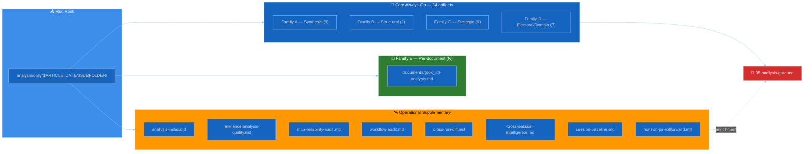

<!-- SPDX-FileCopyrightText: 2024-2026 Hack23 AB -->
<!-- SPDX-License-Identifier: Apache-2.0 -->

  

<h1 align="center">🗂️ Analysis Artifact Catalog — Riksdagsmonitor</h1>

  <strong>📊 Single Source of Truth for Every Markdown Artifact Produced by an Agentic News Workflow</strong> 
  <em>🎯 One row per artifact · Methodology + Template + Depth Floor + Mermaid Type + MCP Data Sources</em>

  
  
  
  

**📋 Document Owner:** CEO | **📄 Version:** 1.3 | **📅 Last Updated:** 2026-05-01 (UTC)
**🔄 Review Cycle:** Quarterly | **⏰ Next Review:** 2026-07-31
**🏢 Owner:** Hack23 AB (Org.nr 5595347807) | **🏷️ Classification:** Public

---

<!-- BEGIN AI-FIRST METHODOLOGY CARD -->

## 🎯 AI-FIRST Methodology Card

> **🚦 Read this card before writing a single paragraph.** It names the artifact this methodology owns, the gate check it satisfies, the evidence-density target it must hit, and the Pass-1 / Pass-2 discipline required by `.github/copilot-instructions.md` §5 (AI-FIRST Quality Principle).

| Field | Value |
|-------|-------|
| **Purpose** | Authoritative row-per-artifact catalog — every markdown artifact an agentic workflow can produce, with its family, methodology, template, depth floor, Mermaid type, and MCP data sources. |
| **Inputs** | `reference-quality-thresholds.json`; every Family methodology file; `analysis/templates/`; `.github/prompts/04-analysis-pipeline.md` |
| **Outputs** | _(reference catalog — no daily artifact)_ |
| **Owning artifact(s)** | _(documents all 23 always-on + Family E + supplementary)_ |
| **Owning gate check** | Check 1 (artifact existence) and Check 11 (supplementary) in `05-analysis-gate.md` |
| **Citation density target** | Every catalog row cites the methodology + template file path (no narrative density target) |
| **Banned phrases** | Enforced via [`political-style-guide.md` §Machine-readable banned-phrase list](political-style-guide.md#machine-readable-banned-phrase-list) |
| **Threshold source** | [`reference-quality-thresholds.json`](reference-quality-thresholds.json) → `thresholds[articleType][artifact]` (fallback `defaults.coreArtifactFloor`) |

### ✅ Pass-1 checklist (creation — minimal viable artifact)

- [ ] Confirm every artifact filename in the catalog exists in `analysis/templates/` (or is documented as agent-generated)
- [ ] Confirm every depth floor matches `reference-quality-thresholds.json`
- [ ] Produce every required sub-section listed in the owning template
- [ ] Add ≥ 1 evidence anchor (`dok_id`, vote id, named MP, or primary-source URL) per analytical claim
- [ ] Apply the correct WEP confidence band for the run's horizon (`72h / week / month / quarter / year / cycle`)
- [ ] Include ≥ 1 themed Mermaid diagram with `style …` or `themeVariables` config (where structurally meaningful)
- [ ] Cross-link the relevant template under `analysis/templates/` and the gate check it satisfies

### 🔁 Pass-2 checklist (read-back & improve — AI-FIRST mandatory)

- [ ] Cross-walk: every catalog row → existing methodology section → existing template file → gate-check coverage
- [ ] Reject any row where methodology, template, or threshold is missing or stale
- [ ] Re-read the file end-to-end; flag every claim that lacks an evidence anchor and add one
- [ ] Replace every banned phrase listed in [`political-style-guide.md` §Machine-readable banned-phrase list](political-style-guide.md#machine-readable-banned-phrase-list) with an evidence-anchored alternative
- [ ] Tighten WEP language: never above **likely** without ≥ 3 cycle-aged sources for `year`/`cycle` horizons
- [ ] Strengthen Mermaid (color-coded `style …` directives, `themeVariables`, ≥ 5 nodes where the structure admits it)
- [ ] Add ≥ 1 second-order effect, cui-bono note, or counterfactual where the artifact admits one
- [ ] Verify citation density meets the per-file target below and the gate's evidence-density rules

### 🟢 Exemplar (good — pattern-match this)

> _(catalog row)_ `synthesis-summary.md | Family A core | synthesis-methodology.md §3 | analysis/templates/intelligence-assessment.md | floor=205 (breaking) | Mermaid: flowchart | MCP: riksdag-regering, scb`

### 🔴 Anti-exemplar (failure mode — never ship this)

> _(failure mode)_ `synthesis | core | uses several methodologies | varies` — no filename, no methodology link, no threshold reference, no Mermaid type, no MCP source.

### 🔗 Cross-links

- **Template(s)**: Catalog rows reference every template under `analysis/templates/`
- **Gate check**: [`.github/prompts/05-analysis-gate.md`](../../.github/prompts/05-analysis-gate.md#checks-all-must-pass)
- **AI-FIRST canon**: [`.github/copilot-instructions.md` §5](../../.github/copilot-instructions.md) · [`ai-driven-analysis-guide.md`](ai-driven-analysis-guide.md)
- **Style canon**: [`political-style-guide.md`](political-style-guide.md) · [`osint-tradecraft-standards.md`](osint-tradecraft-standards.md)
- **Catalog row**: [`artifact-catalog.md`](artifact-catalog.md)

<!-- END AI-FIRST METHODOLOGY CARD -->

---

## 🎯 Purpose

This catalog is the **authoritative index** into every markdown artifact an agentic news workflow produces under `analysis/daily/$ARTICLE_DATE/$SUBFOLDER/`. For every artifact it names:

- the **family** (A / B / C / D / E) and whether it is a **core always-on** artifact or an **operational supplementary** enrichment,
- the **methodology** the AI agent applies when writing it,
- the **template** that defines output shape,
- the **minimum line floor** from [`reference-quality-thresholds.json`](reference-quality-thresholds.json),
- the **mandatory color-coded Mermaid diagram** type,
- the **`riksdag-regering` MCP tools** feeding it, and
- the **gate check** from [`.github/prompts/05-analysis-gate.md`](../../.github/prompts/05-analysis-gate.md) that enforces it.

Agents MUST read this catalog once at the start of every run, before opening any other methodology or template. It is referenced from [`ai-driven-analysis-guide.md`](ai-driven-analysis-guide.md#-output-matrix--every-file-every-family), [`.github/prompts/04-analysis-pipeline.md`](../../.github/prompts/04-analysis-pipeline.md) and [`.github/prompts/05-analysis-gate.md`](../../.github/prompts/05-analysis-gate.md).

---

## 🗺️ Artifact Group Overview

- **Core always-on (24)** — every run produces all 24, depth varies by tier (L1 / L2 / L2+ / L3) per the DIW Output Matrix. Missing any core artifact fails the gate.
- **Family E** — one per `dok_id` in the manifest; count is `N = |manifest|`. Low-weight items may be clustered.
- **Operational supplementary (8)** — enrichment artifacts that strengthen the AI-FIRST loop. They are **recommended** for `deep` and **mandatory** for `comprehensive` (Tier-C aggregation). They are not counted in the 24-artifact mandatory set but feed the self-correction, cross-run memory, and MCP health audit.

---

## 📘 Family A — Core Synthesis (9 artifacts · F3EAD: EXPLOIT → ANALYZE)

| # | Canonical filename | Methodology §link | Template | Line floor (breaking) | Mermaid | Primary MCP tool |
|:-:|--------------------|-------------------|----------|:---------------------:|---------|------------------|
| 1 | `README.md` | [`synthesis-methodology.md`](synthesis-methodology.md) | [`templates/README.md § Folder README`](../templates/README.md) | 40 | — | run-internal |
| 2 | `executive-brief.md` | [`synthesis-methodology.md`](synthesis-methodology.md#executive-brief) | [`executive-brief.md`](../templates/executive-brief.md) | 90 | flowchart | `search_dokument` + all |
| 3 | `synthesis-summary.md` | [`synthesis-methodology.md`](synthesis-methodology.md) | [`synthesis-summary.md`](../templates/synthesis-summary.md) | 205 | mindmap | `search_dokument` + all |
| 4 | `significance-scoring.md` | [`synthesis-methodology.md`](synthesis-methodology.md#-diw-weighting) | [`significance-scoring.md`](../templates/significance-scoring.md) | 150 | flowchart rank | `search_dokument`, `search_anforanden` |
| 5 | `classification-results.md` | [`political-classification-guide.md`](political-classification-guide.md) | [`political-classification.md`](../templates/political-classification.md) | 140 | flowchart | `get_dokument` |
| 6 | `swot-analysis.md` | [`political-swot-framework.md`](political-swot-framework.md) | [`swot-analysis.md`](../templates/swot-analysis.md) | 160 | quadrantChart | `get_voteringar`, `search_anforanden` |
| 7 | `risk-assessment.md` | [`political-risk-methodology.md`](political-risk-methodology.md) | [`risk-assessment.md`](../templates/risk-assessment.md) | 180 | flowchart L×I | `search_dokument`, `get_betankanden` |
| 8 | `threat-analysis.md` | [`political-threat-framework.md`](political-threat-framework.md) | [`threat-analysis.md`](../templates/threat-analysis.md) | 180 | attack-tree | `search_anforanden`, `get_voteringar` |
| 9 | `stakeholder-perspectives.md` | [`synthesis-methodology.md`](synthesis-methodology.md#stakeholder-lenses) | [`stakeholder-impact.md`](../templates/stakeholder-impact.md) | 220 | graph TB | `search_ledamoter`, `get_ledamot` |

**Filename variant** — canonical `stakeholder-perspectives.md` ← template `stakeholder-impact.md`; canonical `classification-results.md` ← template `political-classification.md`.

---

## 📗 Family B — Structural Metadata (2 artifacts)

| # | Canonical filename | Methodology §link | Template | Line floor | Mermaid | Primary source |
|:-:|--------------------|-------------------|----------|:---------:|---------|----------------|
| 10 | `data-download-manifest.md` | [`structural-metadata-methodology.md`](structural-metadata-methodology.md) | [`data-download-manifest.md`](../templates/data-download-manifest.md) | 60 | pie / bar | scripts in `03-data-download.md` |
| 11 | `cross-reference-map.md` | [`structural-metadata-methodology.md`](structural-metadata-methodology.md#tier-c-extensions) | [`cross-reference-map.md`](../templates/cross-reference-map.md) | 110 | graph LR | sibling folders under `$ARTICLE_DATE` |

Family B is scaffolded by scripts (no analytical prose) — agents only annotate confidence and data-depth tags.

---

## 📙 Family C — Strategic Extensions (6 artifacts · F3EAD: ANALYZE continued)

| # | Canonical filename | Methodology §link | Template | Line floor | Mermaid | Primary MCP tool |
|:-:|--------------------|-------------------|----------|:---------:|---------|------------------|
| 12 | `scenario-analysis.md` | [`strategic-extensions-methodology.md`](strategic-extensions-methodology.md#scenarios) | [`scenario-analysis.md`](../templates/scenario-analysis.md) | 180 | flowchart + prob | `search_voteringar`, `search_dokument`. Horizon-stratified branches required when `horizonDays >= 90` |
| 13 | `comparative-international.md` | [`strategic-extensions-methodology.md`](strategic-extensions-methodology.md#comparative) | [`comparative-international.md`](../templates/comparative-international.md) | 150 | graph LR Nordic/EU | world-bank, scb, IMF |
| 14 | `devils-advocate.md` | [`strategic-extensions-methodology.md`](strategic-extensions-methodology.md#ach) | [`devils-advocate.md`](../templates/devils-advocate.md) | 160 | matrix (ACH) | cross-MCP |
| 15 | `intelligence-assessment.md` | [`strategic-extensions-methodology.md`](strategic-extensions-methodology.md#key-judgments) | [`intelligence-assessment.md`](../templates/intelligence-assessment.md) | 160 | flowchart KJs | synthesis layer |
| 16 ⭐ | `methodology-reflection.md` | [`osint-tradecraft-standards.md`](osint-tradecraft-standards.md#self-audit) | [`methodology-reflection.md`](../templates/methodology-reflection.md) | 200 | flowchart audit | run-internal |
| 17 | `parliamentary-season.md` | [`per-artifact-methodologies.md#parliamentary-season`](per-artifact-methodologies.md#parliamentary-season) | [`parliamentary-season.md`](../templates/parliamentary-season.md) | 160 | gantt calendar | `get_calendar_events`, `get_propositioner`. Quarter-ahead + year-ahead + election-cycle only |

⭐ `methodology-reflection.md` is the **self-audit gate**: evidence sufficiency, confidence distribution, source diversity, party-neutrality arithmetic, ICD 203 compliance, ≥ 3 concrete improvements for next run.

---

## 📕 Family D — Electoral & Domain Lenses (7 artifacts + 1 cycle-only)

| # | Canonical filename | Methodology §link | Template | Line floor | Mermaid | Primary MCP tool |
|:-:|--------------------|-------------------|----------|:---------:|---------|------------------|
| 18 | `election-2026-analysis.md` | [`electoral-domain-methodology.md`](electoral-domain-methodology.md#election-2026) | [`election-2026-analysis.md`](../templates/election-2026-analysis.md) | 150 | bar + coalition | `search_voteringar`, SCB polls |
| 19 | `voter-segmentation.md` | [`electoral-domain-methodology.md`](electoral-domain-methodology.md#segmentation) | [`voter-segmentation.md`](../templates/voter-segmentation.md) | 140 | graph TB segments | SCB demographics |
| 20 | `coalition-mathematics.md` | [`electoral-domain-methodology.md`](electoral-domain-methodology.md#sainte-lague) | [`coalition-mathematics.md`](../templates/coalition-mathematics.md) | 135 | flowchart seats | `search_voteringar` |
| 21 | `historical-parallels.md` | [`electoral-domain-methodology.md`](electoral-domain-methodology.md#precedents) | [`historical-parallels.md`](../templates/historical-parallels.md) | 130 | timeline | historical archive |
| 22 | `media-framing-analysis.md` | [`electoral-domain-methodology.md`](electoral-domain-methodology.md#-part-5--media-framing--influence-operations-analysis-media-framing-analysismd) | [`media-framing-analysis.md`](../templates/media-framing-analysis.md) | 200 | frame graph + laundering chain + lifecycle xychart + Outlet Bias Audit (5-axis) + Global Audience Orientation | external press (OSINT) + Outlet Bias Audit (Nordicom / Reuters Institute / Förvaltningsstiftelsen / PO-PON / EUvsDisinfo / DISARM TTPs) + international quality press + state-affiliated amplification monitoring |
| 23 | `implementation-feasibility.md` | [`electoral-domain-methodology.md`](electoral-domain-methodology.md#delivery) | [`implementation-feasibility.md`](../templates/implementation-feasibility.md) | 140 | flowchart risk | `search_dokument` (myndigheter) |
| 24 | `forward-indicators.md` | [`electoral-domain-methodology.md`](electoral-domain-methodology.md#indicators) | [`forward-indicators.md`](../templates/forward-indicators.md) | 150 | gantt 4-horizon | mixed. Horizon-band column required when `horizonDays >= 90` |
| 25 🗳️ | `cycle-trajectory.md` | [`per-artifact-methodologies.md#cycle-trajectory`](per-artifact-methodologies.md#cycle-trajectory) | [`cycle-trajectory.md`](../templates/cycle-trajectory.md) | 180 | bar + timeline | SCB, IMF, `search_voteringar`. `election-cycle` only; blocking for cycle workflows |

**Filename variants** — `historical-parallels.md` ↔ `historical-baseline.md`; `comparative-international.md` ↔ `international-comparative.md`; `election-2026-analysis.md` ↔ `election-2026-implications.md`. All map to a single template + methodology section per [`ai-driven-analysis-guide.md` §Filename variants](ai-driven-analysis-guide.md#-filename-variants-all-map-to-one-template--one-methodology-section). Artifact filenames are the canonical identifiers; ordinal numbers in this catalog are catalog-local only and must not be hardcoded in template or prose text. Refer to `cycle-trajectory.md` by filename rather than by phrases such as "24th artifact." `cycle-trajectory.md` is produced **only** by `election-cycle` workflows.

---

## 📒 Family E — Per-Document (N artifacts)

One file per `dok_id` in `data-download-manifest.md`, written under `documents/{dok_id}-analysis.md` using [`per-file-political-intelligence.md`](../templates/per-file-political-intelligence.md) at the depth tier matching the document's DIW score (L1 Surface / L2 Strategic / L2+ Priority / L3 Intelligence-grade).

- Cluster files — `{cluster}-cluster-analysis.md` collapse related low-weight items (e.g. 12 procedural committee notices → one cluster analysis).
- Methodology: [`per-document-methodology.md`](per-document-methodology.md).
- Per-file floor is adaptive: `max(DIW tier floor, --min-lines)`. See [`reference-quality-thresholds.json`](reference-quality-thresholds.json) §`defaults.perDocumentFloorByTier`.

---

## 🛰️ Operational Supplementary Artifacts (8)

These artifacts **are not counted in the 24-artifact mandatory set** but strengthen quality, cross-run memory, MCP health and workflow-self-audit. They are:

- **Recommended** for every `deep` run.
- **Mandatory** for every `comprehensive` (Tier-C aggregation) run.
- Enforced by [`05-analysis-gate.md` §Supplementary checks](../../.github/prompts/05-analysis-gate.md#supplementary-checks) when present; for non-Tier-C runs, absence generally does **not** fail the gate.
- **Exception:** `S5` / `cross-run-diff.md` becomes gate-required whenever `ANALYSIS_RUN_COUNT >= 2` (same article type), including `standard` and `deep` runs — the gate treats multi-run comparison as a required supplementary check independent of tier.

| # | Canonical filename | Methodology §link | Template | Line floor | Purpose |
|:-:|--------------------|-------------------|----------|:---------:|---------|
| S1 | `analysis-index.md` | [`per-artifact-methodologies.md#analysis-index`](per-artifact-methodologies.md#analysis-index) | [`analysis-index.md`](../templates/analysis-index.md) | 120 | Read-me-first index naming every artifact in the run + recommended reading order |
| S2 | `reference-analysis-quality.md` | [`per-artifact-methodologies.md#reference-analysis-quality`](per-artifact-methodologies.md#reference-analysis-quality) | [`reference-analysis-quality.md`](../templates/reference-analysis-quality.md) | 120 | Per-run self-score vs reference benchmark; Pass-2 action list |
| S3 | `mcp-reliability-audit.md` | [`per-artifact-methodologies.md#mcp-reliability-audit`](per-artifact-methodologies.md#mcp-reliability-audit) | [`mcp-reliability-audit.md`](../templates/mcp-reliability-audit.md) | 150 | Endpoint-by-endpoint `riksdag-regering` / `scb` / `world-bank` / IMF health record |
| S4 | `workflow-audit.md` | [`per-artifact-methodologies.md#workflow-audit`](per-artifact-methodologies.md#workflow-audit) | [`workflow-audit.md`](../templates/workflow-audit.md) | 120 | Prompt-module-by-module self-audit: which phases ran, where rules slipped |
| S5 | `cross-run-diff.md` | [`per-artifact-methodologies.md#cross-run-diff`](per-artifact-methodologies.md#cross-run-diff) | [`cross-run-diff.md`](../templates/cross-run-diff.md) | 130 | Bayesian delta vs previous run of **same** article type |
| S6 | `cross-session-intelligence.md` | [`per-artifact-methodologies.md#cross-session-intelligence`](per-artifact-methodologies.md#cross-session-intelligence) | [`cross-session-intelligence.md`](../templates/cross-session-intelligence.md) | 140 | Session-over-session progression (week / month / quarter aggregation) |
| S7 | `session-baseline.md` | [`per-artifact-methodologies.md#session-baseline`](per-artifact-methodologies.md#session-baseline) | [`session-baseline.md`](../templates/session-baseline.md) | 140 | Calendar + adopted-texts + votering roster for the period |
| S8 | `horizon-pir-rollforward.md` | [`per-artifact-methodologies.md#horizon-pir-rollforward`](per-artifact-methodologies.md#horizon-pir-rollforward) | [`horizon-pir-rollforward.md`](../templates/horizon-pir-rollforward.md) | 100 | PIR genealogy across long-horizon runs. Never blocking; recommended when predecessor exists |

---

## 🔭 Analytical Supplementary Artifacts (4)

Optional deep-dive templates mapped to analytical frameworks explicitly listed in the intelligence-operative agent's Core Expertise but previously untemplated. **Never replace** a core artifact and **never blocking** in `05-analysis-gate.md`. Full production rules: [`analytical-supplementary-methodology.md`](analytical-supplementary-methodology.md).

| # | Canonical filename | Methodology §link | Template | Line floor (standard / deep / comp) | Trigger |
|:-:|--------------------|-------------------|----------|:----------------------------------:|---------|
| AS1 | `pestle-analysis.md` | [`analytical-supplementary-methodology.md#pestle`](analytical-supplementary-methodology.md#pestle) | [`pestle-analysis.md`](../templates/pestle-analysis.md) | 100 / 150 / 220 | event crosses ≥ 2 PESTLE dimensions |
| AS2 | `political-stride-assessment.md` | [`analytical-supplementary-methodology.md#stride-political`](analytical-supplementary-methodology.md#stride-political) | [`political-stride-assessment.md`](../templates/political-stride-assessment.md) | 110 / 160 / 240 | election-adjacent · integrity incident · disinfo spike · critical-infra vote |
| AS3 | `wildcards-blackswans.md` | [`analytical-supplementary-methodology.md#wildcards--black-swans`](analytical-supplementary-methodology.md#wildcards--black-swans) | [`wildcards-blackswans.md`](../templates/wildcards-blackswans.md) | 110 / 160 / 240 | long-horizon forecasting (`monthly-review`, election-year aggregation) |
| AS4 | `quantitative-swot.md` | [`analytical-supplementary-methodology.md#quantitative-swot`](analytical-supplementary-methodology.md#quantitative-swot) | [`quantitative-swot.md`](../templates/quantitative-swot.md) | 110 / 160 / 240 | decision memo requiring scored ranking |

---

## 🧠 MCP Data Source Inventory

| Server | Transport | Key tools | Feeds artifacts |
|--------|-----------|-----------|-----------------|
| `riksdag-regering` | HTTP | `search_ledamoter`, `get_ledamot`, `search_dokument`, `get_dokument`, `search_anforanden`, `search_voteringar`, `get_voteringar`, `get_calendar_events`, `get_betankanden`, `get_propositioner`, `get_motioner`, `get_fragor`, `get_interpellationer` | 1–11, 14, 17–25, E-files |
| `scb` | local PxWeb v2 | table-search + query | 13, 18–20, 23, 25, S7 |
| `world-bank` | local | get-social/health/education/environment | 13, 23, S7 |
| Statskontoret (`web_fetch`) | public web | agency-capacity reports, public-management evaluations, administrative burden evidence | 7, 9, 13, 22, S1/S3/S7 |
| IMF (`tsx scripts/imf-fetch.ts`) | CLI | WEO + SDMX 3.0 passthrough | 13, 18, 23, 25, S7 |
| `github` | HTTP Insiders | full toolset | PR creation (module 07) |
| `filesystem` / `memory` / `sequential-thinking` / `playwright` | local | helpers | cross-cutting |

See [`.github/copilot-mcp.json`](../../.github/copilot-mcp.json) for the canonical definition and [`02-mcp-access.md`](../../.github/prompts/02-mcp-access.md) for access rules.

---

## 🚦 Gate-Check Mapping (conceptual — see `05-analysis-gate.md` for canonical numbering)

> **Note:** The table below is a conceptual mapping of gate concerns to artifact scope. The authoritative check numbering and semantics live in [`.github/prompts/05-analysis-gate.md`](../../.github/prompts/05-analysis-gate.md); the numbers here are illustrative groupings, not 1:1 references to the script's `# Check N` labels.

| Gate concern | Artifacts audited |
|--------------|-------------------|
| Artifact presence | 1–24 (+ 25 for `election-cycle`) |
| Family-E per-`dok_id` coverage | E files |
| No-stub / depth floor per tier | 1–24 (+ 25 for `election-cycle`) + E (via `reference-quality-thresholds.json`) |
| Evidence citations (dok_id, vote counts, named actors, Admiralty grade) | All prose |
| Mermaid diagram presence (color-coded) | 1–24 (+ 25 for `election-cycle`) where row specifies Mermaid |
| Pass-2 evidence (mtime / diff) | Core prose files |
| Family C structure | 12–16 (KJ count, comparator rows, etc.) |
| Family D structure | 18–25 where applicable |
| PIR status sidecar | `pir-status.json` |
| Supplementary (Tier-C only) | S1–S8 |
| Long-horizon additive (quarter/year/cycle) | LH checks per `ext/long-horizon-forecasting.md` |

---

## 🔄 Maintenance

- When an artifact is **added, renamed, or removed**, update: this catalog, [`reference-quality-thresholds.json`](reference-quality-thresholds.json), [`per-artifact-methodologies.md`](per-artifact-methodologies.md), the template README, and [`.github/prompts/04-analysis-pipeline.md`](../../.github/prompts/04-analysis-pipeline.md). All five must stay in lock-step.
- When a **methodology section** materially changes, increment the methodology's minor version and note it here under "Changelog".
- The **depth floor benchmark** is re-calibrated every quarter from the best-performing production run of the preceding quarter (the "reference run"). See [`reference-quality-thresholds.json` §referenceBenchmark`](reference-quality-thresholds.json).

## 📜 Changelog

- **v1.3 (2026-05-01)** — Added `cycle-trajectory.md` (Family D #25, `election-cycle` only, blocking), `parliamentary-season.md` (Family C #17, quarter/year/cycle), `horizon-pir-rollforward.md` (S8, never blocking). Appended horizon-band notes to `forward-indicators.md` and `scenario-analysis.md` rows. Renumbered Family D artifacts 17→18 through 23→24. Updated core count 23→24 (25 for cycle workflows).
- **v1.1 (2026-04-23)** — Added Analytical Supplementary Artifacts (4): `pestle-analysis.md`, `political-stride-assessment.md`, `wildcards-blackswans.md`, `quantitative-swot.md`. Linked to new [`analytical-supplementary-methodology.md`](analytical-supplementary-methodology.md). Non-blocking.
- **v1.0 (2026-04-23)** — Initial Riksdagsmonitor catalog extracted and adapted from EU Parliament Monitor `artifact-catalog.md` v1.0. 23 core artifacts + 7 supplementary + N per-document; aligned with [`ai-driven-analysis-guide.md`](ai-driven-analysis-guide.md) v4.2.
