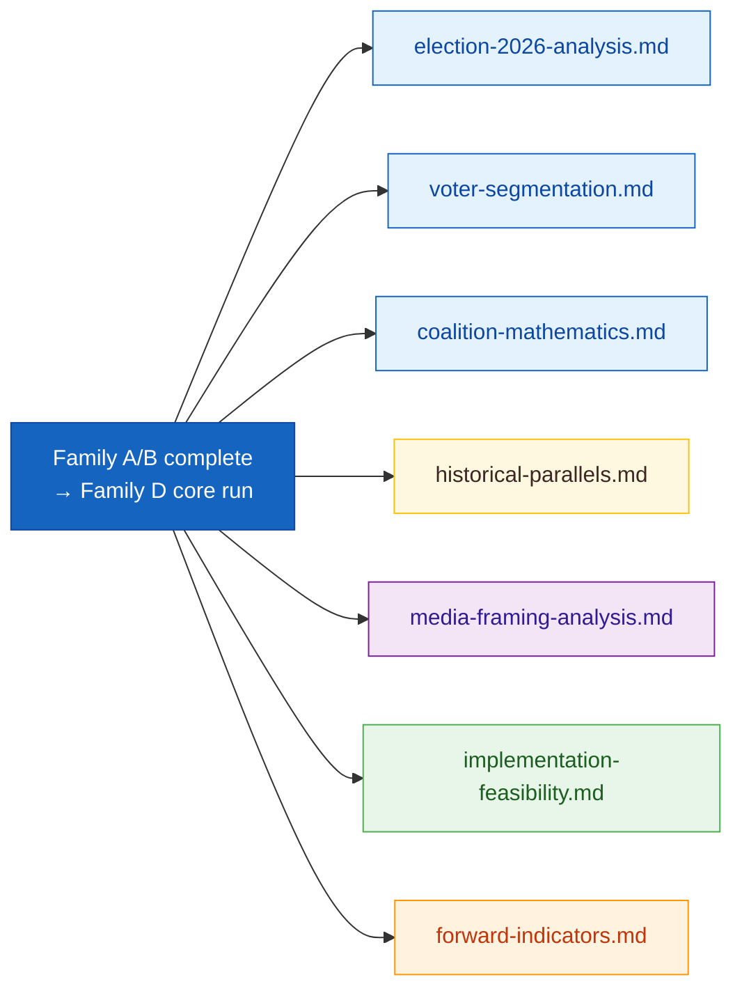
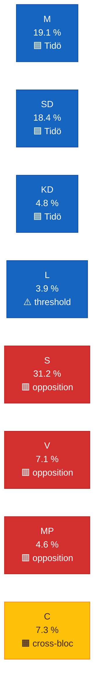
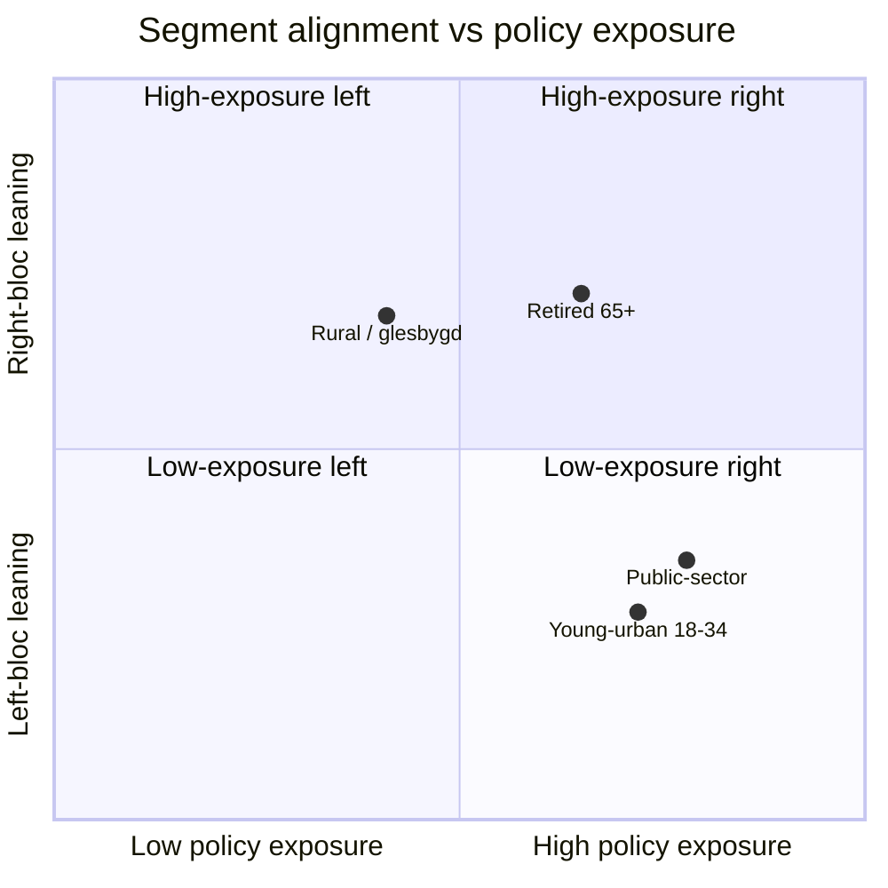
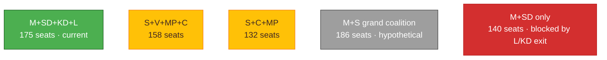
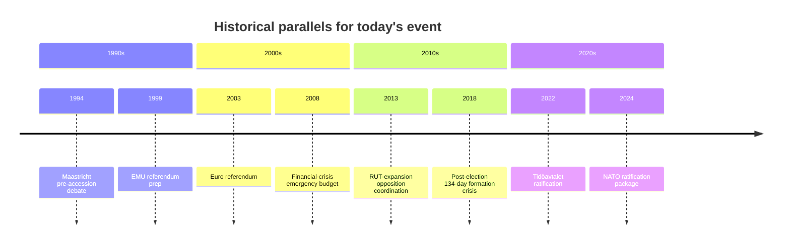
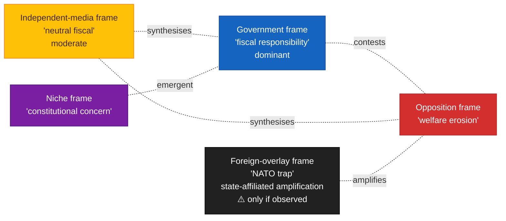
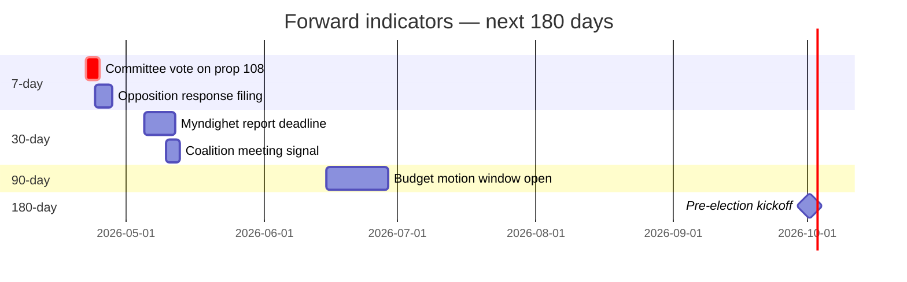
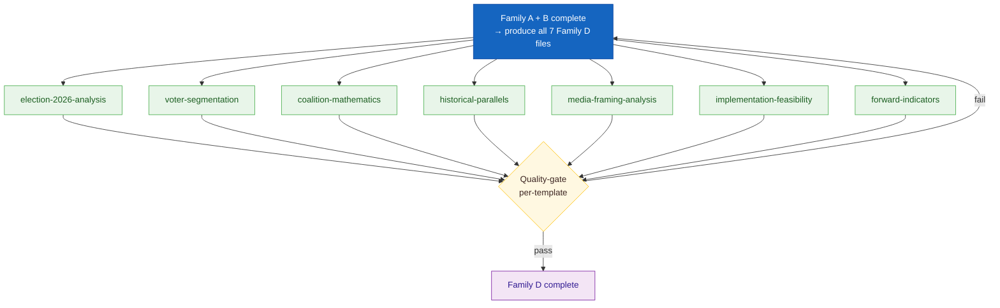

  

<h1 align="center">📕 Electoral & Domain Methodology</h1>

  <strong>📊 Family D — Lens-Specific Analytical Depth</strong> 
  <em>🎯 Election 2026 · Voter Segmentation · Coalition Mathematics · Historical Parallels · Media Framing · Implementation Feasibility · Forward Indicators</em>

  
  
  
  

**📋 Document Owner:** CEO | **📄 Version:** 1.3 | **📅 Last Updated:** 2026-04-25 (UTC)
**🔄 Review Cycle:** Quarterly | **⏰ Next Review:** 2026-07-21
**🏢 Owner:** Hack23 AB (Org.nr 5595347807) | **🏷️ Classification:** Public

---

## 🔄 Tradecraft Anchors

| Element | Value | Reference |
|---------|-------|-----------|
| **F3EAD Stage** | **ANALYZE → DISSEMINATE** | This methodology applies domain lenses (electoral, historical, media, implementation, forward-watch) to enrich intelligence products |
| **PIRs Served** | election-2026.md serves PIR-6 (Election Integrity); coalition-mathematics.md serves PIR-1 (Coalition Stability); implementation-feasibility.md serves PIR-5 (Fiscal Trajectory), PIR-7 (Democratic Norms) | See [`political-style-guide.md` §PIR/EEI Catalog](political-style-guide.md#-priority-intelligence-requirements-pir--essential-elements-of-information-eei) |
| **Admiralty Floor** | Polling data requires ≥[B2] (named pollster, date, sample); historical parallels require ≥[A1] (official records from Riksdag archive) | See [`political-style-guide.md` §Admiralty Code](political-style-guide.md#-admiralty-source-reliability-code-nato-stanag-2022) |
| **WEP Requirement** | election-2026.md seat projections with WEP probability; forward-indicators.md triggers with WEP likelihood; scenario probabilities must sum to 100% | See [`political-style-guide.md` §WEP + ODNI](political-style-guide.md#-words-of-estimative-probability-wep--odni-confidence-overlay) |
| **ICD 203 Gate** | Standard 5 (customer relevance — forward indicators), 6 (logical argumentation — coalition mathematics), 9 (visual information — all files) | See [`political-style-guide.md` §ICD 203](political-style-guide.md#-icd-203-analytic-tradecraft-standards-mapping) |
| **SAT(s)** | Morphological (election-2026, coalition-mathematics); Outside-In Thinking (historical-parallels, voter-segmentation, media-framing); Premortem Analysis (implementation-feasibility); Indicators and Signposts (forward-indicators) | See [`political-style-guide.md` §SATs](political-style-guide.md#-structured-analytic-techniques-sats-catalog) |

---

## 🎯 Purpose

Family D supplies **issue-specific analytical lenses** that sharpen every workflow across electoral cycles, voter segments, coalition arithmetic, historical echoes, the media environment, delivery questions, and forward watch-lists.

These products are **core — every run produces all 7**. The output set is stable across morning, evening, realtime, weekly, and monthly workflows. What adapts per run is item-level depth (tier L1 → L3) and the substance inside each file — not whether the file exists.

### Core — every run produces all 7

| Template | Behaviour on a light-event day | Behaviour on a P0-dense day |
|----------|-------------------------------|-----------------------------|
| `election-2026-analysis.md` | Seat-projection delta vs. last poll + which parties crossed the 4 % threshold; until 2026-09 it tracks the campaign; post-2026 it tracks the new government-formation context | Full seat projection + coalition viability + campaign-phase alignment of every P0 to the election cycle |
| `voter-segmentation.md` | Baseline segment positions (5 axes: age, geography, education, income, incumbency) | Per-document segment impact table with ≥5 cohorts and quantified swing estimates |
| `coalition-mathematics.md` | Current seat map + pivotal-vote reference + confidence-vote arithmetic | Scenario branching: each contested vote run through Sainte-Laguë, pivotal-actor detection, SD-Tidöbloc-opposition matrix |
| `historical-parallels.md` (variant: `historical-baseline.md`) | Closest baseline precedent ≤ 40 years with similarity score, or explicit "no-precedent" finding | Full parallel with outcome, stakeholder behaviour, and Bayesian base-rate update |
| `media-framing-analysis.md` | Per-party + per-press-quadrant framing of the day's lead story, plus longitudinal-frame delta | Per-document frame audit with quoted examples and platform-by-platform amplification scores |
| `implementation-feasibility.md` | Audit of in-flight delivery backlog (IT, budget, regulatory, workforce) when no new bill lands | Full RACI + milestone + risk-register for each new delivery obligation |
| `forward-indicators.md` | ≥10 indicators across 4 horizons (72 h / week / month / election) refreshed every run | Indicators + thresholds + trigger-to-hypothesis mapping for every P0/P1 |

---

## 🗳️ Part 1 — Election 2026 Analysis (`election-2026-analysis.md`)

**Filename variant:** `election-2026-implications.md` — identical structure.

### Purpose
Translate today's policy activity into **electoral consequences** for the September 2026 Riksdag vote: seat trajectories, bloc viability, mandate strength, and pre-election narrative positioning.

### Input
- synthesis-summary.md (current events)
- Opinion polling (SIFO, Novus, Demoskop, Sentio) — use only published, dated figures
- 2018 + 2022 election results (for baseline trajectory)
- Seat-allocation rules (Sainte-Laguë modified + 4 % threshold + 12 % regional)

### Output — required structure

1. **Bloc standing table** — for Tidöavtalet (M, KD, L, SD) vs Opposition (S, V, MP, C) vs cross-bloc:
   - Current poll average · 30-day change · 90-day change · Last election
2. **Seat-projection table** — per party, showing polling-average seat translation with 4 % threshold risk flag
3. **Threshold-risk watch** — any party within ±1.0 pp of 4 %
4. **Narrative positioning** — how today's event helps / hurts each party's election narrative
5. **Mobilisation implications** — turnout implications (young-voter, first-time, non-voter)
6. **Seat-projection Mermaid** — color-coded bar by party
7. **Bloc-standing Mermaid** — color-coded stacked bar

### Required Mermaid — bloc standing

### Quality gate
- [ ] All 8 parties covered
- [ ] Threshold risk explicit for any party <5 %
- [ ] Polling averages cite ≥2 pollsters with dates
- [ ] Seat math uses Sainte-Laguë modified
- [ ] Narrative-positioning section neutral (equal depth across parties)

---

## 👥 Part 2 — Voter Segmentation (`voter-segmentation.md`)

### Purpose
Identify which **voter segments** are materially affected by today's events and how each segment's pre-existing political alignment interacts with the new signal.

### Input
- SCB demographic microdata (age × region × income × education × sector)
- Polling cross-tabs (published segment-level data only)
- Prior election turnout + vote-by-segment data (SCB Statistiska Meddelanden)

### Output — required structure

1. **Segment panel** — for each of: Young-urban (18–34, storstad), Mid-career family (35–54), Retired (65+), Rural / glesbygd, High-income (top quintile), Low-income (bottom quintile), Secondary-sector workers, Public-sector workers:
   - Current political alignment · Policy exposure to today's events · Likely response
2. **Segment-issue Mermaid** — color-coded quadrant (alignment × exposure)
3. **Mobilisation index** — which segments are most "move-able" given the current evidence
4. **Disaggregation notes** — where SCB data permits further cuts (e.g. foreign-born, women 35–44, etc.)

### Required Mermaid — segment quadrant

### Quality gate
- [ ] ≥8 segments covered
- [ ] Every segment has SCB-cited demographic magnitude
- [ ] Segment-issue quadrant includes all covered segments
- [ ] Mobilisation index explains movability with evidence
- [ ] Privacy rule: no segment drawn to <1000 persons to avoid re-identification

#### Segment privacy threshold — rationale (binding)

The **<1000 persons** threshold is not a stylistic preference; it is a derived control rooted in three converging concerns:

1. **GDPR Article 4(1) re-identification risk.** SCB-published microdata is anonymised at the *aggregate* level. A segment drawn to fewer than ~1000 persons in a country of 10.5M can become indirectly re-identifying when crossed with a second variable (e.g., "rural drivers in Norrbotten under 35 with K-bil sport") — the cross-tabulation can collapse to a handful of households. The Article 29 Working Party Opinion 05/2014 on Anonymisation Techniques names *singling-out*, *linkability*, and *inference* as the three risks; sub-1000 micro-cells defeat all three. SCB's own micro-data publication policy follows a related minimum-cell-size principle.
2. **Statistical confidence.** For a binary outcome (e.g., "voted SD") the 95 % CI half-width at p = 0.5, n = 1000 is ±3.1 pp; at n = 500 it widens to ±4.4 pp; at n = 100 to ±9.8 pp. Below n = 1000 the segment delta is generally **smaller than the confidence interval**, meaning the analysis cannot distinguish signal from sampling noise. Reporting such a segment as a quantitative finding is innumerate.
3. **Editorial avoidance of small-group stigmatisation.** Segments drawn small enough to be re-identifiable are also drawn small enough to invite the editorial sin of using a single named individual as a stand-in for the whole group. The 1000-person floor enforces narrative restraint — talk about "rural Norrbotten residents under 35" not "Karin from Boden, 28."

**Implementation rule:** when SCB cross-tabs collapse below 1000, **collapse one axis** (e.g., merge two adjacent age bands or two neighbouring counties) until the cell count clears 1000. Document the collapse in the segment definition; never report the sub-1000 cell. If the collapsed segment is still analytically interesting at n ≥ 1000, use it; if not, drop it from the analysis.

---

## 🧮 Part 3 — Coalition Mathematics (`coalition-mathematics.md`)

### Purpose
Compute the **arithmetic of government formation, confidence, and policy coalition** — which combinations clear 175 seats, which survive a misstatement of confidence, and which emerge as issue-specific coalitions for today's vote.

### Input
- Latest Riksdag seat distribution (349 seats)
- Current government composition
- Party-platform compatibility matrix (based on voting history from `search_voteringar`)
- Today's vote results when applicable

### Output — required structure

1. **Seat-count table** — per party, current seats
2. **Majority viability matrix** — all plausible 3–5 party coalitions with seat totals, tolerance to loss of 1 party, ideological coherence score
3. **Confidence arithmetic** — who can block a confidence vote, who can trigger it
4. **Issue-specific coalitions** — for today's top 3 items, which coalition actually materialised (from voting data)
5. **Cohesion indicators** — party vote-split percentages on today's items
6. **Coalition-viability Mermaid** — color-coded by viability status

### Required Mermaid — coalition viability

### Quality gate
- [ ] All coalitions summed to exact seat counts
- [ ] Tolerance-to-defection column filled per coalition
- [ ] Issue-specific coalitions cite `dok_id` and vote counts from `search_voteringar`

### Worked example — Sainte-Laguë modified seat allocation

Sweden uses the **modified Sainte-Laguë method** with a **4 % national threshold** and a **12 % regional threshold** (a party scoring under 4 % nationally still gets seats from a constituency where it exceeds 12 %). The first divisor for any party is **1.4** (the modification), then 3, 5, 7, 9, … The seat goes to the party with the highest quotient at each round.

Worked example using a hypothetical 11-seat constituency (Stockholm county, simplified to illustrate the algorithm):

| Party | Votes | ÷1.4 (seat 1) | ÷3 (after 1) | ÷5 (after 2) | ÷7 | ÷9 | ÷11 | Final seats |
|-------|------:|--------------:|-------------:|-------------:|---:|---:|----:|:----------:|
| S  | 90 000 | **64 286** | 30 000 | 18 000 | 12 857 | 10 000 | 8 182 | 4 |
| M  | 75 000 | **53 571** | 25 000 | 15 000 | 10 714 | — | — | 3 |
| SD | 55 000 | **39 286** | 18 333 | 11 000 | — | — | — | 2 |
| V  | 30 000 | 21 429 | 10 000 | — | — | — | — | 1 |
| MP | 12 000 | 8 571  | — | — | — | — | — | 1 |
| L  |  9 000 | 6 429  | — | — | — | — | — | 0 — under 4 %, no regional override |

**Algorithm walk-through:** Round 1: highest quotient (S ÷ 1.4 = 64 286) → S gets seat 1. Round 2: re-divide S by 3 (= 30 000); highest of all current quotients is M ÷ 1.4 = 53 571 → M gets seat 2. Round 3: re-divide M by 3; SD ÷ 1.4 = 39 286 wins → SD gets seat 3. Continue until all 11 seats are awarded.

**Key gotchas the AI must respect:**
1. **The 1.4 modifier replaces the first division for every party** — not 1.0, not 0.7. Using straight Sainte-Laguë (3-5-7-…) inflates small-party seat counts and is wrong.
2. **Threshold check happens before allocation:** parties under 4 % nationally are excluded from the divisor table unless they cleared 12 % in this specific constituency.
3. **Tied quotients** are broken by total vote count (higher wins); document the tie-break rule used in the analysis.
4. **Constituency seats vs. levelling seats (utjämningsmandat) are separate phases.** Sweden has 310 fixed constituency seats + 39 levelling seats. The first phase distributes 310 by constituency-level Sainte-Laguë; the second phase reassigns 39 to make the national distribution proportional. Always state which phase is being modelled.
5. **Sources:** seat counts from `search_voteringar` and Valmyndigheten election archives; vote totals from SCB / Valmyndigheten primary CSVs (never approximated).

A coalition-mathematics file that asserts a seat outcome without showing the Sainte-Laguë computation **fails the gate**; copy this table form (or link to a calculator script's output) and adapt the numbers.

### Quality gate (continued)
- [ ] Cohesion indicators include numeric vote-split percentages
- [ ] Hypothetical coalitions clearly labelled

---

## 📜 Part 4 — Historical Parallels (`historical-parallels.md`)

**Filename variant:** `historical-baseline.md` — identical structure.

### Purpose
Locate today's event within a **named prior episode** (≤40 years back) and learn from what happened next last time.

### Input
- Riksdag archive (`search_dokument` with historical `rm` parameters)
- SOU (Statens offentliga utredningar) archive
- Statskontoret reports when historical implementation, public-management or agency-capacity lessons are relevant
- Academic political-history references where applicable

### Output — required structure

1. **Prior-episode cards** — ≥3 named parallels; per card:
   - Name + date · Actors · Policy domain · Outcome · Duration · Source
   - Similarity score (1–10) with justification
   - Difference callouts — what is not analogous
2. **Timeline Mermaid** — color-coded timeline of prior episodes
3. **Lesson-extraction table** — which lessons transfer, which do not
4. **Base-rate note** — based on prior parallels, prior probability of each scenario outcome

### Required Mermaid — timeline

### Quality gate
- [ ] ≥3 named parallels with dates and sources
- [ ] Similarity score present with justification
- [ ] Difference callouts explicit (not every lesson transfers)
- [ ] Base-rate note quantifies prior-probability observation
- [ ] Timeline Mermaid covers full spread

---

## 📢 Part 5 — Media Framing & Influence-Operations Analysis (`media-framing-analysis.md`)

### Purpose
Document the **frames** being used by each actor and major media outlet, **and the manipulation / influence-operations layer riding on top of them**, so readers can separate substantive content from strategic communication and from coordinated inauthentic behaviour. v2.0 (2026-05-01) extends the v1.x frame inventory with psyops, comparative-international lineage, frame lifecycle / longevity, RRPA impact conversion, and an L1–L5 counter-resilience ladder.

### Input
- Riksdag MCP: `search_anforanden`, `search_dokument`, `get_dokument` (named-MP frame language; longitudinal frame record).
- Swedish public press: DN, SvD, Aftonbladet, Expressen, SVT, SR, TV4, Dagens ETC, Kvartal, Nyheter Idag, Samhällsnytt, Riks, regional press sample.
- International quality press for frame lineage: Reuters / AP / DPA / AFP / Politico EU / FT / NYT / Le Monde / Der Spiegel / Helsingin Sanomat / Aftenposten / Berlingske.
- State-affiliated outlets — RT/Sputnik/RIA/TASS/CGTN/PressTV — used **only** as amplification fingerprint, never as factual source.
- Public CIB / disinformation dossiers: EUvsDisinfo, EU DisinfoLab, Meta CIB removal reports, NATO StratCom COE, GLOBSEC Vulnerability Index, Reuters Institute Digital News Report, Freedom House Nations in Transit, SÄPO/MUST/FRA/EU-EEAS public statements.
- Ownership / funding data: Nordicom Media Ownership Database (gu.se), Allmänhetens Pressombudsman public registry.

### Output — required structure (v2.0)

1. **Frame package inventory** — ≥ 3 frames (A government / B opposition / C analytical / D coalition-inside; **Frame E foreign-overlay** ONLY when a state-affiliated or coordinated foreign-amplification signal is observed in window). Per frame: name · carrier (actor / outlet) · keyword markers · first-use date · approximate share of coverage.
2. **Entman functions per frame** — problem definition · causal attribution · moral evaluation · treatment recommendation; every cell traces to a dated quote / `dok_id` / anförande.
3. **Cognitive vulnerability map** — bias exploited (Cialdini / Kahneman / Roozenbeek-van der Linden) · mechanism · inoculation lever; primary-literature citation per row.
4. **Manipulation indicators (DISARM)** — verbatim `T####` codes (Flooding T0049, Astroturfing T0086, Distort facts T0023, Amplify existing narrative T0118, Prepare assets impersonating legitimate entities T0099, Develop AI-generated text T0085, Develop AI-generated images / deepfakes T0088, etc.); `[unconfirmed]` flag for any indicator without ≥ 2 corroborations; explicit no-signal finding when nothing observed.
5. **Narrative-laundering chain** — fringe → alt-media → politician amplification → mainstream → international, with first-observed UTC timestamps and reach estimates from public metrics; missing nodes labelled, never invented.
6. **Source ecology table** — outlet · ownership / funding · editorial line · foreign-actor link (only from public registries: Nordicom, EUvsDisinfo, SÄPO).
7. **CIB ABCDE block** — Actor · Behaviour · Content · Degree · Effect (Camille François 2020) populated for any state-attribution claim. Observation ≠ attribution; state-attribution requires ≥ 3 ABCDE indicators + published SÄPO/MUST/FRA/EU-EEAS/EUvsDisinfo reference.
8. **Algorithmic-amplification asymmetry** — per-platform reach asymmetry with academic / transparency-report citation (Huszár et al. 2022 PNAS for X; Meta DSA report for Facebook; TikTok transparency report; Ribeiro et al. 2020 for YouTube). Uncited "platform X favours party Y" rejected at Pass 2.
9. **Comparative-international frame lineage** — ≥ 2 cognates traced to prior jurisdictions (FR 2011 Camus replacement frame, HU 2010 Fidesz elite-vs-people, RU 2014 firehose, PL 2015 PiS courts-vs-democracy, IT 2018 Lega/M5S, US 2017 alt-right, IL 2023 judicial reform, MAGA 2016/2020/2024). "No international cognate" for a major story is suspicious and triggers re-do.
10. **Strategic-doctrine detection** — match to public-doctrine catalogue (firehose-of-falsehood RAND PE-198 · doppelganger EU DisinfoLab 2022 · gish gallop · reflexive control · active-measures spillover NATO StratCom · interest-group capture · MAGA cognate populism). Detection ≠ attribution; ≥ MODERATE confidence floor for any 🟧/🟥 verdict.
11. **Frame lifecycle / longevity** — phase (rising / peak / decay / sleeper / zombie) · half-life days · zombie probability · reactivation trigger; xychart-beta horizon block over 8+ points (T-7d / T-3d / Today / T+3d / T+7d / T+14d / T+30d / T+90d).
12. **RRPA impact conversion** — Reach × Resonance × Persistence × Action with ≥ 1 dated action indicator per frame (poll move, petition signatures, donation flows, demonstration permit) or `[no action signal yet]`.
13. **Counter-resilience plan (L1–L5)** — prebunking · just-in-time inoculation · lateral-reading prompt · debunking truth-sandwich · algorithmic-friction / DSA Art. 40 escalation; per-frame layer assignment with rationale. Platform reports the ladder, never executes counter-framing.
14. **Forward watchlist** — ≥ 5 dated triggers with WEP band + Admiralty grade.
15. **Longitudinal frame record** — append today's snapshot so future runs can detect zombie reactivations.

### Required Mermaid — frame competition (with foreign-overlay tier when applicable)

### Quality gate (v2.0)

- [ ] ≥ 3 frames identified with keyword markers AND Entman 4-function decomposition.
- [ ] Cognitive-vulnerability map cites primary literature per row.
- [ ] DISARM TTP map populated with verbatim `T####` codes OR explicit no-signal finding.
- [ ] Narrative-laundering chain produced or absence justified by node-by-node inspection.
- [ ] Source-ecology table sourced exclusively from public registries (Nordicom / EUvsDisinfo / SÄPO).
- [ ] CIB ABCDE block produced for any state-attribution claim; observation ≠ attribution discipline applied.
- [ ] Algorithmic-asymmetry rows carry academic / transparency-report citations.
- [ ] Comparative-international frame lineage lists ≥ 2 cognates with year, jurisdiction, and source.
- [ ] Strategic-doctrine detection table executed (Yes/No per row).
- [ ] Frame Lifecycle / Longevity table + xychart-beta with ≥ 8 horizon points.
- [ ] RRPA composite per frame with ≥ 1 dated action indicator or honest `[no action signal yet]`.
- [ ] Counter-resilience layer mapping (L1–L5) per frame with rationale.
- [ ] Forward watchlist ≥ 5 dated triggers with WEP and Admiralty grades.
- [ ] Neutrality preserved: government, opposition, and any foreign-overlay frames receive equal analytical depth.
- [ ] Frame E discipline: included only with observed signal; otherwise marked absent explicitly.

---

## 🛠️ Part 6 — Implementation Feasibility (`implementation-feasibility.md`)

### Purpose
Assess whether a proposed policy can **actually be delivered** given constitutional, legal, administrative, financial, and operational constraints.

### Input
- The target `dok_id` and its implementing-agency identification
- Myndighet (government agency) capacity indicators — staffing, budget, prior delivery record
- Riksrevisionen prior audits of the same agency / policy area
- EU-law and ECHR compatibility constraints

### Output — required structure

1. **Delivery-path table** — which agency owns delivery, legal basis, budget source, first-effect date, steady-state date
2. **Feasibility scorecard** — five dimensions × 0–10 score × evidence × confidence:
   - Legal feasibility · Administrative feasibility · Financial feasibility · Political feasibility · Operational feasibility
3. **Risk register** — ≥5 delivery risks, each with likelihood × impact × mitigation
4. **Capacity gap analysis** — staffing, IT, legal, training gaps identified
5. **Historical-delivery comparison** — against a prior similar policy (e.g. RUT, ROT, A-kassa reform)
6. **Feasibility Mermaid** — color-coded scorecard bar

### Required Mermaid — feasibility scorecard

### Quality gate
- [ ] Delivery-path table identifies a specific myndighet
- [ ] Scorecard scores are evidenced, not asserted
- [ ] Risk register ≥5 rows with mitigations
- [ ] Capacity-gap analysis quantified (FTEs, SEK, or time)
- [ ] Historical-delivery comparison present with sources

---

## 🔭 Part 7 — Forward Indicators (`forward-indicators.md`)

### Purpose
Pre-register **observable indicators** whose materialisation (or non-materialisation) will confirm or refute the current intelligence picture. This file is the platform's honesty mechanism — tomorrow's reality checks today's analysis.

### Input
- synthesis-summary.md · scenario-analysis.md · intelligence-assessment.md
- Committee calendars (motionstider, utskottsmöten) from Riksdag calendar
- Known government decision points over next 7 / 30 / 90 / 180 days

### Output — required structure

1. **Indicator table** — ≥10 indicators; per row:
   - Indicator · Horizon (7d / 30d / 90d / 180d) · Observation method · Trigger threshold · Confirms/refutes hypothesis · Confidence in prediction
2. **Time-horizon Mermaid** — Gantt / timeline of expected signal dates
3. **Hypothesis-mapping table** — which indicator maps to which ACH hypothesis from `devils-advocate.md`
4. **Null-hypothesis indicators** — ≥3 indicators whose non-appearance carries signal
5. **Reliability-of-prediction note** — how well previous forward-indicators files have scored (scoring is automated across runs)

### Required Mermaid — forward timeline

### Quality gate
- [ ] ≥10 indicators across all four horizons
- [ ] Every indicator has an observation method (named source)
- [ ] Observation thresholds are concrete (numeric or named event)
- [ ] Null-hypothesis indicators present
- [ ] Hypothesis mapping links back to devils-advocate.md

---

## 🛠️ Production Workflow — step-by-step

---

## ✅ Family-D Completion Checklist

- [ ] All 7 Family D templates produced this run
- [ ] All 8 parties covered where applicable
- [ ] Polling, seat-math, and coalition-math use verifiable primary data
- [ ] Historical parallels have similarity scores and difference callouts (or an explicit "no-precedent" finding with reasoning)
- [ ] Media frames covered with equal depth across government/opposition
- [ ] Implementation feasibility names a delivery agency
- [ ] Forward indicators include null-hypothesis observations and ≥10 total
- [ ] All outputs use canonical color palette and 5-level confidence scale
- [ ] GDPR data-minimisation observed in voter-segmentation (no sub-1000 cohorts)

---

## 🔗 Template bindings

| Template | Methodology section |
|----------|--------------------|
| `analysis/templates/election-2026-analysis.md` | Part 1 above |
| `analysis/templates/voter-segmentation.md` | Part 2 above |
| `analysis/templates/coalition-mathematics.md` | Part 3 above |
| `analysis/templates/historical-parallels.md` | Part 4 above |
| `analysis/templates/media-framing-analysis.md` | Part 5 above |
| `analysis/templates/implementation-feasibility.md` | Part 6 above |
| `analysis/templates/forward-indicators.md` | Part 7 above |

---

## 📐 Cross-references to other methodology layers

- **Upstream:** [synthesis-methodology.md](./synthesis-methodology.md) (Family A)
- **Parallel:** [strategic-extensions-methodology.md](./strategic-extensions-methodology.md) (Family C)
- **Frameworks:** [political-swot-framework.md](./political-swot-framework.md) · [political-risk-methodology.md](./political-risk-methodology.md)
- **Style:** [political-style-guide.md](./political-style-guide.md)
- **Master protocol:** [ai-driven-analysis-guide.md](./ai-driven-analysis-guide.md)

---

## 🔐 ISMS Alignment

| Control | How this methodology satisfies it |
|---------|----------------------------------|
| ISO 27001 A.5.23 + A.5.34 | Voter-segmentation respects GDPR Art. 9 (political-opinion data) + re-identification threshold |
| ISO 27001 A.5.7 | Forward-indicators constitutes structured threat-intelligence horizon |
| NIST CSF ID.RA-6 (Risk responses) | Implementation-feasibility lists mitigations |
| NIST CSF DE.CM-8 | Forward indicators = continuous monitoring definition |
| CIS 17.3 (Policy reviews) | Historical-parallels maps prior policy cycles |
| GDPR Art. 9(2)(e)/(g) | Political-opinion data processed on public-interest basis |
| NIS2 Art. 21 | Implementation-feasibility considers resilience |

---

## 📄 Document Control

**Owner:** CEO (Intelligence Program) · **Reviewer:** CISO + Chief Analyst · **Review Cycle:** Quarterly
**Next Review:** 2026-07-21 · **Related:** [ai-driven-analysis-guide.md](./ai-driven-analysis-guide.md), [strategic-extensions-methodology.md](./strategic-extensions-methodology.md), [synthesis-methodology.md](./synthesis-methodology.md)

---

*Generated following Riksdagsmonitor Electoral & Domain Methodology v1.0 — Family D Lens-Specific Layer.*
