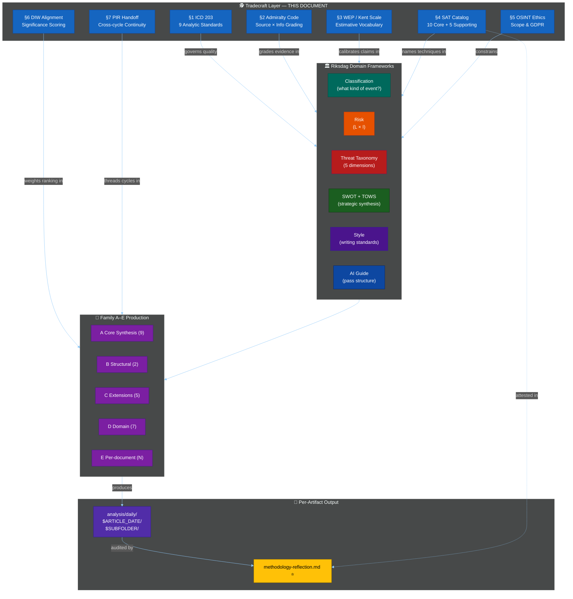

<!-- SPDX-FileCopyrightText: 2024-2026 Hack23 AB -->
<!-- SPDX-License-Identifier: Apache-2.0 -->

<p align="center">
  
</p>

<h1 align="center">🕵️ OSINT / INTOP Tradecraft Standards — Riksdagsmonitor</h1>

<p align="center">
  <strong>📊 Canonical Professional Tradecraft Reference for Swedish Political Intelligence Analysis</strong><br>
  <em>🎯 ICD 203 · Admiralty Code · Kent / Words of Estimative Probability · Structured Analytic Techniques · OSINT Ethics · GDPR Art. 9</em>
</p>

<p align="center">
  <a href="#"></a>
  <a href="#"></a>
  <a href="#"></a>
  <a href="#"></a>
  <a href="#"></a>
</p>

**📋 Document Owner:** CEO | **📄 Version:** 1.1 | **📅 Last Updated:** 2026-04-25 (UTC)
**🔄 Review Cycle:** Quarterly | **⏰ Next Review:** 2026-07-22
**🏢 Owner:** Hack23 AB (Org.nr 5595347807) | **🏷️ Classification:** Public

---

<!-- BEGIN AI-FIRST METHODOLOGY CARD -->

## 🎯 AI-FIRST Methodology Card

> **🚦 Read this card before writing a single paragraph.** It names the artifact this methodology owns, the gate check it satisfies, the evidence-density target it must hit, and the Pass-1 / Pass-2 discipline required by `.github/copilot-instructions.md` §5 (AI-FIRST Quality Principle).

| Field | Value |
|-------|-------|
| **Purpose** | Canonical OSINT / INTOP tradecraft — ICD 203 (9 standards), Admiralty Code (6×6 → 5-level confidence), WEP / Kent Scale (7 bands), SAT catalog (10 core + 5 supporting), GDPR Art. 9 ethics, DIW–Admiralty reconciliation, PIR handoff. |
| **Inputs** | `Hack23 ISMS-PUBLIC` (AI_Policy, Information_Security_Policy); ICD 203; STANAG 2022; Kent Scale |
| **Outputs** | _(tradecraft canon — referenced by every other methodology and `methodology-reflection.md §ICD 203 audit`)_ |
| **Owning artifact(s)** | _(applies to every artifact carrying confidence / source-grading / SAT attestation)_ |
| **Owning gate check** | WEP-band, Admiralty-grade, ICD 203 BLUF, SAT-documentation requirements in `reference-quality-thresholds.json#tradecraftQualitySignals` |
| **Citation density target** | Tradecraft canon — every external citation in any artifact MUST carry an Admiralty grade; every probabilistic claim MUST carry a WEP band |
| **Banned phrases** | Enforced via [`political-style-guide.md` §Machine-readable banned-phrase list](political-style-guide.md#machine-readable-banned-phrase-list) |
| **Threshold source** | [`reference-quality-thresholds.json`](reference-quality-thresholds.json) → `thresholds[articleType][artifact]` (fallback `defaults.coreArtifactFloor`) |

### ✅ Pass-1 checklist (creation — minimal viable artifact)

- [ ] ICD 203 9-standard table is present and reconciled with `methodology-reflection.md` audit marker
- [ ] Admiralty 6×6 matrix maps to the 5-level confidence scale used in the platform
- [ ] ≥ 10 SATs documented with applicability rules
- [ ] Produce every required sub-section listed in the owning template
- [ ] Add ≥ 1 evidence anchor (`dok_id`, vote id, named MP, or primary-source URL) per analytical claim
- [ ] Apply the correct WEP confidence band for the run's horizon (`72h / week / month / quarter / year / cycle`)
- [ ] Include ≥ 1 themed Mermaid diagram with `style …` or `themeVariables` config (where structurally meaningful)
- [ ] Cross-link the relevant template under `analysis/templates/` and the gate check it satisfies

### 🔁 Pass-2 checklist (read-back & improve — AI-FIRST mandatory)

- [ ] Verify GDPR Art. 9 ethical-scope statement explicitly forbids hacked / leaked / non-public political data
- [ ] Verify cross-cycle PIR handoff steps reconcile with `scripts/roll-forward-pirs.ts`
- [ ] Re-read the file end-to-end; flag every claim that lacks an evidence anchor and add one
- [ ] Replace every banned phrase listed in [`political-style-guide.md` §Machine-readable banned-phrase list](political-style-guide.md#machine-readable-banned-phrase-list) with an evidence-anchored alternative
- [ ] Tighten WEP language: never above **likely** without ≥ 3 cycle-aged sources for `year`/`cycle` horizons
- [ ] Strengthen Mermaid (color-coded `style …` directives, `themeVariables`, ≥ 5 nodes where the structure admits it)
- [ ] Add ≥ 1 second-order effect, cui-bono note, or counterfactual where the artifact admits one
- [ ] Verify citation density meets the per-file target below and the gate's evidence-density rules

### 🟢 Exemplar (good — pattern-match this)

> _(tradecraft attestation)_ "**KJ-1** Tidö coalition holds H902FiU1 vote (HIGH confidence, WEP=highly likely, Admiralty=[A1]/[B2] consensus, SATs applied: ACH, KAC, QIC). PIR-1 served. ICD 203 Standards 1, 6, 8 satisfied."

### 🔴 Anti-exemplar (failure mode — never ship this)

> _(failure mode)_ "Sources indicate this is likely." — no Admiralty, no WEP, no SAT, no ICD 203, no PIR.

### 🔗 Cross-links

- **Template(s)**: _(canon — applies to every artifact)_
- **Gate check**: [`.github/prompts/05-analysis-gate.md`](../../.github/prompts/05-analysis-gate.md#checks-all-must-pass)
- **AI-FIRST canon**: [`.github/copilot-instructions.md` §5](../../.github/copilot-instructions.md) · [`ai-driven-analysis-guide.md`](ai-driven-analysis-guide.md)
- **Style canon**: [`political-style-guide.md`](political-style-guide.md) · [`osint-tradecraft-standards.md`](osint-tradecraft-standards.md)
- **Catalog row**: [`artifact-catalog.md`](artifact-catalog.md)

<!-- END AI-FIRST METHODOLOGY CARD -->

---


## 🎯 Purpose

This document is the **single canonical source** for professional intelligence-tradecraft standards applied across the Riksdagsmonitor analysis library. It complements the domain frameworks ([classification](political-classification-guide.md) · [risk](political-risk-methodology.md) · [threat](political-threat-framework.md) · [SWOT](political-swot-framework.md) · [style](political-style-guide.md) · [AI guide](ai-driven-analysis-guide.md)) and the Family A–E production methodologies ([synthesis](synthesis-methodology.md) · [structural-metadata](structural-metadata-methodology.md) · [strategic-extensions](strategic-extensions-methodology.md) · [electoral-domain](electoral-domain-methodology.md) · [per-document](per-document-methodology.md)) with **cross-cutting analytic discipline** used by professional open-source intelligence (OSINT) and intelligence-operations (INTOP) organisations.

Every analytical artifact produced under `analysis/daily/$ARTICLE_DATE/$SUBFOLDER/` — and every article generated from those artifacts — is expected to conform to the **seven pillars** below:

1. **§1. ICD 203 Analytic Tradecraft Standards** — what "good analysis" looks like (9 ODNI standards).
2. **§2. Admiralty Code** — how to grade every source and every piece of information.
3. **§3. Words of Estimative Probability** — a calibrated vocabulary for probabilistic claims.
4. **§4. Structured Analytic Techniques (SAT) Catalog** — the named techniques that give the `methodology-reflection.md` artifact its evidence base.
5. **§5. OSINT Sourcing Ethics & Scope (GDPR Article 9 compliant)** — the boundaries of what this project will and will not do.
6. **§6. DIW Weighting Alignment** — how tradecraft labels reconcile with the Decision-Impact-Weight scoring used in `significance-scoring.md`.
7. **§7. PIR Handoff** — how Priority Intelligence Requirements persist across cycles so Tier-C workflows build on, rather than restart, prior-run intelligence.

**Scope.** This document describes *how* to analyse. Artifact shapes and Swedish-specific subject-matter rules stay in the domain frameworks and in the Family-A/B/C/D/E production methodologies.

---

## 🛡️ ISMS Policy Alignment

| Policy | Relevance |
|---|---|
| [Hack23 AI_Policy](https://github.com/Hack23/ISMS-PUBLIC/blob/main/AI_Policy.md) | Governs LLM-driven analysis. §1 (objectivity, explained uncertainties) and §5 (no private-life data on MPs) operationalise its requirements. |
| [Information Security Policy](https://github.com/Hack23/ISMS-PUBLIC/blob/main/Information_Security_Policy.md) | §2 source-grading and §3 estimative language constitute the risk-calibrated evidence discipline the ISMS expects. |
| [Open Source Policy](https://github.com/Hack23/ISMS-PUBLIC/blob/main/Open_Source_Policy.md) | §5 public-domain-only rule enforces licence-compatible sourcing. |
| [Secure Development Policy](https://github.com/Hack23/ISMS-PUBLIC/blob/main/Secure_Development_Policy.md) | §4 SAT catalog is the analytic equivalent of SDLC security gates. |
| [CLASSIFICATION.md](https://github.com/Hack23/ISMS-PUBLIC/blob/main/CLASSIFICATION.md) | Political-opinion data (GDPR Article 9) — §5.3 public-figure / public-capacity rule. |

---

## 📐 Relationship to Existing Frameworks



The tradecraft layer does not replace any existing framework — it is the cross-cutting analytic discipline that every framework and every artifact applies.

---

## 1️⃣ ICD 203 — Analytic Tradecraft Standards

The [US Office of the Director of National Intelligence](https://www.odni.gov/) publishes [**Intelligence Community Directive 203 — Analytic Standards**](https://www.odni.gov/files/documents/ICD/ICD%20203%20Analytic%20Standards.pdf), the most widely adopted professional benchmark for analytic quality. The standards are framework-agnostic and equally applicable to Swedish political-intelligence work.

### 1.1 The Nine Standards

| # | Standard | Meaning in the Riksdagsmonitor context | Canonical evidence artifact |
|---|---|---|---|
| **1** | **Objective** | Analysis reflects evidence, not the analyst's preferences. Party-group affiliations are described in terms of positions taken, not moral judgements. The eight riksdag parties (S, SD, M, V, C, KD, MP, L) receive equal analytical treatment. | Every artifact; specifically `synthesis-summary.md` Executive Finding. |
| **2** | **Independent of political considerations** | The analysis is the same regardless of which coalition holds the majority. No deference to the government (SD-M-KD-L), opposition (S-MP-V-C), Talmannen, or any individual minister / spokesperson. | `stakeholder-perspectives.md`, `coalition-mathematics.md`, `media-framing-analysis.md`. |
| **3** | **Timely** | Breaking-news artifacts (`realtime-*/`) publish within the scheduled cadence; morning (propositions / motions / committee-reports / interpellations), midday (week-ahead / month-ahead), evening (evening-analysis) and review (weekly-review / monthly-review) workflows respect their schedule. | All workflows; enforced by the gh-aw schedule triggers. |
| **4** | **Based on all available sources of intelligence** | Every claim is cross-checked against the `riksdag-regering` MCP feeds available at run-time; SCB for statistics; IMF for macroeconomic context (WEO/FM/IFS/BOP/GFS_COFOG/MFS_IR/DOTS/PCPS/ER); World Bank for non-economic residue only (governance WGI, environment, social, defence historicals); feed failures are logged and a direct-endpoint fallback (`data.riksdagen.se`, `regeringen.se`, `api.scb.se`) attempted. | `data-download-manifest.md`, `comparative-international.md`. |
| **5a** | **Tradecraft — describes quality and credibility of underlying sources** | Every source citation carries an Admiralty grade (see §2). Feed failures and degraded modes are explicit. | `data-download-manifest.md` §"Collection Transparency"; `methodology-reflection.md` §Source Diversity. |
| **5b** | **Tradecraft — expresses and explains uncertainties** | Every probabilistic claim uses a WEP band (see §3) and carries a 🟦 / 🟩 / 🟧 / 🟥 / ⬛ confidence marker (see [`political-style-guide.md`](political-style-guide.md) §5-Level Confidence Scale). | `synthesis-summary.md`, `scenario-analysis.md`, `risk-assessment.md`, `forward-indicators.md`, `threat-analysis.md`, `intelligence-assessment.md`. |
| **5c** | **Tradecraft — distinguishes assumptions from judgements** | Structural assumptions (e.g. "Government coalition SD-M-KD-L holds 176 mandate"; "Opposition S-MP-V-C cohesion on budget ≥ 80 %") are named in the Key Assumptions Check (see §4). | `devils-advocate.md` §Key Assumptions Check; `methodology-reflection.md` §Assumptions audit. |
| **5d** | **Tradecraft — incorporates analysis of alternatives** | At least one alternative hypothesis is tested in every significant analytic judgement via ACH (see §4) and at least one Red-Team position is surfaced. | `devils-advocate.md` (≥ 3 competing hypotheses); `scenario-analysis.md` (≥ 3 scenarios). |
| **5e** | **Tradecraft — demonstrates customer relevance** | Every artifact names the decision or monitor it informs. Forward-looking artifacts include named watchpoints with trigger thresholds and dates. | `executive-brief.md` §"3 Decisions This Brief Supports"; `forward-indicators.md` (≥ 10 dated indicators across 4 horizons). |
| **5f** | **Tradecraft — uses clear and logical argumentation** | Every numbered section advances a single claim; no paragraph exceeds 150 words without structure; every Mermaid diagram is explained in adjacent prose. | Every artifact; enforced by Pass 2 readback (see [`ai-driven-analysis-guide.md`](ai-driven-analysis-guide.md) §Step 9). |
| **5g** | **Tradecraft — explains change or consistency** | Every run that follows a prior same-type run documents position deltas vs the previous cycle's artifacts in `cross-reference-map.md §Sibling folders / Prior cycle`. | `cross-reference-map.md`; Tier-C `intelligence-assessment.md` prior-cycle PIR ingestion. |
| **5h** | **Tradecraft — makes accurate judgements and assessments** | Judgements are calibrated to the evidence via §3 WEP bands; confidence asymmetries (e.g. high evidence, low confidence) are stated. | `intelligence-assessment.md` §Key Judgments (≥ 3 with confidence labels); per-document `documents/{dok_id}-analysis.md`. |
| **5i** | **Tradecraft — incorporates effective visual information where appropriate** | Every Family A and Family D synthesis artifact carries ≥ 1 Hack23-themed colour-coded Mermaid diagram (gate check 5). | Every artifact with a *Mandatory Mermaid* rule — `synthesis-summary.md`, `swot-analysis.md`, `risk-assessment.md`, `threat-analysis.md`, `stakeholder-perspectives.md`, `significance-scoring.md`, `classification-results.md`, `cross-reference-map.md`, `executive-brief.md`, `coalition-mathematics.md`, `forward-indicators.md`. |

### 1.2 Using ICD 203 in the Pass 2 Readback

During Pass 2 (see [`ai-driven-analysis-guide.md`](ai-driven-analysis-guide.md) §Step 9), the agent reads the entire run output and answers, section-by-section, "which ICD 203 standard does this section satisfy?". Any section that cannot be mapped to at least one standard is rewritten in Pass 2.

The `methodology-reflection.md` artifact records the run's compliance against all nine standards — this is gate check 7 in [`05-analysis-gate.md`](../../.github/prompts/05-analysis-gate.md).

---

## 2️⃣ Admiralty Code — Source × Information Grading

The [NATO Admiralty Code (Admiralty System, STANAG 2511)](https://nsa.nato.int/) is the standard OSINT / INTOP grading scheme for evidence. Every citation in an analytic artifact carries **two letters**: source reliability and information credibility.

### 2.1 Source Reliability (letter)

| Grade | Label | Meaning in the Riksdagsmonitor context |
|:---:|---|---|
| **A** | Completely reliable | Official Riksdag feed (`data.riksdagen.se`), Regeringen (`regeringen.se`), SCB (`api.scb.se`), ECB, IMF, World Bank, and any document reachable through the `riksdag-regering` MCP Server with a direct `dok_id` (e.g. `H901FiU1`, `HD03239`). |
| **B** | Usually reliable | Public-service media (SVT, SR), TT Nyhetsbyrån, major Swedish dailies with parliamentary reporters (DN, SvD, Aftonbladet, Expressen covering institutional facts), Swedish university research centres (SIEPS, UI, SNS, SCB-affiliated). |
| **C** | Fairly reliable | Partisan-leaning but editorially accountable outlets (ETC, Nyheter Idag, Fria Tidningar), think-tank briefings (Timbro, Katalys, Arena Idé, Fores), trade-press (Dagens Industri, Altinget, Europaportalen). |
| **D** | Not usually reliable | General-interest press without parliamentary accreditation, commentary / opinion pieces from partisan outlets, social-media posts from verified but non-institutional accounts. |
| **E** | Unreliable | Anonymous social-media actors, blog commentary without disclosed authorship, outlets with documented track record of factual errors on Swedish politics. |
| **F** | Cannot be judged | Anonymous source, machine-generated summary, or any source whose provenance cannot be determined. |

### 2.2 Information Credibility (digit)

| Grade | Label | Meaning |
|:---:|---|---|
| **1** | Confirmed by other sources | Multiple **A**-graded sources agree and the primary record is reachable (e.g. `get_voteringar` returns matching tallies cross-checked against riksdagen.se HTML). |
| **2** | Probably true | A single **A**-graded primary record exists, or multiple **B** sources agree. |
| **3** | Possibly true | One **B**-graded source or multiple lower-grade sources agree; no primary contradiction found. |
| **4** | Doubtful | Information is plausible but uncorroborated. |
| **5** | Improbable | Information contradicts prior evidence without strong reason. |
| **6** | Cannot be judged | Credibility cannot be assessed (e.g. degraded MCP mode; data not available). |

### 2.3 The 6 × 6 Matrix and Confidence Mapping

The 36 combinations collapse into five bands that map directly to the Riksdagsmonitor **5-level confidence scale** (see `political-style-guide.md`).

```
                                Information Credibility
                     1       2       3       4       5       6
            ┌─────────────────────────────────────────────────┐
          A │  🟦      🟩      🟩      🟧      🟥      🟧      │
          B │  🟩      🟩      🟧      🟧      🟥      🟧      │
          C │  🟩      🟧      🟧      🟥      🟥      🟥      │
          D │  🟧      🟧      🟥      🟥      🟥      ⬛      │
          E │  🟥      🟥      🟥      🟥      ⬛      ⬛      │
          F │  🟧      🟧      🟥      🟥      ⬛      ⬛      │
            └─────────────────────────────────────────────────┘
                                       Source Reliability
```

- **🟦 VERY HIGH (A1)** — multi-source primary-record confirmation; fit to anchor a headline judgement.
- **🟩 HIGH (A2–A3, B1–B2, C1)** — primary-source evidence or tightly corroborated secondary evidence; fit to support a headline judgement.
- **🟧 MEDIUM (A4, B3–B4, B6, C2–C3, D1–D2, F1–F2)** — indicative but not conclusive; must be flanked by at least one other piece of evidence before supporting a headline judgement.
- **🟥 LOW (C4–C5, D3–D5, E1–E4, F3–F4)** — noted but never anchors a top-level judgement on its own; typically cited only in explicit "what we do not know" sections.
- **⬛ VERY LOW (D6, E5–E6, F5–F6)** — excluded from analysis or framed as "unverified report", never as judgement.

### 2.4 Notation in Artifacts

Every evidence citation carries its grade inline or in a dedicated **Admiralty** column:

> *"Regeringen's proposition Prop. 2025/26:48 passed the finansutskottet 9–8 on 2026-04-21 with SD-M-KD-L supporting [`get_voteringar(bet=FiU48)`, **A1**]."*

For tables, a dedicated **Admiralty** column is preferred (already mandatory in Riksdag templates v4.3 — see [`analysis/templates/README.md`](../templates/README.md) §Evidence Column Requirements).

### 2.5 When Grades Downgrade Analytic Claims

- Any claim supported only by grade-D or grade-E sources **must** be marked 🟥 LOW confidence.
- Any claim supported only by grade-F sources **must** be excluded or framed as "unverified report" (never as a judgement).
- Degraded MCP mode (e.g. `riksdag-regering-ai.onrender.com` cold-start fallback to direct `data.riksdagen.se`) automatically downgrades source reliability by one letter for all affected citations in the run and is logged in `data-download-manifest.md §Collection Transparency`.
- Single-source claims (any grade) are flagged `[unconfirmed]` per the **Source Diversity Rule** (see §2.6 below).

### 2.6 Source Diversity Rule (Riksdag-specific)

P0 / P1 claims (top-tier significance, see `significance-scoring.md`) require:

| Source tier | Minimum requirement |
|-------------|---------------------|
| **Primary** (riksdag-regering MCP, data.riksdagen.se, regeringen.se) | ≥ 3 independent documents / tool calls |
| **Secondary** (SCB, World Bank, IMF, SVT, TT, DN, SvD) | ≥ 1 corroborating source |
| **Tertiary** (think-tank / academic / specialist press) | Optional enrichment |

A P0 / P1 claim that violates this rule is blocked by `05-analysis-gate.md` check 4 and must be labelled `[single-source]` or rewritten in Pass 2.

---

## 3️⃣ Words of Estimative Probability (WEP / Kent Scale)

Professional intelligence analysis uses a **calibrated probabilistic vocabulary** pioneered by [Sherman Kent](https://www.cia.gov/resources/csi/studies-in-intelligence/) and formalised in successive [National Intelligence Council](https://www.dni.gov/index.php/who-we-are/organizations/mission-integration/nic) products. Riksdagsmonitor adopts a seven-band scheme aligned with the ODNI reference.

### 3.1 The Seven Bands

Canonical seven-band vocabulary matches [`political-style-guide.md §Confidence Scale`](political-style-guide.md) — **do not substitute synonyms** (e.g. "probable", "highly probable", "almost no chance") in analytic conclusions.

| Band | English phrase | Swedish equivalent (for SV articles) | Numeric range | Indicative usage |
|:---:|---|---|:---:|---|
| **1** | **Remote** | *Så gott som utesluten* | 1 – 7 % | "V voting to support the government's defence-budget proposition is remote." |
| **2** | **Very unlikely** | *Mycket osannolikt* | 10 – 20 % | "A split within SD over migration policy before the 2026 election is very unlikely given the party's current whip discipline." |
| **3** | **Unlikely** | *Osannolikt* | 20 – 37 % | "Unilateral Regeringskansliet blocking of an EU-initiated trilogue is unlikely, given Sweden's Council commitments." |
| **4** | **Roughly even** | *Ungefär lika sannolikt som inte* | 45 – 55 % | "There is a roughly even chance that C and L will split over budget priorities in Q3." |
| **5** | **Likely** | *Sannolikt* | 63 – 80 % | "The M–KD compromise on the Wind-Power Revenue Act (HD03239) will likely survive the chamber vote." |
| **6** | **Very likely** | *Mycket sannolikt* | 80 – 90 % | "Very likely the budget discharge will pass on first chamber vote." |
| **7** | **Almost certain** | *Så gott som säkert* | 93 – 99 % | "Extra amendment budget FiU48 is almost certain to be adopted this plenary." |

### 3.2 Banned Terms in Analytic Conclusions

The following English / Swedish terms are **ambiguous** and must be replaced with one of the seven bands whenever they carry probabilistic weight:

- *possibly, may, might, could, perhaps, conceivably* / *möjligen, kanske, eventuellt, kan komma att* — uncalibrated.
- *significant chance, real risk, cannot be ruled out* / *betydande risk, kan inte uteslutas* — hedging without bands.
- *imminent* / *omedelbart förestående* without a date — descriptive, not estimative.
- *many, most, some, several* / *många, de flesta, några, flera* — when used of actor counts, replace with numerics (e.g. "6 of 8 parties", "176 out of 349 mandate").

These words remain acceptable in descriptive passages (e.g. "The Commission may publish its communication in Q3"), but not in analytic conclusions or headline judgements.

### 3.3 Pairing With Admiralty Grades

Every WEP-banded claim carries an Admiralty suffix (see §2.4). Example canonical form:

> *"A government-coalition split on the Wind-Power Revenue Act is **unlikely** (20–45 %) [`get_voteringar`, `get_ledamot` — historical cohesion 2022–2025, **A1**]. Confidence: 🟩 HIGH. Horizon: operational (7–90 days)."*

The pairing forces the analyst to reconcile *what we claim* (WEP band) with *why we claim it* (Admiralty grade) and makes every forecast falsifiable after the event.

### 3.4 Time Horizon Discipline

Every estimative claim names an explicit horizon aligned with Riksdag's legislative rhythm:

- **Tactical** — next 0–7 days (current plenary week, current committee cycle).
- **Operational** — next 7–90 days (within the current riksmöte session, up to the next major budget milestone).
- **Strategic** — next 90 days – 18 months (within the current mandate period, up to the 2026 election).
- **Structural** — 18+ months (term-on-term, multi-mandate trends).

A claim without an explicit horizon is rejected in Pass 2 and flagged by `05-analysis-gate.md` check 8 (`forward-indicators.md` requires ≥ 10 dated indicators across these four horizons).

---

## 4️⃣ Canonical Structured Analytic Techniques (SAT) Catalog

The `methodology-reflection.md` artifact requires **≥ 10 SATs applied per run** with artifact citations. This catalog defines those techniques so the attestation is substantive rather than nominal. The canonical reference is Heuer & Pherson, *Structured Analytic Techniques for Intelligence Analysis* (3rd ed., CQ Press, 2020).

### 4.1 Core Techniques (required)

| # | Technique | Definition | When to apply | Required output | Canonical artifact |
|---|---|---|---|---|---|
| **1** | **Analysis of Competing Hypotheses (ACH)** | Matrix comparing ≥ 3 hypotheses against all evidence; hypothesis with the fewest inconsistencies wins. | Whenever the analysis has ≥ 2 plausible explanations (e.g. a budget-vote outcome with multiple coalition drivers). | Matrix table: hypotheses × evidence cells with C / I / N markings, inconsistency count per hypothesis. | `devils-advocate.md` (≥ 3 hypotheses — enforced by gate check 7). |
| **2** | **Key Assumptions Check (KAC)** | Explicit list of the structural assumptions underpinning the analysis, with a rebuttal for each. | Every run; at least the top 5 assumptions (e.g. coalition stability, opposition cohesion, SD-M-KD-L budget alignment). | Table: assumption, basis, rebuttal, confidence if wrong. | `devils-advocate.md` §KAC; `methodology-reflection.md` §Assumptions audit. |
| **3** | **Quality of Information Check** | Per-source Admiralty grade audit and a "what we do not know" section. | Every run. | Source-grade distribution table; gaps list. | `data-download-manifest.md §Collection Transparency`; `methodology-reflection.md §Source Diversity`. |
| **4** | **Indicators & Signposts** | Pre-specified observable events that would confirm or refute each scenario. | Every forecast artifact. | ≥ 3 indicators per scenario, each with date, source, trigger threshold. | `forward-indicators.md` (≥ 10 dated indicators across 4 horizons — enforced by gate check 8); `scenario-analysis.md §Leading indicators`. |
| **5** | **What-If Analysis** | Starts from a specified low-probability but high-impact event; works backwards to indicators. | When the risk register contains ≥ 1 tail event (e.g. government-crisis, misstroendeförklaring, sudden resignation). | Narrative scenario + reverse-causal chain. | `scenario-analysis.md §Wild-card scenario`; `risk-assessment.md §Cascading chains`. |
| **6** | **High-Impact / Low-Probability Analysis** | Structured risk-register entry for tail-risk events that conventional scenario analysis deprioritises. | At least one per breaking / weekly / monthly run. | Named event, trigger, impact vector, early-warning indicator, resilience test. | `risk-assessment.md §Tail risks`; `scenario-analysis.md` 4th-scenario slot. |
| **7** | **Red Team / Devil's Advocate** | Independent reading that actively argues against the main judgement. | Every run with a headline judgement. | Named alternative position, 3 strongest counter-points, minimum viable disconfirming evidence. | `devils-advocate.md` (dedicated artifact — enforced by gate check 7). |
| **8** | **Pre-Mortem** | Before publication, the analyst asks: "imagine this conclusion is wrong in 90 days — why?" | Every forecast artifact; optional for retrospective artifacts. | List of the top 3 failure modes with observable markers. | `scenario-analysis.md §Pre-Mortem`; `methodology-reflection.md §Failure modes`. |
| **9** | **Scenario Analysis** | Produces 3–5 plausible futures with probabilities summing to ~100 %. | Every forward-looking artifact. | Named scenarios, WEP-banded probability per scenario, indicators per scenario. | `scenario-analysis.md` (≥ 3 scenarios — enforced by gate check 7). |
| **10** | **Lightweight ACH (per-file)** | Tabular version of ACH used in per-file artifacts where full ACH is not practical. | Per-file analyses with ≥ 1 contested interpretation. | 2-column table with C / I / N markings per evidence × hypothesis. | `documents/{dok_id}-analysis.md` per-file artifacts. |

### 4.2 Supporting Techniques (apply as appropriate)

- **PESTLE** — political / economic / social / technological / legal / environmental decomposition. Canonical in `comparative-international.md` and `implementation-feasibility.md`.
- **Stakeholder Mapping** — position × power × interest grid. Canonical in `stakeholder-perspectives.md`.
- **Bayesian Update** — prior × likelihood → posterior for cross-run confidence updating. Canonical in `risk-assessment.md §Posterior probabilities` and Tier-C `intelligence-assessment.md`.
- **Force-Field Analysis** — drivers vs. restrainers of a given coalition outcome. Canonical in `coalition-mathematics.md`.
- **Cone of Plausibility** — four-quadrant forecast laying out best / plausible / worst / wildcard cases. Canonical in `scenario-analysis.md`.

### 4.3 Attestation Requirement

Each applied technique appears in the `methodology-reflection.md §3 SAT table` with: technique name, canonical artifact where applied, one-sentence outcome (what the technique revealed), and Pass (1 / 2). A technique listed without a canonical artifact reference is rejected in Pass 2. The `methodology-reflection.md` artifact **must** name ≥ 10 applied techniques drawn from §4.1 + §4.2 — this is gate check 7 in [`05-analysis-gate.md`](../../.github/prompts/05-analysis-gate.md).

---

## 5️⃣ OSINT Sourcing Ethics & Scope (GDPR Article 9)

Political intelligence is a disciplined craft with hard ethical boundaries. The following rules are **non-negotiable** and supersede any analytic consideration. Political opinions are **GDPR Article 9 special category data**; lawful bases are Art. 9(2)(e) (data manifestly made public by the data subject) and Art. 9(2)(g) (processing necessary for reasons of substantial public interest — democratic accountability journalism).

### 5.1 In Scope

- **Public institutional records** — every Riksdag document, procedure, vote, speech, report, question (fråga), interpellation, motion, committee report, and adopted text retrievable through the `riksdag-regering` MCP Server or `data.riksdagen.se`.
- **Official publications** — Regeringen (SOU, Ds, propositions, directives, uppdrag), Riksrevisionen, Justitieombudsmannen, Justitiekanslern, SCB, Riksbanken, Konjunkturinstitutet, Finanspolitiska rådet, and equivalent Swedish government open-data portals.
- **EU / international institutional** — EUR-Lex, Commission register, Council documents, Eurostat, ECB, IMF, World Bank.
- **Public statements by MPs (riksdagsledamöter) and parties** — press releases, recorded plenary speeches (anföranden), committee interventions, signed motions, interpellations.
- **Reputable Swedish press with parliamentary accreditation** — SVT, SR, TT, DN, SvD, DI, Altinget, Europaportalen.
- **Academic literature** — peer-reviewed political-science scholarship on Swedish politics, Riksdag dynamics, electoral behaviour.

### 5.2 Out of Scope (never collected, never cited)

- **Personal-life data on MPs, ministers, or their staff** — family, health, private residences, personal relationships, private finances beyond published **åtaganden / register over ekonomiska intressen** declarations. This aligns with the [Hack23 AI_Policy](https://github.com/Hack23/ISMS-PUBLIC/blob/main/AI_Policy.md) prohibition on processing personal data outside stated purpose, and [CLASSIFICATION.md](https://github.com/Hack23/ISMS-PUBLIC/blob/main/CLASSIFICATION.md) restrictions on Article 9 data.
- **Doxing or aggregation targeting individuals** — even if each datum is individually public, aggregated profiles focused on private life are out of scope.
- **Paywalled or licence-restricted sources** — analysis relies on open-data sources. Subscription-only policy-tracker content is not re-published; if an analyst uses it, it is cited but not quoted at length, and the claim must independently pass §2 Admiralty grading.
- **Leaked material of unknown provenance** — any source that cannot be verified against a published primary record is grade F and excluded from headline judgements.
- **Covert collection** — social-engineering, scraping behind authentication walls, deceptive personas, or any technique that would require consent under GDPR.
- **Unverified social-media rumour** — social-media posts by verified institutional accounts (e.g. verified party / ministry accounts) are grade B3; all other social-media content is grade E or F and never carries a judgement.

### 5.3 GDPR and Proportionality Discipline

The analysis focuses on **public figures acting in their public capacity** and on **institutional process**. Where an MP name appears, it appears in connection with a specific vote, speech, motion, or interpellation — never in connection with private life. This is consistent with the public-figure limit under GDPR Article 6(1)(f) legitimate-interest processing + Article 9(2)(e)+(g) exemptions, applied to political accountability journalism under the Swedish [Tryckfrihetsförordningen](https://www.riksdagen.se/sv/dokument-och-lagar/dokument/svensk-forfattningssamling/tryckfrihetsforordning-1949105_sfs-1949-105/) and [Yttrandefrihetsgrundlagen](https://www.riksdagen.se/sv/dokument-och-lagar/dokument/svensk-forfattningssamling/yttrandefrihetsgrundlag-19911469_sfs-1991-1469/) constitutional-order principles (Offentlighetsprincipen).

A [Data Protection Impact Assessment (DPIA)](https://github.com/Hack23/ISMS-PUBLIC/blob/main/Information_Security_Policy.md) applies whenever aggregation scope expands beyond the institutional-action focus described above.

### 5.4 Attribution and Reproducibility

- Every non-trivial claim cites the primary `riksdag-regering` MCP tool call, `dok_id`, or primary-source URL that backs it.
- Every artifact lists the MCP tool calls attempted in the run (successful and failed) in `data-download-manifest.md §Collection Transparency`, so a third party can reproduce the evidence collection.
- The `data-download-manifest.md §Collection Transparency` block is the run's transparency ledger — it is not optional and is enforced by `05-analysis-gate.md` check 2 (per-document coverage).

### 5.5 Licence and Republication

- All Riksdagsmonitor analysis is published under the repository's Apache-2.0 licence with SPDX headers.
- Re-publication of third-party text is limited to short excerpts with clear attribution and only to the extent supported by the source's own licence (Riksdagen and Regeringen material is generally reusable; commercial-press content is not re-published).
- SPDX headers on every markdown file under `analysis/` make the licence chain machine-verifiable.

---

## 6️⃣ DIW Weighting Alignment

The **Decision-Impact-Weight (DIW)** score in `significance-scoring.md` is the Riksdag-specific operationalisation of ICD 203 §5e (customer relevance). This section aligns the tradecraft grading of §§2–3 with DIW so Pass-2 rewrites are internally consistent.

### 6.1 DIW ↔ Admiralty ↔ Confidence

| DIW tier | Score range | Minimum Admiralty floor | Minimum confidence | Typical application |
|---------:|:-----------:|:-----------------------:|:------------------:|---------------------|
| **L1 Surface** | < 5.0 | C3 | 🟧 MEDIUM | Metadata, procedural notes, routine interpellations. |
| **L2 Strategic** | 5.0 – 6.9 | B2 | 🟩 HIGH | Standard news-day items, committee-level developments. |
| **L2+ Priority** | 7.0 – 8.4 | A2 | 🟩 HIGH | Headline items, coalition-relevant motions/propositions. |
| **L3 Intelligence-grade** | ≥ 8.5 | A1 | 🟦 VERY HIGH | Budget-defining votes, government-crisis signals, election-pivotal events. |

A document whose evidence does not meet the Admiralty floor for its DIW tier must be either (a) downgraded one tier, (b) enriched with additional sources to clear the floor, or (c) flagged `[insufficient-evidence]` in Pass 2. This mapping is audited in `methodology-reflection.md §DIW-Admiralty reconciliation`.

### 6.2 DIW ↔ WEP Horizon

| DIW tier | Default primary horizon | Secondary horizon allowed |
|---------:|-------------------------|---------------------------|
| **L1 Surface** | Tactical (0–7 d) | — |
| **L2 Strategic** | Operational (7–90 d) | Tactical |
| **L2+ Priority** | Operational + Strategic | Tactical |
| **L3 Intelligence-grade** | Strategic (90 d – 18 m) + Structural (18 m+) | Operational |

Mismatches (e.g. an L3 item whose only forward indicators are tactical) are rewritten in Pass 2 to add strategic / structural horizons — this is the "timeliness check" audited in `methodology-reflection.md §Horizon coverage`.

### 6.3 Sensitivity to Source Diversity

When §2.6 Source Diversity Rule is violated for an item, its DIW score is capped at the next-lower tier until the violation is resolved. A P0 claim cannot remain P0 without ≥ 3 primary sources.

---

## 7️⃣ PIR Handoff — Cross-Cycle Continuity

**Priority Intelligence Requirements (PIRs)** are the persistent questions Riksdagsmonitor is tracking across cycles. They live in `intelligence-assessment.md §PIRs for next cycle` and are the handoff mechanism between daily → weekly → monthly → election cycles.

### 7.1 Standing Riksdag PIR Catalogue (baseline)

| PIR ID | Question | Primary artifact | Typical horizon |
|--------|----------|------------------|-----------------|
| **PIR-1** | Coalition stability — will SD-M-KD-L hold on the next budget-defining vote? | `coalition-mathematics.md` + `risk-assessment.md` | Operational |
| **PIR-2** | Opposition cohesion — will S-MP-V-C coordinate on specific motions? | `stakeholder-perspectives.md` + `cross-reference-map.md` | Operational |
| **PIR-3** | Party-position drift — is any party's stated position on policy X inconsistent with its 2022 manifesto? | `media-framing-analysis.md` + `historical-parallels.md` | Strategic |
| **PIR-4** | Election 2026 pathway — what seat-projection deltas emerge from this week's developments? | `election-2026-analysis.md` + `voter-segmentation.md` | Strategic |
| **PIR-5** | Institutional risk — are there credible signals of procedural or constitutional friction (e.g. Talmannen rulings, konstitutionsutskottet actions)? | `threat-analysis.md` + `implementation-feasibility.md` | Operational + Strategic |
| **PIR-6** | Economic transmission — how do IMF / SCB signals (with World Bank governance/environment residue) translate into budget-vote pressure? | `comparative-international.md` + economic-context sections | Strategic |
| **PIR-7** | Foreign-policy alignment — EU Council, NATO, and Nordic-cooperation posture of the current government vs the opposition's stated position. | `comparative-international.md` + `threat-analysis.md` | Strategic + Structural |

Workflows are free to add cycle-specific PIRs beyond PIR-1–7 in their `intelligence-assessment.md`.

### 7.2 Handoff Contract

Every Tier-C run (`news-evening-analysis`, `news-week-ahead`, `news-month-ahead`, `news-weekly-review`, `news-monthly-review`, `news-realtime-monitor`, `news-article-generator` deep-inspection) **must**:

1. Read the most recent prior-cycle `intelligence-assessment.md` from the sibling-folder set defined in [`ext/tier-c-aggregation.md`](../../.github/prompts/ext/tier-c-aggregation.md).
2. Extract unresolved PIRs and list them under `intelligence-assessment.md §Carried-forward PIRs` in the current cycle.
3. Either answer the PIR (with evidence, Admiralty grade, WEP band) or re-forward it with an updated signpost.
4. Record the prior-cycle folder path in `cross-reference-map.md §Sibling folders`.

This contract is enforced by the Tier-C additive gate in `ext/tier-c-aggregation.md`. A Tier-C run whose `intelligence-assessment.md` does not carry forward at least one prior-cycle PIR is rewritten in Pass 2.

### 7.3 PIR Retirement

A PIR is retired when:

- (a) The underlying question is definitively resolved (e.g. coalition-stability question after a failed misstroendeförklaring vote), **and**
- (b) The retirement is recorded in `methodology-reflection.md §PIR retirement log` with date and evidence `dok_id` / primary-source URL.

Retired PIRs are not re-introduced in subsequent cycles unless new evidence explicitly reopens them.

---

## 🧪 Quick-Reference Checklist

Before a run's PR is created, verify each line:

- [ ] Every headline judgement uses a **WEP band** (§3.1) and names a **time horizon** (§3.4).
- [ ] Every evidence citation carries an **Admiralty grade** (§2.1–2.2) inline or in a dedicated Admiralty column.
- [ ] Every probabilistic claim is paired with a 🟦 / 🟩 / 🟧 / 🟥 / ⬛ **confidence marker** consistent with §2.3.
- [ ] The `methodology-reflection.md §SAT table` names **≥ 10 techniques** drawn from §4 with artifact citations and Pass identifiers.
- [ ] No artifact contains banned terms (§3.2) in analytic conclusions; descriptive uses are OK.
- [ ] At least **one alternative hypothesis** (§4 technique 1 or 7) is surfaced for every headline judgement — via `devils-advocate.md` (≥ 3 ACH hypotheses).
- [ ] **No personal-life data** on MPs / ministers appears anywhere under `analysis/daily/` (§5.2).
- [ ] Every source is **grade A – F** in scope (§5.1–5.2); anything outside scope is removed.
- [ ] **DIW–Admiralty reconciliation** passes (§6.1): every item's source floor meets its DIW tier requirement.
- [ ] **PIR handoff** (§7.2) is recorded for every Tier-C run — `intelligence-assessment.md` carries forward ≥ 1 prior-cycle PIR.
- [ ] **Source Diversity Rule** (§2.6) holds for every P0 / P1 claim: ≥ 3 primary + ≥ 1 secondary source.
- [ ] `methodology-reflection.md §ICD 203 audit` maps each of the 9 standards to at least one artifact section.

---

## 🔗 Related Documents

- [`ai-driven-analysis-guide.md`](ai-driven-analysis-guide.md) — pass structure; §Step 9 Pass-2 readback operationalises this document's checklist.
- [`per-document-methodology.md`](per-document-methodology.md) — per-document construction rules; §10 lightweight-ACH in per-file artifacts.
- [`synthesis-methodology.md`](synthesis-methodology.md) — Family A synthesis + DIW weighting.
- [`strategic-extensions-methodology.md`](strategic-extensions-methodology.md) — Family C (executive brief, intelligence assessment, scenario, devil's advocate, methodology reflection).
- [`electoral-domain-methodology.md`](electoral-domain-methodology.md) — Family D (election, coalition math, voter segmentation, historical parallels, media framing, implementation feasibility, forward indicators).
- [`structural-metadata-methodology.md`](structural-metadata-methodology.md) — Family B (manifest + cross-reference).
- [`political-style-guide.md`](political-style-guide.md) — §Estimative Language & Source Grading cross-references this document.
- [`political-risk-methodology.md`](political-risk-methodology.md) — Likelihood × Impact; likelihoods use §3 bands.
- [`political-threat-framework.md`](political-threat-framework.md) — Political Threat Taxonomy; claims about intent / capability use §3 bands.
- [`political-swot-framework.md`](political-swot-framework.md) — SWOT + TOWS; evidence rows use §2 grading.
- [`political-classification-guide.md`](political-classification-guide.md) — 7-dimension classification.
- [`../templates/methodology-reflection.md`](../templates/methodology-reflection.md) — the run's tradecraft attestation artifact.
- [`../../.github/prompts/04-analysis-pipeline.md`](../../.github/prompts/04-analysis-pipeline.md) — workflow contract that mandates reading this document in Pass 1.
- [`../../.github/prompts/05-analysis-gate.md`](../../.github/prompts/05-analysis-gate.md) — gate checks 4, 5, 7, 8 enforce the disciplines defined here.
- [Hack23 AI_Policy](https://github.com/Hack23/ISMS-PUBLIC/blob/main/AI_Policy.md) — responsible-AI governance.
- [Hack23 CLASSIFICATION](https://github.com/Hack23/ISMS-PUBLIC/blob/main/CLASSIFICATION.md) — Article 9 / special-category-data handling.

## 📚 External References

- Office of the Director of National Intelligence. **ICD 203 — Analytic Standards.** 2015 revision. <https://www.odni.gov/files/documents/ICD/ICD%20203%20Analytic%20Standards.pdf>
- Kent, Sherman. *Words of Estimative Probability*. CIA Studies in Intelligence, 1964 (declassified 1993).
- Heuer, R. J. *Psychology of Intelligence Analysis*. CIA Center for the Study of Intelligence, 1999.
- Heuer, R. J. & Pherson, R. H. *Structured Analytic Techniques for Intelligence Analysis* (3rd ed.). CQ Press, 2020.
- NATO. *Intelligence Handbook* (AJP-2.1); *Admiralty System* (STANAG 2511).
- UK Ministry of Defence. *Red Teaming Handbook* (3rd ed.), 2021.
- Riksdagen. *Tryckfrihetsförordningen* (1949:105). <https://www.riksdagen.se/sv/dokument-och-lagar/dokument/svensk-forfattningssamling/tryckfrihetsforordning-1949105_sfs-1949-105/>
- Riksdagen. *Yttrandefrihetsgrundlagen* (1991:1469). <https://www.riksdagen.se/sv/dokument-och-lagar/dokument/svensk-forfattningssamling/yttrandefrihetsgrundlag-19911469_sfs-1991-1469/>

---

**Document Control:** `/analysis/methodologies/osint-tradecraft-standards.md` · v1.0 · Applies to every workflow and every artifact under `analysis/daily/$ARTICLE_DATE/$SUBFOLDER/`.
