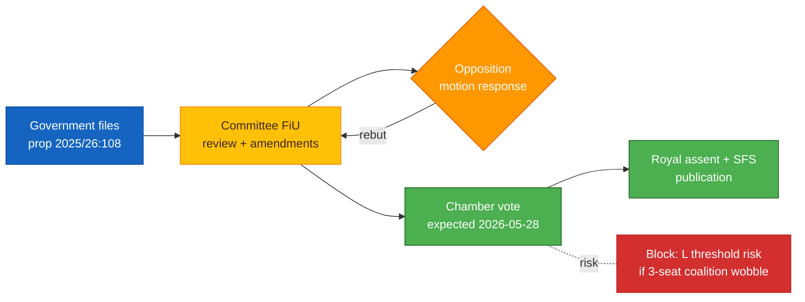
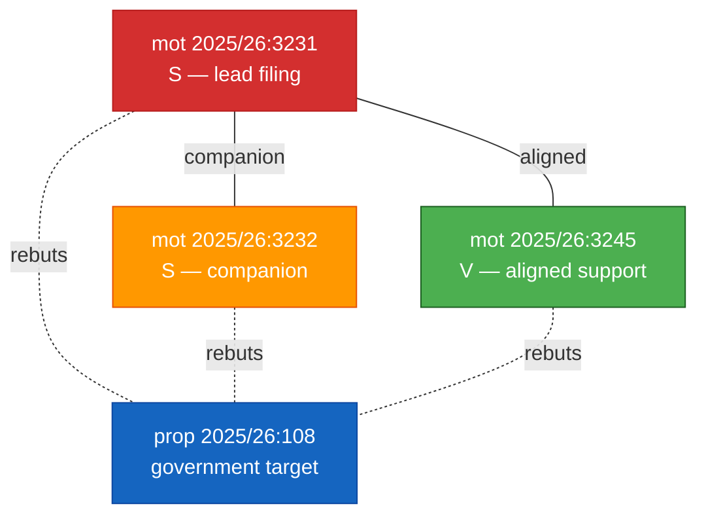

<p align="center">
  
</p>

<h1 align="center">📒 Per-Document Methodology</h1>

<p align="center">
  <strong>📊 Family E — Atomic Evidence Layer</strong><br>
  <em>🎯 Per-Document Analysis · Cluster Analysis · Political-Intelligence Unit of Record</em>
</p>

<p align="center">
  <a href="#"></a>
  <a href="#"></a>
  <a href="#"></a>
  <a href="#"></a>
</p>

**📋 Document Owner:** CEO | **📄 Version:** 1.0 | **📅 Last Updated:** 2026-04-21 (UTC)
**🔄 Review Cycle:** Quarterly | **⏰ Next Review:** 2026-07-21
**🏢 Owner:** Hack23 AB (Org.nr 5595347807) | **🏷️ Classification:** Public

---

## 🎯 Purpose

Family E produces the **atomic evidence unit** of the Riksdagsmonitor platform — one analysis file per Riksdag or Government document encountered (or one file per cluster when near-duplicate documents warrant merged treatment).

Every higher-family product (A synthesis, B provenance, C strategic, D domain-specific) reads from Family E. If Family E is thin, shallow, or miscited, everything above it fails.

### Two file shapes

| Template | Filename pattern | Use when |
|----------|-----------------|----------|
| `per-file-political-intelligence.md` | `{dok_id}-analysis.md` (e.g. `HD01KU32-analysis.md`, `HD10428-analysis.md`) | Single document analysed on its own merits |
| `per-file-political-intelligence.md` (cluster variant) | `{theme}-cluster-analysis.md` (e.g. `hd03231-hd03232-analysis.md`) | ≥2 documents are near-duplicates or a coordinated bundle; merging avoids repetitive output |

```mermaid
flowchart LR
    classDef src fill:#E3F2FD,stroke:#1565C0,color:#0D47A1
    classDef single fill:#E8F5E9,stroke:#4CAF50,color:#1B5E20
    classDef cluster fill:#FFF8E1,stroke:#FFC107,color:#3E2723
    classDef out fill:#F3E5F5,stroke:#7B1FA2,color:#311B92

    S[Riksdag/Regering<br/>documents in window]:::src

    D{Near-duplicate or<br/>coordinated bundle?}

    SI[Single-doc analysis<br/>{dok_id}-analysis.md]:::single
    CL[Cluster analysis<br/>{theme}-cluster-analysis.md]:::cluster

    UP[Upstream consumption<br/>Family A / B / C / D]:::out

    S --> D
    D -->|no| SI
    D -->|yes| CL
    SI --> UP
    CL --> UP
```

---

## 📄 Part 1 — Single-Document Analysis

### Purpose
Produce one rigorous **political-intelligence analysis** of a single document (`dok_id`) that downstream synthesis can consume without re-reading the source.

### Input
- The document itself (full text via `get_dokument` or `get_dokument_innehall`)
- The document's metadata (doktyp, rm, organ, sponsor, committee)
- Related documents identified via cross-reference (prior versions, rebuttals)
- Actor voting history from `search_voteringar` (when applicable)

### Output — required structure

Every single-doc file contains, in order:

1. **Header** — Hack23 logo + title + badges + document-control metadata
2. **Document identity block** —
   - `dok_id` · doktyp · rm · datum · organ · direct URL · status
3. **One-sentence headline** (≤25 words)
4. **Political context** (≤120 words) — why this document exists now, which prior process produced it
5. **Key provisions / content extraction** — bulleted, each bullet citing a section/paragraph
6. **Sponsor & signatory analysis** — who filed, party abbreviation, prior filing pattern
7. **Political-intelligence significance** — DIW score with per-dimension breakdown (6 dimensions)
8. **Stakeholder impact summary** — winners / losers (brief — defers detail to Family A)
9. **Voting analysis** (when applicable) — party vote split, notable defectors, cohesion note
10. **Cross-references** — amends / continues / rebuts / bundled-with
11. **Analytical caveats** — any evidence gap or uncertainty
12. **Mermaid** — one color-coded diagram chosen by doctype (see taxonomy below)
13. **Confidence label** — 5-level scale on the overall assessment
14. **Links** to Family A synthesis and Family B manifest entries

### Per-doctype Mermaid taxonomy

| Doctype | Mermaid choice | Purpose |
|---------|---------------|---------|
| `prop` (proposition) | Flowchart: filing → committee → vote → outcome | Government flagship path |
| `mot` (motion) | Graph: sponsor cluster ↔ target proposition | Opposition response structure |
| `bet` (betänkande) | Flowchart: reviewed docs → committee stance → recommendation | Committee verdict |
| `ip` (interpellation) | Timeline: question filed → minister reply → follow-up | Oversight exchange |
| `fr` (skriftlig fråga) | Timeline (shorter) | Quick oversight |
| `SOU` / `Ds` (utredning) | Flowchart: mandate → method → recommendations | Investigation structure |
| `skr` (skrivelse) | Flowchart: government decision → reporting obligation | Executive accountability |

### Example Mermaid — proposition flowchart



### Quality gate per single-doc file
- [ ] `dok_id` exact-match in manifest (Family B)
- [ ] Headline ≤25 words
- [ ] Political-context paragraph cites ≥1 prior `dok_id` or named event
- [ ] Key provisions section cites specific sections/paragraphs
- [ ] DIW score broken down across 6 dimensions
- [ ] Voting analysis present when vote data exists
- [ ] Mermaid matches doctype taxonomy
- [ ] Confidence label on overall assessment
- [ ] Cross-references populated (even if "none" with explicit note)

---

## 🧩 Part 2 — Cluster Analysis

### Purpose
Merge analysis when ≥2 documents warrant joint treatment — typically **near-duplicate motions, coordinated filings, or bundled propositions** — to avoid repetitive output while preserving evidence for each `dok_id`.

### When to cluster — decision rule

Cluster **when all of the following hold**:
1. Shared policy domain at the third-level taxonomy (e.g. "defence procurement — NATO interoperability")
2. Filed within ±7 days of each other
3. Either (a) sponsors are aligned (same party or coalition bloc) **or** (b) text similarity ≥70 % across paragraphs
4. Individual DIW scores are within ±1.5 of each other

Produce single-doc analyses instead when any condition fails.

### Cluster-file structure

Differs from single-doc by adding:

1. **Cluster header** — cluster theme name + list of contributing `dok_id`s + reason for clustering
2. **Documents-in-cluster table** — one row per `dok_id` with title, sponsor, date, DIW, filing delta
3. **Joint political-intelligence significance** — consolidated DIW reasoning
4. **Cluster-specific Mermaid** — color-coded network showing inter-document relationships
5. **Per-document micro-summaries** — ≤60 words per `dok_id` preserving each source's specifics
6. **Differential notes** — where the documents diverge (amendments, emphasis, sponsor)

### Example Mermaid — cluster network



### Quality gate per cluster file
- [ ] All contributing `dok_id`s listed in the header table
- [ ] Decision-rule condition met is stated explicitly
- [ ] Text-similarity or sponsor-alignment evidence present
- [ ] Joint DIW reasoning explains aggregation
- [ ] Differential notes preserve each document's specifics
- [ ] Every `dok_id` in the cluster still appears in Family B manifest with its own row

---

## 🔎 Evidence & Confidence Standards (Family E)

### Evidence hierarchy (from political-swot-framework.md, reused here)

| Confidence | Acceptable evidence |
|:----------:|---------------------|
| 🟦 VERY HIGH | Official Riksdag document PDF retrieved via `get_dokument`, SCB published table, recorded vote count |
| 🟩 HIGH | Riksdag or Regeringen API record, published committee minutes, named anförande |
| 🟧 MEDIUM | Press release, verified public statement with named source |
| 🟥 LOW | Single unverified outlet, unattributed quote, inference from pattern |
| ⬛ VERY LOW | Analyst inference only |

### Required citation format
- Riksdag documents: `(dok_id 2025/26:108)` — backtick-optional
- Anförande: `(anförande 2025/26:KU1 — [Politician Name, party])`
- Votes: `(vote 2025/26:XX — Ja: 175, Nej: 168, Avstår: 6)`
- SCB: `(SCB — <table-id> — <vintage>)`
- World Bank / IMF: `(WB WGI 2024)` / `(IMF WEO Oct 2025)`

### Party neutrality
Every Family E file gives **equal analytical depth** to whatever parties are involved. A single-doc file on a government proposition should still reflect on opposition objections where those have been filed; a motion analysis should still reflect on the government's likely response where documented.

---

## 🛠️ Production Workflow — step-by-step

```mermaid
flowchart TD
    classDef fetch fill:#E3F2FD,stroke:#1565C0,color:#0D47A1
    classDef decide fill:#FFF8E1,stroke:#FFC107,color:#3E2723
    classDef write fill:#E8F5E9,stroke:#4CAF50,color:#1B5E20
    classDef gate fill:#FF9800,stroke:#E65100,color:#FFFFFF
    classDef out fill:#F3E5F5,stroke:#7B1FA2,color:#311B92

    F[Step 1 — Fetch doc set via MCP<br/>search_dokument + get_dokument]:::fetch
    E[Step 2 — Extract key provisions<br/>and sponsor metadata]:::fetch

    D{Step 3 — Cluster?<br/>apply 4-rule decision}:::decide

    S1[Step 4a — Write single-doc analysis<br/>→ {dok_id}-analysis.md]:::write
    S2[Step 4b — Write cluster analysis<br/>→ {theme}-cluster-analysis.md]:::write

    Sc[Step 5 — Score DIW across<br/>6 dimensions · assign tier]:::write
    Cx[Step 6 — Populate cross-references<br/>amends / rebuts / bundled]:::write
    M[Step 7 — Render doctype-appropriate Mermaid<br/>with canonical palette]:::write

    G{Gate — passes<br/>per-file quality gate?}:::gate

    O[Family E complete<br/>ready for Family A/B consumption]:::out

    F --> E
    E --> D
    D -->|no| S1
    D -->|yes| S2
    S1 --> Sc
    S2 --> Sc
    Sc --> Cx
    Cx --> M
    M --> G
    G -->|pass| O
    G -->|fail| E
```

### Time budget (automated workflow)

| Step | Share of Family E runtime |
|------|:-------------------------:|
| Step 1 — Fetch | 10 % |
| Step 2 — Extract | 15 % |
| Step 3 — Cluster decision | 5 % |
| Step 4a/4b — Write | 40 % |
| Step 5 — DIW scoring | 15 % |
| Step 6 — Cross-refs | 10 % |
| Step 7 — Mermaid | 5 % |

---

## ✅ Family-E Completion Checklist

- [ ] One file per `dok_id` (or one cluster file per qualifying cluster)
- [ ] Each file has Hack23 header + document-control footer
- [ ] Every `dok_id` referenced elsewhere in the workflow appears as a Family E file
- [ ] DIW scored in 6 dimensions per file
- [ ] Doctype-matched Mermaid included per file
- [ ] Confidence label on overall assessment per file
- [ ] Cross-references populated per file
- [ ] Cluster files list all contributing `dok_id`s and differential notes
- [ ] Every file passes its quality gate before Family A synthesis begins

---

## 🔗 Template bindings

| Template | Methodology section |
|----------|--------------------|
| `analysis/templates/per-file-political-intelligence.md` | Parts 1 & 2 above |

---

## 📐 Cross-references to other methodology layers

- **Downstream consumers:** [synthesis-methodology.md](./synthesis-methodology.md) (Family A) · [structural-metadata-methodology.md](./structural-metadata-methodology.md) (Family B) · [strategic-extensions-methodology.md](./strategic-extensions-methodology.md) (Family C) · [electoral-domain-methodology.md](./electoral-domain-methodology.md) (Family D)
- **Frameworks:** [political-classification-guide.md](./political-classification-guide.md) · [political-swot-framework.md](./political-swot-framework.md) · [political-risk-methodology.md](./political-risk-methodology.md) · [political-threat-framework.md](./political-threat-framework.md)
- **Style:** [political-style-guide.md](./political-style-guide.md)
- **Master protocol:** [ai-driven-analysis-guide.md](./ai-driven-analysis-guide.md)

---

## 🔐 ISMS Alignment

| Control | How this methodology satisfies it |
|---------|----------------------------------|
| ISO 27001 A.5.12 (Classification) | DIW + tier assignment is classification per document |
| ISO 27001 A.5.14 (Information transfer) | Fetch is logged via Family B manifest |
| ISO 27001 A.5.34 (Privacy / PII) | Only public political data processed; named-person data is from published Riksdag records under GDPR Art. 9(2)(e) |
| NIST CSF ID.AM-5 (Resources prioritised by classification) | DIW tier drives downstream Family C/D triggering |
| NIST CSF PR.IP-9 (Response/recovery plans) | Cross-refs support impact/dependency mapping |
| CIS 3.2 (Inventory of data) | Each Family E file = one inventory record |
| GDPR Art. 5(1)(a)(b)(c) | Purpose limitation, data minimisation, accuracy enforced at per-doc level |

---

## 📄 Document Control

**Owner:** CEO (Intelligence Program) · **Reviewer:** CISO + Chief Analyst · **Review Cycle:** Quarterly
**Next Review:** 2026-07-21 · **Related:** [ai-driven-analysis-guide.md](./ai-driven-analysis-guide.md), [synthesis-methodology.md](./synthesis-methodology.md), [structural-metadata-methodology.md](./structural-metadata-methodology.md)

---

*Generated following Riksdagsmonitor Per-Document Methodology v1.0 — Family E Atomic Evidence Layer.*
