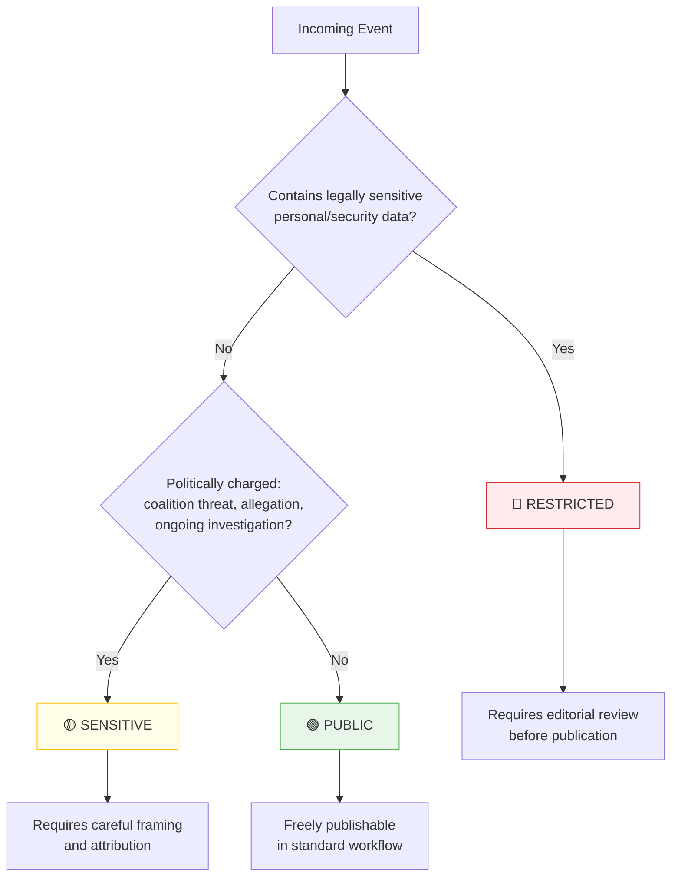
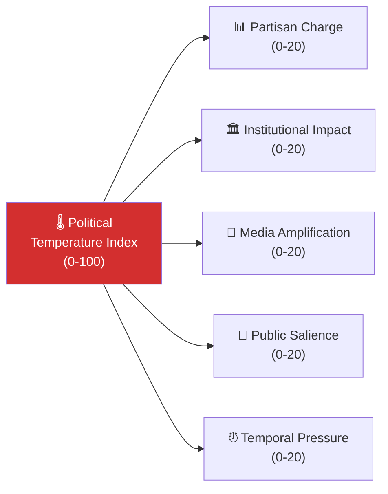
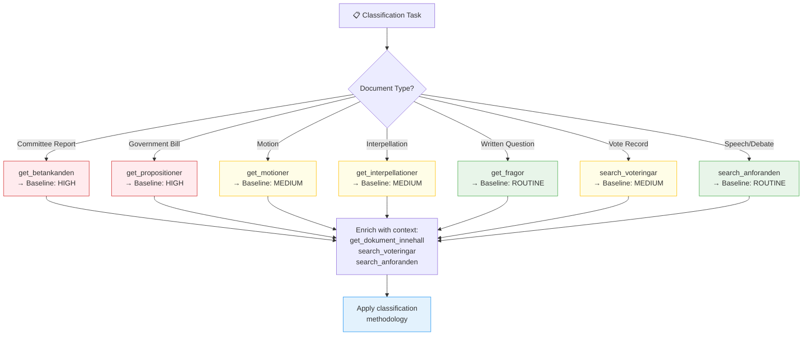
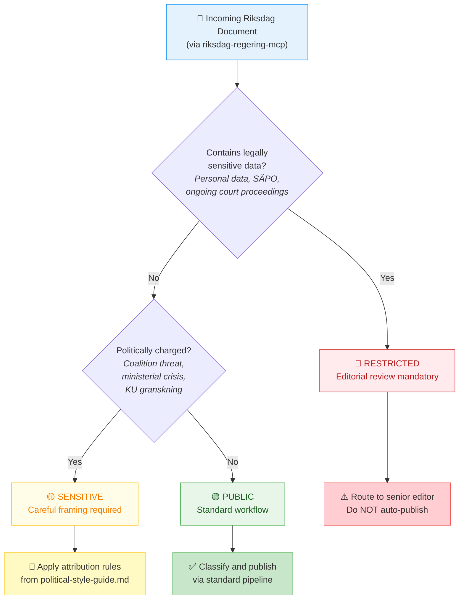
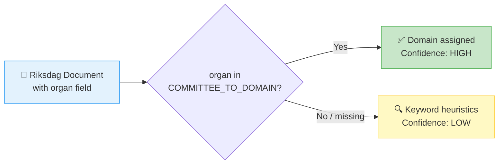

<p align="center">
  
</p>

<h1 align="center">🏷️ Political Classification Guide</h1>

<p align="center">
  <strong>📊 Multi-Dimensional Classification for Swedish Parliamentary Events</strong><br>
  <em>🎯 Sensitivity · Domain · Urgency · Political Temperature · Strategic Significance</em>
</p>

<p align="center">
  <a href="#"></a>
  <a href="#"></a>
  <a href="#"></a>
  <a href="#"></a>
</p>

**📋 Document Owner:** CEO | **📄 Version:** 2.5 | **📅 Last Updated:** 2026-04-25 (UTC)  
**🔄 Review Cycle:** Quarterly | **⏰ Next Review:** 2026-09-01  
**🏢 Owner:** Hack23 AB (Org.nr 5595347807) | **🏷️ Classification:** Public

---

<!-- BEGIN AI-FIRST METHODOLOGY CARD -->

## 🎯 AI-FIRST Methodology Card

> **🚦 Read this card before writing a single paragraph.** It names the artifact this methodology owns, the gate check it satisfies, the evidence-density target it must hit, and the Pass-1 / Pass-2 discipline required by `.github/copilot-instructions.md` §5 (AI-FIRST Quality Principle).

| Field | Value |
|-------|-------|
| **Purpose** | 7-dimension event classification (sensitivity, democratic integrity, policy urgency, economic impact, governance impact, political capital, legislative impact) — Step 3 of the AI-driven pipeline. |
| **Inputs** | Per-document analyses (Family E); incoming Riksdag/Government documents; sensitivity policy in [`Hack23 ISMS CLASSIFICATION.md`](https://github.com/Hack23/ISMS-PUBLIC/blob/main/CLASSIFICATION.md) |
| **Outputs** | `classification-results.md` (Family A) and per-document classification headers (Family E) |
| **Owning artifact(s)** | `classification-results.md` |
| **Owning gate check** | Check 1 (existence) + Check 4 cross-reference when classification feeds SWOT/significance |
| **Citation density target** | Every classification row cites ≥ 1 `dok_id` and the dimension-specific evidence (e.g. KU document + named MP for Democratic Integrity) |
| **Banned phrases** | Enforced via [`political-style-guide.md` §Machine-readable banned-phrase list](political-style-guide.md#-machine-readable-banned-phrase-list) |
| **Threshold source** | [`reference-quality-thresholds.json`](reference-quality-thresholds.json) → `thresholds[articleType][artifact]` (fallback `defaults.coreArtifactFloor`) |

### ✅ Pass-1 checklist (creation — minimal viable artifact)

- [ ] Score every document on all 7 dimensions; do not omit dimensions even when low-impact
- [ ] Tag sensitivity using the 4-level ladder (`Public / Internal / Confidential / Restricted`)
- [ ] Produce every required sub-section listed in the owning template
- [ ] Add ≥ 1 evidence anchor (`dok_id`, vote id, named MP, or primary-source URL) per analytical claim
- [ ] Apply the correct WEP confidence band for the run's horizon (`72h / week / month / quarter / year / cycle`)
- [ ] Include ≥ 1 themed Mermaid diagram with `style …` or `themeVariables` config (where structurally meaningful)
- [ ] Cross-link the relevant template under `analysis/templates/` and the gate check it satisfies

### 🔁 Pass-2 checklist (read-back & improve — AI-FIRST mandatory)

- [ ] Cross-check sensitivity tag against `Hack23 ISMS CLASSIFICATION.md` for parity
- [ ] For high-urgency events (Urgency=4-5) confirm forward-indicator coverage in Family D
- [ ] Re-read the file end-to-end; flag every claim that lacks an evidence anchor and add one
- [ ] Replace every banned phrase listed in [`political-style-guide.md` §Machine-readable banned-phrase list](political-style-guide.md#-machine-readable-banned-phrase-list) with an evidence-anchored alternative
- [ ] Tighten WEP language: never above **likely** without ≥ 3 cycle-aged sources for `year`/`cycle` horizons
- [ ] Strengthen Mermaid (color-coded `style …` directives, `themeVariables`, ≥ 5 nodes where the structure admits it)
- [ ] Add ≥ 1 second-order effect, cui-bono note, or counterfactual where the artifact admits one
- [ ] Verify citation density meets the per-file target below and the gate's evidence-density rules

### 🟢 Exemplar (good — pattern-match this)

> _(classification row)_ "`H902KU14` — Sensitivity=Public; Democratic Integrity=4 (KU oversight petition, Bergstrand (V) 2026-04-19); Policy Urgency=3; Legislative Impact=2 (committee referral pending). Evidence: riksdagen.se/dok/H902KU14 ([A1])."

### 🔴 Anti-exemplar (failure mode — never ship this)

> _(failure mode)_ "This is an important matter for democratic process." — no dimensions scored, no `dok_id`, no MP, no sensitivity tag.

### 🔗 Cross-links

- **Template(s)**: `analysis/templates/political-classification.md`
- **Gate check**: [`.github/prompts/05-analysis-gate.md`](../../.github/prompts/05-analysis-gate.md#checks-all-must-pass)
- **AI-FIRST canon**: [`.github/copilot-instructions.md` §5](../../.github/copilot-instructions.md) · [`ai-driven-analysis-guide.md`](ai-driven-analysis-guide.md)
- **Style canon**: [`political-style-guide.md`](political-style-guide.md) · [`osint-tradecraft-standards.md`](osint-tradecraft-standards.md)
- **Catalog row**: [`artifact-catalog.md`](artifact-catalog.md)

<!-- END AI-FIRST METHODOLOGY CARD -->

---


## 🔄 Tradecraft Anchors

| Element | Value | Reference |
|---------|-------|-----------|
| **F3EAD Stage** | **FINISH** | Classification is the first analytical step after document-identity establishment |
| **PIRs Served** | Classification outputs feed PIR prioritization — high Democratic Integrity → PIR-7; high Coalition Impact → PIR-1 | See [`political-style-guide.md` §PIR/EEI Catalog](political-style-guide.md#-priority-intelligence-requirements-pir--essential-elements-of-information-eei) |
| **Admiralty Floor** | Classification claims require ≥[A1] (primary document) plus ≥[B2] context | See [`political-style-guide.md` §Admiralty Code](political-style-guide.md#-admiralty-source-reliability-code-nato-stanag-2022) |
| **WEP Requirement** | Strategic Significance Assessment uses WEP language for probability of impact | See [`political-style-guide.md` §WEP + ODNI](political-style-guide.md#-words-of-estimative-probability-wep--odni-confidence-overlay) |
| **ICD 203 Gate** | Standard 1 (source quality), 8 (accurate judgments) | See [`political-style-guide.md` §ICD 203](political-style-guide.md#-icd-203-analytic-tradecraft-standards-mapping) |
| **SAT(s)** | Quality of Information Check | See [`political-style-guide.md` §SATs](political-style-guide.md#-structured-analytic-techniques-sats-catalog) |

---

## 🎯 Purpose

This guide provides the authoritative **multi-dimensional classification methodology** for Swedish parliamentary events processed by Riksdagsmonitor's agentic workflows. Classification is the **first analytical step** — all subsequent risk assessment, threat analysis, and significance scoring depend on accurate initial classification.

Beyond basic sensitivity/domain/urgency, this methodology includes:
- **Political Temperature Index** — a composite score measuring how politically heated an event is
- **Strategic Significance Assessment** — evaluating long-term importance vs. short-term news value
- **Coalition Impact Vector** — which direction does this push coalition dynamics?

This methodology is inspired by [Hack23 ISMS CLASSIFICATION.md](https://github.com/Hack23/ISMS-PUBLIC/blob/main/CLASSIFICATION.md). See [reference/isms-classification-adaptation.md](../reference/isms-classification-adaptation.md) for the full mapping.

---

## 🔒 Sensitivity Levels

Political sensitivity levels are analogous to ISMS confidentiality levels, adapted for a public transparency platform:



### 🟢 PUBLIC

**Definition:** Routine parliamentary activity that is fully public record, non-controversial, and freely publishable without additional editorial controls.

**Examples:**
- Standard committee betänkanden (committee reports) without partisan controversy
- Routine interpellationer with standard ministerial responses
- Published SOU (Statens offentliga utredningar) reports
- Budget implementation reports with no surprise findings
- New legislation that passed with broad cross-party support

**ISMS Analogy:** Public / TLP:WHITE — no restrictions on distribution

---

### 🟡 SENSITIVE

**Definition:** Events that are politically charged, involve ongoing controversies, contain allegations against named politicians, or could be misrepresented without careful framing.

**Classification Triggers (any one is sufficient):**
- Event directly threatens coalition stability
- Named politician faces formal allegation or KU granskning
- Sensitive migration, crime, or security policy dimensions
- Significant partisan disagreement between coalition partners
- EU compliance concerns raised
- Budget figures significantly different from projections

**ISMS Analogy:** Internal / TLP:GREEN — share within editorial team only

---

### 🔴 RESTRICTED

**Definition:** Events with legal sensitivity, active security dimensions, potential personal data exposure, or that could cause direct harm if published without expert review.

**Classification Triggers:**
- Active criminal investigation involving a politician
- National security information (defence, SÄPO)
- Personal data of private individuals (not politicians acting in public role)
- Information subject to ongoing court proceedings (rättegång)
- Content that may constitute defamation without additional verification

**ISMS Analogy:** Confidential / TLP:RED — editorial review mandatory before any publication

---

## 📋 Policy Domain Taxonomy

> ⚠️ **Title-Only Classification Warning**: Domain classification from document titles alone has a ~40% error rate (observed 2026-04-15: housing motions misclassified as labour, asylum motions misclassified as insurance). **Title-only classification is LOW confidence.** To achieve MEDIUM or higher confidence, the classifier MUST read the document summary or full text via `get_dokument_innehall`. When only the title is available, classification MUST include the label `[LOW confidence — title only]`.

Sweden's 13 parliamentary domain codes, aligned with Riksdag committee structure:

- **ECO – Economics & Finance** (FiU oversight)
  - Budget process
  - Taxation
  - Monetary policy
- **DEF – Defence & Security** (FöU oversight)
  - Military capability
  - NATO commitments
  - Civil defence
- **JUS – Justice & Law** (JuU oversight)
  - Criminal law
  - Courts
  - Police reform
- **SOC – Social Policy** (SoU oversight)
  - Welfare benefits
  - Pension system
  - Disability rights
- **HEA – Health** (SoU/HEaU oversight)
  - Healthcare funding
  - Public health
  - Pharmaceuticals
- **EDU – Education** (UbU oversight)
  - School reform
  - University funding
  - Research policy
- **ENV – Environment** (MJU oversight)
  - Climate targets
  - Biodiversity
  - Water quality
- **AGR – Agriculture** (MJU/NäU oversight)
  - Farm subsidies
  - Food security
  - Fishing rights
- **INF – Infrastructure** (TU oversight)
  - Transport
  - Housing
  - Digital infrastructure
- **ENE – Energy** (NäU oversight)
  - Nuclear policy
  - Renewable targets
  - Grid capacity
- **FOR – Foreign Affairs** (UU oversight)
  - EU relations
  - Bilateral treaties
  - NATO coordination
- **MIG – Migration** (SfU oversight)
  - Asylum policy
  - Integration
  - Border control
- **CON – Constitution** (KU oversight)
  - Electoral law
  - Government formation
  - Parliamentary procedure

### Domain Assignment Rules

1. **Always assign a primary domain** — if ambiguous, choose the domain of the lead committee
2. **Secondary domains** are optional but recommended when event touches multiple areas
3. **CON (Constitution)** takes precedence as primary when constitutional norms are at stake
4. **DEF (Defence)** takes precedence for national security events regardless of secondary domain
5. When in doubt, check which Riksdag **committee** (utskott) has jurisdiction

---

## ⏰ Urgency Matrix

Urgency is assessed against the **Swedish legislative calendar** and real-world impact timelines:

| Urgency Level | Legislative Trigger | Real-World Trigger | Max Delay to Classify |
|--------------|--------------------|--------------------|----------------------|
| ⚪ **ROUTINE** | Motion filed; SOU published | No immediate action required | 24–48 hours |
| 🔵 **ELEVATED** | Committee report published; debate scheduled | Government response expected within 2 weeks | 4–8 hours |
| 🟠 **URGENT** | Vote scheduled within 48 hours | Immediate government or policy action required | 1–2 hours |
| 🔴 **CRITICAL** | Constitutional crisis; emergency session called | Acute national security or democracy event | Immediate |

### Swedish Legislative Calendar Markers

Key dates that automatically elevate urgency:

- **September 20**: Budget Proposition (Budgetproposition) — **ELEVATED** minimum
- **October**: Committee review period — **ROUTINE** unless contested
- **November**: Riksdag budget vote — **URGENT** minimum for budget items
- **April**: Spring Amending Budget — **ELEVATED** minimum
- **June**: Spring session close — **ELEVATED** for pending legislation
- **September (election year)**: Riksdag election — **CRITICAL** political environment

### Election 2026 Urgency Boosts

In the **12 months before September 2026**, apply urgency boost rules for electoral sensitivity:

| Document Type | Normal Urgency | Election-Year Boost | Boost Condition |
|--------------|:--------------:|:-------------------:|:----------------|
| Budget propositions | ELEVATED | URGENT | Within 6 months of election |
| Coalition agreements / breakdowns | URGENT | CRITICAL | Any time |
| Welfare, healthcare, migration policy | ROUTINE/ELEVATED | +1 tier | Voter salience > HIGH |
| Criminal justice reform | ELEVATED | URGENT | If sentencing/police scope is national |
| Constitutional amendments | ELEVATED | CRITICAL | Any time |
| Government confidence votes | CRITICAL | CRITICAL | No boost needed — always CRITICAL |
| Ministerial appointments/resignations | ELEVATED | URGENT | Within 3 months of election |

> **Boost rationale:** Electoral proximity makes politically salient events more consequential for public discourse and editorial routing. Analysts MUST apply the election-year boost and document the rationale.

---

## 📊 Impact Scope Assessment

Use the following evidence-based criteria to assign impact scope:

| Scope | Geographic | Affected Population | International Dimension |
|-------|-----------|---------------------|------------------------|
| 🏘️ **LOCAL** | Single municipality/region | <100,000 affected | None |
| 🇸🇪 **NATIONAL** | Whole of Sweden | 100K–10.5M affected | None or minor |
| 🇪🇺 **EU** | Sweden + EU implications | Swedish + EU dimension | EU directive, ECJ, Commission |
| 🌍 **INTERNATIONAL** | Global dimension | International treaty | NATO, UN, bilateral |

---

## 🤖 Automated Classification (Scripts Reference)

The following scripts provide automated first-pass classification:

| Script | Function | Output |
|--------|----------|--------|
| `scripts/analysis-framework/index.ts` | Main analysis pipeline entry | Classification JSON |
| `scripts/analysis-framework/lenses/citizen.ts` | Citizen impact lens | Sensitivity indicator |
| `scripts/analysis-framework/lenses/economic.ts` | Economic domain classifier | Domain codes |
| `scripts/analysis-framework/lenses/government.ts` | Government action classifier | Urgency indicator |
| `scripts/analysis-framework/lenses/international.ts` | International scope checker | Scope level |
| `scripts/analysis-framework/lenses/opposition.ts` | Opposition response classifier | Political temperature |
| `scripts/analysis-framework/lenses/media.ts` | Media salience estimator | Public interest score |
| `scripts/analysis-framework/types.ts` | TypeScript type definitions | Classification schema |

**Automated classifications should always be reviewed** for SENSITIVE and RESTRICTED levels before workflow propagation.

---

## 🔗 Related Documents

- [templates/political-classification.md](../templates/political-classification.md) — Classification template
- [templates/per-file-political-intelligence.md](../templates/per-file-political-intelligence.md) — Per-file analysis template with classification section
- [reference/isms-classification-adaptation.md](../reference/isms-classification-adaptation.md) — ISMS mapping
- [political-risk-methodology.md](political-risk-methodology.md) — Risk scoring (uses classification output)
- [political-style-guide.md](political-style-guide.md) — Writing standards for each sensitivity level
- [ai-driven-analysis-guide.md](ai-driven-analysis-guide.md) — Per-file AI analysis protocol

---

## 🤖 AI Analysis Protocol for Classification

The AI agent **MUST** follow this protocol when classifying political documents:

1. **Read this guide** — understand sensitivity levels, domain taxonomy, urgency matrix, AND the advanced dimensions below
2. **Extract key fields** from the document (title, type, committee, parties involved, date)
3. **Determine sensitivity** — PUBLIC (default), SENSITIVE (triggers apply), RESTRICTED (editorial review)
4. **Assign primary domain** + up to 2 secondary domains from the 15-domain `DomainKey` taxonomy (see §Committee→Domain Canonical Mapping below)
5. **Assess urgency** using the calendar-aware urgency matrix
6. **Calculate Political Temperature Index** — composite score from 5 temperature indicators
7. **Assess Strategic Significance** — distinguish short-term news value from long-term importance
8. **Determine Coalition Impact Vector** — which direction does this push coalition dynamics?
9. **Score significance** per the 5-dimension rubric in `significance-scoring.md`

### Borderline Classification Guidance

When a document falls between two classification levels:

| Scenario | Resolution |
|----------|-----------|
| SENSITIVE vs. RESTRICTED | If any single trigger exceeds threshold, classify as RESTRICTED. When in doubt, err toward higher classification. |
| ROUTINE vs. ELEVATED urgency | Check the legislative calendar — if within 2 weeks of a major vote, use ELEVATED. |
| Domain ambiguity | Assign the domain with strongest evidence as primary; use secondary domains for remaining relevance. CON (Constitution) and DEF (Defence) always take precedence when applicable. |
| Manual vs. automated score divergence (>3 points) | Use the higher score and flag for human editorial review with a note explaining the divergence. |

---

## 🌡️ Advanced Dimension 1: Political Temperature Index

The Political Temperature Index (PTI) is a **composite score (0–100)** measuring how politically heated an event is — beyond simple sensitivity classification:



| Temperature Component | Score Range | Assessment Criteria |
|----------------------|:----------:|---------------------|
| **Partisan Charge** | 0–20 | How divided are parties? (0=consensus, 20=deep partisan division) |
| **Institutional Impact** | 0–20 | Does this affect democratic institutions? (0=routine, 20=constitutional crisis) |
| **Media Amplification** | 0–20 | Is media likely to amplify? (0=below radar, 20=front-page scandal) |
| **Public Salience** | 0–20 | Does the public care? (0=technical, 20=pocketbook/safety issue) |
| **Temporal Pressure** | 0–20 | How urgent is action? (0=no deadline, 20=imminent crisis) |

### Temperature Classification

| PTI Score | Temperature | Colour | Implication |
|:---------:|:----------:|:------:|------------|
| 0–20 | ❄️ Cold | 🔵 Blue | Routine; standard monitoring |
| 21–40 | 🌤️ Warm | 🟢 Green | Active interest; regular reporting |
| 41–60 | 🔥 Hot | 🟡 Yellow | Politically significant; priority analysis |
| 61–80 | 🔥🔥 Very Hot | 🟠 Orange | Crisis-adjacent; intensive monitoring |
| 81–100 | 🌋 Explosive | 🔴 Red | Constitutional/political crisis; immediate response |

---

## 🎯 Advanced Dimension 2: Strategic Significance Assessment

Not all politically heated events have long-term significance, and some seemingly routine events have major strategic importance. Distinguish **news value** (short-term) from **strategic significance** (long-term):

| Dimension | News Value (Short-Term) | Strategic Significance (Long-Term) |
|-----------|------------------------|-----------------------------------|
| **Time horizon** | Today's headlines | Next 6–24 months |
| **Question** | "Will this make the news?" | "Will this change the political landscape?" |
| **Indicators** | Media interest, public reaction | Institutional change, precedent setting |
| **Example (high news, low strategic)** | Minister's gaffe goes viral | "Temporary embarrassment, no policy change" |
| **Example (low news, high strategic)** | Technical SOU on pension reform | "Quietly reshapes retirement policy for 10M Swedes" |

### Strategic Significance Score (1–5)

| Score | Level | Criteria |
|:-----:|-------|---------|
| 1 | **Ephemeral** | No lasting impact; forgotten within a week |
| 2 | **Routine** | Standard political activity; minor adjustments |
| 3 | **Significant** | Affects a policy domain meaningfully for 6+ months |
| 4 | **Major** | Reshapes political dynamics; affects coalition/opposition positioning |
| 5 | **Transformative** | Changes Swedish governance, institutions, or democratic norms |

---

## 🧭 Advanced Dimension 3: Coalition Impact Vector

For every classified event, assess its impact on coalition dynamics using a **directional vector**:

| Vector | Description | Example |
|--------|------------|---------|
| **→ Stabilising** | Strengthens coalition cohesion or majority | Budget passes with full coalition + SD support |
| **← Destabilising** | Weakens coalition cohesion or threatens majority | SD publicly criticises government on migration |
| **↕ Neutral** | No significant impact on coalition dynamics | Routine committee report on agriculture |
| **↗ Opportunity** | Creates an opening for coalition to strengthen position | Popular policy initiative with cross-party support |
| **↘ Vulnerability** | Exposes coalition weakness that opposition may exploit | KU investigation reveals government negligence |

---

## 📡 MCP Data Sources for Classification

The `riksdag-regering-mcp` server provides direct access to Swedish parliamentary data for classification. Each Riksdag document type maps to a specific MCP tool and carries a default classification baseline:

| Riksdag Document Type | MCP Tool | Classification Baseline | Elevation Triggers |
|----------------------|----------|------------------------|-------------------|
| **Betänkande** (committee report) | `get_betankanden` | HIGH | Fiscal policy (FiU), constitutional matters (KU) |
| **Proposition** (government bill) | `get_propositioner` | HIGH | All government bills carry legislative weight |
| **Motion** (parliamentary motion) | `get_motioner` | MEDIUM | Cross-party co-sponsorship; opposition joint motions |
| **Interpellation** | `get_interpellationer` | MEDIUM | Ministerial evasion; repeated follow-up questions |
| **Skriftlig fråga** (written question) | `get_fragor` | ROUTINE | Elevated for oral questions (muntlig fråga) |
| **Votering** (vote record) | `search_voteringar` | MEDIUM | Contested votes; coalition splits; narrow margins |
| **Anförande** (speech/debate) | `search_anforanden` | ROUTINE | Elevated for party leader statements; budget debates |

### Committee-Specific Baseline Elevations

The 16 standing committees (utskott) influence classification baseline:

| Committee | Code | Default Elevation | Rationale |
|-----------|------|-------------------|-----------|
| Finansutskottet | FiU | +1 level | Budget and fiscal policy |
| Justitieutskottet | JuU | +1 level | Criminal law and courts |
| Konstitutionsutskottet | KU | +1 level | Constitutional oversight (granskning) |
| Socialförsäkringsutskottet | SfU | Context-dependent | Migration policy sensitivity |
| Utrikesutskottet | UU | +1 level | Foreign policy, NATO, EU |
| Försvarsutskottet | FöU | +1 level | Defence and national security |
| Socialutskottet | SoU | Standard | Unless healthcare crisis |
| Utbildningsutskottet | UbU | Standard | Unless school reform controversy |
| Miljö- och jordbruksutskottet | MJU | Standard | Unless climate policy debate |
| Näringsutskottet | NäU | Context-dependent | Energy and nuclear policy sensitivity |
| Trafikutskottet | TU | Standard | Unless major infrastructure controversy |
| Skatteutskottet | SkU | +1 level | Tax policy impacts all citizens |
| Arbetsmarknadsutskottet | AU | Context-dependent | Labour market sensitivity |
| Civilutskottet | CU | Standard | Unless housing crisis |
| Kulturutskottet | KrU | Standard | Unless media/press freedom |
| EU-nämnden | EUN | +1 level | EU mandate decisions |

---

## 🔄 MCP-Integrated Classification Workflow

When using `riksdag-regering-mcp` tools for automated classification, follow this step-by-step protocol:

1. **Read this guide** — understand sensitivity levels, domain taxonomy, urgency matrix, and all advanced dimensions
2. **Extract key fields** using MCP tools — fetch document metadata (title, `dok_id`, `doktyp`, committee/`organ`, parties involved, date/`datum`)
3. **Determine sensitivity level** — apply the decision tree: PUBLIC (default), SENSITIVE (any trigger from §2 applies), RESTRICTED (requires editorial review before publication)
4. **Assign primary policy domain** from the Swedish 16-committee taxonomy (FiU→ECO, JuU→JUS, KU→CON, FöU→DEF, UU→FOR, SfU→MIG, etc.)
5. **Assess urgency** using the parliamentary calendar — cross-reference `get_calendar_events` for upcoming votes and debates
6. **Score significance** per the 5-dimension rubric: Partisan Charge, Institutional Impact, Media Amplification, Public Salience, Temporal Pressure

### MCP Tool Selection by Document Type



---

## 🔀 Sensitivity Level Decision Tree (MCP-Enhanced)

Use this decision tree when processing documents fetched via `riksdag-regering-mcp`:



---

## ⚖️ Borderline Classification Guidance (MCP Context)

When automated classification via MCP tools produces ambiguous results:

| Scenario | Resolution | MCP Verification |
|----------|-----------|-----------------|
| **SENSITIVE vs. RESTRICTED** | Err toward RESTRICTED (higher classification). If any single trigger exceeds threshold, classify RESTRICTED. | Cross-reference `search_voteringar` for contested votes; check `get_interpellationer` for ministerial evasion patterns |
| **ROUTINE vs. ELEVATED urgency** | Check parliamentary calendar — within 2 weeks of major vote → ELEVATED | Use `get_calendar_events` to verify upcoming Riksdag schedule |
| **Domain ambiguity** | Assign strongest-evidence domain as primary; use secondary domains for remaining relevance. `constitutional` and `defence` always take precedence. | Verify committee assignment via `get_dokument` metadata (`organ` field) |
| **Manual vs. automated divergence** | Use the higher score and flag for human editorial review with divergence note | Compare MCP-extracted data against manual analysis; document discrepancy |

---

## ⚠️ Classification Quality Gate

> **🚫 Anti-Pattern Warning:** Classification output without **all three** of the following is **REJECTED** by the pipeline:
> 1. **Explicit sensitivity level** (PUBLIC / SENSITIVE / RESTRICTED)
> 2. **Domain key** from the 15-domain `DomainKey` taxonomy (`fiscal`, `defence`, `justice`, `healthcare`, `education`, `environment`, `labour`, `housing`, `transport`, `trade`, `eu-foreign`, `migration`, `constitutional`, `culture`, `social-insurance`) — see §Committee→Domain Canonical Mapping
> 3. **Urgency level** (ROUTINE / ELEVATED / URGENT / CRITICAL)
>
> Incomplete classifications are returned to the originating agent for remediation. No downstream processing (risk scoring, significance assessment, publication) proceeds until all three fields are present.

---

## 🏛️ Committee→Domain Canonical Mapping (v2.2)

This table is the **authoritative single source of truth** for mapping Riksdag committee codes to policy domains. Both the TypeScript classification code (`scripts/data-transformers/constants/committee-names.ts: COMMITTEE_TO_DOMAIN`) and AI analysis agents reference this table. Any discrepancy should be resolved by updating the code to match this document.

### Primary Mapping: 15 Riksdag Committees → Policy Domains

| Committee Code | Committee Name (Swedish) | Committee Name (English) | Domain Key | Domain Display Name | Classification Priority |
|:---:|:---|:---|:---:|:---|:---:|
| **AU** | Arbetsmarknadsutskottet | Committee on Labour Market Affairs | `labour` | Labour Market | Standard |
| **CU** | Civilutskottet | Committee on Civil Affairs | `housing` | Housing & Civil Law | Standard |
| **FiU** | Finansutskottet | Committee on Finance | `fiscal` | Fiscal Policy | **Elevated** (budget) |
| **FöU** | Försvarsutskottet | Committee on Defence | `defence` | Defence & Security | **Elevated** (security) |
| **JuU** | Justitieutskottet | Committee on Justice | `justice` | Justice & Law | Standard |
| **KU** | Konstitutionsutskottet | Committee on the Constitution | `constitutional` | Constitutional Affairs | **Elevated** (oversight) |
| **KrU** | Kulturutskottet | Committee on Cultural Affairs | `culture` | Culture & Media | Standard |
| **MJU** | Miljö- och jordbruksutskottet | Committee on Environment and Agriculture | `environment` | Environment & Agriculture | Standard |
| **NU** | Näringsutskottet | Committee on Industry and Trade | `trade` | Industry & Trade | Standard |
| **SkU** | Skatteutskottet | Committee on Taxation | `fiscal` | Fiscal Policy | **Elevated** (taxation) |
| **SfU** | Socialförsäkringsutskottet | Committee on Social Insurance | `social-insurance` | Social Insurance | Standard |
| **SoU** | Socialutskottet | Committee on Social Affairs | `healthcare` | Healthcare & Social Affairs | Standard |
| **TU** | Trafikutskottet | Committee on Transport | `transport` | Transport & Infrastructure | Standard |
| **UbU** | Utbildningsutskottet | Committee on Education | `education` | Education & Research | Standard |
| **UU** | Utrikesutskottet | Committee on Foreign Affairs | `eu-foreign` | EU & Foreign Affairs | **Elevated** (external) |

### Classification Priority Notes

- **Elevated committees** (FiU, FöU, KU, SkU, UU) produce documents that default to **ELEVATED urgency** baseline due to their institutional significance
- **FiU + SkU** both map to `fiscal` domain — the committee code distinguishes spending (FiU) from revenue (SkU) context
- **KU** documents involving _granskning_ (constitutional review) default to **SENSITIVE** classification

### Usage in Classification Pipeline



**Rule:** Committee-code classification is always **PRIMARY** (HIGH confidence). Keyword-based domain detection is **FALLBACK** only (LOW confidence). When both are present, the committee-code result takes precedence.

### Code Reference

```typescript
// Source: scripts/data-transformers/constants/committee-names.ts
export const COMMITTEE_TO_DOMAIN = {
  AU: 'labour',
  CU: 'housing',
  FiU: 'fiscal',
  FöU: 'defence',
  JuU: 'justice',
  KU: 'constitutional',
  KrU: 'culture',
  MJU: 'environment',
  NU: 'trade',
  SkU: 'fiscal',
  SfU: 'social-insurance',
  SoU: 'healthcare',
  TU: 'transport',
  UbU: 'education',
  UU: 'eu-foreign'
} as const;
```

> **Maintenance rule:** If a new committee is created or an existing committee is renamed, update BOTH this table AND the TypeScript constant in the same PR.

---

**Document Control:**  
- **Path:** `/analysis/methodologies/political-classification-guide.md`  
- **ISMS Reference:** [CLASSIFICATION.md](https://github.com/Hack23/ISMS-PUBLIC/blob/main/CLASSIFICATION.md)  
- **Version:** 2.3  
- **Advanced Dimensions:** Political Temperature Index, Strategic Significance, Coalition Impact Vector, Election 2026 Context  
- **Key Changes v2.3:** Added Election 2026 classification context (electoral sensitivity boost rules for pre-election period), 5-level confidence scale integration, enhanced urgency criteria for election-year events  
- **Key Changes v2.2:** Committee→Domain Canonical Mapping (15 committees with domain keys, classification priorities, Mermaid pipeline diagram, code reference)  
- **MCP Integration:** riksdag-regering-mcp tool mapping, committee-specific baselines  
- **Classification:** Public  
- **Next Review:** 2026-09-01
