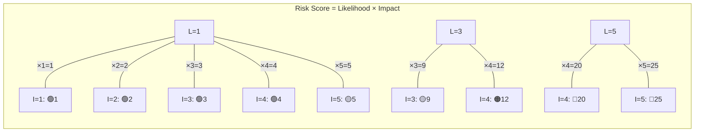
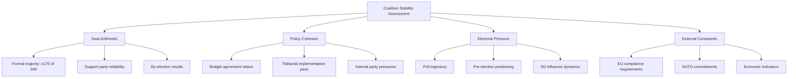
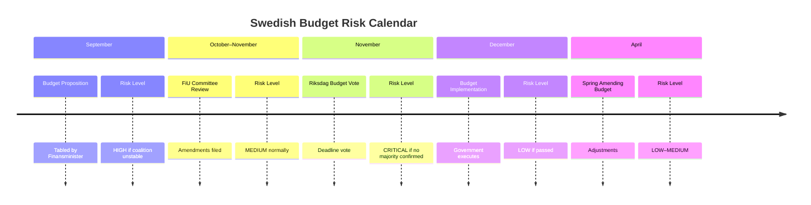

  

<h1 align="center">⚠️ Political Risk Assessment Methodology</h1>

  <strong>📊 Likelihood × Impact Scoring for Swedish Parliamentary Risk</strong> 
  <em>🎯 Coalition · Policy · Budget · Electoral Risk Quantification</em>

  
  
  
  

**📋 Document Owner:** CEO | **📄 Version:** 1.0 | **📅 Last Updated:** 2026-03-26 (UTC)  
**🔄 Review Cycle:** Quarterly | **⏰ Next Review:** 2026-06-26  
**🏢 Owner:** Hack23 AB (Org.nr 5595347807) | **🏷️ Classification:** Public

---

## 🎯 Purpose

This methodology provides the authoritative framework for political risk assessment in Riksdagsmonitor's analytical workflows. It adapts the quantitative Likelihood × Impact approach from [Hack23 ISMS Risk_Assessment_Methodology.md](https://github.com/Hack23/ISMS-PUBLIC/blob/main/Risk_Assessment_Methodology.md) to the unique dynamics of Swedish parliamentary politics.

See [reference/isms-risk-assessment-adaptation.md](../reference/isms-risk-assessment-adaptation.md) for the complete ISMS-to-political mapping.

---

## 📐 Core Methodology: Likelihood × Impact

All political risks are scored using a **5×5 matrix**. Risk Score = Likelihood × Impact.

### Likelihood Scale (1–5)

| Score | Label | Definition | Parliamentary Analogy |
|:-----:|-------|------------|----------------------|
| 1 | **Rare** | <5% probability in assessment window | Coalition collapse with 176-seat majority |
| 2 | **Unlikely** | 5–20% probability | Budget vote fails despite coalition agreement |
| 3 | **Possible** | 21–40% probability | SD defects on single non-budget vote |
| 4 | **Likely** | 41–70% probability | Opposition files no-confidence motion when polls shift |
| 5 | **Almost Certain** | >70% probability | Government proposes budget in September |

### Impact Scale (1–5)

| Score | Label | Definition | Political Example |
|:-----:|-------|------------|------------------|
| 1 | **Negligible** | Routine disruption; normal operations continue | Minor committee delay |
| 2 | **Minor** | Moderate disruption; corrective action straightforward | Single bill rejected; government re-submits |
| 3 | **Moderate** | Significant disruption; coalition relationship strained | Major budget amendment forced by opposition |
| 4 | **Major** | Severe disruption; coalition integrity threatened | Minister forced to resign |
| 5 | **Severe** | Democratic crisis; constitutional mechanisms triggered | Government falls; extraordinary election called |

### Risk Matrix

| Score | Tier | Colour | Action |
|:-----:|------|--------|--------|
| 1–4 | **Low** | 🟢 | Monitor; mention in weekly digest |
| 5–9 | **Medium** | 🟡 | Active monitoring; flag in daily analysis |
| 10–14 | **High** | 🟠 | Priority assessment; include in news |
| 15–25 | **Critical** | 🔴 | Immediate analysis; breaking news consideration |

---

## 🤝 Coalition Stability Risk

Coalition risk is the most politically distinctive risk type in Swedish parliamentary analysis.

### Coalition Stability Factors

### Coalition Collapse Probability (90-day window)

| Likelihood of Collapse | Seat Margin | Policy Cohesion | Electoral Pressure | Combined Score |
|------------------------|:-----------:|:---------------:|:-----------------:|:--------------:|
| **LOW (<15%)** | ≥176 operational buffer | High (all parties aligned) | Low (polls stable) | L≤2, I≤3 |
| **MEDIUM (15–35%)** | 175 bare majority (no buffer) | Medium (one party strained) | Medium (5+ point poll shift) | L=3, I=3–4 |
| **HIGH (>35%)** | <175 no majority | Low (multi-party tension) | High (SD threats withdrawal) | L≥4, I≥4 |

> **Note on majority arithmetic:** A formal Riksdag majority requires **≥175 of 349 seats**. However, absences and abstentions mean that ≥176 seats provide an "operational buffer" — the practical threshold for reliable legislative passage. The table above uses this distinction: ≥176 = comfortable (LOW), exactly 175 = bare majority (MEDIUM), <175 = no majority (HIGH).

---

## 📋 Policy Implementation Risk

Policy implementation risks assess the probability that a proposed policy fails to pass, is significantly amended, or is blocked:

| Stage | Default Likelihood | Risk Amplifiers | Risk Reducers |
|-------|--------------------|-----------------|---------------|
| Proposition submitted | L=2 | Opposition majority, SD conditions | Cross-party agreement |
| Committee review | L=2 | Dissenting committee reports | Government committee majority |
| Floor debate scheduled | L=3 | No-confidence backdrop | Vote whipped by all coalition parties |
| Vote imminent | L=1–4 | Internal defections signalled | Prior vote counting confirms majority |
| Enacted | L=1 (reversal) | New government formed | Constitutional entrenchment |

---

## 💰 Budget Risk Assessment

Swedish budget risk has unique characteristics due to the Riksdag's fiscal framework:

### Budget Timeline Risk Points

**FiU (Finansutskottet) Dissent Tracking:** Track formal dissenting opinions (reservationer) filed by opposition parties. Each reservation from a coalition party signals **High** policy risk for that budget line.

---

## 🗳️ Electoral Positioning Risk

Electoral risk quantifies how political events affect parties' electoral prospects over the 4-year Swedish electoral cycle:

| Electoral Phase | Risk Focus | Key Indicators |
|----------------|------------|----------------|
| **Year 1 (post-election)** | Coalition formation stability | Cooperation agreement durability |
| **Year 2 (mid-term)** | Policy delivery credibility | Legislation passing rate; SCB data |
| **Year 3 (positioning)** | Pre-election narrative | Poll trends; party conference resolutions |
| **Year 4 (campaign)** | Electoral positioning | Budget generosity; flagship policy status |

**Note:** General elections in Sweden are held the second Sunday of September every 4 years. Current cycle: September 2022 → **September 2026**.

---

## 📊 Calibration Examples

Real Swedish political scenarios as scoring anchors:

| Scenario | Likelihood | Impact | Score | Tier | Rationale |
|----------|:----------:|:------:|:-----:|------|-----------|
| SD conditionally supports budget | 4 | 4 | 16 | 🔴 Critical | Frequent pattern; major governance impact |
| L exits coalition over migration | 2 | 5 | 10 | 🟠 High | Historically rare; would collapse government |
| Minor committee report delayed | 1 | 1 | 1 | 🟢 Low | Routine; no political consequence |
| Budget vote passes with expected margin | 4 | 1 | 4 | 🟢 Low | Likely but low-impact routine event |
| KU investigation into government minister | 3 | 3 | 9 | 🟡 Medium | Possible; damages but rarely fatal |
| No-confidence motion passes | 1 | 5 | 5 | 🟡 Medium | Very rare; catastrophic if it occurs |
| New SOU recommends major pension reform | 4 | 3 | 12 | 🟠 High | Likely publication; major policy implications |

---

## 🔗 Related Documents

- [templates/risk-assessment.md](../templates/risk-assessment.md) — Risk assessment template
- [templates/per-file-political-intelligence.md](../templates/per-file-political-intelligence.md) — Per-file analysis template with risk section
- [reference/isms-risk-assessment-adaptation.md](../reference/isms-risk-assessment-adaptation.md) — ISMS mapping
- [political-threat-framework.md](political-threat-framework.md) — Complementary threat analysis
- [political-classification-guide.md](political-classification-guide.md) — Classification (risk input)
- [ai-driven-analysis-guide.md](ai-driven-analysis-guide.md) — Per-file AI analysis protocol

---

## 🤖 AI Analysis Protocol for Risk Assessment

The AI agent **MUST** follow this protocol when performing risk assessment:

1. **Read this methodology** — understand the 5×5 matrix, calibration examples, and coalition stability factors
2. **Query MCP tools** for evidence:
   - `search_voteringar` — recent vote margins to assess coalition stability
   - `search_dokument` with `organ=FiU` — budget committee status
   - `search_dokument` with `organ=KU` — constitutional committee investigations
   - `search_anforanden` — parliamentary debate signals
   - World Bank / SCB data — economic context for budget and electoral risk
3. **Score each risk dimension** using the 5×5 matrix with evidence
4. **Apply calibration** — compare against the calibration examples above
5. **Assign overall risk level** — weighted by dimension (Coalition 0.30, Policy 0.25, Budget 0.20, Electoral 0.15, External 0.10)

### Risk-to-SWOT Integration

Risk assessment results feed directly into SWOT analysis:
- **Risk Score ≥ 15 (Critical)** → SWOT Threat entry (HIGH confidence, HIGH impact)
- **Risk Score 10–14 (High)** → SWOT Threat or Weakness entry (MEDIUM+ confidence)
- **Risk Score 5–9 (Medium)** → SWOT Weakness or Threat entry (flag for monitoring)
- **Risk Score 1–4 (Low)** → Informational only; no SWOT entry required

---

**Document Control:**  
- **Path:** `/analysis/methodologies/political-risk-methodology.md`  
- **ISMS Reference:** [Risk_Assessment_Methodology.md](https://github.com/Hack23/ISMS-PUBLIC/blob/main/Risk_Assessment_Methodology.md)  
- **Classification:** Public  
- **Next Review:** 2026-06-26
