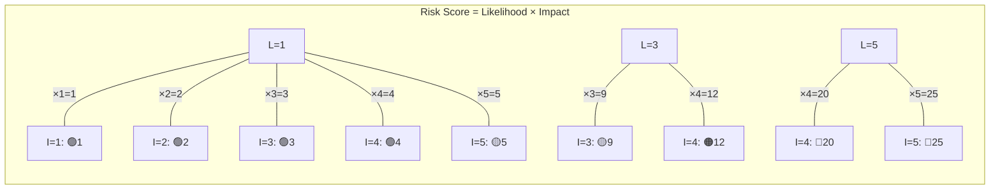
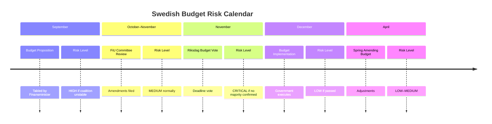
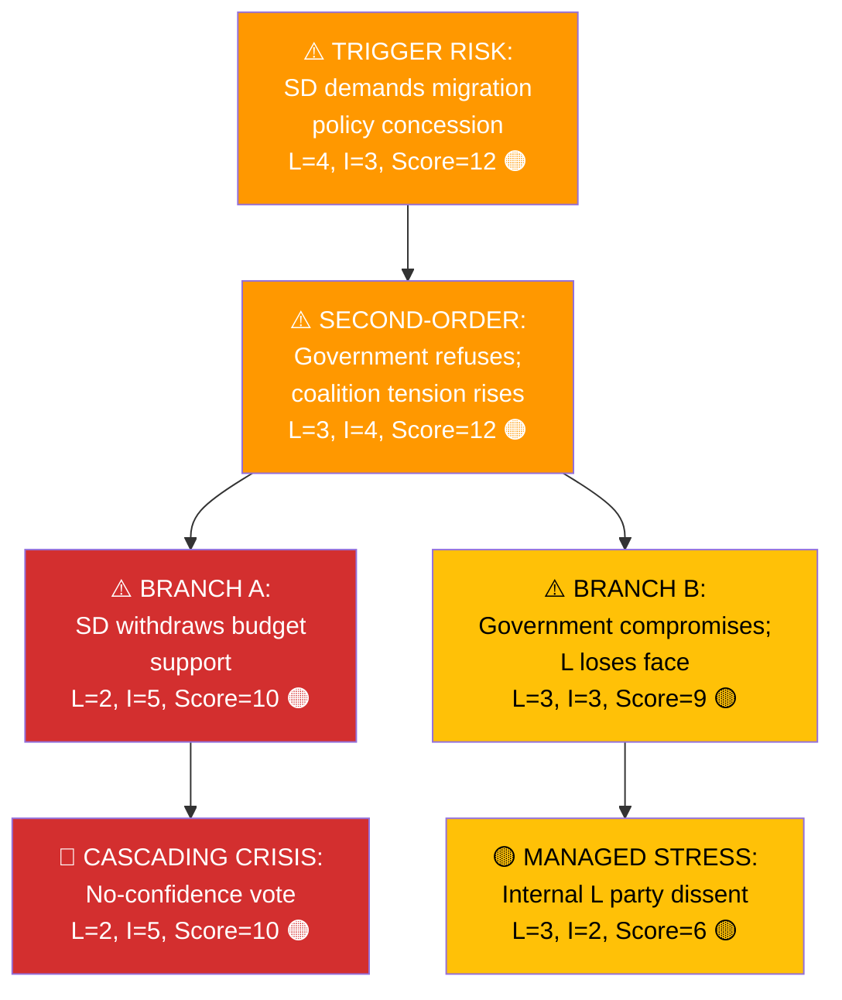
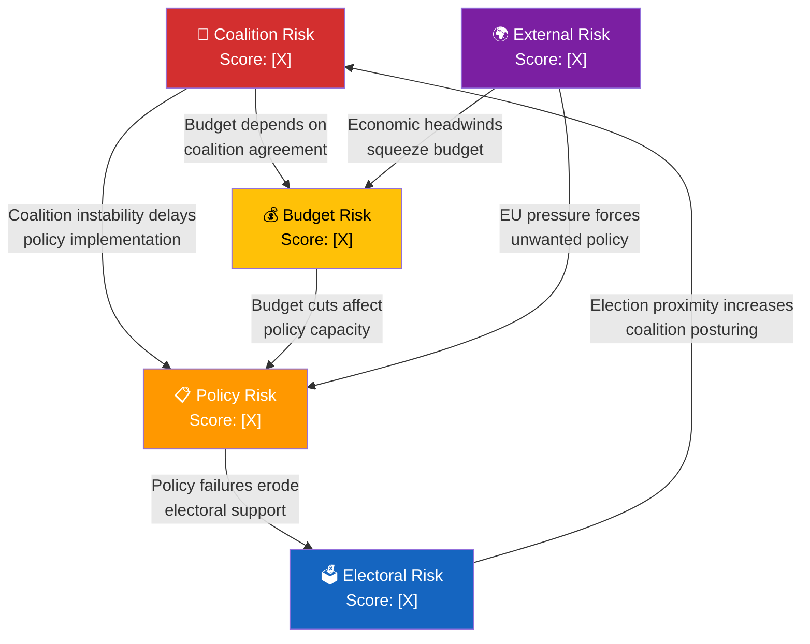
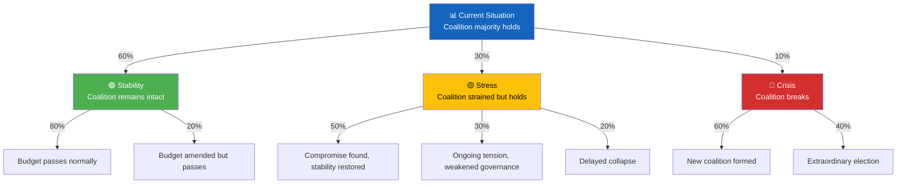
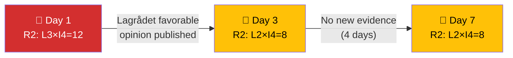

<p align="center">
  
</p>

<h1 align="center">⚠️ Political Risk Assessment Methodology</h1>

<p align="center">
  <strong>📊 Multi-Dimensional Risk Scoring for Swedish Parliamentary Intelligence</strong><br>
  <em>🎯 Cascading Risk · Bayesian Updating · Risk Interconnection · Scenario Trees</em>
</p>

<p align="center">
  <a href="#"></a>
  <a href="#"></a>
  <a href="#"></a>
  <a href="#"></a>
</p>

**📋 Document Owner:** CEO | **📄 Version:** 2.4 | **📅 Last Updated:** 2026-04-25 (UTC)  
**🔄 Review Cycle:** Quarterly | **⏰ Next Review:** 2026-09-01  
**🏢 Owner:** Hack23 AB (Org.nr 5595347807) | **🏷️ Classification:** Public

---

<!-- BEGIN AI-FIRST METHODOLOGY CARD -->

## 🎯 AI-FIRST Methodology Card

> **🚦 Read this card before writing a single paragraph.** It names the artifact this methodology owns, the gate check it satisfies, the evidence-density target it must hit, and the Pass-1 / Pass-2 discipline required by `.github/copilot-instructions.md` §5 (AI-FIRST Quality Principle).

| Field | Value |
|-------|-------|
| **Purpose** | Multi-dimensional 5×5 Likelihood × Impact risk scoring with cascading-risk and Bayesian-update overlays — Step 3–4 of the AI-driven pipeline. |
| **Inputs** | Family A synthesis; classification outputs; OSINT tradecraft (Admiralty, WEP, ICD 203); historical-parallels for prior probabilities |
| **Outputs** | `risk-assessment.md` |
| **Owning artifact(s)** | `risk-assessment.md` |
| **Owning gate check** | Checks 1, 4, 5 (Mermaid), and the WEP / Admiralty signals listed in `reference-quality-thresholds.json#tradecraftQualitySignals` |
| **Citation density target** | ≥ 1 evidence anchor per risk row; cascading-risk paths cite ≥ 1 anchor per node; Bayesian priors cite ≥ 1 [A1] historical source |
| **Banned phrases** | Enforced via [`political-style-guide.md` §Machine-readable banned-phrase list](political-style-guide.md#-machine-readable-banned-phrase-list) |
| **Threshold source** | [`reference-quality-thresholds.json`](reference-quality-thresholds.json) → `thresholds[articleType][artifact]` (fallback `defaults.coreArtifactFloor`) |

### ✅ Pass-1 checklist (creation — minimal viable artifact)

- [ ] Score every risk on Likelihood × Impact 5×5 with WEP mapping (L=1 remote → L=5 very likely)
- [ ] Cover all 8 categories: policy / legislative / economic / social / security / diplomatic / coalition / constitutional
- [ ] ≥ 1 cascading-risk path showing 2nd-order consequences
- [ ] Produce every required sub-section listed in the owning template
- [ ] Add ≥ 1 evidence anchor (`dok_id`, vote id, named MP, or primary-source URL) per analytical claim
- [ ] Apply the correct WEP confidence band for the run's horizon (`72h / week / month / quarter / year / cycle`)
- [ ] Include ≥ 1 themed Mermaid diagram with `style …` or `themeVariables` config (where structurally meaningful)
- [ ] Cross-link the relevant template under `analysis/templates/` and the gate check it satisfies

### 🔁 Pass-2 checklist (read-back & improve — AI-FIRST mandatory)

- [ ] Bayesian update: cite the prior + likelihood ratio + posterior for ≥ 1 high-stakes risk
- [ ] Verify wildcard / high-impact-low-probability entries are flagged with WEP `unlikely` or below
- [ ] Re-read the file end-to-end; flag every claim that lacks an evidence anchor and add one
- [ ] Replace every banned phrase listed in [`political-style-guide.md` §Machine-readable banned-phrase list](political-style-guide.md#-machine-readable-banned-phrase-list) with an evidence-anchored alternative
- [ ] Tighten WEP language: never above **likely** without ≥ 3 cycle-aged sources for `year`/`cycle` horizons
- [ ] Strengthen Mermaid (color-coded `style …` directives, `themeVariables`, ≥ 5 nodes where the structure admits it)
- [ ] Add ≥ 1 second-order effect, cui-bono note, or counterfactual where the artifact admits one
- [ ] Verify citation density meets the per-file target below and the gate's evidence-density rules

### 🟢 Exemplar (good — pattern-match this)

> _(risk row)_ "**R-04 Coalition fracture (L=3 unlikely / I=4 high)** — Tidö stress on `H902FiU1`; cascading: budget defeat → confidence vote → snap-election. Prior: 2024 H801FiU1 vote 175–174 ([A1]). Mitigation: SD-bench whipping. WEP=unlikely."

### 🔴 Anti-exemplar (failure mode — never ship this)

> _(failure mode)_ "Coalition risks are elevated." — no L/I score, no `dok_id`, no cascading path, no WEP mapping.

### 🔗 Cross-links

- **Template(s)**: `analysis/templates/risk-assessment.md`
- **Gate check**: [`.github/prompts/05-analysis-gate.md`](../../.github/prompts/05-analysis-gate.md#checks-all-must-pass)
- **AI-FIRST canon**: [`.github/copilot-instructions.md` §5](../../.github/copilot-instructions.md) · [`ai-driven-analysis-guide.md`](ai-driven-analysis-guide.md)
- **Style canon**: [`political-style-guide.md`](political-style-guide.md) · [`osint-tradecraft-standards.md`](osint-tradecraft-standards.md)
- **Catalog row**: [`artifact-catalog.md`](artifact-catalog.md)

<!-- END AI-FIRST METHODOLOGY CARD -->

---


## 🔄 Tradecraft Anchors

| Element | Value | Reference |
|---------|-------|-----------|
| **F3EAD Stage** | **EXPLOIT** | Risk assessment extracts threat-oriented intelligence value from SWOT and classification |
| **PIRs Served** | Coalition Risk → PIR-1; Constitutional Risk → PIR-2, PIR-7; Fiscal Risk → PIR-5; Electoral Risk → PIR-6 | See [`political-style-guide.md` §PIR/EEI Catalog](political-style-guide.md#-priority-intelligence-requirements-pir--essential-elements-of-information-eei) |
| **Admiralty Floor** | Risk claims require ≥[B2] evidence; Bayesian priors require ≥[A1] historical data | See [`political-style-guide.md` §Admiralty Code](political-style-guide.md#-admiralty-source-reliability-code-nato-stanag-2022) |
| **WEP Requirement** | Likelihood scores map to WEP: L=1 → remote (~5%); L=2 → very unlikely (~15%); L=3 → unlikely (~30%); L=4 → likely (~70%); L=5 → very likely (~85%) | See [`political-style-guide.md` §WEP + ODNI](political-style-guide.md#-words-of-estimative-probability-wep--odni-confidence-overlay) |
| **ICD 203 Gate** | Standard 2 (express uncertainties), 4 (alternative analysis via scenario trees), 8 (accurate judgments) | See [`political-style-guide.md` §ICD 203](political-style-guide.md#-icd-203-analytic-tradecraft-standards-mapping) |
| **SAT(s)** | High-Impact/Low-Probability Analysis (wildcard risks), What If? Analysis (cascading risk) | See [`political-style-guide.md` §SATs](political-style-guide.md#-structured-analytic-techniques-sats-catalog) |

---

## 🎯 Purpose

This methodology provides the authoritative framework for political risk assessment in Riksdagsmonitor's analytical workflows. Beyond the basic 5×5 Likelihood × Impact matrix, this methodology includes:

- **Cascading risk analysis** — how one risk event triggers a chain of subsequent risks
- **Bayesian updating** — how to revise risk scores as new evidence arrives
- **Risk interconnection mapping** — visualizing dependencies between risk types
- **Scenario tree analysis** — probabilistic branching for complex political situations

This adapts the quantitative approach from [Hack23 ISMS Risk_Assessment_Methodology.md](https://github.com/Hack23/ISMS-PUBLIC/blob/main/Risk_Assessment_Methodology.md) to Swedish parliamentary politics.

See [reference/isms-risk-assessment-adaptation.md](../reference/isms-risk-assessment-adaptation.md) for the complete ISMS-to-political mapping.

---

## 📐 Core Methodology: Likelihood × Impact

All political risks are scored using a **5×5 matrix**. Risk Score = Likelihood × Impact.

### Likelihood Scale (1–5)

| Score | Label | Definition | Parliamentary Analogy |
|:-----:|-------|------------|----------------------|
| 1 | **Rare** | <5% probability in assessment window | Coalition collapse with 176-seat majority |
| 2 | **Unlikely** | 5–20% probability | Budget vote fails despite coalition agreement |
| 3 | **Possible** | 21–40% probability | SD defects on single non-budget vote |
| 4 | **Likely** | 41–70% probability | Opposition files no-confidence motion when polls shift |
| 5 | **Almost Certain** | >70% probability | Government proposes budget in September |

### Impact Scale (1–5)

| Score | Label | Definition | Political Example |
|:-----:|-------|------------|------------------|
| 1 | **Negligible** | Routine disruption; normal operations continue | Minor committee delay |
| 2 | **Minor** | Moderate disruption; corrective action straightforward | Single bill rejected; government re-submits |
| 3 | **Moderate** | Significant disruption; coalition relationship strained | Major budget amendment forced by opposition |
| 4 | **Major** | Severe disruption; coalition integrity threatened | Minister forced to resign |
| 5 | **Severe** | Democratic crisis; constitutional mechanisms triggered | Government falls; extraordinary election called |

### Risk Matrix



| Score | Tier | Colour | Action |
|:-----:|------|--------|--------|
| 1–4 | **Low** | 🟢 | Monitor; mention in weekly digest |
| 5–9 | **Medium** | 🟡 | Active monitoring; flag in daily analysis |
| 10–14 | **High** | 🟠 | Priority assessment; include in news |
| 15–25 | **Critical** | 🔴 | Immediate analysis; breaking news consideration |

### 5-Level Confidence Scale Mapping for Risk Scores

Risk scores carry a confidence label that reflects the quality and completeness of evidence behind the L×I assessment:

| Confidence Level | Label | Risk Score Context | Evidence Requirements |
|:----------------:|-------|-------------------|-----------------------|
| 🟦 5 | **VERY HIGH** | Score backed by official voting records or government actions | Multiple official sources, cross-validated, no conflicting evidence |
| 🟩 4 | **HIGH** | Score based on official Riksdag API data or documented government positions | ≥2 official sources, direct evidence |
| 🟧 3 | **MEDIUM** | Score based on multiple news reports or committee proceedings | 3+ sources with moderate agreement; some inferential gaps |
| 🟥 2 | **LOW** | Score based on limited public information or indirect indicators | 2 sources, circumstantial evidence; score may shift significantly |
| ⬛ 1 | **VERY LOW** | Score is speculative; single source or no confirmed evidence | 0–1 sources; treat score as provisional |

**Application rule:** Always append the confidence label to every risk score entry. Example: `L=3, I=4, Score=12 [HIGH confidence — based on JuU committee vote records and ministerial statement]`

### Election 2026 Risk Proximity Factor

Apply a **proximity factor** to Electoral risk scores based on distance to the September 2026 election:

| Months to Election | Proximity Factor | Applied Risk Score |
|:-----------------:|:---------------:|:-----------------:|
| >18 months | ×1.0 | Standard L×I score |
| 12–18 months | ×1.1 | Score × 1.1 (rounded up) |
| 6–12 months | ×1.25 | Score × 1.25 (rounded up) |
| <6 months | ×1.5 | Score × 1.5 (rounded up) |

> **Rationale:** Political risks with direct electoral implications become more consequential as the election approaches. A score of 8 (HIGH) with 5 months to election becomes 12 (HIGH→ border of CRITICAL) after proximity adjustment.

---

## 🤝 Coalition Stability Risk

Coalition risk is the most politically distinctive risk type in Swedish parliamentary analysis.

### Coalition Stability Factors

```mermaid
flowchart TD
    A["🤝 Coalition Stability Assessment"] --> B["📊 Seat Arithmetic<br/>M+KD+L+SD = 176 seats"]
    A --> C["📋 Policy Cohesion<br/>Legislative agreement rate"]
    A --> D["📈 Electoral Pressure<br/>National polls & municipal spillovers"]
    A --> E["📜 Tidöavtalet Compliance<br/>SD cooperation agreement adherence"]
    A --> F["🌍 External Constraints"]

    B --> B1["Formal majority: ≥175 of 349"]
    B --> B2["Support party reliability<br/>SD vote-by-vote basis"]
    B --> B3["By-election & defection risk"]

    C --> C1["Budget agreement status"]
    C --> C2["Migration policy splits<br/>L vs SD divergence"]
    C --> C3["Energy policy cohesion<br/>Nuclear vs renewables"]

    D --> D1["National poll trajectory<br/>Novus, Demoskop, SCB/PSU"]
    D --> D2["Municipal election spillovers"]
    D --> D3["Pre-election positioning pressure"]

    E --> E1["Migration chapter compliance"]
    E --> E2["Crime & justice chapter delivery"]
    E --> E3["SD satisfaction signals<br/>Public statements, vote patterns"]

    F --> F1["EU compliance requirements"]
    F --> F2["NATO commitments"]
    F --> F3["Economic indicators"]

    style A fill:#D32F2F,color:#FFFFFF
    style B fill:#FF9800,color:#FFFFFF
    style C fill:#FF9800,color:#FFFFFF
    style D fill:#FFC107,color:#000000
    style E fill:#7B1FA2,color:#FFFFFF
    style F fill:#1565C0,color:#FFFFFF
```



### Coalition Collapse Probability (90-day window)

| Likelihood of Collapse | Seat Margin | Policy Cohesion | Electoral Pressure | Combined Score |
|------------------------|:-----------:|:---------------:|:-----------------:|:--------------:|
| **LOW (<15%)** | ≥176 operational buffer | High (all parties aligned) | Low (polls stable) | L≤2, I≤3 |
| **MEDIUM (15–35%)** | 175 bare majority (no buffer) | Medium (one party strained) | Medium (5+ point poll shift) | L=3, I=3–4 |
| **HIGH (>35%)** | <175 no majority | Low (multi-party tension) | High (SD threats withdrawal) | L≥4, I≥4 |

> **Note on majority arithmetic:** A formal Riksdag majority requires **≥175 of 349 seats**. However, absences and abstentions mean that ≥176 seats provide an "operational buffer" — the practical threshold for reliable legislative passage. The table above uses this distinction: ≥176 = comfortable (LOW), exactly 175 = bare majority (MEDIUM), <175 = no majority (HIGH).

---

## 📋 Policy Implementation Risk

Policy implementation risks assess the probability that a proposed policy fails to pass, is significantly amended, or is blocked:

| Stage | Default Likelihood | Risk Amplifiers | Risk Reducers |
|-------|--------------------|-----------------|---------------|
| Proposition submitted | L=2 | Opposition majority, SD conditions | Cross-party agreement |
| Committee review | L=2 | Dissenting committee reports | Government committee majority |
| Floor debate scheduled | L=3 | No-confidence backdrop | Vote whipped by all coalition parties |
| Vote imminent | L=1–4 | Internal defections signalled | Prior vote counting confirms majority |
| Enacted | L=1 (reversal) | New government formed | Constitutional entrenchment |

---

## 💰 Budget Risk Assessment

Swedish budget risk has unique characteristics due to the Riksdag's fiscal framework:

### Budget Timeline Risk Points



**FiU (Finansutskottet) Dissent Tracking:** Track formal dissenting opinions (reservationer) filed by opposition parties. Each reservation from a coalition party signals **High** policy risk for that budget line.

---

## 🗳️ Electoral Positioning Risk

Electoral risk quantifies how political events affect parties' electoral prospects over the 4-year Swedish electoral cycle:

| Electoral Phase | Risk Focus | Key Indicators |
|----------------|------------|----------------|
| **Year 1 (post-election)** | Coalition formation stability | Cooperation agreement durability |
| **Year 2 (mid-term)** | Policy delivery credibility | Legislation passing rate; SCB data |
| **Year 3 (positioning)** | Pre-election narrative | Poll trends; party conference resolutions |
| **Year 4 (campaign)** | Electoral positioning | Budget generosity; flagship policy status |

**Note:** General elections in Sweden are held the second Sunday of September every 4 years. Current cycle: September 2022 → **September 2026**.

---

## 📊 Calibration Examples

Real Swedish political scenarios as scoring anchors:

| Scenario | Likelihood | Impact | Score | Tier | Rationale |
|----------|:----------:|:------:|:-----:|------|-----------|
| SD conditionally supports budget | 4 | 4 | 16 | 🔴 Critical | Frequent pattern; major governance impact |
| SD conditionally supports government on migration | 4 | 4 | 16 | 🔴 Critical | Tidöavtalet leverage; SD extracts concessions as price for continued support |
| L exits coalition over migration | 2 | 5 | 10 | 🟠 High | Historically rare; would collapse government |
| L exits government coalition | 2 | 5 | 10 | 🟠 High | L departure reduces M+KD to ~131 seats; SD support alone insufficient for majority |
| Minor committee report delayed | 1 | 1 | 1 | 🟢 Low | Routine; no political consequence |
| Budget vote passes with expected margin | 4 | 1 | 4 | 🟢 Low | Likely but low-impact routine event |
| Plenary adopts budget with expected margin | 4 | 1 | 4 | 🟢 Low | Standard legislative process; M+KD+L+SD bloc votes cohesively |
| KU investigation into government minister | 3 | 3 | 9 | 🟡 Medium | Possible; damages but rarely fatal |
| Motion of no confidence (misstroendeförklaring) | 1 | 5 | 5 | 🟡 Medium | Requires 175 votes; very rare but triggers government fall if passed |
| No-confidence motion passes | 1 | 5 | 5 | 🟡 Medium | Very rare; catastrophic if it occurs |
| New SOU recommends major pension reform | 4 | 3 | 12 | 🟠 High | Likely publication; major policy implications |
| Major government proposition on AI regulation | 4 | 3 | 12 | 🟠 High | Likely given EU AI Act transposition deadline; cross-cutting policy with industry impact |
| Article 7/EU sanctions against Sweden | 1 | 5 | 5 | 🟡 Medium | Extremely rare EU mechanism; would signal severe rule-of-law concerns |

---

## 🔗 Related Documents

- [templates/risk-assessment.md](../templates/risk-assessment.md) — Risk assessment template
- [templates/per-file-political-intelligence.md](../templates/per-file-political-intelligence.md) — Per-file analysis template with risk section
- [reference/isms-risk-assessment-adaptation.md](../reference/isms-risk-assessment-adaptation.md) — ISMS mapping
- [political-threat-framework.md](political-threat-framework.md) — Complementary threat analysis
- [political-classification-guide.md](political-classification-guide.md) — Classification (risk input)
- [ai-driven-analysis-guide.md](ai-driven-analysis-guide.md) — Per-file AI analysis protocol

---

## 🤖 AI Analysis Protocol for Risk Assessment

The AI agent **MUST** follow this protocol when performing risk assessment:

1. **Read this methodology** — understand the 5×5 matrix, calibration examples, coalition stability factors, AND the advanced techniques below
2. **Query MCP tools** for evidence:
   - `search_voteringar` — recent vote margins to assess coalition stability
   - `search_dokument` with `organ=FiU` — budget committee status
   - `search_dokument` with `organ=KU` — constitutional committee investigations
   - `search_anforanden` — parliamentary debate signals
   - IMF (WEO/FM/IFS) + SCB data — economic context for budget and electoral risk
3. **Score each risk dimension** using the 5×5 matrix with evidence
4. **Apply calibration** — compare against the calibration examples above
5. **Perform cascading risk analysis** — identify risk chains and second-order effects
6. **Map risk interconnections** — which risks amplify each other?
7. **Apply Bayesian updating** — adjust base rates with new evidence
8. **Assign overall risk level** — weighted by dimension (Coalition 0.30, Policy 0.25, Budget 0.20, Electoral 0.15, External 0.10)

### Risk-to-SWOT Integration

Risk assessment results feed directly into SWOT analysis:
- **Risk Score ≥ 15 (Critical)** → SWOT Threat entry (HIGH confidence, HIGH impact)
- **Risk Score 10–14 (High)** → SWOT Threat or Weakness entry (MEDIUM+ confidence)
- **Risk Score 5–9 (Medium)** → SWOT Weakness or Threat entry (flag for monitoring)
- **Risk Score 1–4 (Low)** → Informational only; no SWOT entry required

---

## 🔗 Advanced Technique 1: Cascading Risk Analysis

Political risks rarely occur in isolation. A **cascading risk chain** models how one risk event triggers subsequent risks:



### Cascading Risk Construction Protocol

1. **Identify trigger risk** — the initial event that starts the chain
2. **Map first-order consequences** — what happens immediately if the trigger occurs?
3. **Map second-order consequences** — what happens as a result of the first-order effects?
4. **Identify branching points** — where does the chain split into alternative paths?
5. **Score each node** independently using the 5×5 matrix
6. **Calculate cumulative chain probability** — multiply probabilities along each path
7. **Identify circuit breakers** — what intervention could stop the chain at each stage?

### Cascading Risk Table

| Chain Stage | Risk Event | Likelihood | Impact | Score | Circuit Breaker |
|:-----------:|-----------|:----------:|:------:|:-----:|----------------|
| Trigger | `[Initial event]` | `[1-5]` | `[1-5]` | `[L×I]` | `[What stops it here?]` |
| 1st Order | `[Immediate consequence]` | `[1-5]` | `[1-5]` | `[L×I]` | `[Intervention point]` |
| 2nd Order | `[Follow-on effect]` | `[1-5]` | `[1-5]` | `[L×I]` | `[Intervention point]` |
| Terminal | `[Final outcome]` | `[1-5]` | `[1-5]` | `[L×I]` | `[Recovery action]` |

---

## 📊 Advanced Technique 2: Bayesian Updating for Risk Scores

Political risk scores should be **updated** as new evidence arrives, not just recalculated from scratch. Bayesian updating provides a disciplined framework:

### Update Protocol

| Step | Action | Example |
|:----:|--------|---------|
| 1 | **Start with prior** — the current risk score based on existing evidence | "Coalition collapse risk: L=2, I=5, Score=10 (prior)" |
| 2 | **New evidence arrives** — an MCP-observable event changes the picture | "SD publicly demands migration concession (MCP: interpellation 2025/26:789)" |
| 3 | **Assess evidence strength** — how much should this shift the score? | Strong evidence (official statement) → adjust by +1 on likelihood |
| 4 | **Update score** — adjust likelihood and/or impact based on evidence | "Coalition collapse risk: L=3, I=5, Score=15 (posterior)" |
| 5 | **Document the update** — record prior, evidence, and posterior | "Prior 10 → Evidence: SD interpellation → Posterior 15 (+5)" |

### Evidence Strength Table

| Evidence Type | Likelihood Adjustment | Example |
|-------------|:---------------------:|---------|
| Official Riksdag document (proposition, vote) | ±1 to ±2 | Vote passes/fails |
| Named politician public statement | ±1 | SD leader demands concession |
| Verified media report with named sources | ±0.5 to ±1 | DN reports coalition talks stalled |
| Single unnamed source | ±0.5 | "Sources say minister may resign" |
| Statistical data (IMF for macro/fiscal; SCB for Swedish-specific; WB for non-economic residue) | ±0.5 to ±1 | GDP growth data, unemployment change |

---

## 🔗 Advanced Technique 3: Risk Interconnection Mapping

Political risks are **interconnected** — coalition risk affects budget risk, which affects electoral risk. Map these connections to understand system-level vulnerability:



### Interconnection Strength Assessment

| From → To | Connection Strength | Mechanism | Evidence |
|:---------:|:-------------------:|-----------|---------|
| Coalition → Budget | **Strong** | Budget requires coalition majority | `[vote records]` |
| Coalition → Policy | **Strong** | Policy delivery requires coalition unity | `[committee reports]` |
| Policy → Electoral | **Medium** | Policy success/failure affects polls | `[polling data]` |
| External → Budget | **Medium** | EU/economic pressures constrain budget | `[IMF WEO/FM + SCB data]` |
| Electoral → Coalition | **Medium** | Election proximity strains coalition | `[calendar, debate rhetoric]` |

**System-Level Risk Assessment:** When ≥3 risk categories score ≥10 (High), the system is in a **fragile state** where any single trigger event could cascade across multiple risk dimensions simultaneously.

---

## 🌳 Advanced Technique 4: Scenario Tree Analysis

For complex risk situations with multiple branching points, construct a **scenario tree** showing probability-weighted outcomes:



### Scenario Tree Table

| Path | Probability | Outcome | Key Trigger | Watch Indicator |
|------|:----------:|---------|------------|----------------|
| Stability → Budget passes | 48% (60%×80%) | Normal governance continues | SD confirms budget support | SD budget stance statement |
| Stability → Budget amended | 12% (60%×20%) | Minor adjustments, governance continues | Partial SD objections | Committee amendment volume |
| Stress → Compromise | 15% (30%×50%) | Short-term disruption resolved | Public negotiation succeeds | Joint coalition statement |
| Crisis → New coalition | 6% (10%×60%) | Government changes, democracy functions | Coalition collapse triggers realignment | No-confidence vote result |
| Crisis → Election | 4% (10%×40%) | Extraordinary election called | No alternative coalition possible | Riksdag vote on dissolution |

---

## 📡 MCP Data Sources for Risk Assessment

The following table maps each risk category to the primary MCP tools and query strategies used to gather evidence for scoring:

| Risk Category | Primary MCP Tools | Query Strategy |
|---------------|-------------------|----------------|
| **Coalition stability** | `search_voteringar` + internal voting pattern analysis (non‑MCP) | Track M+KD+L+SD voting cohesion; detect defections and abstention spikes |
| **Policy implementation** | `get_propositioner`, `search_dokument` | Monitor committee referrals, plenary vote outcomes, and reservation filings |
| **Legislative integrity** | `search_voteringar`, `get_betankanden` | Track contested votes (margin <10 seats), reservation analysis per party |
| **Economic governance** | `get_propositioner`, `search_dokument` | Budget bills (FiU), fiscal forecasts, spring amending budgets |
| **Social cohesion** | `search_anforanden`, `get_interpellationer` | Migration/welfare debate intensity; interpellation frequency by topic |
| **Democratic process** | `get_calendar_events`, `search_voteringar` | Participation rates, vote margins, plenary attendance patterns |

### Query Examples

```bash
# Coalition cohesion: party-level breakdown on recent budget (FiU1)
get_voting_group(rm="2025/26", bet="FiU1")

# Policy risk: track contested committee reports
get_betankanden(rm="2025/26", organ="SfU")  # Social insurance committee

# Democratic process: monitor plenary participation (party-level absences)
get_voting_group(rm="2025/26", rost="Frånvarande")

# Social cohesion: migration debate intensity
search_anforanden(text="migration", rm="2025/26")
```

---

## ⚠️ Anti-Pattern Warning

> **REJECTED:** Generic risk statements like _"medium risk"_ without specific L×I scores, evidence, or calibration examples are **REJECTED**. Every risk assessment MUST include:
>
> 1. **Explicit Likelihood (1–5) and Impact (1–5) scores** with justification
> 2. **MCP evidence** — specific document IDs, vote records, or speech references
> 3. **Calibration anchor** — which calibration example is this most similar to?
> 4. **Confidence level** — HIGH (multiple MCP sources), MEDIUM (single source), LOW (inference only)
>
> ❌ _"Coalition risk is medium"_ → Not actionable, no evidence, no scores  
> ✅ _"Coalition risk: L=3, I=4, Score=12 (HIGH). Evidence: SD voted against government on SfU14 punkt 3 (search_voteringar rm=2025/26). Calibrated against 'SD conditionally supports government on migration' scenario."_

---

## ⏱️ Temporal Analysis Protocol (v2.1)

Risk scores are **point-in-time snapshots** that degrade as the political environment evolves. This section defines how to track risk evolution over time, when to trigger re-scoring, and how to flag stale assessments.

### Re-Scoring Triggers

The following observable events **require** immediate risk re-scoring for any affected risk category:

| Trigger Event | Affected Risk Category | MCP Detection Tool | Expected Response Time |
|:---|:---|:---|:---:|
| Riksdag vote outcome (pass/fail) | Coalition, Policy, Budget | `search_voteringar` | Same day |
| Lagrådet opinion published | Policy, Constitutional | `search_dokument(doktyp=yttr)` | Same day |
| Committee hearing conclusion | Policy, Legislative | `get_betankanden` | Same day |
| Budget publication or amending budget | Budget, Coalition, Electoral | `get_propositioner` | Same day |
| Court ruling (ECJ, Supreme Court) | Policy, External, Constitutional | `search_dokument` fulltext | Same day |
| Opinion poll (Novus, SCB partisympati) | Electoral, Coalition | External data | Within 2 days |
| Government reshuffle or resignation | Coalition, Electoral | News monitoring | Immediate |
| EU directive transposition deadline | External, Policy | EU calendar | 7 days before deadline |
| Parliamentary recess start/end | All categories | `get_calendar_events` | Day of |

### Staleness Rules

| Risk Age (since last evidence update) | Status | Required Action |
|:---:|:---|:---|
| 0–3 days | **Current** ✅ | No action — score is fresh |
| 4–7 days | **Aging** 🟡 | Acceptable if no trigger events occurred; note age in assessment |
| 8–14 days | **Stale** 🟠 | Flag for review — analyst must verify score still holds via MCP query |
| 15+ days | **Expired** 🔴 | Score MUST be re-assessed before inclusion in any output |

> **Rule:** Every risk score published in a daily, weekly, or monthly analysis MUST include its last-evidence date. Scores older than 7 days without new evidence must carry a `⚠️ STALE` marker.

### Temporal Risk Evolution Table Template

Use this template to track how a single risk evolves across multiple analysis cycles:

| Date | Risk ID | Event / New Evidence | Prior L | Prior I | Prior Score | Δ Evidence Strength | Posterior L | Posterior I | Posterior Score | Trend |
|:---|:---|:---|:---:|:---:|:---:|:---:|:---:|:---:|:---:|:---:|
| `[YYYY-MM-DD]` | `[R1–Rn]` | `[MCP-observable event]` | `[1-5]` | `[1-5]` | `[L×I]` | `[±adjustment]` | `[1-5]` | `[1-5]` | `[L×I]` | `[↑ → ↓]` |

### Temporal Evolution Mermaid Template



---

## 📐 Bayesian Updating Worked Example (v2.1)

This section provides a **complete, date-specific worked example** showing how to apply the Bayesian updating protocol from §Advanced Technique 2 in practice.

### Scenario: ECHR Challenge to Swedish Migration Policy

**Context:** The government's migration reform bill (prop. 2025/26:117) faces a potential European Court of Human Rights challenge. Track how the risk score evolves as new evidence arrives over 7 days.

#### Day 1 (Tuesday 2026-03-24): Initial Assessment

| Risk Factor | Likelihood | Impact | Score | Evidence |
|:---|:---:|:---:|:---:|:---|
| ECHR challenge to migration bill | 3 (Possible) | 4 (Significant) | **12** | Prop. 2025/26:117 passed committee (SfU) with 3 reservations; legal scholars cited in DN question ECHR compatibility; no formal complaint yet |

**Confidence:** MEDIUM — academic opinion but no official ECHR action  
**MCP sources:** `get_propositioner(rm="2025/26")`, `get_betankanden(organ="SfU")`

#### Day 3 (Thursday 2026-03-26): Lagrådet Opinion Published

**New evidence:** Lagrådet (Council on Legislation) publishes opinion on prop. 2025/26:117 stating "no conflict with ECHR Article 3 or Article 8" — favorable to government position.

| Step | Action | Value |
|:---:|:---|:---|
| 1 | **Prior score** | L=3, I=4, Score=**12** |
| 2 | **New evidence** | Lagrådet favorable opinion (official document, HIGH authority) |
| 3 | **Evidence strength** | Official Riksdag document → ±1 to ±2 adjustment |
| 4 | **Direction** | Favorable opinion **reduces** likelihood of successful ECHR challenge |
| 5 | **Posterior score** | L=**2** (−1), I=4 (unchanged), Score=**8** |

**Updated risk:** L=2, I=4, Score=**8** (was 12 → −4)  
**Confidence:** HIGH — multiple sources including Lagrådet official position  
**Citation:** `search_dokument(doktyp=yttr, titel="prop. 2025/26:117")`

#### Day 5 (Saturday 2026-03-28): Opposition Files KU Complaint

**New evidence:** Socialdemokraterna (S) files a KU complaint (konstitutionsutskottsanmälan) alleging the migration bill process was rushed without adequate remiss period.

| Step | Action | Value |
|:---:|:---|:---|
| 1 | **Prior score** | L=2, I=4, Score=**8** |
| 2 | **New evidence** | KU complaint filed (official Riksdag document) — procedural challenge |
| 3 | **Evidence strength** | Official document → ±1 adjustment; procedural complaints are common |
| 4 | **Direction** | KU complaints **increase** procedural risk but don't directly affect ECHR |
| 5 | **Assessment** | Impact stays at 4; Likelihood increases to **3** (procedural vulnerability reinforces ECHR risk pathway) |
| 6 | **Posterior score** | L=**3** (+1), I=4 (unchanged), Score=**12** |

**Updated risk:** L=3, I=4, Score=**12** (was 8 → +4)  
**Confidence:** HIGH — two official documents with opposing indicators  
**Citation:** `search_dokument(organ="KU", rm="2025/26")`

#### Day 7 (Monday 2026-03-30): No New Evidence

**No new evidence for 2 days.** Score carries forward unchanged:

- Risk: L=3, I=4, Score=**12** `Last evidence: 2026-03-28 (2 days ago)`
- Staleness status: **Current** ✅ (within 3-day window)
- **Next scheduled check:** Tuesday 2026-03-31 — monitor for KU committee response and any ECHR filings

#### Summary: 7-Day Risk Evolution

| Date | Event | L | I | Score | Δ | Confidence |
|:---|:---|:---:|:---:|:---:|:---:|:---|
| 2026-03-24 | Initial assessment | 3 | 4 | 12 | — | MEDIUM |
| 2026-03-26 | Lagrådet favorable opinion | 2 | 4 | 8 | −4 | HIGH |
| 2026-03-28 | S files KU complaint | 3 | 4 | 12 | +4 | HIGH |
| 2026-03-30 | No new evidence | 3 | 4 | 12 | 0 | HIGH (Current) |

> **Key Insight:** Risk scores are non-monotonic — they can decrease and increase as competing evidence accumulates. The analyst must track each directional change with its specific evidence, not simply report the latest score.

---

**Document Control:**  
- **Path:** `/analysis/methodologies/political-risk-methodology.md`  
- **ISMS Reference:** [Risk_Assessment_Methodology.md](https://github.com/Hack23/ISMS-PUBLIC/blob/main/Risk_Assessment_Methodology.md)  
- **Version:** 2.2  
- **Advanced Techniques:** Cascading Risk, Bayesian Updating, Risk Interconnection, Scenario Trees, Temporal Analysis Protocol, 5-Level Confidence Scale, Election 2026 Risk Mapping  
- **Key Changes v2.2:** Added 5-Level Confidence Scale mapping to risk scoring (VERY HIGH/HIGH/MEDIUM/LOW/VERY LOW), Election 2026 risk dimension with electoral proximity factor, updated calibration examples with confidence levels  
- **Key Changes v2.1:** Temporal Analysis Protocol (re-scoring triggers, staleness rules, evolution template), Bayesian Updating Worked Example (7-day ECHR challenge scenario with date-specific evidence chain)  
- **Classification:** Public  
- **Next Review:** 2026-09-01
