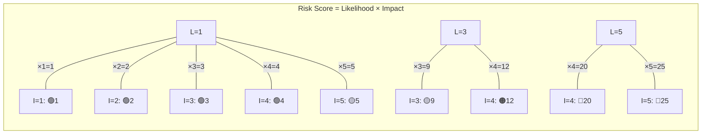
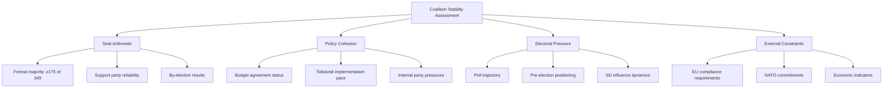
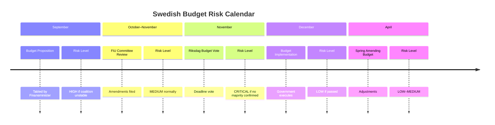

<p align="center">
  
</p>

<h1 align="center">⚠️ Political Risk Assessment Methodology</h1>

<p align="center">
  <strong>📊 Likelihood × Impact Scoring for Swedish Parliamentary Risk</strong><br>
  <em>🎯 Coalition · Policy · Budget · Electoral Risk Quantification</em>
</p>

<p align="center">
  <a href="#"></a>
  <a href="#"></a>
  <a href="#"></a>
  <a href="#"></a>
</p>

**📋 Document Owner:** CEO | **📄 Version:** 1.0 | **📅 Last Updated:** 2026-03-26 (UTC)  
**🔄 Review Cycle:** Quarterly | **⏰ Next Review:** 2026-06-26  
**🏢 Owner:** Hack23 AB (Org.nr 5595347807) | **🏷️ Classification:** Public

---

## 🎯 Purpose

This methodology provides the authoritative framework for political risk assessment in Riksdagsmonitor's analytical workflows. It adapts the quantitative Likelihood × Impact approach from [Hack23 ISMS Risk_Assessment_Methodology.md](https://github.com/Hack23/ISMS-PUBLIC/blob/main/Risk_Assessment_Methodology.md) to the unique dynamics of Swedish parliamentary politics.

See [reference/isms-risk-assessment-adaptation.md](../reference/isms-risk-assessment-adaptation.md) for the complete ISMS-to-political mapping.

---

## 📐 Core Methodology: Likelihood × Impact

All political risks are scored using a **5×5 matrix**. Risk Score = Likelihood × Impact.

### Likelihood Scale (1–5)

| Score | Label | Definition | Parliamentary Analogy |
|:-----:|-------|------------|----------------------|
| 1 | **Rare** | <5% probability in assessment window | Coalition collapse with 176-seat majority |
| 2 | **Unlikely** | 5–20% probability | Budget vote fails despite coalition agreement |
| 3 | **Possible** | 21–40% probability | SD defects on single non-budget vote |
| 4 | **Likely** | 41–70% probability | Opposition files no-confidence motion when polls shift |
| 5 | **Almost Certain** | >70% probability | Government proposes budget in September |

### Impact Scale (1–5)

| Score | Label | Definition | Political Example |
|:-----:|-------|------------|------------------|
| 1 | **Negligible** | Routine disruption; normal operations continue | Minor committee delay |
| 2 | **Minor** | Moderate disruption; corrective action straightforward | Single bill rejected; government re-submits |
| 3 | **Moderate** | Significant disruption; coalition relationship strained | Major budget amendment forced by opposition |
| 4 | **Major** | Severe disruption; coalition integrity threatened | Minister forced to resign |
| 5 | **Severe** | Democratic crisis; constitutional mechanisms triggered | Government falls; extraordinary election called |

### Risk Matrix



| Score | Tier | Colour | Action |
|:-----:|------|--------|--------|
| 1–4 | **Low** | 🟢 | Monitor; mention in weekly digest |
| 5–9 | **Medium** | 🟡 | Active monitoring; flag in daily analysis |
| 10–14 | **High** | 🟠 | Priority assessment; include in news |
| 15–25 | **Critical** | 🔴 | Immediate analysis; breaking news consideration |

---

## 🤝 Coalition Stability Risk

Coalition risk is the most politically distinctive risk type in Swedish parliamentary analysis.

### Coalition Stability Factors



### Coalition Collapse Probability (90-day window)

| Likelihood of Collapse | Seat Margin | Policy Cohesion | Electoral Pressure | Combined Score |
|------------------------|:-----------:|:---------------:|:-----------------:|:--------------:|
| **LOW (<15%)** | ≥176 operational buffer | High (all parties aligned) | Low (polls stable) | L≤2, I≤3 |
| **MEDIUM (15–35%)** | 175 bare majority (no buffer) | Medium (one party strained) | Medium (5+ point poll shift) | L=3, I=3–4 |
| **HIGH (>35%)** | <175 no majority | Low (multi-party tension) | High (SD threats withdrawal) | L≥4, I≥4 |

> **Note on majority arithmetic:** A formal Riksdag majority requires **≥175 of 349 seats**. However, absences and abstentions mean that ≥176 seats provide an "operational buffer" — the practical threshold for reliable legislative passage. The table above uses this distinction: ≥176 = comfortable (LOW), exactly 175 = bare majority (MEDIUM), <175 = no majority (HIGH).

---

## 📋 Policy Implementation Risk

Policy implementation risks assess the probability that a proposed policy fails to pass, is significantly amended, or is blocked:

| Stage | Default Likelihood | Risk Amplifiers | Risk Reducers |
|-------|--------------------|-----------------|---------------|
| Proposition submitted | L=2 | Opposition majority, SD conditions | Cross-party agreement |
| Committee review | L=2 | Dissenting committee reports | Government committee majority |
| Floor debate scheduled | L=3 | No-confidence backdrop | Vote whipped by all coalition parties |
| Vote imminent | L=1–4 | Internal defections signalled | Prior vote counting confirms majority |
| Enacted | L=1 (reversal) | New government formed | Constitutional entrenchment |

---

## 💰 Budget Risk Assessment

Swedish budget risk has unique characteristics due to the Riksdag's fiscal framework:

### Budget Timeline Risk Points



**FiU (Finansutskottet) Dissent Tracking:** Track formal dissenting opinions (reservationer) filed by opposition parties. Each reservation from a coalition party signals **High** policy risk for that budget line.

---

## 🗳️ Electoral Positioning Risk

Electoral risk quantifies how political events affect parties' electoral prospects over the 4-year Swedish electoral cycle:

| Electoral Phase | Risk Focus | Key Indicators |
|----------------|------------|----------------|
| **Year 1 (post-election)** | Coalition formation stability | Cooperation agreement durability |
| **Year 2 (mid-term)** | Policy delivery credibility | Legislation passing rate; SCB data |
| **Year 3 (positioning)** | Pre-election narrative | Poll trends; party conference resolutions |
| **Year 4 (campaign)** | Electoral positioning | Budget generosity; flagship policy status |

**Note:** General elections in Sweden are held the second Sunday of September every 4 years. Current cycle: September 2022 → **September 2026**.

---

## 📊 Calibration Examples

Real Swedish political scenarios as scoring anchors:

| Scenario | Likelihood | Impact | Score | Tier | Rationale |
|----------|:----------:|:------:|:-----:|------|-----------|
| SD conditionally supports budget | 4 | 4 | 16 | 🔴 Critical | Frequent pattern; major governance impact |
| L exits coalition over migration | 2 | 5 | 10 | 🟠 High | Historically rare; would collapse government |
| Minor committee report delayed | 1 | 1 | 1 | 🟢 Low | Routine; no political consequence |
| Budget vote passes with expected margin | 4 | 1 | 4 | 🟢 Low | Likely but low-impact routine event |
| KU investigation into government minister | 3 | 3 | 9 | 🟡 Medium | Possible; damages but rarely fatal |
| No-confidence motion passes | 1 | 5 | 5 | 🟡 Medium | Very rare; catastrophic if it occurs |
| New SOU recommends major pension reform | 4 | 3 | 12 | 🟠 High | Likely publication; major policy implications |

---

## 🔗 Related Documents

- [templates/risk-assessment.md](../templates/risk-assessment.md) — Risk assessment template
- [reference/isms-risk-assessment-adaptation.md](../reference/isms-risk-assessment-adaptation.md) — ISMS mapping
- [political-threat-framework.md](political-threat-framework.md) — Complementary threat analysis
- [political-classification-guide.md](political-classification-guide.md) — Classification (risk input)

---

**Document Control:**  
- **Path:** `/analysis/methodologies/political-risk-methodology.md`  
- **ISMS Reference:** [Risk_Assessment_Methodology.md](https://github.com/Hack23/ISMS-PUBLIC/blob/main/Risk_Assessment_Methodology.md)  
- **Classification:** Public  
- **Next Review:** 2026-06-26
# Political Risk Assessment Methodology

<!-- version: 1.0.0 | updated: 2026-03-26 | author: Hack23 AB -->
<!-- document-control: political-analysis-methodology | classification: public -->

## 1. Purpose

This document describes the **Political Risk Assessment Methodology** used by Riksdagsmonitor to quantify political risks from Swedish parliamentary documents. Inspired by the [ISMS Risk_Assessment_Methodology.md](https://github.com/Hack23/ISMS-PUBLIC/blob/main/Risk_Assessment_Methodology.md), it adapts Likelihood × Impact quantitative scoring for **political risk** across six categories of democratic and governance risk.

## 2. ISMS Inspiration

The ISMS Risk Assessment provides a rigorous quantitative framework: Risk Score = Likelihood × Impact. We adapt this for political intelligence by:
- Replacing "information security risks" with **political governance risks**
- Adapting the likelihood scale to **parliamentary signal strength**
- Adapting the impact scale to **democratic and societal consequence**
- Adding **Swedish parliamentary context** to all calibrations

## 3. Risk Categories

### 3.1 The Six Political Risk Categories

| Category | Failure Mode | Key Indicators |
|---|---|---|
| **coalition-stability** | Government collapse or realignment | Stability score, majority margin, defection probability, Tidö keywords |
| **policy-implementation** | Policy failure or stalling | Parliamentary arithmetic, committee support, motion denial rate |
| **democratic-process** | Democratic norm erosion | KU involvement, constitutional keywords, accountability gaps |
| **economic-policy** | Fiscal/monetary harm | FiU involvement, budget keywords, inflation/debt signals |
| **social-cohesion** | Societal division or unrest | SoU/SfU/AU committee, discrimination/equality keywords |
| **international-standing** | International position risk | UU/FöU committee, NATO/EU keywords, treaty signals |

## 4. Likelihood Scale

| Level | Probability | Swedish Parliamentary Signal |
|---|---|---|
| 🔥 **almost-certain** | 90% | Committee report passed; KU investigation active; vote recorded |
| 🎯 **likely** | 70% | Multiple committee signals; interpellations filed; party consensus |
| ⚖️ **possible** | 50% | Mixed signals; debate ongoing; uncertain arithmetic |
| 🛡️ **unlikely** | 30% | Weak indicators; strong opposition; no committee movement |
| 💎 **rare** | 12% | Exceptional circumstances; no current signals |
| 🌟 **exceptional** | 2% | Black swan event; no observable precursors |

### 4.1 Signal Strength by Document Type

| Document Type | Likelihood Baseline |
|---|---|
| `bet` (committee report) | almost-certain for policy-implementation |
| `prop` (government proposition) | likely for policy-implementation |
| `sou` (SOU report) | possible for policy areas covered |
| `ip` (interpellation) | possible for coalition-stability and policy-implementation |
| `mot` (motion) | unlikely for policy-implementation (99%+ denied) |
| `fr` (written question) | rare — indicative only |

### 4.2 CIA Coalition Data Integration

When CIA coalition stability data is available:
- Stability score < 30 → upgrade coalition-stability likelihood by 1-2 levels
- Stability score 30-50 → moderate likelihood elevation
- Stability score > 70 → baseline likelihood, strong mitigating factor
- Majority margin ≤ 1 → escalating factor for all categories
- Defection probability > 0.2 → escalating factor for coalition-stability

## 5. Impact Scale

| Level | Score | Political Consequence |
|---|---|---|
| **transformative** | 10 | Constitutional/regime-level change; affects fundamental governance |
| **critical** | 8 | Major policy shift affecting millions of citizens |
| **high** | 6 | Significant legislative change; major committee report |
| **moderate** | 4 | Notable policy adjustment; sectoral effect |
| **low** | 2 | Minor procedural change; limited consequence |
| **minimal** | 1 | Routine parliamentary activity; negligible impact |

### 5.1 Impact by Risk Category — Calibration Table

| Category | transformative | critical | high |
|---|---|---|---|
| coalition-stability | Regime change | Near-collapse, misstroendevotum | Significant coalition instability |
| policy-implementation | Structural reform reversal | Major policy blocked/reversed | Significant legislative stalling |
| democratic-process | Constitutional order threatened | Core democratic institution weakened | Significant democratic deficit |
| economic-policy | GDP-level shock, debt crisis | Budget crisis, major fiscal failure | Tax reform, significant spending change |
| social-cohesion | Societal breakdown, mass unrest | Systemic discrimination, wide inequality | Notable group harm, significant exclusion |
| international-standing | Treaty exit, alliance breakdown | Major alliance strain | Significant diplomatic failure |

## 6. Risk Scoring Formula

```
Risk Score = likelihood_probability × impact_weight × 10

Examples:
  almost-certain (0.90) × transformative (10) × 10 = 90 → CRITICAL priority
  likely (0.70)          × high (6)            × 10 = 42 → MEDIUM priority
  possible (0.50)        × critical (8)         × 10 = 40 → MEDIUM priority
  unlikely (0.30)        × high (6)             × 10 = 18 → LOW priority
  rare (0.12)            × transformative (10)  × 10 = 12 → LOW priority

Priority thresholds:
  ≥ 70 → CRITICAL
  ≥ 50 → HIGH
  ≥ 30 → MEDIUM
  < 30 → LOW
```

## 7. Composite Risk Score

The six category scores are aggregated into a **composite risk score** using priority-weighted averaging:

```
Priority weights: critical×1.0, high×0.7, medium×0.5, low×0.3

composite = Σ(riskScore × priorityWeight) / Σ(priorityWeight)
```

The composite score drives the `overallRiskLevel` and article priority routing.

## 8. Mitigating & Escalating Factors

### 8.1 Standard Mitigating Factors by Category

| Category | Key Mitigating Factors |
|---|---|
| coalition-stability | High stability score, comfortable majority, constitutional norms |
| policy-implementation | Government parliamentary majority, Lagrådet review, committee quality assurance |
| democratic-process | Lagrådet (constitutional review), KU oversight, JO/JK ombudsmen |
| economic-policy | Independent Riksbank, Finanspolitiska rådet, EU SGP constraints |
| social-cohesion | Swedish welfare state baseline, Diskrimineringsombudsmannen, ECHR |
| international-standing | NATO collective defence, EU treaty obligations, Nordic cooperation |

### 8.2 Standard Escalating Factors by Category

| Category | Key Escalating Factors |
|---|---|
| coalition-stability | Low stability score, narrow majority, high defection probability |
| policy-implementation | Unstable coalition, opposition coordination, minority government dynamics |
| democratic-process | Media amplification, public trust erosion, social media polarisation |
| economic-policy | Global economic uncertainty, coalition budget deadlock, external shocks |
| social-cohesion | Polarising rhetoric, unequal burden distribution, social fragmentation |
| international-standing | Domestic instability signals, geopolitical realignment pressures |

## 9. Evidence Standards

Risk assessments must cite:
- **dok_id** of the source document
- **Committee involvement** (specific committee code)
- **Speech attributions** where available
- **CIA coalition data** values (stability score, margin, defection probability)
- **Vote records** where available

## 10. Implementation Reference

**TypeScript Engine**: `scripts/analysis-framework/political-risk-assessment.ts`  
**Types**: `scripts/analysis-framework/methodology-types.ts`  
**AI Prompt**: `scripts/prompts/v2/political-risk-prompt.md`  
**Tests**: `tests/political-methodology.test.ts`

### 10.1 Quick API Reference
```typescript
import { assessPoliticalRisk, assessSingleRiskCategory } from './political-risk-assessment.js';

// Full 6-category profile
const profile = assessPoliticalRisk(doc, ciaContext);
console.log(profile.overallRiskLevel);    // 'critical' | 'high' | 'medium' | 'low'
console.log(profile.compositeRiskScore); // 0–100
console.log(profile.dominantRisk);       // highest-priority category

// Targeted single-category assessment
const coalitionRisk = assessSingleRiskCategory(doc, 'coalition-stability', ciaContext);
console.log(coalitionRisk.riskScore);    // 0–100
console.log(coalitionRisk.likelihood);   // 'almost-certain' | 'likely' | ...
```

## 11. Worked Examples

### Example 1: Unstable Coalition Budget Proposal
**Context**: Budget proposition, FiU, coalition stability score = 28, majority margin = 1

| Category | Likelihood | Impact | Score | Priority |
|---|---|---|---|---|
| coalition-stability | almost-certain | critical | 72 | CRITICAL |
| policy-implementation | likely | high | 42 | MEDIUM |
| democratic-process | unlikely | high | 18 | LOW |
| economic-policy | almost-certain | transformative | 90 | CRITICAL |
| social-cohesion | possible | moderate | 20 | LOW |
| international-standing | unlikely | moderate | 12 | LOW |
| **Composite** | | | **~60** | **HIGH** |

### Example 2: KU Constitutional Investigation
| Category | Likelihood | Impact | Score | Priority |
|---|---|---|---|---|
| coalition-stability | likely | critical | 56 | HIGH |
| policy-implementation | rare | low | 2 | LOW |
| democratic-process | almost-certain | critical | 72 | CRITICAL |
| economic-policy | rare | minimal | 1 | LOW |
| social-cohesion | possible | moderate | 20 | LOW |
| international-standing | unlikely | moderate | 12 | LOW |
| **Composite** | | | **~45** | **MEDIUM** |

## 12. Integration Points

- **`political-significance.ts`**: Risk profile supplements 0–100 significance scoring
- **`DocumentAnalysisResult.methodologyAnalysis.riskProfile`**: Full profile available
- **Article depth routing**: `overallRiskLevel = 'critical'` → deep investigation
- **Headline prioritisation**: `dominantRisk = 'coalition-stability'` → coalition-focused framing
- **CIA data feedback**: CIA context improves coalition and economic risk accuracy
