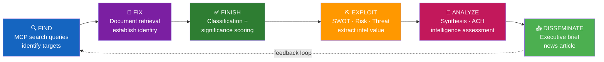
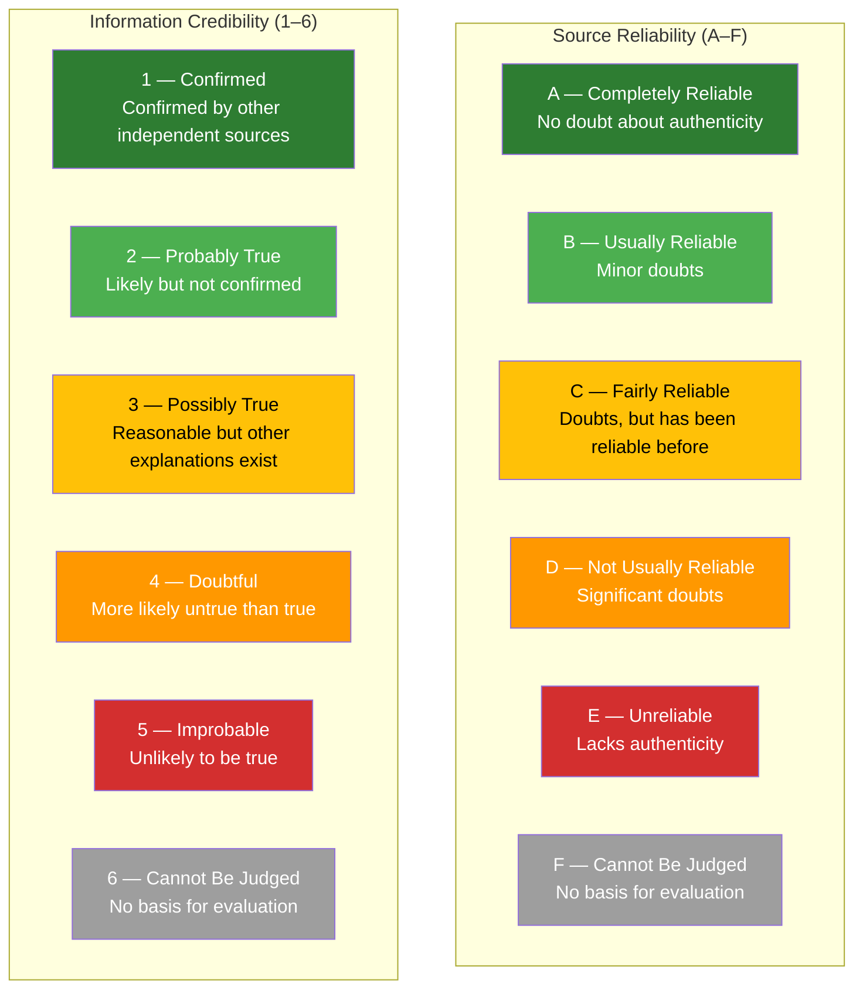

<p align="center">
  
</p>

<h1 align="center">✍️ Political Intelligence Style Guide</h1>

<p align="center">
  <strong>📊 Intelligence Writing Standards for Deep Political Analysis</strong><br>
  <em>🎯 Evidence Density · Attribution · Analytical Depth · Multi-Framework Consistency</em>
</p>

<p align="center">
  <a href="#"></a>
  <a href="#"></a>
  <a href="#"></a>
  <a href="#"></a>
</p>

**📋 Document Owner:** CEO | **📄 Version:** 3.2 | **📅 Last Updated:** 2026-04-25 (UTC)  
**🔄 Review Cycle:** Quarterly | **⏰ Next Review:** 2026-09-01  
**🏢 Owner:** Hack23 AB (Org.nr 5595347807) | **🏷️ Classification:** Public

---

<!-- BEGIN AI-FIRST METHODOLOGY CARD -->

## 🎯 AI-FIRST Methodology Card

> **🚦 Read this card before writing a single paragraph.** It names the artifact this methodology owns, the gate check it satisfies, the evidence-density target it must hit, and the Pass-1 / Pass-2 discipline required by `.github/copilot-instructions.md` §5 (AI-FIRST Quality Principle).

| Field | Value |
|-------|-------|
| **Purpose** | Intelligence-grade writing standards — depth tiers, evidence density, banned-phrase list, lede patterns, Mermaid theming, F3EAD/Admiralty/WEP/ICD 203/SAT canon. |
| **Inputs** | [Hack23 ISMS STYLE_GUIDE.md](https://github.com/Hack23/ISMS-PUBLIC/blob/main/STYLE_GUIDE.md); editorial standards skill; OSINT tradecraft standards |
| **Outputs** | _(style canon — referenced by every other methodology and the gate)_ |
| **Owning artifact(s)** | _(applies to every artifact)_ |
| **Owning gate check** | Pass-2 self-audit enforces banned-phrase elimination (reads the §Machine-readable banned-phrase list block) + Check 4 evidence patterns + Check 5 Mermaid theming |
| **Citation density target** | Style guide is the canon; minimum density per analysis type is documented in the §Minimum Evidence Density Requirements table |
| **Banned phrases** | Enforced via [`political-style-guide.md` §Machine-readable banned-phrase list](political-style-guide.md#machine-readable-banned-phrase-list) |
| **Threshold source** | [`reference-quality-thresholds.json`](reference-quality-thresholds.json) → `thresholds[articleType][artifact]` (fallback `defaults.coreArtifactFloor`) |

### ✅ Pass-1 checklist (creation — minimal viable artifact)

- [ ] Surface vs Strategic vs Forecast vs Intelligence-grade depth tiers all defined
- [ ] Banned-phrase list machine-readable in a fenced block (consumed by Pass-2 self-audit via `grep -F -f`)
- [ ] Produce every required sub-section listed in the owning template
- [ ] Add ≥ 1 evidence anchor (`dok_id`, vote id, named MP, or primary-source URL) per analytical claim
- [ ] Apply the correct WEP confidence band for the run's horizon (`72h / week / month / quarter / year / cycle`)
- [ ] Include ≥ 1 themed Mermaid diagram with `style …` or `themeVariables` config (where structurally meaningful)
- [ ] Cross-link the relevant template under `analysis/templates/` and the gate check it satisfies

### 🔁 Pass-2 checklist (read-back & improve — AI-FIRST mandatory)

- [ ] Every banned phrase has at least one `Bad → Good` worked example
- [ ] Lede patterns + WEP language ladder reconciled with `osint-tradecraft-standards.md`
- [ ] Re-read the file end-to-end; flag every claim that lacks an evidence anchor and add one
- [ ] Replace every banned phrase listed in [`political-style-guide.md` §Machine-readable banned-phrase list](political-style-guide.md#machine-readable-banned-phrase-list) with an evidence-anchored alternative
- [ ] Tighten WEP language: never above **likely** without ≥ 3 cycle-aged sources for `year`/`cycle` horizons
- [ ] Strengthen Mermaid (color-coded `style …` directives, `themeVariables`, ≥ 5 nodes where the structure admits it)
- [ ] Add ≥ 1 second-order effect, cui-bono note, or counterfactual where the artifact admits one
- [ ] Verify citation density meets the per-file target below and the gate's evidence-density rules

### 🟢 Exemplar (good — pattern-match this)

> _(rewrite)_ Banned: "Recent activity in the Riksdag suggests…" → Good: "`H902FiU1` (FiU committee, 2026-04-22, 17 sponsors led by Edin (S)) reroutes SEK 6.1 bn from defence to climate; vote 173–176, [A1] riksdagen.se."

### 🔴 Anti-exemplar (failure mode — never ship this)

> _(failure mode)_ Banned phrases shipped without rewrite ("experts believe", "various stakeholders", "significant development") — Pass-2 self-audit should have caught and replaced these with evidence-anchored alternatives.

### 🔗 Cross-links

- **Template(s)**: _(style canon — applies to every template)_
- **Gate check**: [`.github/prompts/05-analysis-gate.md`](../../.github/prompts/05-analysis-gate.md#checks-all-must-pass)
- **AI-FIRST canon**: [`.github/copilot-instructions.md` §5](../../.github/copilot-instructions.md) · [`ai-driven-analysis-guide.md`](ai-driven-analysis-guide.md)
- **Style canon**: [`political-style-guide.md`](political-style-guide.md) · [`osint-tradecraft-standards.md`](osint-tradecraft-standards.md)
- **Catalog row**: [`artifact-catalog.md`](artifact-catalog.md)

<!-- END AI-FIRST METHODOLOGY CARD -->

---


## 🎯 Purpose

This style guide establishes **intelligence-grade writing standards** for all political analysis produced by Riksdagsmonitor's agentic workflows. Every piece of analysis must demonstrate genuine analytical depth — not surface-level summaries or script-generated content. The quality standard is [SWOT.md](../../SWOT.md) and [THREAT_MODEL.md](../../THREAT_MODEL.md).

This adapts [Hack23 ISMS STYLE_GUIDE.md](https://github.com/Hack23/ISMS-PUBLIC/blob/main/STYLE_GUIDE.md) for political intelligence contexts. See [reference/isms-style-guide-adaptation.md](../reference/isms-style-guide-adaptation.md) for the full ISMS mapping.

---

## 🚨 Intelligence Depth Standards (New in v2.0)

### What Distinguishes Intelligence from Summary

| ✅ Intelligence Analysis | 🚫 Summary/Shallow Content |
|-------------------------|---------------------------|
| Explains **why** something matters, not just what happened | Restates what happened without interpretation |
| Identifies **who benefits and who loses** (cui bono) | Names no specific actors or interests |
| Cross-references with **other documents, votes, and trends** | Treats each document in isolation |
| Provides **forward-looking assessment** (what happens next?) | Only describes current state |
| Explicitly states **confidence level** and cites evidence | Makes claims without attribution |
| Identifies **tensions, contradictions, and hidden dynamics** | Only reports the official narrative |
| Uses **multiple analytical frameworks** (SWOT, Risk, Attack Tree) | Uses no framework or only one |

### Minimum Evidence Density Requirements

| Analysis Type | Min. Evidence Points | Min. dok_id Citations | Min. Named Actors |
|-------------|:--------------------:|:--------------------:|:-----------------:|
| Per-file analysis | 3 | 2 | 2 |
| Daily SWOT | 8 (≥2 per quadrant) | 4 | 4 |
| Risk assessment | 5 | 3 | 3 |
| Threat analysis | 6 | 3 | 3 |
| Synthesis summary | 10 | 5 | 5 |

### Analytical Depth Indicators

Every analysis file should demonstrate at least 3 of these 5 depth indicators:

1. **Cui Bono Analysis** — Who benefits from this development? Who is harmed?
2. **Second-Order Effects** — What cascading consequences follow from this event?
3. **Historical Parallels** — Has something similar happened before? What was the outcome?
4. **Counter-Factual Reasoning** — What would happen if the opposite occurred?
5. **Tension Identification** — What contradictions or competing interests does this reveal?

---

## 📊 Analytical Depth Standards

Three permitted depth levels define what analysis is appropriate for each content type:

### Level 1: Surface Analysis

**Definition:** Factual reporting of what happened, who was involved, and when. No inference, no interpretation, no prediction.

**When to use:** Breaking news, routine parliamentary reporting, event summaries.

**Example (Surface ✅):**  
> "The Riksdag voted 176–173 on 2026-03-25 to pass Budget Proposition 2025/26:1 (punkt 5.3 — defence appropriation). SD, M, KD, and L voted in favour; S, V, and MP voted against."

**Prohibited at Surface level:** Statements like "this signals..." or "experts believe..." or any forward-looking claim.

---

### Level 2: Strategic Analysis

**Definition:** Interpretation of what the event means in its political context. Identifies patterns, explains motivations with evidence, and draws connections to related events.

**When to use:** Daily news articles, weekly briefings, stakeholder assessments.

**Example (Strategic ✅):**  
> "The 176–173 margin on the defence appropriation — the smallest possible majority — reveals that the Tidökoalition's parliamentary base has thinned since the September 2022 election. SD's conditional support, documented in Tidöavtalet (dok_id: XXXX), remains the single binding constraint on M's ability to govern. A three-seat shift would collapse the government's budget majority."

**Prohibited at Strategic level:** Unsourced claims about motivations ("SD secretly wants to..."), predictions without probability notation.

---

### Level 3: Intelligence Analysis

**Definition:** Forward-looking assessment with explicit probability notation, scenario modelling, and risk quantification. Requires the full analytical framework (classification + risk + SWOT + threat).

**When to use:** Weekly strategic briefings, monthly intelligence reports, breaking analysis of crisis events.

**Example (Intelligence ✅):**  
> "Based on the 176–173 defence vote margin (dok_id: XXXX) and the L party leader's parliamentary statement (anförande 2026-03-25), we assess **MEDIUM probability (25–40%)** that L will abstain rather than vote Nej on the immigration regulation amendment scheduled for April 2026. This would reduce the effective coalition majority to 172, creating a governance crisis scenario with **HIGH impact** (score 12/25) per political-risk-methodology.md calibration."

---

## 👤 Attribution Standards

### Politician Attribution Rules

| Context | Format | Example |
|---------|--------|---------|
| First mention | Full name + role | "Statsminister Ulf Kristersson (M)" |
| Subsequent mentions | Last name or role | "Kristersson" or "Statsministern" |
| Formal documents | Full name + party | "Ulf Kristersson (M)" |
| Group reference | Party abbreviation | "M-ledningen", "SD-gruppen" |

### Document Attribution Rules

All factual claims about parliamentary actions **must** cite a `dok_id`:

> ⛔ **FABRICATION BAN (v2.2 Addition)**: The following patterns are BANNED and indicate fabricated content that is not grounded in actual downloaded data:
> - **Fabricated statistics** without verifiable source citation (e.g., "15M SEK", "300+ votes", "30-40% increase") — every number MUST cite a specific dok_id or MCP data file
> - **Fabricated document references** — citing Prop/Skr/SOU numbers not present in the analysis pipeline's downloaded documents
> - **Fabricated politician quotes or positions** — naming specific politicians with specific positions not found in any downloaded document
> - **General knowledge masquerading as analysis** — generating content about a topic (e.g., cybersecurity policy) when the downloaded documents are about something else entirely (e.g., migration/healthcare)
> - **Confidence inflation** — claiming HIGH confidence when the synthesis-summary.md reports LOW confidence
>
> **Root cause context**: On 2026-04-15, a deep-inspection article claimed to analyze Prop. 2025/26:214 (cybersecurity) with specific budget figures, vote predictions, and international context — but the actual pipeline data contained ZERO cybersecurity documents (only migration/healthcare motions). This ban prevents such fabrication.

| Claim Type | Required Citation |
|-----------|------------------|
| Legislation passed/failed | `dok_id` of proposition + vote date |
| Committee recommendation | `dok_id` of betänkande |
| Minister's statement | Anförande reference (date + debate) |
| Government policy | `dok_id` of proposition or `skr` |
| Budget figure | `dok_id` of budget proposition + paragraph |

**Format:** `(dok_id: H9012345)` or `(prop 2025/26:123, p. 45)`

### What Must Never Be Attributed Without Evidence

- Party "plans" or "intends" (unless from official document)
- Politician "believes" or "feels" (unless from direct quote in anförande)
- Coalition "will" do X (unless from Tidöavtal or formal agreement)
- Poll-based claims without pollster name + date

---

## 🔄 F3EAD Intelligence Cycle

The **F3EAD cycle** (Find – Fix – Finish – Exploit – Analyze – Disseminate) is the doctrinal backbone of all Riksdagsmonitor intelligence production. Every workflow maps to F3EAD stages:



*Alt-text: F3EAD cycle flowchart showing six sequential stages (Find, Fix, Finish, Exploit, Analyze, Disseminate) with a feedback loop from Disseminate back to Find. Each stage maps to Riksdagsmonitor workflow steps.*

| F3EAD Stage | Riksdagsmonitor Mapping | Output Files |
|-------------|------------------------|--------------|
| **FIND** | MCP `search_dokument`, `search_voteringar`, `search_anforanden` | Query logs, candidate list |
| **FIX** | `get_dokument`, `get_ledamot`, document download | `data-download-manifest.md` |
| **FINISH** | 7-dimension classification, DIW scoring | `political-classification.md`, `significance-scoring.md` |
| **EXPLOIT** | SWOT, Risk, Threat frameworks | `swot-analysis.md`, `risk-assessment.md`, `threat-analysis.md` |
| **ANALYZE** | Synthesis, ACH, scenario | `synthesis-summary.md`, `devils-advocate.md`, `intelligence-assessment.md` |
| **DISSEMINATE** | Executive brief, article generation | `executive-brief.md`, news HTML |

Every methodology file declares which F3EAD stage(s) it serves. Every template header includes the F3EAD stage.

---

## 🎯 Priority Intelligence Requirements (PIR) & Essential Elements of Information (EEI)

### Standing PIRs for Swedish Parliamentary Intelligence

PIRs are the intelligence questions that guide collection and analysis. Every workflow run declares which PIRs it serves; every piece of evidence tags to an EEI.

| PIR Code | Priority Intelligence Requirement | EEIs (Essential Elements) |
|----------|----------------------------------|---------------------------|
| **PIR-1** | **Coalition Stability** — Will the Tidö coalition maintain its Riksdag majority through the current riksmöte? | EEI-1.1: Vote margins on contested betänkanden <br> EEI-1.2: Public statements indicating party-line deviation <br> EEI-1.3: Coalition agreement renegotiation signals |
| **PIR-2** | **Grundlag Risk** — Are there constitutional amendments or grundlag challenges under consideration? | EEI-2.1: RF/TF/SO/YGL/TO amendment motions filed <br> EEI-2.2: KU scrutiny reports with constitutional implications <br> EEI-2.3: Expert committee (SOU) recommendations on constitutional reform |
| **PIR-3** | **Migration Policy** — What is the trajectory of migration and integration policy? | EEI-3.1: MiG (Migration Agency) directive changes <br> EEI-3.2: Interpellations and motions on asylum, deportation, family reunification <br> EEI-3.3: EU asylum-procedure synchronization |
| **PIR-4** | **Defence Posture** — How is Sweden's NATO integration and defence spending evolving? | EEI-4.1: Defence budget propositions (FöU) <br> EEI-4.2: NATO interoperability legislation <br> EEI-4.3: MUST/FRA oversight documents |
| **PIR-5** | **Fiscal Trajectory** — What is the government's fiscal stance and budget outlook? | EEI-5.1: Budget proposition (FiU) amendments <br> EEI-5.2: Fiscal policy council (FPR) assessments <br> EEI-5.3: Tax and expenditure reforms |
| **PIR-6** | **Election Integrity** — Are there threats to the September 2026 election process? | EEI-6.1: Valmyndigheten (Election Authority) guidance <br> EEI-6.2: Foreign influence reports (SÄPO, MSB) <br> EEI-6.3: Electoral law amendments |
| **PIR-7** | **Democratic Norms** — Are there erosions to transparency, accountability, or rule of law? | EEI-7.1: JO (Parliamentary Ombudsman) critical decisions <br> EEI-7.2: KU constitutional scrutiny <br> EEI-7.3: Access-to-information rulings |

### PIR Usage in Analysis Files

- **`intelligence-assessment.md`** — Opens with "PIRs served: PIR-1, PIR-5" and structures Key Judgments by PIR
- **`executive-brief.md`** — Includes "PIR relevance" row in context table
- **`synthesis-summary.md`** — Tags each finding to the PIR it informs
- **Evidence tables** — Every row includes an `EEI Tag` column (e.g., `EEI-1.2`)

---

## 📊 Admiralty Source Reliability Code (NATO STANAG 2022)

### Reliability × Credibility Matrix

All evidence claims carry an Admiralty Code annotation `[A–F][1–6]` indicating source reliability (A–F) and information credibility (1–6).



*Alt-text: Two-panel diagram showing source reliability scale (A–F) and information credibility scale (1–6), color-coded from green (high) through yellow/orange to red (low) and grey (cannot judge).*

### Riksdag-Specific Admiralty Code Mapping

| Source Type | Reliability | Typical Credibility | Example |
|-------------|:-----------:|:-------------------:|---------|
| **Riksdag.se primary document** (proposition, betänkande) | **A** | 1–2 | Prop. 2025/26:1 (budget) `[A1]` |
| **Regeringen.se official document** | **A** | 1–2 | Government directive `[A1]` |
| **Riksdag committee minutes** | **B** | 2 | FiU minutes 2026-03-15 `[B2]` |
| **Official vote record** (`search_voteringar`) | **A** | 1 | Vote tally HD01234 `[A1]` |
| **MP anförande** (speech in plenary) | **B** | 2–3 | Magdalena Andersson (S) anförande 2026-03-20 `[B2]` |
| **Party press release** | **C** | 3 | SD press release 2026-03-18 `[C3]` |
| **News wire (TT, Reuters)** | **C** | 2–3 | TT Nyhetsbyrån report `[C2]` |
| **Quality newspaper** (DN, SvD, GP) | **C** | 3 | DN analysis piece `[C3]` |
| **Tabloid** (Aftonbladet, Expressen) | **D** | 3–4 | Aftonbladet exclusive `[D3]` |
| **Social media (X/Twitter, Facebook)** | **D–E** | 4–5 | MP tweet `[D4]` |
| **Anonymous source** | **E** | 5 | Unnamed coalition source `[E5]` |
| **SCB official statistics** | **A** | 1 | SCB partisympati Q1 2026 `[A1]` |
| **IMF data** (WEO/FM/IFS/BOP/GFS_COFOG/DOTS/PCPS/MFS_IR/ER) | **A** | 1 | IMF WEO Apr-2026 NGDP_RPCH `[A1]` |
| **World Bank** (non-economic residue only — WGI, environment, social) | **A** | 1 | World Bank WGI 2025 `[A1]` |
| **Pollster (SIFO, Novus, Demoskop)** | **B** | 2 | SIFO March 2026 `[B2]` |

### Admiralty Annotation Format

Every evidence column in every template requires Admiralty annotation:

```markdown
| Evidence | Source | Admiralty | Confidence |
|----------|--------|:---------:|:----------:|
| FiU48 passed 176–173 | Riksdag votering H901FiU48 | **[A1]** | 🟦 VERY HIGH |
| SD will support budget | Party congress resolution | **[B2]** | 🟩 HIGH |
| L threshold risk elevated | SIFO March 2026, L at 4.1% | **[B2]** | 🟩 HIGH |
| Coalition may fracture | Unnamed Tidö source (DN) | **[D4]** | 🟥 LOW |
```

### Source Diversity Rule (Formalized)

Intelligence-grade analysis requires multi-source corroboration to mitigate single-point-of-failure risk and reduce confirmation bias. Apply this rule systematically:

#### Primary Rule: Multi-Source Corroboration by Claim Priority

| Claim Priority | Minimum Sources | Source Mix | Admiralty Floor | Swedish Political Example |
|:-------------:|:---------------:|------------|:---------------:|---------------------------|
| **P0 (CRITICAL)** | ≥4 | ≥3 primary `[A–B]` + ≥1 secondary `[A–B]` | `[A1]` or `[B2]` | **Grundlag amendment vote:** "RF Chapter 1 §1 amendment passed 233–116 (votering GZ123RF01 `[A1]`), confirmed in KU betänkande 2026/27:KU5 `[A1]`, Moderate party floor leader anförande `[B2]`, and constitutional-law expert Iain Cameron (Uppsala University) analysis `[B2]`)" |
| **P1 (HIGH)** | ≥3 | ≥2 primary `[A–B]` + ≥1 secondary `[B–C]` | `[B2]` | **Coalition fracture risk:** "L party signals 4% threshold risk per SIFO March 2026 poll at 4.1% ±0.8% `[B2]`, party congress emergency resolution on SD cooperation `[B2]`, and SvD editorial noting internal divisions `[C3]`" |
| **P2 (MEDIUM)** | ≥2 | ≥1 primary `[A–C]` + ≥1 secondary or 2 primary | `[C3]` | **Budget passage likelihood:** "FiU48 defence amendment likely to pass per FiU minutes 2026-04-15 showing 7–5 committee vote `[B2]` and unnamed coalition whip estimate to DN of 175+ floor votes `[D4]` `[unconfirmed]`" |
| **P3 (LOW)** | ≥1 | Single source permitted if flagged | `[C3]` or lower | **Speculative coalition dynamics:** "Unnamed Tidö negotiator reports L leadership divided on family reunification §3 (Expressen 2026-04-19 `[E5]` `[unconfirmed — anonymous source]`)" |

#### Single-Source Policy

**Prohibited:**
- ❌ P0/P1 claims with only one source
- ❌ Constitutional assessments (PIR-2) from single expert opinion
- ❌ Election forecasts from single poll without historical context

**Permitted (with explicit labeling):**
- ✅ **Breaking news** — single official source `[A1]` with `[developing — single source]` tag; must be followed by multi-source confirmation within 24h
- ✅ **Exclusive documents** — single dok_id `[A1]` if no other source has covered it; label `[exclusive — single document]`
- ✅ **Expert opinion** — single named expert `[C3]` if framed as "one perspective" not "consensus view"
- ✅ **Anonymous tips** — single source `[E5]` labeled `[unconfirmed — anonymous source]` with LOW confidence ceiling

#### Corroboration Standards: How to Validate Across Sources

**Independent corroboration** requires sources that:
1. **Different collection paths** — not derived from same upstream source (e.g., TT wire story republished by DN is ONE source, not two)
2. **Different methods** — MCP document retrieval + human interview counts as two; two MCP queries of same API endpoint = one
3. **Temporal spread** — evidence from ≥2 different dates strengthens corroboration (avoids snapshot bias)

**Corroboration checklist:**
```markdown
Evidence E1: FiU48 passed committee 7–5 [A1] (2026-04-18)
Evidence E2: SD floor support confirmed [B2] (2026-04-19) ← Different date, different actor
Evidence E3: Coalition whip expects 175+ votes [C3] (2026-04-20) ← Different source type
Status: ✅ CORROBORATED (3 independent sources, 3-day spread)
```

#### Conflict Resolution: When Sources Contradict

**When sources provide conflicting evidence:**

1. **Assess reliability differential** — If `[A1]` contradicts `[D4]`, trust `[A1]` unless extraordinary circumstances
2. **Check temporal sequence** — Later source may supersede earlier (e.g., official vote count `[A1]` trumps preliminary coalition estimate `[C3]`)
3. **Explicit acknowledgment** — Document the conflict in analysis:
   > "FiU48 vote margin remains uncertain: coalition whip estimates 175 `[C3]`, but L reservationslista suggests 3 MPs may abstain `[A1]`, which would reduce to 173. We assess the official reservationslista `[A1]` as more reliable than whip estimate."
4. **Confidence downgrade** — Conflicting evidence triggers MEDIUM→LOW confidence adjustment until resolved

**Conflict resolution ladder:**
```
1. Official records (A1) > spokesperson statements (B2) > unnamed sources (D4-E5)
2. More recent > older (if material change occurred)
3. Primary actor > third-party observer
4. Document trail > oral statement
```

#### Source Attribution Hierarchy: Precedence When Multiple Sources Available

When multiple sources support the same claim, **cite in this order** (highest reliability first):

| Precedence | Source Type | Admiralty | Example Citation |
|:----------:|-------------|:---------:|------------------|
| 1 | Official Riksdag document | `[A1]` | Prop. 2025/26:1, p. 45 |
| 2 | Vote record | `[A1]` | Votering HD01234 |
| 3 | Committee minutes | `[B2]` | FiU minutes 2026-04-15 |
| 4 | MP floor statement | `[B2]` | Magdalena Andersson (S) anförande 2026-04-20 |
| 5 | Official statistics | `[A1]` | SCB partisympati Q1 2026 |
| 6 | Quality pollster | `[B2]` | SIFO March 2026 |
| 7 | Party press release | `[C3]` | SD press release 2026-04-18 |
| 8 | News wire | `[C2]` | TT Nyhetsbyrån |
| 9 | Newspaper analysis | `[C3]` | DN editorial |
| 10 | Social media | `[D4]` | MP official account |
| 11 | Anonymous source | `[E5]` | Unnamed coalition insider |

**Citation format:** Always lead with highest-reliability source, add secondary sources in parentheses:
> "FiU48 passed 176–173 (votering HD01FiU48 `[A1]`; also reported by TT `[C2]` and confirmed in SD floor statement `[B2]`)."

#### Anonymous Source Policy

Anonymous sources `[E5]` are permitted under strict conditions:

**When permitted:**
- ✅ Corroboration of public-record claim (anonymous source adds context, not primary evidence)
- ✅ Whistleblower reporting malfeasance (public interest outweighs attribution)
- ✅ Coalition negotiation dynamics (no official record available)

**Mandatory labeling:**
```markdown
| Evidence | Source | Admiralty | Confidence |
|----------|--------|:---------:|:----------:|
| L leadership divided on §3 | Unnamed Tidö source (Expressen 2026-04-19) | **[E5]** | 🟥 LOW `[unconfirmed — anonymous source]` |
```

**Prohibited:**
- ❌ Anonymous sources as sole evidence for P0/P1 claims
- ❌ Multiple anonymous sources without any public corroboration (circular sourcing risk)
- ❌ Anonymous sources for factual claims that should have document trail (vote counts, dok_id citations)

#### Worked Scenario: Source Diversity in Practice (Coalition Stability Assessment)

**Intelligence Question:** Will the Tidö coalition survive the FiU48 defence-budget vote on 2026-04-22?

**Collection Phase (F3EAD: FIND/FIX):**

| # | Evidence | Source Type | Admiralty | Collection Date | PIR/EEI |
|:-:|----------|-------------|:---------:|:---------------:|:-------:|
| E1 | FiU48 committee vote 7–5 (M+KD+L for, S+V+MP+C against) | Committee minutes | `[A1]` | 2026-04-18 | PIR-1/EEI-1.1 |
| E2 | SD floor-support statement by Richard Jomshof (SD riksdagsledamot) | Anförande HD04567 | `[B2]` | 2026-04-19 | PIR-1/EEI-1.2 |
| E3 | L reservation filed on §3 (family reunification clause) | FiU48 reservationslista | `[A1]` | 2026-04-18 | PIR-1/EEI-1.3 |
| E4 | Coalition whip confirms 175+ votes expected | DN interview with M whip | `[C3]` | 2026-04-20 | PIR-1/EEI-1.1 |
| E5 | L leadership divided, 3 MPs "wavering" on §3 | Unnamed Tidö source to Expressen | `[E5]` | 2026-04-19 | PIR-1/EEI-1.3 |

**Source Diversity Analysis:**

**Claim 1 (P1): "Coalition will pass FiU48 with ≥175 votes"**
- Source count: 4 (E1, E2, E3, E4)
- Admiralty spread: `[A1]` × 2, `[B2]` × 1, `[C3]` × 1
- Temporal spread: 3 days (2026-04-18 to 2026-04-20)
- Independent paths: Committee record, SD statement, L reservation, whip estimate
- **Assessment:** ✅ CORROBORATED — meets P1 standard (≥3 sources, ≥2 primary)
- **Confidence:** 🟩 HIGH

**Claim 2 (P2): "L MPs may abstain on §3, narrowing margin to 173"**
- Source count: 2 (E3 `[A1]` official reservation, E5 `[E5]` anonymous)
- Reliability conflict: `[A1]` (official reservation exists) vs. `[E5]` (claims 3 MPs wavering)
- Corroboration: E3 confirms L discomfort with §3, but does not confirm abstention
- **Assessment:** ⚠️ PARTIALLY CORROBORATED — E3 supports division, E5 adds specificity
- **Confidence:** 🟧 MEDIUM (upgraded from LOW due to E3 corroboration)
- **Labeling:** "L reservation `[A1]` signals §3 discomfort; unnamed source `[E5]` `[unconfirmed]` reports 3 MPs may abstain"

**Conflict Resolution Applied:**
E4 (whip: 175+ votes) vs. E5 (3 MPs wavering → 173 votes)
- Reliability: `[C3]` (named whip) vs. `[E5]` (anonymous)
- Temporal: E4 is more recent (2026-04-20) than E5 (2026-04-19)
- **Resolution:** Weight E4 higher but acknowledge E5 as uncertainty factor
- **Final Assessment:** "Coalition **likely [MODERATE confidence]** to pass with 175–176 votes; abstention risk from L §3 reservationslista `[A1]` creates non-negligible scenario of 173-vote outcome"

**Source Attribution Hierarchy Applied:**
Primary citation: E1 `[A1]` (official committee record)
Supporting: E2 `[B2]`, E3 `[A1]`, E4 `[C3]`
Flagged: E5 `[E5]` with explicit `[unconfirmed — anonymous source]` tag

**Key Judgment (ICD 203 Standard #1 — Source Quality Described):**
> "FiU48 committee passage 7–5 (betänkande FiU48 `[A1]`) and SD floor support confirmation (anförande HD04567 `[B2]`) provide **HIGH confidence** that the coalition will secure ≥175 votes on 2026-04-22. However, L's formal reservation on §3 `[A1]` and unconfirmed reports of internal division `[E5]` introduce a ~25% probability of last-minute abstentions reducing the margin to 173. We assess passage as **very likely [HIGH confidence]**, with narrow-margin risk at **unlikely [MODERATE confidence]**."

---

---

## 📐 ICD 203 Analytic Tradecraft Standards Mapping

Riksdagsmonitor analysis maps to all 9 **ICD 203** (US Intelligence Community Directive 203: "Analytic Standards") criteria. Every template includes an ICD 203 compliance gate.

| ICD 203 Standard | Requirement | Riksdagsmonitor Implementation | Pass/Fail Gate |
|------------------|-------------|--------------------------------|----------------|
| **1. Properly describe quality and reliability of underlying sources** | Explicitly assess source quality | Admiralty Code `[A–F][1–6]` annotation on every evidence row | Every evidence table has Admiralty column |
| **2. Properly express and explain uncertainties** | Quantify and explain uncertainty | WEP probability language + ODNI confidence overlay | Every forward-looking claim uses WEP |
| **3. Properly distinguish between intelligence judgments and analysts' assumptions** | Separate judgment from assumption | "Key Judgment" vs. "Analyst Assumption" sections in `intelligence-assessment.md` | Assumptions declared in separate block |
| **4. Incorporate alternative analysis** | Consider competing hypotheses | ACH matrix in `devils-advocate.md`; Red-Team section | ≥3 hypotheses evaluated |
| **5. Demonstrate customer relevance and address implications** | Show actionable value | "Decisions This Brief Supports" in `executive-brief.md`; Forward Indicators | Every brief names ≥3 decisions |
| **6. Use clear and logical argumentation** | Logical chain from evidence to conclusion | Evidence → Inference → Conclusion structure in every analysis | No conclusion without evidence chain |
| **7. Explain change in or consistency of analytic judgments** | Track analytical evolution | `methodology-reflection.md` tracks confidence changes; changelog in document control | Every file has document-control footer |
| **8. Make accurate judgments and assessments** | Quality assurance | Pass-2 rewrite; Quality Gate ≥7.0/10 | Composite score logged |
| **9. Incorporate visual information effectively** | Use diagrams to clarify | ≥1 color-coded Mermaid per file; ≥2 for synthesis | Mermaid count validated |

### ICD 203 Compliance Checklist (include in `methodology-reflection.md`)

```markdown
## ICD 203 Compliance Audit

| Standard | Status | Evidence |
|----------|:------:|----------|
| 1. Source quality described | ✅ | All evidence tables have Admiralty codes |
| 2. Uncertainty expressed | ✅ | WEP + ODNI overlay used throughout |
| 3. Judgments vs. assumptions | ✅ | Assumptions section in intel-assessment |
| 4. Alternative analysis | ✅ | ACH matrix in devils-advocate.md |
| 5. Customer relevance | ✅ | 3 decisions named in executive-brief |
| 6. Logical argumentation | ✅ | Evidence chains traced |
| 7. Consistency explained | ✅ | Changelog in document control |
| 8. Accurate judgments | ✅ | Quality gate 8.2/10 |
| 9. Visual information | ✅ | 14 Mermaid diagrams |
```

---

## 🎯 Words of Estimative Probability (WEP) + ODNI Confidence Overlay

### Harmonised Probability Scale

This scale aligns with NATO, ODNI, and UK JIC estimative standards. **Every forward-looking claim uses this vocabulary.**

| WEP Term | Probability Range | Emoji | When to Use |
|----------|:-----------------:|:-----:|-------------|
| **Almost certain** | ~95% (93–99%) | 🟦 | Outcome virtually guaranteed; blocking events highly improbable |
| **Very likely** | ~85% (80–90%) | 🟩 | Strong evidence; few plausible alternatives |
| **Likely** | ~70% (63–80%) | 🟩 | Preponderance of evidence; some alternatives |
| **Roughly even** | ~50% (45–55%) | 🟨 | Genuine uncertainty; multiple plausible paths |
| **Unlikely** | ~30% (20–37%) | 🟧 | Evidence leans against; alternatives more likely |
| **Very unlikely** | ~15% (10–20%) | 🟥 | Strong evidence against; few supporting indicators |
| **Remote** | ~5% (1–7%) | ⬛ | Near-impossible without extraordinary events |

### ODNI Confidence Overlay

Separately from probability, every judgment carries an **ODNI-style confidence assessment** based on evidence quality:

| Confidence Level | Definition | Admiralty Floor | When to Use |
|------------------|------------|:---------------:|-------------|
| **HIGH** | Well-corroborated by multiple high-quality sources; strong analytic logic | `[A1]` or `[A2]` + ≥2 `[B2]` | Official documents + vote records + cross-validation |
| **MODERATE** | Generally corroborated but with caveats; reasonable analytic logic | `[B2]` + ≥1 `[C3]` | Mix of official and secondary sources |
| **LOW** | Fragmented, limited, or contradictory sources; significant uncertainty | `[C3]` or lower | Single source, anonymous, or contested |

### Combined Notation

Use both probability and confidence in every forward-looking claim:

> "We assess it is **very likely [HIGH confidence]** that the Tidö coalition will pass the defence budget by 2026-06-30, based on Tidöavtalet commitments `[A1]`, three supporting committee votes `[A1]`, and SD leadership statements `[B2]`."

> "It is **unlikely [MODERATE confidence]** that L will exit the coalition before September 2026, based on party congress resolution `[B2]` and polling trends `[B2]`, though internal dissent reports `[D4]` introduce uncertainty."

### Mapping to Existing 5-Level Scale

The existing Riksdagsmonitor 5-level confidence scale maps as follows:

| Existing Scale | WEP Probability | ODNI Confidence | Admiralty Floor |
|----------------|:---------------:|:---------------:|:---------------:|
| 🟦 VERY HIGH | — | HIGH | `[A1]` |
| 🟩 HIGH | — | HIGH | `[A1–B2]` |
| 🟧 MEDIUM | — | MODERATE | `[B2–C3]` |
| 🟥 LOW | — | LOW | `[C3–D4]` |
| ⬛ VERY LOW | — | LOW | `[D4–E5]` |

The 5-level scale is a **confidence** scale (evidence quality), not a **probability** scale. Use WEP for probability, 5-level for confidence.

---

## 🧠 Structured Analytic Techniques (SATs) Catalog

Every analytical technique used in Riksdagsmonitor maps to the Heuer/Pherson SAT catalog. Each Family C+D template declares which SAT(s) it implements.

| SAT | Definition | Template(s) Using It | When to Apply |
|-----|------------|---------------------|---------------|
| **Analysis of Competing Hypotheses (ACH)** | Systematic evaluation of multiple hypotheses against evidence | `devils-advocate.md` | Every P0/P1 with competing interpretations |
| **Key Assumptions Check** | Identify and challenge unstated assumptions | `methodology-reflection.md` | Every run — audit own assumptions |
| **Quality of Information Check** | Assess source reliability and coverage | `methodology-reflection.md`, all evidence tables | Every evidence claim |
| **Indicators and Signposts** | Pre-identify observable events that would confirm/refute | `forward-indicators.md` | Every forward-looking analysis |
| **What If? Analysis** | Explore alternative scenarios | `scenario-analysis.md` | Every workflow — ≥3 scenarios |
| **High-Impact/Low-Probability Analysis** | Identify wildcard events | `risk-assessment.md` (wildcard quadrant) | When DIW ≥ 7.0 |
| **Red Team Analysis** | Adopt adversary's perspective | `devils-advocate.md` | P0 events with clear adversarial actor |
| **Devil's Advocacy** | Argue against prevailing view | `devils-advocate.md` | Every run — challenge consensus |
| **Premortem Analysis** | Assume failure and explain why | `implementation-feasibility.md` | Major legislation implementation |
| **Outside-In Thinking** | Start from external context | `comparative-international.md` | Cross-border policy comparisons |
| **Brainstorming** | Generate options without critique | Per-document analysis (threat scenarios) | Early-stage hypothesis generation |
| **Morphological Analysis** | Systematic combination of variables | `scenario-analysis.md` | Complex multi-factor scenarios |

### SAT Declaration in Templates

Every Family C/D template header includes:

```markdown
| **SAT(s) Applied** | Analysis of Competing Hypotheses (ACH), Devil's Advocacy |
```

---

## 🗂️ Collection Management Matrix

This matrix maps MCP tools to evidence types and template usage. Use this to plan collection before analysis.

| MCP Server | MCP Tool | Evidence Type | Primary Templates | Admiralty Floor |
|------------|----------|---------------|-------------------|:---------------:|
| **riksdag-regering** | `get_propositioner` | Government bills | `synthesis-summary.md`, `risk-assessment.md` | A1 |
| **riksdag-regering** | `get_betankanden` | Committee reports | `political-classification.md`, `threat-analysis.md` | A1 |
| **riksdag-regering** | `get_motioner` | MP motions | `stakeholder-impact.md`, `coalition-mathematics.md` | A1 |
| **riksdag-regering** | `get_interpellationer` | Interpellations | `intelligence-assessment.md`, `threat-analysis.md` | A1 |
| **riksdag-regering** | `get_fragor` | Written questions | `significance-scoring.md` | A1 |
| **riksdag-regering** | `search_voteringar` | Vote records | `swot-analysis.md`, `coalition-mathematics.md` | A1 |
| **riksdag-regering** | `search_anforanden` | MP speeches | `media-framing-analysis.md`, `stakeholder-impact.md` | B2 |
| **riksdag-regering** | `get_ledamot` | MP profiles | Actor analysis sections | A1 |
| **riksdag-regering** | `get_calendar_events` | Parliamentary calendar | `forward-indicators.md` | A1 |
| **riksdag-regering** | `search_regering` | Government documents | `comparative-international.md` | A1 |
| **scb** | `query_table` | Swedish statistics | `voter-segmentation.md`, `election-2026-analysis.md` | A1 |
| **scb** | `search_tables` | Statistical metadata | Evidence context | A1 |
| **world-bank** *(non-economic residue only)* | `get-country-info`, `search-indicators` | WGI governance (`source=75`), environment, social/education participation, defence historicals — **never** primary economic context | `comparative-international.md` (WGI rows only) | A1 |
| **world-bank** *(non-economic residue only)* | `get-social-data` | Social/health/education indicators (non-economic residue) | `implementation-feasibility.md` | A1 |
| **imf** (via `bash` + `tsx scripts/imf-fetch.ts`) — **PRIMARY ECONOMIC SOURCE** | WEO projections (T+5) | Macro / fiscal forecasts, GDP growth, inflation, unemployment, fiscal balance | `comparative-international.md`, `implementation-feasibility.md` | A1 |
| **imf** (via `bash` + `tsx scripts/imf-fetch.ts`) — **PRIMARY ECONOMIC SOURCE** | SDMX IFS/BOP/GFS/DOTS/PCPS/MFS_IR/ER | Monetary, balance-of-payments, fiscal-by-function, bilateral trade, commodities, exchange rates | `risk-assessment.md`, `implementation-feasibility.md` | A1 |

### Collection Plan Template

Every `data-download-manifest.md` includes a collection plan:

```markdown
## Collection Plan

| PIR Served | EEI | MCP Tool | Query Parameters | Expected Admiralty |
|------------|-----|----------|------------------|:------------------:|
| PIR-1 | EEI-1.1 | `search_voteringar` | `rm=2025/26, bet=FiU*` | A1 |
| PIR-5 | EEI-5.1 | `get_betankanden` | `organ=FiU` | A1 |
| PIR-4 | EEI-4.1 | `get_propositioner` | `organ=FöU` | A1 |
```

---

## 🎯 Confidence Level Notation (Refined)

Confidence levels use the **5-level scale** for evidence quality and the **WEP + ODNI overlay** for probability and analytic confidence:

| Level | Notation | Admiralty Floor | When to Use |
|-------|----------|:---------------:|-------------|
| 🟦 **VERY HIGH** | `[VERY HIGH]` | `[A1]` | Multiple official sources, cross-validated, expert consensus |
| 🟩 **HIGH** | `[HIGH]` | `[A1–B2]` | Official documents; multiple corroborating primary sources |
| 🟧 **MEDIUM** | `[MEDIUM]` | `[B2–C3]` | Single primary source or multiple secondary sources |
| 🟥 **LOW** | `[LOW]` | `[C3–D4]` | Single unverified source; inference from indirect evidence |
| ⬛ **VERY LOW** | `[VERY LOW]` | `[D4–E5]` | Speculation; pattern hypothesis without corroboration |

**Combined Example:**  
> "SD is **very likely [HIGH confidence]** to oppose the proposed healthcare reform if the final text retains the family reunification provisions, based on SD's stated position in anförande 2026-02-14 `[B2]` and three prior identical votes `[A1]`."

---

## 📝 Worked Example: Full Tradecraft Application

This section demonstrates how all tradecraft elements combine in a real Swedish political analysis scenario.

### Scenario: Coalition Stability Assessment (PIR-1)

**Context:** FiU48 extra amendment budget tabled 2026-04-18, chamber vote expected 2026-04-22.

#### Evidence Table with Full Tradecraft Annotation

| # | Evidence | Source | Admiralty | EEI Tag | Confidence |
|:-:|----------|--------|:---------:|:-------:|:----------:|
| E1 | FiU48 passed committee 7–5 (M+KD+L for, S+V+MP+C against) | Riksdag votering H901FiU48 | **[A1]** | EEI-1.1 | 🟦 VERY HIGH |
| E2 | SD spokesperson Richard Jomshof (SD) confirmed floor support in anförande 2026-04-19 | Anförande HD04567 | **[B2]** | EEI-1.2 | 🟩 HIGH |
| E3 | L reservation filed on §3 (family reunification) | FiU48 reservationslista | **[A1]** | EEI-1.2 | 🟦 VERY HIGH |
| E4 | Coalition whip confirmed 175+ votes expected | DN interview 2026-04-20 | **[C3]** | EEI-1.1 | 🟧 MEDIUM |
| E5 | Unnamed Tidö source reports "L leadership divided" | Expressen 2026-04-19 | **[D4]** | EEI-1.3 | 🟥 LOW `[unconfirmed]` |

#### Key Judgment (ICD 203 compliant)

> **KJ-1 [PIR-1 — Coalition Stability]:** The Tidö coalition is **very likely [HIGH confidence]** to pass FiU48 in the chamber vote 2026-04-22, based on committee vote pattern `[A1]`, SD floor support confirmation `[B2]`, and coalition whip estimate `[C3]`. However, L's reservation on §3 `[A1]` creates a non-negligible risk (we assess **unlikely [MODERATE confidence]** ~25%) of last-minute abstention or absence that could narrow margins below 175.

> **Analyst Assumption:** L leadership will prioritize coalition cohesion over policy disagreement on family reunification absent a galvanizing external event (media campaign, constituency backlash).

> **Alternative Hypothesis Considered (ACH):** L could withdraw support if DN/SvD editorials criticize the package before 2026-04-22. Evidence against: L leadership statements 2026-04-18 `[B2]` reaffirm coalition commitment despite §3 concerns.

#### F3EAD Stage Mapping

| Stage | Activity | Output |
|-------|----------|--------|
| FIND | `search_dokument(doktyp=bet, organ=FiU)` | Candidate list: FiU48, FiU49, FiU50 |
| FIX | `get_dokument(dok_id=H901FiU48)` | Full document text, reservations, vote protocol |
| FINISH | 7-dimension classification → CRITICAL sensitivity | `political-classification.md` |
| EXPLOIT | SWOT (coalition strength), Risk (L fracture) | `swot-analysis.md`, `risk-assessment.md` |
| ANALYZE | ACH on L behaviour, Key Judgment synthesis | `devils-advocate.md`, `intelligence-assessment.md` |
| DISSEMINATE | Executive brief for editorial decision | `executive-brief.md` |

#### SAT Application Summary

| SAT | Application |
|-----|-------------|
| **ACH** | Three hypotheses tested: (H1) Full coalition support, (H2) L abstention, (H3) L Nej vote |
| **Key Assumptions Check** | Assumption tested: "L prioritizes coalition cohesion" — validated by 2026-04-18 statements |
| **Indicators and Signposts** | Indicator set: DN editorial by 2026-04-21 09:00, L press release, MP tweet activity |

---

## 🚫 Prohibited Patterns

The following writing patterns are prohibited in all Riksdagsmonitor content:

| ❌ Prohibited | ✅ Required Alternative |
|-------------|------------------------|
| "Sources say..." | Name the source or cite dok_id |
| "Experts believe..." | Quote named expert with affiliation |
| "It is believed that..." | "According to [source]..." |
| "The public is concerned..." | "Polls show X% concern about Y [pollster, date]" |
| "This is a disaster for..." | Analytical scoring: "Risk score: 15/25 (Critical)" |
| "Obviously..." | State the evidence without editorialising |
| "Surprisingly..." | Report the deviation from expectation with data |
| Unnamed party members | Always name or use "anonymous source" with explicit LOW confidence |
| Future certainty ("will") without evidence | "is likely to" + confidence level |
| Hyperbolic adjectives | Specific measurable descriptions |

---

## 🤖 Machine-readable banned-phrase list

> **Why this section is parseable.** The Pass-2 self-audit loop can `grep -F -f` the literal phrases below to detect banned content **without parsing a markdown table**. The fenced `text` block is the single source of truth; each line is one banned literal phrase (trailing `# comment` suffixes are **not** supported — place comments on their own line starting with `#`). The `BEGIN/END BANNED-PHRASES` markers exist so tooling can extract the block deterministically.

> ℹ️ **Gate integration status:** Gate Check 4 (`05-analysis-gate.md`) currently enforces evidence anchors only and does **not** consume this block. Banned-phrase elimination is enforced by the agent's Pass-2 read-back loop. Future gate integration is planned but not yet implemented.

<!-- BEGIN BANNED-PHRASES v1.0 (2026-05-03) -->
```text
# Lede / scene-setter banned phrases
In a significant development
Recent activity in the Riksdag suggests
Several stakeholders have raised concerns
It is important to note that
significant activity in
significant development

# Vague attribution
Sources say
Sources indicate
Sources suggest
Experts believe
Experts say
Many believe
It is believed that
The public is concerned

# Editorialising / hyperbole
This is a disaster for
Obviously,
Surprisingly,
The political situation is complex
Various risks
various stakeholders
various ways
various parties
in various ways

# Forecast laundering (assertion-without-WEP)
will result in
will cause
will lead to
will trigger
expected to be modest
likely to be modest

# Generic significance dodges
This is an important development
important matters
This is significant because
significant implications
could have significant implications
matters for Swedish politics

# Anonymous / unsourced quotes
Unnamed party members
Unnamed Tidö source
Anonymous government source
Insiders say

# Generic SWOT entries
Strong leadership
Various strengths
Various weaknesses
Various opportunities
Various threats

# Process / circular language
because it matters
because it is important
in some way
in various ways
to a certain extent
to some degree

# Banned title patterns (article SEO contract)
in Focus
: A Closer Look
: An Analysis
: A Deep Dive
```
<!-- END BANNED-PHRASES v1.0 -->

**Enforcement contract.**

- The list is **append-only between major versions** (so PR diffs are signal). Removals must increment the major version and be justified in `methodology-reflection.md` of the next run.
- Comments (`# …` lines) and blank lines MUST be ignored by consumers.
- Phrases are case-sensitive **literal substrings**. To match case-insensitively, consumers MUST `grep -i -F`.
- Equivalents in Swedish are documented in `political-style-guide.md` §[Swedish Parliamentary Terms in Analytical Context](#rule-6-swedish-parliamentary-terms-in-analytical-context); they are NOT duplicated in this list to keep it deterministic.
- Worked rewrites for every banned phrase live in §[Bad→Good Rewrite Examples (v2.1)](#badgood-rewrite-examples-v21) — every removal of a banned phrase MUST be supported by an evidence-anchored alternative, not a softened restatement.

---

## 🎨 Icon & Emoji Conventions

Consistent emoji usage matches the repository's existing documentation pattern:

### Policy Domain Icons

| Domain | Icon | Usage |
|--------|------|-------|
| Economics & Finance | 💰 | Budget, taxes, economic indicators |
| Defence & Security | 🛡️ | Military, SÄPO, NATO |
| Justice & Law | ⚖️ | Courts, police, criminal law |
| Social Policy | 🤝 | Welfare, pensions, disability |
| Health | 🏥 | Healthcare funding, public health |
| Education | 📚 | Schools, universities, research |
| Environment | 🌿 | Climate, biodiversity, water |
| Agriculture | 🌾 | Farming, food security |
| Infrastructure | 🏗️ | Transport, housing, digital |
| Energy | ⚡ | Nuclear, renewable, grid |
| Foreign Affairs | 🌍 | EU, NATO, bilateral |
| Migration | 🔀 | Asylum, integration, border |
| Constitution | 🏛️ | Democracy, elections, procedure |

### Status & Assessment Icons

| Concept | Icon | Usage |
|---------|------|-------|
| Strength | ✅ | SWOT strengths |
| Weakness | ⚠️ | SWOT weaknesses |
| Opportunity | 🚀 | SWOT opportunities |
| Threat | 🔴 | SWOT threats |
| Breaking news | ⚡ | Significance ≥ 9.0 |
| Monitor | 📋 | Watch-only, no publish |
| Archive | 🗄️ | Low significance |
| High confidence | 🟢 | Evidence quality |
| Medium confidence | 🟡 | Evidence quality |
| Low confidence | 🔴 | Evidence quality |
| Coalition | 🤝 | Coalition dynamics |
| Opposition | 🗳️ | Opposition analysis |

---

## 🌐 Multi-Language Consistency (14 Languages)

All 14 supported languages (SV, EN, DA, NO, FI, DE, FR, ES, NL, AR, HE, JA, KO, ZH) must maintain:

### Consistency Requirements

1. **Proper nouns stay in Swedish** (source language) for official names:
   - Party names: "Moderaterna", "Sverigedemokraterna" — **not** "The Moderates"
   - Institutions: "Riksdag", "Finansutskottet" — **not** "the Finance Committee"
   - Roles: "Statsminister" — translate to "Prime Minister" in English only when needed for clarity

2. **dok_ids are universal** — never translated; always cited in original format

3. **Confidence levels** are translated but must convey equivalent epistemic weight:
   - HIGH → Hög (SV) / High (EN) / Hoch (DE) / Alto (ES/FR)
   - MEDIUM → Medel / Medium / Mittel / Moyen
   - LOW → Låg / Low / Niedrig / Bas

4. **Date formats** use ISO 8601 (YYYY-MM-DD) universally — never localised

5. **Numerical values** use the language's natural decimal separator:
   - Swedish/German/French: comma (176,5 miljoner)
   - English: period (176.5 million)

### Translation Quality Bar

Translations must preserve:
- Analytical confidence level (not soften or harden the claim)
- All dok_id citations
- Party names in Swedish with translation in parentheses on first use
- Numerical precision

**Reference:** `scripts/prompts/v2/political-analysis.md` for LLM translation prompts.

---

## 🔗 Related Documents

- [reference/isms-style-guide-adaptation.md](../reference/isms-style-guide-adaptation.md) — ISMS mapping
- [scripts/prompts/v2/political-analysis.md](../../scripts/prompts/v2/political-analysis.md) — LLM prompts
- [political-classification-guide.md](political-classification-guide.md) — Classification (determines depth level)
- [TRANSLATION_GUIDE.md](../../TRANSLATION_GUIDE.md) — Multi-language translation guide

---

## Purpose

This style guide establishes standards for political intelligence reporting across all article types published by Riksdagsmonitor. Inspired by the [ISMS Style Guide](https://github.com/Hack23/ISMS-PUBLIC/blob/main/STYLE_GUIDE.md), it adapts documentation and communication standards to the domain of parliamentary intelligence reporting.

**Goal**: Every article must reach the Intelligence level of analysis — not surface-level reporting, not standard reporting, but strategic intelligence that exposes power dynamics, policy trajectories, and democratic risks.

---

## Classification System

### Classification Levels

| Level | Icon | Meaning | Use Case |
|---|---|---|---|
| **CRITICAL** | 🔴 | Constitutional threat / structural democratic risk | Government collapse, fundamental rights violations, major coalition rupture |
| **HIGH** | 🟠 | Major political development with wide impact | Budget decisions, significant legislation, coalition stress |
| **MEDIUM** | 🟡 | Notable policy development | Committee reports, interpellations, motions with clear policy stakes |
| **LOW** | 🟢 | Background / monitoring item | Routine procedural documents, low-stakes motions |

### Priority System

| Priority | Icon | Use Case |
|---|---|---|
| **Breaking** | 🔴 | Same-day publication required |
| **Major** | 🟠 | Publish within 24 hours |
| **Standard** | 🟡 | Normal publication cycle |
| **Background** | 🟢 | Evergreen / reference content |

### Classification Badge Format

Every article header must include a visible classification badge when `classificationLevel` is assigned. Priority is captured in workflow metadata/urgency and is not rendered as a separate header badge in the current template:

```html
<span class="classification-badge classification-high" aria-label="Classification: HIGH">
  🟠 HIGH
</span>
```

**RTL Note**: For Arabic (`ar`) and Hebrew (`he`) articles, badges must use `dir="rtl"` and be positioned on the right side of the header.

---

## Article Structure Standards

### Universal Article Structure

Every article must follow this structure regardless of article type:

```
1. Article Metadata Header
   - Classification badge (🔴/🟠/🟡/🟢)
   - Date, author attribution, sources count
   - Confidence level metadata (`<meta name="article:confidence">`) in the current template
   - Risk indicator badge when `riskLevel` is present

2. Analytical Lede (NOT a summary)
   - Frames political significance, not events
   - Names actors and stakes immediately
   - 50–80 words maximum

3. Factual Backbone
   - MCP-sourced evidence (minimum 3 data points)
   - Document IDs cited inline (e.g., dok_id: H901FiU1)
   - Vote tallies, speech references, dates

4. Strategic Analysis Body
   - At minimum: Government + Opposition perspectives
   - Evidence-tagged claims with confidence levels
   - Sub-headings required (h2 → h3 → h4 hierarchy)

5. Stakeholder Impact Assessment
   - Who wins / who loses / what changes
   - At minimum 2 parties cited

6. SWOT Section (where applicable)
   - Uses pre-computed analysis when available
   - Each entry: specific, evidence-based, confidence-tagged

7. Forward Indicator (mandatory)
   - "What to Watch Next" based on risk/threat analysis
   - 2–4 specific, time-bound indicators

8. Data Attribution Footer
   - Source methodology note
   - Confidence disclaimer
   - Analysis date and version
```

### Article Type-Specific Requirements

#### Breaking News 🔴

| Requirement | Standard |
|---|---|
| Classification | MUST include classification badge |
| Analysis depth | Quick classification + top risk + significance score |
| Word count | 300–500 words |
| Perspectives | Government + Citizen (minimum) |
| Style | Concise, fact-focused, forward indicator mandatory |
| SWOT | Not required (time constraint) |
| Evidence minimum | 2 MCP data points |
| Confidence labeling | Lead claim must be labeled HIGH/MEDIUM/LOW |
| Forward indicator | 1–2 specific next steps |

#### Daily Analysis 🟠

| Requirement | Standard |
|---|---|
| Classification | Full classification section |
| Analysis depth | Full classification + risk + SWOT + 6 perspectives |
| Word count | 600–900 words |
| Perspectives | All 6 required |
| Style | Balanced depth, evidence-rich |
| SWOT | Required — use pre-computed data when available |
| Evidence minimum | 3 MCP data points per main section |
| Confidence labeling | Every analytical claim labeled |
| Forward indicator | 3–4 specific next steps |

#### Evening / Deep Inspection Analysis 🟠

| Requirement | Standard |
|---|---|
| Classification | Full with trend indicators |
| Analysis depth | Deep SWOT + threat analysis + cross-references |
| Word count | 800–1,200 words |
| Perspectives | All 6 required, full depth |
| Style | Strategic depth, pattern recognition |
| SWOT | Mandatory — pre-computed data preferred |
| Evidence minimum | 4+ MCP data points per section |
| Confidence labeling | All claims labeled with reasoning |
| Forward indicator | 4–5 time-bound indicators + risk trajectory |

#### Weekly Review 🟡

| Requirement | Standard |
|---|---|
| Classification | Weekly classification summary |
| Analysis depth | Aggregated weekly trends + risk evolution + SWOT changes |
| Word count | 800–1,200 words |
| Perspectives | Government + Opposition + Economic (minimum) |
| Style | Trend-focused, strategic |
| SWOT | Comparative SWOT: this week vs. last week |
| Evidence minimum | Summary statistics with document counts |
| Confidence labeling | Trend claims must be labeled |
| Forward indicator | Week-ahead implications |

#### Monthly Review 🟡

| Requirement | Standard |
|---|---|
| Classification | Monthly intelligence classification |
| Analysis depth | Full threat model + strategic SWOT + risk register |
| Word count | 1,000–1,800 words |
| Perspectives | All 6 with historical depth |
| Style | Strategic assessment, long-term patterns |
| SWOT | Full strategic SWOT with evolution tracking |
| Evidence minimum | Monthly aggregate statistics |
| Confidence labeling | All strategic claims labeled |
| Forward indicator | Month-ahead strategic watch + 3-month horizon |

#### Committee Reports 🟡

| Requirement | Standard |
|---|---|
| Classification | Committee-specific classification + policy risk |
| Analysis depth | Domain-specific classification + policy risk |
| Word count | 500–800 words |
| Perspectives | Government + Citizen + Economic |
| Style | Technical depth, policy-focused |
| SWOT | Policy domain SWOT |
| Evidence minimum | Committee document citations |
| Confidence labeling | Technical claims must be labeled |
| Forward indicator | Legislative timeline indicators |

#### Propositions 🟠

| Requirement | Standard |
|---|---|
| Classification | Legislative impact classification + economic risk |
| Analysis depth | Legislative impact classification + economic risk |
| Word count | 600–900 words |
| Perspectives | All 6 |
| Style | Impact analysis, implementation assessment |
| SWOT | Legislative SWOT (coalition support vs. opposition) |
| Evidence minimum | Proposition document + committee response |
| Confidence labeling | All implementation claims labeled |
| Forward indicator | Passage probability + implementation timeline |

---

## Writing Quality Standards

### Analytical Depth Ladder

All articles MUST reach the **Intelligence Level**:

| Level | Description | Example |
|---|---|---|
| **Surface Level** ❌ | Describes events | "The Riksdag voted on proposition H901." |
| **Strategic Level** ⚠️ | Explains motivations | "The coalition voted for H901 to secure SD support." |
| **Intelligence Level** ✅ | Reveals power dynamics | "The 13-vote margin on H901 exposes KD defection risk: if two KD members align with opposition, the coalition loses its majority." |

### Evidence Density Requirements

| Article Type | Minimum Evidence Points per Section |
|---|---|
| Breaking news | 2 |
| Daily analysis | 3 |
| Deep inspection | 4 |
| Weekly/Monthly review | Statistical summaries |
| Committee/Propositions | 3 + document citations |

**Evidence must include**:
- Document ID (dok_id: `H901FiU1`)
- Date of document
- Named politician or party (full name + party abbreviation)
- Specific data point (vote tally, SEK amount, percentage)

### Attribution Standards

| Requirement | Standard |
|---|---|
| Politicians | Full name + party abbreviation: "Ulf Kristersson (M)" |
| Documents | dok_id in parentheses: "proposition 2025/26:1 (H9011)" |
| Vote records | Tally format: "198 Ja / 148 Nej / 3 Avstår" |
| Statistics | Source + date: "SCB Q4 2025 data" |
| Speeches | Speaker + date + chamber reference |

### Confidence Labeling

Every analytical claim (not factual statements) must carry a confidence label:

| Label | Criteria | Format |
|---|---|---|
| **HIGH** | Direct evidence from MCP data | `[HIGH]` or inline tag |
| **MEDIUM** | Reasonable inference from multiple sources | `[MEDIUM]` |
| **LOW** | Informed speculation, limited evidence | `[LOW]` |

**Claim format**:
```
The coalition will likely advance the housing reform proposal 
before the summer recess [MEDIUM — based on coalition 
agreement language in 2026 budget bill, H9011].
```

### Balanced Coverage Requirements

| Requirement | Minimum Standard |
|---|---|
| Parties cited | Minimum 2 (both coalition and opposition) |
| Coalition position | Government/coalition perspective required |
| Opposition position | At least one opposition party perspective required |
| Citizens impact | Required for domestic policy articles |

---

## Icon Conventions

### Classification and Risk Icons

| Icon | Use Case |
|---|---|
| 🔴 | Critical classification / Breaking priority / HIGH RISK |
| 🟠 | High classification / Major priority / ELEVATED RISK |
| 🟡 | Medium classification / Standard priority / MODERATE RISK |
| 🟢 | Low classification / Background priority / LOW RISK |
| ⚠️ | Risk indicator (used inline in text) |
| 🎯 | Threat indicator (used in threat analysis sections) |

### Stakeholder Icons

| Icon | Stakeholder |
|---|---|
| 🏛️ | Government / Coalition |
| ⚖️ | Opposition |
| 👥 | Citizens / Civil society |
| 💰 | Economic actors / Business |
| 🌍 | International / EU |
| 📰 | Media / Public discourse |

### SWOT Icons

| Icon | Quadrant |
|---|---|
| 💪 | Strengths |
| ⚡ | Weaknesses |
| 🚀 | Opportunities |
| ☁️ | Threats |

### Analysis Section Icons

| Icon | Use Case |
|---|---|
| 📊 | Data/Statistics section |
| 🔍 | Deep analysis section |
| 📋 | Document reference |
| 🗳️ | Voting record |
| 📅 | Timeline/Forward indicator |
| 🔗 | Cross-reference to related documents |

---

## Forward Indicator Requirements

Every article must end with a "What to Watch Next" section based on risk and threat analysis. This is mandatory and not optional.

### Forward Indicator Format

```markdown
## 📅 What to Watch Next

**[Timeframe]**: [Specific, measurable indicator]
**[Timeframe]**: [Specific, measurable indicator]
**[Timeframe]**: [Specific, measurable indicator]
```

**Example**:
```markdown
## 📅 What to Watch Next

**This week**: Vote on SoU20 committee report — 
SD's position determines coalition majority (watch 
for SD Riksdag group statement by Thursday)

**Next 2 weeks**: EU Commission review of Swedish 
housing market regulation — may trigger Article 7 
process if H901 is passed unchanged

**3-month horizon**: M leadership elections in April — 
outcome will reshape coalition negotiation dynamics 
on welfare reform timeline
```

### Indicator Quality Standards

- **Specific**: Name the document, party, or institution to watch
- **Time-bound**: Give a concrete timeframe (this week, next 2 weeks, etc.)
- **Actionable**: A reader should know exactly what to monitor
- **Risk-linked**: Connect to pre-computed risk or threat analysis when available

---

## Translation Quality Standards

### Multi-Language Adaptation

All 14 languages must maintain analytical depth. Translations must not:

- ❌ Lose confidence labels (HIGH/MEDIUM/LOW must be translated or retained)
- ❌ Drop attribution (politician names must remain in original Swedish form)
- ❌ Reduce evidence density (all dok_id references must remain)
- ❌ Omit forward indicators

### Language-Specific Rules

| Language | RTL | Special Requirements |
|---|---|---|
| `ar` (Arabic) | Yes | Classification badges right-aligned; numerical direction preserved |
| `he` (Hebrew) | Yes | Classification badges right-aligned; date format adapted |
| `ja` (Japanese) | No | Parliamentary terms explained in Japanese; Western-style dates retained |
| `ko` (Korean) | No | Party names transliterated (M → 보통당); document IDs retained |
| `zh` (Chinese) | No | Party names translated with pinyin; vote tallies in Arabic numerals |
| `sv` (Swedish) | No | Use native parliamentary terminology (interpellation, betänkande, proposition) |

### Translation Context Requirements

When translating, always provide:
1. Pre-computed classification level (so translator AI understands significance)
2. Key political terminology glossary for the target language
3. Analysis context summary (classification, risk level, key actors)

---

## Article Metadata Standards

### Required HTML Meta Tags

```html
<!-- Classification (required when classification is assigned) -->
<meta name="article:classification" content="HIGH|MEDIUM|LOW|CRITICAL">

<!-- Risk (required when risk is assigned) -->
<meta name="article:risk-level" content="high|elevated|moderate|low">

<!-- Confidence (required when confidence is assigned) -->
<meta name="article:confidence" content="HIGH|MEDIUM|LOW">

<!-- Analysis context (optional) -->
<meta name="article:significance" content="[0-100]">
```

### Schema.org Metadata

Articles must include `NewsArticle` structured data with:
- `datePublished` and `dateModified`
- `author` (James Pether Sörling)
- `keywords` from classification analysis
- `articleSection` matching the classification level

---

## Data Source Attribution

### Attribution Footer

Every article must include an attribution footer:

```html
<footer class="article-attribution">
  <p>Analysis based on live data from Swedish Riksdag Open Data API 
     (riksdag.se) via riksdag-regering-mcp server. 
     Pre-computed analysis: <time datetime="[date]">[date]</time>.
     Methodology: <a href="/analysis/methodologies/political-style-guide.md">
     Political Intelligence Style Guide v1.0</a>.
  </p>
  <p class="confidence-disclaimer">
    Confidence levels (HIGH/MEDIUM/LOW) reflect evidence quality and 
    analytical certainty at time of publication. Political situations 
    may evolve rapidly.
  </p>
</footer>
```

---

## Pre-Computed Analysis Integration

When `analysis/daily/YYYY-MM-DD/` files are available, article generators MUST consume them:

| Analysis File | Article Usage |
|---|---|
| `classification-results.md` | Article classification badge + meta tags |
| `risk-assessment.md` | Risk indicators inline + risk badge in header |
| `swot-analysis.md` | SWOT section (pre-computed preferred over inline generation) |
| `threat-analysis.md` | Forward indicator section + threat badges |
| `stakeholder-perspectives.md` | Multi-perspective sections |
| `significance-scoring.md` | Article significance meta tag + prioritization |
| `synthesis-summary.md` | Overall narrative direction for the lede |

When analysis files are absent, article generators must fall back to inline analysis using the existing SWOT and risk analysis modules.

---

## Prohibited Patterns

### Content Anti-Patterns

❌ **Vague attribution**: "Politicians discussed..." → Must name specific politicians
❌ **Unattributed opinions**: "Many believe..." → Must cite a named source
❌ **Circular reasoning**: "This is important because it matters..." → Must explain strategic significance
❌ **Generic SWOT entries**: "Strong leadership" → Must cite specific evidence
❌ **Missing opposition**: An article about government policy without opposition response
❌ **Missing forward indicator**: An article that ends with analysis but no "What to Watch Next"
❌ **Unlabeled analytical claims**: "The coalition will likely..." without confidence label
❌ **Fabricated content**: Any claim not traceable to MCP data or named sources

### Technical Anti-Patterns

❌ Inline JavaScript in article body
❌ Missing language switcher navigation
❌ `data-translate="true"` in non-Swedish articles
❌ Article word count below minimum for the article type
❌ Missing classification badge in article header
❌ Missing `article:classification` meta tag

---

## 📏 Evidence Density Requirements

All analysis must meet minimum evidence thresholds scaled by content scope. These requirements ensure every published piece is traceable to verifiable Riksdag data.

| Analysis Type | Min. Citations | Min. dok_id References | Min. MCP Data Points |
|---|:---:|:---:|:---:|
| Per-file analysis | 3 | 1 (the file itself) | 2 cross-references |
| Daily synthesis | 8 | 5 | 5 |
| Weekly brief | 15 | 10 | 10 |
| Monthly strategic brief | 30 | 20 | 20 |
| Coalition dynamics | 20 | 15 | 15 |
| Party scorecard | 10 | 5 | 8 |

**Enforcement:** Analysis files that fall below the minimum thresholds for their type must be flagged for revision before publication. Editors and reviewers must manually verify citation counts and evidence density during review; existing tooling (including `scripts/analysis-reader.ts`) supports parsing and inspection of citations but does not yet enforce these thresholds automatically.

---

## 📎 Citation Format

All citations must be machine-parseable and human-readable. Use the following three formats consistently across all analysis types.

### Inline Citation

Use when referencing MCP query results or computed metrics within running text:

> "M-KD-L coalition voting cohesion dropped to 72% in March 2026 (riksdag-regering-mcp search_voteringar, rm=2025/26)."

### Riksdag Document Reference

Use when citing a specific betänkande, proposition, motion, or interpellation by its dok_id:

> "Betänkande 2025/26:JuU15, voted 2026-03-15 with 176 Ja, 173 Nej."

Format: `[riksmöte]:[utskott][nummer]` followed by votering outcome (Ja/Nej/Avstår/Frånvarande counts).

### MCP Data Reference

Use in data source attribution sections and methodology footnotes:

> "Data source: riksdag-regering-mcp get_betankanden, rm=2025/26, organ=JuU"

Always include the MCP tool name, the query parameters used, and the riksmöte scope.

---

## 🌍 Multi-Language Writing Standards

Riksdagsmonitor publishes in 14 languages (SV, EN, DA, NO, FI, DE, FR, ES, NL, AR, HE, JA, KO, ZH). To ensure translation quality and consistency, all source analysis must follow these rules:

### Rule 1: Avoid Idioms and Figurative Language

Idiomatic expressions do not translate reliably and obscure meaning for non-native speakers.

| ❌ Idiomatic | ✅ Plain Language |
|---|---|
| "The bill sailed through committee" | "The committee approved the bill by a large margin" |
| "The opposition dug in their heels" | "The opposition maintained its position" |
| "A political hot potato" | "A politically sensitive issue" |

### Rule 2: Full Titles on First Reference

Always spell out the full Swedish name with abbreviation in parentheses on first use:

- "Sverigedemokraterna (SD) voted against the proposition."
- "Socialdemokraterna (S) proposed an alternative motion."

### Rule 3: Spell Out Abbreviations

Utskott and other institutional abbreviations must be expanded on first reference:

- "Justitieutskottet (JuU) published its betänkande on 2026-03-15."
- "Finansutskottet (FiU) rejected the motion in its preliminary review."

### Rule 4: Consistent Terminology Within a Document

Never alternate between Swedish and English terms for the same concept within a single document.

| ✅ Consistent | ❌ Inconsistent |
|---|---|
| "utskottet" used throughout | Switching between "utskottet" and "the committee" |
| "betänkande" used throughout | Switching between "betänkande" and "committee report" |

### Rule 5: Active Voice

Prefer active voice for clarity and directness:

| ❌ Passive | ✅ Active |
|---|---|
| "The proposition was rejected by the Riksdag" | "The Riksdag rejected the proposition" |
| "A reservation was filed by V" | "V filed a reservation" |

### Rule 6: Swedish Parliamentary Terms in Analytical Context

When writing analysis (as opposed to translated news articles), always use the canonical Swedish parliamentary terms:

| ✅ Analytical Context | ❌ Avoid in Analysis |
|---|---|
| betänkande | committee report |
| reservation | dissenting opinion |
| votering | vote |
| anförande | speech / debate contribution |
| utskott | committee |
| proposition | government bill |
| motion | parliamentary motion |
| interpellation | interpellation (no translation needed) |

English-language equivalents may appear in parentheses on first use for non-Swedish audiences but must not replace the Swedish term in analytical text.

---

## ✅ Good vs Bad Examples

### ❌ BAD: Generic, No Evidence

The following fails every quality standard — no citations, no dok_ids, no quantified metrics, no named actors:

> "The political situation is complex. There are various risks including coalition instability and policy challenges. The overall risk level is medium."

**Why this fails:**
- Zero dok_id references
- No named actors (which parties? which ledamöter?)
- "Various risks" — unspecified and unquantified
- "Medium" risk level — no scoring framework applied
- No confidence level stated
- No forward-looking assessment

### ✅ GOOD: Evidence-Based, Structured, Quantified

The following demonstrates proper intelligence-grade writing:

> **Coalition Stability Risk Assessment — March 2026**
>
> | Risk Factor | L (1–5) | I (1–5) | Score | Trend | Key Evidence |
> |---|:---:|:---:|:---:|:---:|---|
> | Budget disagreement (defence spending) | 4 | 5 | 20 | ↑ | Betänkande 2025/26:FöU5, reservation by L (dok_id: HC01FöU5) |
> | SD–M migration policy tension | 3 | 4 | 12 | → | Interpellation 2025/26:412, anförande by Jimmie Åkesson 2026-03-10 |
> | L threshold risk (4% barrier) | 4 | 5 | 20 | ↑ | SCB partisympatiundersökning 2026-03, L at 4.2% (±1.1%) |
>
> **Assessment [HIGH confidence]:** The Tidö coalition faces critical stress on two axes — defence spending (Score: 20/25) and L's proximity to the parliamentary threshold (Score: 20/25). If L falls below 4% in the September 2026 election, the coalition loses its Riksdag majority regardless of other party performance (riksdag-regering-mcp get_voting_group, rm=2025/26).
>
> **What to Watch Next:** FöU scheduled votering on 2026-04-02 for betänkande 2025/26:FöU8; L's position on the final text will signal coalition cohesion.

**Why this succeeds:**
- 3 dok_id references with specific betänkande and interpellation citations
- Named actors (L, SD, M, Jimmie Åkesson)
- Quantified risk scores using L×I framework
- Explicit confidence level `[HIGH confidence]`
- Trend indicators (↑ →)
- Forward-looking "What to Watch Next" with specific date and event
- MCP data source attribution

---

## 🔄 Bad→Good Rewrite Examples (v2.1)

For each prohibited pattern, this section shows a concrete rewrite demonstrating how to transform banned content into intelligence-grade analysis with specific evidence, named actors, and MCP data references.

### Example 1: Vague Attribution → Named Actor with Evidence

❌ **BANNED:**
> "Politicians discussed the new migration policy during the session, with various parties expressing different views."

✅ **REWRITE:**
> Justitieminister Gunnar Strömmer (M) presented prop. 2025/26:117 on mandatory detention during the JuU committee hearing on 2026-03-12. Socialdemokraternas rättspolitiska talesperson Ardalan Shekarabi responded that S "cannot support a measure that violates ECHR Article 5(1)" (anförande 2026-03-12, search_anforanden). Vänsterpartiet (V) and Miljöpartiet (MP) filed joint reservations in the committee report (dok_id: HC01JuU15).

**What changed:** Named 3 parties and 2 individuals, cited a specific proposition, dok_id, and MCP source.

---

### Example 2: Unattributed Opinions → Sourced Claims

❌ **BANNED:**
> "Many believe the coalition may face difficulties in the coming months as various risks emerge."

✅ **REWRITE:**
> Coalition stability risk scores L=3, I=5, Score=15 [HIGH confidence], driven by SD's formal demand for stricter migration enforcement via interpellation 2025/26:412 (dok_id: HD04567). Novus polling (2026-03-28) shows M+KD+L+SD combined support at 48.3% (±2.1%), below the 50% threshold for the first time since the 2022 election.

**What changed:** Replaced "many believe" with quantified risk scores, specific MCP-traced evidence, and named polling data with margin of error.

---

### Example 3: Circular Reasoning → Strategic Significance

❌ **BANNED:**
> "This is an important development because it matters for Swedish politics and could have significant implications."

✅ **REWRITE:**
> FöU's adoption of bet. 2025/26:FöU8 on defence spending (191 Ja, 158 Nej; search_voteringar rm=2025/26) establishes Sweden's first NATO-era defence budget at 2.1% of GDP. The vote margin (33 seats) conceals a coalition fracture: Liberalerna (L) filed a reservation opposing the cyber defence allocation (dok_id: HC01FöU8, reservation §4), signaling policy divergence that could cascade into the autumn budget negotiation if FiU attempts to reallocate the funds.

**What changed:** Replaced circular "important because it matters" with specific vote counts, budget figures, a named committee fracture, and a forward-looking cascading risk assessment.

---

### Example 4: Generic SWOT Entries → Evidence-Based Assessment

❌ **BANNED:**
> **Strength:** "Strong leadership" | **Threat:** "Various risks"

✅ **REWRITE:**
> | Quadrant | Entry | Confidence | Evidence |
> |:---|:---|:---:|:---|
> | **Strength** | Ulf Kristersson (M) maintained coalition discipline through 14 consecutive contested votes (Jan–Mar 2026), losing only 1 (FöU8 L defection) | HIGH | search_voteringar rm=2025/26, party=M; 93% voting cohesion rate |
> | **Threat** | SD interpellation 2025/26:412 explicitly threatens to withdraw budget support unless migration enforcement benchmarks are met by 2026-06-01 | HIGH | dok_id: HD04567; Jimmie Åkesson plenary speech 2026-03-15 |

**What changed:** "Strong leadership" became a quantified voting cohesion claim with 14 specific votes and 93% rate. "Various risks" became a specific, dated, dok_id-backed threat with a named deadline.

---

### Example 5: Missing Opposition → Balanced Coverage

❌ **BANNED:**
> "The government's new education reform will modernize Swedish schools and improve learning outcomes for students across the country."

✅ **REWRITE:**
> The government's education reform (prop. 2025/26:89, dok_id: HD02345) restructures the gymnasieskola curriculum with emphasis on STEM pathways. UbU approved the proposition 9-6 (get_betankanden organ=UbU, rm=2025/26). **Opposition response:** Socialdemokraternas utbildningspolitiska talesperson Lina Axelsson Kihlblom called the reform "a step backwards for equity" (anförande 2026-03-20), while Centerpartiet (C) filed a reservation proposing a parallel vocational training track (HC01UbU12, reservation §2). [ASSESSMENT: Reform likely passes plenary but faces implementation resistance from kommuner — MEDIUM confidence]

**What changed:** Added opposition voices (S spokesperson by name, C reservation with dok_id), balanced government framing with critique, and added confidence-labeled assessment.

---

### Example 6: Missing Forward Indicator → Actionable Watch List

❌ **BANNED:**
> "The situation will continue to develop and may change in the future."

✅ **REWRITE:**
> **What to Watch Next:**
> - 📅 **[YYYY-MM-DD]:** Plenary votering on bet. 2025/26:JuU15 — L's plenary vote will signal coalition cohesion on justice policy
> - 📅 **[YYYY-MM-DD]:** FiU spring amending budget deadline — SD budget demands must be resolved before this date
> - 📅 **[YYYY-MM-DD]:** SCB partisympatiundersökning Q1 release — L's polling position relative to 4% threshold
> - **Trigger:** If Liberalerna (L) votes against JuU15 in plenary AND SCB shows Liberalerna below 4%, Coalition Risk escalates from Likelihood=3, Impact=5, Score=15 to Likelihood=4, Impact=5, Score=20

**What changed:** Replaced a vague future reference with placeholder-dated events, specific MCP-observable triggers, and a quantified escalation pathway.

---

### Example 7: Unlabeled Analytical Claims → Confidence-Labeled Assessment

❌ **BANNED:**
> "The coalition will likely survive until the next election, although there are some challenges ahead."

✅ **REWRITE:**
> The Tidö coalition's survival probability through September 2026 is assessed at **65%** [MEDIUM confidence]. Supporting evidence: 14 consecutive votes sustained (search_voteringar rm=2025/26), Tidöavtal renegotiation scheduled Q2 2026 (government press release 2026-03-01). Countervailing evidence: SD interpellation ultimatum (dok_id: HD04567) creates a binary trigger event by 2026-06-01. If SD migration benchmarks are unmet, survival probability drops to **35%** [LOW confidence — contingent on SD leadership decision]. Calibrated against "SD conditionally supports government" scenario (risk-methodology §Calibration Examples, Scenario 4).

**What changed:** "Likely survive" became a 65% probability with confidence label, dual evidence chains (supporting and countervailing), a named contingency, and calibration anchor.

---

### Example 8: Fabricated Content → MCP-Traceable Claims

❌ **BANNED:**
> "According to recent reports, several members of parliament have raised concerns about the government's handling of the energy crisis."

✅ **REWRITE:**
> Three interpellationer filed in March 2026 target the government's energy policy:
> 1. **2025/26:398** by Kajsa Fredholm (V) — questioning Vattenfall restructuring timeline (dok_id: HD04234)
> 2. **2025/26:403** by Per Bolund (MP) — demanding disclosure of fossil fuel subsidy figures (dok_id: HD04289)
> 3. **2025/26:411** by Lars Hjälmered (M, backbench) — unusual government-party dissent on nuclear energy procurement (dok_id: HD04456)
>
> **Data source:** riksdag-regering-mcp get_interpellationer(rm="2025/26"), filtered by energy-related keywords. The M backbench interpellation (#411) is particularly noteworthy as intra-coalition dissent [MEDIUM confidence — single data point, monitor for pattern].

**What changed:** "Recent reports" and "several members" became 3 specific, numbered interpellationer with dok_ids, named MPs with party affiliations, and an analytical observation about intra-coalition dissent with confidence label.

---

## Article Title & SEO Standards (v5.0 — NEW)

> **NON-NEGOTIABLE**: Article titles, meta descriptions, and all SEO metadata MUST be AI-generated from the completed analysis — NEVER from code templates, string interpolation, or regex extraction.

### Title Writing Standards

| Rule | Requirement | Example |
|------|-------------|---------|
| **Formula** | `[Active Verb] + [Actor/Institution] + [Policy Action]` | "Riksdag Advances Criminal Deportation Reform as FöU12 Clears Committee" |
| **Length** | 60-80 characters | Short enough for Google SERP, long enough for specificity |
| **Specificity** | Must name at least ONE actor, institution, or policy measure | ❌ "Committee Reports" → ✅ "Defense Committee Approves NATO Integration Package" |
| **Evidence** | Must reference a finding from the synthesis-summary.md | Title flows from "Recommended Title" field in synthesis |
| **All languages** | AI must generate unique titles in ALL languages — no untranslated English stubs | Each language version reads the same synthesis but produces a culturally appropriate title |

### Meta Description Standards

| Rule | Requirement |
|------|-------------|
| **Length** | 150-160 characters (Google SERP limit) |
| **Content** | Summarize the #1 ranked finding from significance-scoring |
| **Specificity** | Name policy areas, actors, and significance level |
| **Banned** | ❌ "Analysis of N documents covering..." ❌ Document counts ❌ Metadata field labels |

### BANNED Title Patterns (v5.0)

| Pattern | Why Banned | Fix |
|---------|-----------|-----|
| `"Government Propositions: Defense in Focus"` | Template concatenation, not analysis | AI reads synthesis and generates newsworthy title |
| `"Committee Reports: {Committee Name}"` | Regex extraction from HTML | AI identifies the most significant finding |
| `"Political intelligence analysis of N documents"` | Document count interpolation | AI summarizes actual political intelligence |
| `"Evening Analysis: Daily Summary"` | Generic label | AI synthesizes the day's most significant development |
| Any title ending with `": {Topic} in Focus"` | Banned suffix pattern | Use active verb formula instead |

---

## 🗳️ Election 2026 Framing Requirements (v2.2)

> **Mandatory framing standard for all analyses produced within 18 months of September 2026.**

### Electoral Context in Writing

When events have electoral relevance, writers MUST apply these framing standards:

| Writing Context | Requirement | Example |
|----------------|-------------|---------|
| **Article lede** | Include electoral stakes if electoral significance ≥ MODERATE | "The coalition's migration compromise sets up a key electoral battleground ahead of September 2026." |
| **"Why It Matters" section** | Mandatory Election 2026 sentence if electoral significance ≥ HIGH | "This decision will directly shape coalition narratives in the 2026 election campaign." |
| **Forward Indicators** | Include election-related milestones with dates | "Watch: Party conference positioning Sep–Oct 2025; Budget 2026 proposition Sep 2026" |
| **SWOT analysis** | Electoral dimension required in O and T quadrants | "T: Opposition will use this policy failure as election attack vector" |

### Election 2026 Framing Vocabulary

**Approved framing phrases** (use these consistently across languages):
- "ahead of the September 2026 general election" / "inför riksdagsvalet i september 2026"
- "electoral positioning" / "valdispositioner"
- "campaign attack vector" / "valkampanjens attackvektor"
- "electoral asset" / "valtillgång"
- "electoral liability" / "valbelastning"
- "coalition stability before 2026" / "koalitionsstabilitet före 2026"

**Banned electoral framing** (avoid these patterns):
- ❌ "The election could be affected" — too vague; specify HOW
- ❌ "Voters might care about this" — use polling data instead
- ❌ "This is politically significant" — specify which actors, in what way
- ❌ "Could be an election issue" — use Electoral Significance classification instead

### Confidence Requirements for Electoral Claims

Electoral claims about 2026 require **MEDIUM confidence minimum** (3+ evidence sources). Claims at VERY LOW or LOW confidence must be explicitly labeled and isolated from primary findings.

| Electoral Claim Type | Minimum Confidence | Evidence Required |
|---------------------|:-----------------:|-------------------|
| Current polling data | HIGH | Specific pollster, date, sample size |
| Party position on electoral strategy | MEDIUM | Party statement, spokesperson quote, or motion |
| Voter segment impact | MEDIUM | SCB demographic data + policy impact analysis |
| Speculative electoral outcome | VERY LOW | Label explicitly; do not assert as finding |

---

## 📖 Narrative-Voice Standards (v3.2 — NEW)

> **Why this section exists:** v3.0–v3.1 of this guide is rigorous on evidence and tradecraft but mostly silent on *prose craft*. The downstream `article.md` artefact has to be **fun to read** — signal-rich political journalism, not an academic pile-up of citations. This section gives the AI explicit rules so a Pass-2 review can grade narrative quality alongside evidence quality. Tradecraft is non-negotiable; this section adds prose discipline on top of it, never instead of it.

### Rule 1: Lede patterns (one of these per article — no exceptions)

A `article.md` (or the lede paragraph of `executive-brief.md` / `synthesis-summary.md`) MUST open with **one** of the four canonical lede patterns. Each pattern carries an evidence requirement so the lede cannot drift into vibes.

| Pattern | When to use | Required evidence | Example opening |
|---------|-------------|-------------------|-----------------|
| **Hard-news** | Single high-DIW event today; the story IS what happened | Named actor + named action + dated dok_id in sentence 1 | "Finance minister Elisabeth Svantesson tabled prop. 2025/26:113 on Tuesday, raising the wealth-tax threshold from SEK 1.5M to SEK 5M and inviting the first open intra-coalition fight of the spring." |
| **Tension/contrast** | Two events that pull against each other create the story | Both events named in the lede with explicit contrast verb | "While the Finance Committee rubber-stamped Svantesson's 2027 framework on Wednesday morning, three centre-right MPs were already drafting the reservation that will headline next week's chamber debate." |
| **Scene-setting** | Slow-news day demands narrative tension to earn attention | Concrete physical or temporal detail + named actor in motion | "It was 14:07 in committee room L4-23 when KD's Camilla Brodin asked the question that everybody had been told not to ask: who, exactly, is paying for this?" |
| **Significance-first** | Aggregation period (week-ahead, monthly review) where the *pattern* is the story | One quantified pattern statement + the rolled-up evidence count | "Across 47 motions filed in the first three weeks of April, one pattern dominates: the opposition has stopped attacking the government's energy bill and started attacking its own finance plan." |

**Banned ledes:** "In a significant development …", "Recent activity in the Riksdag suggests …", "Several stakeholders have raised concerns …", "It is important to note that …", "On {date} the Riksdag …" (date-led ledes are dead on arrival).

### Rule 2: Character density — name three people in the first 200 words

Politics is people. By word 200, three **named individuals** must appear with role + party + a verb describing what they did or said. *Why three?* Two read as a duel; three read as a system. The third name often reframes the conflict (e.g., the committee chair who has to broker between the visible duellists).

- ✅ "Svantesson (M) tabled. Pernebo (V) condemned. **But it was Camilla Brodin (KD), chair of FiU's housing-finance sub-committee, who quietly redrew the timeline.**"
- ❌ "The government tabled the bill. The opposition condemned it."

### Rule 3: Pacing — sentence-cadence rule (short → medium → long)

Within any 5-sentence narrative paragraph, vary sentence length deliberately. A useful target distribution: **one short (<10 words)**, **two medium (10–25 words)**, **two long (25–45 words)**. Long, citation-laden sentences belong in evidence tables, not in prose.

- ✅ "Svantesson did not flinch. Across the chamber, Pernebo (V) had already begun citing the LO-Tankesmedjan brief, and the Speaker had to call her to order twice. By the third interruption, the cameras had stopped framing the Finance Minister and started framing the row of empty seats on the C bench — a piece of stagecraft that did more to telegraph centre-right discomfort than any of the 14 motions filed before noon. (Brodin, KD, would later file three of them.) Six minutes later, the chamber adjourned."

### Rule 4: Sensory specificity — one concrete detail per 400 words

A "concrete detail" is something the reader could photograph or transcribe: the time on the wall clock, the exact phrasing of an interjection, the seating chart position of an absent MP, the number of pages in a tabled report, the weather outside Riksdagshuset on the day of a confidence motion. **One per 400 words minimum** in narrative prose. (Evidence tables do not count toward this quota — those are already concrete.)

This is the single biggest difference between an article that feels alive and one that reads like a committee minute. Without sensory specificity, even quantified analysis sounds like it was generated by a process.

### Rule 5: No-jargon-without-payoff

Tradecraft jargon is allowed (and sometimes mandatory) — Sainte-Laguë, Tidöavtalet, FiU, DIW, Admiralty grade — but every jargon-bearing sentence must **pay back** the reader within ≤ 2 sentences with either (a) a translation, (b) a worked-out implication, or (c) a quoted line that grounds it.

- ❌ "The Sainte-Laguë reallocation pushes M from 67 to 69 seats."
- ✅ "The Sainte-Laguë reallocation pushes M from 67 to 69 seats — enough to flip three committee chair appointments and, with them, the spring legislative agenda."

### Rule 6: Tension-and-resolution arc

A narrative-driven article (≥ 600 words) should have a **detectable arc**: opening tension → at least two complications → a resolution OR an honest "the resolution is not yet available, here is what to watch." The arc is the reason a reader finishes the piece. Articles that sustain tension across three paragraphs and then dissolve into a bullet list have failed the arc test.

The "honest non-resolution" form is critical for prospective coverage: it is intellectually dishonest to manufacture a tidy ending for a story that is mid-flight. The forward-indicators table at the bottom of the article serves as the resolution proxy.

### Rule 7: Counter-narrative paragraph (the "but" rule)

Every narrative-driven article includes one explicit **counter-narrative paragraph** of 60–150 words that articulates the strongest case *against* the article's central claim, with a named source whose framing of events is genuinely different from the article's. This is not "balance" theatre; it is a tradecraft hedge against confirmation bias and an editorial signal that the writer has done the homework.

The paragraph is signposted with a line like "There is a contrary read." or "Pernebo (V) reads the same numbers differently:" — never a wishy-washy "however" buried mid-paragraph.

### Pass-2 narrative self-audit rubric (binding)

After Pass-1 produces the article and analysis, Pass-2 must score the article on each of the following six axes and document the score in [`methodology-reflection.md`](../templates/methodology-reflection.md) §"Narrative-voice audit". Any axis scoring **< 3** triggers a Pass-2 rewrite of the affected section.

| Axis | What it measures | 1 = ❌ | 3 = 🟧 (acceptable floor) | 5 = ✅ |
|------|------------------|--------|--------------------------|--------|
| **Lede grade** | Does sentence 1 follow a canonical lede pattern with required evidence? | Generic / banned lede | Pattern present, evidence thin | Pattern + evidence + pulls reader into sentence 2 |
| **Scene density** | Concrete-details count per 400 words | 0 details | 1 detail (the floor) | ≥ 2 details, well-placed, not ornamental |
| **Character density** | Named individuals in first 200 words (role + party + verb) | 0–1 names | 2 names | ≥ 3 names with the third one reframing the conflict |
| **Surprise quotient** | Does the article tell the reader something they could not have predicted from yesterday's news? | Restates yesterday | One non-obvious connection | ≥ 2 non-obvious findings, ≥ 1 quantified |
| **Takeaway sharpness** | Can a reader articulate the article's bottom-line in one sentence after one read? | Bottom-line buried | Bottom-line present, needs hunting | Bottom-line in lede + restated as forward-indicator |
| **Counter-narrative** | Is there a named, sourced "but" paragraph? | Absent | Present but generic | Present, named source, genuinely different framing |

> **Hard floor:** total ≥ 18 / 30 to publish. Any single axis < 3 fails the gate regardless of total.

### Tradecraft is still in the driver's seat

These narrative rules sit **on top of**, not instead of, every rule above:
- WEP bands and ODNI confidence still attach to every probabilistic judgement.
- Admiralty grades still attach to every external source.
- DIW scoring still drives placement and depth.
- The 5-level confidence scale still labels every claim.
- ICD 203 audit still runs in `methodology-reflection.md`.

A "fun-to-read" article that drops a WEP band to keep prose flowing has failed both standards. The discipline is to keep tradecraft visible *and* prose alive — and that is what Pass-2 is for.

---

## Document Control

| Field | Value |
|---|---|
| Version | 3.2.0 |
| Status | Active |
| Owner | Hack23 AB |
| Review Cycle | Quarterly |
| Next Review | 2026-09-01 |
| Key Changes v3.2 | **Narrative-Voice Standards (NEW §)** — 7 rules (lede patterns, character density, sentence-cadence, sensory specificity, no-jargon-without-payoff, tension-resolution arc, counter-narrative paragraph) + Pass-2 narrative self-audit rubric (6 axes, 18/30 floor). Tradecraft remains non-negotiable; narrative rules sit on top of (never instead of) WEP / Admiralty / DIW / ICD 203. |
| Key Changes v3.1 | **Source Diversity Rule formalized** (multi-source corroboration by claim priority, single-source policy, corroboration standards, conflict resolution ladder, source attribution hierarchy, anonymous source policy); **IMF integration added to Collection Management Matrix** (WEO T+5 projections, SDMX IFS/BOP/GFS/DOTS passthrough) per Economic Data Contract v2.0 |
| Key Changes v3.0 | **Tradecraft Anchors**: F3EAD intelligence cycle with Mermaid diagram; PIR/EEI catalog (7 standing PIRs with EEIs); Admiralty Source Reliability Code (A–F × 1–6) with Riksdag-specific mapping; ICD 203 analytic tradecraft standards mapping with pass/fail gates; Words of Estimative Probability (WEP) + ODNI confidence overlay harmonized with existing 5-level scale; Structured Analytic Techniques (SATs) catalog mapped to templates; Collection Management Matrix mapping MCP tools to evidence types |
| Key Changes v2.2 | Article Title & SEO Standards (v5.0) — AI-only title generation, banned code-generated patterns; Election 2026 Framing Requirements (electoral context in writing, vocabulary standards, confidence requirements) |
| Key Changes v2.1 | Bad→Good Rewrite Examples (8 worked examples covering all prohibited pattern categories) |
| Key Changes v2.0 | Intelligence depth standards, evidence density requirements, analytical depth indicators |
| Related | `scripts/prompts/v2/political-analysis.md`, `scripts/analysis-reader.ts` |
| ISMS Reference | Secure_Development_Policy.md §4.2, ICD 203, NATO STANAG 2022 |
