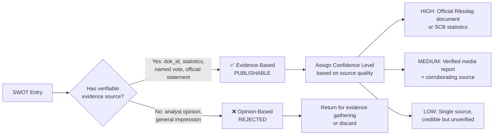
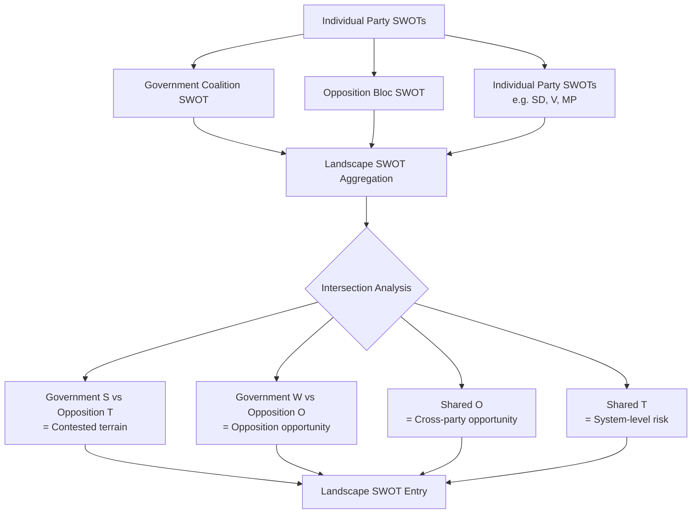
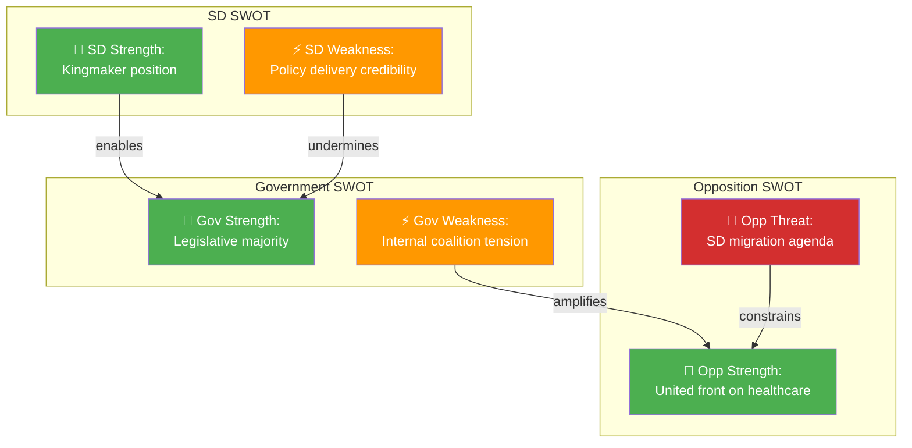
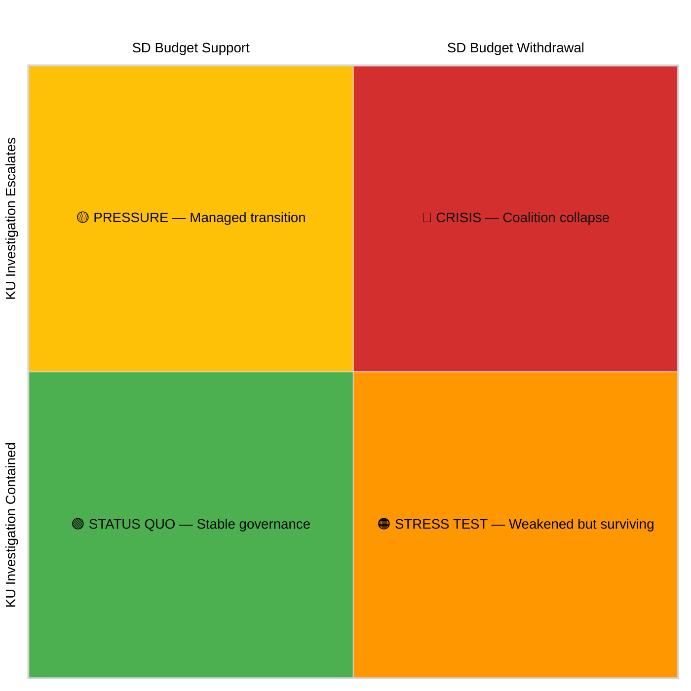
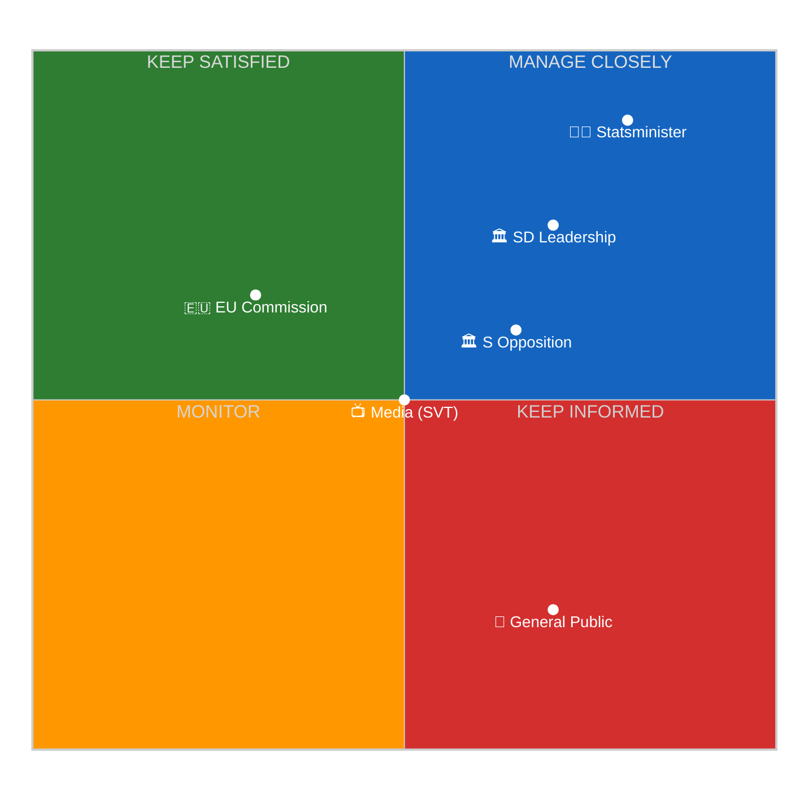
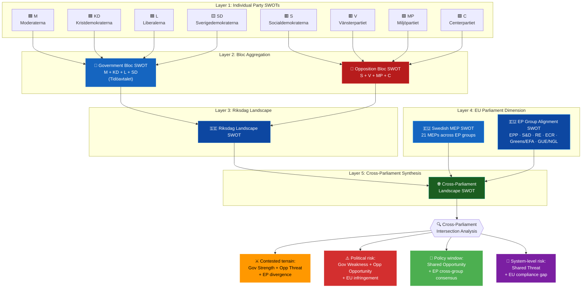
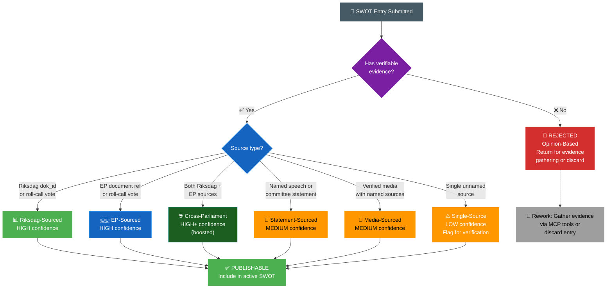
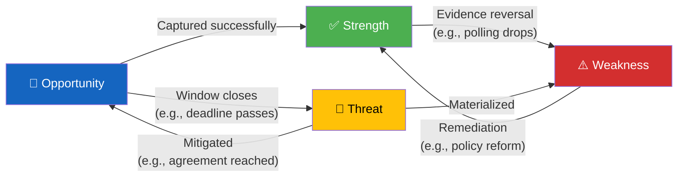

  

<h1 align="center">💼 Political SWOT Analysis Framework</h1>

  <strong>📊 Evidence-Based SWOT Methodology for Political Intelligence</strong> 
  <em>🎯 MCP Sources · Confidence Levels · Cross-SWOT Interference · Scenario Generation · Power-Interest Mapping</em>

  
  
  
  

**📋 Document Owner:** CEO | **📄 Version:** 2.3 | **📅 Last Updated:** 2026-06-01 (UTC)  
**🔄 Review Cycle:** Quarterly | **⏰ Next Review:** 2026-09-01  
**🏢 Owner:** Hack23 AB (Org.nr 5595347807) | **🏷️ Classification:** Public

---

## 🎯 Purpose

This framework establishes the **deep, evidence-based SWOT analysis methodology** for Riksdagsmonitor. Unlike traditional opinion-based SWOT analyses, this methodology requires **verifiable evidence** for every entry — either a Riksdag document ID (`dok_id`), named primary source, or official statistical reference.

Beyond basic SWOT, this framework includes advanced analytical techniques:
- **Cross-SWOT Interference Analysis** — how SWOT elements from different actors interact and amplify each other
- **Strategic Scenario Generation** — using SWOT combinations to construct plausible political futures
- **Power-Interest Mapping** — positioning stakeholders by influence and stake in outcomes
- **TOWS Matrix** — converting SWOT findings into actionable strategic options

Quality standard: [SWOT.md](../../SWOT.md) (965 lines of strategic analysis) and [CIA platform SWOT.md](https://github.com/Hack23/cia/blob/master/SWOT.md).

---

## 📐 Evidence-Based vs. Opinion-Based SWOT

The fundamental distinction that makes political SWOT analysis analytically rigorous:

### Evidence Hierarchy (by confidence level)

| Confidence | Acceptable Sources | Tool / Data Source |
|:----------:|-------------------|----------|
| **HIGH** | Riksdag official document (proposition, betänkande, protokoll) | `get_dokument`, `search_dokument` |
| **HIGH** | Verified voting record | `search_voteringar` |
| **HIGH** | SCB official statistics | World Bank, SCB API |
| **MEDIUM** | Government press release | `search_regering` |
| **MEDIUM** | Named politician's anförande in Riksdag | `search_anforanden` |
| **MEDIUM** | Verified major newspaper with named sources | `search_dokument_fulltext` |
| **LOW** | Single unnamed source | — (flag for verification) |
| **REJECTED** | Analyst inference without evidence | — |

---

## 📊 MCP Data Sources for Each Quadrant

### ✅ Strengths — Optimal MCP Sources

Strengths are typically demonstrated by **achieved results** and **enacted legislation**:

| Strength Type | MCP Tool | Query Strategy |
|--------------|----------|---------------|
| Legislative achievement | `search_dokument` | `doktyp=prop` + `status=antagen` (approved) |
| Coalition vote cohesion | `search_voteringar` | Filter by coalition parties + Ja votes |
| Policy implementation | `search_dokument` | Government `skr` (skrivelse) reports |
| Parliamentary majority | `fetch_report` | `report=ledamotsstatistik` for seat counts |
| International standing | `search_dokument` | `organ=UU` (Foreign Affairs Committee) |

### ⚠️ Weaknesses — Optimal MCP Sources

Weaknesses are demonstrated by **failed votes**, **dissenting opinions**, and **opposition criticism**:

| Weakness Type | MCP Tool | Query Strategy |
|--------------|----------|---------------|
| Internal coalition dissent | `search_voteringar` | Coalition party voting against government |
| Policy failure | `search_dokument` | Withdrawn propositions, failed betänkanden |
| Opposition criticism strength | `get_interpellationer` | Volume and topics of interpellationer |
| Parliamentary minority | `search_voteringar` | Nej votes from coalition on own proposals |
| Public accountability issues | `search_dokument` | KU investigations `organ=KU` |

### 🚀 Opportunities — Optimal MCP Sources

Opportunities are demonstrated by **legislative proposals**, **committee reports**, and **economic data**:

| Opportunity Type | MCP Tool | Query Strategy |
|-----------------|----------|---------------|
| Pending favourable legislation | `get_motioner` | Coalition party motions, high significance |
| Positive economic context | World Bank data + `search_dokument` | FiU positive assessments |
| Upcoming SOU recommendations | `search_dokument` | `doktyp=sou` recent + `search_regering` |
| Nordic/EU opportunity | `search_dokument` | `organ=UU` + EU directive implementation |
| Electoral opportunity | `fetch_report` + `search_voteringar` | Favourable topics + voting patterns |

### 🔴 Threats — Optimal MCP Sources

Threats are demonstrated by **opposition motions**, **no-confidence signals**, and **external pressures**:

| Threat Type | MCP Tool | Query Strategy |
|------------|----------|---------------|
| No-confidence risk | `search_dokument` | `doktyp=miss` (misstroendeförklaring) |
| Opposition mobilisation | `get_motioner` | High-volume opposition motions on key topics |
| Budget squeeze | `search_dokument` | FiU dissenting reservationer |
| Constitutional challenge | `search_dokument` | `organ=KU` active investigations |
| EU compliance pressure | `search_dokument` | EU-directive related propositioner |

---

## 🎯 Confidence Level Assignment (5-Level Scale)

### Assignment Criteria

| Level | Label | Criteria | Example |
|:-----:|-------|---------|---------|
| 🟦 5 | **VERY HIGH** | Multiple official sources, cross-validated, no conflicting evidence; primary source is official Riksdag voting records or government legislation | "Coalition secured 176/349 votes on motion FPM45 (voteringsresultat 2025-11-24, cross-checked against party position statements)" |
| 🟩 4 | **HIGH** | Multiple independent sources corroborate; primary source is official Riksdag document or SCB statistics; source current (within 90 days) | "Coalition secured 176/349 votes on budget motion 2025/26:FPM45 (verified via voteringsresultat 2025-11-24)" |
| 🟧 3 | **MEDIUM** | Single primary source confirmed; or multiple secondary sources; or primary source 90–180 days old | "Government polling at 38% approval per Novus (2026-02-15); single pollster" |
| 🟥 2 | **LOW** | Credible but single unverified source; inference from related evidence; source 180+ days old | "Estimated L party dissent based on parliamentary debate tone — no formal vote yet" |
| ⬛ 1 | **VERY LOW** | Speculation only; no direct evidence; inferred from general political patterns | "Possible SD internal disagreement suggested by tone of spokesperson statement" |

### Confidence Decay Rule

SWOT entries age and their confidence level **automatically degrades** over time:

| Original Confidence | After 30 days | After 90 days | After 180 days |
|--------------------|:------------:|:-------------:|:--------------:|
| VERY HIGH | VERY HIGH | HIGH | MEDIUM |
| HIGH | HIGH | MEDIUM | LOW |
| MEDIUM | MEDIUM | LOW | EXPIRED |
| LOW | LOW | EXPIRED | EXPIRED |
| VERY LOW | EXPIRED | EXPIRED | EXPIRED |

**EXPIRED entries must be re-verified or removed before inclusion in new SWOT analyses.**

> **Clarification:** EXPIRED is a **lifecycle status**, not a confidence level. When temporal decay moves an entry to EXPIRED, it must be handled per the rules below. An active SWOT analysis contains ONLY entries with confidence VERY HIGH, HIGH, MEDIUM, or LOW.

### Handling EXPIRED Entries

When an entry reaches EXPIRED status:

1. **Re-verify**: Check if updated evidence exists via MCP tools (e.g., new vote record, updated SCB data)
2. **Refresh**: If new evidence found, create a NEW entry with fresh confidence and updated evidence
3. **Archive**: If no new evidence, move entry to "Historical Context" section (informational, not active SWOT)
4. **Remove**: If the situation has fundamentally changed (e.g., new coalition formed), delete the entry entirely

> **Rule:** An active SWOT analysis must contain ZERO expired entries. Every entry must have a confidence of VERY HIGH, HIGH, MEDIUM, or LOW with a clear evidence trail.

---

## 🗳️ Election 2026 — Mandatory SWOT Dimension

> **Added in v2.3 — Election 2026 is a MANDATORY SWOT dimension for all analyses in 2025–2026.**

With the September 2026 Swedish general election approaching, every SWOT analysis MUST include an **Electoral Dimension** assessment across all four quadrants.

### Electoral SWOT Quadrant Requirements

| Quadrant | Election 2026 Focus | Evidence Standard |
|----------|--------------------|--------------------|
| **Strengths** | Policies that position governing coalition favorably for 2026 (track record, deliveries, approval metrics) | Opinion polling, government implementation reports |
| **Weaknesses** | Policy failures or controversies that create electoral vulnerabilities (budget gaps, coalition tensions, unfulfilled promises) | Riksdag debates, media coverage, opposition motions |
| **Opportunities** | Policy areas where the government can score electoral wins before September 2026 | Legislative calendar, EU funds, pending legislation |
| **Threats** | External events or opposition strategies that could damage electoral prospects | Opposition motions, global economic indicators, security events |

### Minimum Electoral SWOT Requirements

Every SWOT analysis produced within 18 months of September 2026 MUST include:
- **≥1 Strength entry** with specific electoral relevance and evidence
- **≥1 Weakness entry** with specific electoral vulnerability and attack vector potential
- **≥1 Opportunity entry** with timeline relative to election date
- **≥1 Threat entry** with probability assessment and mitigation options

### Electoral SWOT Confidence Standards

Electoral SWOT entries require **MEDIUM confidence minimum** (3+ sources). **VERY LOW** confidence content is **not** permitted as an active Electoral SWOT entry and must **not** be used to satisfy the minimum Strength/Weakness/Opportunity/Threat requirements above. Speculation about electoral consequences without supporting polling or documented party positions may only appear in a clearly separate **Speculative / Monitoring Notes** subsection, labeled **VERY LOW**, and isolated from substantive findings.

---

## 🔗 Aggregating Party/Coalition SWOTs into Landscape SWOT

When analysing the full political landscape, aggregate individual party SWOTs using this protocol:

### Aggregation Steps

### Intersection Rules

- **Government Strength + Opposition Threat** = Priority watchpoint (contested terrain)
- **Government Weakness + Opposition Opportunity** = High-significance political risk
- **Shared Opportunity** (both sides see it) = Major policy window; cross-party deal possible
- **Shared Threat** (both sides face it) = System-level risk; constitutional/economic dimension

### Weighting Rules for Landscape SWOT

When aggregating individual party/coalition SWOTs into a landscape SWOT:

| Source SWOT | Weight | Rationale |
|:----------:|:------:|-----------|
| Government Coalition | **0.40** | Governing parties set policy agenda; their position has highest system impact |
| Main Opposition (S) | **0.25** | Largest opposition party; primary alternative government |
| SD (supply-and-confidence) | **0.20** | Kingmaker role; coalition depends on SD support |
| Minor parties (V, MP, C, L) | **0.15** | Combined weight; influence through committee and budget negotiations |

**Conflict resolution:** When government SWOT entry contradicts opposition SWOT entry on the same topic, include BOTH in the landscape SWOT as "contested terrain" with a note identifying the conflict. Do NOT average or remove conflicting entries.

**Minimum landscape SWOT requirements:**
- ≥ 3 Strengths (at least 1 from government, 1 from opposition perspective)
- ≥ 3 Weaknesses (at least 1 from each side)
- ≥ 2 Opportunities (at least 1 shared across perspectives)
- ≥ 3 Threats (at least 1 system-level)

---

## 📚 SWOT Generation Pipeline Reference

The SWOT generation pipeline is driven by AI agents reading methodology documents and producing per-file analysis:

| File | Purpose |
|------|---------|
| `scripts/prompts/v2/swot-generation.md` | LLM prompts for SWOT generation (v2) |
| `scripts/prompts/v2/per-file-intelligence-analysis.md` | Per-file analysis protocol |
| `analysis/templates/per-file-political-intelligence.md` | Per-file output template with SWOT section |
| `analysis/templates/swot-analysis.md` | Standalone SWOT template for daily/weekly synthesis |
| `scripts/ai-analysis/swot/` | SWOT-specific AI analysis scripts |
| `scripts/analysis-framework/lenses/` | Per-perspective evidence gathering |

### AI Analysis Protocol for SWOT

The AI agent **MUST** follow this protocol when generating SWOT analysis:

1. **Read this framework** — understand evidence hierarchy, confidence levels, decay rules, AND the advanced techniques below
2. **Query MCP tools** — use the tool/query strategies from the tables above for each quadrant
3. **Fill SWOT template** — every entry needs: Statement + Evidence (dok_id) + Confidence + Impact
4. **Apply Cross-SWOT Interference** — identify how SWOT elements from different actors amplify each other
5. **Apply intersection analysis** — identify contested terrain, opposition opportunities, shared risks
6. **Generate TOWS strategic options** — convert findings to strategic implications
7. **Validate quality gate** — ≥ 2 entries per quadrant, zero opinion-only entries, zero EXPIRED entries

---

## 🔄 Advanced Technique 1: Cross-SWOT Interference Analysis

When the political landscape involves multiple actors (government, opposition, kingmaker SD), their SWOT elements don't exist in isolation — they **interfere** with each other, creating amplification effects:

### Interference Matrix

| Gov SWOT Element | Opp SWOT Element | Interference Effect | Implication |
|:----------------:|:----------------:|:------------------:|------------|
| **Gov Strength** + Opp Weakness | — | Reinforcing advantage | Government position consolidates |
| **Gov Weakness** + Opp Strength | — | Amplified vulnerability | Opposition likely to exploit |
| **Gov Threat** + Opp Opportunity | — | Converging pressure | High-risk political moment |
| **Gov Strength** + SD Weakness | — | Fragile dependency | Majority depends on unreliable support |

### Interference Detection Protocol

For each SWOT entry:
1. Ask: "Does this element AMPLIFY or COUNTERACT any element from another actor's SWOT?"
2. Map the interference (amplifies, enables, undermines, constrains)
3. Rate the interference strength (strong/moderate/weak)
4. Identify the **net political effect** — is the system moving toward stability or instability?

---

## 📊 Advanced Technique 2: TOWS Strategic Options Matrix

TOWS converts SWOT findings into **strategic options** — answering "So what?" for each SWOT combination:

| TOWS Cell | Political Context | Example |
|:---------:|------------------|---------|
| **SO** (Strength × Opportunity) | "Government uses legislative majority (S1) to pass popular criminal justice reform (O1) before election" | Proactive agenda-setting |
| **WO** (Weakness × Opportunity) | "Coalition uses EU mandate (O2) to force internal alignment on migration (W1)" | External pressure as internal discipline |
| **ST** (Strength × Threat) | "Government uses budget control (S2) to fund SD-priority policies, neutralising withdrawal threat (T1)" | Pre-emptive concession |
| **WT** (Weakness × Threat) | "Internal dissent (W1) + SD withdrawal threat (T1) = highest-risk scenario requiring immediate coalition management" | Defensive damage control |

**Every SWOT analysis MUST include at least 2 TOWS strategic options** with evidence-backed reasoning.

---

## 🔮 Advanced Technique 3: Strategic Scenario Generation

Use SWOT combinations to construct **plausible political futures** (scenarios), each with a probability range and trigger conditions:

### Scenario Construction Protocol

1. **Identify 2–3 key uncertainties** from the SWOT analysis (e.g., "Will SD support the budget?" + "Will KU investigation escalate?")
2. **Construct 2×2 scenario matrix** from the two most impactful uncertainties
3. **Name each scenario** and describe its political characteristics
4. **Assign probability ranges** based on evidence
5. **Identify trigger indicators** that would signal movement toward each scenario

### Example Scenario Matrix

| Scenario | SD Budget Support | KU Outcome | Probability | Key Trigger |
|----------|:-----------------:|:----------:|:-----------:|------------|
| 🟢 **Status Quo** | Supports | Contained | 40–55% | SD publicly confirms budget support |
| 🟠 **Stress Test** | Supports | Escalates | 15–25% | KU hearing reveals new evidence |
| 🟡 **Pressure** | Withdraws | Contained | 10–20% | SD demands unmet, partial withdrawal |
| 🔴 **Crisis** | Withdraws | Escalates | 5–15% | Combined pressure triggers no-confidence |

---

## 📐 Advanced Technique 4: Power-Interest Mapping

Position key stakeholders by their **power** (ability to influence outcomes) and **interest** (stake in specific issues) to identify who matters most:

| Quadrant | Strategy | Stakeholders |
|----------|---------|-------------|
| **Manage Closely** (high power, high interest) | Full analysis; primary intelligence consumer | Government leadership, coalition partners, SD |
| **Keep Satisfied** (high power, low interest) | Monitor for engagement; alert on activation | EU Commission, NATO allies, central bank |
| **Keep Informed** (low power, high interest) | Regular reporting; citizen engagement | Media, civil society, general public |
| **Monitor** (low power, low interest) | Periodic check; no active engagement | Minor parties, regional actors |

---

## 🇪🇺 EU Parliament Monitor Integration

### Cross-Parliament Evidence Hierarchy

Riksdagsmonitor enriches its SWOT analysis with **EU Parliament data** via the [European Parliament MCP Server](https://github.com/Hack23/European-Parliament-MCP-Server). When Swedish domestic policy intersects EU legislation, **cross-parliament evidence** strengthens confidence assessments.

| Confidence | Acceptable Sources | Tool / Data Source |
|:----------:|-------------------|----------|
| **HIGH** | Official Riksdag voted text, verified roll-call record | `search_voteringar`, `get_betankanden` |
| **HIGH** | Government proposition text (approved or tabled) | `get_propositioner` |
| **HIGH** | SCB / Eurostat official statistics | SCB API, World Bank, Eurostat |
| **HIGH** | EP plenary roll-call vote (verified) | EP Open Data `/votes` |
| **MEDIUM** | Named MP speech in Riksdag plenary record | `search_anforanden` |
| **MEDIUM** | Committee / commission statement (Riksdag or EP) | `search_dokument`, EP `/committees` |
| **MEDIUM** | Verified media outlet with named sources | External (flagged) |
| **MEDIUM** | Swedish MEP activity in EP plenary or committee | EP `/meps`, EP `/activities` |
| **LOW** | Single unnamed source | — (flag for verification) |
| **REJECTED** | Analyst inference without evidence | — (not accepted) |

> **Cross-Parliament Rule:** When a SWOT entry cites both a Riksdag source (`dok_id`) and an EP source (EP document reference), it receives a **+1 confidence boost** (e.g., MEDIUM → HIGH) because cross-parliament corroboration significantly increases reliability.

### Cross-Parliament Confidence Decay

SWOT entries using cross-parliament evidence follow **slower/extended decay** because EU legislative timelines are longer (co-decision procedures span 12–24 months):

| Original Confidence | After 30 days | After 90 days | After 180 days |
|:-------------------:|:-------------:|:-------------:|:--------------:|
| **HIGH** | HIGH | HIGH | MEDIUM |
| **MEDIUM** | MEDIUM | LOW | EXPIRED |
| **LOW** | LOW | EXPIRED | EXPIRED |

> **Note:** EU legislative procedure references (COD, CNS, APP) decay **slower** than domestic Riksdag references because EU procedures move on multi-year timescales. A pending EU directive cited in a SWOT entry retains HIGH confidence for 90 days (vs. 30 for domestic-only entries). **EXPIRED** entries must be re-verified via EP Open Data or removed from active analysis.

---

### 🇪🇺 EU Parliament MCP Data Sources for Each Quadrant

#### ✅ Strengths — EU Parliament Dimension

Swedish government strengths reinforced by EU-level legislative achievements and MEP influence:

| Strength Type | Riksdag MCP Tool | EU Parliament Source | Cross-Reference Strategy |
|--------------|------------------|---------------------|-------------------------|
| Legislative achievement with EU mandate | `get_betankanden`, `search_voteringar` | EP `/votes` (roll-call) | Match Riksdag betänkande to EU directive transposition |
| Coalition cohesion on EU policy | `search_voteringar`, `get_propositioner` | EP `/meps` (Swedish MEP votes) | Compare coalition party discipline: Riksdag vs. EP group |
| Strong EP group alignment | External/manual: EP seat count data (e.g. European-Parliament-MCP-Server) | EP `/committees` | Swedish MEPs in key EP committee chair/rapporteur roles |
| EU funding secured | `search_dokument` (`organ=FiU`) | Eurostat, EU budget data | Cross-reference FiU assessment with EU allocation data |

#### ⚠️ Weaknesses — EU Parliament Dimension

Party fragmentation and policy stalls visible through cross-parliament comparison:

| Weakness Type | Riksdag MCP Tool | EU Parliament Source | Cross-Reference Strategy |
|--------------|------------------|---------------------|-------------------------|
| Riksdag–EP voting misalignment | `search_voteringar` (defection rates) | EP `/votes` (Swedish MEPs) | Party votes YES in Riksdag but Swedish MEPs vote NO in EP |
| Unanswered interpellationer on EU policy | `get_interpellationer` | EP `/documents` | Government silent on EU issues raised by opposition |
| EU infringement proceedings against Sweden | `search_dokument` (`organ=UU`) | EUR-Lex infringement data | Map pending infringements to legislative inaction |
| Swedish MEP influence deficit | — | EP `/committees`, `/activities` | Few Swedish rapporteurships or committee chairs |

#### 🚀 Opportunities — EU Parliament Dimension

Pending EU legislation and cross-party consensus windows:

| Opportunity Type | Riksdag MCP Tool | EU Parliament Source | Cross-Reference Strategy |
|-----------------|------------------|---------------------|-------------------------|
| Pending EU legislation favourable to Sweden | `get_propositioner`, `get_calendar_events` | EP `/documents` (COD procedures) | Match pending EP votes to Riksdag preparatory work |
| Cross-party consensus in EP benefiting Sweden | `search_voteringar` | EP `/votes` (Swedish MEP unanimity) | All Swedish MEPs voting together = strong national position |
| EU funding opportunities | `search_dokument` (`organ=FiU`) | EU budget / NextGenerationEU | Identify uncommitted EU funds for Swedish priorities |
| Nordic bloc coordination in EP | `search_dokument` (`organ=UU`) | EP `/meps` (Nordic MEPs) | Joint Nordic positions in EP committees and votes |

#### 🔴 Threats — EU Parliament Dimension

SD leverage on EU policy, budget disputes, and opposition attacks with EU ammunition:

| Threat Type | Riksdag MCP Tool | EU Parliament Source | Cross-Reference Strategy |
|------------|------------------|---------------------|-------------------------|
| SD leveraging EU migration policy | `search_voteringar`, `search_anforanden` | EP `/votes` (ECR group) | SD demands map to ECR group positions in EP |
| Opposition using EU comparison data | `get_motioner`, `search_anforanden` | Eurostat, EP `/documents` | S/V/MP citing EU benchmarks Sweden fails to meet |
| EU regulatory burden on Swedish industry | `search_dokument` | EP `/documents` (pending directives) | Upcoming EU regulation impact on Swedish competitiveness |
| Budget disputes amplified by EU contributions | `search_voteringar` (budget votes) | EU budget data | Swedish EU contribution changes affecting domestic budget |

---

## 🔄 Cross-Parliament SWOT Aggregation

### Riksdag ↔ EU Parliament Aggregation Pipeline

When political analysis requires both domestic and EU-level intelligence, individual party SWOTs aggregate through **two parliamentary layers**:

### Cross-Parliament Intersection Rules

| Riksdag SWOT Element | EU Parliament Element | Intersection Type | Significance |
|:--------------------:|:--------------------:|:-----------------:|:------------|
| **Gov Strength** + EP group alignment | Swedish MEPs in majority EP group | **Reinforced strength** | Sweden's position amplified in EU negotiations |
| **Gov Weakness** + EP infringement pressure | Pending EU infringement case | **Amplified vulnerability** | Domestic policy failure + EU enforcement = high risk |
| **Gov Threat** (SD leverage) + ECR group dynamics | ECR group internal splits | **Mediated threat** | SD leverage may be constrained by EP group realities |
| **Opp Opportunity** + EP cross-group majority | Broad EP consensus on policy | **Enhanced opportunity** | Opposition cites EU consensus to pressure government |
| **Shared Opportunity** + EU legislative window | Pending COD procedure favourable to Sweden | **Strategic window** | Cross-bloc domestic deal possible under EU mandate |
| **Shared Threat** + EU compliance deadline | Hard EU transposition deadline | **Elevated system risk** | Failure to act has legal consequences beyond domestic politics |

### Swedish Party → EP Group Mapping

Understanding which EP groups align with Swedish parties is essential for cross-parliament SWOT:

| Swedish Party | EP Political Group | Alignment Strength | SWOT Implication |
|:------------:|:-----------------:|:------------------:|:----------------|
| **M** (Moderaterna) | EPP (European People's Party) | Strong | EPP majority positions reinforce M's domestic agenda |
| **KD** (Kristdemokraterna) | EPP | Strong | KD benefits from EPP family policy positions |
| **L** (Liberalerna) | Renew Europe (RE) | Moderate | RE liberal positions sometimes conflict with Tidöavtalet |
| **SD** (Sverigedemokraterna) | ECR (European Conservatives) | Moderate | ECR migration stance aligns but EU-scepticism limits leverage |
| **S** (Socialdemokraterna) | S&D (Socialists & Democrats) | Strong | S&D positions provide ammunition for opposition criticism |
| **V** (Vänsterpartiet) | GUE/NGL (The Left) | Moderate | EU-critical stance limits V's use of EP evidence |
| **MP** (Miljöpartiet) | Greens/EFA | Strong | Green Deal alignment gives MP strong EU-backed arguments |
| **C** (Centerpartiet) | Renew Europe (RE) | Moderate | RE market-liberal positions support C's deregulation agenda |

---

## 🛡️ Evidence-Based vs. Opinion-Based SWOT — Full Decision Tree

Every SWOT entry — whether from Riksdag, EU Parliament, or cross-parliament sources — must pass this gate:

### ⛔ Anti-Pattern Warning

> **🚨 SWOT entries without specific evidence citations (`dok_id`, MCP tool outputs, EP document references, or named sources) are REJECTED.**
>
> This is a **hard gate** — no exceptions. Analyst inference, general impressions, "common knowledge," and unsourced claims do not qualify as evidence. If an entry cannot cite at least one of:
> - A Riksdag document ID (`dok_id`, e.g., `H901FiU1`)
> - An MCP tool query result (e.g., `search_voteringar` output)
> - An EP document reference (e.g., `A9-0123/2026`)
> - A named primary source with date and context
>
> …then it **must not appear** in a published SWOT analysis. Return it for evidence gathering via the appropriate MCP tools, or discard it entirely.

---

## 🔄 SWOT Evolution Tracking (v2.2)

SWOT analyses are **living documents** that change as the political landscape evolves. This section defines how to track SWOT changes over time, detect inter-quadrant migration, and aggregate cross-day SWOT data for weekly/monthly reviews.

### SWOT Delta Template

When producing sequential SWOT analyses (e.g., daily or weekly), include a **SWOT Delta** section showing what changed since the previous analysis:

| Quadrant | Entry | Status | Prior Day | Current Day | Evidence for Change |
|:---|:---|:---:|:---|:---|:---|
| **Strength** | Coalition voting cohesion at 89% | **Persists** ✅ | S1: 89% cohesion (2026-03-31) | S1: 89% cohesion (2026-04-01) | `search_voteringar rm=2025/26` — no new votes |
| **Strength** | L above 4% threshold | **Degraded** ⬇️ | S3: L at 4.4% (Novus 2026-03-15) | → Moved to Weakness | SCB partisympati 2026-04-01: L at 3.8% (±1.1%) |
| **Weakness** | L threshold risk | **New** 🆕 | *(not present)* | W4: L at 3.8% (±1.1%) | Migrated from Strength S3 |
| **Opportunity** | FiU spring budget amendment | **Resolved** ✓ | O2: Spring amending budget expected | *(removed — event occurred)* | Budget tabled 2026-04-01 via `get_propositioner` |
| **Threat** | SD migration ultimatum | **Escalated** ↑ | T1: SD rhetoric intensifying | T1: SD formal demand via interpellation | `get_interpellationer` dok_id: HD04567 |

#### Status Codes

| Code | Meaning | Action Required |
|:---:|:---|:---|
| **Persists** ✅ | Entry unchanged — same evidence, same assessment | Carry forward with updated date |
| **New** 🆕 | Entry did not exist in prior analysis | Document the triggering evidence and date |
| **Degraded** ⬇️ | Entry's evidence weakened or confidence decayed | Update confidence level; consider migration |
| **Escalated** ↑ | Entry's severity or confidence increased | Update with new evidence; re-score |
| **Resolved** ✓ | The underlying situation no longer applies | Remove from active SWOT; archive in historical context |
| **Migrated** ↔ | Entry moved to a different quadrant | Document both the old and new quadrant |

### Inter-Quadrant Migration Rules

SWOT entries can **migrate between quadrants** as the political situation evolves. Common migration patterns:

#### Migration Examples

| Migration | Example | Trigger Evidence |
|:---|:---|:---|
| **Strength → Weakness** | Coalition voting cohesion 89% → 62% after contested FöU vote | `search_voteringar rm=2025/26, bet=FöU8` |
| **Opportunity → Threat** | EU Green Deal funding window closes without Swedish application submitted | EU deadline + `search_dokument` for missing proposition |
| **Threat → Weakness** | SD migration ultimatum materializes — coalition partner defects on SfU vote | `search_voteringar` showing SD voting with opposition |
| **Weakness → Strength** | Government successfully renegotiates Tidöavtal migration section | Joint coalition press conference + `search_dokument` |
| **Opportunity → Strength** | Government captures spring budget opportunity with cross-party support | `search_voteringar rm=2025/26, bet=FiU20` |

> **Rule:** Every migration MUST cite the specific MCP evidence that triggered the move. Undocumented migrations are rejected.

### Cross-Document SWOT Aggregation Protocol

When producing **weekly reviews** or **monthly strategic briefs**, aggregate daily SWOT analyses using this protocol:

#### Step 1: Collect Daily SWOTs

Gather all SWOT analyses from `analysis/daily/YYYY-MM-DD/*/swot-analysis.md` for the period.

#### Step 2: Frequency Analysis

Count how many times each SWOT entry appears across the period:

| Entry | Quadrant | Appearances (out of N days) | Persistence Rate | Trend |
|:---|:---|:---:|:---:|:---:|
| Coalition cohesion ≥85% | Strength | 5/5 | 100% | → Stable |
| L threshold risk | Weakness | 3/5 | 60% | ↑ Emerging |
| SD migration demands | Threat | 5/5 | 100% | ↑ Escalating |
| FiU spring budget | Opportunity | 2/5 | 40% | ↓ Resolving |

#### Step 3: Weighted Aggregation

For the aggregated weekly/monthly SWOT:

- **Include** entries with ≥60% persistence rate as core items
- **Flag** entries with 30–59% persistence as emerging/resolving
- **Exclude** entries with <30% persistence (one-off events) unless they triggered a migration
- **Weight** by confidence: HIGH entries count 1.0×, MEDIUM 0.7×, LOW 0.4×

#### Step 4: Delta Summary

Produce a period-level delta:

> **Weekly SWOT Delta (2026-03-31 to 2026-04-06):**
> - **New Strengths:** 1 (budget passed with cross-party support)
> - **Lost Strengths:** 1 (L polling dropped below 4% → migrated to Weakness)
> - **New Threats:** 2 (SD interpellation, ECJ infringement warning)
> - **Resolved Opportunities:** 1 (spring budget tabled)
> - **Net SWOT Balance:** Weakening (−1 Strength, +2 Threats)

---

## 🔗 Related Documents

- [templates/swot-analysis.md](../templates/swot-analysis.md) — SWOT template
- [reference/isms-style-guide-adaptation.md](../reference/isms-style-guide-adaptation.md) — Writing standards
- [SWOT.md](../../SWOT.md) — Platform strategic SWOT
- [political-style-guide.md](political-style-guide.md) — Writing standards
- [EU Parliament MCP Server](https://github.com/Hack23/European-Parliament-MCP-Server) — EP data integration
- [EU Parliament Monitor](https://euparliamentmonitor.com) — Pan-European legislative intelligence

---

**Document Control:**  
- **Path:** `/analysis/methodologies/political-swot-framework.md`  
- **CIA Reference:** [CIA SWOT.md](https://github.com/Hack23/cia/blob/master/SWOT.md)  
- **Version:** 2.3  
- **Advanced Techniques:** Cross-SWOT Interference, TOWS Matrix, Scenario Generation, Power-Interest Mapping, EU Parliament Cross-Reference, SWOT Evolution Tracking, Election 2026 Mandatory Dimension  
- **Key Changes v2.3:** Election 2026 as mandatory SWOT dimension (electoral quadrant requirements, confidence standards for electoral entries), 5-level confidence scale replacing HIGH/MEDIUM/LOW (VERY HIGH/HIGH/MEDIUM/LOW/VERY LOW with updated decay table)  
- **Key Changes v2.2:** SWOT Evolution Tracking (SWOT Delta template, inter-quadrant migration rules with Mermaid diagram, cross-document aggregation protocol for weekly/monthly reviews)  
- **EU Integration:** European Parliament MCP Server data sources, cross-parliament aggregation, Swedish MEP ↔ EP group mapping  
- **Classification:** Public  
- **Next Review:** 2026-09-01
