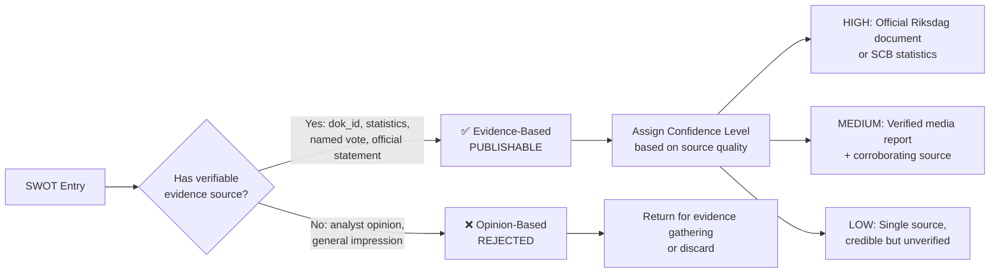
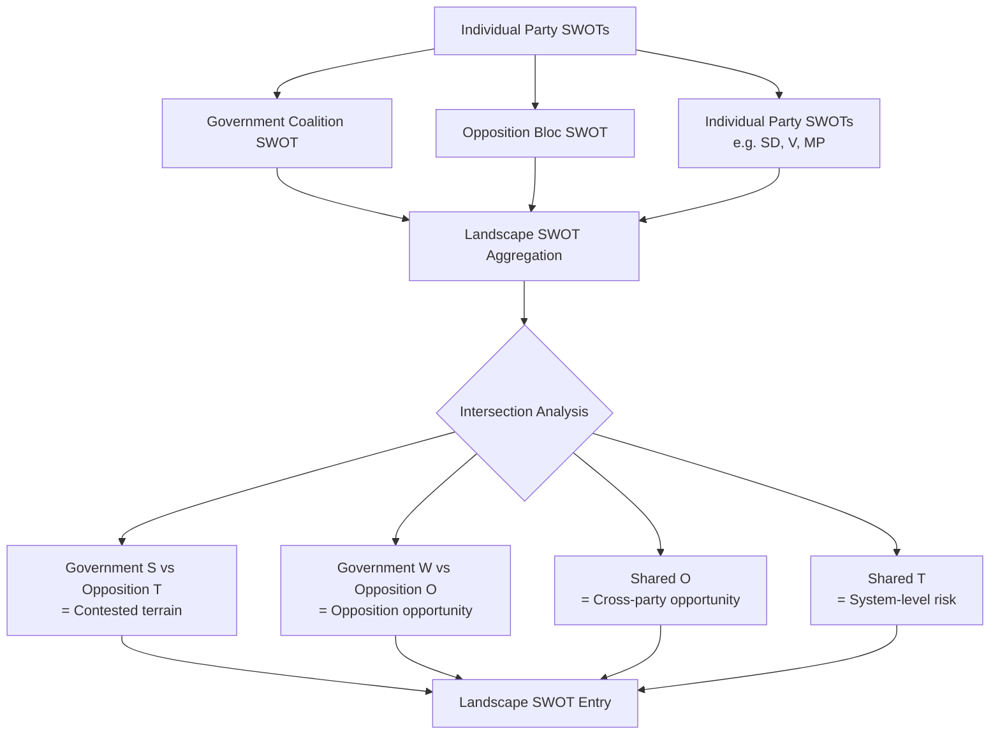

  

<h1 align="center">💼 Political SWOT Analysis Framework</h1>

  <strong>📊 Evidence-Based SWOT Methodology for Political Intelligence</strong> 
  <em>🎯 MCP Sources · Confidence Levels · Aggregation · Temporal Decay</em>

  
  
  
  

**📋 Document Owner:** CEO | **📄 Version:** 1.0 | **📅 Last Updated:** 2026-03-26 (UTC)  
**🔄 Review Cycle:** Quarterly | **⏰ Next Review:** 2026-06-26  
**🏢 Owner:** Hack23 AB (Org.nr 5595347807) | **🏷️ Classification:** Public

---

## 🎯 Purpose

This framework establishes the evidence-based SWOT analysis methodology for Riksdagsmonitor. Unlike traditional opinion-based SWOT analyses, this methodology requires **verifiable evidence** for every entry — either a Riksdag document ID (`dok_id`), named primary source, or official statistical reference.

This methodology is inspired by [CIA platform SWOT.md](https://github.com/Hack23/cia/blob/master/SWOT.md) and [Riksdagsmonitor SWOT.md](../../SWOT.md), adapted for automated agentic political intelligence generation.

---

## 📐 Evidence-Based vs. Opinion-Based SWOT

The fundamental distinction that makes political SWOT analysis analytically rigorous:

### Evidence Hierarchy (by confidence level)

| Confidence | Acceptable Sources | MCP Tool |
|:----------:|-------------------|----------|
| **HIGH** | Riksdag official document (proposition, betänkande, protokoll) | `get_dokument`, `search_dokument` |
| **HIGH** | Verified voting record | `search_voteringar` |
| **HIGH** | SCB official statistics | World Bank, SCB API |
| **MEDIUM** | Government press release | `search_regering` |
| **MEDIUM** | Named politician's anförande in Riksdag | `search_anforanden` |
| **MEDIUM** | Verified major newspaper with named sources | `search_dokument_fulltext` |
| **LOW** | Single unnamed source | — (flag for verification) |
| **REJECTED** | Analyst inference without evidence | — |

---

## 📊 MCP Data Sources for Each Quadrant

### ✅ Strengths — Optimal MCP Sources

Strengths are typically demonstrated by **achieved results** and **enacted legislation**:

| Strength Type | MCP Tool | Query Strategy |
|--------------|----------|---------------|
| Legislative achievement | `search_dokument` | `doktyp=prop` + `status=antagen` (approved) |
| Coalition vote cohesion | `search_voteringar` | Filter by coalition parties + Ja votes |
| Policy implementation | `search_dokument` | Government `skr` (skrivelse) reports |
| Parliamentary majority | `fetch_report` | `report=ledamotsstatistik` for seat counts |
| International standing | `search_dokument` | `organ=UU` (Foreign Affairs Committee) |

### ⚠️ Weaknesses — Optimal MCP Sources

Weaknesses are demonstrated by **failed votes**, **dissenting opinions**, and **opposition criticism**:

| Weakness Type | MCP Tool | Query Strategy |
|--------------|----------|---------------|
| Internal coalition dissent | `search_voteringar` | Coalition party voting against government |
| Policy failure | `search_dokument` | Withdrawn propositions, failed betänkanden |
| Opposition criticism strength | `get_interpellationer` | Volume and topics of interpellationer |
| Parliamentary minority | `search_voteringar` | Nej votes from coalition on own proposals |
| Public accountability issues | `search_dokument` | KU investigations `organ=KU` |

### 🚀 Opportunities — Optimal MCP Sources

Opportunities are demonstrated by **legislative proposals**, **committee reports**, and **economic data**:

| Opportunity Type | MCP Tool | Query Strategy |
|-----------------|----------|---------------|
| Pending favourable legislation | `get_motioner` | Coalition party motions, high significance |
| Positive economic context | World Bank data + `search_dokument` | FiU positive assessments |
| Upcoming SOU recommendations | `search_dokument` | `doktyp=sou` recent + `search_regering` |
| Nordic/EU opportunity | `search_dokument` | `organ=UU` + EU directive implementation |
| Electoral opportunity | `fetch_report` + `search_voteringar` | Favourable topics + voting patterns |

### 🔴 Threats — Optimal MCP Sources

Threats are demonstrated by **opposition motions**, **no-confidence signals**, and **external pressures**:

| Threat Type | MCP Tool | Query Strategy |
|------------|----------|---------------|
| No-confidence risk | `search_dokument` | `doktyp=miss` (misstroendeförklaring) |
| Opposition mobilisation | `get_motioner` | High-volume opposition motions on key topics |
| Budget squeeze | `search_dokument` | FiU dissenting reservationer |
| Constitutional challenge | `search_dokument` | `organ=KU` active investigations |
| EU compliance pressure | `search_dokument` | EU-directive related propositioner |

---

## 🎯 Confidence Level Assignment

### Assignment Criteria

| Level | Criteria | Example |
|-------|---------|---------|
| **HIGH** | Multiple independent sources corroborate; primary source is official Riksdag document or SCB statistics; source is current (within 90 days) | "Coalition secured 176/349 votes on budget motion 2025/26:FPM45 (verified via voteringsresultat 2025-11-24)" |
| **MEDIUM** | Single primary source confirmed; or multiple secondary sources; or primary source older than 90 days | "Government polling at 38% approval per Novus (2026-02-15); single pollster" |
| **LOW** | Credible but single unverified source; inference from related evidence; source older than 180 days | "Estimated L party dissent based on parliamentary debate tone — no formal vote yet" |

### Confidence Decay Rule

SWOT entries age and their confidence level **automatically degrades** over time:

| Original Confidence | After 30 days | After 90 days | After 180 days |
|--------------------|:------------:|:-------------:|:--------------:|
| HIGH | HIGH | MEDIUM | LOW |
| MEDIUM | MEDIUM | LOW | EXPIRED |
| LOW | LOW | EXPIRED | EXPIRED |

**EXPIRED entries must be re-verified or removed before inclusion in new SWOT analyses.**

---

## 🔗 Aggregating Party/Coalition SWOTs into Landscape SWOT

When analysing the full political landscape, aggregate individual party SWOTs using this protocol:

### Aggregation Steps

### Intersection Rules

- **Government Strength + Opposition Threat** = Priority watchpoint (contested terrain)
- **Government Weakness + Opposition Opportunity** = High-significance political risk
- **Shared Opportunity** (both sides see it) = Major policy window; cross-party deal possible
- **Shared Threat** (both sides face it) = System-level risk; constitutional/economic dimension

---

## 📚 SWOT Generation Pipeline Reference

The automated SWOT generation pipeline is implemented in:

| File | Purpose |
|------|---------|
| `scripts/ai-analysis/swot/` | SWOT-specific AI analysis scripts |
| `scripts/prompts/v1/swot-generation.md` | LLM prompts for SWOT generation |
| `scripts/prompts/v1/stakeholder-perspectives.md` | Stakeholder perspective prompts used in SWOT |
| `scripts/analysis-framework/lenses/` | Per-perspective evidence gathering |

---

## 🔗 Related Documents

- [templates/swot-analysis.md](../templates/swot-analysis.md) — SWOT template
- [reference/isms-style-guide-adaptation.md](../reference/isms-style-guide-adaptation.md) — Writing standards
- [SWOT.md](../../SWOT.md) — Platform strategic SWOT
- [political-style-guide.md](political-style-guide.md) — Writing standards

---

**Document Control:**  
- **Path:** `/analysis/methodologies/political-swot-framework.md`  
- **CIA Reference:** [CIA SWOT.md](https://github.com/Hack23/cia/blob/master/SWOT.md)  
- **Classification:** Public  
- **Next Review:** 2026-06-26
