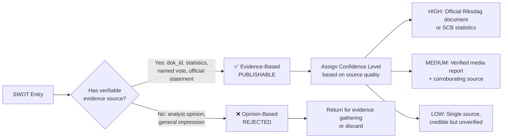
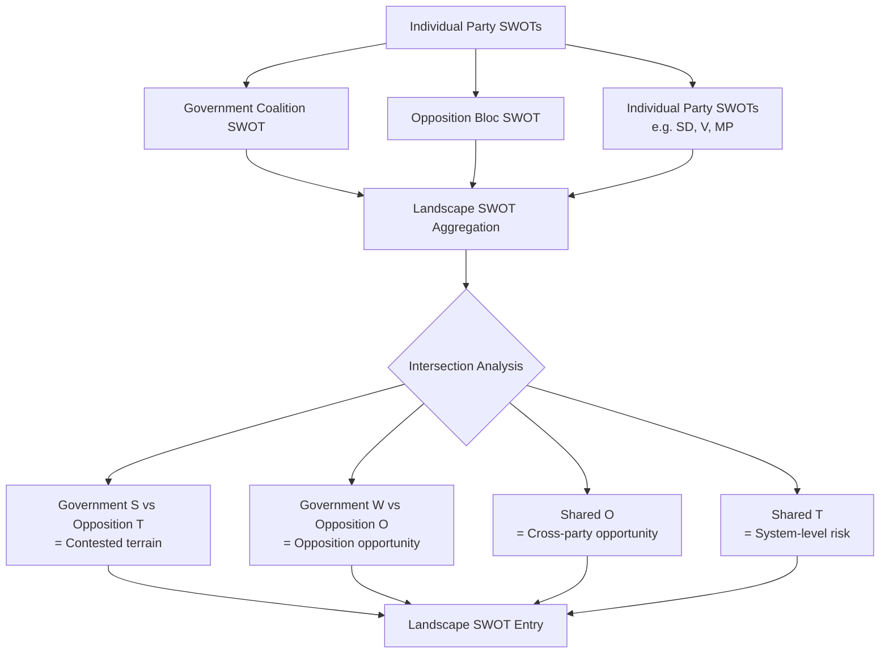
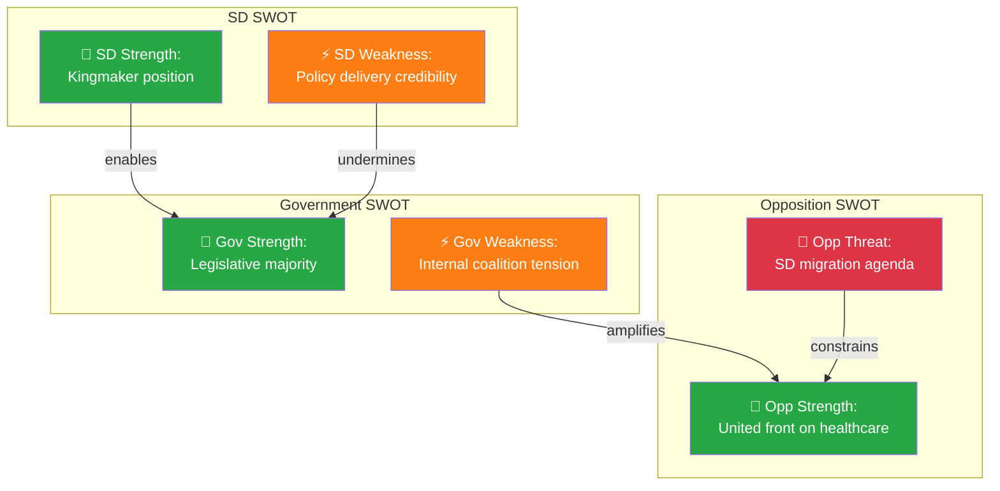
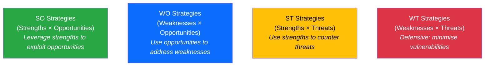
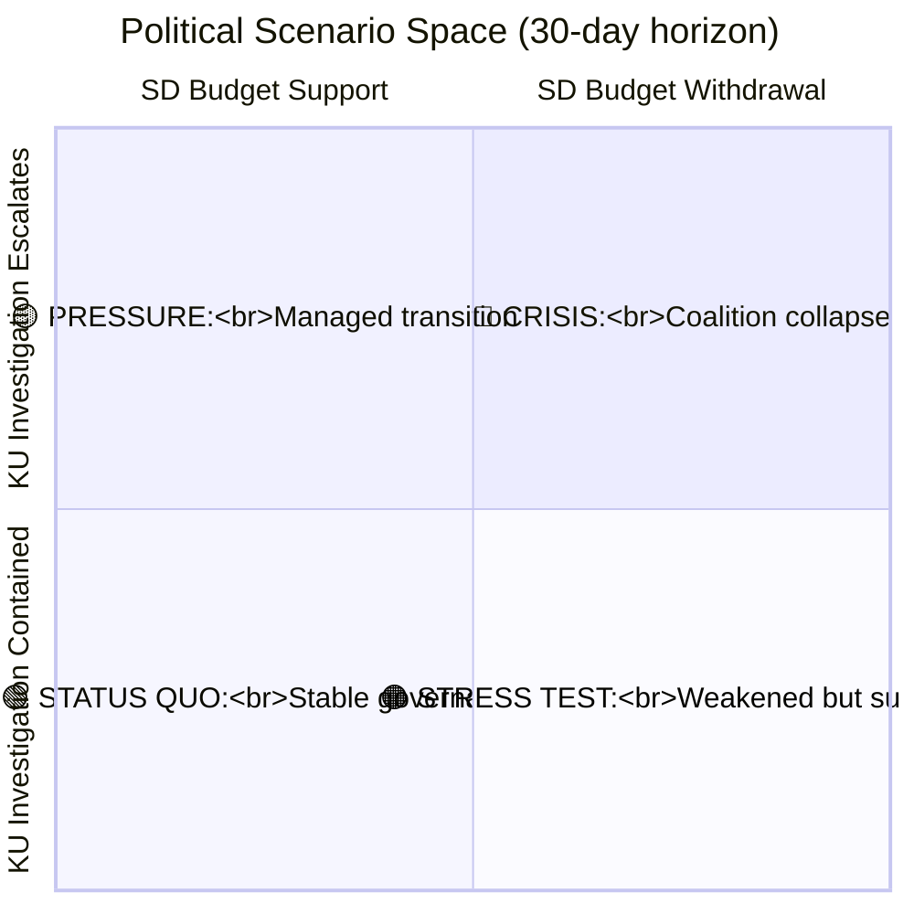
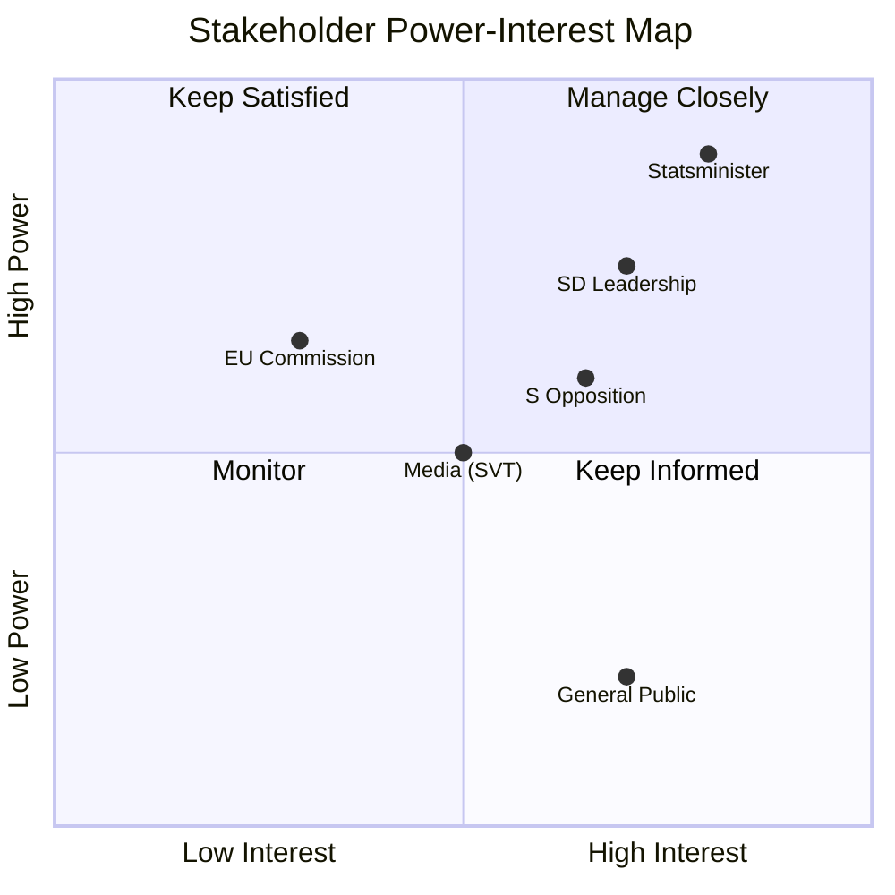

  

<h1 align="center">💼 Political SWOT Analysis Framework</h1>

  <strong>📊 Evidence-Based SWOT Methodology for Political Intelligence</strong> 
  <em>🎯 MCP Sources · Confidence Levels · Cross-SWOT Interference · Scenario Generation · Power-Interest Mapping</em>

  
  
  
  

**📋 Document Owner:** CEO | **📄 Version:** 2.0 | **📅 Last Updated:** 2026-03-30 (UTC)  
**🔄 Review Cycle:** Quarterly | **⏰ Next Review:** 2026-06-30  
**🏢 Owner:** Hack23 AB (Org.nr 5595347807) | **🏷️ Classification:** Public

---

## 🎯 Purpose

This framework establishes the **deep, evidence-based SWOT analysis methodology** for Riksdagsmonitor. Unlike traditional opinion-based SWOT analyses, this methodology requires **verifiable evidence** for every entry — either a Riksdag document ID (`dok_id`), named primary source, or official statistical reference.

Beyond basic SWOT, this framework includes advanced analytical techniques:
- **Cross-SWOT Interference Analysis** — how SWOT elements from different actors interact and amplify each other
- **Strategic Scenario Generation** — using SWOT combinations to construct plausible political futures
- **Power-Interest Mapping** — positioning stakeholders by influence and stake in outcomes
- **TOWS Matrix** — converting SWOT findings into actionable strategic options

Quality standard: [SWOT.md](../../SWOT.md) (965 lines of strategic analysis) and [CIA platform SWOT.md](https://github.com/Hack23/cia/blob/master/SWOT.md).

---

## 📐 Evidence-Based vs. Opinion-Based SWOT

The fundamental distinction that makes political SWOT analysis analytically rigorous:

### Evidence Hierarchy (by confidence level)

| Confidence | Acceptable Sources | MCP Tool |
|:----------:|-------------------|----------|
| **HIGH** | Riksdag official document (proposition, betänkande, protokoll) | `get_dokument`, `search_dokument` |
| **HIGH** | Verified voting record | `search_voteringar` |
| **HIGH** | SCB official statistics | World Bank, SCB API |
| **MEDIUM** | Government press release | `search_regering` |
| **MEDIUM** | Named politician's anförande in Riksdag | `search_anforanden` |
| **MEDIUM** | Verified major newspaper with named sources | `search_dokument_fulltext` |
| **LOW** | Single unnamed source | — (flag for verification) |
| **REJECTED** | Analyst inference without evidence | — |

---

## 📊 MCP Data Sources for Each Quadrant

### ✅ Strengths — Optimal MCP Sources

Strengths are typically demonstrated by **achieved results** and **enacted legislation**:

| Strength Type | MCP Tool | Query Strategy |
|--------------|----------|---------------|
| Legislative achievement | `search_dokument` | `doktyp=prop` + `status=antagen` (approved) |
| Coalition vote cohesion | `search_voteringar` | Filter by coalition parties + Ja votes |
| Policy implementation | `search_dokument` | Government `skr` (skrivelse) reports |
| Parliamentary majority | `fetch_report` | `report=ledamotsstatistik` for seat counts |
| International standing | `search_dokument` | `organ=UU` (Foreign Affairs Committee) |

### ⚠️ Weaknesses — Optimal MCP Sources

Weaknesses are demonstrated by **failed votes**, **dissenting opinions**, and **opposition criticism**:

| Weakness Type | MCP Tool | Query Strategy |
|--------------|----------|---------------|
| Internal coalition dissent | `search_voteringar` | Coalition party voting against government |
| Policy failure | `search_dokument` | Withdrawn propositions, failed betänkanden |
| Opposition criticism strength | `get_interpellationer` | Volume and topics of interpellationer |
| Parliamentary minority | `search_voteringar` | Nej votes from coalition on own proposals |
| Public accountability issues | `search_dokument` | KU investigations `organ=KU` |

### 🚀 Opportunities — Optimal MCP Sources

Opportunities are demonstrated by **legislative proposals**, **committee reports**, and **economic data**:

| Opportunity Type | MCP Tool | Query Strategy |
|-----------------|----------|---------------|
| Pending favourable legislation | `get_motioner` | Coalition party motions, high significance |
| Positive economic context | World Bank data + `search_dokument` | FiU positive assessments |
| Upcoming SOU recommendations | `search_dokument` | `doktyp=sou` recent + `search_regering` |
| Nordic/EU opportunity | `search_dokument` | `organ=UU` + EU directive implementation |
| Electoral opportunity | `fetch_report` + `search_voteringar` | Favourable topics + voting patterns |

### 🔴 Threats — Optimal MCP Sources

Threats are demonstrated by **opposition motions**, **no-confidence signals**, and **external pressures**:

| Threat Type | MCP Tool | Query Strategy |
|------------|----------|---------------|
| No-confidence risk | `search_dokument` | `doktyp=miss` (misstroendeförklaring) |
| Opposition mobilisation | `get_motioner` | High-volume opposition motions on key topics |
| Budget squeeze | `search_dokument` | FiU dissenting reservationer |
| Constitutional challenge | `search_dokument` | `organ=KU` active investigations |
| EU compliance pressure | `search_dokument` | EU-directive related propositioner |

---

## 🎯 Confidence Level Assignment

### Assignment Criteria

| Level | Criteria | Example |
|-------|---------|---------|
| **HIGH** | Multiple independent sources corroborate; primary source is official Riksdag document or SCB statistics; source is current (within 90 days) | "Coalition secured 176/349 votes on budget motion 2025/26:FPM45 (verified via voteringsresultat 2025-11-24)" |
| **MEDIUM** | Single primary source confirmed; or multiple secondary sources; or primary source older than 90 days | "Government polling at 38% approval per Novus (2026-02-15); single pollster" |
| **LOW** | Credible but single unverified source; inference from related evidence; source older than 180 days | "Estimated L party dissent based on parliamentary debate tone — no formal vote yet" |

### Confidence Decay Rule

SWOT entries age and their confidence level **automatically degrades** over time:

| Original Confidence | After 30 days | After 90 days | After 180 days |
|--------------------|:------------:|:-------------:|:--------------:|
| HIGH | HIGH | MEDIUM | LOW |
| MEDIUM | MEDIUM | LOW | EXPIRED |
| LOW | LOW | EXPIRED | EXPIRED |

**EXPIRED entries must be re-verified or removed before inclusion in new SWOT analyses.**

> **Clarification:** EXPIRED is a **lifecycle status**, not a confidence level. The confidence hierarchy is HIGH → MEDIUM → LOW (active). When temporal decay moves a LOW-confidence entry past 90 days, it becomes EXPIRED — meaning it is no longer active and must be handled per the rules below. An active SWOT analysis contains ONLY entries with confidence HIGH, MEDIUM, or LOW.

### Handling EXPIRED Entries

When an entry reaches EXPIRED status:

1. **Re-verify**: Check if updated evidence exists via MCP tools (e.g., new vote record, updated SCB data)
2. **Refresh**: If new evidence found, create a NEW entry with fresh confidence and updated evidence
3. **Archive**: If no new evidence, move entry to "Historical Context" section (informational, not active SWOT)
4. **Remove**: If the situation has fundamentally changed (e.g., new coalition formed), delete the entry entirely

> **Rule:** An active SWOT analysis must contain ZERO expired entries. Every entry must have a confidence of HIGH, MEDIUM, or LOW with a clear evidence trail.

---

## 🔗 Aggregating Party/Coalition SWOTs into Landscape SWOT

When analysing the full political landscape, aggregate individual party SWOTs using this protocol:

### Aggregation Steps

### Intersection Rules

- **Government Strength + Opposition Threat** = Priority watchpoint (contested terrain)
- **Government Weakness + Opposition Opportunity** = High-significance political risk
- **Shared Opportunity** (both sides see it) = Major policy window; cross-party deal possible
- **Shared Threat** (both sides face it) = System-level risk; constitutional/economic dimension

### Weighting Rules for Landscape SWOT

When aggregating individual party/coalition SWOTs into a landscape SWOT:

| Source SWOT | Weight | Rationale |
|:----------:|:------:|-----------|
| Government Coalition | **0.40** | Governing parties set policy agenda; their position has highest system impact |
| Main Opposition (S) | **0.25** | Largest opposition party; primary alternative government |
| SD (supply-and-confidence) | **0.20** | Kingmaker role; coalition depends on SD support |
| Minor parties (V, MP, C, L) | **0.15** | Combined weight; influence through committee and budget negotiations |

**Conflict resolution:** When government SWOT entry contradicts opposition SWOT entry on the same topic, include BOTH in the landscape SWOT as "contested terrain" with a note identifying the conflict. Do NOT average or remove conflicting entries.

**Minimum landscape SWOT requirements:**
- ≥ 3 Strengths (at least 1 from government, 1 from opposition perspective)
- ≥ 3 Weaknesses (at least 1 from each side)
- ≥ 2 Opportunities (at least 1 shared across perspectives)
- ≥ 3 Threats (at least 1 system-level)

---

## 📚 SWOT Generation Pipeline Reference

The SWOT generation pipeline is driven by AI agents reading methodology documents and producing per-file analysis:

| File | Purpose |
|------|---------|
| `scripts/prompts/v2/swot-generation.md` | LLM prompts for SWOT generation (v2) |
| `scripts/prompts/v2/per-file-intelligence-analysis.md` | Per-file analysis protocol |
| `analysis/templates/per-file-political-intelligence.md` | Per-file output template with SWOT section |
| `analysis/templates/swot-analysis.md` | Standalone SWOT template for daily/weekly synthesis |
| `scripts/ai-analysis/swot/` | SWOT-specific AI analysis scripts |
| `scripts/analysis-framework/lenses/` | Per-perspective evidence gathering |

### AI Analysis Protocol for SWOT

The AI agent **MUST** follow this protocol when generating SWOT analysis:

1. **Read this framework** — understand evidence hierarchy, confidence levels, decay rules, AND the advanced techniques below
2. **Query MCP tools** — use the tool/query strategies from the tables above for each quadrant
3. **Fill SWOT template** — every entry needs: Statement + Evidence (dok_id) + Confidence + Impact
4. **Apply Cross-SWOT Interference** — identify how SWOT elements from different actors amplify each other
5. **Apply intersection analysis** — identify contested terrain, opposition opportunities, shared risks
6. **Generate TOWS strategic options** — convert findings to strategic implications
7. **Validate quality gate** — ≥ 2 entries per quadrant, zero opinion-only entries, zero EXPIRED entries

---

## 🔄 Advanced Technique 1: Cross-SWOT Interference Analysis

When the political landscape involves multiple actors (government, opposition, kingmaker SD), their SWOT elements don't exist in isolation — they **interfere** with each other, creating amplification effects:

### Interference Matrix

| Gov SWOT Element | Opp SWOT Element | Interference Effect | Implication |
|:----------------:|:----------------:|:------------------:|------------|
| **Gov Strength** + Opp Weakness | — | Reinforcing advantage | Government position consolidates |
| **Gov Weakness** + Opp Strength | — | Amplified vulnerability | Opposition likely to exploit |
| **Gov Threat** + Opp Opportunity | — | Converging pressure | High-risk political moment |
| **Gov Strength** + SD Weakness | — | Fragile dependency | Majority depends on unreliable support |

### Interference Detection Protocol

For each SWOT entry:
1. Ask: "Does this element AMPLIFY or COUNTERACT any element from another actor's SWOT?"
2. Map the interference (amplifies, enables, undermines, constrains)
3. Rate the interference strength (strong/moderate/weak)
4. Identify the **net political effect** — is the system moving toward stability or instability?

---

## 📊 Advanced Technique 2: TOWS Strategic Options Matrix

TOWS converts SWOT findings into **strategic options** — answering "So what?" for each SWOT combination:

| TOWS Cell | Political Context | Example |
|:---------:|------------------|---------|
| **SO** (Strength × Opportunity) | "Government uses legislative majority (S1) to pass popular criminal justice reform (O1) before election" | Proactive agenda-setting |
| **WO** (Weakness × Opportunity) | "Coalition uses EU mandate (O2) to force internal alignment on migration (W1)" | External pressure as internal discipline |
| **ST** (Strength × Threat) | "Government uses budget control (S2) to fund SD-priority policies, neutralising withdrawal threat (T1)" | Pre-emptive concession |
| **WT** (Weakness × Threat) | "Internal dissent (W1) + SD withdrawal threat (T1) = highest-risk scenario requiring immediate coalition management" | Defensive damage control |

**Every SWOT analysis MUST include at least 2 TOWS strategic options** with evidence-backed reasoning.

---

## 🔮 Advanced Technique 3: Strategic Scenario Generation

Use SWOT combinations to construct **plausible political futures** (scenarios), each with a probability range and trigger conditions:

### Scenario Construction Protocol

1. **Identify 2–3 key uncertainties** from the SWOT analysis (e.g., "Will SD support the budget?" + "Will KU investigation escalate?")
2. **Construct 2×2 scenario matrix** from the two most impactful uncertainties
3. **Name each scenario** and describe its political characteristics
4. **Assign probability ranges** based on evidence
5. **Identify trigger indicators** that would signal movement toward each scenario

### Example Scenario Matrix

| Scenario | SD Budget Support | KU Outcome | Probability | Key Trigger |
|----------|:-----------------:|:----------:|:-----------:|------------|
| 🟢 **Status Quo** | Supports | Contained | 40–55% | SD publicly confirms budget support |
| 🟠 **Stress Test** | Supports | Escalates | 15–25% | KU hearing reveals new evidence |
| 🟡 **Pressure** | Withdraws | Contained | 10–20% | SD demands unmet, partial withdrawal |
| 🔴 **Crisis** | Withdraws | Escalates | 5–15% | Combined pressure triggers no-confidence |

---

## 📐 Advanced Technique 4: Power-Interest Mapping

Position key stakeholders by their **power** (ability to influence outcomes) and **interest** (stake in specific issues) to identify who matters most:

| Quadrant | Strategy | Stakeholders |
|----------|---------|-------------|
| **Manage Closely** (high power, high interest) | Full analysis; primary intelligence consumer | Government leadership, coalition partners, SD |
| **Keep Satisfied** (high power, low interest) | Monitor for engagement; alert on activation | EU Commission, NATO allies, central bank |
| **Keep Informed** (low power, high interest) | Regular reporting; citizen engagement | Media, civil society, general public |
| **Monitor** (low power, low interest) | Periodic check; no active engagement | Minor parties, regional actors |

---

## 🔗 Related Documents

- [templates/swot-analysis.md](../templates/swot-analysis.md) — SWOT template
- [reference/isms-style-guide-adaptation.md](../reference/isms-style-guide-adaptation.md) — Writing standards
- [SWOT.md](../../SWOT.md) — Platform strategic SWOT
- [political-style-guide.md](political-style-guide.md) — Writing standards

---

**Document Control:**  
- **Path:** `/analysis/methodologies/political-swot-framework.md`  
- **CIA Reference:** [CIA SWOT.md](https://github.com/Hack23/cia/blob/master/SWOT.md)  
- **Version:** 2.0  
- **Advanced Techniques:** Cross-SWOT Interference, TOWS Matrix, Scenario Generation, Power-Interest Mapping  
- **Classification:** Public  
- **Next Review:** 2026-06-30
