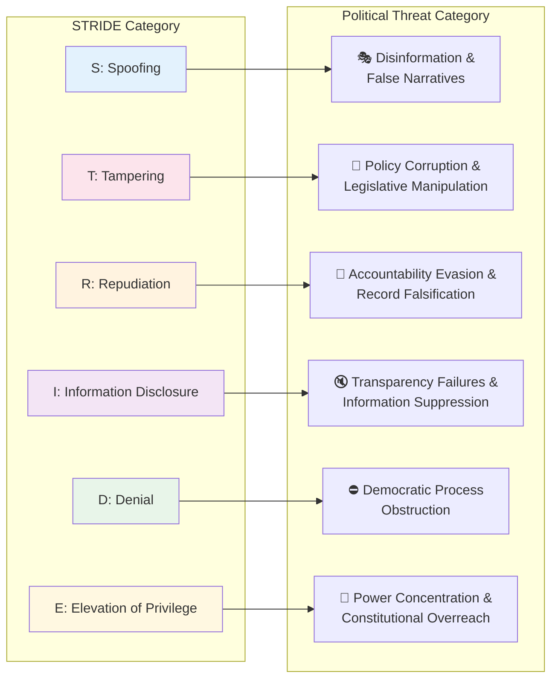
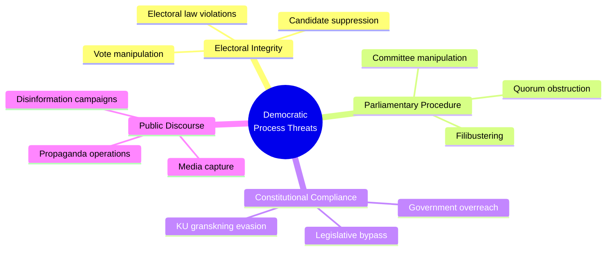
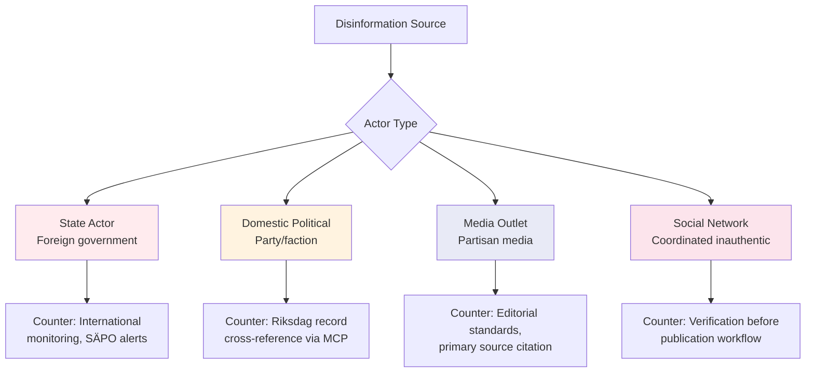

<p align="center">
  
</p>

<h1 align="center">🎭 Political Threat Analysis Framework</h1>

<p align="center">
  <strong>📊 STRIDE-Adapted Framework for Democratic Process Threats</strong><br>
  <em>🎯 Democratic Integrity · Governance · Disinformation · Opposition · EU Constraints</em>
</p>

<p align="center">
  <a href="#"></a>
  <a href="#"></a>
  <a href="#"></a>
  <a href="#"></a>
</p>

**📋 Document Owner:** CEO | **📄 Version:** 1.0 | **📅 Last Updated:** 2026-03-26 (UTC)  
**🔄 Review Cycle:** Quarterly | **⏰ Next Review:** 2026-06-26  
**🏢 Owner:** Hack23 AB (Org.nr 5595347807) | **🏷️ Classification:** Public

---

## 🎯 Purpose

This framework establishes the authoritative methodology for political threat analysis in Riksdagsmonitor. It adapts the STRIDE cybersecurity threat modeling framework — as implemented in [Hack23 ISMS Threat_Modeling.md](https://github.com/Hack23/ISMS-PUBLIC/blob/main/Threat_Modeling.md) — to the systematic analysis of threats to democratic processes, governance integrity, and political accountability in the Swedish parliamentary system.

See [reference/isms-threat-modeling-adaptation.md](../reference/isms-threat-modeling-adaptation.md) for the complete ISMS-to-political mapping.

---

## 🗺️ STRIDE-to-Political Mapping Overview



---

## 🎭 Threat Category 1: Democratic Process Threats

*Threats that undermine the integrity of the Swedish democratic system itself.*

### Threat Taxonomy



### Detection Indicators

| Threat | Early Warning Signal | MCP Tool for Detection | Severity Baseline |
|--------|---------------------|------------------------|:-----------------:|
| Vote manipulation | Unexpected defection pattern | `search_voteringar` | 4 |
| Filibustering | Abnormal debate length vs. content complexity | `search_anforanden` | 2 |
| Constitutional overreach | Proposition bypasses normal remiss process | `search_dokument` | 5 |
| Disinformation | Contradicting claims between official docs and politician statements | Cross-reference `anforanden` + `dokument` | 3 |

---

## 🏛️ Threat Category 2: Governance Integrity Threats

*Threats to the proper, accountable exercise of governmental authority.*

### Threat Taxonomy

| Threat Type | STRIDE Mapping | Key Actors | Observable Evidence |
|-------------|---------------|------------|---------------------|
| Policy corruption (undisclosed lobbying) | T — Tampering | Industry sector, foreign governments | SOU remiss response vs. final proposition delta |
| Accountability evasion | R — Repudiation | Government ministers, party leadership | Anföranden contradicting voting record |
| Regulatory capture | E — Elevation | Regulatory agencies, sector incumbents | Appointment patterns + policy reversals |
| Budget manipulation | T — Tampering | Finance ministry, budget committee | FiU reservationer vs. final budget text |
| Oversight blocking | D — Denial | Government secretariat | KU request delays, classified document volumes |

### KU Granskning (Constitutional Committee Scrutiny) Monitoring

The Konstitutionsutskottet (KU) is Sweden's primary governance integrity watchdog. Track:

- **Open KU investigations** via `search_dokument` with `organ=KU` and `doktyp=bet`
- **New KU complaints** (anmälningar) filed by opposition parties
- **Government response delays** to KU information requests
- **KU hearing transcripts** (förhörsprotokoll) for accountability signals

**Threat Signal:** KU investigation into a sitting minister → automatic **High** governance integrity threat.

---

## 📡 Threat Category 3: Disinformation Threats

*Systematic efforts to mislead the public or parliament about political facts.*

### Disinformation Actor Classification



### Verification Protocol for Disputed Claims

Before publishing any claim that contradicts official parliamentary records:

1. **Cross-reference** claim against `search_dokument` (official proposition/motion text)
2. **Check voting record** via `search_voteringar` for the specific ledamot/party
3. **Review anföranden** via `search_anforanden` for consistent stated position
4. **Escalate to SENSITIVE classification** if contradiction cannot be resolved
5. **Apply confidence level LOW** until primary source confirms

---

## 🗳️ Threat Category 4: Opposition Pressure Mapping

*Systematic tracking of opposition strategies that constitute legitimate (but high-impact) political threats.*

### Opposition Threat Instruments

| Instrument | STRIDE | Threat to Government | Detection via MCP |
|-----------|--------|----------------------|------------------|
| No-confidence motion (misstroendeförklaring) | D — Denial | CRITICAL — can topple government | `search_dokument` doktyp=miss |
| Interpellation | I — Disclosure | MEDIUM — forces ministerial response | `get_interpellationer` |
| Skriftlig fråga | I — Disclosure | LOW — public accountability record | `get_fragor` |
| Budget amendment (ändringsyrkanden) | T — Tampering | HIGH — can redirect government spending | `search_voteringar` + FiU documents |
| Committee dissent (reservation) | R — Repudiation | MEDIUM — undermines government narrative | `get_betankanden` |
| KU complaint | E — Elevation (counter) | HIGH — triggers constitutional review | `search_dokument` organ=KU |

---

## 🇪🇺 Threat Category 5: EU / International Constraint Threats

*External forces that constrain Swedish parliamentary sovereignty or create compliance obligations.*

### EU Constraint Threat Matrix

| Constraint Type | Mechanism | Swedish Parliamentary Impact | Monitoring Signal |
|----------------|-----------|------------------------------|------------------|
| EU Directive transposition | Mandatory legislation | Forces legislation timeline | EU legislative calendar + `search_dokument` prop |
| ECJ ruling | Legal obligation | Overrides Riksdag legislation | Court reference in `dokument` fulltext |
| EU infringement procedure | Commission action | International embarrassment + fines | `search_dokument` EU-related |
| NATO Article 5 trigger | Military obligation | Emergency legislative session | Defence committee `search_dokument` organ=FöU |
| Nordic Council agreement | Soft obligation | Cross-border policy alignment pressure | `search_dokument` Nordic references |

### International Threat Severity Calibration

| Level | Example | Riksdag Response | Political Impact |
|-------|---------|-----------------|-----------------|
| Informational | EU Commission recommendation | Optional response | Low |
| Compliance | Directive transposition deadline | Mandatory legislation | Medium |
| Enforcement | ECJ ruling + fine risk | Urgent legislation required | High |
| Existential | NATO Article 5 | Emergency session + mobilisation | Critical |

---

## 🎯 Threat Agent Classification

All identified threat actors are classified on two axes: **Intent** and **Capability**.

| Threat Agent | Type | Intent | Capability | Primary STRIDE Category |
|-------------|------|--------|------------|------------------------|
| Governing coalition | Domestic political | Mixed (policy + power) | HIGH | T, R, D, E |
| Main opposition bloc | Domestic political | Clear (power acquisition) | MEDIUM-HIGH | D, I, R |
| Individual opposition MP | Domestic political | Varies | LOW-MEDIUM | I, R |
| Riksdag committee minority | Institutional | Policy-focused | MEDIUM | T, R |
| Swedish media | Fourth estate | Disclosure-focused | MEDIUM | I |
| Foreign state (Russia, China) | External | Destabilisation | HIGH | S, T |
| Lobby/industry | Economic | Policy-focused | MEDIUM | T |
| EU Commission | Institutional | Compliance | HIGH | D, E |

---

## 🔗 Related Documents

- [templates/threat-analysis.md](../templates/threat-analysis.md) — Threat analysis template
- [reference/isms-threat-modeling-adaptation.md](../reference/isms-threat-modeling-adaptation.md) — ISMS mapping
- [THREAT_MODEL.md](../../THREAT_MODEL.md) — Platform-level threat model
- [FUTURE_THREAT_MODEL.md](../../FUTURE_THREAT_MODEL.md) — Future threat roadmap
- [political-risk-methodology.md](political-risk-methodology.md) — Risk methodology (complementary)

---

**Document Control:**  
- **Path:** `/analysis/methodologies/political-threat-framework.md`  
- **ISMS Reference:** [Threat_Modeling.md](https://github.com/Hack23/ISMS-PUBLIC/blob/main/Threat_Modeling.md)  
- **Classification:** Public  
- **Next Review:** 2026-06-26
# Political Threat Framework — PRIDES

<!-- version: 1.0.0 | updated: 2026-03-26 | author: Hack23 AB -->
<!-- document-control: political-analysis-methodology | classification: public -->

## 1. Purpose

This document describes the **PRIDES Political Threat Analysis Framework** used by Riksdagsmonitor to identify and characterise threats to democratic governance from Swedish parliamentary activity. PRIDES is adapted from the [ISMS THREAT_MODEL.md](https://github.com/Hack23/ISMS-PUBLIC/blob/main/THREAT_MODEL.md) STRIDE framework, reimagined for **political intelligence** rather than cybersecurity.

## 2. The PRIDES Framework — Conceptual Foundation

STRIDE is a systematic threat model used in information security to categorise threats across 6 dimensions (Spoofing, Tampering, Repudiation, Information Disclosure, Denial of Service, Elevation of Privilege). We apply the **same structural rigour** to political threats:

| ISMS STRIDE | Threat Type | Political PRIDES | Political Manifestation |
|---|---|---|---|
| **S**poofing | False identity/claims | **P**olarization | False narratives, divisive rhetoric, misleading framing |
| **T**ampering | Unauthorised modification | **R**egulatory Overreach | Abuse of legislative power, bypassing democratic norms |
| **R**epudiation | Denying actions | **I**nstitutional Erosion | Undermining accountability, weakening democratic institutions |
| **I**nformation Disclosure | Unauthorised exposure | **D**emocratic Deficit | Opacity, restricted public access, press freedom violations |
| **D**enial of Service | Blocking legitimate use | **E**conomic Disruption | Policy-driven economic harm, fiscal irresponsibility |
| **E**levation of Privilege | Gaining unauthorised access | **S**ocietal Impact | Rights erosion, disproportionate harm to vulnerable groups |

## 3. PRIDES Category Definitions

### P — Polarization
**What it is**: Intentional or systematic division of public opinion along political, social, or identity-based lines, through misleading rhetoric, disinformation, or populist framing.

**Observable indicators in Swedish parliamentary context**:
- Desinformation or propaganda keywords in document text
- Hatretorik (hate rhetoric) or extremism language
- Oss och dem (us and them) framing in speeches
- Migration policy used as wedge issue with divisive framing
- Nationalistisk rhetoric in chamber debates

**Democratic consequence**: Erodes shared political discourse; undermines coalition-building; increases social fragmentation.

**Swedish countermeasures**:
- SVT and SR public broadcasting obligations (balanced coverage mandate)
- Tryckfrihetsförordningen (Press Freedom Act)
- Civil society fact-checking organisations
- Parliamentary cross-party dialogue culture

---

### R — Regulatory Overreach
**What it is**: Abuse of legislative or executive power; bypassing parliamentary process; concentrating regulatory authority beyond democratic mandate.

**Observable indicators**:
- Undantagsbefogenheter or nödbefogenheter (extraordinary powers) language
- Maktkoncentration (power concentration) in document content
- Legislation designed to circumvent parliamentary oversight
- Regulatory carve-outs excluding specific actors from normal scrutiny

**Democratic consequence**: Weakens parliamentary sovereignty; concentrates power; undermines checks and balances.

**Swedish countermeasures**:
- Lagrådet (Council on Legislation) mandatory pre-legislative constitutional review
- Constitutional Committee (KU) retrospective oversight
- Misstroendevotum (parliamentary no-confidence) mechanism
- JO and JK (Ombudsman institutions) investigate executive overreach

---

### I — Institutional Erosion
**What it is**: Systematic weakening of democratic institutions, accountability mechanisms, or constitutional oversight. Includes accountability gaps, judicial capture, and democratic backsliding.

**Observable indicators**:
- KU (Constitutional Committee) investigation — always a strong indicator
- Ansvarslöshet or accountability gap language
- Konstitutionsbrott (constitutional violation) references
- Court packing or judicial independence threats
- Institutional capture signals

**Democratic consequence**: Long-term structural damage to democratic function; accountability failure becomes self-reinforcing.

**Swedish countermeasures**:
- Independent judiciary (Högsta domstolen, Högsta förvaltningsdomstolen)
- Parliamentary Ombudsman (JO) investigates maladministration
- KU retrospective review of government exercise of power
- ECHR and EU Charter provide supranational constitutional protection

---

### D — Democratic Deficit
**What it is**: Restriction of public access to information, press freedom violations, transparency failures, or deliberate opacity in government decision-making.

**Observable indicators**:
- Offentlighetsprincipen (public access principle) restriction language
- Sekretess (secrecy) or hemligstämplad (classified) expansion
- Pressfrihet or yttrandefrihet (freedom of press/speech) threats
- Begränsad insyn (restricted oversight) signals
- Whistleblower protection weakening

**Democratic consequence**: Citizens cannot hold power accountable without information; media cannot fulfil watchdog function.

**Swedish countermeasures**:
- Offentlighetsprincipen (constitutional principle — Tryckfrihetsförordningen 2 kap.)
- Freedom of the press and expression (TF, YGL) constitutional protections
- EU General Data Protection Regulation (GDPR) and privacy rights
- ECHR Article 10 (freedom of expression)

---

### E — Economic Disruption
**What it is**: Policy-driven economic harm; fiscal irresponsibility; policy failures that cause macroeconomic instability or economic harm to citizens.

**Observable indicators**:
- Budgetkris (budget crisis) or statsbankrutt (state bankruptcy) language
- Skuldkris (debt crisis) or finanskris (financial crisis) signals
- FiU involvement with economic disruption content
- Inflation spiral or stagflation language
- Coalition budget deadlock signals

**Democratic consequence**: Economic instability undermines social trust; fiscal failure limits democratic government's ability to function; vulnerable groups disproportionately harmed.

**Swedish countermeasures**:
- Independent Riksbank mandate (monetary policy buffer)
- Finanspolitiska rådet (Fiscal Policy Council) independent monitoring
- EU Stability and Growth Pact fiscal constraints
- Cross-party budget framework limiting extreme year-on-year changes

---

### S — Societal Impact
**What it is**: Disproportionate harm to vulnerable groups, erosion of fundamental rights, discriminatory policy effects, or systematic social exclusion through political decisions.

**Observable indicators**:
- Marginaliserade (marginalised) or utsatta grupper (vulnerable groups) language
- Diskriminering (discrimination) or rättighetsförlust (rights loss) signals
- Ojämlikhet (inequality) or social exclusion content
- SoU, SfU, or AU committee involvement with welfare/rights content
- Mänskliga rättigheter (human rights) concerns

**Democratic consequence**: Democratic legitimacy depends on inclusion; systematic exclusion of groups undermines democratic social contract.

**Swedish countermeasures**:
- Diskrimineringsombudsmannen (DO) — equality ombudsman
- Swedish welfare state baseline protections (socialtjänstlagen, etc.)
- ECHR Article 14 (prohibition of discrimination)
- EU equality law and Charter of Fundamental Rights

## 4. Threat Agents

### 4.1 Threat Agent Classification

| Agent | Primary Activities | Detection Signals |
|---|---|---|
| **ruling-coalition** | Policy agenda, legislative control, executive decisions | Proposition keywords, statsminister, Tidöavtal references |
| **opposition-parties** | Obstruction, alternative agendas, populist pressure | Motion keywords, interpellation filing, bloc references |
| **external-actors** | Foreign influence, EU regulatory pressure | EU/NATO/foreign government references, UU/FöU committee |
| **special-interests** | Lobbying, regulatory capture | Lobbyism, branschintresse, corporate influence signals |
| **media** | Narrative framing, selective coverage, disinformation | Media narrative signals, press freedom references |
| **institutional** | Implementation failures, bureaucratic inertia | Agency/myndighet keywords, bet/ds/dir document types |

### 4.2 Agent Detection in Swedish Context

- **Propositions (prop)** → ruling-coalition primary agent
- **Motions (mot), Interpellations (ip)** → opposition-parties primary agent
- **Foreign Affairs (UU), Defence (FöU) committee** → external-actors relevant
- **Committee reports (bet), Directives (dir)** → institutional agent relevant

## 5. Severity Calibration

| Level | Definition | Example Scenarios |
|---|---|---|
| **critical** | Immediate, fundamental threat to democratic function | Misstroendevotum context, constitutional breach, fundamental rights emergency |
| **high** | Serious, near-term threat requiring political response | KU investigation active, significant democratic accountability gap |
| **medium** | Moderate threat with observable indicators | Polarising rhetoric in debate, transparency concerns, emerging social tensions |
| **low** | Latent threat, early warning signal | Minor transparency concern, low-level institutional friction |

### 5.1 Calibration Principles
- Reserve **critical** for genuine constitutional or democratic emergencies
- **high** is appropriate for serious KU oversight findings or major democratic concerns
- Most ordinary parliamentary documents should produce **medium** or **low** threats
- Never assign all 6 categories as **critical** — that indicates miscalibration

## 6. Implementation Reference

**TypeScript Engine**: `scripts/analysis-framework/political-threat-analysis.ts`  
**Types**: `scripts/analysis-framework/methodology-types.ts`  
**AI Prompt**: `scripts/prompts/v2/political-threat-prompt.md`  
**Tests**: `tests/political-methodology.test.ts`

### 6.1 Quick API Reference
```typescript
import { analysePoliticalThreats, analyseSinglePridesCategory } from './political-threat-analysis.js';

// Full PRIDES profile
const profile = analysePoliticalThreats(doc, ciaContext);
console.log(profile.overallThreatLevel);  // 'critical' | 'high' | 'medium' | 'low' | 'none'
console.log(profile.primaryThreat);       // dominant PridesCategory
console.log(profile.activeThreatAgents); // ThreatAgent[]

// Targeted single-category analysis
const polarizationThreat = analyseSinglePridesCategory(doc, 'polarization', ciaContext);
console.log(polarizationThreat?.severity);        // 'critical' | 'high' | 'medium' | 'low'
console.log(polarizationThreat?.countermeasures); // string[]
```

## 7. Worked Examples

### Example 1: KU Constitutional Investigation (Institutional Erosion)
**Document**: KU-granskning av grundlagsändring  
**Committee**: KU  

| PRIDES | Threat Agents | Severity |
|---|---|---|
| polarization | opposition-parties, media | low |
| regulatory-overreach | ruling-coalition | medium |
| **institutional-erosion** | **ruling-coalition, institutional** | **high** |
| democratic-deficit | ruling-coalition | medium |
| economic-disruption | institutional | low |
| societal-impact | institutional | low |
| **Primary Threat: institutional-erosion** | | **Overall: HIGH** |

### Example 2: Polarising Migration Interpellation
**Document**: Interpellation about migration and integration, SD party  

| PRIDES | Threat Agents | Severity |
|---|---|---|
| **polarization** | **opposition-parties, media** | **high** |
| regulatory-overreach | ruling-coalition | low |
| institutional-erosion | institutional | low |
| democratic-deficit | ruling-coalition | low |
| economic-disruption | ruling-coalition | low |
| societal-impact | opposition-parties | medium |
| **Primary Threat: polarization** | | **Overall: HIGH** |

### Example 3: Routine Written Question
**Document**: Written question about local transport  

| PRIDES | Threat Agents | Severity |
|---|---|---|
| polarization | ruling-coalition | low |
| regulatory-overreach | ruling-coalition | low |
| institutional-erosion | institutional | low |
| democratic-deficit | ruling-coalition | low |
| economic-disruption | ruling-coalition | low |
| societal-impact | ruling-coalition | low |
| **Primary Threat: polarization** | | **Overall: LOW** |

## 8. Integration Points

- **`DocumentAnalysisResult.methodologyAnalysis.threatProfile`**: Full PRIDES profile
- **Article framing**: `primaryThreat` guides which democratic risk to highlight
- **Headline selection**: `overallThreatLevel = 'critical'` → democracy-focused framing
- **Editorial safeguards**: Always present `countermeasures` alongside threat identification
- **SWOT integration**: Threat analyses feed into SWOT threat quadrant

---

## 9. Severity Calibration Table

Map the 1–5 severity scale to specific Swedish political indicators for consistent scoring:

| Severity | Label | Definition | Swedish Political Example | Threat Level |
|:--------:|-------|-----------|--------------------------|:------------:|
| **1** | Negligible | Routine political activity; no democratic process impact | Routine written question about local transport | 🟢 LOW |
| **2** | Minor | Minor procedural concern; self-correcting through normal channels | Committee delays a report by 1 week | 🟢 LOW |
| **3** | Moderate | Democratic process strained; intervention may be needed | Coalition party votes against government on non-budget issue | 🟡 MODERATE |
| **4** | Major | Significant democratic process threat; formal response required | KU investigation opened into government minister; SD threatens to withdraw support | 🟠 HIGH |
| **5** | Severe | Constitutional crisis; democratic norms threatened | Government falls via no-confidence vote; extraordinary election called; parliamentary rules suspended | 🔴 SEVERE |

### Escalation Criteria

A threat analysis triggers escalation to **breaking news** status when:

| Condition | Action | Severity Threshold |
|-----------|--------|--------------------|
| Any STRIDE category reaches severity 5 | Immediate breaking analysis | SEVERE |
| ≥ 2 STRIDE categories reach severity 4 | Priority analysis; article within 2 hours | HIGH |
| Overall threat level = SEVERE | All-language deployment; editor notification | SEVERE |
| KU formal investigation announced | Priority threat assessment update | ≥ 3 (MODERATE) |
| No-confidence motion filed | Immediate full threat model update | 5 (SEVERE) |

### Threat-to-Risk Integration

Connect threat severity to the risk methodology's 5×5 matrix:

| Threat Severity | → Risk Likelihood Equivalent | → Risk Impact Equivalent |
|:--------------:|:---------------------------:|:------------------------:|
| 1 (Negligible) | L=1 (Rare) | I=1 (Negligible) |
| 2 (Minor) | L=2 (Unlikely) | I=2 (Minor) |
| 3 (Moderate) | L=3 (Possible) | I=3 (Moderate) |
| 4 (Major) | L=4 (Likely) | I=4 (Major) |
| 5 (Severe) | L=5 (Almost Certain) | I=5 (Severe) |

> **Note:** Threat severity maps to BOTH likelihood and impact because a severe democratic threat is both more likely to materialize AND more impactful. For specific risk scoring, assess likelihood and impact independently using the risk methodology.

---

## 10. AI Analysis Protocol for Threat Assessment

The AI agent **MUST** follow this protocol when performing threat analysis:

1. **Read this framework** — understand STRIDE-to-political mapping, severity calibration, threat actors
2. **Read the templates** — `analysis/templates/threat-analysis.md` and per-file template's threat section
3. **Query MCP tools** for evidence:
   - `search_dokument` with `organ=KU` — constitutional committee investigations (Repudiation, Elevation)
   - `search_voteringar` — coalition voting patterns (Tampering via legislative manipulation)
   - `search_anforanden` — debate rhetoric (Spoofing via misrepresentation)
   - `search_dokument` with `doktyp=miss` — no-confidence motions (Denial of Service)
   - `get_interpellationer` — accountability probes (Information Disclosure failures)
4. **Score each STRIDE category** using the severity calibration table above
5. **Map threat actors** — identify who benefits from each threat
6. **Connect to risk scoring** using the Threat-to-Risk integration table
7. **Include countermeasures** for every identified threat (editorial safeguard: never present threats without mitigations)

---

## 🔗 Related Documents

- [templates/threat-analysis.md](../templates/threat-analysis.md) — Threat analysis template
- [templates/per-file-political-intelligence.md](../templates/per-file-political-intelligence.md) — Per-file analysis template with STRIDE section
- [political-risk-methodology.md](political-risk-methodology.md) — Risk scoring (threats feed into risk)
- [political-swot-framework.md](political-swot-framework.md) — Threats feed into SWOT threat quadrant
- [ai-driven-analysis-guide.md](ai-driven-analysis-guide.md) — Per-file AI analysis protocol
- [reference/isms-threat-modeling-adaptation.md](../reference/isms-threat-modeling-adaptation.md) — ISMS mapping

---

**Document Control:**  
- **Path:** `/analysis/methodologies/political-threat-framework.md`  
- **ISMS Reference:** [Threat_Modeling.md](https://github.com/Hack23/ISMS-PUBLIC/blob/main/Threat_Modeling.md)  
- **Classification:** Public  
- **Next Review:** 2026-06-28
