<p align="center">
  
</p>

<h1 align="center">🎭 Political Threat Analysis Framework</h1>

<p align="center">
  <strong>📊 Multi-Framework Methodology for Democratic Process Threat Analysis</strong><br>
  <em>🎯 Attack Trees · Political Kill Chain · Diamond Model · Political Threat Taxonomy · Threat Actor Profiling</em>
</p>

<p align="center">
  <a href="#"></a>
  <a href="#"></a>
  <a href="#"></a>
  <a href="#"></a>
</p>

**📋 Document Owner:** CEO | **📄 Version:** 3.2 | **📅 Last Updated:** 2026-06-01 (UTC)  
**🔄 Review Cycle:** Quarterly | **⏰ Next Review:** 2026-06-30  
**🏢 Owner:** Hack23 AB (Org.nr 5595347807) | **🏷️ Classification:** Public

---

## 🎯 Purpose

This framework establishes the authoritative **multi-framework methodology** for political threat analysis in Riksdagsmonitor. It integrates **four complementary threat modeling approaches** — each illuminating different aspects of political threats that the others miss.

> **Why multiple frameworks?** Political intelligence requires understanding threat *mechanics* (HOW the threat succeeds — Attack Trees), threat *progression* (WHERE the threat IS in its lifecycle — Kill Chain), threat *relationships* (WHO is involved and what resources they use — Diamond Model), and threat *actor motivation* (WHY the actor is acting — ICO Profiling). Combining frameworks compensates for each framework's individual blind spots and produces actionable intelligence rather than superficial categorisation.
>
> **Note:** This framework deliberately avoids STRIDE and similar cybersecurity-origin categorisation models. STRIDE was designed for software security threat taxonomy and does not meaningfully transfer to political analysis. Political threats require understanding power dynamics, institutional leverage, coalition mathematics, and democratic process mechanics — none of which map to Spoofing/Tampering/Repudiation/Information Disclosure/Denial of Service/Elevation of Privilege.

See [reference/isms-threat-modeling-adaptation.md](../reference/isms-threat-modeling-adaptation.md) for the ISMS-to-political mapping.

---

## 🗺️ Framework Selection Guide

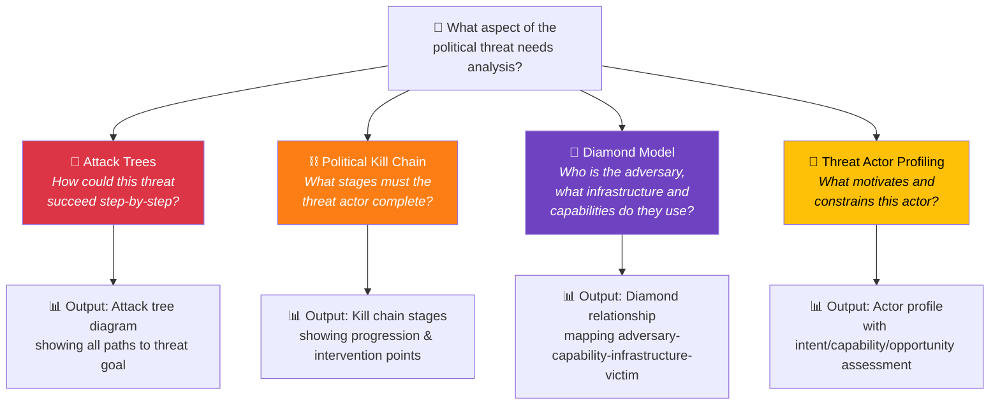

| Framework | Best For | Depth | Political Intelligence Value |
|-----------|---------|:-----:|------------------------------|
| **🌳 Attack Trees** | Decomposing HOW a threat succeeds | ★★★★★ | Shows all paths to a political goal; identifies cheapest/easiest attack paths |
| **⛓️ Political Kill Chain** | Modelling threat PROGRESSION | ★★★★☆ | Reveals intervention points; early warning indicators at each stage |
| **💎 Diamond Model** | Understanding ADVERSARY relationships | ★★★★☆ | Maps who, how, what infrastructure, and who's affected |
| **👤 Threat Actor Profiling** | Assessing WHO and WHY | ★★★★★ | Intent-capability-opportunity analysis; predicts likely actions |

**Mandatory minimum:** Every threat analysis MUST use at least **Attack Trees + one other framework**. Attack Trees are the mandatory primary tool because they answer the question most critical for political intelligence: "Through what specific sequence of steps could this threat succeed?" — enabling both early warning and strategic intervention.

---

## 🌳 Framework 1: Political Attack Trees

Attack trees are the **primary threat modeling tool** for political intelligence because they answer the critical question: "How could this political goal be achieved?"

### Attack Tree Structure

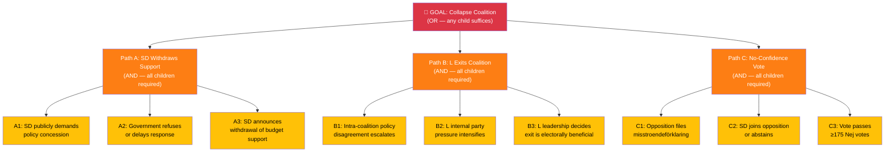

### Attack Tree Construction Protocol

1. **Define the goal** (root node): What political outcome is the threat aiming for?
2. **Decompose with OR/AND gates:**
   - **OR**: Any child path can achieve the goal independently
   - **AND**: All child conditions must be met simultaneously
3. **Assign leaf node attributes:**

| Attribute | Description | Example |
|-----------|-------------|---------|
| **Feasibility** | How easily can this step occur? (1–5, 5=trivial) | SD public demand: 4 (frequent pattern) |
| **Detectability** | How early can we detect this step? (1–5, 5=obvious) | Floor vote: 5 (public record) |
| **Cost to actor** | Political cost of this action (1–5, 5=free) | L exit: 2 (high electoral risk) |
| **Evidence** | MCP data supporting assessment | dok_id, vote record, speech reference |

4. **Identify cheapest attack path**: The path with highest feasibility, highest detectability, and lowest cost is the most likely threat vector
5. **Map early warning indicators**: For each leaf node, what MCP-detectable signal precedes it?

### When to Use Attack Trees

- **Always** for coalition stability threats (the most common and consequential threat type)
- **Always** for budget/fiscal threats during Sep–Nov budget season
- For any threat where you need to explain HOW something could happen, not just WHAT could happen
- When analysing opposition strategy and possible escalation paths

---

## ⛓️ Framework 2: Political Kill Chain

Adapted from Lockheed Martin's Cyber Kill Chain, the Political Kill Chain models the **stages** an adversary must complete to achieve a political objective. Each stage represents an intervention opportunity.

### Political Kill Chain Stages

```mermaid
flowchart LR
    R["1️⃣ Reconnaissance<br/>Issue identification<br/>& intelligence gathering"]
    W["2️⃣ Weaponization<br/>Framing narratives<br/>& coalition building"]
    D["3️⃣ Delivery<br/>Parliamentary instruments<br/>(motions, interpellations)"]
    X["4️⃣ Exploitation<br/>Media amplification<br/>& public pressure"]
    I["5️⃣ Installation<br/>Formal proceedings<br/>(KU, votes, debates)"]
    C["6️⃣ Command & Control<br/>Coordinated political<br/>action across parties"]
    A["7️⃣ Actions on Objective<br/>Policy change, resignation,<br/>no-confidence, election"]

    R --> W --> D --> X --> I --> C --> A

    style R fill:#28a745,color:#fff
    style W fill:#ffc107,color:#000
    style D fill:#fd7e14,color:#fff
    style X fill:#fd7e14,color:#fff
    style I fill:#dc3545,color:#fff
    style C fill:#dc3545,color:#fff
    style A fill:#6f42c1,color:#fff
```

### Kill Chain Stage Details

| Stage | Political Manifestation | MCP Detection Tools | Early Warning Indicators |
|:-----:|------------------------|--------------------|--------------------------| 
| **1. Reconnaissance** | Opposition identifies government vulnerability (policy gap, scandal, economic data) | `search_dokument_fulltext`, `search_anforanden` | Uptick in written questions on specific topic |
| **2. Weaponization** | Narrative framing, coalition-building for counter-position | `search_motioner` (clustered motions), `search_anforanden` (coordinated speeches) | Multiple opposition parties adopting same language |
| **3. Delivery** | Formal parliamentary instruments filed (interpellations, motions, KU complaints) | `get_interpellationer`, `get_motioner`, `search_dokument` (organ=KU) | Coordinated filing on same day/week |
| **4. Exploitation** | Media coverage, public opinion shift, pressure intensifies | `search_dokument_fulltext` (press references), MCP calendar events | Media narrative shift, polling changes |
| **5. Installation** | Formal proceedings (KU hearing, committee vote, floor debate scheduled) | `get_calendar_events`, `search_voteringar` | Calendar items scheduled, debate notice |
| **6. Command & Control** | Cross-party coordination for decisive action | `search_voteringar` (test votes), `search_anforanden` (coordinated floor statements) | Opposition bloc voting pattern changes |
| **7. Actions on Objective** | Policy reversal, ministerial resignation, no-confidence vote, early election | `search_voteringar` (misstroendevotum), `search_dokument` | Constitutional procedures triggered |

### Kill Chain Disruption Analysis

For each threat, identify where the chain can be **disrupted** (defence) or where it has **already progressed** (assessment):

| Chain Stage | Current Status | Disruption Opportunity |
|:-----------:|:--------------:|----------------------|
| 1. Reconnaissance | `[Active/Complete/Not started]` | `[e.g. "Proactive policy correction before opposition identifies gap"]` |
| 2. Weaponization | `[Active/Complete/Not started]` | `[e.g. "Pre-emptive coalition alignment on narrative"]` |
| ... | ... | ... |

---

## 💎 Framework 3: Diamond Model (Political Adaptation)

The Diamond Model maps the **relationships** between adversary, capability, infrastructure, and victim — revealing the structural dynamics of political threats.

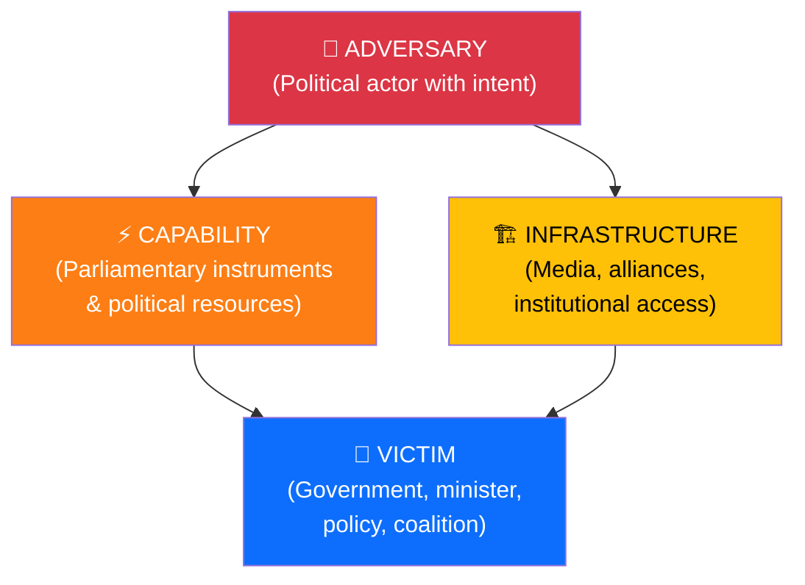

### Diamond Model Analysis Table

| Diamond Element | Description | Evidence |
|----------------|-------------|---------|
| **Adversary** | `[REQUIRED: Who is the threat actor? Name + party + role]` | `[dok_id / speech / motion reference]` |
| **Capability** | `[REQUIRED: What parliamentary/political tools do they wield?]` | `[e.g. "175-seat opposition bloc, KU complaint mechanism, media access"]` |
| **Infrastructure** | `[REQUIRED: What alliances, media channels, institutional access do they use?]` | `[e.g. "S-V-MP bloc coordination, SVT editorial access, EU Commission relationship"]` |
| **Victim** | `[REQUIRED: Who/what is targeted? Minister, policy, coalition stability?]` | `[e.g. "Statsminister Kristersson (M), migration policy, Tidöavtal coalition agreement"]` |

### Meta-Features (Context)

| Meta-Feature | Assessment |
|-------------|-----------|
| **Timestamp** | `[When did threat activity begin?]` |
| **Phase** | `[Kill chain stage 1-7]` |
| **Direction** | `[Targeted or opportunistic?]` |
| **Methodology** | `[Parliamentary (formal) or extra-parliamentary (media/public)?]` |
| **Resources** | `[What political capital is being spent?]` |

---

## 🏷️ Framework 4: Political Threat Taxonomy (Systematic Coverage)

> **Purpose:** The Political Threat Taxonomy ensures systematic coverage of all threat categories relevant to democratic governance. Unlike cybersecurity-origin models (which categorise by attack *type*), this taxonomy categorises by **democratic function threatened** — directly mapping to institutions, processes, and rights that AI analysts should examine.

### Political Threat Category Overview

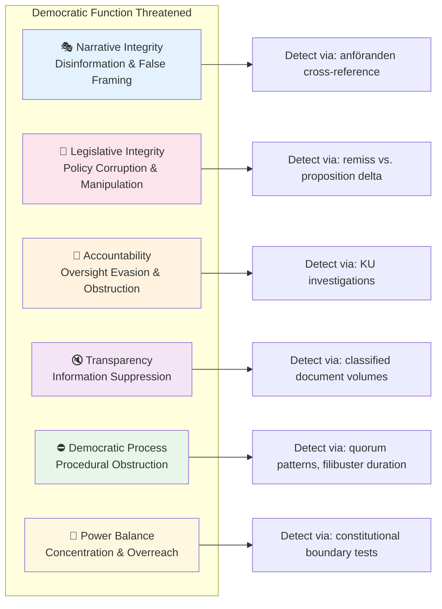

### Threat Category Definitions

| Category | Democratic Function | Threat Manifestation | Key MCP Detection Tool |
|----------|:------------------:|---------------------|----------------------|
| **Narrative Integrity** | Truthful public discourse | Disinformation, misleading framing, propaganda | `search_anforanden` + fact cross-reference |
| **Legislative Integrity** | Fair lawmaking | Undisclosed lobbying, process manipulation, fast-tracking | `search_dokument` prop vs. remiss delta |
| **Accountability** | Government answerability | KU evasion, record falsification, blame-shifting | `search_dokument` organ=KU |
| **Transparency** | Public access to information | Classification abuse, delayed disclosure, FOI obstruction | Document release timing analysis |
| **Democratic Process** | Fair parliamentary procedure | Filibustering, quorum manipulation, committee packing | `search_voteringar` patterns |
| **Power Balance** | Constitutional separation | Executive overreach, judiciary pressure, opposition suppression | Constitutional boundary tests |

---

## 🎭 Threat Category 1: Democratic Process Threats

*Threats that undermine the integrity of the Swedish democratic system itself.*

### Threat Taxonomy

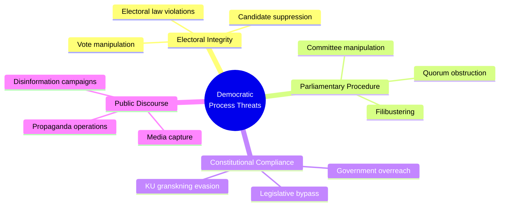

### Detection Indicators

| Threat | Early Warning Signal | MCP Tool for Detection | Severity Baseline |
|--------|---------------------|------------------------|:-----------------:|
| Vote manipulation | Unexpected defection pattern | `search_voteringar` | 4 |
| Filibustering | Abnormal debate length vs. content complexity | `search_anforanden` | 2 |
| Constitutional overreach | Proposition bypasses normal remiss process | `search_dokument` | 5 |
| Disinformation | Contradicting claims between official docs and politician statements | Cross-reference `anforanden` + `dokument` | 3 |

---

## 🏛️ Threat Category 2: Governance Integrity Threats

*Threats to the proper, accountable exercise of governmental authority.*

### Threat Taxonomy

| Threat Type | Threat Category | Key Actors | Observable Evidence |
|-------------|:---------------:|------------|---------------------|
| Policy corruption (undisclosed lobbying) | Legislative Integrity | Industry sector, foreign governments | SOU remiss response vs. final proposition delta |
| Accountability evasion | Accountability | Government ministers, party leadership | Anföranden contradicting voting record |
| Regulatory capture | Power Balance | Regulatory agencies, sector incumbents | Appointment patterns + policy reversals |
| Budget manipulation | Legislative Integrity | Finance ministry, budget committee | FiU reservationer vs. final budget text |
| Oversight blocking | Transparency | Government secretariat | KU request delays, classified document volumes |

### KU Granskning (Constitutional Committee Scrutiny) Monitoring

The Konstitutionsutskottet (KU) is Sweden's primary governance integrity watchdog. Track:

- **Open KU investigations** via `search_dokument` with `organ=KU` and `doktyp=bet`
- **New KU complaints** (anmälningar) filed by opposition parties
- **Government response delays** to KU information requests
- **KU hearing transcripts** (förhörsprotokoll) for accountability signals

**Threat Signal:** KU investigation into a sitting minister → automatic **High** governance integrity threat.

---

## 📡 Threat Category 3: Disinformation Threats

*Systematic efforts to mislead the public or parliament about political facts.*

### Disinformation Actor Classification

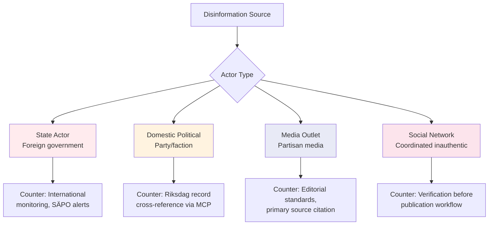

### Verification Protocol for Disputed Claims

Before publishing any claim that contradicts official parliamentary records:

1. **Cross-reference** claim against `search_dokument` (official proposition/motion text)
2. **Check voting record** via `search_voteringar` for the specific ledamot/party
3. **Review anföranden** via `search_anforanden` for consistent stated position
4. **Escalate to SENSITIVE classification** if contradiction cannot be resolved
5. **Apply confidence level LOW** until primary source confirms

---

## 🗳️ Threat Category 4: Opposition Pressure Mapping

*Systematic tracking of opposition strategies that constitute legitimate (but high-impact) political threats.*

### Opposition Threat Instruments

| Instrument | Threat Category | Threat to Government | Detection via MCP |
|-----------|:---------------:|----------------------|------------------|
| No-confidence motion (misstroendeförklaring) | Democratic Process | CRITICAL — can topple government | `search_dokument` doktyp=miss |
| Interpellation | Transparency | MEDIUM — forces ministerial response | `get_interpellationer` |
| Skriftlig fråga | Transparency | LOW — public accountability record | `get_fragor` |
| Budget amendment (ändringsyrkanden) | Legislative Integrity | HIGH — can redirect government spending | `search_voteringar` + FiU documents |
| Committee dissent (reservation) | Accountability | MEDIUM — undermines government narrative | `get_betankanden` |
| KU complaint | Power Balance | HIGH — triggers constitutional review | `search_dokument` organ=KU |

---

## 🇪🇺 Threat Category 5: EU / International Constraint Threats

*External forces that constrain Swedish parliamentary sovereignty or create compliance obligations.*

### EU Constraint Threat Matrix

| Constraint Type | Mechanism | Swedish Parliamentary Impact | Monitoring Signal |
|----------------|-----------|------------------------------|------------------|
| EU Directive transposition | Mandatory legislation | Forces legislation timeline | EU legislative calendar + `search_dokument` prop |
| ECJ ruling | Legal obligation | Overrides Riksdag legislation | Court reference in `dokument` fulltext |
| EU infringement procedure | Commission action | International embarrassment + fines | `search_dokument` EU-related |
| NATO Article 5 trigger | Military obligation | Emergency legislative session | Defence committee `search_dokument` organ=FöU |
| Nordic Council agreement | Soft obligation | Cross-border policy alignment pressure | `search_dokument` Nordic references |

### International Threat Severity Calibration

| Level | Example | Riksdag Response | Political Impact |
|-------|---------|-----------------|-----------------|
| Informational | EU Commission recommendation | Optional response | Low |
| Compliance | Directive transposition deadline | Mandatory legislation | Medium |
| Enforcement | ECJ ruling + fine risk | Urgent legislation required | High |
| Existential | NATO Article 5 | Emergency session + mobilisation | Critical |

---

## 🎯 Threat Agent Classification

All identified threat actors are classified on two axes: **Intent** and **Capability**.

| Threat Agent | Type | Intent | Capability | Primary Threat Category |
|-------------|------|--------|------------|------------------------|
| Governing coalition | Domestic political | Mixed (policy + power) | HIGH | Legislative Integrity, Accountability |
| Main opposition bloc | Domestic political | Clear (power acquisition) | MEDIUM-HIGH | Democratic Process, Transparency |
| Individual opposition MP | Domestic political | Varies | LOW-MEDIUM | Transparency, Accountability |
| Riksdag committee minority | Institutional | Policy-focused | MEDIUM | Legislative Integrity |
| Swedish media | Fourth estate | Disclosure-focused | MEDIUM | Narrative Integrity |
| Foreign state (Russia, China) | External | Destabilisation | HIGH | Narrative Integrity, Power Balance |
| Lobby/industry | Economic | Policy-focused | MEDIUM | Legislative Integrity |
| EU Commission | Institutional | Compliance | HIGH | Democratic Process, Power Balance |

---

## 🔗 Related Documents

- [templates/threat-analysis.md](../templates/threat-analysis.md) — Threat analysis template
- [reference/isms-threat-modeling-adaptation.md](../reference/isms-threat-modeling-adaptation.md) — ISMS mapping
- [THREAT_MODEL.md](../../THREAT_MODEL.md) — Platform-level threat model
- [FUTURE_THREAT_MODEL.md](../../FUTURE_THREAT_MODEL.md) — Future threat roadmap
- [political-risk-methodology.md](political-risk-methodology.md) — Risk methodology (complementary)

---

**Document Control:**  
- **Path:** `/analysis/methodologies/political-threat-framework.md`  
- **ISMS Reference:** [Threat_Modeling.md](https://github.com/Hack23/ISMS-PUBLIC/blob/main/Threat_Modeling.md)  
- **Version:** 3.2  
- **Frameworks:** Attack Trees, Political Kill Chain, Diamond Model, Political Threat Taxonomy, Threat Actor Profiling, Election 2026 Threat Taxonomy  
- **Key Changes v3.2:** Added Election 2026 threat taxonomy (electoral integrity threats, campaign attack vector analysis, coalition stability pre-election), 5-level confidence scale for threat severity assessments  
- **Key Changes v3.1:** Cross-Methodology Linkage Protocol (Severity→Likelihood mapping, SWOT Threats vs. dedicated threat analysis scope comparison, synthesis integration protocol with 4-step workflow, integrated dashboard Mermaid diagram)  
- **Classification:** Public  
- **Next Review:** 2026-09-01

<!-- version: 3.2.0 | updated: 2026-06-01 | author: Hack23 AB -->
<!-- document-control: political-analysis-methodology | classification: public -->

## Appendix A: Political Threat Category Detailed Definitions

### Narrative Integrity Threats (Polarization & Disinformation)
**What it is**: Intentional or systematic division of public opinion along political, social, or identity-based lines, through misleading rhetoric, disinformation, or populist framing.

**Observable indicators in Swedish parliamentary context**:
- Desinformation or propaganda keywords in document text
- Hatretorik (hate rhetoric) or extremism language
- Oss och dem (us and them) framing in speeches
- Migration policy used as wedge issue with divisive framing
- Nationalistisk rhetoric in chamber debates

**Democratic consequence**: Erodes shared political discourse; undermines coalition-building; increases social fragmentation.

**Swedish countermeasures**:
- SVT and SR public broadcasting obligations (balanced coverage mandate)
- Tryckfrihetsförordningen (Press Freedom Act)
- Civil society fact-checking organisations
- Parliamentary cross-party dialogue culture

---

### Power Balance Threats (Regulatory Overreach & Concentration)
**What it is**: Abuse of legislative or executive power; bypassing parliamentary process; concentrating regulatory authority beyond democratic mandate.

**Observable indicators**:
- Undantagsbefogenheter or nödbefogenheter (extraordinary powers) language
- Maktkoncentration (power concentration) in document content
- Legislation designed to circumvent parliamentary oversight
- Regulatory carve-outs excluding specific actors from normal scrutiny

**Democratic consequence**: Weakens parliamentary sovereignty; concentrates power; undermines checks and balances.

**Swedish countermeasures**:
- Lagrådet (Council on Legislation) mandatory pre-legislative constitutional review
- Constitutional Committee (KU) retrospective oversight
- Misstroendevotum (parliamentary no-confidence) mechanism
- JO and JK (Ombudsman institutions) investigate executive overreach

---

### Accountability Threats (Institutional Erosion)
**What it is**: Systematic weakening of democratic institutions, accountability mechanisms, or constitutional oversight. Includes accountability gaps, judicial capture, and democratic backsliding.

**Observable indicators**:
- KU (Constitutional Committee) investigation — always a strong indicator
- Ansvarslöshet or accountability gap language
- Konstitutionsbrott (constitutional violation) references
- Court packing or judicial independence threats
- Institutional capture signals

**Democratic consequence**: Long-term structural damage to democratic function; accountability failure becomes self-reinforcing.

**Swedish countermeasures**:
- Independent judiciary (Högsta domstolen, Högsta förvaltningsdomstolen)
- Parliamentary Ombudsman (JO) investigates maladministration
- KU retrospective review of government exercise of power
- ECHR and EU Charter provide supranational constitutional protection

---

### Transparency Threats (Democratic Deficit)
**What it is**: Restriction of public access to information, press freedom violations, transparency failures, or deliberate opacity in government decision-making.

**Observable indicators**:
- Offentlighetsprincipen (public access principle) restriction language
- Sekretess (secrecy) or hemligstämplad (classified) expansion
- Pressfrihet or yttrandefrihet (freedom of press/speech) threats
- Begränsad insyn (restricted oversight) signals
- Whistleblower protection weakening

**Democratic consequence**: Citizens cannot hold power accountable without information; media cannot fulfil watchdog function.

**Swedish countermeasures**:
- Offentlighetsprincipen (constitutional principle — Tryckfrihetsförordningen 2 kap.)
- Freedom of the press and expression (TF, YGL) constitutional protections
- EU General Data Protection Regulation (GDPR) and privacy rights
- ECHR Article 10 (freedom of expression)

---

### Democratic Process Threats (Economic Disruption)
**What it is**: Policy-driven economic harm; fiscal irresponsibility; policy failures that cause macroeconomic instability or economic harm to citizens.

**Observable indicators**:
- Budgetkris (budget crisis) or statsbankrutt (state bankruptcy) language
- Skuldkris (debt crisis) or finanskris (financial crisis) signals
- FiU involvement with economic disruption content
- Inflation spiral or stagflation language
- Coalition budget deadlock signals

**Democratic consequence**: Economic instability undermines social trust; fiscal failure limits democratic government's ability to function; vulnerable groups disproportionately harmed.

**Swedish countermeasures**:
- Independent Riksbank mandate (monetary policy buffer)
- Finanspolitiska rådet (Fiscal Policy Council) independent monitoring
- EU Stability and Growth Pact fiscal constraints
- Cross-party budget framework limiting extreme year-on-year changes

---

### Societal Impact Threats (Rights & Vulnerable Groups)
**What it is**: Disproportionate harm to vulnerable groups, erosion of fundamental rights, discriminatory policy effects, or systematic social exclusion through political decisions.

**Observable indicators**:
- Marginaliserade (marginalised) or utsatta grupper (vulnerable groups) language
- Diskriminering (discrimination) or rättighetsförlust (rights loss) signals
- Ojämlikhet (inequality) or social exclusion content
- SoU, SfU, or AU committee involvement with welfare/rights content
- Mänskliga rättigheter (human rights) concerns

**Democratic consequence**: Democratic legitimacy depends on inclusion; systematic exclusion of groups undermines democratic social contract.

**Swedish countermeasures**:
- Diskrimineringsombudsmannen (DO) — equality ombudsman
- Swedish welfare state baseline protections (socialtjänstlagen, etc.)
- ECHR Article 14 (prohibition of discrimination)
- EU equality law and Charter of Fundamental Rights

## 4. Threat Agents

### 4.1 Threat Agent Classification

| Agent | Primary Activities | Detection Signals |
|---|---|---|
| **ruling-coalition** | Policy agenda, legislative control, executive decisions | Proposition keywords, statsminister, Tidöavtal references |
| **opposition-parties** | Obstruction, alternative agendas, populist pressure | Motion keywords, interpellation filing, bloc references |
| **external-actors** | Foreign influence, EU regulatory pressure | EU/NATO/foreign government references, UU/FöU committee |
| **special-interests** | Lobbying, regulatory capture | Lobbyism, branschintresse, corporate influence signals |
| **media** | Narrative framing, selective coverage, disinformation | Media narrative signals, press freedom references |
| **institutional** | Implementation failures, bureaucratic inertia | Agency/myndighet keywords, bet/ds/dir document types |

### 4.2 Agent Detection in Swedish Context

- **Propositions (prop)** → ruling-coalition primary agent
- **Motions (mot), Interpellations (ip)** → opposition-parties primary agent
- **Foreign Affairs (UU), Defence (FöU) committee** → external-actors relevant
- **Committee reports (bet), Directives (dir)** → institutional agent relevant

## 5. Severity Calibration

| Level | Definition | Example Scenarios |
|---|---|---|
| **critical** | Immediate, fundamental threat to democratic function | Misstroendevotum context, constitutional breach, fundamental rights emergency |
| **high** | Serious, near-term threat requiring political response | KU investigation active, significant democratic accountability gap |
| **medium** | Moderate threat with observable indicators | Polarising rhetoric in debate, transparency concerns, emerging social tensions |
| **low** | Latent threat, early warning signal | Minor transparency concern, low-level institutional friction |

### 5.1 Calibration Principles
- Reserve **critical** for genuine constitutional or democratic emergencies
- **high** is appropriate for serious KU oversight findings or major democratic concerns
- Most ordinary parliamentary documents should produce **medium** or **low** threats
- Never assign all 6 categories as **critical** — that indicates miscalibration

## 6. Implementation Reference

**TypeScript Engine**: `scripts/analysis-framework/political-threat-analysis.ts`  
**Types**: `scripts/analysis-framework/methodology-types.ts`  
**AI Prompt**: `scripts/prompts/v2/political-threat-prompt.md`  
**Tests**: `tests/political-methodology.test.ts`

### 6.1 Quick API Reference
```typescript
import { analysePoliticalThreats, analyseSingleThreatCategory } from './political-threat-analysis.js';

// Full threat profile (legacy API — uses internal threat categories)
const profile = analysePoliticalThreats(doc, ciaContext);
console.log(profile.overallThreatLevel);  // 'critical' | 'high' | 'medium' | 'low' | 'none'
console.log(profile.primaryThreat);       // dominant threat category
console.log(profile.activeThreatAgents); // ThreatAgent[]

// Targeted single-category analysis
const narrativeThreat = analyseSingleThreatCategory(doc, 'polarization', ciaContext);
console.log(narrativeThreat?.severity);        // 'critical' | 'high' | 'medium' | 'low'
console.log(narrativeThreat?.countermeasures); // string[]
```

> **⚠️ Note:** The TypeScript API uses legacy category names (`polarization`, `regulatory-overreach`, etc.) internally. AI analysis should use the Political Threat Taxonomy categories (Narrative Integrity, Legislative Integrity, Accountability, Transparency, Democratic Process, Power Balance) in all markdown outputs.

## 7. Worked Examples

### Example 1: KU Constitutional Investigation (Accountability Threat)
**Document**: KU-granskning av grundlagsändring  
**Committee**: KU  

| Threat Category | Threat Agents | Severity |
|---|---|---|
| Narrative Integrity | opposition-parties, media | low |
| Power Balance | ruling-coalition | medium |
| **Accountability** | **ruling-coalition, institutional** | **high** |
| Transparency | ruling-coalition | medium |
| Democratic Process | institutional | low |
| Societal Impact | institutional | low |
| **Primary Threat: Accountability** | | **Overall: HIGH** |

### Example 2: Polarising Migration Interpellation
**Document**: Interpellation about migration and integration, SD party  

| Threat Category | Threat Agents | Severity |
|---|---|---|
| **Narrative Integrity** | **opposition-parties, media** | **high** |
| Power Balance | ruling-coalition | low |
| Accountability | institutional | low |
| Transparency | ruling-coalition | low |
| Democratic Process | ruling-coalition | low |
| Societal Impact | opposition-parties | medium |
| **Primary Threat: Narrative Integrity** | | **Overall: HIGH** |

### Example 3: Routine Written Question
**Document**: Written question about local transport  

| Threat Category | Threat Agents | Severity |
|---|---|---|
| Narrative Integrity | ruling-coalition | low |
| Power Balance | ruling-coalition | low |
| Accountability | institutional | low |
| Transparency | ruling-coalition | low |
| Democratic Process | ruling-coalition | low |
| Societal Impact | ruling-coalition | low |
| **Primary Threat: Narrative Integrity** | | **Overall: LOW** |

## 8. Integration Points

- **`DocumentAnalysisResult.methodologyAnalysis.threatProfile`**: Full threat profile (legacy API)
- **Article framing**: `primaryThreat` guides which democratic risk to highlight
- **Headline selection**: `overallThreatLevel = 'critical'` → democracy-focused framing
- **Editorial safeguards**: Always present `countermeasures` alongside threat identification
- **SWOT integration**: Threat analyses feed into SWOT threat quadrant

---

## 9. Severity Calibration Table

Map the 1–5 severity scale to specific Swedish political indicators for consistent scoring:

| Severity | Label | Definition | Swedish Political Example | Threat Level |
|:--------:|-------|-----------|--------------------------|:------------:|
| **1** | Negligible | Routine political activity; no democratic process impact | Routine written question about local transport | 🟢 LOW |
| **2** | Minor | Minor procedural concern; self-correcting through normal channels | Committee delays a report by 1 week | 🟢 LOW |
| **3** | Moderate | Democratic process strained; intervention may be needed | Coalition party votes against government on non-budget issue | 🟡 MODERATE |
| **4** | Major | Significant democratic process threat; formal response required | KU investigation opened into government minister; SD threatens to withdraw support | 🟠 HIGH |
| **5** | Severe | Constitutional crisis; democratic norms threatened | Government falls via no-confidence vote; extraordinary election called; parliamentary rules suspended | 🔴 SEVERE |

### Escalation Criteria

A threat analysis triggers escalation to **breaking news** status when:

| Condition | Action | Severity Threshold |
|-----------|--------|--------------------|
| Any threat category reaches severity 5 | Immediate breaking analysis | SEVERE |
| ≥ 2 threat categories reach severity 4 | Priority analysis; article within 2 hours | HIGH |
| Overall threat level = SEVERE | All-language deployment; editor notification | SEVERE |
| KU formal investigation announced | Priority threat assessment update | ≥ 3 (MODERATE) |
| No-confidence motion filed | Immediate full threat model update | 5 (SEVERE) |

### Threat-to-Risk Integration

Connect threat severity to the risk methodology's 5×5 matrix:

| Threat Severity | → Risk Likelihood Equivalent | → Risk Impact Equivalent |
|:--------------:|:---------------------------:|:------------------------:|
| 1 (Negligible) | L=1 (Rare) | I=1 (Negligible) |
| 2 (Minor) | L=2 (Unlikely) | I=2 (Minor) |
| 3 (Moderate) | L=3 (Possible) | I=3 (Moderate) |
| 4 (Major) | L=4 (Likely) | I=4 (Major) |
| 5 (Severe) | L=5 (Almost Certain) | I=5 (Severe) |

> **Note:** Threat severity maps to BOTH likelihood and impact because a severe democratic threat is both more likely to materialize AND more impactful. For specific risk scoring, assess likelihood and impact independently using the risk methodology.

---

## 10. AI Analysis Protocol for Threat Assessment (Legacy v1.0 — Superseded)

> **⚠️ This section is superseded by the Multi-Framework Integration Protocol above.** The protocol below is retained for backward compatibility with existing workflows that reference "Section 10". New workflows should use the Multi-Framework Integration Protocol.

The AI agent **MUST** follow this protocol when performing threat analysis:

1. **Read this framework** — understand the Political Threat Taxonomy, Attack Trees, Kill Chain, Diamond Model, and Actor Profiling
2. **Read the templates** — `analysis/templates/threat-analysis.md` and per-file template's threat section
3. **Query MCP tools** for evidence:
   - `search_dokument` with `organ=KU` — constitutional committee investigations (Accountability threats)
   - `search_voteringar` — coalition voting patterns (Legislative Integrity threats)
   - `search_anforanden` — debate rhetoric (Narrative Integrity threats)
   - `search_dokument` with `doktyp=miss` — no-confidence motions (Democratic Process threats)
   - `get_interpellationer` — accountability probes (Transparency threats)
4. **Assess each threat category** using the severity calibration table above
5. **Build Attack Trees** for the top 2-3 threats
6. **Map threat actors** — identify who benefits from each threat using ICO model
7. **Connect to risk scoring** using the Threat-to-Risk integration table
8. **Include countermeasures** for every identified threat

---

## 👤 Framework 5: Threat Actor Profiling

Threat actor profiling provides the deepest understanding of **who** poses threats and **why**. This framework is essential for predicting future actions and assessing threat credibility.

### Intent-Capability-Opportunity (ICO) Model

Every threat actor is assessed across three dimensions:

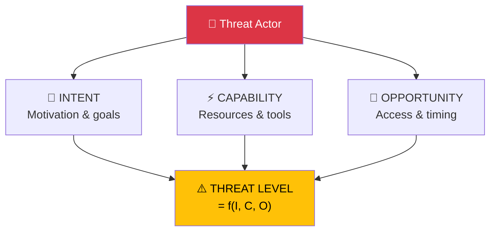

### Swedish Political Threat Actor Taxonomy

| Actor Category | Examples | Typical Intent | Typical Capability | Typical Opportunity |
|---------------|---------|---------------|-------------------|-------------------|
| **Government coalition** | M, KD, L + SD (supply) | Policy agenda advancement, coalition stability | Legislative majority, government apparatus, budget control | Continuous — holds power |
| **Main opposition** | S, V, MP, C | Government accountability, alternative governance | Parliamentary instruments, media access, polling advantage | Committee hearings, budget debates, KU reviews |
| **Kingmaker party (SD)** | SD leadership | Policy concessions, migration agenda, budget influence | Swing vote (≥175 threshold), public opinion leverage | Budget votes, no-confidence moments, election proximity |
| **Foreign state actors** | Russia, China (intelligence threat) | Democratic destabilisation, policy influence | Disinformation infrastructure, cyber capabilities, economic leverage | Information vacuum, election periods, crisis events |
| **Media actors** | SVT, SR, DN, SvD, Aftonbladet | Agenda setting, accountability, audience capture | Editorial platforms, investigative resources, public trust | Scandals, policy failures, election cycles |
| **Interest groups** | Industry lobbies, NGOs, unions | Policy influence, regulatory capture, agenda promotion | Economic resources, expertise, member mobilization | Committee consultations, remisser, SOU processes |
| **EU institutions** | Commission, ECJ, Parliament | Regulatory harmonisation, compliance enforcement | Legal authority, infringement procedures, funding | Directive deadlines, rule-of-law reviews |

### Actor Profiling Template

For each significant threat actor identified:

| Attribute | Assessment | Evidence |
|-----------|-----------|---------|
| **Identity** | `[Name, party, role]` | `[MCP reference]` |
| **Intent** | `[What do they want? Public statements + inferred goals]` | `[dok_id: speeches, motions]` |
| **Capability** | `[What resources and tools can they deploy?]` | `[Seat count, committee positions, media access]` |
| **Opportunity** | `[What upcoming events create windows for action?]` | `[Calendar events, legislative deadlines]` |
| **Track Record** | `[Have they acted on similar threats before?]` | `[Historical vote records, past actions]` |
| **Constraints** | `[What limits their action? Electoral risk, coalition agreements, legal barriers]` | `[Tidöavtal terms, party platform, polling data]` |
| **ICO Assessment** | `[HIGH/MEDIUM/LOW threat level]` | `[Combined assessment]` |

---

## 🔗 Multi-Framework Integration Protocol

When performing threat analysis, combine frameworks for maximum depth:

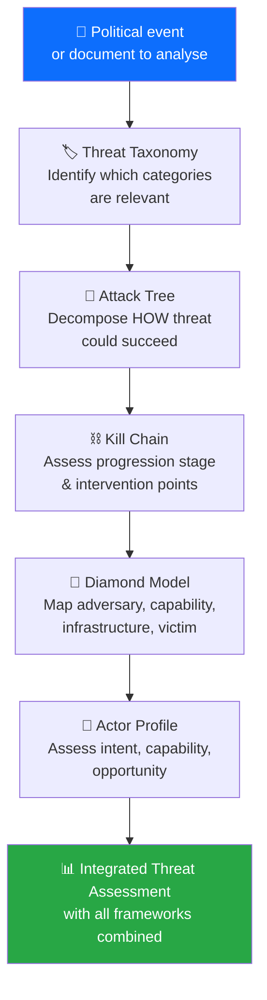

### Integration Table

| Step | Framework | Output | Feeds Into |
|:----:|-----------|--------|-----------|
| 1 | Threat Taxonomy | Affected democratic functions identified | Ensures systematic coverage |
| 2 | Attack Trees | Decomposed attack paths with feasibility | Risk methodology (likelihood assessment) |
| 3 | Kill Chain | Stage progression assessment | Forward indicators (what to watch) |
| 4 | Diamond Model | Adversary-victim-capability mapping | SWOT analysis (threats quadrant) |
| 5 | Actor Profiling | ICO assessment per actor | Stakeholder impact analysis |

---

## 🤖 AI Analysis Protocol for Threat Assessment (v3.0)

The AI agent **MUST** follow this protocol when performing threat analysis:

1. **Read this framework** — understand ALL four frameworks: Attack Trees, Kill Chain, Diamond Model, Actor Profiling
2. **Use Political Threat Taxonomy** as a coverage checklist — identify which democratic functions are threatened
3. **Build Attack Trees** for the top 2–3 threats — decompose how they could succeed
4. **Map Kill Chain stages** — where has the threat progressed? Where can it be disrupted?
5. **Apply Diamond Model** for the most significant threat actor
6. **Profile key actors** using ICO model — what constrains and motivates them?
7. **Query MCP tools** for evidence:
   - `search_dokument` with `organ=KU` — constitutional committee investigations
   - `search_voteringar` — coalition voting patterns
   - `search_anforanden` — debate rhetoric and signaling
   - `search_dokument` with `doktyp=miss` — no-confidence motions
   - `get_interpellationer` — accountability probes
   - `get_calendar_events` — upcoming legislative milestones
8. **Score severity** using the calibration table
9. **Connect to risk scoring** using the Threat-to-Risk integration table
10. **Identify forward indicators** — what MCP-observable signals would indicate threat escalation?

---

## 🔗 Cross-Methodology Linkage Protocol (v3.1)

Threat analysis does not exist in isolation — it feeds into risk assessment and interacts with SWOT analysis. This section defines how findings from the threat framework connect to the other two analytical frameworks and how all three are synthesized.

### Threat → Risk Integration

Threat analysis findings provide **input to risk likelihood scoring** in the [political-risk-methodology.md](political-risk-methodology.md). The mapping is:

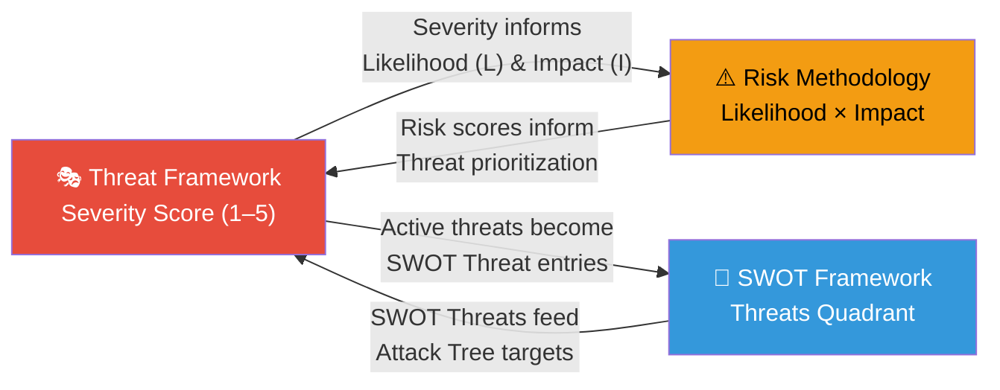

#### Severity → Risk Alignment

Use the existing **Threat-to-Risk Integration** table earlier in this document as the authoritative mapping between this framework's severity scores and the risk methodology values.

**Rule:** When a threat assessment produces a severity score, it MUST be reflected in the corresponding risk category's **Likelihood (L)** and **Impact (I)** values in accordance with the existing Threat-to-Risk Integration mapping. If a threat scores `Severity=4`, the corresponding risk assessment cannot assign materially inconsistent values (for example, `L=1` and/or `I=1`) without explicit justification.

### SWOT "Threats" vs. Dedicated Threat Analysis

The SWOT Threats quadrant and the dedicated threat framework serve **different purposes** at different analytical depths:

| Dimension | SWOT Threats Quadrant | Dedicated Threat Framework |
|:---|:---|:---|
| **Scope** | Broad — any external factor that could harm the actor | Specific — decomposed attack paths, progression stages |
| **Depth** | Summary (1–3 lines per entry) | Deep analysis (Attack Trees, Kill Chain, Diamond Model, Actor Profiling) |
| **Framework** | Single quadrant within 4-quadrant SWOT | 4+ complementary frameworks combined |
| **Output** | Threat list with confidence labels | Threat taxonomy, severity calibration, forward indicators |
| **Time horizon** | Current snapshot | Current + prognostic (forward indicators) |
| **When to use** | Every analysis (SWOT is mandatory) | High-significance events meeting either gate (see below) |

#### Integration Rules

The dedicated threat framework is triggered when **either** of the following gates is met (logical OR — not both required):

1. **Classification gate:** The document or event has **SENSITIVE** or **RESTRICTED** sensitivity classification
2. **SWOT threat significance gate:** A SWOT Threat entry is recorded with **Impact = High** and **Confidence = Medium or High** in the existing SWOT entry fields

**Conflict resolution:** If a SENSITIVE/RESTRICTED event has no SWOT Threat entries meeting the significance gate above, the dedicated framework is still required (classification gate overrides). Conversely, a PUBLIC event with a SWOT Threat entry recorded as **Impact = High** and **Confidence = Medium or High** also triggers full analysis (significance gate overrides). When in doubt, apply the framework — false positives are preferable to missed threats.

Additional rules:

1. **Every dedicated threat finding** MUST produce a corresponding SWOT Threat entry — the SWOT entry is the **summary** of the deeper analysis
2. **Not every SWOT Threat** requires a dedicated threat analysis — only those meeting one of the two gates above warrant full framework treatment, using the existing SWOT **Impact** and **Confidence** fields for the significance gate
3. **Cross-reference format:** SWOT Threat entries from dedicated analysis include `(see threat-analysis.md §[section])` annotation

### Synthesis Summary Integration Protocol

When producing a **synthesis-summary.md** (daily, weekly, or monthly), weave together all three frameworks using this structure:

#### Step 1: Identify Active Threats

From `threat-analysis.md`, extract threats at Kill Chain Stage ≥3 (Delivery or beyond), and assign each threat to the **canonical risk category names defined in the risk methodology**:

| Threat | Severity | Kill Chain Stage | Affected Risk Category |
|:---|:---:|:---:|:---|
| `[Threat name]` | `[1–5]` | `[Stage name]` | `[Coalition stability / Policy implementation / Legislative integrity / Economic governance / Social cohesion / Democratic process]` |

#### Step 2: Map Threats to Risk Scores

Transfer threat severity to risk likelihood per the mapping table above, using the same canonical risk categories from the risk methodology, then compute L×I:

| Risk Category | Threat-Informed L | Impact (I) | Score | Prior Score | Δ |
|:---|:---:|:---:|:---:|:---:|:---:|
| `[Canonical category name]` | `[1–5]` | `[1–5]` | `[L×I]` | `[previous]` | `[change]` |

#### Step 3: Reflect in SWOT

Add or update SWOT Threat entries for each active threat, applying confidence levels:

| SWOT Threat | Confidence | Source | Cross-Reference |
|:---|:---:|:---|:---|
| `[Entry text]` | `[HIGH/MEDIUM/LOW]` | `[dok_id or MCP ref]` | `threat-analysis.md §[section]` |

#### Step 4: Produce Integrated Dashboard

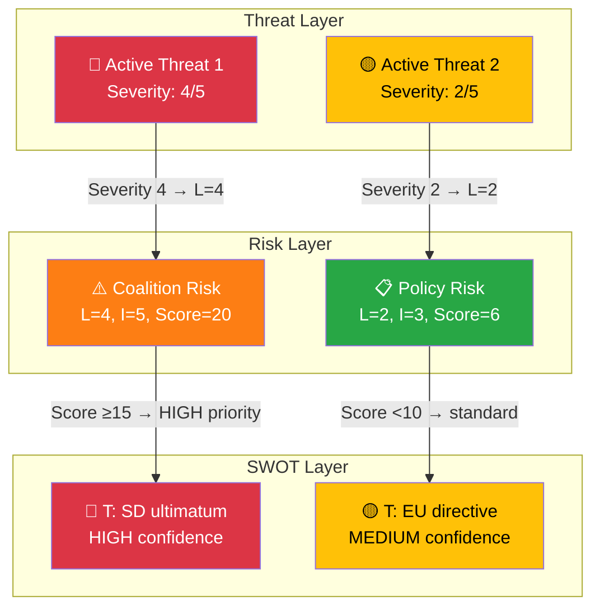

### Anti-Pattern: Disconnected Analyses

> **REJECTED:** Producing a threat analysis, risk assessment, and SWOT analysis that do not reference each other. If `threat-analysis.md` identifies a Severity=4 threat but `risk-assessment.md` shows all risks below Score=10, there is a methodology disconnect that must be resolved before publication.

---

## 🔗 Related Documents

- [templates/threat-analysis.md](../templates/threat-analysis.md) — Threat analysis template (multi-framework)
- [templates/per-file-political-intelligence.md](../templates/per-file-political-intelligence.md) — Per-file analysis template with threat section
- [political-risk-methodology.md](political-risk-methodology.md) — Risk scoring (threats feed into risk)
- [political-swot-framework.md](political-swot-framework.md) — Threats feed into SWOT threat quadrant
- [ai-driven-analysis-guide.md](ai-driven-analysis-guide.md) — Master analysis protocol
- [reference/isms-threat-modeling-adaptation.md](../reference/isms-threat-modeling-adaptation.md) — ISMS mapping
- [THREAT_MODEL.md](../../THREAT_MODEL.md) — **Formatting exemplar** (platform threat model)
