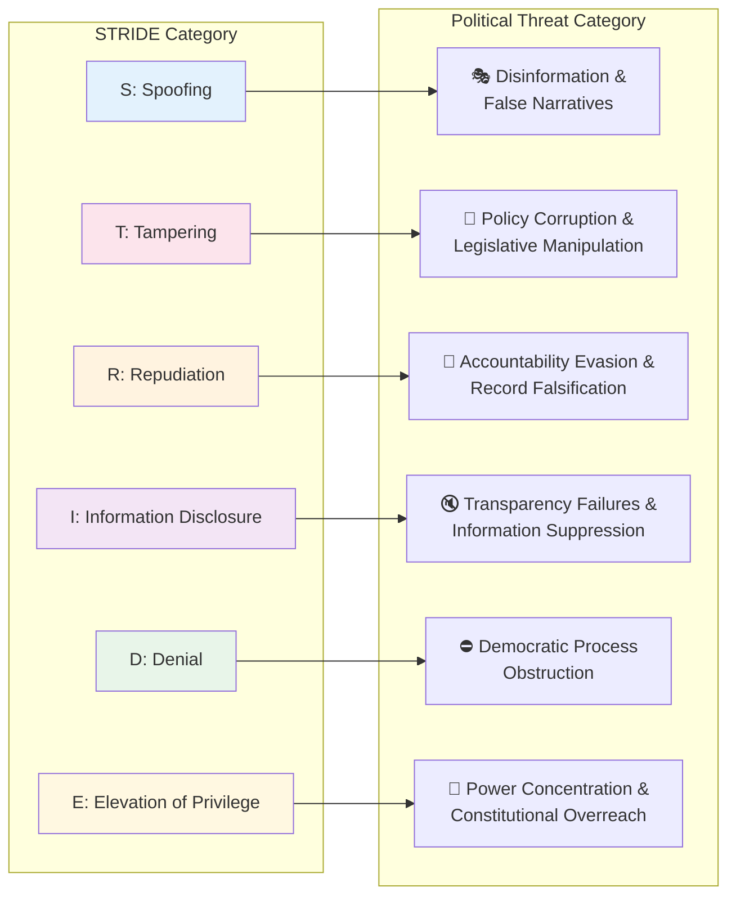
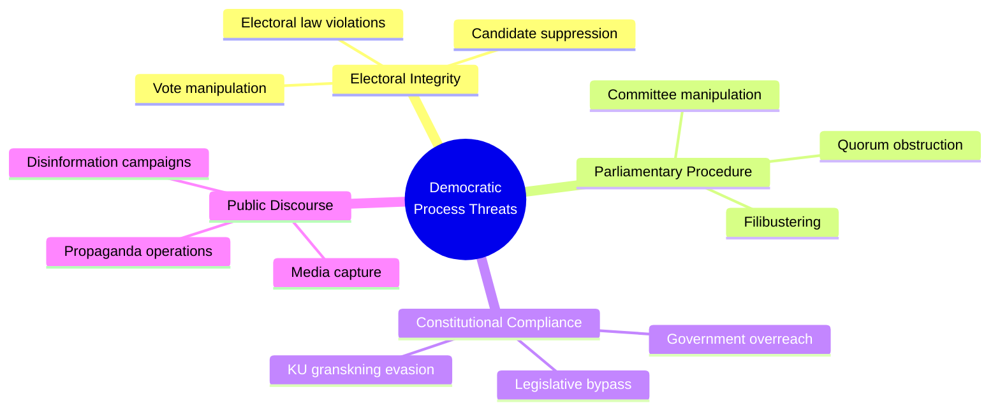
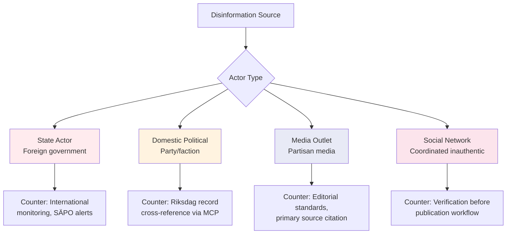

  

<h1 align="center">🎭 Political Threat Analysis Framework</h1>

  <strong>📊 STRIDE-Adapted Framework for Democratic Process Threats</strong> 
  <em>🎯 Democratic Integrity · Governance · Disinformation · Opposition · EU Constraints</em>

  
  
  
  

**📋 Document Owner:** CEO | **📄 Version:** 1.0 | **📅 Last Updated:** 2026-03-26 (UTC)  
**🔄 Review Cycle:** Quarterly | **⏰ Next Review:** 2026-06-26  
**🏢 Owner:** Hack23 AB (Org.nr 5595347807) | **🏷️ Classification:** Public

---

## 🎯 Purpose

This framework establishes the authoritative methodology for political threat analysis in Riksdagsmonitor. It adapts the STRIDE cybersecurity threat modeling framework — as implemented in [Hack23 ISMS Threat_Modeling.md](https://github.com/Hack23/ISMS-PUBLIC/blob/main/Threat_Modeling.md) — to the systematic analysis of threats to democratic processes, governance integrity, and political accountability in the Swedish parliamentary system.

See [reference/isms-threat-modeling-adaptation.md](../reference/isms-threat-modeling-adaptation.md) for the complete ISMS-to-political mapping.

---

## 🗺️ STRIDE-to-Political Mapping Overview

---

## 🎭 Threat Category 1: Democratic Process Threats

*Threats that undermine the integrity of the Swedish democratic system itself.*

### Threat Taxonomy

### Detection Indicators

| Threat | Early Warning Signal | MCP Tool for Detection | Severity Baseline |
|--------|---------------------|------------------------|:-----------------:|
| Vote manipulation | Unexpected defection pattern | `search_voteringar` | 4 |
| Filibustering | Abnormal debate length vs. content complexity | `search_anforanden` | 2 |
| Constitutional overreach | Proposition bypasses normal remiss process | `search_dokument` | 5 |
| Disinformation | Contradicting claims between official docs and politician statements | Cross-reference `anforanden` + `dokument` | 3 |

---

## 🏛️ Threat Category 2: Governance Integrity Threats

*Threats to the proper, accountable exercise of governmental authority.*

### Threat Taxonomy

| Threat Type | STRIDE Mapping | Key Actors | Observable Evidence |
|-------------|---------------|------------|---------------------|
| Policy corruption (undisclosed lobbying) | T — Tampering | Industry sector, foreign governments | SOU remiss response vs. final proposition delta |
| Accountability evasion | R — Repudiation | Government ministers, party leadership | Anföranden contradicting voting record |
| Regulatory capture | E — Elevation | Regulatory agencies, sector incumbents | Appointment patterns + policy reversals |
| Budget manipulation | T — Tampering | Finance ministry, budget committee | FiU reservationer vs. final budget text |
| Oversight blocking | D — Denial | Government secretariat | KU request delays, classified document volumes |

### KU Granskning (Constitutional Committee Scrutiny) Monitoring

The Konstitutionsutskottet (KU) is Sweden's primary governance integrity watchdog. Track:

- **Open KU investigations** via `search_dokument` with `organ=KU` and `doktyp=bet`
- **New KU complaints** (anmälningar) filed by opposition parties
- **Government response delays** to KU information requests
- **KU hearing transcripts** (förhörsprotokoll) for accountability signals

**Threat Signal:** KU investigation into a sitting minister → automatic **High** governance integrity threat.

---

## 📡 Threat Category 3: Disinformation Threats

*Systematic efforts to mislead the public or parliament about political facts.*

### Disinformation Actor Classification

### Verification Protocol for Disputed Claims

Before publishing any claim that contradicts official parliamentary records:

1. **Cross-reference** claim against `search_dokument` (official proposition/motion text)
2. **Check voting record** via `search_voteringar` for the specific ledamot/party
3. **Review anföranden** via `search_anforanden` for consistent stated position
4. **Escalate to SENSITIVE classification** if contradiction cannot be resolved
5. **Apply confidence level LOW** until primary source confirms

---

## 🗳️ Threat Category 4: Opposition Pressure Mapping

*Systematic tracking of opposition strategies that constitute legitimate (but high-impact) political threats.*

### Opposition Threat Instruments

| Instrument | STRIDE | Threat to Government | Detection via MCP |
|-----------|--------|----------------------|------------------|
| No-confidence motion (misstroendeförklaring) | D — Denial | CRITICAL — can topple government | `search_dokument` doktyp=miss |
| Interpellation | I — Disclosure | MEDIUM — forces ministerial response | `get_interpellationer` |
| Skriftlig fråga | I — Disclosure | LOW — public accountability record | `get_fragor` |
| Budget amendment (ändringsyrkanden) | T — Tampering | HIGH — can redirect government spending | `search_voteringar` + FiU documents |
| Committee dissent (reservation) | R — Repudiation | MEDIUM — undermines government narrative | `get_betankanden` |
| KU complaint | E — Elevation (counter) | HIGH — triggers constitutional review | `search_dokument` organ=KU |

---

## 🇪🇺 Threat Category 5: EU / International Constraint Threats

*External forces that constrain Swedish parliamentary sovereignty or create compliance obligations.*

### EU Constraint Threat Matrix

| Constraint Type | Mechanism | Swedish Parliamentary Impact | Monitoring Signal |
|----------------|-----------|------------------------------|------------------|
| EU Directive transposition | Mandatory legislation | Forces legislation timeline | EU legislative calendar + `search_dokument` prop |
| ECJ ruling | Legal obligation | Overrides Riksdag legislation | Court reference in `dokument` fulltext |
| EU infringement procedure | Commission action | International embarrassment + fines | `search_dokument` EU-related |
| NATO Article 5 trigger | Military obligation | Emergency legislative session | Defence committee `search_dokument` organ=FöU |
| Nordic Council agreement | Soft obligation | Cross-border policy alignment pressure | `search_dokument` Nordic references |

### International Threat Severity Calibration

| Level | Example | Riksdag Response | Political Impact |
|-------|---------|-----------------|-----------------|
| Informational | EU Commission recommendation | Optional response | Low |
| Compliance | Directive transposition deadline | Mandatory legislation | Medium |
| Enforcement | ECJ ruling + fine risk | Urgent legislation required | High |
| Existential | NATO Article 5 | Emergency session + mobilisation | Critical |

---

## 🎯 Threat Agent Classification

All identified threat actors are classified on two axes: **Intent** and **Capability**.

| Threat Agent | Type | Intent | Capability | Primary STRIDE Category |
|-------------|------|--------|------------|------------------------|
| Governing coalition | Domestic political | Mixed (policy + power) | HIGH | T, R, D, E |
| Main opposition bloc | Domestic political | Clear (power acquisition) | MEDIUM-HIGH | D, I, R |
| Individual opposition MP | Domestic political | Varies | LOW-MEDIUM | I, R |
| Riksdag committee minority | Institutional | Policy-focused | MEDIUM | T, R |
| Swedish media | Fourth estate | Disclosure-focused | MEDIUM | I |
| Foreign state (Russia, China) | External | Destabilisation | HIGH | S, T |
| Lobby/industry | Economic | Policy-focused | MEDIUM | T |
| EU Commission | Institutional | Compliance | HIGH | D, E |

---

## 🔗 Related Documents

- [templates/threat-analysis.md](../templates/threat-analysis.md) — Threat analysis template
- [reference/isms-threat-modeling-adaptation.md](../reference/isms-threat-modeling-adaptation.md) — ISMS mapping
- [THREAT_MODEL.md](../../THREAT_MODEL.md) — Platform-level threat model
- [FUTURE_THREAT_MODEL.md](../../FUTURE_THREAT_MODEL.md) — Future threat roadmap
- [political-risk-methodology.md](political-risk-methodology.md) — Risk methodology (complementary)

---

**Document Control:**  
- **Path:** `/analysis/methodologies/political-threat-framework.md`  
- **ISMS Reference:** [Threat_Modeling.md](https://github.com/Hack23/ISMS-PUBLIC/blob/main/Threat_Modeling.md)  
- **Classification:** Public  
- **Next Review:** 2026-06-26
