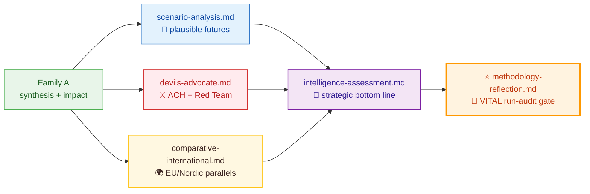
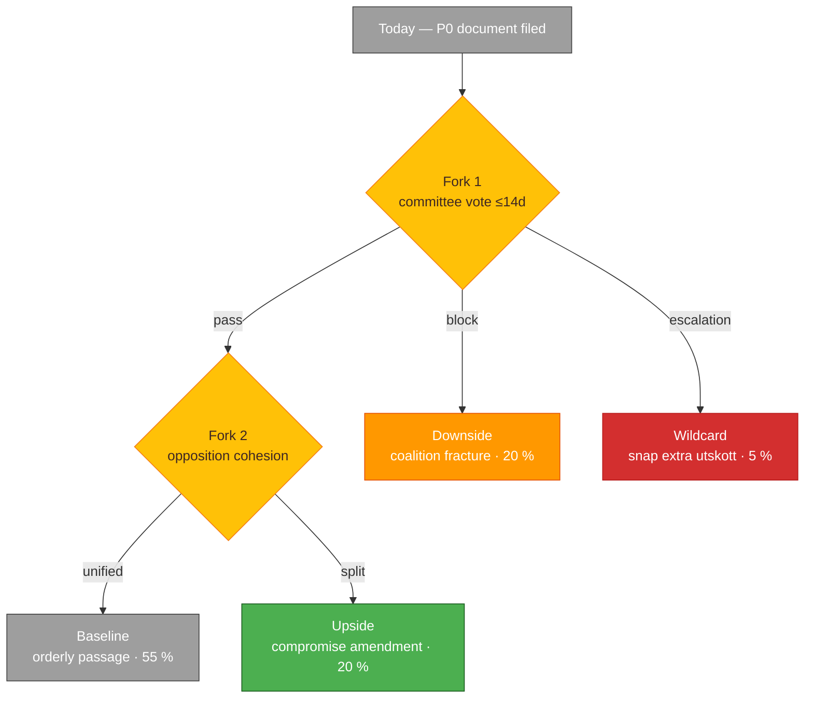
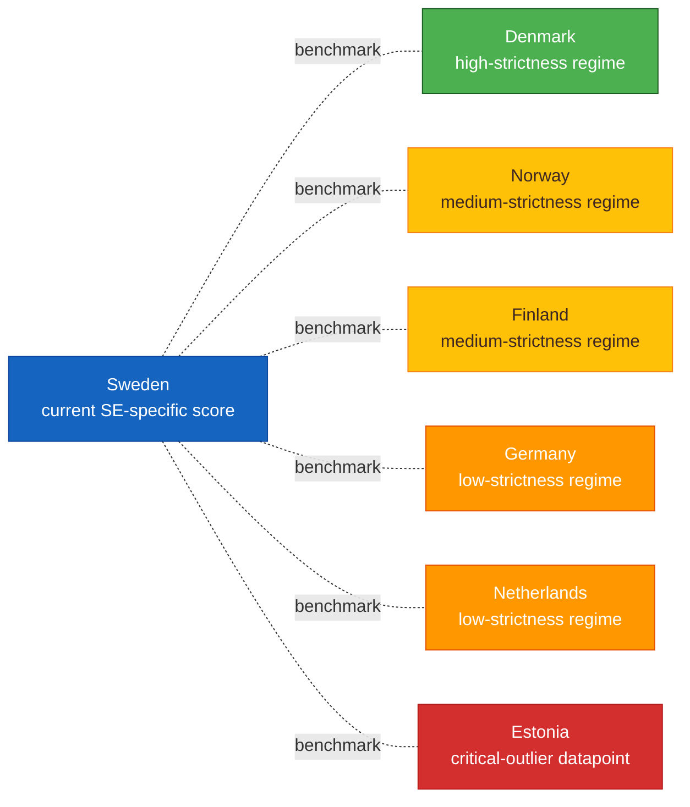
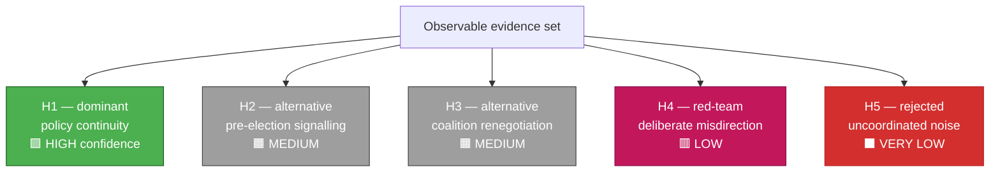
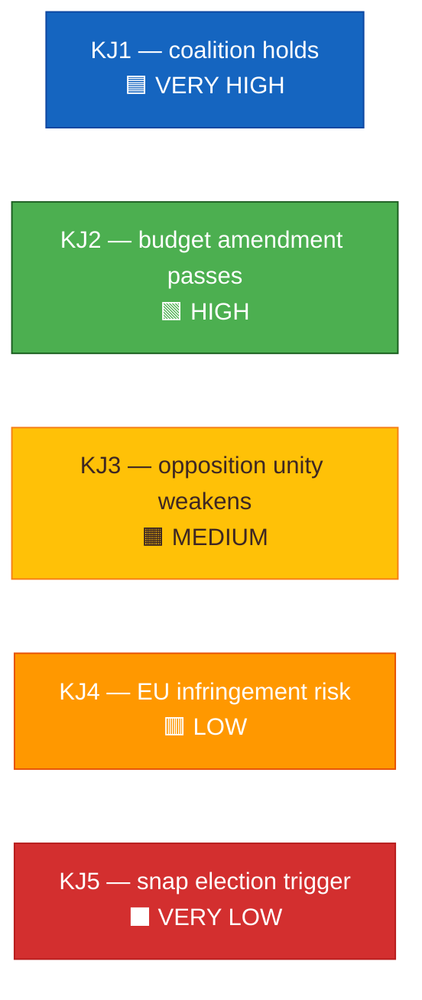
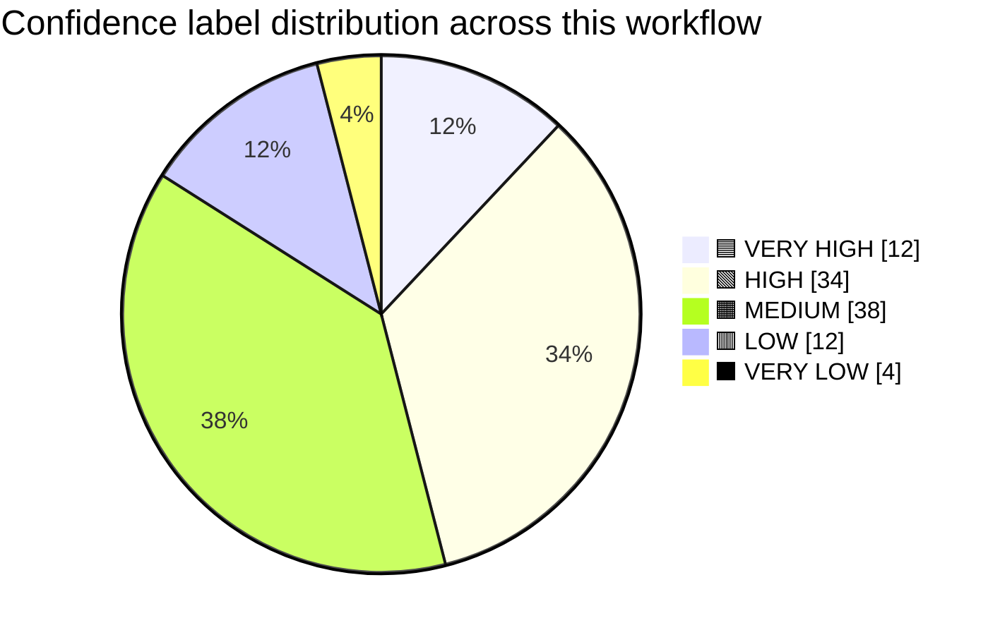
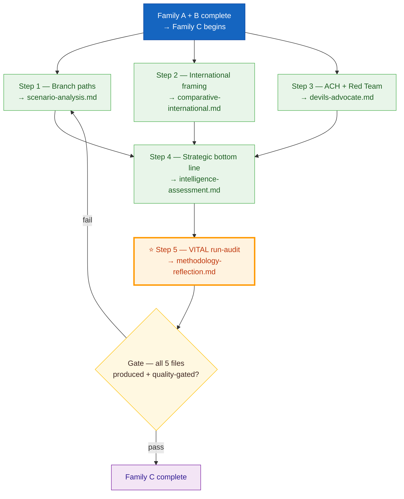

  

<h1 align="center">📙 Strategic Extensions Methodology</h1>

  <strong>📊 Family C — Depth Layer for High-Significance Events</strong> 
  <em>🎯 Scenario Analysis · Comparative International · Devil's Advocate (ACH) · Intelligence Assessment · Methodology Reflection</em>

  
  
  
  

**📋 Document Owner:** CEO | **📄 Version:** 1.4 | **📅 Last Updated:** 2026-05-15 (UTC)
**🔄 Review Cycle:** Quarterly | **⏰ Next Review:** 2026-07-21
**🏢 Owner:** Hack23 AB (Org.nr 5595347807) | **🏷️ Classification:** Public

---

<!-- BEGIN AI-FIRST METHODOLOGY CARD -->

## 🎯 AI-FIRST Methodology Card

> **🚦 Read this card before writing a single paragraph.** It names the artifact this methodology owns, the gate check it satisfies, the evidence-density target it must hit, and the Pass-1 / Pass-2 discipline required by `.github/copilot-instructions.md` §5 (AI-FIRST Quality Principle).

| Field | Value |
|-------|-------|
| **Purpose** | Family C — step-by-step production of the 5 strategic-extension artifacts (scenarios, comparative international, ACH devil's advocate, intelligence assessment, methodology reflection). |
| **Inputs** | Family A synthesis + SWOT + risk + threat; OSINT tradecraft standards; reference-quality-thresholds for the article type |
| **Outputs** | `scenario-analysis.md`, `comparative-international.md`, `devils-advocate.md`, `intelligence-assessment.md`, `methodology-reflection.md` |
| **Owning artifact(s)** | All 5 Family C artifacts |
| **Owning gate check** | Check 7 (Family C structure: ≥ 3 scenarios, ≥ 3 KJs with confidence, ≥ 3 ACH hypotheses, ICD 203 audit marker) |
| **Citation density target** | ≥ 1 evidence anchor per scenario/hypothesis/KJ; ≥ 2 cycle-aged sources per `year`/`cycle` horizon claim |
| **Banned phrases** | Enforced via [`political-style-guide.md` §Machine-readable banned-phrase list](political-style-guide.md#machine-readable-banned-phrase-list) |
| **Threshold source** | [`reference-quality-thresholds.json`](reference-quality-thresholds.json) → `thresholds[articleType][artifact]` (fallback `defaults.coreArtifactFloor`) |

### ✅ Pass-1 checklist (creation — minimal viable artifact)

- [ ] ≥ 3 distinct scenarios with WEP probability and total ≤ 100%
- [ ] ≥ 3 ACH competing hypotheses with explicit consistent/inconsistent/N-A scoring per evidence row
- [ ] ≥ 3 Key Judgments each with VERY HIGH/HIGH/MEDIUM/LOW/VERY LOW confidence and ≥ 1 PIR reference
- [ ] `methodology-reflection.md` contains an ICD 203 audit marker or ≥ 3 named methodology improvements
- [ ] Produce every required sub-section listed in the owning template
- [ ] Add ≥ 1 evidence anchor (`dok_id`, vote id, named MP, or primary-source URL) per analytical claim
- [ ] Apply the correct WEP confidence band for the run's horizon (`72h / week / month / quarter / year / cycle`)
- [ ] Include ≥ 1 themed Mermaid diagram with `style …` or `themeVariables` config (where structurally meaningful)
- [ ] Cross-link the relevant template under `analysis/templates/` and the gate check it satisfies

### 🔁 Pass-2 checklist (read-back & improve — AI-FIRST mandatory)

- [ ] Add ≥ 1 wildcard / black-swan to scenario-analysis where horizon ≥ `year`
- [ ] Verify comparator set covers ≥ 2 peer countries with named indicators (IMF / SCB / WB)
- [ ] Read back devils-advocate: each hypothesis must survive at least one elimination test
- [ ] Re-read the file end-to-end; flag every claim that lacks an evidence anchor and add one
- [ ] Replace every banned phrase listed in [`political-style-guide.md` §Machine-readable banned-phrase list](political-style-guide.md#machine-readable-banned-phrase-list) with an evidence-anchored alternative
- [ ] Tighten WEP language: never above **likely** without ≥ 3 cycle-aged sources for `year`/`cycle` horizons
- [ ] Strengthen Mermaid (color-coded `style …` directives, `themeVariables`, ≥ 5 nodes where the structure admits it)
- [ ] Add ≥ 1 second-order effect, cui-bono note, or counterfactual where the artifact admits one
- [ ] Verify citation density meets the per-file target below and the gate's evidence-density rules

### 🟢 Exemplar (good — pattern-match this)

> _(scenario row)_ "⁠**Scenario B — Tidö coalition holds (likely, ~70 %)**: M+KD+L+SD pass H902FiU1 budget; precedent: 2024 budget vote (cf. H801FiU1, 175–174). Wildcard: SD walkout if migration deal slips (~10 %). Sources: `dok_id` H902FiU1, statskontoret.se freshness 2026-04-22."

### 🔴 Anti-exemplar (failure mode — never ship this)

> _(failure mode)_ "Several scenarios are possible. The coalition might hold or might not. Experts believe the situation is fluid." — < 3 scenarios, no probabilities, banned phrases, no `dok_id`.

### 🔗 Cross-links

- **Template(s)**: `analysis/templates/scenario-analysis.md`, `analysis/templates/comparative-international.md`, `analysis/templates/devils-advocate.md`, `analysis/templates/intelligence-assessment.md`, `analysis/templates/methodology-reflection.md`
- **Gate check**: [`.github/prompts/05-analysis-gate.md`](../../.github/prompts/05-analysis-gate.md#checks-all-must-pass)
- **AI-FIRST canon**: [`.github/copilot-instructions.md` §5](../../.github/copilot-instructions.md) · [`ai-driven-analysis-guide.md`](ai-driven-analysis-guide.md)
- **Style canon**: [`political-style-guide.md`](political-style-guide.md) · [`osint-tradecraft-standards.md`](osint-tradecraft-standards.md)
- **Catalog row**: [`artifact-catalog.md`](artifact-catalog.md)

<!-- END AI-FIRST METHODOLOGY CARD -->

---

## 🔄 Tradecraft Anchors

| Element | Value | Reference |
|---------|-------|----------|
| **F3EAD Stage** | **ANALYZE** | This methodology covers deep analytical processing — competing hypotheses, alternative futures, cross-country comparison |
| **PIRs Served** | Per-file: intelligence-assessment.md declares served PIRs; devils-advocate challenges PIR-relevant hypotheses; comparative-international benchmarks PIR-4 (Defence), PIR-5 (Fiscal) | See [`political-style-guide.md` §PIR/EEI Catalog](political-style-guide.md#-priority-intelligence-requirements-pir--essential-elements-of-information-eei) |
| **Admiralty Floor** | devils-advocate.md requires ≥[B2] evidence per hypothesis; intelligence-assessment.md Key Judgments require ≥[A1] or ≥2×[B2] | See [`political-style-guide.md` §Admiralty Code](political-style-guide.md#-admiralty-source-reliability-code-nato-stanag-2022) |
| **WEP Requirement** | scenario-analysis.md probabilities in WEP language; intelligence-assessment.md Key Judgments with WEP + ODNI confidence | See [`political-style-guide.md` §WEP + ODNI](political-style-guide.md#-words-of-estimative-probability-wep--odni-confidence-overlay) |
| **ICD 203 Gate** | Standard 2 (uncertainties), 3 (judgments vs assumptions), 4 (alternative analysis), 7 (explain changes) | See [`political-style-guide.md` §ICD 203](political-style-guide.md#-icd-203-analytic-tradecraft-standards-mapping) |
| **SAT(s)** | ACH, Red Team, Devil's Advocacy (devils-advocate.md); What If?, Morphological (scenario-analysis.md); Outside-In Thinking (comparative-international.md); Key Assumptions Check, Quality of Information Check (methodology-reflection.md) | See [`political-style-guide.md` §SATs](political-style-guide.md#-structured-analytic-techniques-sats-catalog) |

---

## 🎯 Purpose

Family C delivers **analytic depth** when the daily event set warrants it. Where Family A narrates *what happened*, Family C answers:

- **What could happen next?** (scenario-analysis)
- **How does this compare internationally?** (comparative-international)
- **What are we getting wrong?** (devils-advocate — ACH)
- **What does this mean at the intelligence level?** (intelligence-assessment)
- **Was our process sound?** (methodology-reflection)

### Core — every run produces all 5

Family C files are **always produced on every workflow run**. They are not trigger-driven. Depth per file adapts to the day's DIW distribution, but the output set is stable: every folder ships `scenario-analysis.md`, `comparative-international.md`, `devils-advocate.md`, `intelligence-assessment.md`, and `methodology-reflection.md`.

> 🧭 **Family C is exactly 5 files — not 6.** `executive-brief.md` is **Family A** (synthesis layer), not Family C. If a downstream document or README enumerates 6 Family C files including `executive-brief.md`, that document is stale — the canonical inventory is [`artifact-catalog.md` §"Family C — Strategic Extensions (5 artifacts)"](artifact-catalog.md#-family-c--strategic-extensions-5-artifacts--f3ead-analyze-continued). `methodology-reflection.md` belongs to Family C even though its production order (Step 5, after the other four) and its self-audit role make it feel meta — the gate at [`05-analysis-gate.md`](../../.github/prompts/05-analysis-gate.md) check 7 enforces this exact 5-file structure.

| File | Behaviour on a light news day | Behaviour on a P0-dense day |
|------|-------------------------------|-----------------------------||
| `scenario-analysis.md` | Three scenarios converge on a narrow-band consensus; file documents why branching is low | Three divergent scenarios with probability-weighted indicators |
| `comparative-international.md` | Compares baseline Swedish position to ≥5 Nordic + EU peers | Peer-country reform response with deep causal analysis |
| `devils-advocate.md` | ACH on the day's #1 ranked document with ≥3 competing hypotheses | Full ACH on every P0 + red-team hypothesis + Bayesian base-rate check |
| `intelligence-assessment.md` | 3 Key Judgments tied to PIRs for the next 72 h | 5–7 Key Judgments with confidence + warning indicators + HUMINT/OSINT cross-checks |
| ⭐ `methodology-reflection.md` | **Vital run-audit gate.** Evidence sufficiency, confidence distribution, source diversity, party-neutrality arithmetic, ≥3 concrete methodology improvements for the next cycle | Same structure; skipping the file breaks the self-correction loop and fails the quality gate |

> ⭐ **`methodology-reflection.md` is vital.** It is the only file that audits the run itself. Treat a missing or stub `methodology-reflection.md` as a broken workflow and revise before commit. The Pass-2 rewrite in the AI-Driven Guide Step 7 reads this file before revising every other file.

---

## 🔮 Part 1 — Scenario Analysis (`scenario-analysis.md`)

### Purpose
Explore **≥3 plausible forward paths** for the top P0/P1 items over a 30–180 day horizon, each evidenced and each with pre-declared indicators so analysts can track which path materialises.

### Input
- significance-scoring.md (which items to scenario)
- synthesis-summary.md (current narrative baseline)
- stakeholder-perspectives.md (actor positions that drive branching)
- Historical baseline (Family D `historical-parallels.md` when available)

### Output — required structure

1. **Baseline (expected)** — the path implied by current stated positions + prior revealed preferences
2. **Upside** — a plausible path more favourable to democratic accountability / institutional strength
3. **Downside** — a plausible path more hostile to the status quo
4. **Wildcard** — low-probability / high-impact branch (≤10 % probability)
5. For **each** scenario:
   - Narrative (≤120 words)
   - Triggering events (≥3 concrete, each with a source or dated leading indicator)
   - Blocking events (what would make this scenario fail)
   - Probability (with 5-level confidence label)
   - Consequence summary (actor-by-actor, institution-by-institution)
   - Early-warning indicators (observable within 14 days)
6. **Scenario-probability Mermaid** — color-coded probability bar
7. **Branching decision Mermaid** — color-coded flowchart of key forks
8. **Cross-scenario comparison table** — impact × probability × reversibility

### Required Mermaid — branching paths

### Quality gate
- [ ] Probabilities sum to 100 %
- [ ] Each scenario has ≥3 named triggering events with sources
- [ ] Each scenario has ≥2 early-warning indicators with ISO dates
- [ ] Wildcard probability ≤10 %
- [ ] Blocking events named and sourced
- [ ] Cross-scenario table present

---

## 🌍 Part 2 — Comparative International (`comparative-international.md`)

**Filename variant:** `international-comparative.md` — identical structure.

### Purpose
Place the Swedish political event in **international context** so readers understand precedent, best practice, and likely interactions with EU / Nordic / OECD peers.

### Input
- synthesis-summary.md (current events)
- **IMF** WEO / FM / IFS / BOP / GFS_COFOG / DOTS / PCPS / MFS_IR / ER (economic context); **SCB** for Swedish-specific ground truth; **World Bank** for governance (WGI `source=75`), environment, social/education participation, defence historicals, crime/justice
- EU legislative database references (where EU law intersects)
- Named peer countries (default set: DK, NO, FI, DE, NL, EE for Nordic+Baltic-West benchmark)

### Output — required structure

1. **Issue framing** — ≤80 words: what is the Swedish question being compared?
2. **Peer-country evidence table** — for each peer country:
   - Country · Approach (brief) · Outcome (quantified) · Source · Applicability to Sweden
3. **Best-practice extraction** — three elements worth importing, with sources
4. **Incompatibility notes** — three elements that do not travel well, with reasons
5. **EU-law intersection** — directives, regulations, and open infringement procedures that apply
6. **Comparative Mermaid** — color-coded country grid on the chosen axis (e.g. policy permissiveness)
7. **Benchmark trend chart** — quantitative time-series Mermaid using **IMF** macro/fiscal data as primary economic source (WB WGI / environment / social residue may be charted only where the axis is non-economic — governance, environment, social participation)

### Required Mermaid — peer grid

### Quality gate
- [ ] ≥5 peer countries included (default Nordic+Baltic-West set is acceptable)
- [ ] Every peer row has a quantified outcome and a source URL
- [ ] Applicability column distinguishes constitutional, institutional, and operational transferability
- [ ] EU-law intersection lists specific directive/regulation numbers
- [ ] Benchmark chart included when **IMF** economic data exists, or **World Bank** non-economic data exists for governance, environment, or social axes

---

## ⚔️ Part 3 — Devil's Advocate (`devils-advocate.md`)

### Purpose
Apply the **Analysis of Competing Hypotheses (ACH)** technique to stress-test the dominant interpretation of the day's events. Surfaces alternative explanations, red-teams the narrative, and quantifies residual uncertainty.

### Input
- synthesis-summary.md (candidate narrative)
- stakeholder-perspectives.md (declared positions)
- Family B cross-reference-map.md (coordinated-activity patterns)
- Open-source intelligence (OSINT) on actor history

### Output — required structure

1. **Dominant hypothesis (H1)** — the synthesis's main interpretation, stated in ≤40 words
2. **Alternative hypotheses (H2, H3, … Hn, n ≥ 3)** — each a genuinely different interpretation
3. **Evidence matrix** — rows: observable evidence items; columns: each hypothesis; cells: Supports (+), Contradicts (−), Ambiguous (~)
4. **Diagnostic value analysis** — each piece of evidence scored by how much it discriminates between hypotheses
5. **Residual uncertainty statement** — what would have to be true to flip the ranking
6. **Red-team section** — a maximally adversarial interpretation from the POV of a hostile actor
7. **Confidence summary** — per-hypothesis confidence label
8. **ACH Mermaid** — color-coded outcome network

### Required Mermaid — ACH outcome

### ACH scoring rules — positive-voice
- Produce an evidence matrix with at least 5 rows of diagnostic evidence
- Rank hypotheses by inconsistency score (fewer − cells wins)
- Call out the evidence item whose removal would flip the top-2 ranking — that's the "fragility point"
- Include a hypothesis that a hostile actor would push (Red Team H_n)
- Pre-declare a disconfirming observation that would reverse the assessment

### Quality gate
- [ ] n ≥ 3 alternative hypotheses, each substantively different
- [ ] Evidence matrix ≥5 rows × ≥4 hypothesis columns
- [ ] Fragility point identified
- [ ] Red-team hypothesis present with explicit "this is adversarial framing" label
- [ ] Residual uncertainty statement quantified

---

## 🎯 Part 4 — Intelligence Assessment (`intelligence-assessment.md`)

### Purpose
Deliver the **strategic bottom line** at intelligence-community quality: single assessment paragraph per question, confidence label, alternative view, and collection gap.

### Input
- synthesis-summary.md · stakeholder-impact.md · scenario-analysis.md · devils-advocate.md
- Behavioral-analysis insights (actor history, cognitive biases)
- Prior intelligence-assessment.md files from the last 30 days (for continuity)

### Output — required structure

1. **Key Judgments (KJs)** — 3–7 numbered paragraphs, each with:
   - Assertion (≤60 words)
   - Confidence label (5-level scale)
   - Key evidence (≥2 citations)
   - Alternative view (one sentence)
2. **Strategic implications** — 3 bullets on what this means for decision-makers over 30–180 days
3. **Collection gaps** — 3 explicit questions the evidence base does not answer
4. **Priority intelligence requirements (PIR)** — 3 things the next cycle should prioritise
5. **Tradecraft note** — which analytic techniques were applied (ACH, SWOT, PESTLE, Network, etc.)
6. **Intelligence Mermaid** — color-coded confidence bar per KJ

### Required Mermaid — KJ confidence

### Quality gate
- [ ] 3–7 Key Judgments
- [ ] Confidence labels distributed realistically (not all HIGH)
- [ ] Every KJ has ≥2 citations
- [ ] 3 collection gaps named
- [ ] 3 PIRs formatted as answerable questions
- [ ] Tradecraft note lists techniques explicitly

---

## 🔬 Part 5 — Methodology Reflection (`methodology-reflection.md`)

### Purpose
Transparent **analytic audit** of the workflow run — what worked, what didn't, what the next cycle must fix. This file is the platform's self-correction mechanism.

### Input
- All other outputs from the workflow
- Comparison with prior day's equivalent outputs
- Tool-call logs from the workflow runner
- Confidence-label distribution across outputs

### Output — required structure

1. **Evidence sufficiency audit** — for each Family A output, was evidence sufficient? (yes/no with reason)
2. **Confidence distribution** — histogram Mermaid of confidence labels across the workflow
3. **Source diversity** — percentage of claims from Riksdag API vs Regeringen vs SCB vs international
4. **Bias audit** — were all 8 parties given fair analytical depth given their evidence footprint? Quantify.
5. **Tradecraft audit** — which techniques were applied; which were skipped and why
6. **Forward methodology adjustments** — 3 concrete improvements for next cycle, each actionable
7. **Prior-period comparison** — what has the methodology done better / worse vs last workflow?

### Required Mermaid — confidence distribution

### Positive-voice bias audit rule
Produce a table of parties × claims-about-them × depth-score (words + citations) so a reader can see neutrality arithmetically. Acceptable outcome: no party's depth deviates from the evidence-weighted average by more than 25 %.

### Quality gate
- [ ] Evidence sufficiency assessed per Family A output
- [ ] Confidence distribution Mermaid present
- [ ] Source diversity percentages sum to 100 %
- [ ] Bias audit quantified with specific numbers
- [ ] ≥3 concrete methodology adjustments named for next cycle

---

## 🌐 Long-horizon extensions (`horizonDays ≥ 90`)

> **DRY policy.** This section summarizes operational floors; canonical values live in the bounded-context authority:
>
> - **Authoritative source** for horizon stratification, scenario-tree depth, counterfactual minima, IMF projection-year stamps, PESTLE-mandatory thresholds, cross-horizon citation rules and forward-indicator bands → [`.github/prompts/ext/long-horizon-forecasting.md`](../../.github/prompts/ext/long-horizon-forecasting.md).
> - **Aggregation multipliers** (1.7 / 2.0 / 2.5) and sibling-folder ingestion → [`.github/prompts/ext/tier-c-aggregation.md`](../../.github/prompts/ext/tier-c-aggregation.md).
> - **Gate enforcement** → [`.github/prompts/05-analysis-gate.md`](../../.github/prompts/05-analysis-gate.md), check **LH-3** = counterfactual paragraph minima.

### Long-horizon scenario-tree composition

When the run resolves to `quarter-ahead`, `year-ahead` or `election-cycle`, `scenario-analysis.md` MUST branch deeper than the baseline ≥ 3 scenarios. Tree shape comes from `analysis/article-types.json → longHorizonRules`, using `scenarioCount` for base scenarios plus `wildcardCount` (`year-ahead`) and `scenarioBranchesPerScenario` (`election-cycle`) where applicable:

| Article type | Tree shape (minimum) | Leaves |
|--------------|----------------------|--------|
| `quarter-ahead` | 4 base scenarios | 4 |
| `year-ahead` | 4 base scenarios + 5 wildcards by default (recorded in `wildcards-blackswans.md`) | **≥ 9** |
| `election-cycle` | 4 base scenarios × 3 governing-coalition branches | **12** |

Probabilities sum to 100 % at every level (base set; per-scenario branch set). See the canonical scenario summary table and per-scenario branching Mermaid in [`analysis/templates/scenario-analysis.md`](../templates/scenario-analysis.md). Year-ahead wildcards are authored in [`analysis/templates/wildcards-blackswans.md`](../templates/wildcards-blackswans.md).

### Counterfactual reasoning (mandatory at year/cycle)

`devils-advocate.md` MUST contain explicit `**Counterfactual N — <name>**` paragraphs at the minima below. Each counterfactual references at least one **scenario ID** from the sibling `scenario-analysis.md` (e.g. `S2-Coalition-Collapse`) and is anchored on a primary-source `dok_id` or URL. Gate **LH-3** in `05-analysis-gate.md` enforces the paragraph-count floor via grep.

| Article type | Minimum counterfactual paragraphs |
|--------------|------------------------------------||
| `week-ahead` / `month-ahead` | 1 |
| `quarter-ahead` | 2 |
| `year-ahead` | **≥ 2 mandatory** |
| `election-cycle` | **≥ 3 mandatory** |

Paragraph structure (4–8 sentences): (a) restate the assumption being challenged, (b) construct the alternative world referencing the linked scenario ID, (c) declare the falsification trigger that would update the analysis.

### Horizon stratification of strategic extensions

When `horizonDays ≥ 90`, every Family-C/D artifact in this methodology gains a **horizon-class column** (`72h | week | month | quarter | year | cycle | election`) on its probabilistic tables.

WEP terms (`very likely`, `likely`, `roughly even`, `unlikely`, `very unlikely`) carry an inline `[horizon:<band>]` tag within ± 80 characters of the term. WEP-band degradation rules — no `very likely` / `very unlikely` at `year` / `cycle` without ≥ 3 corroborated cycle-aged sources — are enforced at Pass-2 review per `ext/long-horizon-forecasting.md` §1.

Affected artifacts:

- `scenario-analysis.md`, `devils-advocate.md`, `intelligence-assessment.md` (Family C)
- `risk-assessment.md`, `threat-analysis.md` (Family A)
- `cross-reference-map.md` (Family B)
- `forward-indicators.md`, `pestle-analysis.md` (Family D — `pestle-analysis.md` blocking for year/cycle), `wildcards-blackswans.md` (Family D)

Single-horizon (`horizonDays < 90`) Family-C/D artifacts retain their existing column structure — **no regression**.

---

## 🛠️ Production Workflow — step-by-step

---

## ✅ Family-C Completion Checklist

- [ ] `scenario-analysis.md` — ≥4 scenarios · probabilities sum to 100 % · branching Mermaid · early-warning indicators with ISO dates
- [ ] `comparative-international.md` — ≥5 peer countries · quantified outcomes · EU-law section · benchmark chart
- [ ] `devils-advocate.md` — n ≥ 3 hypotheses · evidence matrix ≥5 rows · fragility point · red-team hypothesis
- [ ] `intelligence-assessment.md` — 3–7 KJs · confidence labels · collection gaps · PIRs · tradecraft note
- [ ] `methodology-reflection.md` — evidence audit · confidence distribution · bias audit · forward adjustments
- [ ] All files use canonical color palette and 5-level confidence scale
- [ ] All files cross-link to Family A and Family B inputs

---

## 🔗 Template bindings

| Template | Methodology section |
|----------|--------------------||
| `analysis/templates/scenario-analysis.md` | Part 1 above |
| `analysis/templates/comparative-international.md` | Part 2 above |
| `analysis/templates/devils-advocate.md` | Part 3 above |
| `analysis/templates/intelligence-assessment.md` | Part 4 above |
| `analysis/templates/methodology-reflection.md` | Part 5 above |

---

## 📐 Cross-references to other methodology layers

- **Upstream:** [synthesis-methodology.md](./synthesis-methodology.md) (Family A) · [structural-metadata-methodology.md](./structural-metadata-methodology.md) (Family B)
- **Downstream / parallel:** [electoral-domain-methodology.md](./electoral-domain-methodology.md) (Family D — lens-specific extensions)
- **Long-horizon authority (DRY):** [`.github/prompts/ext/long-horizon-forecasting.md`](../../.github/prompts/ext/long-horizon-forecasting.md) — scenario-tree depth, counterfactual minima, horizon stratification, IMF `T+N` stamps, cross-horizon citation
- **Tier-C aggregation:** [`.github/prompts/ext/tier-c-aggregation.md`](../../.github/prompts/ext/tier-c-aggregation.md) — multiplier table (1.7 / 2.0 / 2.5) and sibling-folder ingestion
- **Frameworks:** [political-swot-framework.md](./political-swot-framework.md) · [political-risk-methodology.md](./political-risk-methodology.md) · [political-threat-framework.md](./political-threat-framework.md)
- **Master protocol:** [ai-driven-analysis-guide.md](./ai-driven-analysis-guide.md)

---

## 🔐 ISMS Alignment

| Control | How this methodology satisfies it |
|---------|----------------------------------|
| ISO 27001 A.5.7 (Threat intelligence) | Scenario + devils-advocate + intelligence-assessment constitute structured threat intelligence |
| ISO 27001 A.5.31 (Legal, regulatory) | Comparative-international maps EU-law intersection |
| NIST CSF ID.RA-3 (Threats identified) | ACH surfaces alternative threat interpretations |
| NIST CSF ID.RA-5 (Risks prioritised) | Scenario probabilities + impact enable risk ranking |
| CIS 17.5 (Incident response plan — decision support) | Intelligence-assessment maps to decision-support doctrine |
| GDPR Art. 35 DPIA methodology | Methodology-reflection provides audit trail |

---

## 📜 Changelog

- **v1.4 (2026-05-15)** — Aligned version badge with header text (both now 1.4); bumped date to 2026-05-15.
- **v1.3 (2026-04-25)** — Explicit "Family C is exactly 5" close-out with placement rationale; `methodology-reflection.md` confirmed as 5th member and run-audit gate.

---

## 📄 Document Control

**Owner:** CEO (Intelligence Program) · **Reviewer:** CISO + Chief Analyst · **Review Cycle:** Quarterly
**Next Review:** 2026-07-21 · **Related:** [ai-driven-analysis-guide.md](./ai-driven-analysis-guide.md), [synthesis-methodology.md](./synthesis-methodology.md), [electoral-domain-methodology.md](./electoral-domain-methodology.md)

---

*Generated following Riksdagsmonitor Strategic Extensions Methodology v1.0 — Family C Depth Layer.*
