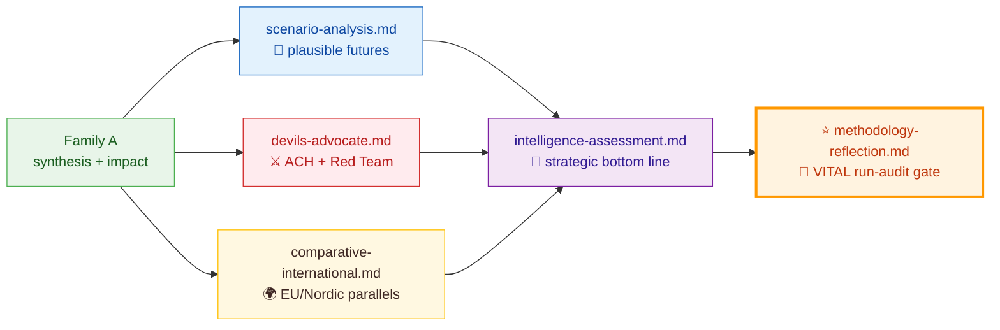
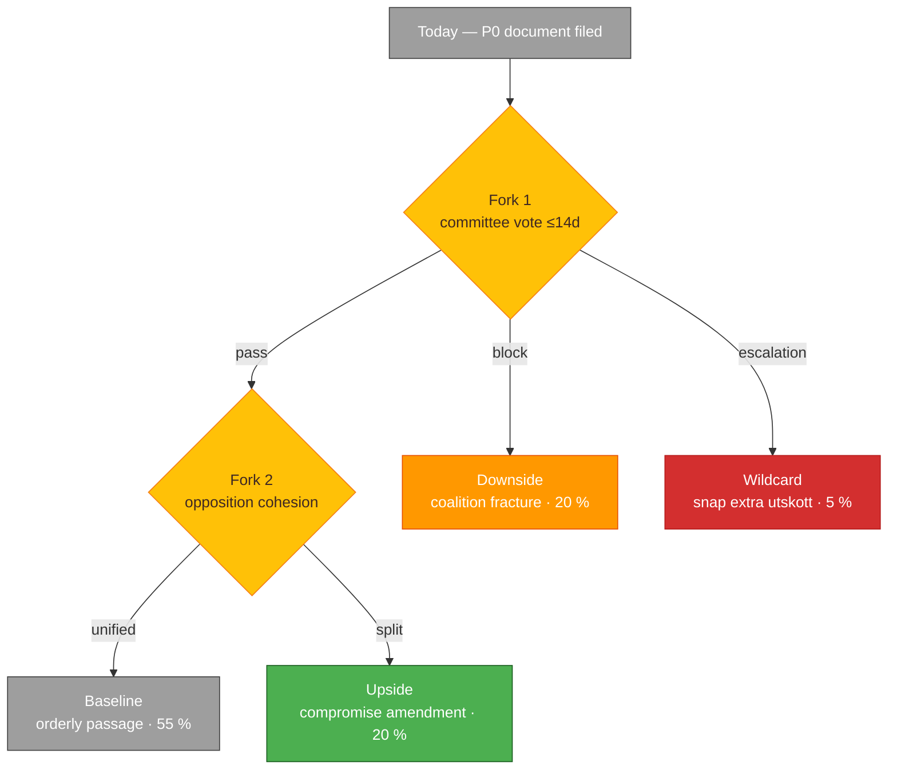
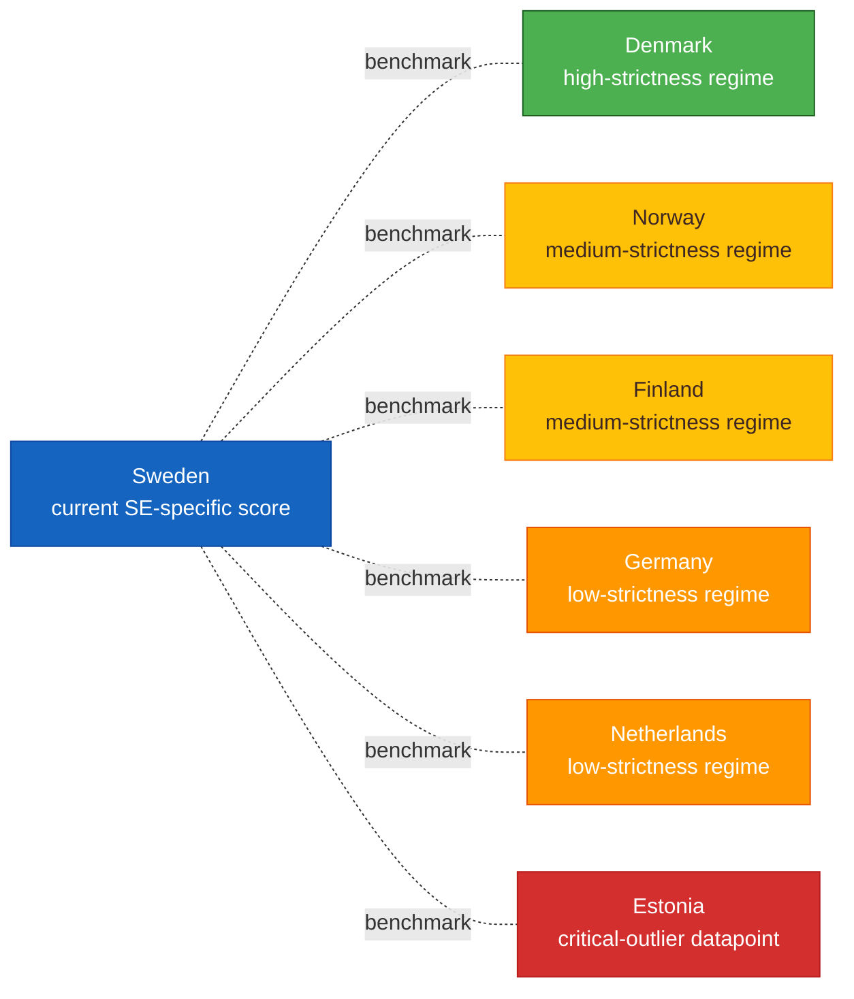
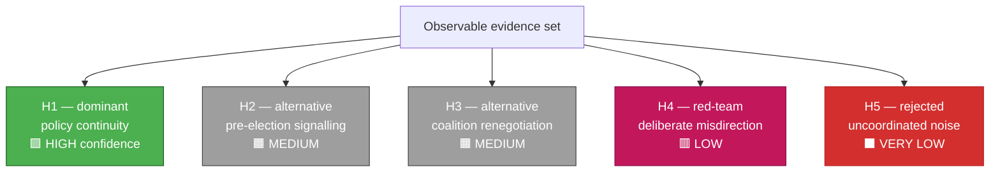
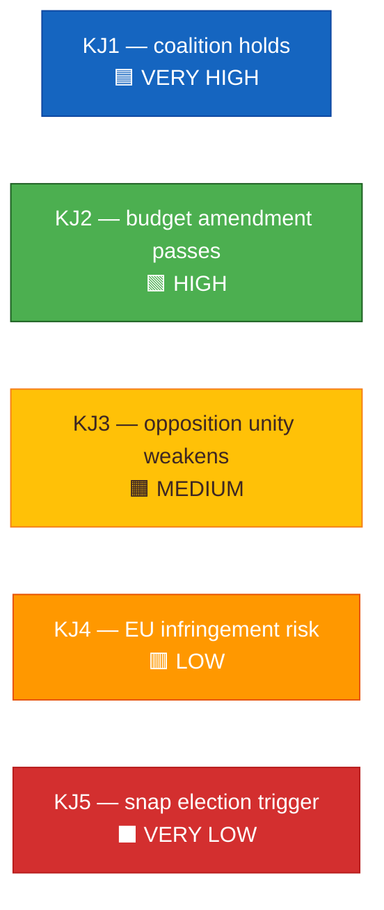
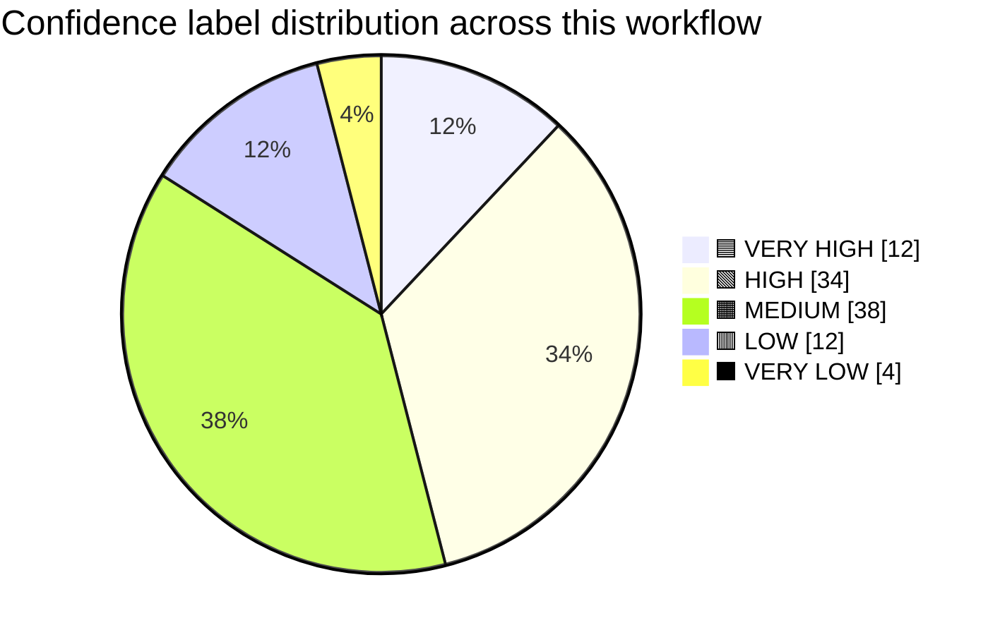
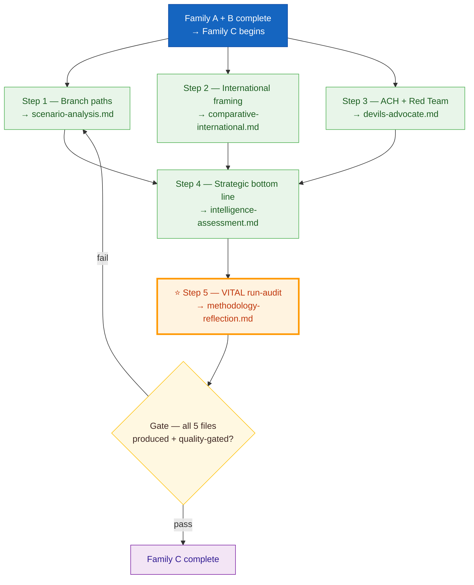

  

<h1 align="center">📙 Strategic Extensions Methodology</h1>

  <strong>📊 Family C — Depth Layer for High-Significance Events</strong> 
  <em>🎯 Scenario Analysis · Comparative International · Devil's Advocate (ACH) · Intelligence Assessment · Methodology Reflection</em>

  
  
  
  

**📋 Document Owner:** CEO | **📄 Version:** 1.0 | **📅 Last Updated:** 2026-04-21 (UTC)
**🔄 Review Cycle:** Quarterly | **⏰ Next Review:** 2026-07-21
**🏢 Owner:** Hack23 AB (Org.nr 5595347807) | **🏷️ Classification:** Public

---

## 🎯 Purpose

Family C delivers **analytic depth** when the daily event set warrants it. Where Family A narrates *what happened*, Family C answers:

- **What could happen next?** (scenario-analysis)
- **How does this compare internationally?** (comparative-international)
- **What are we getting wrong?** (devils-advocate — ACH)
- **What does this mean at the intelligence level?** (intelligence-assessment)
- **Was our process sound?** (methodology-reflection)

### Core — every run produces all 5

Family C files are **always produced on every workflow run**. They are not trigger-driven. Depth per file adapts to the day's DIW distribution, but the output set is stable: every folder ships `scenario-analysis.md`, `comparative-international.md`, `devils-advocate.md`, `intelligence-assessment.md`, and `methodology-reflection.md`.

| File | Behaviour on a light news day | Behaviour on a P0-dense day |
|------|-------------------------------|-----------------------------|
| `scenario-analysis.md` | Three scenarios converge on a narrow-band consensus; file documents why branching is low | Three divergent scenarios with probability-weighted indicators |
| `comparative-international.md` | Compares baseline Swedish position to ≥5 Nordic + EU peers | Peer-country reform response with deep causal analysis |
| `devils-advocate.md` | ACH on the day's #1 ranked document with ≥3 competing hypotheses | Full ACH on every P0 + red-team hypothesis + Bayesian base-rate check |
| `intelligence-assessment.md` | 3 Key Judgments tied to PIRs for the next 72 h | 5–7 Key Judgments with confidence + warning indicators + HUMINT/OSINT cross-checks |
| ⭐ `methodology-reflection.md` | **Vital run-audit gate.** Evidence sufficiency, confidence distribution, source diversity, party-neutrality arithmetic, ≥3 concrete methodology improvements for the next cycle | Same structure; skipping the file breaks the self-correction loop and fails the quality gate |

> ⭐ **`methodology-reflection.md` is vital.** It is the only file that audits the run itself. Treat a missing or stub `methodology-reflection.md` as a broken workflow and revise before commit. The Pass-2 rewrite in the AI-Driven Guide Step 7 reads this file before revising every other file.

---

## 🔮 Part 1 — Scenario Analysis (`scenario-analysis.md`)

### Purpose
Explore **≥3 plausible forward paths** for the top P0/P1 items over a 30–180 day horizon, each evidenced and each with pre-declared indicators so analysts can track which path materialises.

### Input
- significance-scoring.md (which items to scenario)
- synthesis-summary.md (current narrative baseline)
- stakeholder-perspectives.md (actor positions that drive branching)
- Historical baseline (Family D `historical-parallels.md` when available)

### Output — required structure

1. **Baseline (expected)** — the path implied by current stated positions + prior revealed preferences
2. **Upside** — a plausible path more favourable to democratic accountability / institutional strength
3. **Downside** — a plausible path more hostile to the status quo
4. **Wildcard** — low-probability / high-impact branch (≤10 % probability)
5. For **each** scenario:
   - Narrative (≤120 words)
   - Triggering events (≥3 concrete, each with a source or dated leading indicator)
   - Blocking events (what would make this scenario fail)
   - Probability (with 5-level confidence label)
   - Consequence summary (actor-by-actor, institution-by-institution)
   - Early-warning indicators (observable within 14 days)
6. **Scenario-probability Mermaid** — color-coded probability bar
7. **Branching decision Mermaid** — color-coded flowchart of key forks
8. **Cross-scenario comparison table** — impact × probability × reversibility

### Required Mermaid — branching paths

### Quality gate
- [ ] Probabilities sum to 100 %
- [ ] Each scenario has ≥3 named triggering events with sources
- [ ] Each scenario has ≥2 early-warning indicators with ISO dates
- [ ] Wildcard probability ≤10 %
- [ ] Blocking events named and sourced
- [ ] Cross-scenario table present

---

## 🌍 Part 2 — Comparative International (`comparative-international.md`)

**Filename variant:** `international-comparative.md` — identical structure.

### Purpose
Place the Swedish political event in **international context** so readers understand precedent, best practice, and likely interactions with EU / Nordic / OECD peers.

### Input
- synthesis-summary.md (current events)
- World Bank WGI indicators, IMF fiscal/monetary data, SCB cross-country comparables
- EU legislative database references (where EU law intersects)
- Named peer countries (default set: DK, NO, FI, DE, NL, EE for Nordic+Baltic-West benchmark)

### Output — required structure

1. **Issue framing** — ≤80 words: what is the Swedish question being compared?
2. **Peer-country evidence table** — for each peer country:
   - Country · Approach (brief) · Outcome (quantified) · Source · Applicability to Sweden
3. **Best-practice extraction** — three elements worth importing, with sources
4. **Incompatibility notes** — three elements that do not travel well, with reasons
5. **EU-law intersection** — directives, regulations, and open infringement procedures that apply
6. **Comparative Mermaid** — color-coded country grid on the chosen axis (e.g. policy permissiveness)
7. **Benchmark trend chart** — quantitative time-series Mermaid where World Bank / IMF data exists

### Required Mermaid — peer grid

### Quality gate
- [ ] ≥5 peer countries included (default Nordic+Baltic-West set is acceptable)
- [ ] Every peer row has a quantified outcome and a source URL
- [ ] Applicability column distinguishes constitutional, institutional, and operational transferability
- [ ] EU-law intersection lists specific directive/regulation numbers
- [ ] Benchmark chart included when World Bank / IMF data exists

---

## ⚔️ Part 3 — Devil's Advocate (`devils-advocate.md`)

### Purpose
Apply the **Analysis of Competing Hypotheses (ACH)** technique to stress-test the dominant interpretation of the day's events. Surfaces alternative explanations, red-teams the narrative, and quantifies residual uncertainty.

### Input
- synthesis-summary.md (candidate narrative)
- stakeholder-perspectives.md (declared positions)
- Family B cross-reference-map.md (coordinated-activity patterns)
- Open-source intelligence (OSINT) on actor history

### Output — required structure

1. **Dominant hypothesis (H1)** — the synthesis's main interpretation, stated in ≤40 words
2. **Alternative hypotheses (H2, H3, … Hn, n ≥ 3)** — each a genuinely different interpretation
3. **Evidence matrix** — rows: observable evidence items; columns: each hypothesis; cells: Supports (+), Contradicts (−), Ambiguous (~)
4. **Diagnostic value analysis** — each piece of evidence scored by how much it discriminates between hypotheses
5. **Residual uncertainty statement** — what would have to be true to flip the ranking
6. **Red-team section** — a maximally adversarial interpretation from the POV of a hostile actor
7. **Confidence summary** — per-hypothesis confidence label
8. **ACH Mermaid** — color-coded outcome network

### Required Mermaid — ACH outcome

### ACH scoring rules — positive-voice
- Produce an evidence matrix with at least 5 rows of diagnostic evidence
- Rank hypotheses by inconsistency score (fewer − cells wins)
- Call out the evidence item whose removal would flip the top-2 ranking — that's the "fragility point"
- Include a hypothesis that a hostile actor would push (Red Team H_n)
- Pre-declare a disconfirming observation that would reverse the assessment

### Quality gate
- [ ] n ≥ 3 alternative hypotheses, each substantively different
- [ ] Evidence matrix ≥5 rows × ≥4 hypothesis columns
- [ ] Fragility point identified
- [ ] Red-team hypothesis present with explicit "this is adversarial framing" label
- [ ] Residual uncertainty statement quantified

---

## 🎯 Part 4 — Intelligence Assessment (`intelligence-assessment.md`)

### Purpose
Deliver the **strategic bottom line** at intelligence-community quality: single assessment paragraph per question, confidence label, alternative view, and collection gap.

### Input
- synthesis-summary.md · stakeholder-impact.md · scenario-analysis.md · devils-advocate.md
- Behavioral-analysis insights (actor history, cognitive biases)
- Prior intelligence-assessment.md files from the last 30 days (for continuity)

### Output — required structure

1. **Key Judgments (KJs)** — 3–7 numbered paragraphs, each with:
   - Assertion (≤60 words)
   - Confidence label (5-level scale)
   - Key evidence (≥2 citations)
   - Alternative view (one sentence)
2. **Strategic implications** — 3 bullets on what this means for decision-makers over 30–180 days
3. **Collection gaps** — 3 explicit questions the evidence base does not answer
4. **Priority intelligence requirements (PIR)** — 3 things the next cycle should prioritise
5. **Tradecraft note** — which analytic techniques were applied (ACH, SWOT, PESTLE, Network, etc.)
6. **Intelligence Mermaid** — color-coded confidence bar per KJ

### Required Mermaid — KJ confidence

### Quality gate
- [ ] 3–7 Key Judgments
- [ ] Confidence labels distributed realistically (not all HIGH)
- [ ] Every KJ has ≥2 citations
- [ ] 3 collection gaps named
- [ ] 3 PIRs formatted as answerable questions
- [ ] Tradecraft note lists techniques explicitly

---

## 🔬 Part 5 — Methodology Reflection (`methodology-reflection.md`)

### Purpose
Transparent **analytic audit** of the workflow run — what worked, what didn't, what the next cycle must fix. This file is the platform's self-correction mechanism.

### Input
- All other outputs from the workflow
- Comparison with prior day's equivalent outputs
- Tool-call logs from the workflow runner
- Confidence-label distribution across outputs

### Output — required structure

1. **Evidence sufficiency audit** — for each Family A output, was evidence sufficient? (yes/no with reason)
2. **Confidence distribution** — histogram Mermaid of confidence labels across the workflow
3. **Source diversity** — percentage of claims from Riksdag API vs Regeringen vs SCB vs international
4. **Bias audit** — were all 8 parties given fair analytical depth given their evidence footprint? Quantify.
5. **Tradecraft audit** — which techniques were applied; which were skipped and why
6. **Forward methodology adjustments** — 3 concrete improvements for next cycle, each actionable
7. **Prior-period comparison** — what has the methodology done better / worse vs last workflow?

### Required Mermaid — confidence distribution

### Positive-voice bias audit rule
Produce a table of parties × claims-about-them × depth-score (words + citations) so a reader can see neutrality arithmetically. Acceptable outcome: no party's depth deviates from the evidence-weighted average by more than 25 %.

### Quality gate
- [ ] Evidence sufficiency assessed per Family A output
- [ ] Confidence distribution Mermaid present
- [ ] Source diversity percentages sum to 100 %
- [ ] Bias audit quantified with specific numbers
- [ ] ≥3 concrete methodology adjustments named for next cycle

---

## 🛠️ Production Workflow — step-by-step

---

## ✅ Family-C Completion Checklist

- [ ] `scenario-analysis.md` — ≥4 scenarios · probabilities sum to 100 % · branching Mermaid · early-warning indicators with ISO dates
- [ ] `comparative-international.md` — ≥5 peer countries · quantified outcomes · EU-law section · benchmark chart
- [ ] `devils-advocate.md` — n ≥ 3 hypotheses · evidence matrix ≥5 rows · fragility point · red-team hypothesis
- [ ] `intelligence-assessment.md` — 3–7 KJs · confidence labels · collection gaps · PIRs · tradecraft note
- [ ] `methodology-reflection.md` — evidence audit · confidence distribution · bias audit · forward adjustments
- [ ] All files use canonical color palette and 5-level confidence scale
- [ ] All files cross-link to Family A and Family B inputs

---

## 🔗 Template bindings

| Template | Methodology section |
|----------|--------------------|
| `analysis/templates/scenario-analysis.md` | Part 1 above |
| `analysis/templates/comparative-international.md` | Part 2 above |
| `analysis/templates/devils-advocate.md` | Part 3 above |
| `analysis/templates/intelligence-assessment.md` | Part 4 above |
| `analysis/templates/methodology-reflection.md` | Part 5 above |

---

## 📐 Cross-references to other methodology layers

- **Upstream:** [synthesis-methodology.md](./synthesis-methodology.md) (Family A) · [structural-metadata-methodology.md](./structural-metadata-methodology.md) (Family B)
- **Downstream / parallel:** [electoral-domain-methodology.md](./electoral-domain-methodology.md) (Family D — lens-specific extensions)
- **Frameworks:** [political-swot-framework.md](./political-swot-framework.md) · [political-risk-methodology.md](./political-risk-methodology.md) · [political-threat-framework.md](./political-threat-framework.md)
- **Master protocol:** [ai-driven-analysis-guide.md](./ai-driven-analysis-guide.md)

---

## 🔐 ISMS Alignment

| Control | How this methodology satisfies it |
|---------|----------------------------------|
| ISO 27001 A.5.7 (Threat intelligence) | Scenario + devils-advocate + intelligence-assessment constitute structured threat intelligence |
| ISO 27001 A.5.31 (Legal, regulatory) | Comparative-international maps EU-law intersection |
| NIST CSF ID.RA-3 (Threats identified) | ACH surfaces alternative threat interpretations |
| NIST CSF ID.RA-5 (Risks prioritised) | Scenario probabilities + impact enable risk ranking |
| CIS 17.5 (Incident response plan — decision support) | Intelligence-assessment maps to decision-support doctrine |
| GDPR Art. 35 DPIA methodology | Methodology-reflection provides audit trail |

---

## 📄 Document Control

**Owner:** CEO (Intelligence Program) · **Reviewer:** CISO + Chief Analyst · **Review Cycle:** Quarterly
**Next Review:** 2026-07-21 · **Related:** [ai-driven-analysis-guide.md](./ai-driven-analysis-guide.md), [synthesis-methodology.md](./synthesis-methodology.md), [electoral-domain-methodology.md](./electoral-domain-methodology.md)

---

*Generated following Riksdagsmonitor Strategic Extensions Methodology v1.0 — Family C Depth Layer.*
