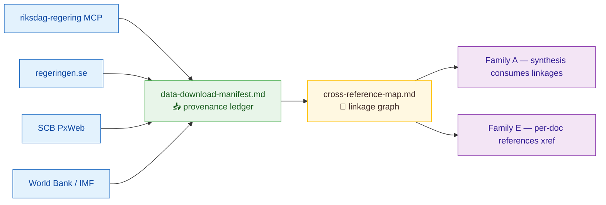
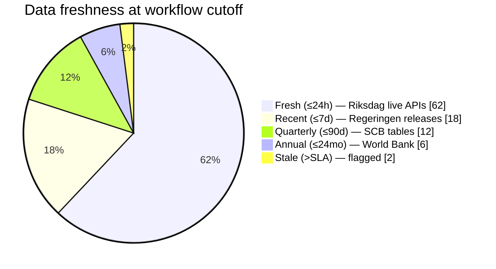
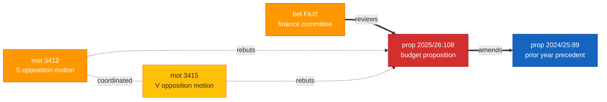
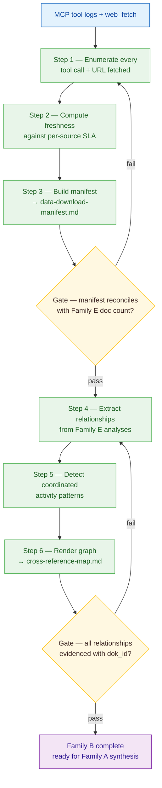

  

<h1 align="center">📗 Structural Metadata Methodology</h1>

  <strong>📊 Family B — Provenance & Linkage Layer</strong> 
  <em>🎯 Data Download Manifest · Cross-Reference Map</em>

  
  
  
  

**📋 Document Owner:** CEO | **📄 Version:** 1.1 | **📅 Last Updated:** 2026-04-21 (UTC)
**🔄 Review Cycle:** Quarterly | **⏰ Next Review:** 2026-07-21
**🏢 Owner:** Hack23 AB (Org.nr 5595347807) | **🏷️ Classification:** Public

---

## 🔄 Tradecraft Anchors

| Element | Value | Reference |
|---------|-------|-----------|
| **F3EAD Stage** | **FIND → FIX** | This methodology covers collection and document-identity establishment |
| **PIRs Served** | All PIRs — manifest establishes the evidence foundation for every PIR | See [`political-style-guide.md` §PIR/EEI Catalog](political-style-guide.md#-priority-intelligence-requirements-pir--essential-elements-of-information-eei) |
| **Admiralty Floor** | Data sources recorded with Admiralty code per Collection Management Matrix | See [`political-style-guide.md` §Collection Management Matrix](political-style-guide.md#%EF%B8%8F-collection-management-matrix) |
| **WEP Requirement** | N/A — structural metadata, no probability claims | — |
| **ICD 203 Gate** | Standard 1 (properly describe quality and reliability of underlying sources) | See [`political-style-guide.md` §ICD 203](political-style-guide.md#-icd-203-analytic-tradecraft-standards-mapping) |
| **SAT(s)** | Quality of Information Check | See [`political-style-guide.md` §SATs](political-style-guide.md#-structured-analytic-techniques-sats-catalog) |

---

## 🎯 Purpose

Family B establishes **data provenance and connective tissue** for every Riksdagsmonitor workflow. Without it, downstream Family A/C/D/E products have no auditable chain of custody and no way to detect cross-document patterns.

The two outputs work together:
- **`data-download-manifest.md`** — answers *"Where did this evidence come from, when, and is it verifiable?"*
- **`cross-reference-map.md`** — answers *"How do these documents relate to each other and to prior intelligence?"*

Both files are produced for every workflow run — daily, weekly, monthly, realtime.

---

## 📥 Part 1 — Data Download Manifest (`data-download-manifest.md`)

### Purpose
Maintain an **auditable ledger** of every piece of data that fed the workflow. The manifest is the single file a reviewer consults to answer "is this analysis reproducible from primary sources?".

### Input
- MCP tool-call logs from riksdag-regering, scb, world-bank, imf (bash script)
- Any `web_fetch` results from regeringen.se, riksdagen.se, myndighet sites
- Static reference files (SCB tables, World Bank indicators) with their version/vintage

### Output — required structure

1. **Summary header** — workflow name · run timestamp · data cutoff (CET) · record count
2. **Source-by-source table** — one row per source, columns:
   - `Source` · `Endpoint / MCP tool` · `Parameters` · `Records returned` · `Vintage / rm` · `Integrity (SHA or URL)` · `Retrieved at`
3. **Document ledger** — every `dok_id` touched with:
   - `dok_id` · `doktyp` · `titel` · `datum` · `direct URL` · `tool used` · `confidence that retrieval was complete`
4. **Stale-data flags** — any source older than its SLA (e.g. SCB table >90 days, World Bank >24 months) flagged with ⚠️
5. **Completeness Mermaid** — color-coded freshness ring/donut

### Required Mermaid — data freshness

### Provenance rules
- Every entry in the manifest **must** be retrievable later via its URL or MCP tool call
- Any transformation (filter, aggregation, derivation) is documented with a one-line explanation
- When a source returns zero records, that is recorded as an explicit empty-set row (not omitted)
- MCP tool calls use the exact parameter names from the MCP schema — no paraphrasing

### Quality gate
- [ ] Record count reconciles with the number of documents analysed in Family E
- [ ] Every `dok_id` in synthesis-summary.md appears in the document ledger
- [ ] No source missing `Retrieved at` timestamp
- [ ] Freshness Mermaid sums to 100 %
- [ ] All flagged stale sources have a replacement plan or documented acceptance

---

## 🔗 Part 2 — Cross-Reference Map (`cross-reference-map.md`)

### Purpose
Expose the **relational structure** of the evidence set so Family A synthesis can narrate patterns (bundles, coordinated filings, thematic clusters, rebuttals, continuations) and Family C/D products can detect coalition behaviour and temporal trends.

### Input
- Full Family E per-document analyses (they declare their referenced `dok_id`s)
- Previous 30 days of cross-reference-map.md files (to detect continuations)
- Party sponsorship metadata from `search_dokument`
- Committee (`organ`) routing

### Output — required structure

1. **Summary statistics** — node count, edge count, connected components, max in-degree document
2. **Relationship matrix** — one row per relationship type:
   - `Relationship` (bundle, rebuttal, amends, continues, coordinated-filing, thematic, committee-routed)
   - `Count` · `Strongest example with dok_id pair`
3. **Linkage graph Mermaid** — color-coded by relationship type, nodes sized/colored by significance tier
4. **Temporal chain table** — documents that continue or amend prior ones, with date deltas
5. **Coordinated-activity callouts** — patterns flagged for Family C devils-advocate / intelligence-assessment attention

### Required Mermaid — relationship-typed graph

### Relationship taxonomy (canonical — use these names exactly)
| Edge type | Meaning | Mermaid style |
|-----------|---------|---------------|
| `amends` | New doc modifies a prior binding instrument | solid bold arrow `==>` |
| `continues` | Follow-up action in ongoing legislative process | solid arrow `-->` |
| `rebuts` | Opposition filing directly against a government/majority doc | dotted arrow `-..->` |
| `coordinated-filing` | Two+ docs filed same day by aligned actors on same theme | dashed line `-.coord.-` |
| `bundle` | Docs released as a package by the same sponsor | solid line `---` with label |
| `thematic` | Shared policy domain without sponsor coordination | thin arrow `-->` |
| `committee-routed` | Shared organ path | annotation on node |

### Coordinated activity detection
Apply this rule set when ≥2 documents meet all conditions:
- Same `rm` (session) + same calendar date (±1 day)
- Same or adjacent policy domain (use classification-results.md taxonomy)
- Distinct sponsors from aligned or opposing blocs (not single-party duplicates)

When triggered, the map calls out the cluster and recommends Family C `devils-advocate.md` + `intelligence-assessment.md` be produced.

### Quality gate
- [ ] Every relationship has ≥1 concrete `dok_id` pair
- [ ] Graph is connected or explicitly notes isolated components
- [ ] Temporal chains include date deltas in days
- [ ] Coordinated-activity callouts name involved parties and sponsors
- [ ] Mermaid color/style map matches the canonical taxonomy above

---

## 🛠️ Production Workflow — step-by-step

### SLA table — data freshness tolerances

| Source | Fresh | Recent | Acceptable | Stale (flag) |
|--------|:-----:|:------:|:----------:|:------------:|
| Riksdag live APIs | ≤24 h | ≤7 d | ≤30 d | >30 d |
| Regeringen.se | ≤24 h | ≤7 d | ≤30 d | >30 d |
| SCB PxWeb | ≤7 d | ≤30 d | ≤90 d | >90 d |
| World Bank indicators | ≤12 mo | ≤24 mo | ≤36 mo | >36 mo |
| IMF WEO projections | ≤6 mo | ≤12 mo | ≤18 mo | >18 mo |

---

## ✅ Family-B Completion Checklist

- [ ] `data-download-manifest.md` — summary header · source table · document ledger · stale-flag section · freshness Mermaid
- [ ] `cross-reference-map.md` — stats · relationship matrix · graph Mermaid · temporal chain table · coordinated-activity callouts
- [ ] Every `dok_id` present in Family E is present in the document ledger
- [ ] Every edge in cross-reference-map has a concrete `dok_id` pair citation
- [ ] Stale-data flags either have a remediation plan or a documented acceptance
- [ ] Coordinated-activity callouts either trigger Family C or document why they do not

---

## 🔗 Template bindings

| Template | Methodology section |
|----------|--------------------|
| `analysis/templates/data-download-manifest.md` | Part 1 above |
| `analysis/templates/cross-reference-map.md` | Part 2 above |

---

## 📐 Cross-references to other methodology layers

- **Upstream:** Family E per-document analyses — see [per-document-methodology.md](./per-document-methodology.md)
- **Downstream:** Family A synthesis reads this layer first — see [synthesis-methodology.md](./synthesis-methodology.md)
- **Triggers:** Coordinated-activity detection routes to Family C — see [strategic-extensions-methodology.md](./strategic-extensions-methodology.md)
- **Master protocol:** [ai-driven-analysis-guide.md](./ai-driven-analysis-guide.md)

---

## 🔐 ISMS Alignment

| Control | How this methodology satisfies it |
|---------|----------------------------------|
| ISO 27001 A.5.12 (Classification of information) | Every data source tagged with freshness and confidence class |
| ISO 27001 A.5.14 (Information transfer) | Manifest records endpoints, parameters, timestamps — fully auditable |
| ISO 27001 A.8.15 (Logging) | Manifest is the workflow's append-only audit log |
| NIST CSF ID.AM-3 | Manifest enumerates every data asset used |
| NIST CSF PR.DS-6 | Integrity verification via SHA / URL for every record |
| CIS 3.1 + 8.1 | Data inventory + audit log management |
| GDPR Art. 5(1)(a)(c)(f) | Lawfulness + data minimisation + integrity documented per source |

---

## 📄 Document Control

**Owner:** CEO (Intelligence Program) · **Reviewer:** CISO + Data Engineering Lead · **Review Cycle:** Quarterly
**Next Review:** 2026-07-21 · **Related:** [ai-driven-analysis-guide.md](./ai-driven-analysis-guide.md), [synthesis-methodology.md](./synthesis-methodology.md)

---

*Generated following Riksdagsmonitor Structural Metadata Methodology v1.0 — Family B Provenance & Linkage Layer.*
