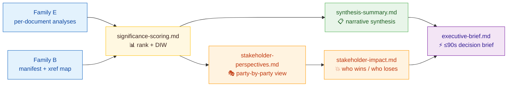
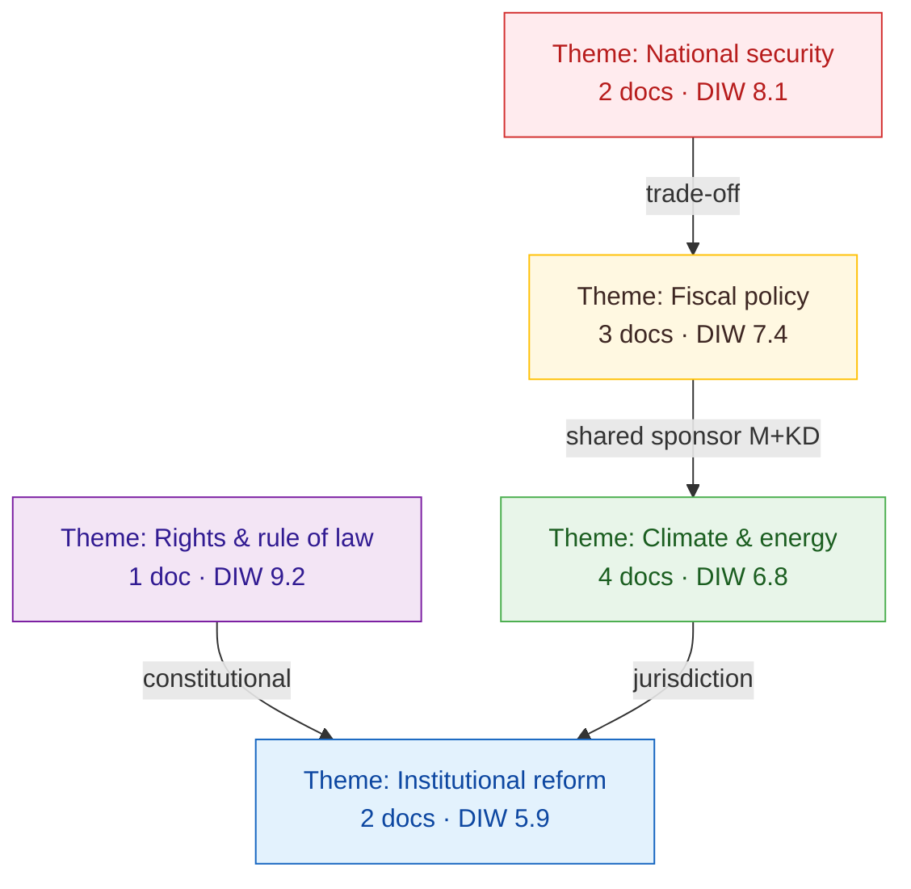
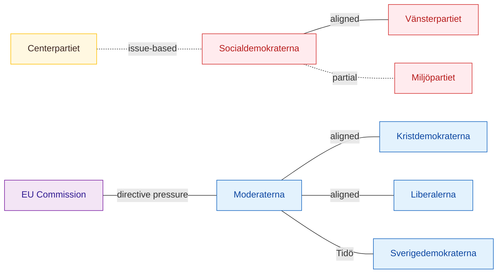
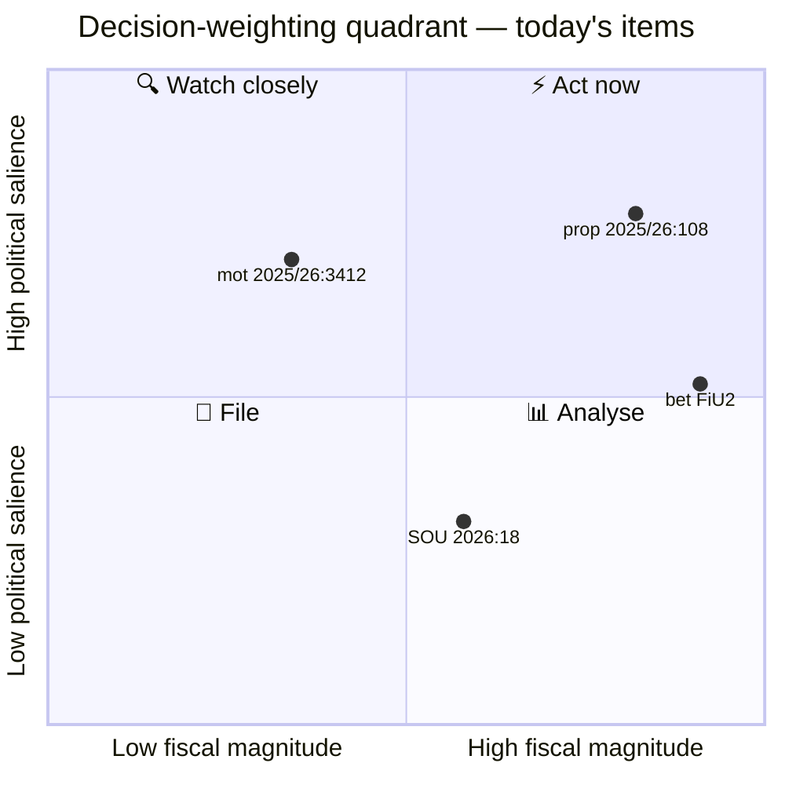
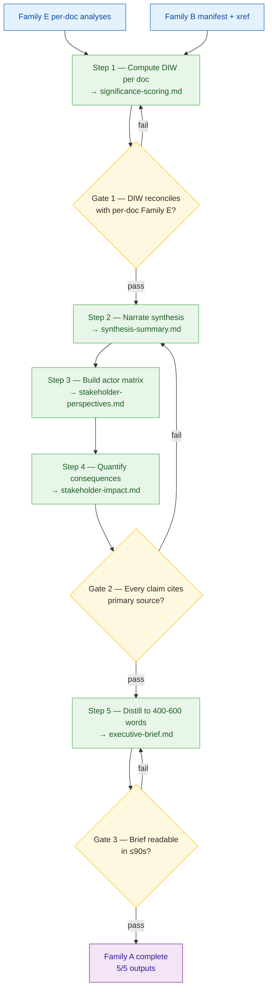

  

<h1 align="center">📘 Synthesis & Scoring Methodology</h1>

  <strong>📊 Family A — Core Synthesis Layer</strong> 
  <em>🎯 Significance Scoring · Synthesis Summary · Executive Brief · Stakeholder Perspectives · Stakeholder Impact</em>

  
  
  
  

**📋 Document Owner:** CEO | **📄 Version:** 1.3 | **📅 Last Updated:** 2026-04-25 (UTC)
**🔄 Review Cycle:** Quarterly | **⏰ Next Review:** 2026-07-21
**🏢 Owner:** Hack23 AB (Org.nr 5595347807) | **🏷️ Classification:** Public

---

## 🔄 Tradecraft Anchors

| Element | Value | Reference |
|---------|-------|-----------|
| **F3EAD Stage** | **ANALYZE → DISSEMINATE** | This methodology covers the synthesis and dissemination phases of the intelligence cycle |
| **PIRs Served** | PIR-1 (Coalition Stability), PIR-5 (Fiscal Trajectory), PIR-7 (Democratic Norms) — all PIRs inform synthesis | See [`political-style-guide.md` §PIR/EEI Catalog](political-style-guide.md#-priority-intelligence-requirements-pir--essential-elements-of-information-eei) |
| **Admiralty Floor** | Evidence must reach **[B2]** or higher for inclusion in executive brief | See [`political-style-guide.md` §Admiralty Code](political-style-guide.md#-admiralty-source-reliability-code-nato-stanag-2022) |
| **WEP Requirement** | All forward-looking claims use WEP probability language | See [`political-style-guide.md` §WEP + ODNI](political-style-guide.md#-words-of-estimative-probability-wep--odni-confidence-overlay) |
| **ICD 203 Gate** | Standards 5 (customer relevance), 6 (logical argumentation), 8 (accurate judgments) | See [`political-style-guide.md` §ICD 203](political-style-guide.md#-icd-203-analytic-tradecraft-standards-mapping) |
| **SAT(s)** | Key Assumptions Check (synthesis-summary), Brainstorming (stakeholder-perspectives) | See [`political-style-guide.md` §SATs](political-style-guide.md#-structured-analytic-techniques-sats-catalog) |

---

## 🎯 Purpose

This methodology governs the **Family A — Core Synthesis layer** of every Riksdagsmonitor analysis workflow. The synthesis layer turns raw per-document evidence (Family E) and structural metadata (Family B) into **decision-ready intelligence products** that answer four questions:

1. **What happened today?** (synthesis-summary.md)
2. **Which items matter most?** (significance-scoring.md)
3. **Who is affected and how?** (stakeholder-perspectives.md + stakeholder-impact.md)
4. **What should a decision-maker do in ≤90 seconds of reading?** (executive-brief.md)

Every output in this family is produced for every daily workflow — no exceptions.

---

## 📐 Evidence & Confidence Standards

All outputs in this family inherit the platform-wide rules:

| Rule | Applied To |
|------|-----------|
| Every claim cites a `dok_id`, named actor with party, vote count, `rm` session, or primary-source URL | All five outputs |
| 5-level confidence scale — 🟦 VERY HIGH / 🟩 HIGH / 🟧 MEDIUM / 🟥 LOW / ⬛ VERY LOW | Required per scored row |
| Color-coded Mermaid using the canonical palette from the AI-Driven Analysis Guide | ≥1 per output |
| Swedish policy terms glossed on first use (e.g. *jobbskatteavdrag* — earned-income tax credit) | Synthesis + executive brief |
| Party neutrality — equal analytical depth for S, M, SD, C, V, KD, MP, L when evidence supports coverage | All outputs |

---

## 🔢 Part 1 — Significance Scoring (`significance-scoring.md`)

### Purpose
Rank every document processed in the workflow so downstream products (synthesis, executive brief) can focus attention where it matters. Significance scoring is the **single source of truth** for document priority across Family A, C, and D products.

### Input
- All Family E per-document analyses produced during the workflow
- Family B cross-reference-map.md (to detect bundle / coordinated activity multipliers)
- Voting data for each document (when applicable)

### Output — required structure

1. **Scoring matrix table** — one row per document, columns:
   - `Rank` · `dok_id` · `Title (short)` · `Doctype` · `Democratic-Impact Weight (DIW)` · `Tier` · `Confidence` · `Top rationale (≤15 words)`
2. **Tier distribution summary** — count of P0 / P1 / P2 / P3 documents
3. **DIW color-coded distribution** — horizontal bar Mermaid using the canonical palette
4. **Drivers of top-ranked items** — bulleted rationale for every P0 + P1 entry with `dok_id` citations

### DIW formula — canonical

Democratic-Impact Weight (DIW) is scored 0.0 – 10.0 along six dimensions, each 0.0 – 1.0 normalised, summed, then multiplied by 10 ÷ 6 for the final 0–10 scale:

| Dimension | Weight | Example high-score indicator |
|-----------|:------:|-------------------------------|
| 🏛️ Institutional reach | 1.0 | Constitutional change, election-law amendment, agency mandate |
| ⚖️ Rights & freedoms impact | 1.0 | GDPR article 9 data, speech, assembly, due process |
| 💰 Fiscal magnitude | 1.0 | ≥1% of statsbudget or ≥50 000 direct beneficiaries |
| 🗳️ Electoral salience | 1.0 | Pre-election window + top-10 voter-priority issue |
| 🔀 Coalition pressure | 1.0 | Forces deviation from Tidöavtalet or opposition red line |
| 📡 Media resonance | 1.0 | Coordinated opposition response or government flagship announcement |

#### Worked example — DIW computation

Suppose `prop. 2025/26:113` raises the wealth-tax threshold from SEK 1.5M to SEK 5.0M. Score each dimension on the 0.0 – 1.0 anchor scale (0.0 = no signal, 0.5 = moderate, 0.8 = clearly material, 1.0 = exemplar):

| Dimension | Score | Why |
|-----------|:----:|-----|
| Institutional reach | 0.5 | Tax-code amendment — touches statutory framework but no constitutional change |
| Rights & freedoms | 0.2 | Distributional, not rights-based |
| Fiscal magnitude | 0.9 | ~SEK 8 bn / yr ≈ 0.4 % of statsbudget × 5-yr horizon = clearly material |
| Electoral salience | 0.8 | Pre-election window + #4 voter-priority issue per SCB-Kantar Apr-2026 |
| Coalition pressure | 0.7 | M/KD/L aligned; SD ambivalent on top quintile carve-out — friction but not a red-line breach |
| Media resonance | 0.7 | DN, SvD, Aftonbladet leaders Day 0; Ekot Day 0+1 |
| **Sum** | **3.8** | |
| **DIW = (3.8 / 6) × 10** | **6.33** | **P1 — High** (triggers scenario + devils-advocate + stakeholder-impact) |

The rationale for each anchor score MUST cite `dok_id` + at least one named actor. Anchor scores must not be back-fitted to a target tier; if you find yourself inflating Coalition pressure to push a P2 into P1, write the explanation honestly and let the score sit. Calibration debt accumulates fast — it is preferable to have a borderline 5.9 documented honestly than a 6.1 that does not survive Pass-2 scrutiny.

#### Winner / loser quantification rubric

Every P0/P1 ranking row MUST narrate **who wins** and **who loses** in concrete, quantifiable terms before any forward-looking implication is drawn. The rubric:

| Axis | Required form | Example |
|------|---------------|---------|
| **Identity** | Named actors (party, ministry, committee, sector, demographic), not abstract groups | "M/KD/L coalition + top-decile income earners" not "the right" |
| **Magnitude** | A unit (SEK, % of voters, # of MPs, # of beneficiaries) and a horizon | "+ SEK 8 bn / yr from 2027 budget for top-decile" |
| **Direction** | Win / loss / mixed, with sign | "Win for top decile; loss for tax-revenue projection" |
| **Confidence** | 5-level label backed by evidence reliability, not advocacy | 🟩 HIGH — RUT-utvärdering 2024 + FiU's own modelling |
| **Counter-narrative** | One named actor's framed dissent | Quote V's Karin Pernebo (2026-04-22) on distributional effect |

A synthesis ranking that names only winners and not losers (or vice versa) **fails the gate**: politics is zero-sum or near-zero-sum on most material questions, and asymmetric narration is itself a tradecraft tell. When the distribution is genuinely diffuse (e.g. an information-policy bill), say so explicitly with the phrase "diffuse-impact — no quantifiable concentrated win/loss" and back it with evidence.

### Tier mapping
- **P0 (Critical, DIW ≥ 8.0)** → triggers every Family C + D template
- **P1 (High, 6.0 ≤ DIW < 8.0)** → triggers scenario, devils-advocate, stakeholder-impact
- **P2 (Medium, 4.0 ≤ DIW < 6.0)** → synthesised only
- **P3 (Low, DIW < 4.0)** → listed in manifest, not narrated

### Quality gate
- [ ] Every document has a DIW in [0.0, 10.0]
- [ ] DIW cross-checks against Family E per-doc significance — ≤1.0 variance or reconciled
- [ ] Tier counts reconcile with Family B manifest total document count
- [ ] Top three rationales each cite ≥1 `dok_id` and ≥1 named actor

---

## 📋 Part 2 — Synthesis Summary (`synthesis-summary.md`)

### Purpose
Produce the **canonical narrative** of the day/week/cycle. Every other Family A product derives its headline from this file.

### Input
- significance-scoring.md (drives ordering)
- All Family E analyses (drives substance)
- Family B cross-reference-map.md (drives "bundle" and "pattern" callouts)
- Previous 5 workdays' synthesis-summary files (drives trend narration)

### Output — required structure

1. **Executive summary** — 3 paragraphs, inverted-pyramid, each opening sentence citing a `dok_id` or named vote
2. **Strategic finding cards** — 3–7 cards, one per major theme; each card contains:
   - Finding (≤40 words) · Evidence (≥2 `dok_id` or votes) · Confidence label · Dissenting view · Forward indicator
3. **Pattern table** — coordinated filings, cross-party agreement, government flagship clusters
4. **Mermaid thematic graph** — color-coded nodes by theme, edges by cross-reference strength
5. **Links** to: executive-brief.md, stakeholder-perspectives.md, scenario-analysis.md (always produced, Family C), Family E index
6. **Methodology footer** — models used, sources, cutoff time

### Required Mermaid — thematic graph example

### Quality gate
- [ ] Top-ranked P0/P1 items from significance-scoring appear in the first 5 strategic finding cards
- [ ] Every card cites ≥2 primary sources
- [ ] Confidence labels distributed realistically (not every card "HIGH")
- [ ] Swedish terms glossed on first use
- [ ] Thematic Mermaid includes all themes mentioned in cards

---

## 🎭 Part 3 — Stakeholder Perspectives (`stakeholder-perspectives.md`)

### Purpose
Document **how every actor with material stake** interprets the day's findings — from their documented position, not the analyst's projection.

### Input
- significance-scoring.md (drives which items to cover)
- search_anforanden + search_dokument output per party for the covered `rm`
- Family E per-doc analyses (carry party statements)
- SCB / Opinionsläget polling (where identity of affected group matters)

### Output — required structure

1. **Actor × Issue matrix** — rows: actors (8 Riksdag parties + government + key myndigheter + EU + external); columns: top 5 issues from significance-scoring
   - Cell contents: stance glyph (✅ support · 🟧 conditional · 🟥 oppose · ⬜ silent) + 1-line rationale with source
2. **Deep profiles** — one per tier-1 actor (government + each of the 8 parties) with:
   - Documented position (`dok_id`, anförande quote, press release URL)
   - Strategic rationale (why they hold this position — supported by voting history)
   - Internal tension indicators (where party cohesion is stressed)
   - Forward move (likely next action in 7–30 days, labelled with confidence)
3. **Cross-actor alignment Mermaid** — color-coded edges (green = alignment, red = conflict, yellow = partial)
4. **Links** to stakeholder-impact.md (material consequences) and synthesis-summary.md

### Required Mermaid — actor alignment

### Quality gate
- [ ] All 8 Riksdag parties covered (even if "silent" with rationale)
- [ ] Every stance has a source citation
- [ ] Internal tension section present for any party whose vote split >5% on this cycle's items
- [ ] Forward-move predictions include confidence labels and time windows

---

## 💥 Part 4 — Stakeholder Impact (`stakeholder-impact.md`)

### Purpose
Translate political positions into **material consequences** for citizens, sectors, and institutions. Where stakeholder-perspectives answers "who thinks what", stakeholder-impact answers **"who wins, who loses, by how much, when"**.

### Input
- stakeholder-perspectives.md (actor list)
- significance-scoring.md (which documents have measurable impact)
- SCB microdata, World Bank, IMF for quantitative scale
- Family E per-document implementation feasibility sections

### Output — required structure

1. **Impact matrix** — rows: affected group; columns: magnitude · direction · timeline · reversibility · affected count · confidence
2. **Winners & losers panel** — top 5 winners, top 5 losers, with:
   - Quantified benefit/loss (SEK, beneficiary count, service-level change)
   - Evidence (SCB, Riksrevisionen, budget-proposition math)
   - Confidence label
3. **Sector heat map** — Mermaid with color-coded impact intensity
4. **Equity lens** — impact disaggregated by income quintile, region (storstad/glesbygd), age group, gender where data allows
5. **Mitigations / compensations** — government-offered offsets with `dok_id`
6. **Links** to implementation-feasibility.md (Family D, always produced)

### Required Mermaid — sector heat map

### Quality gate
- [ ] ≥1 quantitative figure per winner/loser row
- [ ] ≥1 equity-lens cut where SCB data exists
- [ ] Reversibility assessed (one-shot / ongoing / multi-cycle)
- [ ] Mitigations cited with `dok_id` or confirmed absence

---

## ⚡ Part 5 — Executive Brief (`executive-brief.md`)

### Purpose
Deliver a **≤90-second read** that gives a decision-maker the day's intelligence takeaway. If a reader only reads one file, this is it.

### Input
- synthesis-summary.md (for the canonical narrative)
- significance-scoring.md (for the ranked items)
- stakeholder-impact.md (for the consequence line)
- Family C scenario-analysis.md (always produced) for futures paragraph

### Output — required structure (strict 400–600 word budget)

1. **Top line** — single-sentence headline of the day (≤25 words)
2. **Three bullets — the only three things that matter** — each ≤30 words, each citing a `dok_id` or named vote
3. **So what? paragraph** — consequences for the next 7–30 days
4. **Watch-list** — 3–5 forward indicators (from Family D `forward-indicators.md` when present) with dates
5. **One chart** — a single Mermaid diagram (color-coded) — usually a quadrant or a short timeline
6. **Links** to: synthesis-summary.md, significance-scoring.md, stakeholder-impact.md, scenario-analysis.md

### Required Mermaid — decision quadrant example

### Quality gate
- [ ] Word count within 400–600
- [ ] Every bullet has a primary-source citation
- [ ] No claim without a corresponding entry in synthesis-summary.md
- [ ] Mermaid diagram readable at a glance (≤10 nodes)
- [ ] Watch-list items have ISO dates

---

## 🛠️ Production Workflow — step-by-step

### Typical time budget (automated workflow, single day)
| Step | Share of Family A runtime |
|------|:-------------------------:|
| Step 1 — Significance scoring | 20 % |
| Step 2 — Synthesis summary | 35 % |
| Step 3 — Stakeholder perspectives | 15 % |
| Step 4 — Stakeholder impact | 15 % |
| Step 5 — Executive brief | 15 % |

---

## ✅ Family-A Completion Checklist

- [ ] `significance-scoring.md` — matrix · distribution chart · tiers · rationale per P0/P1
- [ ] `synthesis-summary.md` — 3-paragraph exec summary · 3–7 finding cards · pattern table · thematic Mermaid
- [ ] `stakeholder-perspectives.md` — actor × issue matrix · deep profile per tier-1 actor · alignment Mermaid
- [ ] `stakeholder-impact.md` — impact matrix · winners/losers · sector heat-map Mermaid · equity lens
- [ ] `executive-brief.md` — 400–600 words · 3 bullets · so-what · watch-list · 1 Mermaid
- [ ] Every file passes evidence gate (primary-source citations)
- [ ] Every file passes confidence-label gate (5-level scale)
- [ ] Every file uses canonical color palette
- [ ] All 5 files cross-linked to each other and back to Family B/E

---

## 🔗 Template bindings

| Template | Methodology section |
|----------|--------------------|
| `analysis/templates/significance-scoring.md` | Part 1 above |
| `analysis/templates/synthesis-summary.md` | Part 2 above |
| `analysis/templates/stakeholder-impact.md` | Part 4 above (also covers `stakeholder-perspectives.md`) |
| `analysis/templates/executive-brief.md` | Part 5 above |

---

## 📐 Cross-references to other methodology layers

- **Upstream (inputs):** [per-document-methodology.md](./per-document-methodology.md) (Family E) · [structural-metadata-methodology.md](./structural-metadata-methodology.md) (Family B)
- **Downstream (always produced on every run):** [strategic-extensions-methodology.md](./strategic-extensions-methodology.md) (Family C) · [electoral-domain-methodology.md](./electoral-domain-methodology.md) (Family D)
- **Style & voice:** [political-style-guide.md](./political-style-guide.md)
- **Master protocol:** [ai-driven-analysis-guide.md](./ai-driven-analysis-guide.md)

---

## 🔐 ISMS Alignment

| Control | How this methodology satisfies it |
|---------|----------------------------------|
| ISO 27001 A.5.23 (Information security for use of cloud services) | All sources are public cloud APIs with documented endpoints in manifest |
| ISO 27001 A.5.34 (Privacy and PII protection) | Stakeholder profiles handle political-opinion data under GDPR Art. 9(2)(e)/(g); data minimisation enforced |
| NIST CSF ID.RA-4 | Significance scoring = continuous risk assessment of institutional activities |
| NIST CSF DE.AE-3 | Cross-party alignment Mermaid supports anomaly detection |
| CIS 3.1 Data management process | Provenance enforced via Family B manifest linkage |

---

## 📄 Document Control

**Owner:** CEO (Intelligence Program) · **Reviewer:** CISO + Editorial Lead · **Review Cycle:** Quarterly
**Next Review:** 2026-07-21 · **Related:** [ai-driven-analysis-guide.md](./ai-driven-analysis-guide.md), [political-style-guide.md](./political-style-guide.md)

---

*Generated following Riksdagsmonitor Synthesis & Scoring Methodology v1.0 — Family A Core Synthesis Layer.*
